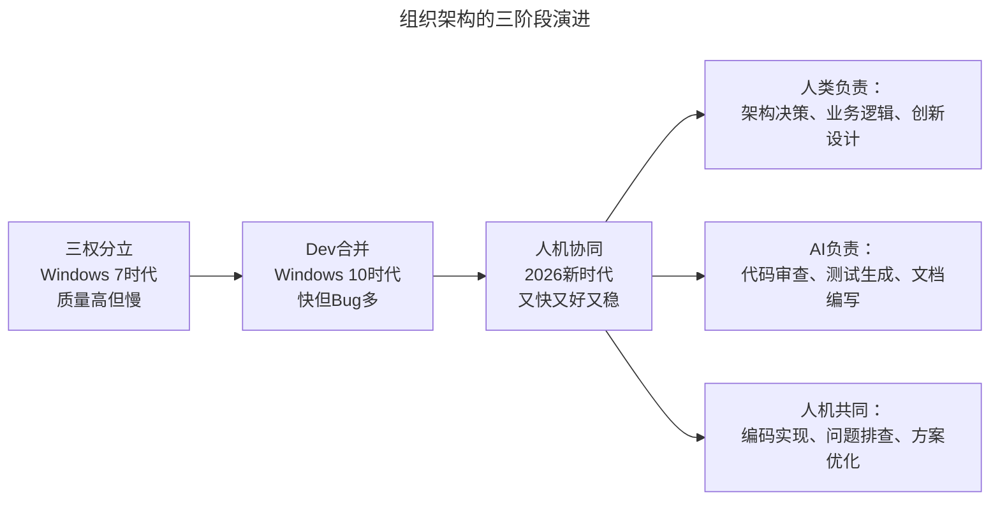
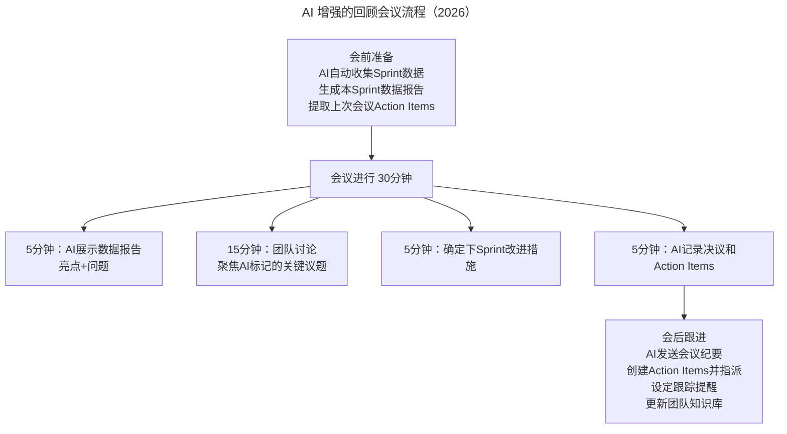

# 提升技术团队效率的组织与流程设计

> **适用范围**：技术管理者、研发负责人、项目经理，适用于需要选择和优化组织架构与开发流程的各类技术团队。

> **更新摘要（v2 · 2026-08 更新）**：在原文"组织、流程"两大效率提升方向基础上，整合 AI 时代人机协同组织架构、AI-Augmented Scrum 实践、AI 增强决策矩阵等内容，补充从三权分立到人机协同的演进路径、AI 增强看板对比、Sprint Planning AI 化流程及具体效率提升数据。

## 一、导言

任何管理方法都有前提。技术团队的组建分两个方向：刘国梁团队式层层筛选精兵强将，或西游记团队式各有亮点互为补充。技术团队做的事也分两个方向：项目方向（甲方委托乙方按要求开发）与产品方向（自研自运营）。对具体事情的要求也分两个方向：追求质量（硬件驱动、飞机发动机）与追求效率（互联网应用）。

这些方向不是非黑即白的，不建议给自己或团队贴标签。如果打上某个标签，思考问题时容易将思维局限在某一个区域。高效最重要的是选择最适合自己的流程与方法来达到比之前更理想的效率。例如电商平台属于互联网应用，但和钱相关的部分仍需关注质量，只追求效率可能导致巨额亏损。

高效的定义是：更快的将事情做对、做好。产出要快、内容要对、质量要好，又快、又好、又有价值。效率=有效工作量/工作时间，注意是有效工作量而非总工作量。记录团队每个成员所做的工作与耗时，每周分析一次，一定能分析出哪些是无效或可以不做的工作。

2026 年 AI 时代，效率公式升级为：效率=（人类有效工作量+AI 有效产出）/（工作时间×（1-AI 节省比例））。AI 的介入让组织和流程优化的杠杆效应成倍放大，2026 年的效率提升不再是简单的"选对方法论"，而是如何在每种方法论中都最大化地发挥 AI 的增强作用。

## 二、核心方法论

### 2.1 组织架构选择与 AI 时代第三条路

原文通过微软案例说明组织对效率的影响。Windows 7 以前微软采用"三权分立"组织架构——开发、测试和程序经理各司其职、互相制衡，好处是确保质量（任何质量问题测试不通过就无法发布），问题是各自目标不同、互相扯皮、效率低下。后来微软将开发部门和测试部门合并，大大提升研发效率、加快发布频率，但 Bug 量明显上升。基本道理是：越集权越高效但风险越高，反之亦然，没有对错只有是否适合。

AI 时代出现了第三条路——人机协同组织。人类负责架构决策、业务逻辑、创新设计；AI 负责代码审查、测试生成、文档编写；人机共同完成编码实现、问题排查、方案优化。这种架构兼具质量高（AI 质量把关）、速度快（AI 自动化）、风险可控（人类最终审核）的优势。

三种架构各有适用场景：三权分立适合金融、安全关键系统（AI 可承担程序经理部分工作）；Dev 合并适合互联网产品迭代（AI 可补充质量保障能力）；人机协同适合技术驱动型企业（理想状态，持续优化）。AI 时代的组织架构选择新增"团队 AI 能力"作为极高权重决策因子——团队 AI 能力决定了 AI 能发挥多大作用。

### 2.2 流程选型与 AI 时代方法论光谱

流程与组织架构一样，不同流程对效率影响很大。原文经验：2013 年前用 CMMI（Capability Maturity Model Integration）模型，适合计划驱动、高质量要求、需求变化少、团队规模大的项目；2013 年后转入 Scrum 框架，适合质量要求相对较低、需求变化频繁、团队规模小的项目。多种方法可结合使用。基本道理是：流程越短效率越高但风险越大。

AI 时代的方法论光谱从瀑布式（Waterfall）→敏捷（Scrum/Kanban）→DevOps（CI/CD）→AI-Native（CI/CD/AI+Agent）逐步演进。每种方法论都被 AI 增强：瀑布式的文档工作量问题被 AI 自动生成文档和智能影响分析解决（文档效率 5-10 倍）；Scrum 的估算不准问题被 AI 精准估算解决（Sprint 达成率+30%）；Kanban 的瓶颈识别问题被 AI 瓶颈预警解决（流动效率+40%）；DevOps 的部署风险问题被 AI 发布风险评估和 AIOps 自愈解决（MTTR 降低 75%）。

### 2.3 Scrum 框架的 AI 深度增强

原文详细分享了 Scrum 的三个角色与五大会议。Scrum 三角色——Product Owner（需求拆解为用户故事）、Scrum Master（教练，引导团队按规则推进）、Scrum Team（6-8 人，各有分工目标一致）——在 AI 时代均获得增强：PO 增加 AI 需求分析助手和 AI 市场洞察；SM 增加 AI 流程监控和 AI 资源协调；Team 增加 AI Pair Programming 伙伴。

Sprint Planning 的 AI 增强流程将传统 1.5-2.5 小时缩短至 25-40 分钟：PO 输入目标后，AI 预分析 Story 复杂度、依赖关系、风险标记（5 分钟）；团队讨论 AI 建议（15 分钟）；AI 辅助 Task 分解与估算（20 分钟）；AI 自动生成 Sprint 计划文档（0 人工）。Story 评估从 30-45 分钟缩短至 5-10 分钟（-75%），Task 分解从 30-60 分钟缩短至 15-20 分钟（-60%），工作量估算从 20-30 分钟缩短至 5-10 分钟（-65%），计划文档整理从 15-20 分钟变为自动生成（-100%）。

## 三、关键流程

### 3.1 Sprint Planning 流程

Sprint Planning 的 AI 增强流程形成"AI 预分析→团队讨论→AI 辅助分解→自动文档"的闭环。原文要求估算点数大于 13 时任务必须拆分或简化，建议控制在 8 以内，目的是确保功能简单、任务不跨天完成。AI 增强后，AI 基于历史数据给出估算参考值，Poker Planning 通常一轮即可对齐。

### 3.2 每日站会与看板流程

原文使用物理白板，便签纸包含用户故事编号、优先级编号、任务名和点数。每日例会围绕白板，每人说明昨天做了什么、今天做什么、有什么障碍，按优先级领取任务并写上名字。好处是信息完全透明、承诺意识强。

AI 时代建议保留物理白板的"仪式感"，但用 AI 工具做实际数据管理和追踪。AI 增强看板（如 Linear AI）相比物理白板和传统数字化看板，在状态更新（AI 自动感知代码提交并更新）、任务分配（AI 根据技能和负载推荐）、进度追踪（AI 预测完成概率+风险预警）、阻塞识别（AI 自动检测依赖阻塞）方面具有显著优势。远程协作场景下，AI 增强看板还支持 AI 会议助理。

### 3.3 回顾会议流程

回顾会议的 AI 增强将会前准备时间从 1-2 小时降为 0（AI 自动完成），会议本身从 2 小时缩短至 30 分钟。AI 收集的数据包括 Velocity（实际 vs 预期）、Bug 数和质量指标、Code Review 通过率、团队成员贡献度分析、阻塞问题和解决时间。原文不建议上级管理者参加回顾会议，因为上级管理者与团队成员利益相关，会影响敞开心扉。AI 时代这一原则依然成立——AI 是工具不是管理者，能保持讨论的客观性。

## 四、工具与实战

### 4.1 组织架构决策工具

组织架构选择应基于业务质量要求、速度要求、团队规模、团队 AI 能力、合规要求、创新需求六个维度的综合评估。AI 时代团队 AI 能力成为极高权重因子。可借助 AI 辅助决策：向 AI 描述团队规模、业务特点、质量要求、速度压力等，AI 基于分析给出推荐架构、质量保障方案、流程优化建议及注意事项。

### 4.2 流程工具对比

| 维度 | 物理白板 | 数字化看板 | AI 增强看板 |
|-----|---------|----------|-----------|
| 状态更新 | 手动移动便签 | 点击拖拽 | AI 自动感知代码提交 |
| 任务分配 | 手写名字 | 下拉选择 | AI 根据技能负载推荐 |
| 进度追踪 | 人工观察 | Burn-down 图 | AI 预测完成概率+风险预警 |
| 阻塞识别 | 口头汇报 | 标记 Blocker | AI 自动检测依赖阻塞 |
| 数据留存 | 拍照存档 | 永久保存 | 永久保存+AI 可查询分析 |
| 团队氛围 | 强 | 中 | 中强（可通过线下仪式弥补）|

### 4.3 效率提升行动清单

**立即行动（本周）**：为团队成员配置 AI 编程助手；在下一个 Sprint Planning 中试用 AI 辅助估算；尝试用 AI 工具自动生成会议纪要。

**短期改进（1 个月内）**：评估当前组织架构是否适合引入更多 AI 能力；选择 1-2 个 Scrum 仪式进行 AI 增强试点；建立 AI 工具使用的团队规范。

**中期建设（3 个月内）**：全面推行 AI-Augmented Scrum 流程；建设 AI 驱动的效能度量体系；培养团队的 AI 思维和人机协作能力。

### 4.4 预期收益

| 效率维度 | 传统团队基准 | AI 增强团队（2026） | 提升 |
|---------|-------------|-------------------|------|
| Sprint Planning 时间 | 2-3 小时 | 30-45 分钟 | -75% |
| Daily Standup 时间 | 15-30 分钟 | 10-15 分钟 | -50% |
| Code Review 时间 | 4-8 小时/Sprint | 1-2 小时/Sprint | -75% |
| 回顾会议准备时间 | 1-2 小时 | 0（AI 自动） | -100% |
| 文档编写时间 | 20-30% 工作时间 | 5-10% 工作时间 | -67% |
| 整体有效工作效率 | 基准值 100 | 150-200 | +50-100% |

## 五、常见误区

**贴标签思维**：给自己或团队贴上"追求效率"或"追求质量"的标签后，思考问题时容易将思维局限。电商平台属于互联网应用，但和钱相关的部分仍需关注质量。AI 时代尤其要避免"我们是 AI-Native 团队"的标签——AI 是手段不是目的，关键是选择最适合自己的方法。

**过度集权或过度分权**：越集权越高效但风险越高，没有绝对好坏。AI 时代的新表现是过度依赖 AI 决策（实质是另一种集权）或完全放任 AI 自治（实质是另一种分权）。正确做法是人机协同：AI 提供数据和建议，人类做最终价值判断。

**流程僵化**：当公司内存在多种组织架构时，应允许存在多种开发流程。过度坚持公司内只能有少数一两套程序，硬要逼所有人配合，已经与敏捷追求的"专注于更快创造价值，持续精进"理念背道而驰。AI 时代应让 AI 辅助流程选型，根据项目特征动态匹配最合适的方法论。

**Scrum 形式化**：站会流于形式、估算不准、回顾会变成抱怨会。AI 增强可以解决部分问题（AI 精准估算、智能站会），但根本问题仍在于团队是否真正理解敏捷精神。管理者要去建立并不断优化制度、流程与机制，创造场景并将团队带入场景，然后自己出来，将场景交给团队。

## 六、进阶延展

### 6.1 AI 时代方法论选择框架

在原文三种场景（高不确定性+一般紧迫度→战斗小组；中高不确定性+紧迫→产品型+Scrum；高确定性→瀑布式）基础上，新增第四种 AI 原生场景：动态不确定性+极高紧迫度→AI-Native 全流程 AI 驱动、Agent 自治。探索型项目可用 AI Agent 战斗小组快速验证；迭代型项目采用 AI-Augmented Scrum（Sprint 周期缩短至 1-2 周）；确定型项目保持瀑布式主流程但引入 AI 自动化环节。

### 6.2 新型研发角色矩阵

AI 时代催生四类新兴角色：AI 产品经理（AI 辅助需求拆解和市场分析，需求质量提升 30%+）、AI 架构师（AI 辅助架构设计和方案评估，决策效率提升 40-60%）、AI 开发工程师（AI Pair Programming 日常实践，Prompt Engineering 成为核心技能，人均产能提升 2-3 倍）、AI 运维工程师（AI 异常检测和根因分析，故障恢复时间缩短 60-80%）。"全栈工程师"的定义扩展为"全栈+AI 协作工程师"。

### 6.3 AI-Augmented Scrum 全仪式增强

Sprint Planning、Daily Standup、Development、Sprint Review、Retrospective 五大仪式均获得 AI 增强。Development 阶段新增 AI Pair Programming、AI 实时 Code Review、AI 自动生成单元测试；Sprint Review 阶段新增 AI 自动生成 Demo、AI 收集用户反馈、数据分析驱动改进。关键效能指标对比：Sprint Velocity 提升 50-100%，Code Review 时间降低 75-87%，测试覆盖率提升 15-35%，需求响应速度提升 50%，技术债增长率降低 60-70%。

### 6.4 注意事项

不要过度依赖 AI——AI 是增强工具不是替代品；保持人的判断力——关键决策仍需人类把关；持续学习 AI 能力——Prompt Engineering 是新时代核心技能；建立 AI 伦理规范——确保 AI 使用的合规性和安全性。管理者尤其要认识到专注的坏处：过度专注执行层面会无法获取场外信息，而没有全面信息就无法引导团队、把握方向。AI 时代管理者的价值在于"创造场景并退出场景"，而非亲自执行。

---

*注：本文基于王海亮 10 年技术团队管理经验，整合 2026 年 AI 时代组织与流程升级内容。核心观点是：2026 年的效率提升不再是简单的"选对方法论"，而是如何在每种方法论中都最大化地发挥 AI 的增强作用。下篇将聚焦做事方式、专注度与代码质量三个方向的 AI 增强。*
