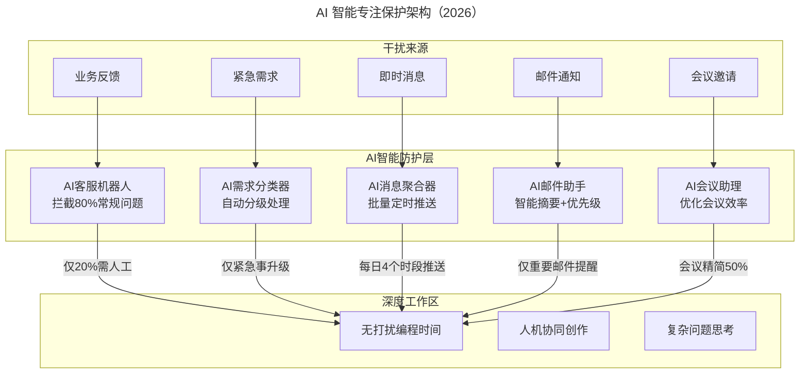
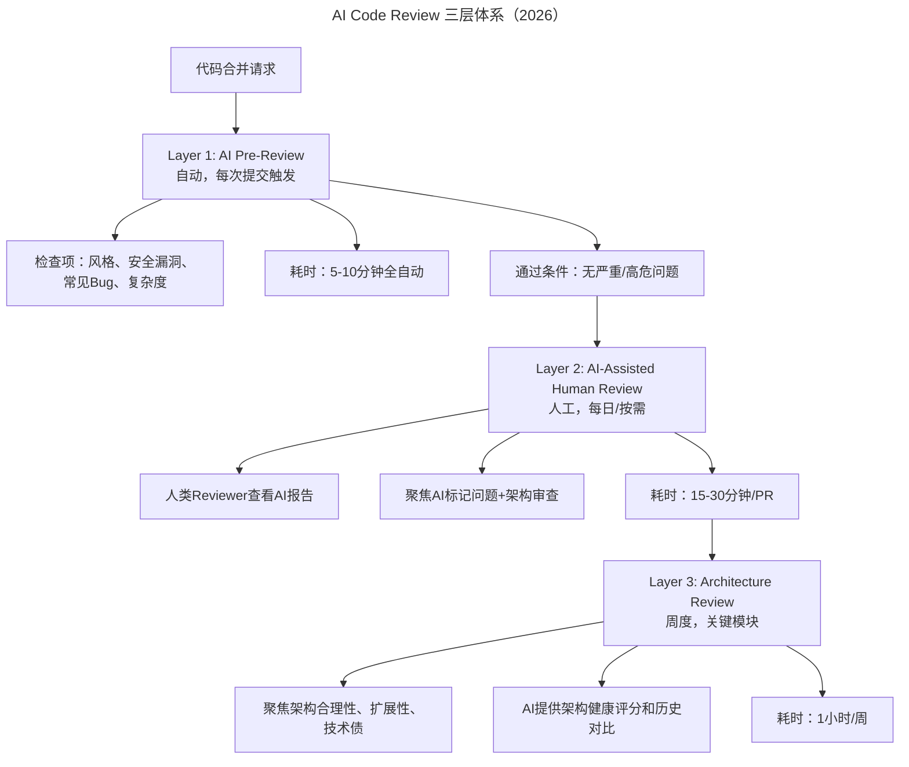

# 提升技术团队效率的做事方式、专注与代码质量

> **适用范围**：技术管理者、研发负责人、架构师、Scrum Master，适用于需要优化团队做事方式、保护专注度、提升代码质量的各类技术团队。

> **更新摘要（v2 · 2026-08 更新）**：在原文"做事方式、专注度、代码质量"三大方向基础上，整合 AI 时代价值判断增强、AI 专注保护机制、AI Code Review 三层体系等内容，补充技术实现 AI 加速流程、AI 智能防护层架构、AI 代码健康评分卡及 2026 年效率提升核心公式。

## 一、导言

做正确的事与正确的做事是影响效率的重要维度。上篇聚焦组织与流程两大方向，本文聚焦做事方式、专注度、代码质量三个方向。这三者在实践中相互交织：做事方式决定团队做什么、怎么做；专注度决定团队能否持续高效执行；代码质量决定团队是否需要反复返工。

原文提出效率=有效工作量/工作时间。2026 年 AI 时代，这一公式升级为：效率=（人类有效工作量+AI 有效产出）/（工作时间×（1-AI 节省比例））。以传统团队效率=40h 有效/60h 总工时=67% 为例，AI 增强团队效率=（35h 人类+25h AI）/（50h×（1-30%））=60h/35h=171%，效率提升 2.55 倍。AI 的作用是系统性地将人类从重复性、低价值工作中解放出来，专注于真正有创造性和战略性的工作。

## 二、核心方法论

### 2.1 做事方式的 AI 增强

原文强调六个要点：强调目标（解决业务问题而非完成功能，目标要大胆）、2/8 原则（20% 精力解决 80% 需求）、适用原则（最适合自己的方案而非最好的方案）、MVP 原则（最小化可行产品快速上线）、技术实现最小化原则（快速迭代避免完美主义）、技术简单可控（系统越复杂越容易出故障）。

AI 时代为每个原则增加增强做法：强调目标新增 AI 辅助 OKR 拆解和价值量化，使目标更清晰可衡量；2/8 原则新增 AI 数据分析用户行为路径，使核心功能识别更客观；适用原则新增 AI 多方案对比评估，使选择更科学；MVP 原则新增 AI 辅助功能优先级排序，使迭代更精准；简单可控新增 AI 复杂度评估和风险预警，防止过度工程。

技术实现的 AI 加速效果显著。传统流程实现一个新功能模块需 6-10 天（设计方案 1-2 天+编码 3-5 天+单测 1-2 天+Code Review 1 天），AI 增强流程缩短至 2.25-4.75 天（AI 生成方案初稿+人工审核 0.5 天+AI Pair Programming 编码 1-2 天+AI 自动生成单测 0.5 天+AI Pre-Review+人类审核 0.25 天），效率提升 50%+。

### 2.2 专注度的 AI 保护机制

原文实践包括：组建技术支持团队独立处理业务反馈；Scrum Team 与救火团队分离（每冲刺预留 2-3 人不参与 Scrum Team，轮值处理紧急问题）；禁止即时通讯工具群聊，对外沟通由 Scrum Master 处理，内部面对面沟通，其他通过项目管理工具或邮箱。核心思想是让技术人员在自己适当的时刻拉取信息，避免被随时推送的信息打断思路。

管理者还必须认识到专注的坏处：过度专注执行层面会无法获取场外信息，而没有全面信息就无法引导团队、把握方向。团队也需要和产品一样不断迭代升级，每次的停顿像竹子的节——节太少容易断，节太多长得慢，迭代后的回顾会议频率是每两周一次。

AI 时代新增 AI 智能防护层，在干扰来源与深度工作区之间建立过滤机制。

AI 防护层的核心价值是将干扰在到达深度工作区之前过滤掉。AI 客服机器人拦截 80% 常规问题，仅 20% 需人工；AI 消息聚合器设置"专注模式"，IM 消息静音，每 4 小时汇总一次，打断次数降低 80%；AI 邮件过滤自动分类，仅标记重要的立即推送，邮件处理时间降低 60%；AI 日程守护自动拒绝非必要会议或建议改为异步沟通，会议时间降低 40%。

关于"停一停"的 AI 版本：传统回顾会需 2 小时全员参与、低效讨论；AI 增强回顾会缩短至 30 分钟——前 5 分钟 AI 展示数据报告（亮点/问题/趋势），15 分钟聚焦 AI 识别的 2-3 个关键议题深入讨论，5 分钟确定改进措施，5 分钟 AI 记录决议并创建 Action Items。

### 2.3 代码质量的 AI 革命

原文痛点是改别人代码痛苦（业务不明、技术不熟、风格不同）。解决方案是流程透明化+统一框架规范+Code Review+注释规范。基础框架团队提供统一 API 框架、后台管理系统框架及各前端框架，制定编码规范和数据库规范，业务开发团队必须使用统一框架，引入新技术必须向框架团队申请。Code Review 有两种方法：开发者讲解自己的代码（效率高）、互相交换讲解别人的代码（质量好）。注释必须包含作者、时间及背景（需求来源及简短说明）。

AI 时代新增 AI 代码理解助手，新人接手老代码从传统 4-7 小时缩短至 15-30 分钟。向 AI 提问"解释这段代码的功能和设计思路"，AI 能给出功能总结、架构设计（含 Mermaid 关系图）、注意事项（TODO 标记、性能瓶颈、命名问题）、相关文档链接。追问"为什么这里用了缓存而不是直接查库"，AI 能根据 git 历史解释这是某次性能优化引入的，附 commit 链接。

## 三、关键流程

### 3.1 价值判断流程

做事方式的第一步是判断价值。原文强调"紧急重要是你认为的，还是需求部门认为的？"——技术上的紧急重要必须和业务连起来，直接或间接体现业务价值。管理者要更关注重要但没被定为紧急的事，因为团队往往将很重要但不好实现的事情定为重要不紧急。

AI 时代新增 AI 价值评估流程：任务输入后 AI 评估价值（高/中/低/负），高价值优先执行并 AI 辅助加速，中价值排队等待并 AI 优化排期，低价值重新评估并由 AI 建议替代方案，负价值取消任务并由 AI 记录教训。交付后 AI 追踪实际价值，与预期对比形成闭环。

### 3.2 框架规范执行流程

原文的框架规范执行依赖人工 Review 检查，AI 时代升级为自动化执行。编码风格从人工 Review 变为 AI 实时 Lint+自动格式化（合规率 99%+）；API 使用规范从依赖开发者记忆变为 AI IDE 插件实时提示正确用法（合规率 95%+）；安全规范从安全培训+Code Review 变为 AI 安全扫描每次提交触发（合规率 98%+）；性能规范从性能测试发现变为 AI 性能异味检测在编码阶段（合规率 90%+）；文档规范从事后补写变为 AI 根据代码自动生成和更新（合规率 100%）。

### 3.3 AI Code Review 三层体系

原文两种 Code Review 方法在 AI 时代扩展为三层 Review 体系。

Layer 1 是 AI Pre-Review，每次提交自动触发，检查风格、安全漏洞、常见 Bug、复杂度，5-10 分钟全自动完成，无严重/高危问题才允许进入下一层。Layer 2 是 AI-Assisted Human Review，人类 Reviewer 查看 AI 报告，聚焦 AI 标记的问题和架构层面审查，15-30 分钟/PR（传统需 1-2 小时）。Layer 3 是 Architecture Review，周度进行，聚焦架构合理性、扩展性、技术债，AI 提供架构健康评分和历史对比，1 小时/周。三层体系将 Code Review 时间从 4-8 小时/Sprint 降至 1-2 小时/Sprint。

## 四、工具与实战

### 4.1 做事方式工具

| 原则 | 传统实践 | AI 增强实践 | 核心价值 |
|-----|---------|-----------|---------|
| 强调目标 | 人工定义业务目标 | AI 辅助 OKR 拆解+价值量化 | 目标更清晰可衡量 |
| 2/8 原则 | 经验判断核心功能 | AI 数据分析用户行为路径 | 决策更客观 |
| 适用原则 | 主观评估方案适配性 | AI 多方案对比评估 | 选择更科学 |
| MVP 原则 | 人工规划最小可行产品 | AI 辅助功能优先级排序 | 迭代更精准 |
| 简单可控 | 架构师经验把控 | AI 复杂度评估+风险预警 | 防止过度工程 |

### 4.2 专注保护工具

| 保护措施 | 具体做法 | 效果 |
|---------|---------|------|
| AI 消息聚合 | 设置"专注模式"，IM 消息静音，AI 每 4 小时汇总 | 打断次数-80% |
| AI 邮件过滤 | AI 自动分类邮件，仅标记重要的立即推送 | 邮件处理时间-60% |
| AI 客服前置 | 部署 AI 客服处理一线问题，减少技术支持请求 | 支持工作量-70% |
| AI 日程守护 | AI 自动拒绝非必要会议，或建议改为异步沟通 | 会议时间-40% |

### 4.3 代码质量工具

- **AI 代码理解助手**：向 AI 提问即可理解老代码功能、设计思路、注意事项、相关文档。
- **AI 框架规范执行**：实时 Lint、IDE 插件提示、安全扫描、性能检测、文档自动生成。
- **AI Code Review 三层体系**：AI Pre-Review+AI-Assisted Human Review+Architecture Review。
- **AI 代码健康评分**：从语法风格、缺陷检测、安全扫描、架构健康、可维护性五个层级综合评分。

### 4.4 其他建议的 AI 升级

| 原文建议 | AI 时代增强版 | 实操提示 |
|---------|-------------|---------|
| 招最优秀的人才 | 招具备 AI 协作能力的人才 | 面试中加入 AI 工具使用考核 |
| 花 4 人钱招 3 人做 5 人事 | 花 4 人钱招 2 人+AI Agent 做 8 人事 | 人效比重新定义 |
| 工具化自动化 | AI 原生工具替代传统工具 | 优先选 AI-First 的工具 |
| 建立学习型组织 | AI 个性化学习路径 | AI 推荐学习内容 |
| 建立知识库 | AI 知识图谱+智能检索 | 知识复用率 300%↑ |
| 淘汰绩效差人员 | 培养 AI 协作能力，而非简单淘汰 | 给予转型机会和支持 |
| 保持团队开心激情 | 减少重复劳动，让 AI 干脏活累活 | 工作满意度自然提升 |

## 五、常见误区

**完美主义与钻牛角尖**：技术人员容易陷入完美主义或钻牛角尖带来的时间浪费。AI 时代的新表现是过度追求 AI 输出的完美性，反复调整 Prompt 而忽略业务价值。应坚持技术实现最小化原则，每次实现一个小点，测试可用后再实现下一个小点。

**微服务滥用**：原文发现最常见的问题是不管项目阶段、组织架构、团队规模和人员能力，就将系统设计为微服务架构并拆分过细，没有服务治理、没有分布式事务、自动化水平很低，一个人维护好几个微服务，处理 Bug 的时间比写业务逻辑的时间还多。AI 时代这一问题依然存在——AI 能加速微服务开发，但不能替代架构决策。

**注释过度**：原文建议慎用注释，因为代码是程序员自己的语言，无法用代码讲清楚目的就需要换思路而非换语言。注释过多时维护注释与代码逻辑一致性是不可忽视的工作量。AI 时代 AI 可自动生成和更新注释，但仍需谨慎——AI 生成的注释可能不准确，重要逻辑的注释仍需人工把关。

**AI 幻觉与过度信任**：AI 输出可能不准确（幻觉问题），代码/对话可能包含敏感信息（数据隐私问题），LLM API 调用成本可能很高（成本控制问题）。应建立 AI 输出强制审核机制，敏感数据脱敏后才能输入 AI，缓存常见查询+批量处理以控制成本。

## 六、进阶延展

### 6.1 2026 年效率提升核心公式

原文公式：效率=有效工作量/工作时间。

2026 年升级公式：效率=（人类有效工作量+AI 有效产出）/（工作时间×（1-AI 节省比例））。

其中 AI 有效产出=AI 自动化完成的工作量，AI 节省比例=AI 帮助人类节省的时间占比。示例计算：传统团队效率=40h 有效/60h 总工时=67%；AI 增强团队效率=（35h 人类+25h AI）/（50h×（1-30%））=60h/35h=171%，效率提升 155%。

### 6.2 AI 时代的新基准

原文案例中 QA 测试时间从 3 周缩短至 2 周、On-call 频率从 2-3 通/晚降至 1 通/晚、异常定位时间从 15 分钟降至 3 分钟。AI 时代的新基准：测试时间缩短至 2-3 天（1 个月实现）、On-call 频率降至 1 通/周（1 个月实现）、异常定位时间降至 30 秒内（2 周实现）、Code Review 时间降至 30 分钟/Sprint（即时）、需求响应时间降至 1-2 天（即时）。关键技术包括 AI 测试用例生成、AIOps 智能运维、AI Code Review Agent、AI 性能优化建议。

### 6.3 从"管好人"到"人机协同"

2026 年的效率提升不再是单纯靠"管好人"，而是通过 AI 工具系统性地将人类从重复性、低价值工作中解放出来，专注于真正有创造性和战略性的工作。这要求管理者重新定义"优秀"——传统 100 分=功能完整+Bug 少+文档齐全；2026 年 100 分=业务价值明确且可度量（AI 辅助验证）+技术方案优雅且可维护（AI Code Review 评分>90）+测试覆盖充分且自动化（覆盖率>90%）+文档清晰且 AI 可理解（便于新人 Onboarding）+人机协作流畅且高效（AI 采纳率>80%）。

---

*注：本文基于王海亮 10 年技术团队管理经验，整合 2026 年 AI 时代做事方式、专注度与代码质量的升级内容。核心观点是：2026 年的效率提升不再是单纯靠"管好人"，而是通过 AI 工具系统性地将人类从重复性、低价值工作中解放出来，专注于真正有创造性和战略性的工作。*
