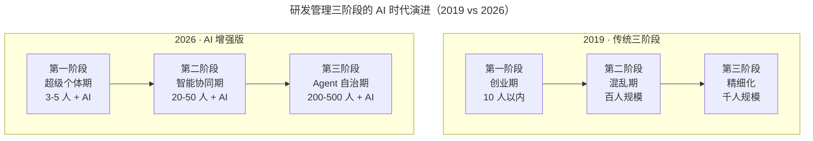
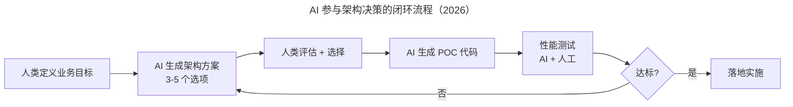

# 邱良军：做好研发管理的 3 个关键

> **适用范围**：研发总监、技术经理、PMO、工程效能负责人；适用于团队从 10 人以下扩展到几百上千人过程中面临组织架构裂变、部门墙、效率下降等问题的管理者，特别适用于规划 AI 时代研发管理升级的 ToB / ToC 团队。

> **更新摘要（v2 · 2026-08 更新）**：在原"研发管理三阶段 + 三大关键（产品业务、技术架构、工程效能）"框架基础上，整合 2026 年 AI 增强的三阶段演进（超级个体期、智能协同期、Agent 自治期）、AI 参与架构决策、从 DevOps 到 AIOps 的工具链升级、研发管理者新角色定位等内容，给出一份覆盖组织演进、产品理解、技术架构、工程效能的统一指南。

## 一、导言

研发管理的本质是高效地写代码、做产品、做运维支持。它涵盖软件开发生命周期管理（SDLC）与项目管理两大方向，主流方法论包括 PMP 认证、CMMI 软件成熟度模型、Agile 敏捷开发（XP 极限编程、Scrum）、DevOps（开发运维一体化）等。过去个别大神一个人就能开发一套系统，不需要分工与协作，研发管理极其简单。但现实中的创业公司在快速发展过程中，研发管理必须随组织扩大与架构演变而进化。

邱良军基于 18 年 IT 经验，将研发管理的成长归纳为三个阶段，并提炼出三大关键点：产品与业务、技术与架构、工程效能。这一框架在 2019 年提出时已具备较强的解释力，但进入 2026 年后，84% 的开发者正在使用或计划在开发流程中使用 AI 工具（Stack Overflow 2025 调查口径）、DevOps 演进为 AIOps、AI Agent 开始承担项目管理职责，三阶段的团队规模、核心挑战、管理工具、开发模式均发生了显著变化。

本文将原三阶段与三大关键整合 2026 年 AI 增强内容，给出一份适用于当前技术环境的研发管理指南。

## 二、核心方法论

### 2.1 研发管理三阶段

**第一阶段：创业初期。** 创始团队中有技术强人与产品牛人，目标一致——尽快做出产品推向市场。研发管理主要关注技术与产品，研发效率是关键，用最少的钱办最重要的事。团队规模小、目标一致，基本不需要管理，主要靠个人技术能力与行业洞察能力的叠加。之后团队开始扩大，产品功能不断完善，研发管理关注系统稳定性与性能，团队协作依赖协同软件，开发模式通常选择敏捷开发与快速迭代。

**第二阶段：初具规模。** 通常对应 A/B/C 轮融资，研发团队接近或超上百人。业务需求急剧扩张，客户迅速增加，对系统功能、性能、安全性、高可用、稳定性的要求越来越高。团队通常处于混乱期，然后开始寻找解决方案：第一步梳理流程，第二步参考 CMMI3/5 模型提升研发管理能力，按分工拆分为产品、开发、测试、运维、架构等团队。各团队清晰划分职责后，因成员个体能力差异与各种关系，慢慢形成部门墙。公司步入研发管理标准化阶段，同时伴随研发效率不断下降、客户满意度与管理层满意度急剧下降的危机。

**第三阶段：精细化。** 研发规模达到几百甚至上千人，各职能部门都建立起来，研发效率却越来越低。为拆除厚厚的职能部门墙，组织架构再次调整，增加 PMO 项目办公室，临时组建项目团队打战役。开发模式演变为 CMMI 瀑布式 + 敏捷迭代相结合，并不断做精细化管理（如 Lean Six Sigma）。在发布、测试、运维过程中推动自动化、智能化工具的使用，让有风险和重复性的工作变得快速而简单。

图示说明：AI 时代的三阶段并非简单缩小团队规模，而是改变了每个阶段的核心挑战与管理工具。第一阶段的挑战从"资源不足"变为"AI 选择焦虑"——如何在数百种 AI 工具中选出适合团队的那一套；第二阶段的挑战从"部门墙"变为"AI 协同规范"——如何让不同团队的 AI 工具链、Prompt、Agent 产物互通；第三阶段的挑战从"效率低下"变为"Agent 治理"——如何为数百个 Agent 任务建立质量门禁与失败接管机制。

| 维度 | 第一阶段（2019→2026） | 第二阶段（2019→2026） | 第三阶段（2019→2026） |
| --- | --- | --- | --- |
| 团队规模 | 10 人 → 3-5 人 | 100 人 → 20-50 人 | 1000 人 → 200-500 人 |
| 核心挑战 | 资源不足 → AI 选择焦虑 | 部门墙 → AI 协同规范 | 效率低下 → Agent 治理 |
| 管理工具 | JIRA/Excel | JIRA + 自动化 | AI PM + Agent Orchestrator |
| 开发模式 | 敏捷/Scrum | DevOps | AI-Native Dev（AIDev） |

### 2.2 三大关键点

研发管理的核心重点是产品、技术、工程效能。研发管理的成长就是技术积累、业务理解、研发效率和风险控制的平衡发展过程。

**产品与业务**：一个段子说 CEO 负责吹牛，销售负责让客户相信 CEO 吹的牛，CTO 负责让 CEO 吹的牛变成真的。不管公司处于哪个阶段，产品好坏始终最关键。研发管理的难点之一是技术团队对业务与产品的理解。原文给出三种实践：培养具有程序员思维的产品经理或具有产品思维的程序员；从生活出发理解业务（例如为研发银行开户系统的同事亲自到多家银行开户体验）；遵循 MVP（Minimum Viable Product）原则快速试错。

**技术与架构**：研发管理的核心能力是技术能力。需防止两个极端——一是追求技术完美，一上来就高可用、高活、分布式、并发上万、亿级数据，等系统做出来时黄花菜都凉了；二是完全不管架构技术，系统稳定性极差、体验不好。"好的架构不是设计出来的，而是进化出来的"——这句话不是给糟糕起步找借口，而是强调技术为产品服务，系统设计之初速度是关键。在预算许可条件下适当做 6-12 个月的业务前瞻。同时必须做好质量管理，使用 Sonar 等代码扫描工具 + 人工代码审查。

**工程效能**：工程效能是研发管理中非常重要的一环，团队规模超过 100 人甚至达到 1000 人时需要专门的人或团队关注。核心是在符合公司流程要求（风险控制要求）的前提下提升各团队协作效率。敏捷开发要求团队成员自我驱动、自我管理，JIRA 支持的 Scrum 是敏捷方法之一。DevOps 涵盖开发、测试、发布、部署、运营、监控一体化，通过自动化工具把持续集成、持续交付、自动化部署发布与监控、持续反馈优化勾连形成一体化。

## 三、关键流程

### 3.1 产品与业务理解的 AI 加速

原文的三种实践在 2026 年均可被 AI 加速：传统方式阅读行业文档、参与客户会议、亲身体验产品，耗时月级；AI 增强方式使用 ChatGPT/Claude 进行行业问答、AI Web Agent 自动抓取与分析竞品、AI 辅助 PRD 生成、AI 生成可交互原型（v0.dev/Galileo），耗时周级。具体工具链包括：业务理解用 ChatGPT/Claude 行业问答；竞品分析用 AI Web Agent 自动抓取；需求文档用 Notion AI/Cursor 辅助生成；原型验证用 v0.dev/Galileo 生成可交互原型。

### 3.2 技术与架构的 AI 参与

图示说明：AI 参与架构决策的本质不是让 AI 取代架构师，而是把"好的架构是进化出来的"这一原则工程化——人类定义方向，AI 快速生成方案与 POC，人类评估选择，AI 持续演进。技术选型调研从人工搜索对比（2-4 周）变为 AI 报告（2-4 小时）；POC 开发从 1-2 周变为 1-2 天；代码审查从人工 Code Review 变为 AI 初审 + 人工复审；重构建议从依赖经验变为 AI 静态分析 + 智能建议；文档生成从手动编写变为 AI 自动生成 + 保持同步。

### 3.3 工程效能从 DevOps 到 AIOps

原文的工具链是 IDE 集成 Git 和 Sonar 做代码提交时自动扫描检查，通过 Jenkins 把 Maven、JIRA、Git、Jmeter 集成做到自动化部署发布，Docker 镜像 + Zabbix 自动监控，最后通过短信、邮件、微信、Jira 实现报警监控自动化。2026 年推荐工具链升级为：Git → AI Code Review → AI Test Gen → AI Security Scan → Auto Deploy + AI Monitor + AI Incident Response。

关键指标对比：

| 指标 | 2019 年行业平均 | 2026 年 AI 增强后 | 提升 |
| --- | --- | --- | --- |
| 代码评审覆盖率 | 30-50% | 85-95% | 90% ↑ |
| 测试覆盖率 | 40-60% | 80-92% | 53% ↑ |
| 部署频率 | 周 / 月级 | 日 / 小时级 | 10 倍 ↑ |
| MTTR | 小时级 | 分钟级 | 10 倍 ↑ |
| Bug 逃逸率 | 15-25% | 3-8% | 70% ↓ |

## 四、工具与实战

### 4.1 三阶段工具链演进

| 阶段 | 2019 年工具 | 2026 年工具 |
| --- | --- | --- |
| 第一阶段 | Excel + 微信 + 通用 IDE | Notion AI + Linear AI + Cursor |
| 第二阶段 | JIRA + Jenkins + Sonar + Docker + Zabbix | Linear AI + AI Code Review + AI Test Gen + AIOps |
| 第三阶段 | CMMI 流程 + PMO + 自动化平台 | AI PM + Agent Orchestrator + 内部 AI 平台（IDP） |

### 4.2 研发管理者的新角色定位

原文总结：做事"高效自驱"、管事"抓执行，勤反馈"、管人"知人性，有人性"。2026 版更新为：

- 做事："高效自驱 + AI 协作力"——不仅自己高效，还能让 AI 成为放大器；关键能力是 Prompt Engineering 与 AI 工具选型；KPI 是个人产出 × AI 杠杆率。
- 管事："抓执行，勤反馈 + AI 自动化"——用 AI Agent 处理重复性管理工作，专注于例外处理与战略决策；KPI 是流程自动化率 > 70%。
- 管人："知人性，有人性 + AI 素养培养"——不仅关注人的成长，还要关注 AI 技能提升；建立 AI 时代的团队文化（透明、学习、创新）；KPI 是团队成员 AI 认证率 > 80%。

## 五、常见误区

**误区一：追求技术完美。** 一上来就高可用、高活、分布式、并发上万、亿级数据，等系统做出来时黄花菜都凉了。技术是为产品服务的，系统设计之初速度是关键。

**误区二：完全不管架构。** 只要能做出来就好，系统稳定性极差、体验不好。即便交付上线，用户也会失去耐心，产品失去意义。需在迭代中不断做架构调整与代码重构，适应业务发展。

**误区三：忽视代码质量管理。** 工期或资源一紧张、团队发生入离职时，代码质量就很容易失控。废代码、垃圾代码、不规范代码、奇葩代码、天书一般的代码都会出现。必须使用代码扫描工具（如 Sonar）+ 人工代码审查，并对代码做减法——删除废代码、避免重复造轮子、利用设计模式简化复杂性。

**误区四：部门墙无法避免。** 三阶段演进中部门墙的产生确实难以完全避免，但可以通过 PMO、跨职能项目团队、统一的工程效能团队来拆除。所谓分久必合合久必分，关键是有意识地周期性调整。

**误区五：AI 工具选型盲目跟风。** 第一阶段的核心挑战已从"资源不足"变为"AI 选择焦虑"。管理者需要建立 AI 工具选型标准，避免团队同时使用多种不互通的工具。

**误区六：用传统指标衡量 AI 时代效率。** 仅看部署频率与 Bug 逃逸率会遗漏 AI Adoption Rate、AI Acceptance Rate、Agent Success Rate 等关键信号。

## 六、进阶延展

当三阶段演进与三大关键的 AI 增强均已落地后，研发管理者可向三个方向延展。第一是 Agent 治理体系：为数百个 Agent 任务建立质量门禁、失败接管机制、自治级别评估，让 Agent 成为可管理的"虚拟员工"。第二是内部 AI 平台（IDP）建设：将 Prompt Library、Agent 编排、AI 工具配置集中到统一平台，降低团队使用门槛，让 AI 能力成为基础设施而非个人技能。第三是研发管理者的持续修炼：做事、管事、管人三件事的本质没有变，但每一件都需要叠加 AI 维度——"高效自驱 + AI 协作力""抓执行 + AI 自动化""知人性 + AI 素养培养"。

需要强调的是，研发管理没有标准答案。原文提供的三大关键与三阶段演进是一种方法而非教条，具体方法需要根据团队实际情况灵活调整。研发管理的本质是技术积累、业务理解、研发效率和风险控制的平衡发展——这一判断在 AI 时代依然成立，只是平衡的变量更多、节奏更快。从实际出发，根据公司和团队发展的不同阶段灵活使用不同的方法，才是研发管理者最应具备的核心能力。
