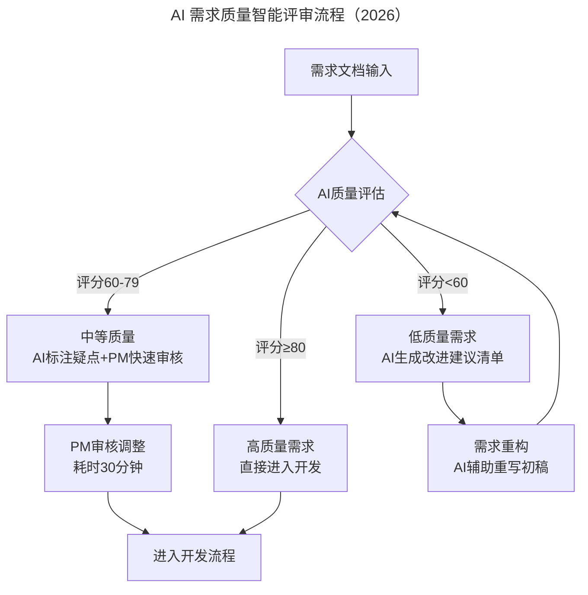
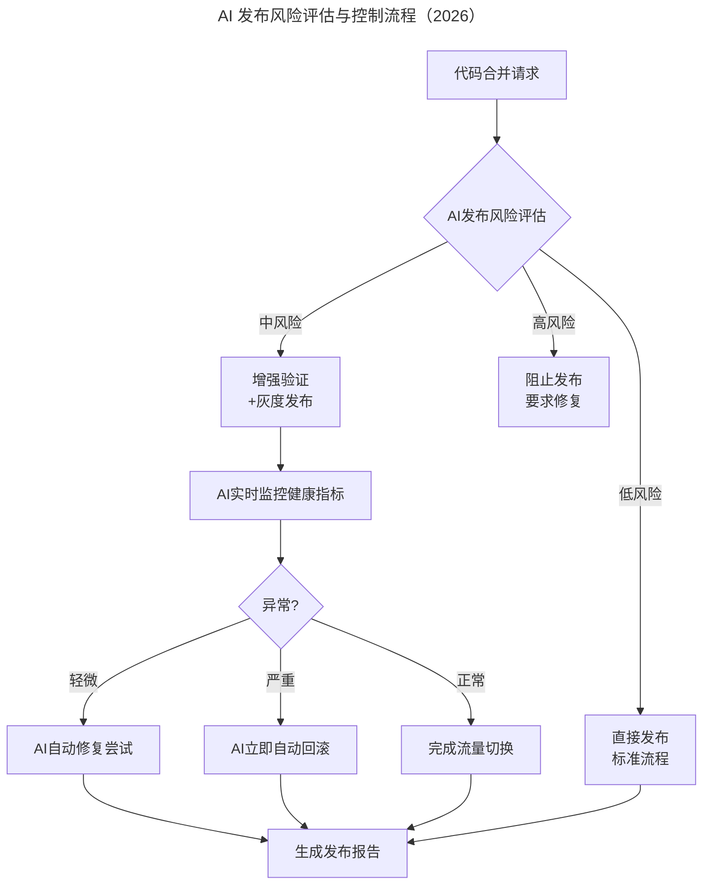

# 软件研发度量体系建设与 AI 智能化升级

> **适用范围**：研发效能负责人、技术管理者、质量保障团队、平台工程团队，适用于需要建设或升级研发度量体系的各类技术组织。

> **更新摘要（v2 · 2026-08 更新）**：在原文"价值-效率-质量"三维度量框架基础上，新增第四维度"人机协作效能"，整合 AI 增强价值度量、AI 效率瓶颈智能识别、AI 代码健康评分、AI 需求质量评审、AI 发布风险控制、AI 度量平台架构等内容，补充从被动式事后统计到主动式预测性智能度量体系的演进路径。

## 一、导言

研发过程中总会遇到三类典型问题：为什么做的产品与用户期望存在差异？市场需求日新月异，如何提高团队反应速度？产品质量到底怎么样，为什么 Bug 永远修不完？度量的意义正在于此——让目标更明确（项目开始时、研发过程中、项目结束后对目标有共同认识）、让现状更清晰（了解效率如何、质量如何、流程如何及问题所在）、让改进更精准（通过度量实践找到适合自己团队的完善方法）。

原文提出研发度量体系的三个核心维度：价值（做正确的事）、效率（高效交付价值）、质量（交付符合预期）。2026 年 AI 时代，这一框架不仅依然有效，而且因为 AI 技术的全面融入，度量的颗粒度、实时性和洞察深度都得到了革命性提升。同时，AI 时代新增了第四个关键维度——人机协作效能（Human-AI Collaboration Effectiveness），用于度量团队与 AI 协同工作的效率和质量。

度量不是绩效考核的工具，度量是为了及时解决问题、优化结果。度量数据的生产者要成为度量数据的消费者。度量是一个系统工程，不同业务团队有不同流程、不同发展阶段有不同重点、不同角色有不同视角，应以系统性思维去思考。

## 二、核心方法论

### 2.1 价值维度与 AI 增强

价值指要做正确的事，而不是有效率地做一些错误的事情。价值指标分为商业价值（可度量：钱、订单量、DAU、转化率、停留时间；不可度量：影响力、美誉度）和技术价值（可度量：QPS、可用性、响应时间、故障恢复时间；不可度量：技术竞争力）。

原文创新之处在于将项目目标和需求目标相关联——项目目标作为需求设计的目标之一，从实际结果看需求为整个项目目标分担了多少指标。整个项目流程分为事前计划、定期追踪、事后复盘三个阶段，带来三方面价值：所有需求从价值出发、参与人明确目标提升成就感；拆解高价值需求更早交付提升 ROI；把控需求质量减少"三拍"需求降低部门浪费。

AI 时代价值度量新增能力：业务价值达成从人工统计报表变为 AI 实时追踪+预测性分析（提前预判趋势）；需求价值验证从上线后复盘变为 AI 模拟 A/B 测试效果（上线前预估）；技术债影响从主观评估变为 AI 量化技术债成本（数据化决策）；创新贡献度从难以量化变为 AI 分析代码影响力（客观评价）。

### 2.2 效率维度与 AI 增强

效率度量的两个核心指标是吞吐率（单位时间内交付多少产出）和交付周期（需求从提出到上线所用时长）。产出衡量应从多维度综合衡量——单看代码行数或需求数都不准确。原文使用累计流量图（定位瓶颈）和价值流程图（需求卡在每个阶段的平均时间）两种项目管理工具。

AI 时代效率指标体系新增 AI 相关指标：吞吐量新增 AI 辅助产出点数（区分人机贡献）；交付周期新增 AI 等待时间（人类审批瓶颈识别）；流动效率新增 AI 瓶颈智能识别（自动推荐优化方案）；资源利用率新增 AI 工具采纳率（工具使用深度分析）；预测准确率新增 AI 预测 vs 实际偏差（持续校准模型）。

### 2.3 质量维度与 AI 增强

质量度量以结果为导向，越早发现越易修复。关注线上质量（服务端和客户端）和过程质量（需求质量、代码质量、测试质量、发布质量、系统质量）。原文实践包括"圈复杂度降到 15 以下可不写单测"等短平快方法降低代码复杂度。

AI 时代质量度量从被动式事后统计升级为主动式预测性智能度量：线上质量从故障数统计变为 AI 预测故障概率+事前预警；过程质量从代码覆盖率变为 AI 代码健康评分（实时反馈）；需求质量从 Bug 数变为 AI 需求清晰度评分（左移质量）；测试质量从用例通过率变为 AI 测试有效性分析（精准投入）。

### 2.4 人机协作效能（2026 新增维度）

这是 AI 时代独有的度量维度，包含六项核心指标：

| 指标名称 | 定义 | 目标值 |
|---------|------|--------|
| AI 工具采纳率 | 团队成员日常使用 AI 工具的比例 | >85% |
| 人机协作效率比 | 有 AI 辅助 vs 无 AI 辅助的效率比值 | >1.5x |
| AI 输出质量评分 | AI 生成内容的人工接受率 | >80% |
| Prompt 成功率 | Prompt 首次获得满意结果的比率 | >70% |
| Agent 任务完成率 | 自主 Agent 成功完成任务的比例 | >90% |
| AI 创新贡献度 | AI 辅助产生的新想法/方案占比 | >30% |

## 三、关键流程

### 3.1 过程质量度量流程

过程质量从需求质量、代码质量、测试质量、发布质量、系统质量五个维度度量。原文指出 30-40% 的效率和质量问题来自需求质量。需求质量指标分为需求整体质量（需求质量评分、需求 Bug 数、需求千行代码 Bug 数）和需求自身质量（需求打回次数、需求变更次数、需求质量 Bug 数）。

代码质量指标分为基础信息（代码质量评分、文件数、类数量、方法数量）、可靠性指标（代码重复率、圈复杂度、千行代码严重缺陷度、安全缺陷度）、可维护性指标（高复杂度函数数量、迷惑方法名数量、技术债务比）。测试质量指标包括千行代码 Bug 率、整体漏测率、测试覆盖率、单测通过率与覆盖率、自动化测试通过率。发布质量关注发布失败率、构建成功率、回滚率等。系统质量关注服务数量、最长链路、最大 QPS、系统响应时间、安全漏洞严重问题数。

### 3.2 AI 需求质量评审流程

AI 需求质量评估从五个维度打分：完整性（25%，功能点覆盖、边界条件、异常处理）、清晰度（25%，无歧义表达、术语一致、逻辑连贯）、可行性（20%，技术可实现性、资源合理性）、可测试性（15%，验收标准明确、可量化）、一致性（15%，与现有系统兼容、无冲突）。每个维度 AI 自动检查并给出典型问题示例，如"'高效'的定义是什么？"、"缺少取消操作的说明"、"现有架构不支持此功能"等。

### 3.3 AI Code Health Score 流程

原文实践是"圈复杂度降到 15 以下可不写单测"。AI 时代升级为五层代码健康评估：L1 语法风格（AI 学习团队规范，更智能，减少 90% 风格争议）；L2 缺陷检测（AI 语义理解，发现逻辑 Bug，缺陷发现率+40%）；L3 安全扫描（AI 安全漏洞模式识别，安全漏洞-60%）；L4 架构健康（AI 架构异味检测，技术债早发现）；L5 可维护性（AI 可维护性综合评分，量化维护成本）。

AI 代码健康评分卡包含总体评分（如 78/100 良好）、分项得分（代码风格、缺陷风险、安全性、架构合理性、可维护性）、AI 发现的问题（按严重度排序：严重、警告）、AI 优化建议（重构后预计评分提升至 90+，预计减少未来维护成本 30%）。

### 3.4 AI 发布风险控制流程

AI 发布风险评估基于七个因子：代码变更范围（20%）、代码复杂度变化（15%）、测试覆盖充分性（20%）、历史故障模式（15%）、发布时间窗口（10%）、依赖服务状态（10%）、团队疲劳度（10%）。低风险直接发布走标准流程；中风险增强验证加灰度发布，AI 实时监控健康指标，轻微异常 AI 自动修复尝试，严重异常 AI 立即自动回滚；高风险阻止发布要求修复。所有结果生成发布报告。

## 四、工具与实战

### 4.1 度量平台架构

原文的度量平台采用实时数据流（ES 存储，主要用于分析代码质量，每次代码提交触发持续集成）+离线数据流（每天几百 G 数据进入数仓，包括需求流转、代码提交、持续集成、发布数据、监控数据，采用 Kylin 建设数据立方体）双通道架构。

AI 时代度量平台新增 AI 处理引擎层，在数据源层（Jira/Linear、GitLab/GitHub、CI/CD 系统、AI 工具日志、监控系统、业务数据库）与应用层（实时效能看板、智能预警系统、自然语言查询、自动周报/月报、决策支持助手）之间，增加 ETL+数据清洗、实时流处理（Flink/Spark Streaming）、离线批处理（Hive/Spark）、ML 模型推理、LLM 分析引擎（GPT-5.5/DeepSeek V4）等 AI 能力。

### 4.2 度量工具对比

| 组件 | 原文方案 | AI 增强方案 | 升级点 |
|-----|---------|-----------|--------|
| 数据采集 | 实时+离线双通道 | +AI 工具日志采集 | 人机协作数据 |
| 数据存储 | ES（实时）+Hive（离线） | +向量数据库（语义检索） | 自然语言查询 |
| 数据处理 | ETL 清洗 | +AI 数据质量检测+自动修复 | 数据可信度↑ |
| 数据分析 | Kylin 立方体 | +LLM 自然语言分析 | 使用门槛↓ |
| 应用展示 | Dashboard | +AI 对话式查询+主动推送 | 体验革新 |

### 4.3 平台建设踩坑经验

原文三个难点：技术选型（ES vs Flink/Spark Streaming，最终选择短平快的 ES+Hive）；指标体系建设（业务差异导致指标体系庞大，需多视图多维度建设）；数仓建设（数据立方体建立难、异构数据对齐难、数据快照处理量大）。

AI 时代新增三个坑：AI 幻觉（AI 分析结果可能不准确，重要决策必须人工复核）；数据隐私（代码/对话可能包含敏感信息，需本地部署或脱敏处理）；成本控制（LLM API 调用成本可能很高，需缓存常见查询+批量处理）。应对策略：LLM 选型根据数据敏感性和预算决定（开源 vs API）；AI 指标动态生成（AI 根据上下文自动推荐指标）；AI Schema 映射（LLM 理解不同系统的数据结构）；AI 增量更新+智能采样（降低存储和计算成本）。

### 4.4 落地实施建议

**Phase 1：AI 质量门禁（1 个月）**——在 CI 流水线中集成 AI 代码审查；配置 AI 需求质量检查节点（PRD 提交时自动评估）；设定基础质量阈值（如 AI 代码评分>70 才允许合并）。

**Phase 2：AI 质量看板（2 个月）**——建设 AI 增强的质量 Dashboard（含预测性指标）；接入 AIOps 监控实现故障预测；配置 AI 质量预警规则（自动通知相关负责人）。

**Phase 3：AI 驱动改进（3 个月）**——实施 AI 自动生成的质量周报；建立 AI 识别问题→推荐方案→跟踪改进的闭环；训练团队使用 AI 质量工具的习惯。

## 五、常见误区

**度量即考核**：度量不是绩效考核的工具，度量是为了及时解决问题、优化结果。原文强调数据统计和排名建议只针对团队，不要精确到每个人。AI 时代尤其要警惕用 AI 工具采纳率、AI 代码量等指标对个人进行 KPI 考核，这会导致"为了 AI 而 AI"的形式主义。

**单一指标衡量**：单看代码行数或需求数都不准确——张三写 1000 行代码不一定比李四的 800 行效率高，李四做 20 个需求不一定比张三的 10 个效率高。应从多维度综合衡量。AI 时代同样不能只看 AI 代码采纳率，需结合 AI 输出质量评分、人机协作效率比等综合评估。

**数据滞后决策**：传统度量数据获取延迟为 T+1 天，洞察发现依赖专家经验，决策支持速度为周/双周级。AI 增强后数据获取延迟降至 T+5 分钟（288 倍提升），洞察发现效率提升 5-10 倍，决策支持速度提升至小时级（10-20 倍），度量使用门槛从需要数据分析师降至自然语言交互（全民可用），预测准确性从 60-70% 提升至 85-90%。

**AI 幻觉与过度信任**：AI 分析结果可能不准确（幻觉问题），重要决策必须人工复核。代码/对话可能包含敏感信息，需本地部署或脱敏处理。LLM API 调用成本可能很高，需缓存常见查询+批量处理。度量平台建设尤其要注意——AI 生成的洞察和建议需要人类专家验证后才能作为决策依据。

## 六、进阶延展

### 6.1 AI 度量 2.0 的核心特征

2026 年的研发度量不再是简单的"事后统计"，而是融合了预测性分析、智能诊断、自动优化的"主动治理"体系。核心特征包括：问题发现时机从事后（已影响用户）变为事前（提前预防）；度量实时性从 T+1 天变为 T+5 分钟（准实时）；洞察深度从表面现象变为根因+解决方案；使用门槛从需要专业背景变为自然语言交互（全员可用）；改进闭环速度从周/月级变为天级（5-10 倍提升）。

### 6.2 预测性分析与自动洞察

AI 时代的核心数据分析能力包括三类：AI 自然语言数据查询（从需要懂 SQL 的数据分析师、等待数天变为自然语言提问、分钟级响应）；AI 预测性分析（需求完成时间预测误差从±50% 降至±15%、系统故障预测提前 2-4 小时预警、团队产能预测考虑假期和人员变动、技术债务增长预测基于代码复杂度趋势）；AI 自动洞察发现（自动生成周报摘要，提炼亮点如 Sprint Velocity 环比提升、Code Review 周期缩短，提炼风险如支付模块技术债增长率超标、新成员 Onboarding 效率低于平均，给出优化建议）。

### 6.3 AI 驱动的持续改进闭环

AI 度量平台建立"问题→分析→建议→跟踪→验证"的持续改进闭环。多源数据采集（Jira/Git/CI/CD/Slack）→AI 数据清洗与标准化→AI 实时计算效能指标→AI 模式识别与异常检测→发现问题则 AI 根因分析→AI 生成优化建议→自动推送相关负责人→跟踪改进效果。未发现问题则保持正常监控模式。这一闭环使度量从"被动查看"升级为"主动推送"。

### 6.4 度量体系建设三要点

原文总结建设研发度量体系的三个要点：第一，度量数据的生产者要成为度量数据的消费者——如果度量数据只是给管理层看，而一线研发不使用，度量体系就失去了意义；第二，度量是一个系统工程，不同的业务团队有不同的流程、不同的发展阶段有不同的重点、不同的角色有不同的视角，应以系统性思维去思考；第三，度量不是绩效考核的工具，度量是为了及时解决问题、优化结果。AI 时代这三点依然成立——AI 度量平台的价值不在于技术先进性，而在于能否真正帮助团队持续改进。

---

*注：本文基于美团高级技术经理钮博彦的研发度量体系建设实践，整合 2026 年 AI 时代度量体系智能化升级内容。核心观点是：2026 年的质量度量不再是简单的"事后统计"，而是融合了预测性分析、智能诊断、自动优化的"主动治理"体系。特别强调了 AI 在需求质量、代码健康、测试效能、发布风险等各个环节的革命性提升，以及度量平台向"AI Native"演进的架构变革。*
