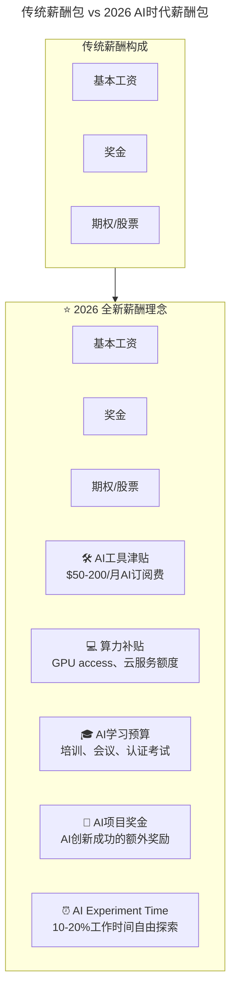
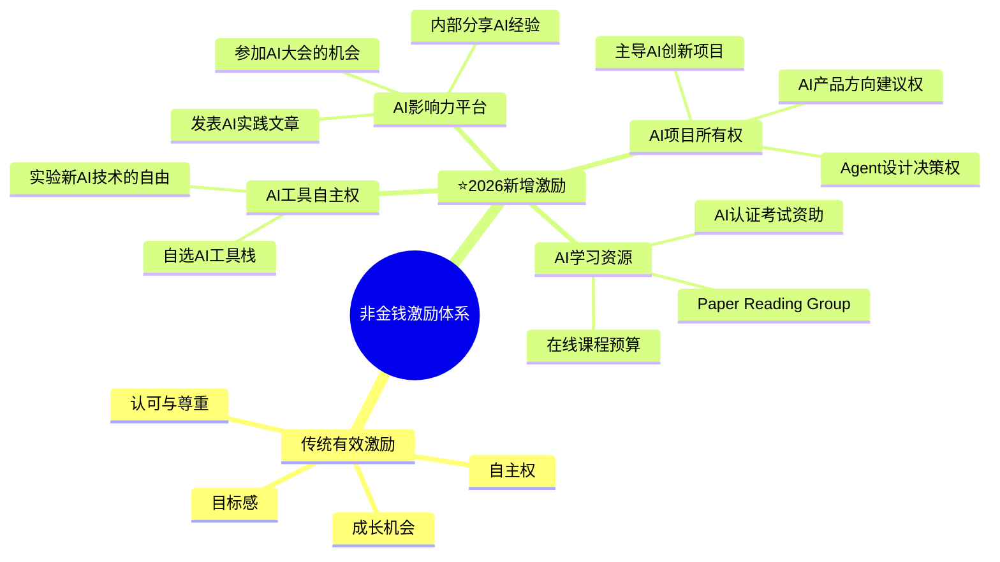
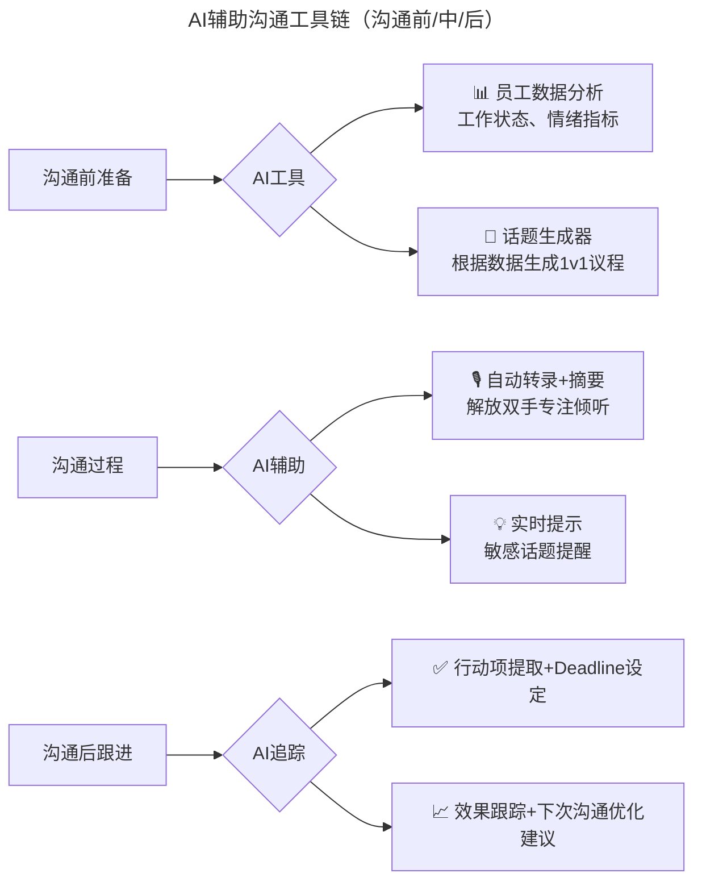
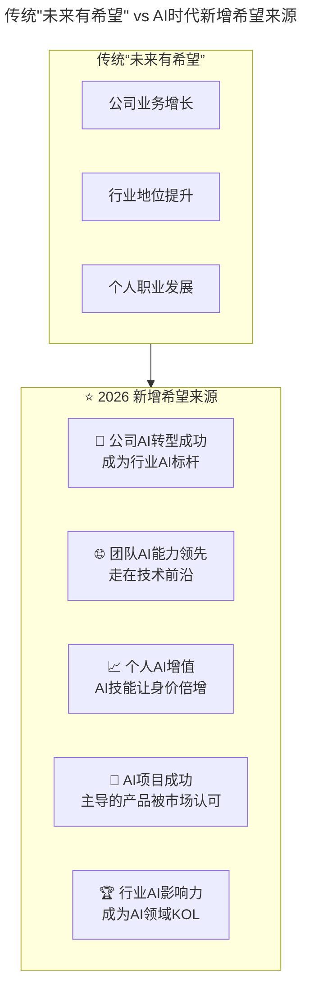

# 第74讲 | 为什么给了高工资，依然留不住核心员工？

> **适用范围**：创业公司 CTO、技术 VP、团队 Lead，以及面临核心员工流失压力的技术管理者。
>
> **更新摘要（v2 · 2026-08 更新）**：
> - 结构化升级为 6 节骨架（导言 / 核心方法论 / 关键流程 / 工具与实战 / 常见误区 / 进阶延展）
> - 保留原文"高工资/激励/沟通/未来"四大离职原因分析
> - 整合 2026 年 AI 时代升级注解，为所有 Mermaid 图补充 `title` frontmatter
> - 新增 AI 时代薪酬包结构、非金钱激励 mindmap、AI 辅助沟通工具链与离职风险预警表

## 1. 导言

在如今这样一个科技时代，人才几乎是每家公司的重要资产，各大公司都希望能够留住宝贵的人才，很多老板不惜"一掷千金"。

但碰到的问题是，奖金酬劳投入得越来越多，却依旧没有摆脱人才流失的烦恼，特别是没有留住那些具备关键技能或表现杰出的核心员工。

最近参加一个技术管理相关的闭门会议，正好聊到员工招聘、留存的话题，有个创业的朋友A抱怨道："给了那么高的工资，还有期权，好员工还是留不住。"

前不久，他团队里负责iOS开发的一个核心员工离职了，创业公司本来人就少，没有合适的人接手，导致产品的迭代节奏完全乱掉。最后没办法，他作为CTO只能自己顶上了，真心很累。

在大公司，人才体系和储备都比较完备，某个核心员工离职产生的影响可能没那么大，能比较容易的找到其他人顶上，而在创业公司，更多的时候都是一个萝卜一个坑，负责某个核心业务的可能也就那么一两个人，人一走整个步调就全乱了，超级麻烦。

对于这个问题，当时参加会议的不少朋友都遭遇过，也都分享了自己的经验，我觉得很有代表性，就记了下来跟大家一起分享，欢迎一起探讨。

## 2. 核心方法论

### 核心员工离职的四大原因

本文分析了**核心员工离职的四大原因**：

1. **高工资真的高么？**：薪资跟不上能力成长速度
2. **激励到位了么？**：非金钱激励同样重要（甚至更有效）
3. **Leader沟通到位了么？**：80%的人离职因为上司，缺乏沟通是主因
4. **未来有希望么？**：公司发展前景是最好的留人策略

**马云总结**：钱没给到位 + 心委屈了。

#### 原因一：高工资真的高么？

据一项调查显示，在所有跳槽者中，有52.5%的人都是由于原单位的工资低而跳槽的。

在上面提到的这个例子中，离职的员工是A公司最早的一批员工，之前的底子并不是很好，初始薪资并不是很高，但由于创业期需要多面手，而此人学习能力又比较强，因此慢慢成长成为研发团队的核心人物。于是，加薪、期权都有了。

然而，人的能量会随着他能力的提升、地位的升高而逐渐增加。受限于公司的薪酬体系，尽管给他加了薪，但可能在他看来，加薪的程度其实并没有跟上他的成长速度和他在团队里的重要程度。同时，对高层领导来说，他又没有不可或缺到为他破例，打破薪酬体系的程度。

久而久之，他就对现状产生了不满，从而逃离。个人能力越强的人，越容易对现状，比如薪资，产生不满。

至于期权，很多创业公司在招核心人才，或是留核心人才的时候，往往更愿意提供看不到摸不着的期权，这样一方面可以节省成本，一方面也可以将员工绑上战车。但是，对于员工而言，这更像是一种投资，而且这种投资的回报时间比较长、风险比较高，相较之下，他们可能更愿意去能够提供高薪水的企业。毕竟并不是所有人都能认同创业项目的价值所在，也并不是所有人都愿意承担创业的风险。

所以，不妨先问问自己，高工资真的高么？真的符合员工的价值，达到员工的预期了么？

#### 原因二：激励到位了么？

另一个参会的朋友B提出了他的看法，对于这些核心员工来说，高工资真的是他们心中最重要的考虑条件么？

在管理中，高工资和奖金都是很有效的金钱激励手段，然而，还有很多非金钱激励手段，包括目标、成长、认可、授权、尊重、沟通、信任、文化等。心理学界相信非金钱激励至少与金钱激励效果相当。

对此，剑桥大学两位教授做了一次实验，以美国快餐连锁店员工为对象，比较了金钱激励和非金钱激励对他们的相对影响。研究结果表明，两种激励手段都显著提高了该店的利润和客户服务质量，同时降低了员工离职率等。

具体来说，金钱激励使免下车取餐的服务响应时间加快了19%，而非金钱激励使得免下车取餐的服务响应时间加快了25%；金钱激励使员工离职率减少了13%，非金钱激励使员工离职率减少了10%，可以看出非金钱激励的效果非常强大。

总的来说，金钱激励是很有必要的，然而，金钱并不总是最有效的激励方式，当员工已经具备足够高的薪资水平时，他们反而会更看中非金钱激励中包括的工作本身的意义、被认可程度、自主性、成长机会、进步空间等内容。

### AI 时代留人新挑战

> **关键认知转变**：
> 过去员工看的是"这家公司能不能上市""能不能涨薪"
> **2026年员工看的是"这家公司会不会被AI淘汰？""我在这里能不能学会用AI？""我的工作会不会被AI取代？"**

2026年的留人核心是：给足"AI时代的安全感和成长感"。

#### "高工资"的 AI 时代重新定义



AI 时代薪酬包在传统"基本工资+奖金+期权"之上，新增了 AI 工具津贴、算力补贴、AI 学习预算、AI 项目奖金与 AI Experiment Time 五类"新型货币"，对应核心员工对 AI 工具自由度与算力资源的新诉求。

**⭐2026 核心员工的新诉求**

| 维度 | 传统诉求 | ⭐2026 新增诉求 |
|-----|---------|---------------|
| **物质层面** | 高薪、期权 | **+ AI工具自由度 + 算力资源** |
| **成长层面** | 晋升空间 | **+ AI技能成长机会 + 前沿技术接触** |
| **工作方式** | 弹性工作 | **+ 远程办公优先 + 异步协作支持** |
| **成就感** | 项目成功 | **+ AI增效可见化 + 个人AI品牌建设** |
| **安全感** | job security | **+ AI不会替代我，而是增强我的信心** |

## 3. 关键流程

### 加强沟通的具体措施

#### 原因三：Leader 沟通到位了么？

业界一直都有个说法，80%的人离开公司都是因为上司，而缺乏沟通又是其中最主要的原因之一。朋友C分享了他的经历，他也是创业公司CTO，只是公司规模更大一些，正处于业务高速发展、团队快速扩张的阶段。

> 业务的快速增长带来了各种技术挑战，核心岗位的人手又不充足，我作为技术最高负责人，不得不投入到各种具体事务中，有意无意减少了和团队的沟通，很多同学可能3个月都没有单独沟通过。
>
> 缺乏沟通带来了各种误解，尤其是几个早期员工，他们其实对公司有很多想法和意见，但因为没有向上反馈的渠道，慢慢地就变成了抱怨和愤怒，他们被猎头挖角我也全然不知。等到他们集体提出离职时，我才猛然惊醒，再去跟他们沟通却已经没办法挽回了。
>
> 因此，以我的经验，如果不能及时了解团队中的思想状况，不清楚他们的诉求点，很容易遇到你并不想要的"意外惊喜"。
>
> 之后，我采取了几个措施来加强沟通，一是请求HR部门配备了一个HRBP来协助我；二是要求每个团队的Leader每两周都要跟他们团队的成员做一次一对一沟通。而我则在每周五的时候，跟我下属的Leader们开一次一对一的工作例会，并在每个月月底的时候召开一次全员例会，内容包括欢迎新入职同学、总结本月重要项目的进展以及存在的问题、介绍下个月重点要做的事情，让大家对当前的工作有一个整体的认识，并清楚知道自己在全局中的作用。
>
> 另外我还制作了一个表格，根据员工的入职日期、级别和岗位的重要性列了一个沟通计划表。我把每个月分成四周，黄色的表示计划要沟通的，绿色的表示已完成的一对一沟通，蓝色的表示一对多的沟通。每一次沟通都做好沟通纪要，通过这个方式，我能比较好地保持和团队紧密沟通，了解他们遇到的问题，将问题提前解决掉，即使不能全部解决，真到问题出现的时候也不至于毫无准备。

总的来说，技术管理者要想搞清楚团队成员的诉求和不满、留住核心员工、打造一个有战斗力的团队，沟通无疑是最重要的。

### 留人策略 AI 升级包

1. **薪酬结构重组**：
   ```
   总薪酬 = 基础工资(70%) + 绩效奖金(15%) + AI工具包(5%) + AI学习基金(5%) + 期权(5%)
   ```

2. **建立AI沟通SOP**：
   - 每月1次AI-focused 1v1：专门讨论员工的AI学习和应用情况
   - 季度AI Review：评估AI技能成长和下一步计划
   - 年度AI Career Plan：制定个人AI发展路线图

3. **设计AI成就可视化系统**：
   ```
   员工AI Dashboard:
   ├── 本季度AI增效: 节省XX小时
   ├── AI工具掌握数: X/10
   ├── Prompt贡献: X个被团队复用
   ├── AI培训参与: X小时
   └── AI影响力得分: XX分
   ```

4. **创建AI安全感文化**：
   - 明确宣布：**"我们用AI增强员工，而不是替代员工"**
   - 分享AI转型成功案例：某某用AI后工作效率提升5x，获得了晋升
   - 提供AI再培训计划：帮助可能受影响的员工转型

## 4. 工具与实战

### 非金钱激励的 AI 时代增强



非金钱激励体系在传统"目标感/成长/认可/自主权"之外，新增了 AI 工具自主权、AI 影响力平台、AI 学习资源与 AI 项目所有权四类激励，对应核心员工对 AI 时代自主性与影响力的新诉求。

> **剑桥大学实验的2026重做**：
> 如果在2026年重复当年的实验，预测结果会是——**AI相关的非金钱激励（如AI Experiment Time、算力资源）效果可能超过金钱激励**。

### "沟通到位"的 AI 辅助方案

| 沟通痛点 | 传统解决方案 | ⭐2026 AI增强方案 |
|---------|------------|-----------------|
| **没时间沟通** | 强制安排1v1 | **AI自动安排最优沟通时间** |
| **不知道聊什么** | 准备固定话题 | **AI分析员工近期工作生成话题建议** |
| **发现不了问题** | 等员工反馈 | **AI监测工作模式异常提前预警** |
| **沟通效率低** | 面对面长谈 | **AI生成沟通纪要+行动项追踪** |
| **跨时区困难** | 牺牲睡眠开会 | **异步AI辅助沟通+智能摘要** |

#### ⭐2026 AI辅助沟通工具链



AI 辅助沟通工具链覆盖"沟通前准备—沟通过程—沟通后跟进"全链路：沟通前用 AI 分析员工数据并生成 1v1 议程，沟通中用自动转录与实时提示解放双手，沟通后用 AI 提取行动项并跟踪效果。

### "未来有希望"的 AI 时代诠释



AI 时代的"希望来源"在公司业务增长、行业地位、个人职业发展之上，新增了公司 AI 转型成功、团队 AI 能力领先、个人 AI 增值、AI 项目成功、行业 AI 影响力五类新希望，对应员工对 AI 时代成长与影响力的新期待。

#### 原因四：未来有希望么？

最后，还有非常现实的一点，就是你的公司是否给员工看到了希望。我们聊管理的时候，经常有这么一种说法：公司本身的高速发展，是对团队最好的管理，也是对员工最好的激励，自然也能吸引更多的核心人才留下。

比方说小米，从传统的管理来讲，小米内部的扁平化结构带来了很大的管理挑战和压力。但在实际中，由于小米的快速发展和扩张，很多员工都像打了鸡血一样，将热情和激情投入到了工作之中。

可以说，这是非常关键的一点，如果公司特别有活力和前途，每个人都很有干劲和激情的话，其实不用在管理上做太多的事情。但如果一个公司本身在走下坡路，或者是创业看不到方向和未来，那不管管理多么精细、工作安排多么合理、对员工激励多么到位，真正想做事的员工是没有什么成就感的，很容易就会选择离开。

### 离职风险 AI 预警信号

| 信号类型 | 具体表现 | AI检测方式 |
|---------|---------|-----------|
| **投入度下降** | 代码提交量减少、PR响应变慢 | Git数据分析 |
| **AI使用减少** | AI工具活跃度骤降 | 工具使用日志 |
| **社交疏离** | Slack/沟通频率降低 | 协作工具数据 |
| **情绪负面** | Commit message、聊天语气 | NLP情感分析 |
| **外部活动增加** | LinkedIn更新频繁、GitHub活跃 | 公开信息监控 |

## 5. 常见误区

### 误区一：高工资就是高工资

受限于公司薪酬体系，给核心员工加薪的程度可能并没有跟上他的成长速度和在团队里的重要程度。期权对员工而言更像是一种长周期、高风险的投资，他们可能更愿意去能提供高薪的企业。所以要先问自己：高工资真的高么？真的符合员工的价值、达到员工的预期了么？

### 误区二：只靠金钱激励

金钱并不总是最有效的激励方式。当员工已具备足够高薪资时，他们反而更看中工作意义、被认可程度、自主性、成长机会等非金钱激励。剑桥大学实验显示非金钱激励效果非常强大。

### 误区三：忙到没时间沟通

业务高速发展时，技术负责人容易投入到具体事务中，有意无意减少与团队沟通，很多同学可能 3 个月都没有单独沟通过。缺乏沟通带来误解，等到员工集体提出离职时再去沟通已经来不及。

### 误区四：忽视公司发展前景对留人的决定性作用

如果公司走下坡路或创业看不到方向，不管管理多精细、激励多到位，真正想做事的员工都没有成就感，很容易离开。公司本身的高速发展才是对员工最好的激励。

### 误区五：把 AI 视为成本而非留人资源

2026 年员工关注"公司会不会被 AI 淘汰、我能不能学会用 AI、我的工作会不会被 AI 取代"。把 AI 工具预算、算力资源、学习机会这些"新型货币"视为成本而非留人资源，是 AI 时代的新误区。

## 6. 进阶延展

### 关键洞察

> **原文的核心观点——"钱没给到位，心委屈了"——在AI时代有了更深的含义**：
>
> - **"钱没给到位"**：不仅是现金，还包括**AI工具预算、算力资源、学习机会**这些"新型货币"
> - **"心委屈了"**：不仅是被忽视，还包括**对AI转型的焦虑、对未来不确定性的恐惧**
>
> **2026年的留人核心是：给足"AI时代的安全感和成长感"。**

### 结语

对于员工为什么会离职，其实马云已经总结很全面了，一是钱没给到位，二是心委屈了，上面提到的不管是高工资、非金钱激励、有效沟通还是未来发展前景，其实都能包含在这两点之内。不过知易行难，但有了方向之后，可以试着朝这些方向不断努力，找到留住核心员工的方法。

你是否遭遇过核心员工离职呢？你认为最主要的原因是什么呢？

---

*本注解基于2026年6月技术环境生成，强调AI对员工诉求和留人策略的深远影响。*
