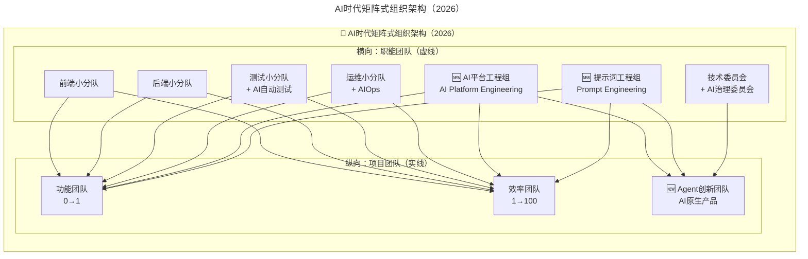
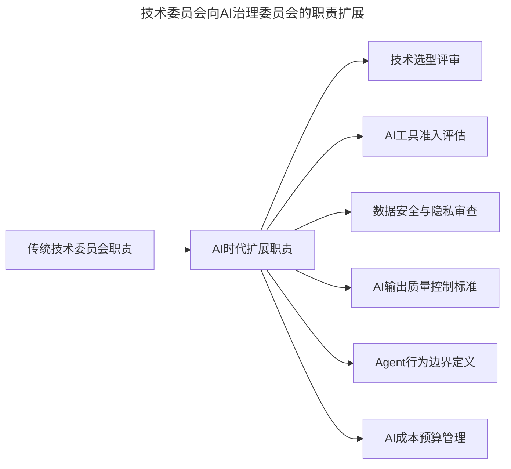
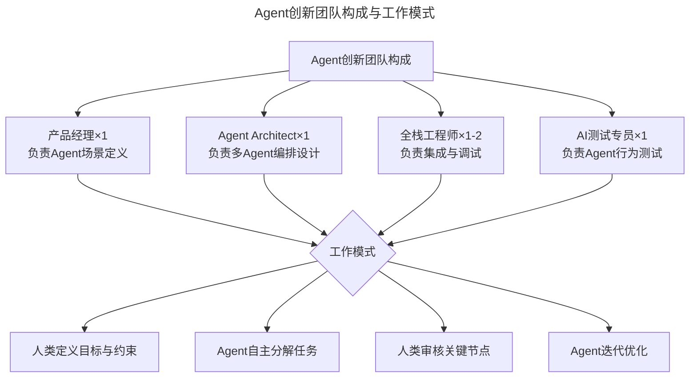
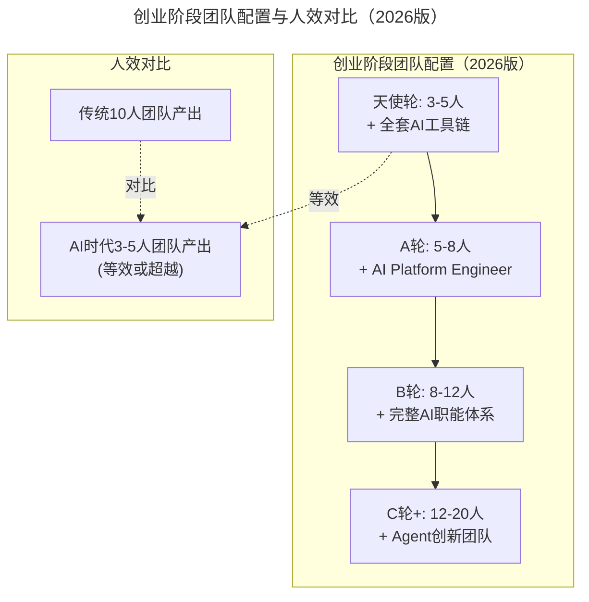

# 第14讲 | 从零开始搭建轻量级研发团队

> **适用范围**：初创公司技术负责人、CTO、研发团队 Tech Lead，以及需要从 0 到 1 搭建或重构研发组织架构的管理者。
>
> **更新摘要（v2 · 2026-08 更新）**：
> - 结构化升级为 6 节骨架（导言 / 核心方法论 / 关键流程 / 工具与实战 / 常见误区 / 进阶延展）
> - 保留矩阵式组织架构与四张组织架构图图注（原配图已失效，改为占位图注并以 Mermaid 图补充架构示意）
> - 整合 2026 年 AI 时代升级注解，新增 AI Platform Engineer、Prompt Engineer、Agent Architect 等角色说明
> - 补充人效对比数据、团队规模参考模型与轻量级团队搭建 Checklist

## 1. 导言

2015年，我加入特赞，带领了一支 5 人的研发团队。那时公司还在天使轮，团队最大的目标是能让产品上线，并证明我们的商业模式是可行的。三个月后，我们实现了这个目标，看到公司第一笔订单产生。随后我们拿到了 A 轮融资，开启了公司新的征程。在接下来的两年中，我们不断开发新的产品功能，不断优化现有产品特性，但似乎总是很难感受到研发和业务之间发生的直接影响。

不久前我们拿到了 B 轮融资，今年是公司的重要转折点，也是公司业务和规模同步增长的重要时期。我认为有必要将团队中一些有价值而有意义的工作做一些总结，希望能给业界朋友们一些帮助，或者给大家带来一种新的思考。

我将从组织架构、研发流程、绩效考核、团队文化这几个方面，与大家探讨如何打造一支高效的研发团队。首先从搭建团队组织架构开始，我们现在就一起出发吧。

## 2. 核心方法论

### 矩阵式组织架构

如果研发团队规模大于 10 人，并且希望团队以最高效的方式实现项目交付，不妨采用以下"矩阵式"组织架构（如图 1 所示）。该架构能让团队更加专注，而且整个架构的扩展性也非常强。

> 📌 图 1：矩阵式研发团队组织架构图（原配图已失效，架构示意见 4.1 节 AI 时代 Mermaid 图）

我们将横向的"职能团队"比喻为"虚线团队"，将纵向的"项目团队"比喻为"实线团队"。以实线项目团队为主，以虚线职能团队为辅。横纵交错，形成一个优雅的矩阵，横向可扩展，纵向可延伸。

矩阵式架构的核心思想是"横向关注人员成长，纵向关注项目落地"。项目团队为公司目标负责，职能团队为团队成长负责。换言之，项目团队帮助公司成长，员工可拿到项目奖金；职能团队帮助员工成长，为员工实现升职加薪。我们认为员工不应该存在"双线汇报"关系，这样只会让组织架构变得更复杂——因为项目团队才有汇报，职能团队没有汇报，只有培养。

### AI 时代的方法论升级

2026年，**Agent（智能体）已进入规模化落地期**，GPT-5.5和DeepSeek V4具备强大的自主任务执行能力。**84%的开发者使用AI编程工具**，这直接改变了研发团队的"人效比"——原文提到的"5人研发团队"，在AI时代可以产出相当于传统15-20人的成果。

**核心变化：团队规模的重新定义**

| 指标 | 传统时代（2020前） | AI时代（2026） |
|------|---------------------|----------------|
| MVP最小可行团队 | 8-10人 | **3-5人 + AI工具链** |
| 功能团队规模 | 5-8人 | **2-3人 + AI Agent** |
| 效率团队规模 | 3-5人 | **1-2人 + AI自动化** |
| 创新团队规模 | 3-5人 | **2-3人 + Agent编排** |

## 3. 关键流程

### 3.1 搭建横向的职能团队

根据团队成员专业技能的不同，可划分为多个职能团队，也称为"小分队"，例如：前端小分队、后端小分队、测试小分队、运维小分队等。当然，可根据我们所面临的实际环境，灵活划分出合理的职能团队。

需要注意的是，每个职能团队必须有一名负责人，也就是说，不要让同一人担任多个小分队的队长。因为划分职能团队的目的就是为了将专业技能聚焦，队长的职责之一就是帮助队员们在专业技能上得到成长，为职能团队赋能。

除了前端、后端、测试、运维这类职能团队以外，也可以搭建更有意思的职能团队，比如：技术委员会。

我们需要让团队们都知道的是，能够加入技术委员会的人，都是团队中技术水平最高的人，需要让他们有一种至高无上的荣誉感。技术委员会的成员可能来自于前端、后端、测试、运维，但技术委员会的人数一定是非常精简的。

技术委员会中有一名"技术主席"，也可称为"技术委员长"，他是整个技术委员会的权威，拥有最高的技术决策权，其他成员统称为"技术委员"，他们都是"技术专家"，而技术主席是"首席技术专家"。

随着团队规模的扩展，如果团队中其他队员希望申请加入技术委员会，此时必须得到委员们的一致认可，主席拥有最终决策权。加入的过程可能需要笔试或面试，或者也可以增加一些投票环节，我们可以把这个过程设计得更好玩一些。

除了技术委员会以外，还有产品委员会和设计委员会。产品委员会中的成员往往都是产品经理，当然也可以欢迎具备产品思维能力的工程师们加入，决定权还是交给产品委员会主席来定夺。设计委员会中的成员一般都是设计师，同样也包括对设计感兴趣的伙伴们。

需要强调的是，委员会中的成员，务必确保少而精，而且加入的成员都要有自己的责任。

可见，职能团队包括"小分队"与"委员会"两种形式，不管哪种形式都有一名负责人，即队长或主席，他们是自己所在职能团队的核心，他们的首要职责是帮助成员们在专业性方面得到提升，从而提高整个职能团队的战斗力。

职能团队负责人并非空降或任命，而是由职能团队成员们共同选举。每隔半年，团队全员可通过投票的形式，以匿名选举出自己心中认为最称职的职能团队负责人。也就是说，职能团队负责人是有任职期的，且任职期为半年，他们需要在这半年时间内努力改善自己所负责的职能团队，并努力让团队能得到成长，自己才能得到进步。

现在，我们可绘制一幅职能团队组织架构图（如图 2 所示），我们也可以根据实际情况进行合理设计。

> 📌 图 2：职能团队组织架构图（原配图已失效，架构示意见 4.1 节 Mermaid 图）

横向关注人员成长，纵向关注项目落地，下面我们就一起来搭建纵向的项目团队。

### 3.2 搭建纵向的项目团队

在纵向层面，我们还需要搭建一些项目团队，并确保这些项目团队是可以并行工作的，也就是说，他们的工作一般是彼此隔离，不会相互干扰。

在业务发展过程中，难免存在一些实验性工作，业务团队希望研发团队能够快速给出产品方案，并以最快的速度上线且投入市场，通过试错来验证业务的意义。研发团队也希望快速响应业务的变化，以提高产品和技术的价值。因此，我们需要搭建一个称为"功能团队"的组织，该组织的成员将面向业务中实验性的新功能进行快速开发，并确保这些功能可以尽快上线，但质量上却不能打折扣。

另一方面，已经上线的产品功能还需要在业务上不断磨合，通过不断收集用户反馈来持续迭代，才能打磨出一款优秀的产品。我们需要在已有产品功能上进行调优，以不断适应业务的需求。因此，我们需要搭建一个称为"效率团队"的组织，让他们来跟踪已经上线的产品功能，并通过数据和反馈来驱动产品不断优化。

公司主营业务固然重要，对于创新性业务而言，将会为公司带来更多的商业机会。因此，我们需要搭建一个称为"创新团队"的组织，它是我们的"独立团"，我们需要为这个团寻找一名称职的团长。

此时，你将得到一幅项目团队组织架构图（如图 3 所示），每个项目团队都有其负责人，每个项目团队可根据实际情况，划分多个项目小组，确保大家都能并行工作。

> 📌 图 3：项目团队组织架构图（原配图已失效，架构示意见 4.1 节 Mermaid 图）

需要注意的是，由于项目周期是变化且短暂的，因此每个项目的负责人也是动态的，可能由项目团队负责人来担当，也可能是由项目团队负责人授权一名项目成员来担当，但项目团队负责人需要为项目最后的结果负责。

如果说功能团队的职责是实现产品功能的从 0 到 1，那么效率团队的工作就是完成产品从 1 到 100（如图 4 所示）。

> 📌 图 4：功能团队与效率团队的关系（原配图已失效，关系说明见下文）

我们可将实验性的功能交给功能团队来研发，将优化性的工作交给效率团队来跟踪。

队员的选拔也十分重要。功能团队的队员对技术实现能力要求较高，尤其在做新功能的时候，需要考虑对整个系统架构的影响，不仅需要有较高的效率，同时还需确保较高的质量。效率团队的队员对业务理解能力要求较高，当他们对现有功能进行优化时，需要通过业务反馈和数据表现做出正确的判断，指导自己的下一步工作。

当功能团队所负责的项目上线后，他们会将该项目交接给效率团队，随后效率团队将对功能团队的交接情况给出评价，评价结果将影响功能团队的绩效考核成绩。

## 4. 工具与实战

### 4.1 AI 时代矩阵式组织架构升级

原有架构的 AI 增强版：

上图在原矩阵式架构基础上新增了 AI 平台工程组、提示词工程组两个职能团队，以及 Agent 创新团队这一项目团队类型，使组织既能承载传统交付，也能承载 AI 原生产品研发。

**新增关键角色说明**

| 新角色 | 职责 | 为什么需要（2026） |
|--------|------|-------------------|
| **AI Platform Engineer** | 维护企业内部AI基础设施、LLM网关、RAG系统 | AI工具链需要专业化运维 |
| **Prompt Engineer** | 设计和优化团队提示词库、建立Prompt最佳实践 | 提示词质量直接决定AI产出质量 |
| **Agent Architect** | 设计和编排多Agent协作流程 | Agent落地需要架构设计能力 |
| **AI Governance Officer** | 制定AI使用规范、安全审计、合规检查 | 企业AI使用需要治理框架 |

### 4.2 职能团队变革：技术委员会 → AI 治理委员会

原文提到"技术委员会"作为技术决策的核心机构。在2026年，建议扩展为**"AI治理委员会"**，新增职责：

AI 治理委员会在传统技术选型评审之外，承担了 AI 工具准入、数据安全、输出质量、Agent 行为边界与成本预算等新职责，是企业规模化使用 AI 的治理底座。

**可执行建议：**
- 建立企业**AI工具白名单制度**：评估安全性、成本、效果后才能引入
- 设定**AI代码占比上限**：建议核心模块AI生成代码不超过60%，确保可维护性
- 定期发布**AI使用报告**：透明化团队的AI采纳情况

### 4.3 项目团队重构

**功能团队（0→1）：AI加速原型验证**

⭐ **2026实践：**
- 使用**AI辅助PRD生成**：从需求描述到原型设计时间缩短70%
- **Vibe Coding模式**：产品经理+AI直接生成MVP，再交给工程团队优化
- **AI用户研究**：利用AI分析竞品、生成用户画像

**效率团队（1→100）：AI驱动持续优化**

⭐ **2026实践：**
- **AI Code Review Agent**：24小时自动审查代码，覆盖率达到95%+
- **智能告警系统**：AIOps自动识别异常，减少人工值守
- **AI文档维护**：代码变更自动同步更新文档

**🆕 Agent创新团队：AI原生产品研发**

这是AI时代全新的项目团队类型：

Agent 创新团队采用"人类定义目标与约束 → Agent 自主分解任务 → 人类审核关键节点 → Agent 迭代优化"的闭环工作模式，是人类目标设定能力与 Agent 执行能力的结合。

### 4.4 团队规模参考模型

该模型说明，随着融资轮次推进，团队应同步引入 AI Platform Engineer、完整 AI 职能体系与 Agent 创新团队；同时 3-5 人的 AI 时代小团队在产出上即可等效甚至超越传统 10 人团队。

## 5. 常见误区

### 误区一："AI能替代人"的幻觉

- **错误认知**：招更少的人，让AI补上
- **现实**：AI放大能力差异——**优秀工程师+AI = 超级工程师**；**普通工程师+AI = 可能产出更多bug**
- **对策**：**宁缺毋滥**在AI时代更加重要

### 误区二：忽视AI工具的学习成本

- **现象**：引入AI工具后，团队效率反而下降
- **原因**：学习曲线、提示词质量差、工作流未适配
- **对策**：预留**2-4周的适应期**，提供系统性培训

### 误区三：团队文化被AI稀释

- **现象**：过度依赖异步AI协作，团队凝聚力下降
- **对策**：保留**线下/视频的深度沟通时间**，AI不能替代人与人之间的信任建立

### 误区四：忽视双线汇报带来的复杂度（原文观点）

员工不应存在"双线汇报"关系，这样只会让组织架构变得更复杂。正确做法是项目团队才有汇报，职能团队没有汇报只有培养——项目团队为公司目标负责，职能团队为团队成长负责。

## 6. 进阶延展

### 6.1 2026年轻量级研发团队搭建 Checklist

- [ ] 明确团队的**AI成熟度目标**（入门/进阶/领先）
- [ ] 配置**AI Platform Engineer**角色（或由运维兼任）
- [ ] 建立**企业Prompt Library**（提示词库）
- [ ] 选择并统一**AI编程工具栈**（避免工具碎片化）
- [ ] 制定**AI代码规范**（如何标注AI生成代码、Review标准）
- [ ] 设立**AI创新实验预算**（鼓励探索新工具）
- [ ] 每季度评估**AI工具ROI**，淘汰低效工具

### 6.2 从"搭班子"到"搭人机系统"

对于一支研发团队而言，需要拥有合理的组织架构、高效的研发流程、科学的绩效考核、良好的团队文化。如果缺乏这些方面的建设，研发管理工作将变得痛苦且低效。我们应该做的是，从管理中追求效率，从效率中提升价值。

杰克·韦尔奇曾经说过：Before you are a leader, success is all about yourself. When you become a leader, success is all about growing others.（在你成为领导者之前，成功的全部就是自我成长；当你成为领导者之时，成功的全部就是帮助他人成长。）

当你在赛场上踢球时，你应该考虑做一名优秀的球员；当你成为一名优秀的球员时，你应该考虑做一名优秀的教练。从技术到管理，正是球员转变为教练的过程，我们不能停止前进的脚步。团队的成功，才是我们的成功，我们的职责是给团队赋能。

> 💡 **一句话总结（2026版）**：
> "轻量级"的定义变了——不是人少，而是**人机协同效率高**。2026年的轻量级团队 = **精干的人才 + 强大的AI工具链 + 清晰的人机协作规范**。管理者要从"搭班子"升级为"**搭人机系统**"。

_**作者简介**_

黄勇，现任特赞科技（tezign.com）CTO，图书《架构探险》作者，Smart 开源项目作者， [TGO鲲鹏会](https://tgo.geekbang.org) 上海分会董事会成员，QCon 讲师。十年以上互联网软件架构与技术管理经验，擅长敏捷开发，推崇"轻量级"系统架构。喜欢阅读，热爱交流，乐于分享。

---

*本注解基于2026年6月的技术环境编写，随着AI技术的快速发展，部分具体工具和建议可能需要定期更新。*