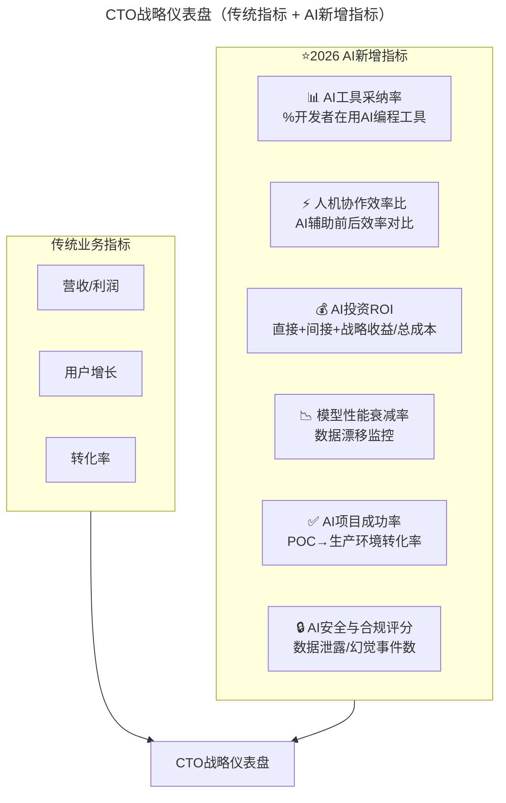
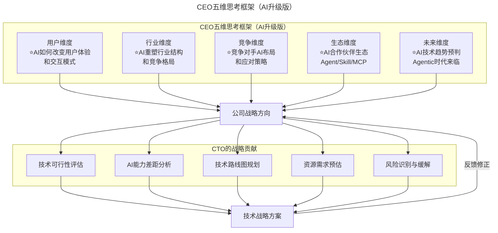

# 第6讲 | 像CEO一样思考

> **适用范围**：CTO、技术 VP、技术总监，以及希望从技术负责人向商业领导者进阶的管理者。
>
> **更新摘要（v2 · 2026-08 更新）**：
> - 结构化升级为 6 节骨架（导言 / 核心方法论 / 关键流程 / 工具与实战 / 常见误区 / 进阶延展）
> - 保留原文"CEO 五维思考框架"与"用数据说话"方法论
> - 整合 2026 年 AI 时代升级注解，为所有 Mermaid 图补充 `title` frontmatter
> - 新增 AI 时代五维思考升级对照表、AI 关键指标仪表盘与 CTO→CEO 转型新要求

## 1. 导言

2008年5月，我加盟京东。实话说，刚到京东的时候，京东技术面临非常多的问题，甚至根本跟不上业务的成长。所以我在京东做的第一件事情，就是准备了5个人的团队，郊区租了一个别墅，决定开始封闭开发，要把京东的网站进行改版。

我们5人团队连续征战了三个月，把整个网站都重新改写了。正是因为这次改版，京东的用户体验上了一个台阶，成为电商用户体验的标杆。那次改版之后，京东的订单从几千单突破了几万单。

在公司小的时候，很多事情CTO都必须亲力亲为。但是，当公司逐渐长大，比如2010年京东的技术团队超过了200人，开始做前后台拆分，公司的快速成长对我的能力提出了更高的要求。一年后，京东的前、后台都超过了600人，技术架构必须统一，我以前从来没带过这么大的团队，面临着很大的挑战。

我意识到，作为一个技术专家，我可能是够格的，但是作为一个CTO，其实我没有准备好。这时我想起这句话，站在CEO的角度思考。

经过一段波折，2012年底，我把京东整个研发体系重新管理起来。2012年到2015年5月期间，京东的技术又上了一个台阶。

所以，我想要跟大家分享：CTO要像CEO一样思考。其实有时候做这个决定很难，因为，这意味着你要受委屈，你要放下，你要接受很多挑战，最重要的是，你要坚持。

## 2. 核心方法论

### 换位思考：CEO 眼中的 CTO 是啥样？

一个人最大的问题，是不能很好地认识自己。两个人互相审视，一定会发现一个盲点，即你身上的问题我知道，而你不自知。

所以作为CTO，一定要360度审视自己：员工对你有什么样的要求，同事对你有什么样的要求，CEO对你有什么样的要求，特别是在他们眼中是怎么看待你的。如果你不把这个问题处理好，你就不是一个合格的CTO。

那么，CTO怎么才能让别人能理解我们呢？我觉得要反过来换位思考：我们要去理解别人，如果我们很好地理解别人了，就能很好地让别人来理解我们。如果研究我们自己的话，我们是有盲点的，所以我们要把同事、员工、CEO甚至合作伙伴当做镜子，不断地反思。

通常在CEO眼里，CTO是一个「成本中心」，总是要钱、要人、要资源，还经常出事，这是一个困境。

一般来说，CTO最大的问题在于沟通。我们习惯用技术思维来沟通，在我们的世界里只有0和1，非黑即白。但是对CEO来讲，每天面临的都是不确定问题，不是靠推导逻辑可以推导出来的。

尤其做战略选择的时候，只是判断一种可能性，他面临很大的压力，这种思维模式跟技术思维是不一样的。所以我们用技术思维方式去跟CEO、业务部门沟通，就会有很多问题。

### CEO 如何思考问题？五维框架

CEO怎么思考问题呢？一般有五个维度：

**第一个，用户维度。** 一个公司其实就是做两件事：第一件事，把用户吸引过来；第二件事，让用户把钱掏出来，把用户留住，持续掏他腰包。所以CTO要研究：我们企业的用户是谁？用户从哪儿来？怎么把用户留住？怎么让用户掏腰包？怎么提升用户的转化率？

**第二个维度是行业的维度。** CTO必须要具备行业知识，不能只讲技术，不能只用技术语言，很多时候你要结合商业和技术。你必须要懂行业，了解行业的本质。

**第三个维度是竞争。** CTO要对他所在的行业了如指掌，特别是这个行业里有多少企业，处在什么样的地位。要对整个产业画一个地图，把我们企业和企业未来要演变的路径标在上面。

**第四个维度是生态。** 也就是要关注我们的合作伙伴，CTO的圈子不仅仅要有技术圈，还要有行业的圈子，扩大自己的圈子，找到可以帮你的人。

**第五个维度是要面向未来去思考。** 如果CTO能看到公司未来三年、五年的前景，可能会更得心应手。CEO的思维一定是面向未来的。所以怎么把技术的战略跟公司的业务战略结合起来，这也是CTO要研究的课题。

### 五维思考框架的 AI 升级版

| 维度 | 原始问题 | ⭐2026 AI时代新增问题 |
|------|---------|---------------------|
| 用户维度 | 用户是谁？怎么留住？ | **AI如何改变用户体验和价值感知？AI能否创造全新的用户触点？** |
| 行业维度 | 行业本质是什么？ | **AI如何重塑行业结构和竞争格局？谁是AI时代的颠覆者？** |
| 竞争维度 | 对手在干什么？ | **竞争对手的AI布局？我们的AI差异化策略？** |
| 生态维度 | 合作伙伴是谁？ | **AI合作伙伴生态？Agent/Skill市场？MCP协议生态？** |
| 未来维度 | 未来3-5年前景？ | **AI技术趋势对未来3-5年的影响预判？Agentic Workflow何时成熟？** |

## 3. 关键流程

### 沟通的时候，用数据说话

在京东，我学到很好的一招：和CEO沟通的时候，尽量用数据说话。包括立项，要说清楚这个项目能给公司带来什么，不是带来技术的先进性，而是跟收入、利润或者用户体验挂钩。如果你这么去做，更能够得到业务部门的支持，也更能够得到CEO的支持。

用数据说话也意味着，每个技术团队的成长可能都有三个阶段。

**第一个阶段，技术跟随业务。** 业务跑得很快，技术跟在后面，业务部门可能不满意，但是要通过技术能力的提升去满足业务的要求。

**第二个阶段，技术同业务肩并肩。** 这个阶段需要用数据说话。在京东我们成立了一个大数据部门，对每个业务部门制定3~5个指标，每个核心指标包括100~300个小指标。每个月都会做月度经营会，各个部门PK这些指标，通过指标的PK，各个部门业务就可以提升。

也就是说，企业发展一定有一个业务验证到规模化的阶段，而规模化的时候就需要精细化，精细化的时候就需要数据说话。

我在京东的时候，曾给强东总做了一个仪表盘，打开手机对公司的经营情况一目了然，非常清楚哪个库房出问题了，哪里打包拥堵了，我们会用三种颜色来标记业务的状态：黄色警告，绿色正常，红色报警。

**第三个阶段，通过技术来引领整个公司的发展。** 在京东一路走来，我认为技术部门一定要换一个思路：要跟业务部门做伙伴，要帮助业务部门成功。

### 技术跟随业务的三个阶段 → AI 版本

| 阶段 | 原始定义 | ⭐2026 AI升级版 | 典型实践 |
|------|---------|----------------|---------|
| 阶段1 | 技术跟随业务 | **AI工具提效阶段** | Copilot辅助编程、AI客服、智能文档 |
| 阶段2 | 技术与业务肩并肩 | **AI驱动流程重构阶段** | AI研发流程、AIOps、智能测试 |
| 阶段3 | 技术引领发展 | **AI-Native产品创新阶段** | AI定义新产品形态、Agentic SaaS |

**⭐2026关键洞察**：
- 大多数企业正处于**阶段1.5**：开始用AI提效，但尚未系统化
- 领先企业已进入**阶段2-3过渡期**：用AI重塑核心业务流程
- **84%开发者使用AI编程**意味着"技术跟随业务"的速度可以大幅提升

### 当家才知柴米油盐贵

最后说说我自己成为一名CEO之后的一些感悟。

说实话，变化还是挺大的，比如做CTO的时候，当一门新的技术出来的时候，就会深入下去，可以亲自动手，现在就比较难做到了。我能做到的是搭一个平台，让这些牛人团结起来，在那个技术方向上能够深入下去，并且我让他们随时把进展的情况给我分享，我就能够跟上这个技术发展的步伐。

当你从CTO到CEO位置的时候，你需要有勇气来承认技术上不如CTO了，但是要保持对技术的好奇心，要跟踪技术的趋势，同时要尽量花多一点时间跟他们在一起。

另一个方面，技术现在进步非常快，但是技术怎么转化成生产力？怎么去商业变现？这是我考虑更多的问题，怎么从新技术，或者新趋势里面找到商业机会，这方面我往往很敏感。

你当了家之后，你才知道柴米油盐贵，当你成了CEO，公司的生存发展就是头等大事。而且CEO承担的压力是很大的，很多人都在关注你，我当CEO之后，抗压能力更高了，对自己的要求也更高了。

## 4. 工具与实战

### "用数据说话"的 AI 时代增强版

**传统数据仪表盘**：KPI、收入、利润、用户增长

**⭐2026新增AI关键指标**：

CTO 战略仪表盘在传统营收/用户/转化指标之外，新增 AI 工具采纳率、人机协作效率比、AI 投资 ROI、模型性能衰减率、AI 项目成功率、AI 安全与合规评分六类指标，用于量化 AI 转型成效。

**具体指标说明**：

| 指标名称 | 计算方式 | 目标参考值（2026） |
|---------|---------|------------------|
| AI工具采纳率 | 使用AI工具的开发者数 / 总开发者数 | ≥80% |
| 人机协作效率比 | AI辅助后产出 / AI辅助前产出 | 1.5x - 3x |
| AI投资ROI | (直接收益+间接收益+战略收益) / 总成本 | >200% |
| 模型性能衰减率 | 当前准确率 - 上季度准确率 | <5%/季度 |
| AI项目成功率 | 成功上线的AI项目数 / 启动的AI项目数 | >60% |

### CEO 五维思考框架 AI 升级版

CEO 五维思考框架在 AI 升级版中，每个维度都新增了 AI 相关问题；CTO 的战略贡献则从单纯的技术可行性评估，扩展到 AI 能力差距分析、技术路线图规划、资源需求预估与风险识别，形成"战略方向 ↔ 技术方案"的双向反馈闭环。

### 李大学从 CTO 到 CEO 感悟的 AI 启示

| 原文感悟 | AI时代诠释 | ⭐2026行动建议 |
|---------|-----------|---------------|
| "搭一个平台让牛人团结起来" | **AI-Native IDP（内部开发者平台）正是这样的平台** | 建设集成AI能力的IDP，统一模型接入、Prompt管理、效果评估 |
| "技术怎么转化成生产力" | **AI正在极大缩短技术到生产力的转化路径** | 从"技术→产品→市场"变为"AI能力→场景→价值"的快速闭环 |
| "没有了框框" | **AI创业者最大的优势就是没有历史包袱** | AI-Native公司可以跳过传统IT架构，直接构建AI-First体系 |
| "当家才知柴米油盐贵" | **AI成本管控成为新挑战** | Token成本、算力成本、API调用费用需要精细化核算 |

## 5. 常见误区

### 误区一：在 CEO 眼里 CTO 只是"成本中心"

总是要钱、要人、要资源还经常出事，是 CTO 在 CEO 眼中的典型困境。破解之道是换位思考，理解 CEO 面临的不确定性与压力，用商业语言而非纯技术语言沟通。

### 误区二：用技术思维与 CEO 沟通

技术人习惯用 0 和 1、非黑即白的思维沟通，但 CEO 每天面临不确定问题，做战略选择只是判断一种可能性。用技术思维方式去跟 CEO、业务部门沟通会产生很多问题。

### 误区三：只讲技术先进性，不讲业务贡献

立项时只讲技术先进性，而不跟收入、利润或用户体验挂钩，难以获得业务部门与 CEO 的支持。应说清楚项目能给公司带来什么业务价值。

### 误区四：技术人不学行业知识

如果不懂仓储、配送、供应链、零售等业务知识，就无法跟业务部门沟通，更没法同 CEO 沟通。CTO 必须具备行业知识，结合商业和技术。

### 误区五：AI 时代忽视成本管控

"当家才知柴米油盐贵"在 AI 时代有了新含义：Token 成本、算力成本、API 调用费用需要精细化核算，AI 成本管控成为 CTO/CEO 的新挑战。

## 6. 进阶延展

### CTO→CEO 转型的新要求

**传统CTO→CEO的能力迁移**：
- 技术深度 → 商业广度
- 产品思维 → 用户+利润思维
- 团队管理 → 组织变革

**⭐2026新增迁移维度**：
- **AI判断力** → **AI战略决策力**
- **工具使用者** → **AI体系设计者**
- **效率追求者** → **价值创造者**

**GPT-5.5时代的特殊挑战**：
- 当AI能写代码、做架构、写文档时，**CTO的独特价值是什么？**
- 答案：**连接技术与商业的翻译者 + AI体系的架构师 + 组织变革的推动者**

### ⭐2026行动清单

**本周可执行**：
- [ ] 绘制公司的"AI五维分析图"（用户/行业/竞争/生态/未来各维度的AI影响）
- [ ] 建立AI投资ROI追踪仪表盘（至少包含3个核心指标）
- [ ] 与CEO进行一次"AI战略对齐"对话

**本季度目标**：
- [ ] 完成团队AI能力现状评估（L1-L4分级）
- [ ] 确定1-2个AI-Native产品创新方向
- [ ] 制定公司级AI治理框架初稿

_**作者简介**_

李大学，磁云科技董事长兼CEO、京东集团终身荣誉技术顾问。中国互联网+实战团发起人，正和岛互联网+部落酋长。曾担任天极网CTO、京东集团高级副总裁，主管技术研发体系。在京东期间，带领京东研发团队从不到30人发展到近5000人，通过技术驱动，实现了京东业务一万倍的成长。
