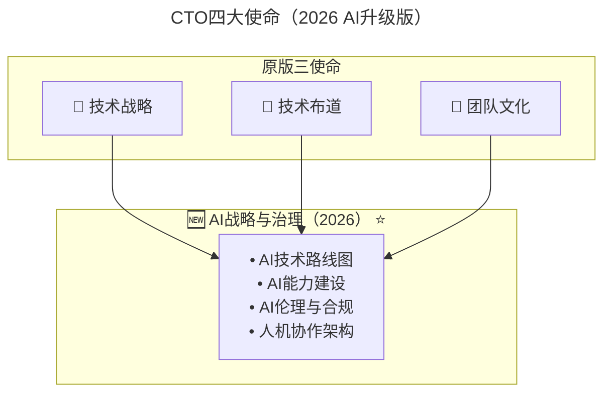
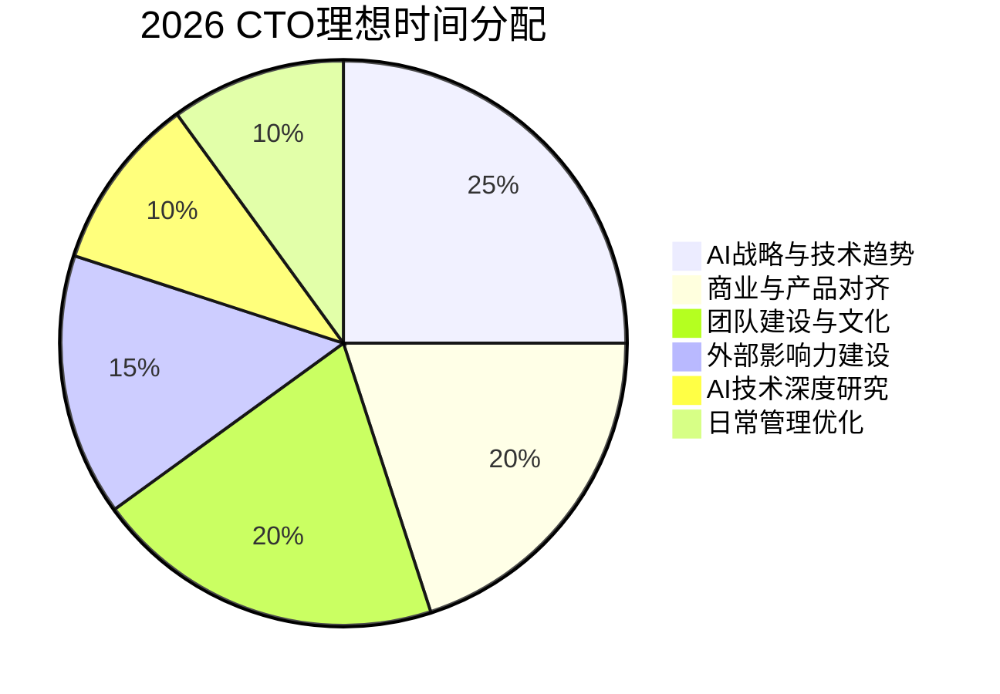

# 第61讲 | 刘俊强：技术最高决策者应该关注技术细节吗?

> **适用范围**：CTO、VP of Engineering、技术最高决策者，以及正在厘清自身技术细节关注边界的资深技术管理者。
>
> **更新摘要（v2 · 2026-08 更新）**：
> - 结构化升级为 6 节骨架（导言 / 核心方法论 / 关键流程 / 工具与实战 / 常见误区 / 进阶延展）
> - 保留原文"CTO 三大使命"与"是否符合使命与职责"的结论
> - 整合 2026 年 AI 时代升级注解，为所有 Mermaid 图补充 `title` frontmatter
> - 新增第四使命"AI 战略与治理"、CTO 时间分配 pie 图与 AI 战略级细节清单

## 1. 导言

作为公司的技术最高决策者，身上肩负了很多的职责，不光有公司的技术路线图、投资标的公司的技术尽职调查以及关键技术趋势研究等战略级事务；还有工程团队文化建设、技术布道等帮助公司健康发展的关键事务；还有跨部门沟通、为其它部门提供服务能力帮助他们一起成就公司愿景等。

在目前典型公司架构中，工程团队或技术团队的总负责人便是该公司的技术最高决策者，那么本文要讨论的技术最高决策者就是 CTO（首席技术官）或 VP of Engineering（技术副总裁或工程副总裁），这个一般根据公司的实际职位设置情况来，本文默认 CTO 为技术最高决策者。

技术或工程团队日常工作中会有很多的技术细节类工作，例如技术框架选择、高可用架构设计以及持续集成等，那么一般困扰我们的是，作为技术最高决策者跟这些技术细节的边界是什么？是否应该关注这些技术细节？

我接下来将先简单梳理下CTO的工作职责内容，然后我们再看是否应该关注技术细节，在本文阅读完毕后，希望你自己也能够根据现状进行思考。

## 2. 核心方法论

### CTO 的使命

CTO 的使命我们可以从三个维度来进行说明：长期的技术战略、技术布道者以及工程团队文化建设，里面仅第三项是完全的对内事务，前面两项都是内外结合型事务。

**CTO 的使命——长期的技术战略**
1. CTO 必须不断推进、阐述并坚持公司的技术战略方向；
2. CTO 需确保公司在激烈变化的竞争下持续提供最佳技术；
3. CTO 需要通过信息获取提取来指引支持公司下一步发展的关键趋势，从而将外部世界与公司内部联系起来，实现业务和技术战略之间的适当平衡。

**CTO 的使命——技术布道者**
1. CTO 必须围绕公司的长期愿景来激励内部人员，并向外部表达并使他们相信世界或行业未来发展方向，而自己的公司是带领大家抵达未来的最佳选择；
2. CTO 必须对市场需求具有权威性，必须对客户可信，并且能够向各类的受众阐明公司商业价值和投资回报率。

**CTO 的使命——工程团队文化建设**
1. CTO 必须团结起来工程团队，来实现公司的长期技术目标；
2. CTO 必须能够激励新员工加入工程团队，并且帮助找到渠道并识别合适员工；
3. CTO 必须帮助建立和维护工程文化，以确保公司能够持续留住和吸引顶尖技术人才。

### CTO 对内主要职责

**CTO 对内主要职责——CEO 或战略**
1. 预测可能对公司产生重大影响的任何技术拐点，并且保持领先；
2. 根据公司长期技术战略，向 CEO（以及 CFO/COO）就公司的大规模技术投资时机和机会点提供建议；
3. 为 CEO 提供有关公司技术方向的不同"选项"，并提供足够的决策依据信息，以确保在任何给定时间都是最佳技术选择。

**CTO 对内主要职责——工程/产品**
1. 虽然 CTO 不需要为产品日常交付情况负责，但也应该与产品或工程副总裁密切合作，以确保整体发展方向与公司的战略技术保持一致；
2. CTO 应该确认在既定技术战略下，公司技术资源投放的优先级，并交给工程团队予以执行；
3. 需要帮助技术或工程副总裁集思广益，了解工程团队面临的各种挑战；
4. 持续优化整个组织，以达到技术资源最合适的收益比；
5. 确保工程团队在壮大的同时，保持技术的一致性，并在必要时进行技术仲裁；
6. 建立合适的创新机制，例如黑客马拉松或内部孵化计划；
7. 帮助招募和员工留存工作。

### AI 时代 CTO 四大使命



CTO 四大使命在原三大使命之上新增"AI 战略与治理"，覆盖 AI 技术路线图、AI 能力建设、AI 伦理与合规、人机协作架构四个方面。

#### 使命一升级：长期的技术战略 → "长期的技术+AI战略"

| 战略维度 | 传统CTO关注点 | **2026 CTO新增关注点** |
|---------|-------------|---------------------|
| **技术趋势** | 云原生、微服务、分布式 | **LLM应用、Agent架构、多模态AI** |
| **技术选型** | 编程语言、框架、数据库 | **AI模型选择、AI工具链、向量数据库** |
| **技术投资** | 服务器、云服务、开发工具 | **AI API成本、GPU资源、AI SaaS订阅** |
| **人才规划** | 招聘工程师、培养架构师 | **招聘AI工程师、培养Prompt Engineer** |

## 3. 关键流程

### 是否应该关注技术细节？

本文前面说了很多关于CTO的使命与职责，那么作为技术最高决策者是否应该关注技术细节呢？在此先说结论， **符合其使命和职责方向的技术细节需要关注，此外的技术细节不必要关注**。

CTO 全称为 Chief Technology Officer（首席技术官），重点要注意的是 Officer，也就是高级管理者的角色，首先需要对公司的长期技术战略进行负责，保证公司在技术拐点产生时能够作出正确的判断并制定应对策略。

例如 2007年6月苹果公司发布了跨时代产品——第一代 iPhone，成为了移动互联网发展元年。CTO 需要了解 iPhone 的详细产品功能以及技术规格等技术细节，并对 iPhone 相关移动网络技术进行调研，从而来分析判断 iPhone 及移动互联网发展趋势，来看公司的技术战略是否需要进行相应调整。

移动互联网的技术拐点来临的时候，我亲身经历过技术趋势分析和公司技术方向调整，当时公司在2007年开始做移动互联网方向的尝试，在同年 iPhone 发布后，研究后觉得 iPhone 走的方向是智能手机未来，决定投入少量人力研究和保持关注 iPhone OS，次年苹果公司发布了 iPhone OS SDK 1.0，我们就立马组建了 iPhone 客户端团队进行移动互联网应用开发。由于我们在移动互联网方面的提前布局，也帮助公司顺利拿下下一轮投资。

那么这里我们以火热的技术架构设计风格——微服务——为例说明下。作为 CTO 需要针对微服务架构设计风格对于公司选用的收益及风险进行评估，以及需要来看跟公司业务发展方向是否一致，这样的微服务相关的技术细节是需要 CTO 进行了解和关注的。

作为 CTO 不应该将时间投入到产品日常迭代和编码这样的技术细节中，例如具体技术框架选取、架构方案设计以及代码评审等，其中亲自上阵写代码是最应该被禁止的。

有的 CTO 会参与到具体执行工作中去，一般的理由有"团队小"、"该领域我是专家"、"这项工作团队其他人的交付速度与质量不如我"，其实这些理由后面恰恰对应的待解决的问题：
- "团队小"：需要反思这个阶段是否需要 CTO 这样的职位；
- "该领域我是专家"：需要将知识经验分享给团队成员，或是招募该领域其它专家，因为你自己很容易成为单点；
- "这项工作团队其他人的交付速度与质量不如我"：意味着没有招募到合适的团队成员，这个问题应该被纠正。

### "关注技术细节"的 AI 时代新答案

**⭐2026更新结论**：

```
2018版：CTO应关注 = 符合使命的技术细节
2026版：CTO应关注 = 符合使命的技术细节 + AI战略级细节
                    CTO不应关注 = 日常编码 + 可被AI替代的执行性工作
```

## 4. 工具与实战

### ⭐2026 CTO 应该关注的"AI战略级细节"

| 细节类型 | 具体内容 | 为什么重要 |
|---------|---------|-----------|
| **AI模型选型** | 用GPT-5.5还是DeepSeek V4？开源还是闭源？ | 直接影响产品能力和成本结构 |
| **AI架构设计** | RAG还是Fine-tuning？Agent如何编排？ | 决定AI系统的可扩展性和可靠性 |
| **AI安全合规** | 数据隐私、输出审核、偏见检测 | 合规风险可能导致公司倒闭 |
| **AI成本模型** | Token消耗、API调用频率、GPU租用 | 可能占据30-50%的技术预算 |
| **AI能力边界** | AI能做什么/不能做什么？准确率多少？ | 影响产品承诺和用户期望 |
| **AI团队能力** | 团队AI技能水平、培训需求 | 决定AI战略的落地效果 |

### ⭐2026 CTO 不应该关注的细节（升级版）

| 细节类型 | 原文观点 | **2026补充** |
|---------|---------|------------|
| 产品日常迭代 | 不需要关注 | ✅ 更不需要——AI可以辅助生成大部分代码 |
| 具体框架选择 | 交给技术总监 | ✅ 同上——但需关注AI工具链的整体选择 |
| 代码评审 | 不需要亲自做 | ✅ AI Code Review已很成熟 |
| **亲自写代码** | 最应该被禁止 | ✅ **绝对禁止——除非是写AI相关的PoC验证** |

### CTO 时间分配的 AI 时代重构



在这一分配中，AI 战略与技术趋势（25%）与 AI 技术深度研究（10%）合计占去三分之一，而日常编码等具体技术实现已完全下放（0%），体现了 2026 年 CTO 角色的战略化转型。

## 5. 常见误区

### 误区一：CTO 亲自上阵写代码

亲自上阵写代码是最应该被禁止的。每个人的时间都是有限的，CTO 需要将时间更多的花在跟公司未来、技术趋势以及商业拓展相关的事情上。

### 误区二："团队小"所以 CTO 要兼顾执行

需要反思这个阶段是否需要 CTO 这样的职位，或者给予技术联创创始人更为合适，或是招募优秀团队成员加入。

### 误区三："该领域我是专家"所以亲自做

需要将知识经验分享给团队成员，或是招募该领域其它专家，因为你自己很容易成为单点，这样是很危险且不负责任的。如果持续这样想，另一种可能是你并非适合 CTO 职位，或更为适合首席架构师。

### 误区四："团队其他人交付不如我"就自己上

意味着没有招募到合适的团队成员，这个问题应该被纠正，而不是自己顶上。

### 误区五：AI 时代仍用旧标准界定"技术细节"

2026 年 CTO 应关注的是"AI 战略级细节"——AI 模型选型、AI 架构设计、AI 安全合规、AI 成本模型等，而不是传统的代码级细节。AI Code Review 已很成熟，亲自做代码评审已无必要。

## 6. 进阶延展

### AI 时代的 CTO 自我检测清单

#### AI战略维度
- [ ] 我能否清晰描述公司的AI路线图？
- [ ] 我知道我们的主要竞品在AI上的投入和进展吗？
- [ ] 我能评估不同AI方案的成本效益吗？
- [ ] 我了解AI应用的法律法规边界吗？

#### AI能力维度
- [ ] 我自己熟练使用至少3种AI工具吗？
- [ ] 我能用AI辅助完成战略分析报告吗？
- [ ] 我能识别AI输出的幻觉和错误吗？
- [ ] 我知道什么时候该用AI、什么时候不该用吗？

#### 团队赋能维度
- [ ] 我的团队80%以上成员日常使用AI工具吗？
- [ ] 我们有明确的AI使用规范和最佳实践吗？
- [ ] 我们定期分享AI相关的新发现和新工具吗？
- [ ] 我的团队成员知道AI的能力边界吗？

### AI 会让 CTO 这个角色消失吗？

> ⭐核心观点：**不会消失，但会进化。**

**CTO角色的演进路径**：
```
CTO 1.0（2000-2010）：首席技术官 = 最强的程序员
CTO 2.0（2010-2020）：首席技术官 = 技术战略家 + 团队领导者
CTO 3.0（2020-2025）：首席技术官 = 数字化转型推动者
CTO 4.0（2026-）：首席技术官 = **AI战略架构师 + 人机协作设计师**
```

> **终极建议**：2026年的CTO，请记住——**你的价值不在于你能写出多好的代码，而在于你能设计出多好的"人+AI"协作系统，以及你能为公司的AI未来做出多正确的战略选择。**

### 写在后面

作为公司技术最高决策者首先需要明确自己在公司承担什么职责，这样才能够清楚怎样的技术细节是应该关注的，哪些技术细节是不需要关注的。正如前面所说的结论 **"符合其使命和职责方向的技术细节需要关注，此外的技术细节不必要关注"**，使命和职责是需要先明确的。

总而言之，技术最高决策者需要明白的是，这个岗位的职责是要为公司业务发展及未来负责的，因此技术细节边界的确立有助于更好地分配时间来帮助实现公司愿景。

**作者介绍**

刘俊强（微信公众号：程序员精进）现任腾讯云资深架构师， [TGO 鲲鹏会](https://tgo.geekbang.org) 深圳分会董事会成员，小组委员，曾任迅雷技术总监、某互联网公司技术副总裁，10+年以上互联网开发经验，8年以上技术管理经验。

---

*本注解基于2026年6月的技术环境编写，随着AI技术的快速发展，部分具体工具和建议可能需要定期更新。建议每季度回顾一次本文内容，结合最新技术动态调整策略。*
