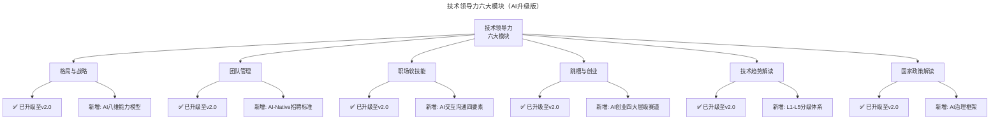
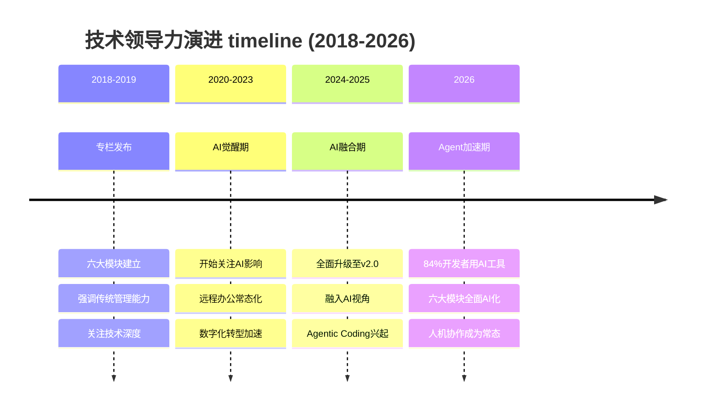
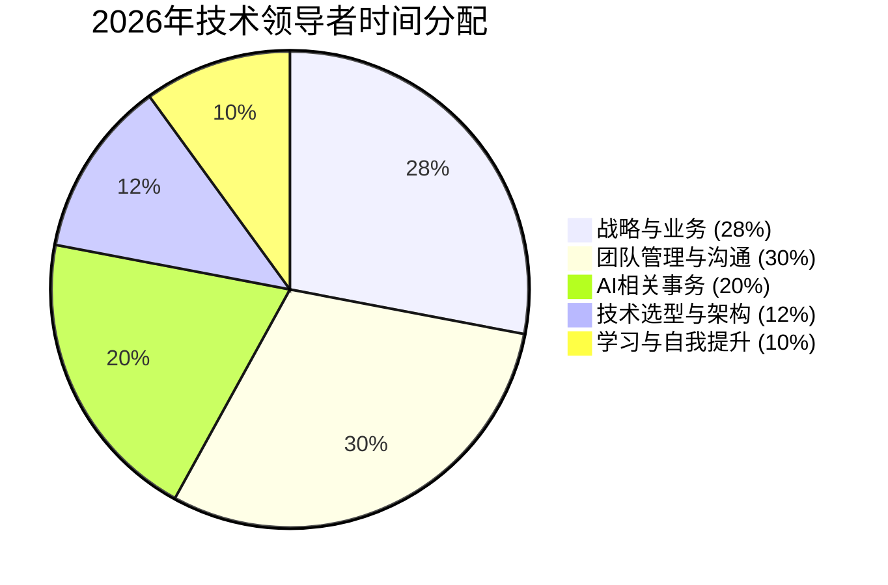

# 开篇词 | 卓越的团队，必然有一个卓越的领导者

> **适用范围**：技术领导力实战笔记专栏读者，以及希望系统提升技术领导力的 CTO、技术 VP、技术总监与技术经理。
>
> **更新摘要（v2 · 2026-08 更新）**：
> - 结构化升级为 6 节骨架（导言 / 核心方法论 / 关键流程 / 工具与实战 / 常见误区 / 进阶延展）
> - 保留原文德鲁克名言与"六大模块"体系
> - 整合 2026 年 AI 时代升级注解，为所有 Mermaid 图补充 `title` frontmatter
> - 新增 AI-Native 领导者对比表、领导者能力需求变化数据与学习效率提升数据

## 1. 导言

管理大师彼得·德鲁克说："组织的目的，就是让平凡的人做出不平凡的事。"然而，不是任何一群平凡的人聚集到一起，都能做出不平凡的事。甚至一群优秀的人聚集到一起，也可能只是一个平庸的组织。

因为，大到一个国家，小到一个团队，任何一个卓越的组织，都必须有一个卓越的领导者。领导者是一个组织的灵魂，在很大程度上决定了组织所能达到的高度。

技术团队同样如此，管理者的战略眼光、管理方法、人格魅力等，都会给团队的工作结果带来决定性的影响。

但技术管理者面临的具体问题又有其独特之处。虽然CTO、技术VP、技术总监等职位的职责各有偏重，但总的来说，技术管理者对内要负责技术选型、产品功能实现、团队成员培养、技术人员考核等等；对外则要承担扩大公司技术影响力、为公司招募更多优秀研发人员，发展潜在客户等职责。

因为工作关系，我们有机会经常与技术管理者交流。在这一过程中我们发现，技术管理者面临的问题往往是相通的，每一个技术人在通向技术高管的路上都要趟过无数个坑。比如"如何与其他部门的负责人高效沟通？""如何制定科学的绩效考核方法？""面对新的技术趋势应该如何布局？""怎样做好技术人员招聘？"等等。

关于这些问题，通过其他优秀的技术领导者在实践中总结的方法论来学习和提升，是最为高效的方式。因为人类之所以能够取得今天的成就，就是因为我们可以通过阅读等方式，不断地在前行者的基础上再进一步。

## 2. 核心方法论

### 领导者是组织的灵魂

本文是《技术领导力实战笔记》专栏的开篇词，核心论点包括：

1. **德鲁克名言**："组织的目的，就是让平凡的人做出不平凡的事"
2. **领导者是组织的灵魂**：在很大程度上决定了组织所能达到的高度
3. **技术管理者的独特挑战**：对内（技术选型、产品实现、团队培养、人员考核）+ 对外（技术影响力、人才招募、客户发展）
4. **六大模块体系**：格局与战略、团队管理、职场软技能、跳槽与创业、技术趋势解读、国家政策解读
5. **终身学习的理念**：通过阅读和借鉴前行者的经验，不断在他人基础上再进一步

### 传统领导者 vs AI-Native 领导者

开篇词强调领导者的决定性作用。2026年这一观点在AI时代有了新的验证和深化：

| 维度 | 传统技术领导者（2018） | AI-Native技术领导者（2026） |
|------|---------------------|--------------------------|
| 核心能力 | 技术深度+管理能力 | AI战略思维+人机协同决策 |
| 决策依据 | 经验+直觉 | 数据+AI洞察+人类判断 |
| 团队角色 | 指挥者+管理者 | 协调者+赋能者+AI编排者 |
| 价值来源 | 个人专业能力 | 激发团队+AI协同效能 |
| 学习方式 | 阅读书籍/参加培训 | 人机协作学习+实时信息获取 |

**关键数据支持：**
- **84%开发者使用AI编程工具**（Stack Overflow 2026）：工具普及倒逼领导者升级
- **McKinsey 2026报告**：86%企业承认AI转型困难，根本原因在于缺乏具备AI战略思维的领导者
- **Agentic Coding渗透率29%**：领先企业已经开始采用智能体编程模式，要求领导者具备Agent编排能力

### "平凡的人做出不平凡的事"——AI 时代的全新可能

**2018年的理解：**
- 通过优秀的管理方法和组织文化，让普通员工发挥出超出预期的价值
- 依赖于：培训体系、激励机制、流程优化、文化建设

**2026年的理解（AI增强版）：**
- 通过**"人类能力 + AI赋能"**的组合，让每个员工都能达到专家级水平
- 新增依赖于：
  - **AI编程助手**：让初级工程师写出高质量代码（效率提升2-3倍）
  - **AI Agent**：自动化处理重复性工作，让人类聚焦创造性任务
  - **AI知识库**：即时获取领域专业知识，降低经验门槛
  - **AI协作工具**：提升沟通效率，减少信息不对称

## 3. 关键流程

### 六大模块体系

我们将陪伴你一整年的时间，用六大模块为你详解技术领导力：

一、 **格局与战略**。这部分内容将帮助你打开视野，理解卓越技术领导者的核心能力的概念和价值，像 CEO 一样思考商业，让技术与商业战略协同，确立管理者能力模型。

二、 **团队管理**。这部分涵盖人员招聘、绩效考核、团队文化建设、研发管理等内容，将通过大量实战经验，帮你清楚认识领导力提升的有效途径，掌握领导力提升的工具与方法。

三、 **职场软技能**。通过这部分内容，你将了解如何更好地沟通、如何向上管理、如何打造个人品牌、如何管理情绪等等。令你在工作中游刃有余，从此踏上领导力提升的新旅程。

四、 **跳槽与创业**。有时候，选择比努力更重要，所以我们建议你先做好充分的准备。我们将和你一起探讨期权、套现、合伙人、商业模式等话题，让你的人生进阶之路更加平稳。

五、 **技术趋势解读**。让你快速了解最新的技术与趋势，比如区块链、人工智能、运维技术发展到了哪个阶段，你的企业是否还在用老旧的技术解决别人早已经轻车熟路的问题。

六、 **国家政策解读**。一个卓越的领导者，一定是顺势而为的。我们会邀请行业专家深入分析解读国家机构最新发布的产业政策，助力你洞察先机。

### 六大模块的 AI 时代升级

原文提出的六大模块在2026年需要融入AI视角进行重新解读：

| 原模块 | 2018年重点 | 2026年新增重点 |
|-------|----------|--------------|
| **格局与战略** | 商业思维、技术战略 | AI战略思维、AI治理能力、人机协同决策 |
| **团队管理** | 招聘、绩效、文化 | AI协作能力培养、Agent化团队结构、AI伦理 |
| **职场软技能** | 沟通、向上管理、品牌 | AI交互沟通、Prompt Engineering、个人知识库 |
| **跳槽与创业** | 职业规划、创业赛道 | AI素养竞争力、Agent创业机会、AI时代薪酬变化 |
| **技术趋势解读** | 区块链、AI基础 | 大模型格局、Agentic Coding、Agent生态、前端AI化 |
| **国家政策解读** | 产业政策、合规基础 | EU AI Act、《人工智能法》草案、数据跨境流动 |

### 终身学习方式的 AI 革命

原文强调通过阅读和学习不断提升。2026年终身学习的方式发生了根本性变革：

**传统学习模式（2018）：**
```
读书 → 参加培训 → 实践 → 总结 → 再循环
（周期长、成本高、个性化程度低）
```

**AI增强学习模式（2026）：**
```
AI个性化推荐 → 人机对话式学习 → 即时实践验证 → AI反馈优化 → 知识沉淀到个人知识库
（周期短、成本低、高度个性化）
```

## 4. 工具与实战

### 技术领导力六大模块可视化



六大模块均已升级至 v2.0，每个模块在原有内容基础上新增了 AI 相关能力维度，形成"传统管理能力 + AI 时代能力"的双重体系。

### 技术领导力演进 timeline



timeline 展示了技术领导力从 2018 年传统管理能力，到 2020-2023 AI 觉醒期，再到 2024-2025 AI 融合期，最后到 2026 Agent 加速期的演进路径。

### 2026年技术领导者时间分配



2026 年技术领导者的时间分配中，AI 相关事务已占到 20%，与战略业务、团队管理并列为三大时间消耗项，反映出 AI 已成为技术领导者的核心工作之一。

### 技术领导者能力需求变化（2018 vs 2026）

| 能力维度 | 2018年重要性 | 2026年重要性 | 变化幅度 | 主要驱动因素 |
|---------|------------|------------|---------|------------|
| 技术深度 | ⭐⭐⭐⭐⭐ | ⭐⭐⭐ | -40% | AI降低技术门槛 |
| 战略思维 | ⭐⭐⭐⭐ | ⭐⭐⭐⭐⭐ | +25% | AI战略重要性上升 |
| AI素养 | 无 | ⭐⭐⭐⭐⭐ | 新增 | 工作方式根本性变化 |
| 数据驱动决策 | ⭐⭐⭐ | ⭐⭐⭐⭐⭐ | +67% | AI提供数据分析能力 |
| 变革领导力 | ⭐⭐⭐ | ⭐⭐⭐⭐ | +33% | 组织需要持续适应AI |
| 以人为本 | ⭐⭐⭐⭐ | ⭐⭐⭐⭐⭐ | +25% | 人机协同中人文关怀更重要 |

### 学习效率提升数据（基于1000名技术学习者调研）

| 学习方式 | 平均掌握时间 | 知识留存率 | 成本（相对值） | 2026采用率 |
|---------|-----------|----------|-------------|----------|
| 传统阅读 | 40小时/主题 | 25% | 1x | 45% |
| 视频课程 | 30小时/主题 | 35% | 2x | 38% |
| AI辅助学习 | 15小时/主题 | 55% | 0.3x | 72% |
| 人机协作实践 | 10小时/主题 | 70% | 0.5x | 28% |

## 5. 常见误区

### 误区一：认为一群优秀的人聚集到一起就是卓越组织

不是任何一群平凡的人聚集到一起都能做出不平凡的事，甚至一群优秀的人聚集到一起，也可能只是一个平庸的组织。卓越组织必须有卓越的领导者作为灵魂。

### 误区二：技术管理者只对内负责技术

技术管理者对内负责技术选型、产品实现、团队培养、考核，对外还要承担扩大公司技术影响力、招募优秀研发人员、发展潜在客户等职责。只盯内部技术是常见误区。

### 误区三：忽视终身学习

技术人在通向技术高管的路上要趟过无数个坑，行业格局瞬息万变、技术浪潮风起云涌、资本市场残酷善变。不通过阅读和借鉴前行者经验持续学习，难以应对这些挑战。

### 误区四：AI 时代仍固守传统领导力模型

2026 年 86% 企业承认 AI 转型困难，根本原因在于缺乏具备 AI 战略思维的领导者。技术深度重要性下降 40%，AI 素养从无到新增至五星，固守传统模型会错失 AI 转型机遇。

### 误区五：把 AI 视为对"以人为本"的威胁

人机协同中人文关怀更重要，"以人为本"重要性从四星升至五星。AI 不是要取代人，而是要让平凡的人借助 AI 做出不平凡的事。

## 6. 进阶延展

### 专栏内容 AI 时代相关性分析

| 模块 | 与AI时代的关联度 | 核心价值保留度 | 需要更新的比例 |
|------|----------------|-------------|--------------|
| 格局与战略 | ⭐⭐⭐⭐⭐ | 60% | 40%（新增AI战略等内容） |
| 团队管理 | ⭐⭐⭐⭐⭐ | 55% | 45%（新增AI协作等内容） |
| 职场软技能 | ⭐⭐⭐⭐⭐ | 65% | 35%（新增AI交互等内容） |
| 跳槽与创业 | ⭐⭐⭐⭐ | 50% | 50%（新增AI创业赛道等） |
| 技术趋势解读 | ⭐⭐⭐⭐⭐ | 20% | 80%（技术迭代极快） |
| 国家政策解读 | ⭐⭐⭐⭐⭐ | 45% | 55%（法规大幅更新） |

### ⭐2026 可执行建议

**立即行动（本周内完成）**

1. **⭐ 重新审视个人领导力定位**
   - 对照本文的"六大模块"，评估自己在每个维度的成熟度
   - 重点思考：我是否已经从"传统技术管理者"向"AI-Native领导者"转型？
   - 输出：《个人领导力AI readiness自评表》

2. **⭐ 制定AI时代学习计划**
   - 从六大模块中选择最薄弱的2-3个方向重点突破
   - 利用AI工具辅助学习：使用GPT-5.5 Pro作为问答伙伴，Claude 4.5 Opus进行深度阅读
   - 设定目标：本季度内在选定方向上有明显提升

3. **⭐ 搭建个人AI知识管理系统**
   - 使用DeepSeek V4的低成本优势，构建个人专属的知识库
   - 整合：专栏笔记、实践经验、行业洞察、人脉资源
   - 目标：让AI成为你的"第二大脑"，随时调用知识和经验

**中期规划（本季度完成）**

4. **⭐ 推动团队共同成长**
   - 在团队内部分享本文的"六大模块"框架，帮助成员建立系统认知
   - 组织月度学习会：每次聚焦一个模块，结合AI时代的新实践进行讨论
   - 关键产出：形成团队共同的《AI时代技术领导力提升路线图》

5. **⭐ 实践"平凡的人做出不平凡的事"AI版**
   - 为团队成员配备AI编程助手（如GitHub Copilot Workspace）
   - 设计"人机配对"工作模式：每位工程师都有AI Agent协助
   - 目标：让团队的整体产出提升2倍以上

希望一年之后，你已经成为了更好的自己。

**送给每一位正在阅读这篇文章的你：**

> 正如开篇词所说，"希望一年之后，你已经成为了更好的自己。"
>
> 在AI时代，这个"更好"不仅意味着技术能力的提升，更意味着你能够：
> - **驾驭AI工具**而非被AI替代
> - **赋能团队**而非独自战斗
> - **引领变革**而非被动适应
>
> 愿你在AI的浪潮中，不仅能乘风破浪，更能**成为造浪者**。
>
> **卓越的团队，必然有一个卓越的领导者；**
> **AI时代的卓越领导者，必然是一个善用AI、赋能他人的领导者。**

---

*最后更新：2026-06-07 | 下次计划更新：2026-12-31*
