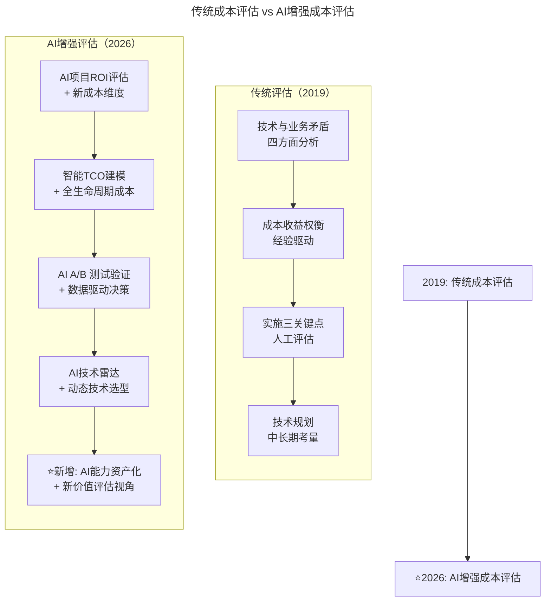
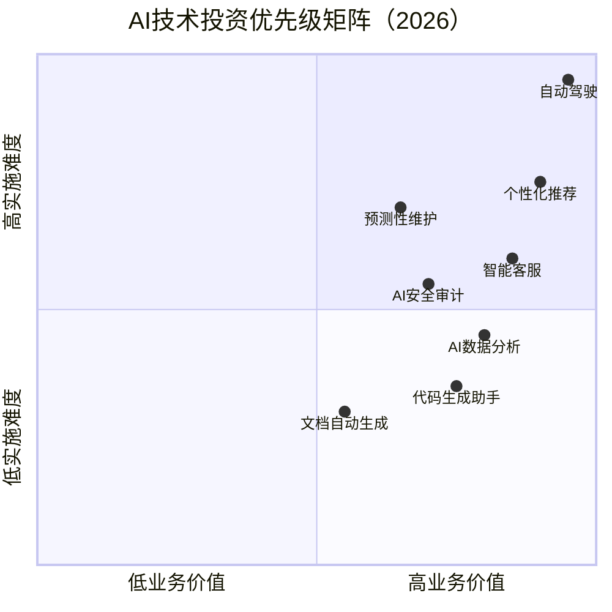
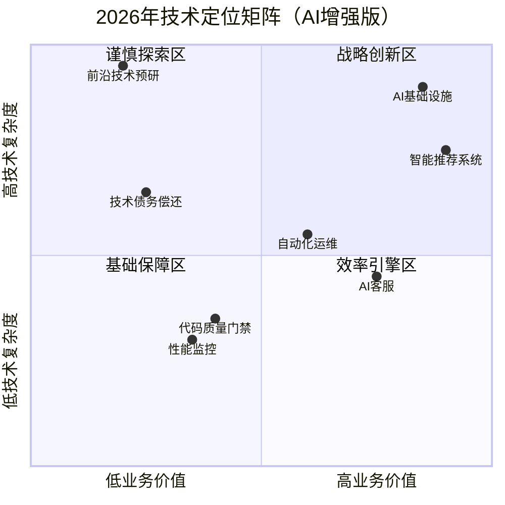

# 第118讲 | 吴铭：成本评估是技术leader的关键素质

> **适用范围**：技术 Leader、CTO、研发经理，以及需要在技术投入与业务收益之间做成本评估与优先级决策的管理者。
>
> **更新摘要（v2 · 2026-08 更新）**：
> - 结构化升级为 6 节骨架（导言 / 核心方法论 / 关键流程 / 工具与实战 / 常见误区 / 进阶延展）
> - 保留原文"技术与业务四大矛盾""成本评估案例""旧系统改造与新技术引入"等完整内容
> - 整合 2026 年 AI 时代升级注解，为所有 Mermaid 图补充 `title` frontmatter
> - 新增 AI 项目全生命周期成本结构、AI 旧系统改造决策树、AI 新技术引入十问与投资优先级矩阵

## 1. 导言

在互联网公司中，技术与业务的关系一直是焦点，我们对于技术与业务之间的矛盾也早已司空见惯，相信大家在工作中都看到过类似的场景：

业务问，"对手产品的某功能我们什么时候能上线？"

技术回答，"目前不行，这个版本我们需要做重构。"

业务问，"性能慢一点没关系，明天能不能发版？"

技术回答，"不行，我们要多花两三天时间将性能提高百分之百。"

业务抱怨，"我和别的公司谈妥了合作营销，技术却总是不给力。"

技术也抱怨道，"你们一个月提一百个需求，没几个有用的。"

诸如此类场景屡见不鲜，无论公司处在何种规模，只是争议的内容有所不同罢了。归根到底，业务体系与技术体系的矛盾主要集中在这四方面：

1.对于资源的抢占；
2.对于成本的评估；
3.对外部目标的差异；
4.内部目标设定的合理度；

### 2019 vs 2026 成本评估演进对比

| 维度 | 2019年成本评估 | ⭐2026年AI增强成本评估 |
|------|---------------|---------------------|
| **核心矛盾** | 技术vs业务的资源争夺 | **+ AI项目投资的ROI论证难题** |
| **成本类型** | 开发人力、服务器、第三方服务 | **+ AI推理成本、Token费用、模型训练** |
| **价值评估** | 基于经验的粗略估算 | **AI辅助的精细化TCO建模** |
| **决策难点** | "技术理想主义"vs业务优先级 | **+ AI能力建设的长期vs短期权衡** |
| **技术定位** | 救火/搬运/效率提升/创新突破 | **+ "AI基础设施"成为新定位选项** |

## 2. 核心方法论

### 协调技术与业务的矛盾

资源抢占是表象，也是其他方面问题的体现，技术leader最需要关注的是对成本的评估，也需要时刻对此保持清醒的头脑。因为技术人天生对技术有追求，我们很难要求每个一线的技术人员都去了解业务背景、业务收益等情况。同理，我们也很难要求产品、市场、运营等人员去考虑技术方面成本与收益。

因此，当公司达到一定规模后，一名优秀的技术leader就必须在技术与业务的平衡和成本评估等方面花费更多的心思。

我举两个例子，第一个例子是，曾经我们的技术人员提出一个需求，想用三天时间提升产品性能，使产品主页面的加载耗时缩减一半，同时机器成本也降低一半，这听起来确实不错。但同时，业务人员也提出了一个需求，想做一个为期两天的红包活动，以此吸引大批用户与流量。作为管理者，面对技术与业务同期而目标不同的需求，你将如何抉择，又如何做成本评估、价值评估呢？

第二个例子是，我们的技术团队想用机器学习算法重构产品中的酒店业务的排序模型，做到个性化推荐。模拟测试后，新模型的确要比原来的方式效果好一点。但业务团队不支持这个想法，在他们看来，酒店类业务并不是高频使用的场景，而且具有极强的地域性，之前的当地业务人员人工排序的方法效果不错，贸然改用技术排序，结果不一定好。事实也确实如此，当一些特殊情况发生时，比如节假日、公务员考试等，业务情况就会产生很大的波动，而新的算法模型在早期没办法准确地覆盖这些因素，反而对业务造成了非常不利的影响。

但我们不能以此判别技术团队的改进方案是错误的，只是一线技术人员无法全面考虑到市场中的所有情况，因此，最理想的办法就是技术团队提出产品改进方案后，与业务团队一起进行可执行度评估、价值评估与成本核算。

我想强调一点，作为技术leader，我们做决策时要多以成本与收益为考量点，而不仅是基于个人的技术理想主义。公司依赖业务运转，公司必然是以业务为最终驱动的。所以，我们一定要清楚在当前的阶段和业务场景下，公司对技术有何要求与期望，避免过度技术驱动。

### 技术leader协调技术与业务关系的四点

1.清晰服务于公司短期目标，明确技术定位，明确技术驱动与技术创新在当前阶段的价值。
2.合理调配技术资源分配，包括协调沟通与资源评估。
3.组织领导成本及收益评估，需要掌握业务知识与成本核算。
4.预留中长期目标规划空间，做好技术规划与技术储备。

### AI 时代成本评估的新内涵



AI 增强成本评估在传统四步之上新增"AI 能力资产化"维度，将 AI 投入视为团队能力资产而非纯成本，从经验驱动升级为数据驱动决策。

#### 2026年AI项目成本全景图

```
传统项目成本结构：
┌─────────────────────────────────────┐
│         项目总成本                   │
├──────────────┬──────────────────────┤
│  开发成本     │   运维成本            │
│  • 前端开发   │   • 服务器租赁        │
│  • 后端开发   │   • 数据库           │
│  • 测试       │   • CDN/带宽         │
│  • 项目管理   │   • 第三方API        │
└──────────────┴──────────────────────┘

⭐2026 AI项目成本结构：
┌─────────────────────────────────────────────────┐
│              AI项目全生命周期成本                  │
├──────────────────┬──────────────────────────────┤
│   一次性成本      │      持续性成本               │
├──────────────────┼──────────────────────────────┤
│ • 模型训练成本   │ • 推理成本（核心新增！）      │
│   - GPU算力      │   - API调用费（按Token计费）  │
│   - 数据标注     │   - 自部署GPU/TPU租用        │
│   - 超参搜索     │   - 边缘设备成本             │
│                  │                              │
│ • 集成开发成本   │ • 模型维护成本               │
│   - AI工程化     │   - 定期重训练（概念漂移）    │
│   - Prompt调试   │   - 模型版本管理             │
│   - 评测集构建   │   - 监控和告警系统           │
│                  │                              │
│ • 数据准备成本   │ • 人力运营成本               │
│   - 数据采集     │   - AI输出审核（人工复核）    │
│   - 清洗标注     │   - Prompt优化迭代           │
│   - 合规处理     │   - 异常处理                 │
│                  │                              │
│                  │ • 隐藏成本（容易被忽略！）     │
│                  │   - AI安全审计              │
│                  │   - 偏见检测和缓解           │
│                  │   - 合规认证                │
│                  │   - 供应商锁定风险           │
└──────────────────┴──────────────────────────────┘

⚠️ 关键洞察：
传统项目中，开发成本是一次性的，运维成本相对稳定。
AI项目中，**推理成本是持续的且可能随使用量激增**，
模型维护成本也是长期的——这与传统软件模式完全不同。
```

## 3. 关键流程

### 技术实施

回到技术上，技术的实施与规划是技术leader工作的核心。先来看技术实施，技术实施的过程有三个关键点，即资源配比、技术选型和业务分析，更有两个绕不开的话题，即旧系统改造与新技术引入。

#### 1.旧系统改造

每个公司基本上都会遇到旧系统改造问题，包括何时改造、重构还是改进、投入多长时间、投入多少资源以及价值评估等方方面面的问题。我用一句话总结这些问题：非必要的重构是没有业务价值的。

举个例子，我们之前有个由多个运营人员组成的离线分析团队，他们每天下午5点会看离线分析报表。由于这个报表需要几个小时才能生成，技术人员就投入两天时间去做改进，将几小时改进为耗时几分钟。从技术层面讲，这件事非常值得鼓励与赞赏，但对于业务方面没有任何影响，运营人员仍然在每天下午5点看报表。如果当时技术团队没有其他高优先级的事情，那么做这件事是很有意义的，但假设当时同时还有个市场活动要做推广，那么技术资源就不该倾斜到这件事情上。

#### 2.新技术引入

技术人员总有创新冲动，看到新的热点技术就想着能不能引进。对于新技术引入，我总结出以下5个思考点：一，引入的技术是否成熟；二，是否已做好相应储备；三，是否能承担相应人员培养成本；四，能够承担多大的风险；五，是否已经做好引入后的价值评估。

总而言之，对于新技术的引入，即使能够将性能提升一千倍，但这种性能提升对业务没有太大帮助，也就没有必要引进了。

### AI 旧系统改造的决策树

**原文核心观点**："非必要的重构是没有业务价值的"

**2026年升级**：这个原则在AI时代更加重要——因为AI改造旧系统的诱惑更大，但陷阱也更多

```
面对一个旧系统，是否要用AI改造？

Step 1: 业务价值评估
├── 这个系统当前的业务影响大吗？
│   ├── 高（核心业务）→ 进入Step 2
│   └── 低（边缘系统）→ 可能不值得投入AI

Step 2: 问题诊断
├── 当前的主要痛点是什么？
│   ├── 效率低 → AI自动化可能有价值
│   ├── 准确性差 → AI辅助决策可能有价值
│   ├── 用户体验差 → AI个性化可能有价值
│   └── 成本高 → AI优化可能有价值

Step 3: AI可行性评估
├── 有足够的高质量数据吗？（GIGO定律）
│   ├── 有 → 继续评估
│   └── 没有 → 先解决数据问题，再谈AI

├── 问题是否适合AI解决？
│   ├── 是（模式识别/预测/生成类问题）→ 继续
│   └── 否（确定性的规则逻辑）→ 传统方案更优

└── AI方案的成熟度如何？
    ├── 成熟（有成功案例）→ 可以尝试
    └── 前沿（POC阶段）→ 风险较高，需谨慎

Step 4: 成本效益分析（吴铭方法）
├── 计算完整TCO（含AI特有成本）
├── 量化预期收益（最好有基线数据）
├── 评估风险和不确定性
└── 与替代方案对比（不做/小改/大改/AI改）

Step 5: 决策
├── ROI > 阈值 且 风险可控 → 批准推进
├── ROI 不明朗 → 先做MVP/POC验证
└── ROI < 0 或 风险过高 → 暂缓或放弃

⭐ 吴铭原则的AI版：
"非必要的AI重构不仅是没有业务价值的，
而且可能是**有害的**——因为它消耗稀缺的AI人才资源，
产生额外的运维复杂度，并可能引入新的风险。"
```

### AI 新技术引入评估十问

原文五问（通用技术）：
1. 引入的技术是否成熟？
2. 是否已做好相应储备？
3. 是否能承担相应人员培养成本？
4. 能够承担多大的风险？
5. 是否已经做好引入后的价值评估？

**⭐2026 AI技术增强十问**：

📋 技术层面（6问）：
1. 该AI技术的成熟度处于哪个阶段？（探索期/实验期/成熟期/过气期）
2. 我们的数据能支撑这个AI技术吗？（数据量/质量/隐私/标注成本）
3. AI模型的"黑盒"程度我们能接受吗？（可解释性需求）
4. 推理成本可持续吗？（单次成本/调用量/增长曲线/优化空间）
5. AI供应商的锁定风险多大？（单一依赖/迁移成本/稳定性/数据主权）
6. 与现有技术栈的兼容性？（集成难度/学习曲线/运维复杂度）

💰 商业层面（4问）：
7. 这个AI技术的预期ROI是什么？（直接/间接/战略收益/回报周期）
8. 失败的风险和代价有多大？（技术/业务连续性/声誉/回滚方案）
9. 组织准备好接纳这个AI技术了吗？（管理层支持/用户接受/流程调整）
10. 如果不做会怎样？（机会成本/竞争差距/用户期望/时间窗口）

⭐ 决策矩阵：得分 ≥ 8/10 全力推进；6-7/10 试点验证；< 6/10 暂缓或放弃。

### 技术规划

再来看技术规划，对技术leader来讲，技术规划时主要有三个思考点，即技术路线规划、技术栈储备与风险评估。

首先，我们一定要多去关注中长期的技术发展与趋势，但也不要太过超前。除了对那些技术依赖性强的公司，技术有引领、指导作用外，对于大部分的中型、中小型，或初创公司来讲，太超前的规划技术路线，做技术储备没有太大意义。

如今，新技术在很短的时间内就能被普及，我们所储备的新技术很有可能很快就会成为平民化、大众化的技术。另外，太超前的技术投入对成本也是一种消耗。

因此，技术储备的前提是对长期目标和长期收益的判断，只有当既定目标非常明确时，才好去做长期的技术储备，否则，就很有可能发现储备的技术对业务场景并没有太大的价值，变成一种资源的浪费。

## 4. 工具与实战

### AI 项目成本估算实际案例

**原文案例回顾**：技术团队想用3天时间提升产品性能 vs 业务部门想做2天的红包活动

**⭐2026年新案例**：技术团队想引入AI智能客服 vs 业务部门想做营销活动

```
方案A：AI智能客服系统
┌─────────────────────────────────────────────┐
│ 💰 一次性投入：                              │
│ • 模型微调（基于企业数据）：￥80,000          │
│ • 知识库构建和RAG搭建：￥50,000              │
│ • 系统集成开发：￥120,000                    │
│ • 初始Prompt工程和调优：￥30,000             │
│ 小计：￥280,000                             │
│                                             │
│ 📅 年度持续成本：                            │
│ • API调用费（预计日均5万次对话）：￥180,000/年 │
│ • 模型定期更新（每季度）：￥40,000/年        │
│ • 人工审核团队（2人）：￥240,000/年          │
│ • 服务器和运维：￥60,000/年                  │
│ 小计：￥520,000/年                          │
│                                             │
│ 📈 预期收益：                                │
│ • 客服人力节省（减少4人）：￥400,000/年       │
│ • 响应速度提升带来的转化率提高：+8% ≈ ￥320,000│
│ • 客户满意度提升（NPS +12点）：品牌价值       │
│                                             │
│ 🧮 ROI计算：                                │
│ 第一年：-280K + (-520K) + (400K+320K) = -80K │
│ 第二年起：-520K + 720K = +200K/年            │
│ 回本周期：约17个月                           │
│ 3年NPV（折现率10%）：￥198,000               │
└─────────────────────────────────────────────┘

方案B：红包营销活动
┌─────────────────────────────────────────────┐
│ 💰 一次性投入：                              │
│ • 红包预算：￥200,000                        │
│ • 活动开发和运营：￥30,000                   │
│ 小计：￥230,000                             │
│                                             │
│ 📈 预期收益：                                │
│ • 预计带来新用户：10,000人                   │
│ • 转化率15%，客单价￥100 = ￥150,000收入     │
│ • 老用户激活复购：￥80,000                   │
│ 总收益：￥230,000                           │
│                                             │
│ 🧮 ROI计算：                                │
│ 当期：-230K + 230K = 0 （基本持平）          │
│ 长期：用户留存带来的LTV增值（难以量化）       │
└─────────────────────────────────────────────┘

⭐ 技术Leader决策建议（吴铭方法论+AI版）：
1. 短期看：方案B（红包活动）见效快，适合Q4冲业绩
2. 长期看：方案A（AI客服）ROI更高，但需要耐心
3. 最优策略：两个都做，但分期——先做红包活动保业绩，
   同时启动AI客服项目（作为明年Q1的重点）
```

### AI 技术投资优先级矩阵



投资优先级矩阵以"业务价值"为横轴、"实施难度"为纵轴：代码生成助手与文档自动生成位于高价值低难度象限（优先做），自动驾驶位于高价值高难度象限（谨慎做）。

### 2026 年技术定位矩阵（AI增强版）



技术定位矩阵将技术投入分为四个象限：战略创新区（重仓投入 30-40%）、效率引擎区（全面 AI 化 25-30%）、基础保障区（维持现状 15-20%）、谨慎探索区（严格论证 10-15%）。

### 关键数据参考（2026）

| 指标 | 数据 | 来源 |
|------|------|------|
| 企业AI项目的平均ROI | **127%** (但方差极大) | McKinsey AI Survey 2026 |
| AI推理成本占IT预算比例 | **平均18%** (AI密集型企业达35%) | Gartner IT Spending Report |
| 因成本超支而暂停/取消的AI项目比例 | **34%** | IDC AI Governance Study |
| 有正式AI投资评估流程的企业比例 | **42%** | Deloitte State of AI Report |
| AI项目实际成本超出预算的平均幅度 | **47%** | PMI AI Project Benchmark |

## 5. 常见误区

### 误区一：非必要的重构没有业务价值（原文）

每个公司都会遇到旧系统改造问题。非必要的重构是没有业务价值的——如果技术改进对业务方面没有任何影响（如运营人员仍每天下午5点看报表），就不应倾斜技术资源。

### 误区二：过度技术驱动

作为技术leader，我们做决策时要多以成本与收益为考量点，而不仅是基于个人的技术理想主义。公司必然是以业务为最终驱动的，要清楚在当前阶段和业务场景下，公司对技术有何要求与期望。

### 误区三：AI API 费用黑洞

团队大量调用 GPT-5.5 API，月底账单惊人。对策：设置预算上限和告警、使用更便宜的模型处理简单任务、缓存常见查询结果、建立内部模型。

### 误区四：Prompt Engineering 隐性成本

看起来"只要写几行 prompt"，实际上调试+优化耗费大量时间。对策：将优秀 Prompt 沉淀为模板、建立 Prompt 版本管理、投资 Prompt 训练课程。

### 误区五：AI 生成的"伪优化"

AI 建议的重构看起来很美，但实际业务价值低。对策：坚持业务价值优先原则，每个优化必须回答"这能帮业务赚多少钱/省多少钱？"，用 A/B 测试验证。

### 误区六：忽视 AI 的安全成本

为了赶进度，将敏感数据传给公有云 AI 服务。对策：建立数据分级制度、机密数据用私有化部署或脱敏后处理、定期进行 AI 安全审计。

### 误区七：非必要的 AI 重构不仅无价值，而且有害

非必要的 AI 重构消耗稀缺的 AI 人才资源，产生额外的运维复杂度，并可能引入新的风险。每一个 AI 项目都应该回答："如果我们不做这个 AI，会有什么损失？"

## 6. 进阶延展

### ⭐ 给 2026 年技术领导者的行动建议

**立即开始（本周）**
1. ✅ **盘点当前所有AI相关支出**：API费用、GPU租赁、AI工具订阅、外部AI服务等
2. ✅ **建立一个AI项目评估模板**：包含上述"AI技术增强十问"
3. ✅ **做一次"AI债务"审计**：有多少AI项目是"started but never finished"？有多少AI模型已经"漂移"？

**短期推进（1-3个月）**
4. 📋 **建立AI成本的标准化追踪体系**：按项目/团队/模型分别统计，设置成本预警阈值
5. 📋 **培训团队的AI成本意识**：让工程师理解Token不是免费的，建立"成本节约奖励"
6. 📋 **制定AI投资的分级审批机制**：< ￥50K Team Lead审批；￥50K-200K 部门总监审批；> ￥200K CTO/CIO审批；> ￥1M 需CEO+董事会审批

**中期深化（3-6个月）**
7. 🎯 **建立AI资产的"折旧"和"退役"机制**
8. 🎯 **构建AI投资的组合管理视角**：平衡"防御型AI"和"进攻型AI"
9. 🎯 **与CFO合作建立AI财务模型**

**长期愿景（6-12个月）**
10. 🚀 **实现"AI成本透明化"**：AI不再是"黑箱支出"，而是清晰的投资决策

### 📈 2026年技术Leader的新KPI建议

| 新KPI | 定义 | 目标值 | 测量方式 |
|-------|------|--------|---------|
| **AI ROI** | AI投资带来的业务回报 | >5x | 财务数据 + 归因分析 |
| **Cost Accuracy** | 项目实际成本vs预估成本的偏差 | <±15% | 项目管理系统 |
| **Value Delivery Rate** | 团队产出的业务价值/总成本 | 逐季度增长 | 业务指标对接 |
| **Tech Debt Ratio** | 技术债占代码库比例 | <20%或逐季下降 | 静态分析工具 |
| **AI Adoption Depth** | AI工具使用的深度（非仅试用） | >70%功能利用率 | 工具使用日志 |

### 总结

原文的核心观点——**"技术leader必须以成本与收益为考量点，避免过度技术驱动"**——在2026年**不仅没有过时，反而更加重要**。

但"成本"和"收益"的定义发生了变化：
- **成本**：从单纯的人力时间，扩展到包含AI API费用、数据成本、隐性风险的全生命周期成本
- **收益**：从难以量化，变成可以用AI预测、用A/B测试验证的可衡量指标
- **决策依据**：从经验驱动，变成**数据驱动 + AI辅助 + 业务对齐**

> 2026年的技术leader，你的核心竞争力不是写出最优算法的能力，而是**在AI提供的无数可能性中，做出最符合业务当前阶段的成本-收益最优解的能力**。AI给了你超级武器，但**扣动扳机的必须是你清醒的商业头脑**。

> **最后提醒**：成本评估不是为了"砍项目"，而是为了**让好项目获得应有的资源**。当你能清晰地证明某个AI项目的ROI时，你反而更容易获得支持和预算。**做一个"能用数字讲故事"的技术Leader。**

---

*本注解基于2026年6月的最新技术动态生成，包括GPT-5.5、DeepSeek V4的普及，以及84%开发者使用AI编程的行业现状。成本评估是技术管理的永恒主题，只是工具在进化，本质未变。*
