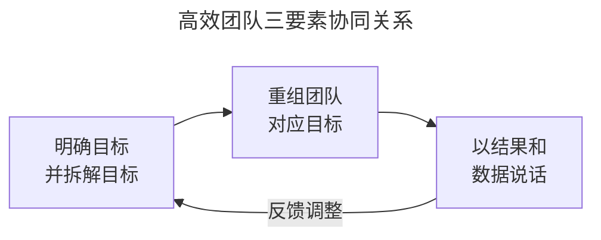
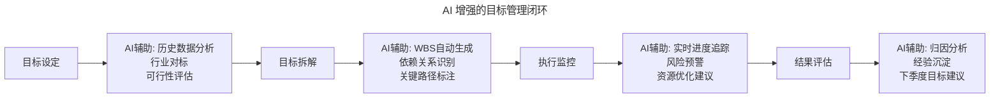

# 大咖对话 | 万玉权：高效团队的关键，以目标为导向，用数据来说话

> **适用范围**：技术管理者、CTO/CEO、事业群负责人、团队 Lead
>
> **更新摘要（v2 · 2026-08 更新）**：
> - 结构化升级为 6 节骨架（导言 / 核心方法论 / 关键流程 / 工具与实战 / 常见误区 / 进阶延展）
> - 保留原文 CTO→CEO 转变心得与高效团队三要素（目标拆解 / 团队重组 / 数据说话）
> - 整合 AI 时代升级注解，新增 2026 高效团队公式、蜂群式组织模式与数据四层演进模型
> - 补充 Mermaid 图表并配以文字解读

## 1. 导言

本周作客"大咖对话"的嘉宾是连尚网络副总裁、WiFi 万能钥匙事业群 CEO万玉权，拥有10多年互联网研发和管理经验，目前负责 WiFi 万能钥匙核心产品和技术研发管理及热点画像业务。在连尚网络期间，完成了核心系统架构从1.0到2.0的改进，以及推送系统、数据采集、账户系统以及分布式搜索、分布式存储、分布式缓存等系统的设计和研发。

万玉权从程序员到技术经理、事业群 CTO，再到事业群 CEO，对角色转变、团队管理、目标拆解与数据驱动有完整的一线实战经验。本文围绕"如何打造高效团队"展开，核心主张是：**以目标为导向，用数据来说话**。

## 2. 核心方法论

### 2.1 CTO 与 CEO 的角色差异

CTO与CEO的区别，有一句很通俗的话，即"CEO吹过的牛，CTO要将它实现"。另外，CTO以技术为主导，他的责任比较明确，主要是通过技术实现各种需求，关注技术趋势，平台战略实施和技术团队的培养等，其他的事情都有CEO在前面帮你担着。

而CEO负责的范围会更广，除了公司的日常管理之外，还需要负责技术、产品、商务、运营、数据等诸多方面。更重要的是需要清楚公司的战略方向，所以，对CEO综合能力的要求会非常高。

CEO的视角要更宏观一些、看得更远一些，要多去思考公司战略与整个行业的变化情况。至于一些具体的执行问题，则可以丢给下面的团队去做，这样，我可以从具体的事务细节中抽身出来，他们也能得到更多的锻炼机会和成长空间。

很多管理人员会进入一个误区，他会去享受权力带来的快感，却不知道怎么培养团队成员。一名合格的领导者，不在于自己的能力有多大，而在于能够培养出多少更优秀的人才；也不在于自己能够做多少事，而在于能带领团队做多少事。一个人一天不眠不休也只能工作24小时，但如果能将方法传承给团队，培养出10个和你一样优秀的人，那工作效率就能够翻10倍。

### 2.2 向上沟通的方法

一个很真实的体会是，要跟老板多汇报，多总结、多思考，再跟团队多交流。

从一个角色转化到另一个角色，更多的是熟悉的过程。以商务为例，之前，程序员出身的我跟商务之间的关系是"八竿子也打不到一起"。但万变不离其宗，关键是抓住其本质，即目标。商务团队必然是有明确目标的，而有了明确的目标后，事情就好做了。毕竟我作为CEO，并不需要深入到具体的执行层级，而是要站在一定的高度，把目标拆解清楚，然后跟商务团队确定要在什么阶段实现什么目标，有哪些资源可以使用。至于具体怎么落实，怎么达成目标，就可以放权给商务团队的负责人，让他放手去做。

另外，向上沟通时，客观、真实地反映现状非常重要。因为工作不是一锤子买卖，需要你踏踏实实的做业务，无论业绩是好是坏，你都要如实反映你的情况。同时，一定要思考清楚业绩差的原因，总结经验教训，并提出下一步的解决方案。你把症状和解决方案都说清楚，老板才能认可你的提议。

在实际中，不能只汇报增长，不汇报下降，也不可以将功绩放大，把问题缩小，这些都是不可取的行为，非常不利于公司经营。因为，数据偏差容易导致老板误判业务的实际情况，最终影响他对业务的决策，更严重的可能会影响到公司整体的战略。

### 2.3 高效团队三要素

万玉权认为，打造高效团队可以从三个方向出发：

1. **明确目标，并拆解目标**
2. **重组团队**
3. **以结果和数据说话**

下图为三要素的协同关系，说明目标拆解驱动团队重组，团队重组保障数据说话的落地。



三要素形成闭环：目标拆解为团队重组提供依据，团队重组使每个小团队对明确 KPI 负责，数据说话则反过来校验目标与组织的合理性，驱动持续调整。

## 3. 关键流程

### 3.1 明确目标并拆解目标

作为领导者，一定要结合公司战略，明确当前阶段的目标，这是根本。团队目标都是根据企业战略而来的，在企业的整体战略中，各个团队需要发挥哪些作用，为企业创造哪些价值，会被考核哪些成果……所有这些形成了团队目标。

以WiFi万能钥匙为例，今年我们事业群就一个核心的业务指标，而这个指标从集团下到我这里后，我就需要对这个目标进行拆解。

目标必然会导向某个结果，而达成结果的过程必然可以被拆解成不同的步骤。拆解目标的过程，关键是要结合产品或业务，以WiFi万能钥匙为例，我们要经过新增、活跃、留存等五个步骤才能得到预期的结果。因此，我们就可以把目标拆解成这五个步骤，并确定每一个步骤需要负责的工作，以及工作的产出，例如每一个步骤完成后的转化率。

### 3.2 重组团队

目标拆解完之后，就要调整组织架构，重组团队去对应相应的目标。

现在互联网公司比较流行两种组织结构，一种是按照职能划分，一种是按照垂直的业务划分。之前提到，我把目标拆解成了5个步骤，我就把这5个步骤划分给5个不同的团队去做。这样做的好处是，每个团队的目标非常明确，考核的KPI也非常明确。团队成员也会比较清晰和聚焦，能够劲往一处使，只要想着把事情做好就好。

在重组之前，我们团队是典型的按照职能划分，因此，一个团队可能会面对各方的多个需求，比如技术团队，就会有不同产品的不同需求汇聚过来，而技术团队也只是被动的接受这些需求，想的也只是按照要求及时交付。

而重组之后，从产品经理到研发负责人，到下面的研发团队、测试团队等，整条线上的不同功能的员工是一个小团队。而这个团队就背起属于他们的业务指标，对一个非常明确的KPI负责，也不会被各种各样的需求给扰乱到，每天耽误在各种沟通、扯皮中。

这样做的好处是，首先，技术团队有动力去深度钻研，打个比方，除了产品，研发在设计技术架构的时候，也会去思考，这个功能加进去，能不能对团队的核心指标有帮助。大家的方向一致，做某一个功能点，他的第一反应是，这能不能促进我的业务目标，即转化率的提升，能的话就继续做；不能的话就需要再仔细衡量。以往，这可能仅仅是产品需要去思考的东西。

作为领导者，我非常清晰的感觉到，团队从之前只是为了完成任务的做事方式，到现在变成了有明确目标的，自驱动的做事。大家都会自下而上的主动去想这件事情到底要怎么做才能做好，团队整体效率得到了非常大的提高。

同时，好多可做可不做的功能就会在这个环节中被过滤掉，最后的效果是，团队做事情会比原来更有深度。

我们是在今年第二季度实行了这样的团队重组，也见证了这种模式的好处，在如今WiFi万能钥匙这么大量级的基础上，我们在第二季度又实现了10%的增长，这是一个了不起的成绩。

### 3.3 以结果和数据说话

值得注意的是，每个步骤所需的团队规模不一样，可能第二个步骤只需要三四个人，一个产品带三个研发就能搞定，但你必须给他确定明确的职责，定下明确的KPI，让他去做这个事。

在拆分完的步骤中，可能最前面做增长的团队，跟后面做活跃的团队、做留存的团队没有什么关联，但他们都在一条线上，从最后的考核结果来看，我能够考核每一步的转化率是多少，然后根据这个考核结果来分配每个团队奖金的权重。

因此，在实际执行中，如果发现某一步的转化率特别低，负责人就要及时同步数据，一个一个环节去突破，最终找出问题的根结所在，然后不断调整策略，去提高该步骤的转化率，达成最终的目标。

有了数据之后一切就非常清楚，不管你过程中做了什么，我们就拿数据、拿结果来说话。这也符合我们价值观的数据至上这一点。总的来说，以目标为导向，用结果来说话。所有任务都要确定目标，都要做到有数据来量化，不管是哪个岗位。

当然，在这个过程中，还需要注意防止唯KPI论的出现，防止团队为了实现业务指标而为所欲为。这就需要更好的践行公司的价值观，剔除不符合价值观的行为，同时，我作为领导者也要做好把关工作。

实行团队重组后，我能明显感觉到团队成员的自驱动性明显增强，团队效率也显著提高，我也要比去年轻松很多，能抽出更多时间来思考更多战略、行业相关的问题。最终，我们要达成的目标是，变管理为服务，变管控为赋能，将想象力与创造力归还给员工，使员工发挥自驱能力去完成目标。

## 4. 工具与实战

### 4.1 目标拆解五步法（WiFi 万能钥匙实例）

| 步骤 | 团队职责 | 关键 KPI |
|------|---------|---------|
| 新增 | 获取新用户 | 新增用户数、获客成本 |
| 活跃 | 提升日活/月活 | DAU、MAU、活跃率 |
| 留存 | 降低流失 | 次日/7日/30日留存率 |
| 转化 | 提升核心行为 | 关键转化率 |
| 变现 | 商业化 | ARPU、收入 |

### 4.2 团队重组前后对比

| 维度 | 重组前（职能制） | 重组后（业务线制） |
|------|---------------|-----------------|
| 需求来源 | 多产品多需求汇聚 | 单一业务线明确目标 |
| 团队构成 | 按职能（产品/研发/测试分离） | 全功能小团队（产品+研发+测试） |
| KPI | 交付及时率 | 业务指标转化率 |
| 协作方式 | 被动接需求 | 自驱动思考业务价值 |
| 效果 | 沟通扯皮多 | 第二季度增长 10% |

### 4.3 AI 时代的目标管理增强

下图展示 AI 如何在目标设定、拆解、执行监控、结果评估四个阶段增强管理者。



图中每个阶段都引入了 AI 辅助能力：设定阶段做可行性评估，拆解阶段自动生成 WBS，执行阶段实时预警，评估阶段做归因分析，形成完整的目标管理闭环。

**具体工具示例**：
- **目标设定阶段**：AI 分析历史数据，建议合理的增长目标区间（而非拍脑袋）
- **目标拆解阶段**：AI 自动生成 Work Breakdown Structure，识别任务依赖
- **执行阶段**：AI Agent 每日生成进度简报，标记延期风险项
- **复盘阶段**：AI 归因分析，提取成功/失败模式

## 5. 常见误区

### 5.1 误区一：享受权力快感，不培养团队

很多管理人员会进入享受权力快感的误区，却不知道怎么培养团队成员。合格的领导者不在于自己能力有多大，而在于能培养出多少更优秀的人才。

### 5.2 误区二：只汇报增长，不汇报下降

不能只汇报增长不汇报下降，也不可将功绩放大把问题缩小。数据偏差容易导致老板误判业务实际情况，最终影响决策甚至公司整体战略。

### 5.3 误区三：唯 KPI 论

需要防止团队为了实现业务指标而为所欲为。要践行公司价值观，剔除不符合价值观的行为，领导者做好把关工作。

### 5.4 误区四（AI 时代新增）：忽视人机协同的产出度量

2026 年，当 AI 能完成 80% 的编码工作时，仅衡量"功能交付数"已不足以反映真实产出。需引入"人机协作效率比""AI 工具使用率"等新指标，避免团队为追求传统 KPI 而忽视 AI 协作能力的建设。

## 6. 进阶延展

### 6.1 2026 高效团队公式

```
传统公式：高效团队 = 目标清晰 + 组织合理 + 数据驱动 + 自驱文化

2026公式：高效团队 = (目标清晰 × AI辅助拆解) + (敏捷组织 × Agent增强) + (数据智能 × 预测分析) + (自驱文化 × 人机协同)
```

### 6.2 蜂群式组织：业务线制的 AI 时代演进

万玉权提到的"按业务线分团队"在 2026 年演变为"蜂群模式"：

| 维度 | 传统业务线制 | 2026 蜂群模式 |
|-----|------------|-------------|
| 团队规模 | 10-50 人 | 3-8 人核心 + N 个 AI Agent |
| 协作方式 | 固定汇报线 | 动态组建，项目制 |
| 角色分工 | 产品/研发/测试明确分离 | 角色融合：产品工程师、AI-Augmented Tester |
| 绩效考核 | 团队 KPI | 人机协同产出 + 个人 AI 协作能力 |
| 决策机制 | 层层审批 | AI 辅助决策 + 人类终审 |

### 6.3 "以数据说话"的四层演进

| 数据类型 | 2019 年 | 2026 年 |
|---------|-------|-------|
| 描述性数据 | 上周 DAU 是多少？ | 已自动化，AI Dashboard 实时展示 |
| 诊断性数据 | DAU 为什么下降？ | AI 自动归因（渠道/产品/竞品/季节） |
| 预测性数据 | 下周 DAU 会是多少？ | AI 预测模型（准确率 85%+） |
| 指导性数据 | 该怎么做？ | AI 推荐 Action Items + 预期效果模拟 |

### 6.4 2026 行动清单

**对于 CEO/业务负责人**：
- [ ] 引入 AI OKR 工具（如 Goals by AI、BetterWorks AI 版），让目标管理智能化
- [ ] 试点"蜂群小组"：选择 1 个创新项目，组建 3 人核心 + AI Agent 的实验团队
- [ ] 重新定义"产出"指标：从"功能交付数"转向"用户价值创造量"（含 AI 贡献部分）

**对于技术管理者**：
- [ ] 建立 AI Data Culture：不仅是收集数据，更要培养团队的数据解读和质疑能力
- [ ] 设计 Human-Agent 协作协议：明确哪些决策由 AI 建议、哪些必须人类拍板
- [ ] 创建"AI 效率仪表盘"：追踪 AI 工具使用率、人效提升率、AI 错误拦截率

**对于团队成员**：
- [ ] 学会向 AI 提问：掌握 Prompt 技巧，让 AI 成为你的 24 小时分析师
- [ ] 保持数据敏感度：即使 AI 给出结论，也要追问"数据来源是什么？样本量够吗？"
- [ ] 主动分享 AI 使用心得：团队内部建立 AI Best Practices 知识库

### 6.5 核心金句（2026 版）

> "2026 年的高效团队不是'人人都是 CEO'，而是'人人都会用 AI Agent 当助手'。"

> "数据说话的时代没有结束，只是说话的人从'分析师'变成了'AI + 有判断力的人类'。"

> "最好的管理者不是自己最强，而是能让团队 + AI 变得最强。"
