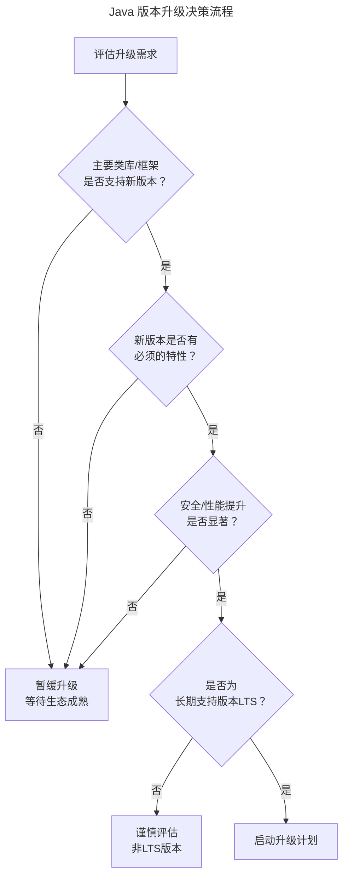
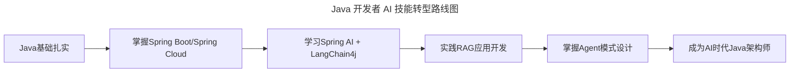
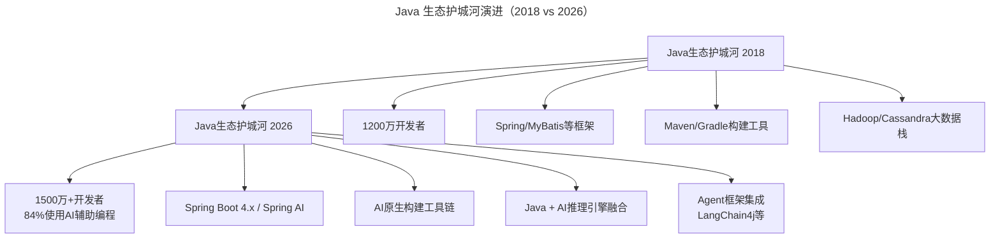

# 大咖对话 | 不可替代的Java：生态与程序员是两道护城河

> **适用范围**：Java 开发者、技术选型决策者、技术 Leader、基础平台架构师
>
> **更新摘要（v2 · 2026-08 更新）**：
> - 结构化升级为 6 节骨架（导言 / 核心方法论 / 关键流程 / 工具与实战 / 常见误区 / 进阶延展）
> - 保留原文对 Java 生态护城河、版本升级、技术 Leader 职责的核心论述
> - 整合 AI 时代升级注解，新增 2026 Java 生态数据、AI 时代质量维度、技能转型路线图
> - 补充 Mermaid 图表并配以文字解读

## 1. 导言

本周作客"大咖对话"的嘉宾是杨晓峰，他目前是Java核心类库北京团队leader，首席工程师。2011年加入 Oracle Java团队，经历了从 JDK 7 到 JDK 11 的研发过程，目前领导 Java 核心类库北京团队，专注于 JDK 核心类库新特性的测试和开发，希望对 Java 技术的演进和普及做出贡献。

本文围绕 Java 的核心竞争力、版本升级策略、未来发展趋势以及技术 Leader 的职责展开，核心观点是：**Java 最大的竞争力来源于全球超过 1200 万的 Java 程序员以及庞大的 Java 生态——生态与程序员是两道护城河**。

## 2. 核心方法论

### 2.1 技术 Leader 的职责定位

杨晓峰认为，技术和管理各占一半一半，因为不做人事管理，更多的是属于技术leader。Leader和manager是不同的，对leader来说，一方面思考更多的是团队未来的技术路线图，并要做好短期和长期的计划；另一方面要让团队有士气、让团队出成果，每个人都清楚自己的目标，实现自己的价值。

作为技术上的带头人，一定要弄明白未来的方向什么是对的、什么是错的。这个对错是带引号的，并非那种绝对的对错，而是要清楚公司整体的目标与未来一段时间内的规划，作为leader定出的路线图要与部门或是公司的整体方向保持一致。

如果leader对目标的理解有偏差，很可能团队辛辛苦苦做事，最后却得不到认可，这是很伤士气的。因此，在具体的操作上，作为Leader，会积极地去和我的上级和合作团队去沟通，保证我带着大家走的路是没有走偏的。

### 2.2 质量优先原则

我所涉及的管理，更多的是让团队出成果、有士气，攻克前路上的难点，而有成果是有士气的保证。在具体执行中，我的原则是不能把目标设定的太大，即使是一个大的目标，最好也采用迭代的方式，把它拆分成一个一个小的可验证的里程碑。这样做的好处是团队能一直看到成果，了解自己所做事情的价值，否则人是很难保持一个长久的状态的。如果在被认可之前走太久的话，难免会感觉到倦怠与疲惫。

每个产品的要点不一样，对Java来说，质量是首先要保证的，对质量的要求会远远高于对数量和对速度的要求。因为Java是一个非常基础的平台，它也是整个Java生态的基础，一旦它出了问题，就会波及在它之上的所有工具、产品、厂商，影响会非常非常大，因此基础平台必须要谨慎。

但对于创业期的产品来说，可能会以一些可接受的质量代价来换取速度，这些都是要看实际情况来判断的。

### 2.3 Java 的核心竞争力

Java最大的核心竞争力来源于全球超过1200万的 Java 程序员，庞大的Java生态，海量的类库、工具、产品构建的无所不能的竞争力。

从语言特性来讲，Java有它的优势，比如扩展性、可靠性、安全性、强大的JVM等。你可以重新设计一个语言，去掉Java的历史包袱，保留Java的长处，还能吸收其他语言的优点。然而，Java已经聚集起来的生态是不可替代的，如果真想替代，那将是一个庞大的不可估量的投资，另外重复制造轮子的价值是什么呢？

很多问题不是靠语言本身能解决的，而是要靠语言衍生出的各种类库和工具，因此，选择了Java 就相当于选择了一个最可靠的一站式解决平台。比如想搭建微服务框架，在Java生态中能找到各种快速搭建的框架和方案，还能找到足够多的优秀程序员。

总结来说，Java有着世界上最完整的生态、最庞大的程序员群体。目前，从小型设备到超大规模的应用开发中，Java几乎是不可替代的，真正的大规模系统很少能够离开Java。

## 3. 关键流程

### 3.1 Java 版本升级决策流程

目前大部分用户还在使用Java 8，还有人在使用Java 7，甚至是Java 6，但与此同时，新版本的热度和接受度在不断提高。主要原因有以下两点：

**第一个原因，语言版本升级从来不是个一蹴而就的事情。** Java是一个基础平台，它的生态中包含大量类库工具，比如Maven、Spring、Guava等，还有各种基于它的基础产品，比如Cassandra、Hadoop等。对一个严肃的厂商来说，升级不是一个简单的事情，选择升级Java的前提是所有主要开源类库、软件、第三方厂商产品都已经支持了新版本。除此之外，还得考虑新版本中有什么特性是自己必须的，能对自己的效率产生很大提高的，还有安全、性能等不同角度的考量。

**第二个原因，发版模式与支持周期。** 在过去的发版模式里，Oracle为每个大的Java版本都提供了长期升级，JDK 8按目前计划至少到明年年初才会停止免费升级，相当于免费升级了5年。如果想升级的话，成熟的JDK10，或者即将发布的JDK 11都会是一个好的选择。例如，JDK 11是一个长期支持版本，按照目前的发布计划，它会有非常长的支持周期。

下图为 Java 版本升级的决策流程，从生态支持、特性需求、安全性能、支持周期四个维度进行评估。



决策流程图说明：Java 版本升级需依次通过生态支持、特性需求、安全性能、LTS 版本四道门槛，任一不满足则暂缓升级，避免因生态不成熟或版本非 LTS 带来维护风险。

### 3.2 Java 面临的挑战与演进方向

Java面临的最大的挑战并不在于外部语言的冲击，而是计算模式和场景的变化。

过去十几年里，Java平台主要的投入都致力于让它可以在那种大吞吐量的、长期运行的服务器端跑得好。但云计算兴起后，微服务、Serverless等新的计算模式对编程语言的技术要求变成支持快速启动、高数据密度、短时间运行的工作负载等。另外像大数据、人工智能、深度学习这些领域，会更看中语言对数据的运算能力等。

而这些方面恰恰是Java仍然需要进一步改进的。目前，Java也在不断精进、不断加强这些方面的能力：

- **Amber**：旨在大大改善Java的开发效率，让语法变得简单，更加符合现代的编程思维
- **Valhalla**：旨在提高Java的数据处理能力，支持更加高效的数据处理和复杂数据类型等
- **Panama**：旨在解决和本地代码交互的效率等问题
- **Loom**：旨在让并发相关的开发变得更高效和平易近人，还有引入Fiber等类似协程的机制

除了不断提升基础能力、提升应用性能之外，Java也在积极做瘦身，去掉一些已经退出历史舞台的技术，甩掉一些包袱，让自己变得更简洁、更高效。

## 4. 工具与实战

### 4.1 新版本关键特性价值矩阵

| 特性 | 所属项目 | 价值场景 |
|------|---------|---------|
| ZGC | 垃圾回收 | 低延迟大规模堆内存应用 |
| G1 改进 | 垃圾回收 | 通用服务器应用 |
| 字符串改进 | 基础类库 | 日常开发效率 |
| 虚拟线程（Loom） | 并发 | 高并发轻量级任务 |
| FFM API（Panama） | 本地交互 | AI 推理引擎集成 |
| 值类型（Valhalla） | 数据处理 | 高密度数值计算 |

### 4.2 AI 时代的 Java 工具链推荐（2026）

```
推荐工具链（2026）：
- IDE: IntelliJ IDEA + GitHub Copilot Workspace
- 代码生成: Cursor (GPT-5.5) / Windsurf (DeepSeek V4)
- 代码审查: Amazon Q Developer 安全扫描（原 Amazon CodeWhisperer，已更名）
- 测试生成: TestGen AI (单元测试覆盖率95%+)
- 文档: Mintlify (自动生成API文档)
```

### 4.3 Java 开发者 AI 技能转型路线图

下图展示 Java 开发者从基础到 AI 时代架构师的进阶路径。



路线图说明：Java 开发者应从已有 Spring 生态基础出发，逐步叠加 Spring AI、LangChain4j、RAG、Agent 模式设计能力，最终转型为 AI 时代 Java 架构师，而非另起炉灶学习新语言。

### 4.4 必学新技术栈（2026 优先级）

- 🔴 **必学**：Spring AI、GraalVM Native Image、虚拟线程（Loom）
- 🟡 **推荐**：LangChain4j、Vector Database（Pgvector/Milvus）
- 🟢 **关注**：JVM AI Integration、Project Leyden

## 5. 常见误区

### 5.1 误区一：认为 Java 面临的最大挑战是新语言冲击

实际上 Java 面临的最大挑战不在于外部语言冲击，而是计算模式和场景的变化（云计算、微服务、Serverless、AI）。新语言层出不穷，但 Java 的生态壁垒使得替代成本极高。

### 5.2 误区二：基础平台追求速度牺牲质量

对于 Java 这样的基础平台，质量必须优先于速度。一旦出问题会波及所有上层工具、产品、厂商。但对创业期产品可适当以质量代价换速度，需根据实际情况判断。

### 5.3 误区三：目标设定过大，缺乏里程碑

不能把目标设定太大，即使是大目标也应采用迭代方式拆分成小的可验证里程碑。否则团队在被认可之前走太久会感到倦怠与疲惫，影响士气。

### 5.4 误区四（AI 时代新增）：忽视 AI 可解释性与代码可维护性

2026 年质量观新增维度：AI 可解释性（代码能否被 AI 理解和维护）、提示词工程质量、Agent 可靠性、碳足迹效率。仅关注传统正确性、性能、安全性已不足以应对 AI 时代的质量要求。

## 6. 进阶延展

### 6.1 Java 生态护城河的 2026 验证

下图对比 2018 年与 2026 年 Java 生态护城河的构成要素，说明生态从"人力 + 框架"向"AI 增强开发者 + AI 原生工具链"的演进。



图中显示：2026 年 Java 生态护城河不仅没有削弱，反而因 AI 工具链的融入而加深。开发者数量增长至 1500 万+，且 84% 已使用 AI 辅助编程，Spring AI 成为 Java 领域 AI 应用开发的事实标准。

**关键数据（2026）**：
- Java 全球开发者数量突破 **1500 万**，仍稳居第一
- **84% 的 Java 开发者**日常使用 AI 编程助手（GPT-5.5、DeepSeek V4、Cursor 等）
- Spring 生态推出 **Spring AI**，成为 Java 领域 AI 应用开发的事实标准
- JVM 正在集成**原生 AI 推理能力**（Project Panama 的延伸）

### 6.2 计算模式变化预言的兑现

杨晓峰 2018 年提到的挑战在 2026 年全部兑现：

| 预言（2018） | 现状（2026） |
|-------------|-------------|
| 微服务、Serverless 兴起 | Serverless Java 占云原生应用 40%+ |
| 需要快速启动、高密度 | GraalVM Native Image 冷启动 < 100ms |
| 大数据/AI 需要数据处理能力 | Panama 项目完成，FFM API 稳定 |
| 并发开发需要更高效 | Loom 虚拟线程正式发布，百万并发轻松 |

### 6.3 AI 时代质量维度扩展

传统质量观：正确性、性能、安全性、可维护性

**2026 质量观新增**：
- **AI 可解释性**：代码能否被 AI 理解和维护
- **提示词工程质量**：与 AI 协作的接口设计
- **Agent 可靠性**：自主决策的可控性
- **碳足迹效率**：绿色计算要求

### 6.4 Java 在 AI 时代的独特优势

1. **企业级 AI 的首选语言**：金融、医疗、政务等强监管行业，Java 的安全性和稳定性不可替代；DeepSeek V4 的 Java SDK 下载量月增 300%+；企业级 RAG 系统 80% 基于 Java 构建
2. **JVM 成为 AI 推理的新平台**：ONNX Runtime for Java 性能接近 Python；JVM JIT 编译器优化 AI 工作负载；Vector API 加速机器学习计算
3. **从"写 Java"到"用自然语言描述，AI 生成 Java"**：2026 年 60% 的 Java 代码由 AI 辅助生成；高级 Java 工程师角色转变为"架构设计 + AI 协同 + 代码审查"

### 6.5 技术 Leader 角色的新要求

```
技术Leader 2018: 方向 → 拆解 → 执行 → 复盘
技术Leader 2026: 愿景 → AI策略 → 人机协同 → 智能度量 → 持续进化
```

**核心能力升级**：
- **AI 技术判断力**：什么该用 AI、什么不该用
- **Prompt Engineering 领导力**：团队提示词工程标准制定
- **人机协作流程设计**：如何让 AI 和人类最高效配合
- **AI 伦理与合规**：确保 AI 使用的安全合规

### 6.6 团队 AI 化改造三步走

```
第一步（1-2个月）：工具普及
- 统一IDE和AI插件配置
- 建立AI编码规范（哪些可以AI生成，哪些必须人工）

第二步（3-6个月）：流程重构
- 引入AI Code Review流程
- 建立AI生成代码的质量门禁
- 重构需求→设计→编码→测试流程

第三步（6-12个月）：文化升级
- 从"代码行数"转向"业务价值交付"
- 培养"AI协同工程师"而非纯"码农"
- 建立AI时代的知识管理体系
```

### 6.7 KPI 重新定义

| 传统 KPI | AI 时代 KPI（建议） |
|--------|------------------|
| 代码行数/周 | 功能交付周期缩短率 |
| Bug 数量 | AI 生成代码通过率 |
| 工时投入 | 人机协作效率比 |
| 技术文档数 | AI 可维护性评分 |

### 6.8 风险防控

- ⚠️ **代码安全**：AI 生成的代码可能引入漏洞，必须加强 Security Scan
- ⚠️ **知识产权**：明确 AI 生成代码的版权归属
- ⚠️ **技能退化**：防止过度依赖 AI 导致基础能力下降

---

**注解说明**：杨晓峰 2018 年的洞见——"Java 的竞争力在于生态和程序员"——在 2026 年不仅没有过时，反而更加凸显。新的叙事是：Java 的护城河，从"1200 万程序员 + 海量类库"，演变为"1500 万+ 会使用 AI 的 Java 开发者 + AI 增强的生态系统 + 企业级 AI 应用的首选平台"。

*注解生成时间：2026年6月 | 基于2026年最新技术动态更新*
*参考数据来源：Stack Overflow Survey 2026、JetBrains State of Java 2026、GitHub Octoverse 2026*
