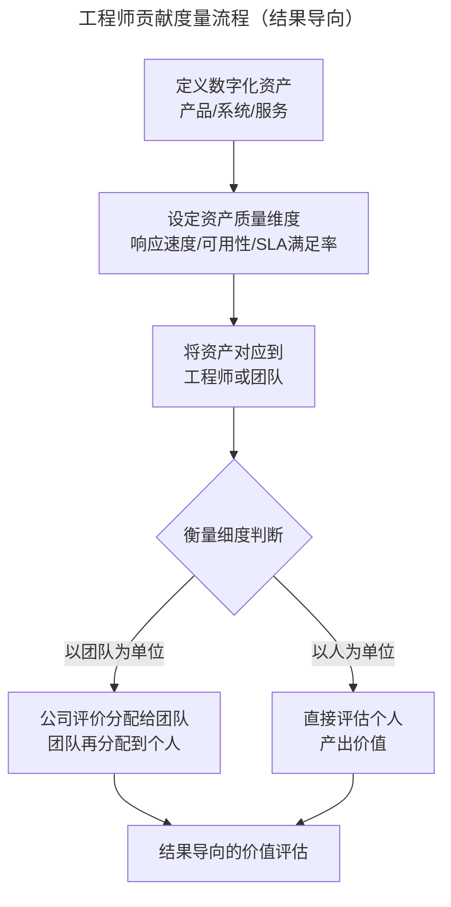
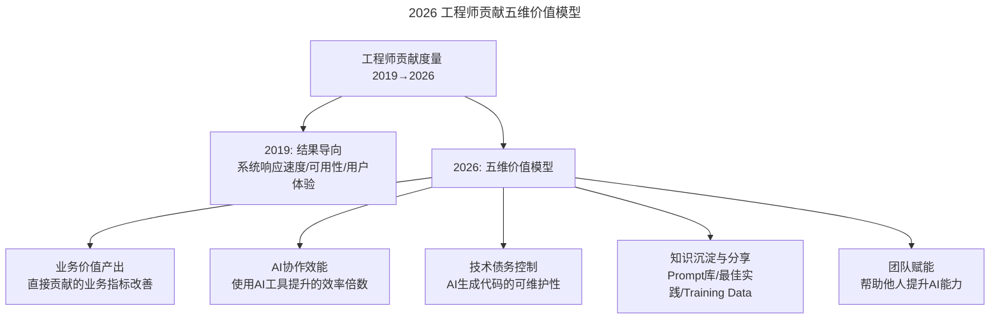
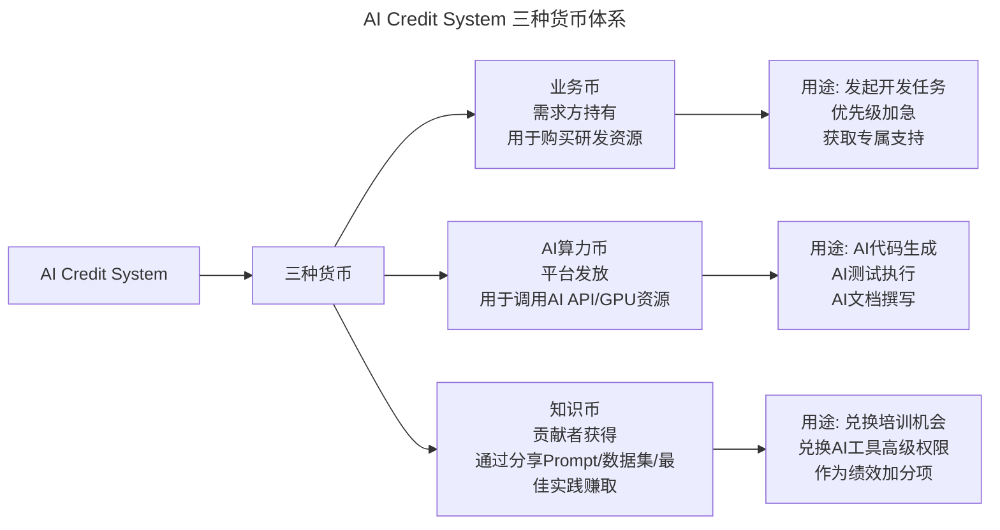

# 大咖对话 | 以产生价值判断工程师贡献——读者留言精选

> **适用范围**：技术管理者、HR/People Manager、技术 Leader、工程师
>
> **更新摘要（v2 · 2026-08 更新）**：
> - 结构化升级为 6 节骨架（导言 / 核心方法论 / 关键流程 / 工具与实战 / 常见误区 / 进阶延展）
> - 保留原文五位大咖对读者留言的回答（乔新亮、童剑、王晔倞、黄勇、栗浩洋）
> - 整合 AI 时代升级注解，新增 2026 工程师贡献五维模型、AI Detail Culture、AI Credit System
> - 补充 Mermaid 图表并配以文字解读

## 1. 导言

> [标签：技术领导力 / 工程师贡献 / 留言精选]
> [导读：本文汇总专栏"大咖对话"前 4 个月读者留言中具有代表性的问题，并邀请相应嘉宾回答。]

不知不觉，"技术领导力300讲"专栏已经更新了4个月，走过了三分之一的路程。在这四个月里，我们邀请到了近40位CTO、技术VP、有技术背景的CEO等技术领导者来分享他们的实践与经验，话题涉及技术领导者的核心能力、高效技术团队的打造、高效研发流程的建设、技术团队的考核与激励、技术团队文化的建设、空降管理者该如何平稳落地、技术领导者的产品思维等多个方向。

不少读者踊跃留言，分享了他们的观点，也留下了他们的疑问。本周的"大咖对话"环节就筛选出了往期留言中具有代表性的问题，并邀请了相应的大咖来回答。

本文涵盖六大议题：**工程师贡献度量、细节管理依赖度、员工淘汰机制、研发流程协作工具、OKR 制定与评估、CTO 进化能力**。

## 2. 核心方法论

### 2.1 以结果和价值衡量工程师贡献（乔新亮）

**苏宁易购IT总部执行副总裁乔新亮**：我们数据收集的维度分两个方向，第一个是数字化资产，第二个是工程师对数字化资产的贡献。

首先，数字化资产会包括产品、系统、服务等资产，以服务中的用户体验为例，它的数据化考量维度就是响应速度快不快、异常情况多不多、服务可用性高不高、响应时间的SLA满足率怎么样等。

其次，每一个数字化资产都会对应到某个工程师或工程师团队，他们会负责这个数字化资产的开发、测试、维护等，因此，衡量工程师的贡献度，是从结果出发的。读者提的问题可能更多的是站在开发者的角度，衡量他做了什么，而我们是从整体的、偏宏观一点的角度出发，不管他写了多少代码、解决多少问题，只看他最后产生了什么价值，比如他参与开发的系统响应速度控制在了多少以内等。

另外，我们的衡量细度也不是具体到人，而是看具体贡献情况，看是以小团队为单位还是以人为单位，如果是以团队为单位，那就是公司将评价数据分配给团队后，再由团队分配到个人，得根据具体的情况调整。

### 2.2 细节文化防止依赖（童剑）

**白山CTO童剑**：第一个问题，如何防止团队成员形成依赖，我们可以从以下几个方面出发：

1. 培养关注细节的文化;
2. 建立制度，使细节变成一种流程;
3. 多提出问题，让团队成员来思考解决办法，给他们空间让他们按自己方法去解决;
4. 启发式引导，不要一上来就告诉他问题和办法，而是要引导他们发现问题，启发出解决办法；
5. 管理者是逐步退出的。

第二个问题，如何避免形成基层员工的不创新、不思考，我们可以从以下几个方面出发：

1. 管理者并非越级介入，关注细节的文化形成后，团队中每个人都重视细节，高层与中层确认细节即可，不影响底层开发。
2. 管理者对细节的关注和参与，就像教练一样，是传授给员工更好的做事方法。
3. 管理者对细节的关注和参与，也是以身作则，给员工做出示范，既给员工压力，也让员工有榜样学习。
4. 对于基层员工，鼓励创新与思考，管理者对其开发细节的关注，是为了帮助基层员工更好的完成开发。
5. 基层员工更多是从开发的角度思考，而中层和高层的领导者需要从使用者的角度设计产品功能，领导者的参与过程中会给基层员工带来更多的视野，对基层员工本身也是一种提升与培养。
6. 文化是一种彼此交流的基础，我们有招聘的"洁癖"，大家有共同愿景，不会因为上层的过多介入而失去主观能动性，乔布斯说"A级人才的自尊心不需要呵护"，同样"对于A级人才也不必担心上层介入会对其产生负面影响"。

### 2.3 员工淘汰机制（王晔倞）

**好买财富平台架构部技术总监王晔倞**：在我的经验中，这种情况一般分为两种，"试用期"与"正式期"：

1. 试用期阶段，这时不需要客气，直接说明不合适的原因即可，也不需要任何赔偿。这种情况的发生很大程度上是由于公司和员工对岗位职责的界定不清晰而引发的。为了预防这种情况，如果试用期为6个月，可以采取2个月考核一次的方式，前2个月可以安排对方做一些验证其技能的工作，甚至可以设定一些无中生有的任务，后2个月可以安排对方做一些验证其价值观的工作，如项目经理等推动与沟通偏多的工作，最后留出1个月，如果对方不合适的话，留出让其重新找工作的时间，这样做基本可以达到好聚好散的目的。

2. 正式期阶段，这时有两种做法，硬开和不硬开。硬开的话，按照劳动法，肯定是按照N+1的方式来赔偿的，如果对方非常较真，一般情况下是无法拿出量化的具体依据来证明其表现不好的。不硬开的话，可以通过谈话、调岗等手段进行，至少让他觉得你们的企业还挺Nice的，不至于产生负面印象。

所以我觉得，关键在于试用期的把关，如果无法守住这一关，光想在正式期采取"有利于公司"的方式开除员工，既不合理，也不可取。

### 2.4 研发协作的虚拟货币机制（黄勇）

**黄勇**：特赞币只是一种工具，它用于解决研发和业务之间的高效协作问题，业务提需求需要"花币"，业务提反馈可以"赚币"，币的总数是恒定的（在一定条件下会考虑增发），币在业务与研发之间进行流通。

这样，业务提需求是一件需要付出成本的事情，确保所提的需求都是真正的痛点，同时，研发也能尽可能快地收集业务反馈，进一步验证产品的价值。对于优先级较高的需求，业务也可以花费更多的币在这项需求上，研发也会更加重视该需求。

### 2.5 OKR 的自下而上制定（黄勇）

我在"组织架构篇"中提到过"职能团队"，该团队主管的职责就是帮助队员制定合理的 OKR，目的就是帮助他们得到成长，只有队员成长了，主管才会成长。

另外，每个人将自己的 OKR 制定完毕后，需要在对应的职能团队中分享，其他队员或主管可提出一些要求，修正或丰富这份 OKR，可以将其看做是 OKR 评审，而这样的评审可以是正式会议，也可以随机探讨，可以一次也可以多次。

OKR 均由自己制定，并由职能团队评审，当大家觉得没问题了才算合理，其实这里包括两方面，一是个人的追求，二是团队对自己的期望。

### 2.6 CTO 的进化能力（栗浩洋）

**乂学教育创始人栗浩洋**：我说的进化能力，绝不仅仅只是学习能力。它其实更多的意味着一种自我摧毁和自我扭曲的能力，就好像老鹰要把自己身上的羽毛全部啄光一样；就好像一个打乒乓球的奥运冠军，要学打网球的时候，完全不能用自己过去的套路，不能用手腕，而要用整个腰身的力量一样。进化是要改变自己过去的思维习惯，完全变成另外一种物种。

这个时候其实会遇到很多不习惯、不舒适甚至是痛苦的地方，当然也能从中发掘很多有趣的地方。所以我觉得学位、证书的加持只是一小部分，并不是必须的，重要的是他是否真的学会了知识、开拓了思维。甚至可能他只是完全的自学，或者是跟身边的人去学习，也能够完成进化。关键是他自己了解了新的知识，在进化到新领域时转变了一些旧有的思维、行为习惯，以及能够驾驭新的环境。

## 3. 关键流程

### 3.1 工程师贡献度量流程

下图为乔新亮提出的"以结果和价值衡量工程师贡献"的度量流程，从数字化资产定义到团队/个人分配。



流程图说明：度量从"定义数字化资产"出发，设定质量维度后对应到责任人，再根据实际情况选择团队级或个人级衡量细度，最终回归"结果导向"的价值评估，而非代码量或 Bug 数。

### 3.2 试用期 6 个月评估流程

王晔倞提出的试用期分阶段评估方法：

| 阶段 | 时间 | 评估重点 | 方法 |
|------|------|---------|------|
| 技能验证 | 第 1-2 月 | 技术栈匹配、代码质量 | 安排验证技能的工作，可设无中生有的任务 |
| 价值观验证 | 第 3-4 月 | 团队协作、沟通能力 | 安排项目经理等推动与沟通偏多的工作 |
| 缓冲期 | 最后 1 个月 | 综合判断 | 留出让对方重新找工作的时间 |

### 3.3 OKR 制定与评审流程

```
个人制定 OKR → 在职能团队中分享 → 其他队员/主管提出修正建议
→ 评审（正式会议或随机探讨，可多次）→ 大家觉得没问题才算合理
→ 包含两方面：个人追求 + 团队期望
```

## 4. 工具与实战

### 4.1 数字化资产贡献度量维度

| 数字化资产类型 | 质量维度 | 对应工程师团队 |
|-------------|---------|-------------|
| 服务 | 响应速度、异常率、可用性、SLA 满足率 | 后端/运维团队 |
| 产品 | 用户体验、功能完整度 | 产品/前端团队 |
| 系统 | 稳定性、扩展性、安全性 | 架构/基础平台团队 |

### 4.2 特赞币流通机制

```
业务方 ──花币提需求──→ 研发方
业务方 ←─赚币提反馈── 研发方

规则：
- 币总数恒定（一定条件下可增发）
- 优先级高的需求可花更多币
- 确保所提需求都是真正的痛点
```

### 4.3 AI 时代的贡献度量工具（2026）

2026 年工程师贡献度量框架从"结果导向"升级为"五维价值模型"：



图中五维模型说明：2026 年的度量从单一"结果导向"扩展为业务价值、AI 协作效能、技术债务控制、知识沉淀、团队赋能五个维度，新增了 AI 协作效能和知识沉淀两个维度以反映 AI 时代的工作特征。

**关键变化**：
- 从"个人产出"到"个人 + AI 协同产出"
- 从"量化工作量"到"量化价值创造"
- 新增"AI 协作效能"作为独立评估维度

### 4.4 AI 时代特赞币 → AI Credit System



图中三种货币体系说明：2026 年的研发协作从"业务币"单一维度扩展为业务币、AI 算力币、知识币三轨制，分别调节需求优先级、AI 资源分配和知识贡献激励。

## 5. 常见误区

### 5.1 误区一：以代码量/Bug 数衡量工程师贡献

乔新亮明确指出，不应站在开发者角度衡量"做了什么"，而应从宏观角度衡量"产生了什么价值"。代码量、修复 Bug 数量只是过程指标，系统响应速度、可用性等结果指标才是贡献度的本质。

### 5.2 误区二：管理者越级介入导致基层不创新

童剑认为，关注细节的文化形成后，高层与中层确认细节即可，不影响底层开发。管理者对细节的关注像教练一样传授方法，给员工压力同时也让员工有榜样学习。A级人才的自尊心不需要呵护，也不必担心上层介入产生负面影响。

### 5.3 误区三：正式期才想着淘汰员工

王晔倞强调，关键在于试用期把关。如果无法守住这一关，光想在正式期采取"有利于公司"的方式开除员工，既不合理也不可取。正式期硬开需 N+1 赔偿且难以拿出量化依据，不硬开则只能谈话调岗。

### 5.4 误区四（AI 时代新增）：忽视 AI 协作能力的评估

2026 年试用期评估需新增 AI 工具使用熟练度、Prompt Writing 能力、AI 伦理意识、人机协作偏好等维度。

**新增红灯信号**：
- ❌ 完全拒绝使用 AI 工具（可能效率低下）
- ❌ 过度依赖 AI 缺乏独立思考（可能产出质量不稳定）
- ❌ 对 AI 输出不加审核直接采用（存在质量和安全风险）

## 6. 进阶延展

### 6.1 AI 时代六位大咖观点的验证

| 原始观点 | 2026 年验证 | 验证结果 |
|---------|-----------|---------|
| 以结果/价值衡量工程师贡献 | 更加重要但度量更复杂。当 AI 完成 80% 编码工作时，如何区分"AI 生成的代码"和"人类的判断与整合"？需要新的价值评估框架 | 需升级 |
| 细节文化防止依赖 | 需补充"AI Detail Culture"。不仅关注代码细节，还要关注 AI 输出质量审核、Prompt 准确性、AI 决策边界等新维度 | 扩展 |
| 试用期把关最重要 | 依然成立但评估标准变了。除了传统技能，还需评估 AI 协作能力、学习敏锐度、AI 伦理意识 | 新增维度 |
| 特赞币式协作工具 | 演变为"AI Credit System"。研发协作不仅是业务与研发的博弈，还加入了 AI Agent 的资源分配和信用体系 | 演进 |
| OKR 自下而上制定 | AI 辅助 OKR 更高效。AI 能基于历史数据、行业基准、团队能力生成 OKR 草案，人类负责调整和对齐 | 增强 |
| 进化能力 = 自我重塑 | 在 AI 时代更加关键。技术栈半衰期已缩短至 18-24 个月，不能自我进化的技术人将被快速淘汰 | 强化 |

### 6.2 AI Detail Culture 的新维度

2019 年关注的细节：代码规范、架构设计、边界条件  
2026 年新增的细节维度：

| 细节类型 | 具体内容 | 为什么重要 |
|---------|---------|-----------|
| Prompt 细节 | Prompt 的精确性、Few-shot 示例的质量 | 差之毫厘谬以千里，Prompt 质量决定 AI 输出质量 |
| AI Output Review | 检查 AI 生成内容的准确性、安全性、合规性 | AI 会产生幻觉，必须人工审核关键输出 |
| AI Decision Boundary | 明确哪些环节 AI 自主决策、哪些必须人工介入 | 避免 AI 越权导致严重后果 |
| Data Quality for AI | 训练数据/检索数据的准确性和时效性 | Garbage In, Garbage Out——AI 的质量取决于数据 |

### 6.3 栗浩洋"进化"路径的具体化（2026）

原观点：进化是自我摧毁和重塑  
2026 年具体化的进化路径：

| 进化阶段 | 时间周期 | 具体行动 |
|---------|---------|---------|
| **认知觉醒** | 1-2 个月 | 承认 AI 将改变你的工作方式，放下抵触情绪 |
| **技能解构** | 2-3 个月 | 识别哪些技能将被 AI 替代（记录型、重复型），哪些会增值（判断型、创意型） |
| **工具融合** | 3-6 个月 | 将 AI 工具深度融入日常工作流，形成新的"肌肉记忆" |
| **角色重塑** | 6-12 个月 | 从"执行者"转向"指挥者 + 审核者"，重新定义自己的不可替代性 |
| **生态构建** | 持续 | 建立个人 AI 知识库、Prompt Library、人机协作方法论 |

### 6.4 2026 行动清单

**对于想要更好度量团队的 Leader**：
- [ ] 设计"AI-Augmented Performance Scorecard"：包含业务价值、AI 协作效能、技术质量、知识贡献四个维度
- [ ] 建立 AI Output QA Checklist：明确哪些 AI 输出必须人工审核、审核的标准是什么
- [ ] 试点 AI Contribution Tracking 工具：自动追踪每位成员使用 AI 工具的情况和效果

**对于正在面试/被面试的技术人**：
- [ ] 准备 AI Collaboration Portfolio：整理你使用 AI 解决问题的具体案例
- [ ] 展示 Critical Thinking：在面试中主动讨论 AI 的局限性和你如何应对
- [ ] 询问团队的 AI 成熟度：了解目标团队的 AI 使用情况和文化

**对于想进化自我的技术人**：
- [ ] 完成一次"AI Skill Audit"：列出当前所有技能，标记哪些会被 AI 影响、哪些会增值
- [ ] 制定 90 天 AI 转型计划：第 1 个月学习基础工具，第 2 个月深入一个专业领域 AI 应用，第 3 个月形成自己的 AI 工作流
- [ ] 加入 AI 实践社区：参与开源 AI 项目、参加 AI Meetup、在社交媒体分享 AI 使用心得

**对于 HR / People Manager**：
- [ ] 更新 Job Description 模板：增加 AI 相关的能力要求和行为指标
- [ ] 设计"AI Onboarding Program"：新员工入职即接受 AI 工具培训和 AI Ethics 教育
- [ ] 建立 AI Anxiety Support Channel：为员工提供心理支持和职业转型咨询

### 6.5 核心金句（2026 版）

> "2026 年衡量工程师贡献的不是'写了多少代码'，而是'用 AI 创造了多少价值'以及'在 AI 搞不定时你能搞定多少'。"

> "细节控在 AI 时代不是过时了，而是更重要了——因为 AI 的细节（Prompt、数据、审核）决定了产出的质量上限。"

> "进化的本质没变——都是走出舒适区；只是 2026 年的舒适区比以往任何时候都消失得更快。"
