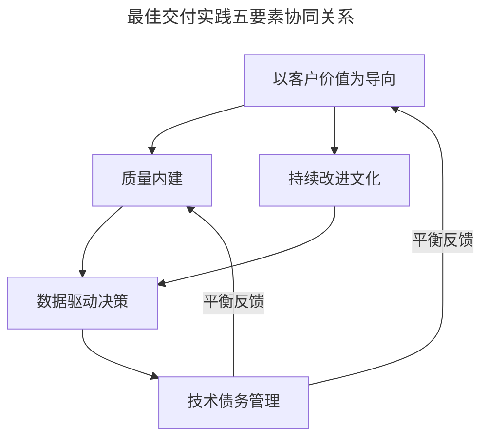
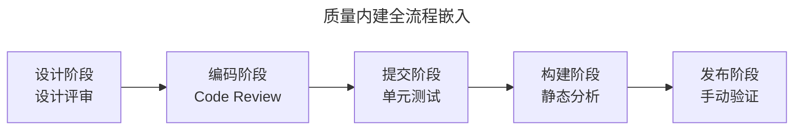
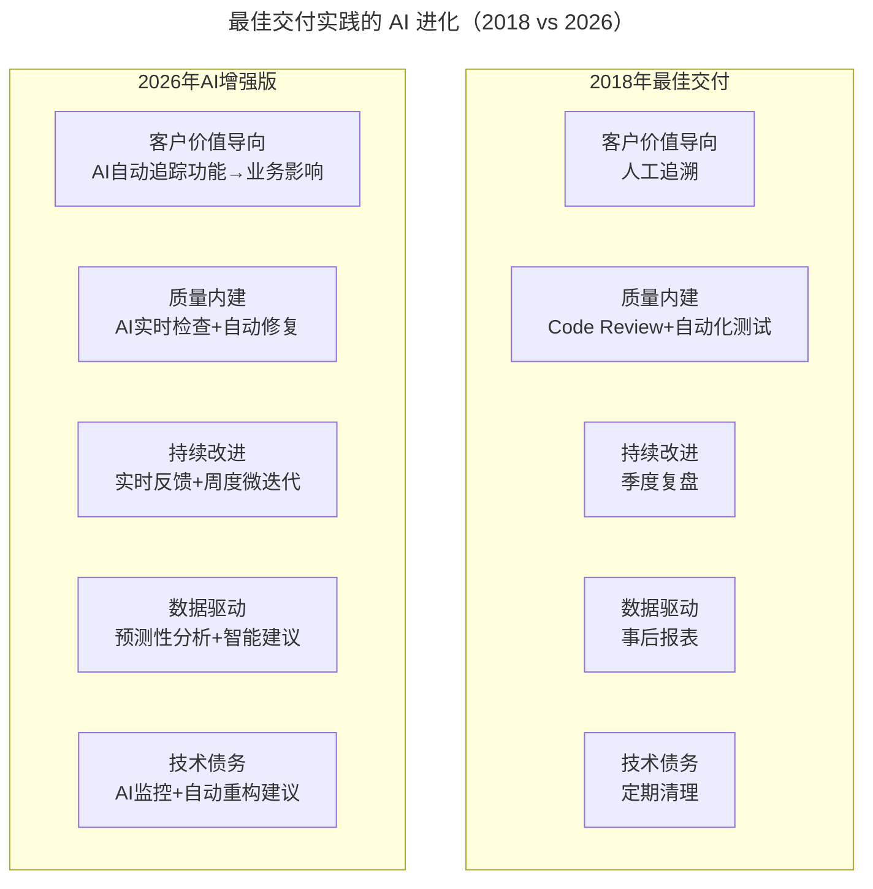

# 大咖对话 | 余沛：打造以最佳交付实践为目标的技术导向

> **适用范围**：技术管理者、研发负责人、交付经理、质量负责人
>
> **更新摘要（v2 · 2026-08 更新）**：
> - 结构化升级为 6 节骨架（导言 / 核心方法论 / 关键流程 / 工具与实战 / 常见误区 / 进阶延展）
> - 保留原文"最佳交付实践"五要素（客户价值导向 / 质量内建 / 持续改进 / 数据驱动 / 技术债务管理）
> - 整合 AI 时代升级注解，新增 2026 质量内建工具链、数据驱动新维度、AI 增强交付体系行动清单
> - 补充 Mermaid 图表并配以文字解读

## 1. 导言

本周大咖对话嘉宾是前陆金所 CTO，TGO 鲲鹏会会员余沛。拥有超过 20 年的软件开发和技术管理经验，曾在微软、腾讯等公司任职。

余沛认为，最佳交付实践不是一套固定的流程或方法论，而是一种持续优化的能力。本文围绕"以最佳交付实践为目标的技术导向"展开，核心主张是：**交付实践的本质是持续优化，而非一劳永逸的方法论**。

## 2. 核心方法论

余沛提出的"最佳交付实践"包含五个核心要素：

### 2.1 以客户价值为导向

所有的技术活动都要能追溯到对客户的价值交付上。如果一项技术投入不能带来客户价值的提升，那就要重新评估它的必要性。

### 2.2 质量内建

质量不是测试出来的，而是设计和开发出来的。我们要在开发的每个环节都嵌入质量保证，而不是依赖后端的测试环节来发现问题。

### 2.3 持续改进的文化

没有一劳永逸的最佳实践，只有不断迭代和优化。团队要建立复盘机制，每次项目结束后都要总结经验教训，持续优化流程。

### 2.4 数据驱动的决策

用数据来衡量交付效果，而不是凭感觉。包括交付速度、缺陷率、客户满意度等维度。

### 2.5 技术债务管理

要在快速交付和控制技术债务之间找到平衡。不能为了速度牺牲质量，也不能为了完美主义影响交付。

下图为五要素的协同关系，说明客户价值是导向，质量内建与持续改进是手段，数据驱动是依据，技术债务管理是平衡机制。



五要素关系图说明：客户价值为导向处于核心位置，驱动质量内建与持续改进两大手段；两者通过数据驱动决策形成量化闭环；技术债务管理作为平衡机制，在快速交付与质量保证之间提供反馈调节。

## 3. 关键流程

### 3.1 质量内建流程

质量内建要求在开发的每个环节嵌入质量保证，而非依赖后端测试。下图为质量内建在各阶段的落地流程。



流程图说明：质量内建从设计阶段的设计评审开始，贯穿编码 Code Review、提交单元测试、构建静态分析、发布手动验证五个环节，每个环节都嵌入质量保证，而非仅依赖末端测试。

### 3.2 持续改进复盘流程

```
项目结束 → 总结经验教训 → 识别流程优化点 → 制定改进措施 → 下次项目应用 → 循环迭代
```

### 3.3 技术债务管理流程

```
快速交付 ←→ 控制技术债务

平衡策略：
1. 识别技术债务类型（架构/代码/测试/文档）
2. 评估债务影响（开发效率/系统稳定性/可维护性）
3. 制定偿还计划（定期清理/版本迭代中逐步偿还）
4. 防止过度偿还（不为完美主义影响交付）
```

## 4. 工具与实战

### 4.1 交付效果度量维度

| 度量维度 | 指标示例 | 目标 |
|---------|---------|------|
| 交付速度 | 需求交付周期、迭代速率 | 持续缩短 |
| 缺陷率 | 线上缺陷数、缺陷逃逸率 | 持续降低 |
| 客户满意度 | NPS、用户反馈评分 | 持续提升 |
| 技术债务 | 代码重复率、圈复杂度 | 可控范围内 |

### 4.2 AI 时代的质量内建工具链（2026）

原文："质量不是测试出来的，而是设计和开发出来的"

**2026 年的"质量内建"新工具链**：

| 阶段 | 传统做法 | AI 增强做法 |
|-----|---------|-----------|
| 设计 | 设计评审会议 | AI 架构审查（反模式检测） |
| 编码 | Code Review | AI 实时代码检查 + 自动修复 |
| 提交 | 单元测试 | AI 生成测试（覆盖率 95%+） |
| 构建 | 静态分析 | AI 安全扫描 + 性能预测 |
| 发布 | 手动验证 | AI 变更风险评估 |

### 4.3 "最佳交付实践"的 AI 进化

下图对比 2018 年与 2026 年最佳交付实践五要素的演进，说明每个要素都被 AI 技术增强。



对比图说明：2026 年五要素均从"人工/事后/定期"模式升级为"AI 自动/实时/持续"模式。客户价值导向从人工追溯变为 AI 自动追踪，质量内建从 Code Review 升级为 AI 实时检查加自动修复，持续改进从季度复盘变为实时反馈加周度微迭代。

### 4.4 数据驱动的新维度（2026）

原文："用数据来衡量交付效果"

**2026 年新增的数据维度**：
- AI 生成代码占比及通过率
- 人机协作效率比
- Prompt Engineering 质量评分
- AI Agent 任务完成率
- 技术债务 AI 化偿还进度

### 4.5 AI 时代最佳交付体系行动清单

```
Daily:
□ AI效能仪表盘检查（15分钟）
  - 今日AI辅助编码占比
  - 代码质量指标
  - 异常预警

Weekly:
□ 交付质量复盘（1小时）
  - 本周交付的功能及用户反馈
  - AI使用中的问题和改进
  - 最佳实践沉淀到共享库

Monthly:
□ 技术健康度报告
  - 技术债务变化趋势
  - AI能力成熟度提升情况
  - 流程瓶颈识别和优化

Quarterly:
□ 最佳实践更新
  - 根据数据和反馈调整标准
  - 引入新的AI工具/方法
  - 团队能力培训计划
```

## 5. 常见误区

### 5.1 误区一：最佳交付实践是一套固定流程

余沛明确指出，最佳交付实践不是一套固定的流程或方法论，而是一种持续优化的能力。没有一劳永逸的最佳实践，只有不断迭代和优化。

### 5.2 误区二：质量靠后端测试保证

质量不是测试出来的，而是设计和开发出来的。依赖后端测试环节发现问题成本高、效率低，应在每个开发环节嵌入质量保证。

### 5.3 误区三：为速度牺牲质量或为完美影响交付

要在快速交付和控制技术债务之间找到平衡。不能为了速度牺牲质量，也不能为了完美主义影响交付。

### 5.4 误区四（AI 时代新增）：忽视 AI 生成代码的质量审核

2026 年质量内建新增 AI 实时检查和自动修复能力，但仍需人工审核 AI 生成内容。常见误区包括：
- 对 AI 生成代码不加审核直接上线
- 忽视 AI 生成代码的可维护性评估
- 过度依赖 AI 自动修复而放松人工 Code Review

## 6. 进阶延展

### 6.1 核心观点回顾

余沛（前陆金所 CTO）的交付实践理念：
1. **客户价值导向**：所有技术活动可追溯至客户价值
2. **质量内建**：质量是设计开发出来的，非测试出来的
3. **持续改进文化**：复盘机制 + 持续优化
4. **数据驱动决策**：多维度度量效果
5. **技术债务管理**：平衡速度与质量

### 6.2 AI 时代的演进总结

> 2018: 质量内建 = Code Review + 自动化测试  
> **2026: 质量内建 = AI 实时检查 + 自动修复 + 预测性防护**

> 2018: 持续改进 = 季度复盘  
> **2026: 持续改进 = 实时反馈 + 周度微迭代 + AI 驱动优化**

> 2018: 数据驱动 = 事后报表  
> **2026: 数据驱动 = 预测性分析 + 智能建议 + AI 自动归因**

> 2018: 技术债务 = 定期清理  
> **2026: 技术债务 = AI 监控 + 自动重构建议 + 智能偿还规划**

### 6.3 核心结论

余沛的"最佳交付实践"哲学——"客户价值导向、质量内建、持续改进、数据驱动、技术债务管理"——在 AI 时代不仅没有过时，反而被 AI 技术大幅增强。交付实践的本质依然是持续优化，但优化的手段从人工/事后/定期升级为 AI 自动/实时/持续。

---

*注解生成时间：2026年6月 | 基于AI时代软件工程最佳实践更新*
