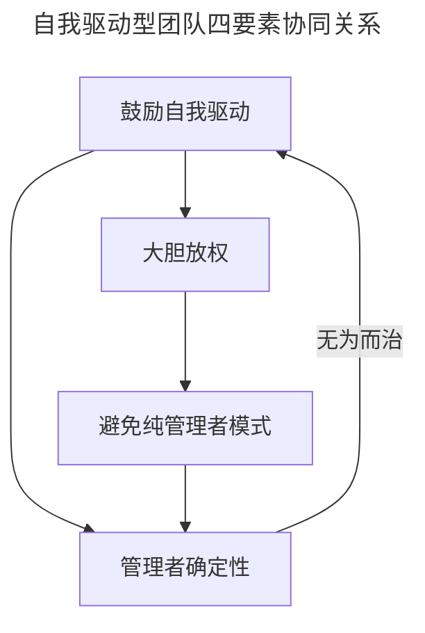
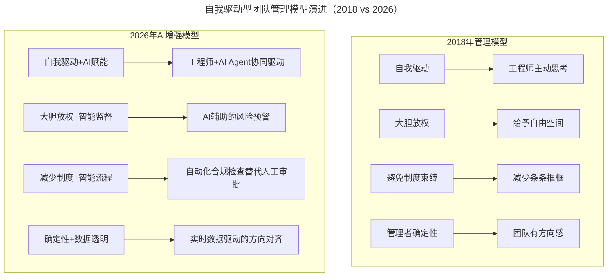

# 大咖对话 | 如何打造自我驱动型的技术团队？

> **适用范围**：CTO、技术总监、团队 Lead、研发管理者
>
> **更新摘要（v2 · 2026-08 更新）**：
> - 结构化升级为 6 节骨架（导言 / 核心方法论 / 关键流程 / 工具与实战 / 常见误区 / 进阶延展）
> - 保留原文甘泉（青云 QingCloud CTO）的自我驱动、大胆放权、避免纯管理者模式、确定性四大观点
> - 整合 AI 时代升级注解，新增 AI 成熟度分级放权框架、Super Star 新定义、无为而治 AI 版
> - 补充 Mermaid 图表并配以文字解读

## 1. 导言

本周作客"大咖对话"的嘉宾是青云QingCloud CTO甘泉。他拥有18年软件开发相关工作经验，曾先后在华为、IBM 软件实验室、百度等公司任职，对Linux操作系统、网络、存储以及分布式系统架构、软件工程等方面有比较深入的理解。

软件开发是一个创新密集型的领域，同时它的创新越来越多的来自工程师，而不是管理者。因此，作为技术团队的管理者，就需要顺应这个变化，转变自己的管理模式。本文围绕"如何打造自我驱动型的技术团队"展开，核心主张是：**让工程师自己身体内部的马达转动起来**。

## 2. 核心方法论

### 2.1 鼓励自我驱动

以前，通常是公司高层或领导者直接驱动，下面的程序员戏称自己是码农，领导让做什么就做什么。但现在，我们要鼓励他们的自我驱动，让工程师自己身体内部的马达转动起来，让他们自己考虑下一步该往哪里走，怎么才能做到最好？作为管理者，你要做的是设定一个目标，然后想办法让他们自我驱动的往前走，这是一个比较大的转变。

### 2.2 大胆放权

既然要鼓励自我驱动，就不能把程序员锁得死死的，所以大胆放权。坦白讲，不少管理者都非常在乎自己手中的权力，不舍得放权。但其实大可放宽心，因为你放出去的权力还是你的，你能放出去就还能收回来，所以大胆放权，这个并不会对你造成什么伤害，管理者要有这个心胸。

### 2.3 避免纯管理者模式

我见很多纯管理者，他们制定了公司的管理制度，他们会觉得之所以管不好，就是因为制度做的还不够好。我也认同，管理制度是有用的，但作为技术管理者，一定要想明白，如果你的公司都是能人、每个人都能非常高效的工作，那么你就不需要管理制度。

你之所以需要管理制度，是因为里面有一些庸人，这些庸人总是犯错或偷懒，所以需要制度来避免他们犯错。但你制定越多的管理制度，减少庸人犯错机会的同时，你也是在惩罚那些能人，给他们树立了太多的条条框框，让他们动弹不得。所以，作为一个管理者，你在制定这些管理制度的时候，一定需要克制自己内心的冲动，不要去做扼杀创新的事情。

### 2.4 确定性是管理者的核心品质

管理者最重要的一个品质是要有确定性。何谓确定性？就是指，你作为管理者，不管你在还是不在，团队都会按照一个共识去做事情。就算你不在，大家也都敢放心大胆的这么去做，因为你给了他们确定性，让他们知道这么做是对的，大家能知道对错、知道好坏。

最怕的就是管理者自身的不确定，因为大家会不由自主的去研究领导、去试探领导的边界，如果管理者不确定，那团队成员的精力可能就都放在琢磨领导身上，而不是琢磨事情上了。

下图为四要素的协同关系，说明自我驱动是基础，大胆放权是手段，避免过度制度是保障，确定性是锚点。



四要素关系图说明：自我驱动是起点，驱动大胆放权的需求；放权要求减少制度束缚（避免纯管理者模式）；三者最终指向管理者的确定性——确定性使团队敢于自我驱动，形成"无为而治"的闭环。

## 3. 关键流程

### 3.1 放权的分阶段流程

放权并不是说把事情丢给对方之后，就完全不管了，如果真这么做，那就是管理者的失职了。放权其实也是分阶段的：

**第一阶段：信任建立（有保留的信任）**
- 刚开始表示我准备好信任你了
- 了解项目进度、Review项目质量
- Check有没有On Schedule、有没有Off Track
- 出现情况就事论事，公平讨论，取得共识

**第二阶段：成果验证**
- 密切关注项目初期进展
- 付出更大精力做实操环节

**第三阶段：完全放权**
- 等他们做出成果，证明值得信任后完全放权
- 下一代方向、规划听对方的
- 达到这个 level 的人不多，每一个都是公司最重要的资产

举例来说，我们之前推出了分布式数据库RadonDB和分布式块存储NeonSAN，这两个产品就是比较典型的例子，都是我完全放权给了它们的负责人，由负责人自我驱动，最后打造出了非常优秀的产品。

### 3.2 机会平等的层级沉淀流程

我们并不会把资源完全往这些人身上倾斜，对于普通程序员，我们也会提供平等的机会。如果你有想法，我也会按照他们的标准给你创造一个自由的空间，看看你能不能抓住机会。

如果你抓不住，那没办法，说明你能力还不够，可以待在这个层级继续练级，但有的人就抓住了机会，往上进入另一个层级。这样，青云的员工就慢慢沉淀出不同的层次，但这样大家是心悦诚服的，因为这个划出来的层级，并不是我指定的，而是大家自己争取来的，由大家的能力来决定的。

所以，真正的平等并不是说在待遇上每个人均贫富，而是要给每个人相同的机会，机会的平等才是真正的平等。

### 3.3 Super Star 留存流程

```
培养 Super Star → 推出去建立影响力（大会/宣讲） → 
即使被挖走也积累了品牌 → 留下来的才是文化传播种子
```

技术管理之所以难是因为你面对的是人，人是善变的，比机器要难管，但是这也有好处，因为人是有感情的。如果你给了他们机会，把他们培养成今天这样的人，他们会感谢你的。就算他们被挖走了，就算拿到了比青云更高的薪水，但是成长空间呢？大公司一个萝卜一个坑，挖他过去，需要的就是他之前在青云练就的能力与积累的知识。

我反而会努力把他们培养成Super Star，同时努力把他们推出去，支持他们多去参加大会、去做宣讲，建立自己的影响力。那些纯粹为了钱的人也到不了Super Star这个level，留下来的、沉淀下来的才是公司最重要的一批人。

## 4. 工具与实战

### 4.1 放权对象评估维度

| 维度 | 评估要点 | 权重 |
|------|---------|------|
| 以往表现 | 是否足够好以获得信任 | 高 |
| 项目进度把控 | 是否 On Schedule | 高 |
| 项目质量 | Review 是否达标 | 高 |
| 方向偏移 | 是否 Off Track | 中 |
| 沟通共识 | 能否就事论事公平讨论 | 中 |

### 4.2 AI 时代的放权新框架：AI 成熟度分级放权

| 等级 | AI 成熟度 | 授权范围 | 管理者介入频率 |
|-----|---------|---------|--------------|
| L1 初学者 | 刚开始用 AI | 仅限非核心模块 AI 辅助编码 | 每日 Check-in |
| L2 熟练者 | 能独立完成 AI 辅助开发 | 可负责完整功能模块（含 AI 部分） | 每周 Review |
| L3 专家 | 能设计复杂人机协作方案 | 可带领小团队 + AI Agent 作战 | 双周同步 |
| L4 大师 | 能制定团队 AI 策略 | 类似原文中的 Super Star 级别 | 月度对齐 |

### 4.3 AI 时代自我驱动团队建设行动清单

```
第一步：工具就绪（1-2周）
- 统一团队AI编程工具（推荐Cursor/Windsurf/Copilot）
- 建立共享Prompt库（团队知识资产）
- 配置AI代码审查流水线

第二步：能力升级（1-3个月）
- 组织AI编程实战培训（每周1次，每次2小时）
- 建立"AI Pair Programming"轮换机制
- 设立"月度AI最佳实践"分享会

第三步：流程重构（3-6个月）
- 重构需求分析流程：加入"AI可行性评估"
- 重构设计评审：增加"人机分工设计"环节
- 重构代码评审：AI初筛 + 人工复审

第四步：文化塑造（持续）
- 从"代码行数崇拜"转向"价值交付导向"
- 鼓励实验：允许20%时间探索AI新用法
- 建立"失败宽容"机制：AI实验失败不扣绩效
```

## 5. 常见误区

### 5.1 误区一：管理者驱动太多

我见很多纯管理者，他们制定了公司的管理制度，他们会觉得之所以管不好，就是因为制度做的还不够好。实际上是在为你个人去管理，是在维系你的权力，并没有为公司的核心竞争力增长这个目标去管理。

### 5.2 误区二：管理制度越多越好

你制定越多的管理制度，减少庸人犯错机会的同时，你也是在惩罚那些能人，给他们树立了太多的条条框框，让他们动弹不得。

### 5.3 误区三：把研发跟外界隔绝，生怕被挖

我反而会努力把他们培养成Super Star，同时努力把他们推出去。那些纯粹为了钱的人也到不了Super Star这个level，留下来的才是文化传播的种子。

### 5.4 误区四（AI 时代新增）：过度放权给 AI

- **错误**：让 AI 完全自主决策技术方案
- **正确**：AI 提供建议，人类做最终决策
- **关键**：70% 精力放在人身上，30% 放在工具上

## 6. 进阶延展

### 6.1 原文观点的 AI 时代映射

下图对比 2018 年与 2026 年管理模型，说明每个要素都被 AI 技术增强。



对比图说明：2026 年的管理模型在自我驱动、放权、制度、确定性四个维度上均叠加了 AI 增强层，从"人工驱动"升级为"人机协同驱动"。

| 2018 年观点 | 2026 年 AI 时代演绎 |
|-----------|-------------------|
| "鼓励自我驱动" | 培养人机协同的自我驱动能力——84% 开发者用 AI 编程，如何让 AI 成为驱动力而非依赖 |
| "放权给能人" | 放权给"能人 + AI 组合"——单人产出提升 3-5 倍，放权对象重新定义 |
| "管理制度惩罚能人" | 僵化流程扼杀 AI 效率——AI 需要灵活性才能发挥最大价值 |
| "管理者要有确定性" | 在快速变化中提供稳定锚点——AI 工具每季度更新，团队更需要定力 |

### 6.2 自我驱动的新内涵

原文中"让工程师自己考虑下一步该怎么走"，在 2026 年演变为：

```
传统自我驱动：我思考 → 我决策 → 我执行 → 我复盘
AI时代自我驱动：我定义目标 → 我判断哪些任务适合AI → 
                 我设计人机协作模式 → 我审查AI输出 → 我整合交付
```

**核心能力转变**：
- 从"写代码的能力"→ 定义和审查代码的能力
- 从"解决问题"→ 判断问题是否值得解决 + 选择最佳解决方案（含 AI 方案）
- 从"个人产出"→ 指挥 AI 军团作战的系统产出

### 6.3 Super Star 的新定义

| 维度 | 传统 Super Star | AI 时代 Super Star |
|------|--------------|-------------------|
| 技术能力 | 代码写得快、好 | 架构设计能力强、AI 协作效率高 |
| 解决问题 | 独立攻克难题 | 善于分解问题、合理分配给人/AI |
| 影响力 | 技术分享、带新人 | 制定 AI 使用规范、提升团队 AI 成熟度 |
| 产出模式 | 个人高产出 | 带着 AI Agent 团队实现 10 倍产出 |

### 6.4 "无为而治"的 AI 版本

```
传统无为而治：
  管理者定价值观 → 团队内化 → 自主运转
  
AI时代无为而治：
  管理者定愿景 + AI策略 → 
  AI系统辅助目标拆解 → 
  人机自主协作 → 
  实时数据反馈自动纠偏 → 
  持续优化循环
```

**关键技术支撑**：
- AI 项目管理工具（如 Linear AI、Notion AI）自动追踪进度
- Code Review AI 自动检查代码质量和安全
- 智能日报/周报自动生成，减少汇报负担
- 异常检测 AI 提前预警项目风险

### 6.5 核心理念升级

> 2018: 让每个人成为自我驱动的个体  
> **2026: 让每个人都成为"人机协同体"的自我驱动者**

> 2018: 管理者的确定性来自稳定的价值观  
> **2026: 管理者的确定性来自"在 AI 浪潮中坚守人文关怀和技术本质"的定力**

**最终目标不变：打造一支战斗力爆表的团队。只是现在的战士，手里多了 AI 这把利器。**

---

*注解生成时间：2026年6月 | 基于2026年AI编程普及现状更新*
*参考：GitHub Copilot Impact Report 2026、Stack Overflow AI Survey 2026*
