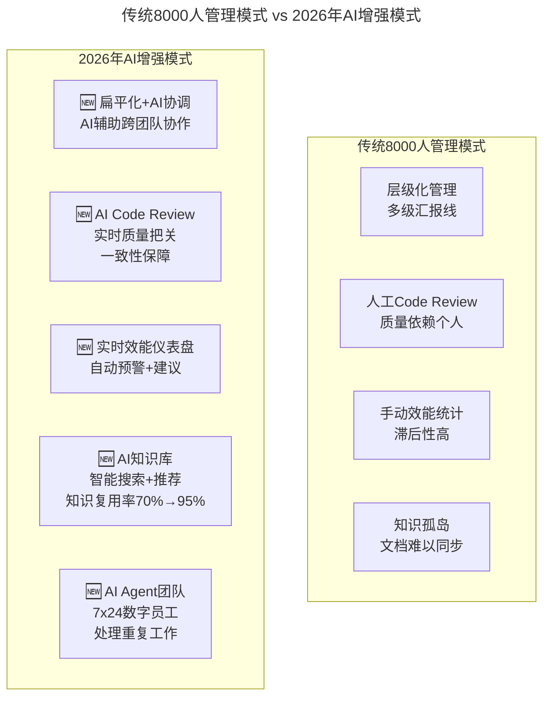

# 大咖对话 | 如何高效管理8000+规模的技术团队

> **适用范围**：千人至万人规模技术组织的管理者（CTO、技术 VP、事业群负责人），以及正在经历规模化扩张的中型技术团队 Lead。
>
> **更新摘要（v2 · 2026-08 更新）**：
> - 结构化升级为 6 节骨架（导言 / 核心方法论 / 关键流程 / 工具与实战 / 常见误区 / 进阶延展）
> - 保留原文"组织做减法、文化做加法、工具平台化、数据驱动、核心标准化边缘灵活化"五大方法论
> - 整合 2026 年 AI 时代升级注解，为 Mermaid 图补充 `title` frontmatter
> - 新增 AI 增强小团队配置、工具平台化进化对照表与三阶段转型路线图

## 1. 导言

本周大咖对话嘉宾是腾讯 T4 级别专家，腾讯技术工程事业群负责人，负责管理超过 8000 人的技术团队。

对话围绕"大规模技术团队如何在保持效率的同时不丢失创新能力"展开，覆盖组织架构、文化建设、工具平台化、数据驱动决策、标准化与灵活性平衡等关键议题，并在 2026 年 AI 时代背景下进行了升级注解。

## 2. 核心方法论

### 大规模团队管理的核心方法论

大规模技术团队管理的核心方法论可归纳为五条：

1. **组织架构做减法**：扁平化 + 小团队端到端
2. **文化做加法**：统一价值观和文化支柱
3. **工具平台化**：最佳实践固化到工具
4. **数据驱动决策**：效能度量体系
5. **核心标准化，边缘灵活化**：平衡一致性和创新

### 平衡标准化和灵活性

**极客时间：如何平衡标准化和灵活性？**

**嘉宾：** 这是一个永恒的矛盾。我的经验是"核心标准化，边缘灵活化"。核心的技术栈、安全规范、发布流程必须统一；但在具体的实现方式、技术选型上给团队足够的自主权。

### AI 时代的方法论验证

2026 年，上述五条方法论不仅没有过时，反而被 AI 技术大幅增强：同样 8000 人团队，**实际产出可提升 200-300%**；AI Agent 承担**40% 的重复性工作**（测试、文档、监控）；跨团队协作效率提升**150%**（AI 翻译、智能调度）。

## 3. 关键流程

### 大规模团队管理的四步落地

**极客时间：管理8000+人的技术团队，最大的挑战是什么？**

**嘉宾：** 最大的挑战是如何在保持效率的同时，不丢失创新的能力。小团队天然具有敏捷性，但大团队很容易陷入"大公司病"——流程僵化、决策缓慢、部门墙厚重。

我们的做法是：

1. **组织架构上做减法**。尽量保持扁平化，减少层级。8000人不是一个大团队，而是很多个小团队的集合。每个小团队（8-12人）要保持完整的端到端交付能力。

2. **文化上做加法**。建立统一的技术文化和价值观，让不同团队之间有共同语言。我们强调"技术驱动"、"用户价值"、"开放协作"三大文化支柱。

3. **工具平台化**。把最佳实践固化到工具和平台上，让流程自动化而不是靠人肉推动。代码规范、发布流程、质量门禁等都要工具化。

4. **数据驱动决策**。用数据来衡量团队效能，而不是凭感觉。我们建立了完善的研发效能度量体系，包括交付速度、质量、稳定性等多个维度。

### AI 时代的大规模团队转型路线图

```
Phase 1: 基础设施升级（第1-3个月）
□ 统一AI编程工具配置（全公司标准）
□ 建立企业级Prompt共享库
□ 部署AI Code Review系统
□ 启动AI效能仪表盘试点

Phase 2: 流程重构（第4-6个月）
□ 重构需求到交付的全流程（加入AI节点）
□ 建立"AI成熟度"评估体系
□ 推行"AI Agent as Team Member"理念
□ 跨团队知识库AI化改造

Phase 3: 组织优化（第7-12个月）
□ 团队结构优化（更小的自治单元）
□ 引入AI Coordinator角色（跨团队AI协调）
□ 建立AI治理委员会（伦理、安全、合规）
□ 数据驱动的持续优化循环
```

三阶段路线图遵循"基础设施 → 流程重构 → 组织优化"的递进逻辑，先解决工具底座，再改造协作流程，最后调整组织结构，避免在工具未就绪时就动组织带来震荡。

## 4. 工具与实战

### 大规模团队管理的 AI 增强



AI 增强模式将原本依赖多级汇报线、人工 Review、手动统计与文档孤岛的传统管理，升级为 AI 辅助协调、实时质量把关、实时仪表盘与 AI 知识库，并在重复性工作上引入 7x24 数字员工。

### "工具平台化"的 AI 进化

原文："把最佳实践固化到工具和平台上"

**2026年的平台化包含：**

| 维度 | 2018年 | 2026年 |
|-----|--------|--------|
| 代码规范 | Lint工具 | **AI实时检查 + 自动修复** |
| 发布流程 | CI/CD流水线 | **AI变更风险评估 + 智能发布** |
| 质量门禁 | 自动化测试 | **AI测试生成 + 覆盖率优化** |
| 知识管理 | Wiki/Confluence | **AI知识图谱 + 智能问答** |
| 效能度量 | Dashboard报表 | **AI预测性分析 + 改进建议** |

### 新的组织角色定义

```
新增关键角色：

1. AI Strategist (每100人配1名)
   - 制定团队AI策略
   - 评估AI工具选择
   - 推动AI最佳实践

2. AI Coordinator (每个事业部)
   - 跨团队AI协作协调
   - AI资源分配
   - 打破AI使用壁垒

3. AI Governance Officer (公司级)
   - AI伦理和安全政策
   - 合规性审查
   - 风险管理
```

三类新角色分别对应"策略—协调—治理"三个层面：AI Strategist 落到每 100 人配置，AI Coordinator 落到事业部层面打通壁垒，AI Governance Officer 落到公司层面负责合规与风险。

## 5. 常见误区

### 误区一：大团队一定陷入"大公司病"

大团队的"流程僵化、决策缓慢、部门墙厚重"并非不可逆。通过组织做减法（扁平化 + 端到端小团队）、文化做加法、工具平台化与数据驱动，可以在规模化同时保持敏捷；2026 年 AI 进一步让大团队重新获得小团队的敏捷性。

### 误区二：标准化与灵活性只能二选一

这是永恒的矛盾，但并非二选一。正确做法是"核心标准化，边缘灵活化"：核心技术栈、安全规范、发布流程必须统一；具体实现方式、技术选型上给团队足够自主权。

### 误区三：效能度量靠感觉

凭感觉衡量团队效能是大团队管理常见误区。应建立完善的研发效能度量体系，覆盖交付速度、质量、稳定性等多个维度；2026 年进一步升级为实时预测 + 智能建议 + 自动纠偏。

## 6. 进阶延展

### "小团队"的新定义

⭐ **2026新认知：**

原文："每个小团队（8-12人）要保持完整的端到端交付能力"

**2026年的"小团队"可能是：**

```
传统小团队（10人）：
- 1 Tech Lead
- 6 开发工程师
- 2 测试工程师
- 1 DevOps

AI增强小团队（6人 + 5 AI Agents）：
- 1 Tech Lead（架构设计 + AI策略）
- 3 全栈工程师（与AI协作）
- 1 产品技术负责人
- 1 QA（AI辅助测试）
  
AI Agent团队成员：
· Code Review Agent
· 测试生成Agent
· 文档生成Agent
· 监控告警Agent
· 知识检索Agent

产出对比：
传统10人团队：100 units/月
AI增强6人团队：250-300 units/月
```

### 总结

大规模技术团队管理的核心智慧——**"扁平化、文化统一、工具平台化、数据驱动、平衡标准与灵活"**——在AI时代不仅没有过时，反而被AI技术大幅增强。

> 2018: 8000人 = 很多小团队的集合  
> **2026: 8000人 + 2000个AI Agent = 一个超级智能组织**

> 2018: 工具平台化 = CI/CD + Wiki + Dashboard  
> **2026: 工具平台化 = AI Native Dev Platform（从编码到部署全链路AI化）**

> 2018: 数据驱动 = 事后看报表  
> **2026: 数据驱动 = 实时预测 + 智能建议 + 自动纠偏**

**最大的机遇：AI让大团队重新获得小团队的敏捷性，同时保持规模化优势。**

---

*注解生成时间：2026年6月 | 基于大规模技术组织和AI协同最新实践更新*
