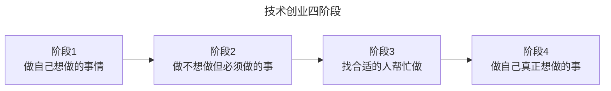
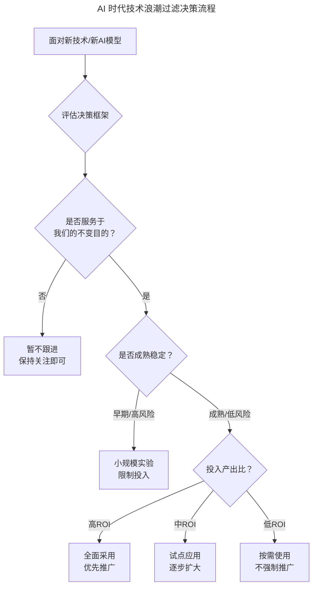
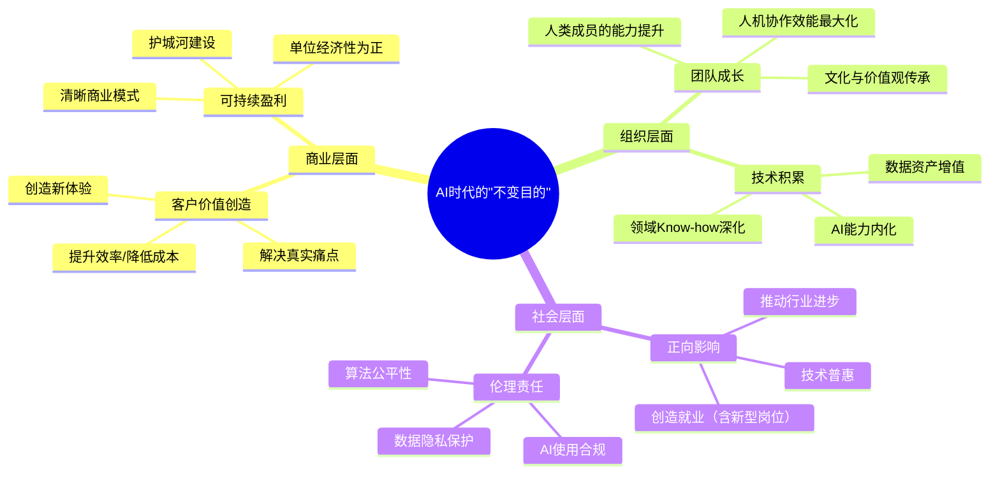

# 大咖对话 | 季昕华：以不变的目的应对多变的技术浪潮

> **适用范围**：技术创业者、CEO/CTO、技术战略决策者
>
> **更新摘要（v2 · 2026-08 更新）**：
> - 结构化升级为 6 节骨架（导言 / 核心方法论 / 关键流程 / 工具与实战 / 常见误区 / 进阶延展）
> - 保留原文季昕华（UCloud CEO）的"变化的是技术，不变的是目的"核心理念与创业四阶段
> - 整合 AI 时代升级注解，新增 AI 时代"变与不变"图谱、技术浪潮过滤器、AI 价值验证清单
> - 补充 Mermaid 图表并配以文字解读

## 1. 导言

本周作客大咖对话的是UCloud联合创始人兼CEO季昕华，他有着超过15年IT及互联网行业管理经验，曾就职于华为、腾讯、盛大，历任经理、副总经理、首席安全官、CEO等职位，曾全面负责腾讯安全体系建设、盛大云计算平台的研发及管理，对云计算、安全行业具有丰富的经验和深刻的见解。

本文围绕创业、技术管理相关话题展开，核心理念是：**变化的是技术，不变的是目的——任何技术都是为商业服务的**。

## 2. 核心方法论

### 2.1 以不变的目的应对多变的技术

技术一直在不断变化，每年都有各种各样的技术趋势出现，而应对技术浪潮，最核心的要点就是，变化的是技术，不变的是目的，这一点非常关键。

在我看来，任何技术都是为商业服务的，所以我们要围绕我们的商业目的、商业手段去选择所需的技术。

在互联网行业，一般产品研发有三种模式：
1. **技术驱动型**：技术特别好，舍我其谁，只有我能干、谁也干不了
2. **竞争对手跟随型**：绝不捣乱，老大干什么、我就干什么
3. **用户需求满足型**：用户要什么、我就干什么

UCloud就属于第三种，公司存在的价值是为用户创造价值，当你为用户创造价值的时候，用户才会真正给你收益，你才能给员工回报、给股东回报，这才是一个完整的公司生态链。

### 2.2 为客户创造价值是根本

不管在哪个行业，公司是否能活下来，最关键的一点就是你能否为客户创造价值，其次是能否用好的、新的技术持续为客户创造价值。这两点是最关键的，一是能创造价值，二是能持续的创造价值。

我们公司的使命就是"用云计算帮助梦想者推动人类进步"。有很多技术人有很好的想法，也有很好的技术，只是缺少资源，我们希望能通过我们的服务帮助这类梦想者实现梦想。过去几年，我们支持的公司中，接近80%的都是这样的创业公司，其中很大一部分都已经成功了，而且现在规模越来越大。

### 2.3 技术创业四阶段

以我作为创业公司CEO的角度来看，技术创业可以分为四个阶段：



四阶段图说明：创业从"做自己想做的事"起步，进入"做不想做但必须做的事"（如销售、市场、财务），再到"找合适的人分担"，最终回归"做自己真正想做的事"。每个阶段的关键任务不同，无法跳过。

- 第一个阶段，做自己想做的事情
- 第二个阶段，去做那些不想做，但又必须得做的事情
- 第三个阶段：找到一群合适的人，去帮你做那些你不想做，也不擅长的事情
- 最后一个阶段，有机会去做那些自己内心真正想做的事情

目前，我还处在第三阶段，还在努力找一些合适的人，来做那些我不想做但是又必须做的事情。

### 2.4 技术团队管理要点

要做好技术团队管理，我觉得以下这几点比较关键：
1. 要有一个比较大的梦想，这是非常重要的
2. 要让技术人员感知到，他们做的事情在直接对客户产生价值，让他们有成就感
3. 要坚持技术导向，让技术人员觉得他们能在这里学到东西

而技术人在转向管理的时候，面临的最大的问题就是思维上的转变。某个问题自己几分钟就能搞定，但交给下属可能需要好几天才行，这时作为技术leader就一定要克制自己，不要亲自去解决问题。

## 3. 关键流程

### 3.1 云计算创业的价值创造流程

```
选择云计算方向（市场够大 + 帮助技术人合法挣钱）
→ 用云平台资源帮助梦想者实现梦想
→ 80% 支持的公司是创业公司
→ 客户成功 → 规模越来越大
```

### 3.2 客户价值创造实例

**混合云方案案例**：我们有个客户是典型的电商公司，平时有很多电商流量，在618、双11等时候又有很多突发流量需要响应。它本身也有一些服务器，如果全面转向云服务的话，自己的服务器就浪费闲置了，对此，我们以他们的需求为驱动，提出了混合云方案，在接管对方服务器的同时，提供部分云服务，实现了业务的弹性，也提高了公司的整体价值。

**UEP 组织案例**：我们还成立了UEP组织，帮助客户融资、找流量、做广告等等。我们是第一家帮客户在地铁里做广告的云计算公司，后来这个方式也被阿里和腾讯借鉴了。其实归根到底，我们做这一切的核心目的都是为了帮助客户，毕竟只有客户业务做得好了、赚钱了，他们才会愿意把钱花给我们。

### 3.3 AI 时代技术浪潮过滤流程

下图展示面对新技术/新 AI 模型时的评估决策框架，从"是否服务于不变目的"到"投入产出比"逐层过滤。



决策流程图说明：新技术评估需依次通过"是否服务于不变目的""是否成熟稳定""投入产出比"三道过滤，分别对应"暂不跟进""小规模实验""全面采用/试点/按需使用"五种行动方案，避免盲目跟风。

## 4. 工具与实战

### 4.1 三种产品研发模式对比

| 模式 | 特点 | 适用场景 | 风险 |
|------|------|---------|------|
| 技术驱动型 | 只有我能干 | 技术壁垒极高的领域 | 易脱离用户需求 |
| 竞争对手跟随型 | 老大干什么我干什么 | 跟随者策略 | 永远无法超越 |
| 用户需求满足型（推荐） | 用户要什么我干什么 | 大多数场景 | 需深入理解用户 |

### 4.2 AI 时代"变与不变"图谱

| 维度 | 变化的（技术/方法） | 不变的（目的/原则） |
|-----|------------------|-------------------|
| **开发方式** | 从手写代码到 AI 辅助编程 | 运用技术解决业务问题的初心 |
| **工具栈** | 从传统框架到 Agent 框架 | 为客户创造价值的使命 |
| **团队形态** | 从纯人类到人机混合 | 让团队成员成长的承诺 |
| **竞争要素** | 从算法优势到数据 + 场景 | 以用户需求为导向的理念 |
| **学习内容** | Prompt Engineering、Agent 编排 | 持续学习和适应的精神 |

### 4.3 AI 价值验证清单

```
□ 这个AI功能解决了用户的什么具体痛点？
□ 用户愿意为这个解决方案付费吗？（付费意愿测试）
□ AI方案比非AI方案的效率提升有多少？（量化对比）
□ AI方案的额外成本（API、算力、人力）是否可接受？
□ 是否有竞品已经验证了类似方案的市场需求？
```

### 4.4 UCloud 模式的 AI 时代延伸

| 服务层次 | 传统云服务 | AI 时代增强服务 |
|---------|----------|--------------|
| **基础设施** | IaaS（计算/存储/网络） | + GPU/TPU 算力、模型服务 |
| **平台服务** | PaaS（数据库/中间件） | + AI 开发平台、Agent 编排平台 |
| **增值服务** | UEP（融资/流量/广告） | + AI 咨询、Prompt 工程服务、AI 人才对接 |
| **生态共建** | 客户成功案例 | + AI 联合创新、数据资产合作 |

## 5. 常见误区

### 5.1 误区一：太关注技术本身而忽略用户需求

很多技术人员创业容易犯一个错误，就是太关注技术本身，而忽略了用户真正需要什么。技术只是手段，解决问题才是目的。

### 5.2 误区二：管理者亲自解决问题

某个问题自己几分钟就能搞定，但交给下属可能需要好几天才行，这时作为技术 leader 就一定要克制自己，不要亲自去解决问题，否则虽然对解决问题有帮助，但对团队管理却并无好处。

### 5.3 误区三：公司规模大了仍不放弃技术优势

技术人在创业过程中一定要发挥自己的技术优势。但当公司规模达到一定阶段后，你反而要放弃自己所有的技术优势，去做那些你可能不擅长，但又必须得做的事情，比如销售、市场、财务、投融资等。

### 5.4 误区四（AI 时代新增）：技术驱动型 AI 产品

| 误区类型 | 表现 | 后果 | 正确做法 |
|---------|------|------|---------|
| **技术驱动** | "我们用了最新的 GPT-5.5！" | 用户不买单，因为没解决实际问题 | 先找痛点，再选技术 |
| **概念炒作** | "AI 赋能"空洞口号 | 失去信任，浪费资源 | 用具体场景和价值说话 |
| **过度承诺** | "AI 能替代 80% 的人工" | 无法兑现，信誉受损 | 设定合理期望，逐步证明 |
| **忽视成本** | Token 费用远超预期 | 项目亏损，不可持续 | 精细化计算 AI 成本和收益 |

## 6. 进阶延展

### 6.1 "不变的目的"在 AI 时代的重新定义

下图以思维导图形式展示 AI 时代"不变目的"的三个层面：商业层面、组织层面、社会层面。



思维导图说明：AI 时代的"不变目的"从商业层面（客户价值创造、可持续盈利）、组织层面（团队成长、技术积累）、社会层面（正向影响、伦理责任）三个维度展开，比原文的"为客户创造价值"更加立体，但核心逻辑一致。

### 6.2 创业四阶段的 AI 时代挑战

| 阶段 | 传统挑战 | AI 时代新增挑战 |
|-----|---------|--------------|
| **阶段1** | 产品市场匹配 | AI 技术选型、AI 能力边界认知 |
| **阶段2** | 商业模式跑通 | AI 成本控制、AI 效果度量 |
| **阶段3** | 团队建设 | AI 人才培养、人机协作流程建立 |
| **阶段4** | 战略升级 | AI 战略规划、AI 治理体系建设 |

### 6.3 基于"不变目的"原则的行动指南

1. **明确你的"不变目的"（本周完成）**
   - 写下你的企业/团队的核心使命（一句话）
   - 写下你为客户提供的三项核心价值
   - 任何 AI 投资决策都要问："这是否服务于我的不变目的？"

2. **建立"技术浪潮过滤器"（本月启动）**
   - 制定 AI 技术评估标准（如：成熟度、成本、与业务相关性）
   - 设定"关注但不行动""试点实验""全面采用"三档
   - 每季度回顾一次技术路线图

3. **客户价值验证机制（持续执行）**
   - 每个 AI 项目启动前必须回答：用户痛点是什么？
   - 定期收集用户对 AI 功能的反馈（NPS、使用率、满意度）
   - 建立"砍掉无效 AI 功能"的勇气和机制

### 6.4 给技术创业者

- 不要因为 AI 热就做 AI 产品——先问：没有 AI 能不能解决？
- 不要追求最先进的模型——问：最便宜的模型够不够用？
- 不要忽视 AI 成本——算清楚每笔 AI 调用的 Unit Economics

### 6.5 核心启示

> "季昕华老师的'以不变的目的应对多变的技术'在 AI 时代获得了新的生命力。当技术变化的速度达到'海啸级'时，唯一能让我们不被淹没的，就是紧紧抓住那个不变的'目的'——为客户创造真实的价值。"

| 原文核心观点 | AI 时代价值 | 2026 年实践建议 |
|------------|----------|---------------|
| 变化的是技术，不变的是目的 | 更重要的原则 | 明确目的，过滤噪音 |
| 为客户创造价值 | 永恒真理 | AI 项目必须从用户痛点出发 |
| 用户需求满足型 | 最佳模式 | PMF > Technology Fit |
| 放弃技术优势，让团队成长 | 管理精髓 | 从亲力亲为到设计系统 |
| 四阶段创业路径 | 有效框架 | 认清当前阶段，聚焦关键任务 |

---

*本注解基于2026年6月的创业环境生成，是对季昕华老师2018年智慧的致敬与延展。*
