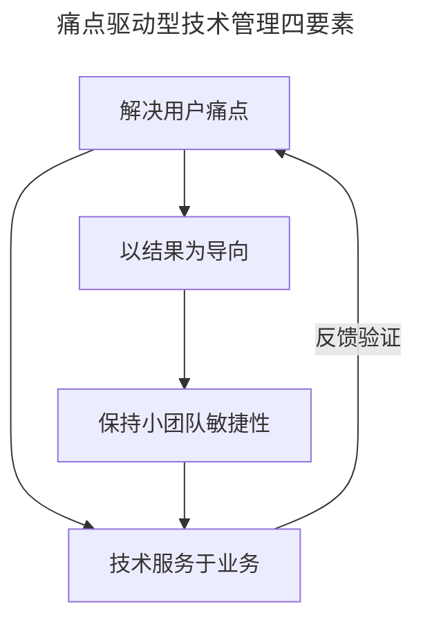
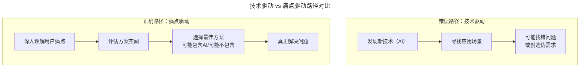

# 大咖对话 | 彭跃辉：解决用户痛点就是立足于市场的秘诀

> **适用范围**：技术创业者、产品技术管理者、B 端产品负责人
>
> **更新摘要（v2 · 2026-08 更新）**：
> - 结构化升级为 6 节骨架（导言 / 核心方法论 / 关键流程 / 工具与实战 / 常见误区 / 进阶延展）
> - 保留原文彭跃辉（神策数据 CTO）的"解决用户痛点第一""以结果为导向""小团队敏捷性"等核心观点
> - 整合 AI 时代升级注解，新增痛点驱动 vs 技术驱动路径对比、AI 伪需求陷阱、痛点验证方法
> - 补充 Mermaid 图表并配以文字解读

## 1. 导言

本周大咖对话嘉宾是神策数据联合创始人 & CTO，TGO 鲲鹏会会员彭跃辉。在百度工作近 8 年时间，曾参与百度用户行为大数据分析平台的从 0 到 1 的建设。2015 年联合创立神策数据，目前专注于大数据分析领域。

本文围绕技术创业与团队管理展开，核心主张是：**技术只是手段，解决问题才是目的——真正解决用户的痛点才是立足于市场的秘诀**。

## 2. 核心方法论

### 2.1 解决用户痛点 > 技术炫技

我觉得最关键的就是**真正解决用户的痛点**。很多技术人员创业容易犯一个错误，就是太关注技术本身，而忽略了用户真正需要什么。

我们在做神策数据的时候，不是先想"我们要用什么技术"，而是先去深入了解客户的数据分析痛点是什么。我们发现，很多企业虽然有大量数据，但不知道怎么用，现有的工具要么太复杂要么太贵。所以我们做了一个简单易用、性价比高的数据分析产品。

技术只是手段，解决问题才是目的。如果你的产品不能真正解决用户的问题，技术再牛也没有用。

### 2.2 以结果为导向

不要看大家加了多少班、写了多少代码，而是看我们是否解决了客户的问题、是否交付了有价值的产品。

### 2.3 保持小团队的敏捷性

即使公司长大了，也要尽量保持小团队作战的方式。每个团队要对自己的产品端到端负责，而不是把流程切得太细。

### 2.4 技术要服务于业务

我们不做没有业务价值的技术创新，每一项技术投入都要能追溯到具体的业务价值上。

下图为四要素的关系，说明用户痛点是起点，结果导向是衡量标准，小团队敏捷是组织保障，技术服务于业务是约束条件。



四要素关系图说明：以解决用户痛点为出发点，通过结果导向衡量成效，小团队敏捷性保障执行效率，技术服务于业务作为约束条件，形成"痛点→结果→敏捷→业务"的闭环反馈。

## 3. 关键流程

### 3.1 痛点驱动 vs 技术驱动的路径对比

下图对比"技术驱动"与"痛点驱动"两条路径，说明技术驱动容易创造伪需求，而痛点驱动才能真正解决问题。



路径对比图说明：技术驱动路径从"发现新技术"出发去"找应用场景"，容易创造伪需求；痛点驱动路径从"深入理解用户痛点"出发评估方案空间，AI 只是选项之一，最终真正解决问题。

### 3.2 神策数据的痛点驱动流程

```
深入了解客户数据分析痛点
→ 发现现有工具太复杂或太贵
→ 做简单易用、性价比高的产品
→ 持续为客户创造价值
```

### 3.3 AI 时代痛点验证三步法

```
Step 1: 用户访谈（10-20人）
  - 不要问"你需要什么功能"
  - 要问"你最大的困扰是什么"
  - AI辅助整理访谈记录，提取共性痛点

Step 2: 痛点排序
  - 按频率（多少人提到）
  - 按强度（多痛苦）
  - 按付费意愿（愿意花多少钱解决）

Step 3: 假设验证
  - 最小方案先测试（可能不用AI）
  - 收集真实使用数据
  - 判断是否值得继续投入
```

## 4. 工具与实战

### 4.1 痛点驱动需求评审清单

```
每次需求评审必须回答：
□ 这个需求解决了谁的什么痛点？
□ 痛点的严重程度如何？（必须要有 / nice to have / 锦上添花）
□ 如果不用AI，能否解决？成本如何？
□ 如果用AI，ROI如何？风险可控吗？
□ MVP版本是什么？如何验证？

禁止出现：
❌ "因为XX技术很火，所以..."
❌ "竞品有这个功能，所以..."
❌ "AI能做到，所以加上..."
```

### 4.2 结果导向的度量指标对比

**传统指标（应淘汰）**：
- ❌ 代码行数/周
- ❌ 工作时长
- ❌ 提交次数
- ❌ Bug 数量

**2026 指标（应采用）**：
- ✅ 用户痛点解决率
- ✅ 功能使用率（PMF 指标）
- ✅ 客户 NPS 评分
- ✅ 人机协作效率比
- ✅ AI 辅助开发的业务价值产出

### 4.3 小团队端到端负责制

| 维度 | 传统流水线模式 | 小团队端到端模式 |
|------|-------------|---------------|
| 流程 | 需求→设计→开发→测试→运维（切分细） | 一个团队负责产品端到端 |
| 责任 | 各环节各自负责 | 团队对产品整体负责 |
| 敏捷性 | 流程交接多，响应慢 | 快速迭代，直接响应客户 |
| 适用 | 大公司标准化场景 | 创业公司/创新业务 |

## 5. 常见误区

### 5.1 误区一：太关注技术本身

很多技术人员创业容易犯一个错误，就是太关注技术本身，而忽略了用户真正需要什么。技术只是手段，解决问题才是目的。

### 5.2 误区二：看苦劳不看功劳

不要看大家加了多少班、写了多少代码，而是看我们是否解决了客户的问题、是否交付了有价值的产品。

### 5.3 误区三：公司长大了就拆细流程

即使公司长大了，也要尽量保持小团队作战的方式。把流程切得太细会丧失敏捷性和端到端责任感。

### 5.4 误区四（AI 时代新增）：AI 伪需求陷阱

| 类型 | 表现 | 案例 |
|-----|------|------|
| AI 万能型 | 给所有功能都加 AI | 搜索框非要加语义理解 |
| 技术炫技型 | 用最强模型做简单任务 | 用 GPT-5.5 做文本分类 |
| 跟风型 | 因为热门就做 | 所有 SaaS 都加 Chatbot |
| 成本无视型 | 不考虑 ROI | API 费用超过收入 |

## 6. 进阶延展

### 6.1 核心观点回顾

彭跃辉（神策数据 CTO）的核心理念：
1. **解决用户痛点 > 技术炫技**：技术是手段，不是目的
2. **以结果为导向**：不看苦劳看功劳
3. **保持小团队敏捷性**：端到端负责
4. **技术服务于业务**：每项投入都要有业务价值

### 6.2 "用户痛点第一"在 AI 时代更加重要

**2026 年的警示**：
- ❌ "我们有 AI 能力，所以要做 AI 产品"（本末倒置）
- ✅ "用户有这个痛点，AI 恰好能很好地解决"（痛点驱动）
- ⭐ 彭跃辉的智慧永不过时——无论什么时代，解决真问题才是立足之本

### 6.3 核心结论

> **2026 年最重要的提醒：AI 让造东西变得容易，但让造对东西变得更难。**
> 因为门槛降低了，更容易陷入"技术驱动"而非"痛点驱动"的陷阱。
> 彭跃辉的话在今天更有价值：**先问"用户痛点是什么"，再问"该不该用 AI"。**

---

*注解生成时间：2026年6月 | 基于AI产品化和用户导向开发最新实践更新*
