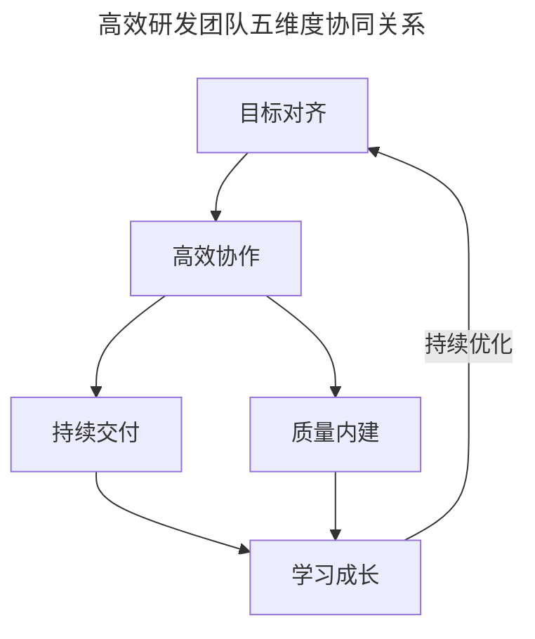
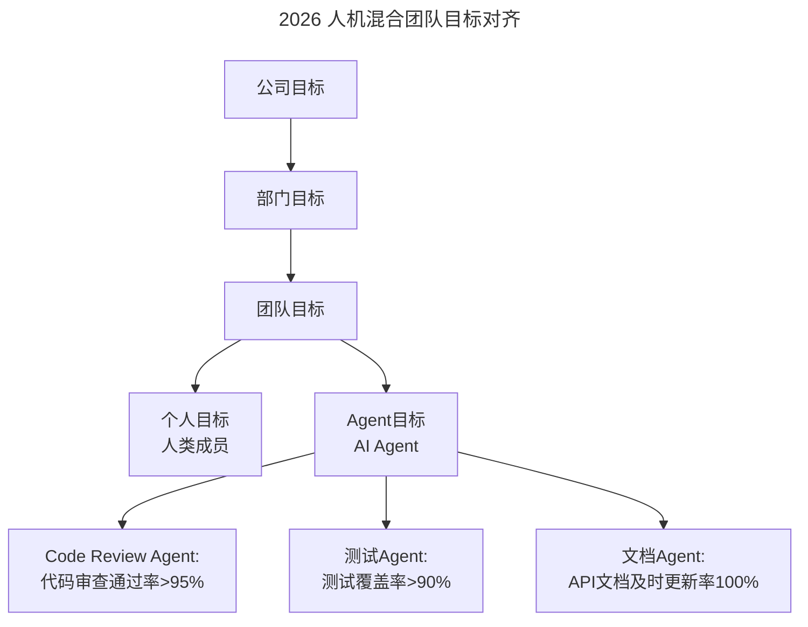
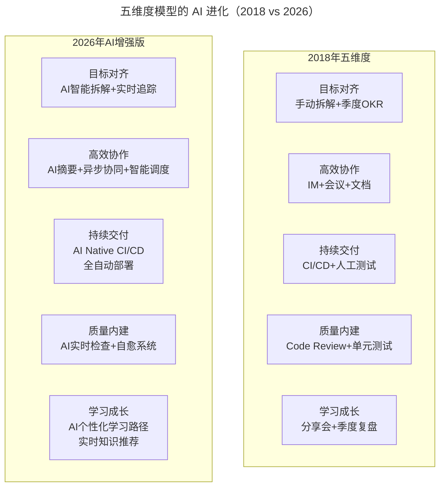

# 大咖对话 | 徐毅：打造高效研发团队的五个维度及相关实践

> **适用范围**：技术管理者、敏捷教练、研发效能负责人、工程经理
>
> **更新摘要（v2 · 2026-08 更新）**：
> - 结构化升级为 6 节骨架（导言 / 核心方法论 / 关键流程 / 工具与实战 / 常见误区 / 进阶延展）
> - 保留原文徐毅（华为云 DevLab 首席技术专家）的五维度模型（目标对齐 / 高效协作 / 持续交付 / 质量内建 / 学习成长）
> - 整合 AI 时代升级注解，新增五维度 AI 增强版、人机目标对齐、AI Native Pipeline
> - 补充 Mermaid 图表并配以文字解读

## 1. 导言

本周大咖对话嘉宾是华为云 DevLab 首席技术专家，TGO 鲲鹏会会员徐毅。曾任ThoughtWorks总监、阿里巴巴专家，拥有近20年软件开发和敏捷转型经验。

本文围绕"打造高效研发团队"展开，核心主张是：**高效研发团队应具备目标对齐、高效协作、持续交付、质量内建、学习成长五个维度的核心能力**。

## 2. 核心方法论

### 2.1 第一维度：目标对齐

团队所有成员都要清楚知道"为什么做""做什么""做到什么程度"。目标不能只是管理者清楚，而是要层层分解、透明共享，让每个人都能看到自己的工作如何支撑整体目标。

### 2.2 第二维度：高效协作

包括信息共享的及时性、沟通的低成本、决策的高效性。我们提倡"默认透明"的原则——除非有特殊原因，否则信息应该默认对所有相关方可见。

### 2.3 第三维度：持续交付能力

团队能够以可持续的速度，频繁地交付有价值的软件。这需要完善的CI/CD流水线、自动化测试、以及技术实践（如TDD、重构等）的支撑。

### 2.4 第四维度：质量内建

质量是团队每个人的责任，而不是QA部门的事。通过Code Review、结对编程、自动化测试等实践，在开发过程中就保证质量。

### 2.5 第五维度：学习成长型文化

团队要有持续学习的机制，包括技术分享、复盘总结、实验创新等。鼓励试错，从失败中学习。

下图为五维度的协同关系，说明目标对齐是方向，高效协作是基础，持续交付与质量内建是工程能力，学习成长是文化保障。



五维度关系图说明：目标对齐为团队提供方向，高效协作是协作基础，持续交付与质量内建是两大工程能力支柱，学习成长型文化则驱动持续优化，形成五维度闭环。

## 3. 关键流程

### 3.1 目标对齐流程

```
公司目标 → 部门目标 → 团队目标 → 个人目标
（层层分解、透明共享、每个人看到自己的工作如何支撑整体目标）
```

### 3.2 持续交付流程

```
代码提交 → CI/CD流水线 → 自动化测试 → 频繁交付有价值的软件
（TDD + 重构 + 可持续速度）
```

### 3.3 质量内建流程

```
开发过程中保证质量：
Code Review + 结对编程 + 自动化测试
（质量是每个人的责任，而非QA部门的事）
```

### 3.4 学习成长流程

```
技术分享 + 复盘总结 + 实验创新 → 鼓励试错 → 从失败中学习 → 持续优化
```

### 3.5 AI 时代人机目标对齐流程

下图展示 2026 年人机混合团队的目标对齐方式，说明 AI Agent 也需要明确的目标定义。



人机目标对齐图说明：2026 年团队目标不仅分解到人类成员，还分解到 AI Agent，每个 Agent 都有明确的量化目标（如代码审查通过率、测试覆盖率、文档更新率），形成人机协同的目标体系。

## 4. 工具与实战

### 4.1 五维度 2018 vs 2026 实践对比

| 维度 | 2018 年实践 | 2026 年 AI 增强 |
|-----|-----------|-------------|
| 目标对齐 | OKR + 季度对齐 | AI 自动追踪目标进度 + 实时偏差预警 |
| 高效协作 | 站会 + IM + 文档 | AI 会议摘要 + 智能任务分配 + 跨时区异步 |
| 持续交付 | Jenkins/GitLab CI | AI Native Pipeline（智能构建 + 预测性发布） |
| 质量内建 | Code Review + 单元测试 | AI 实时代码审查 + 自愈测试 + 安全扫描 |
| 学习成长 | 技术分享 + 复盘 | AI 个性化学习 + 实时知识推送 + 最佳实践推荐 |

### 4.2 五维度 AI 进化对比图

下图对比 2018 年与 2026 年五维度的具体实践演进。



对比图说明：2026 年五维度均从"手动/人工/季度"升级为"AI 智能/实时/持续"。目标对齐从手动拆解变为 AI 智能拆解，持续交付从 CI/CD 升级为 AI Native Pipeline，学习成长从分享会升级为 AI 个性化学习。

### 4.3 构建五维度研发体系实施路线图

```
Month 1-2: 维度一&二（基础）
□ 目标对齐工具升级
  - 引入AI辅助OKR工具（如Goals by Notion AI）
  - 建立目标→任务的自动追踪
  
□ 协作工具升级
  - 统一AI协作平台
  - 配置AI会议助手（自动纪要+行动项提取）

Month 3-4: 维度三&四（工程能力）
□ CI/CD AI化改造
  - 引入AI代码质量门禁
  - 部署AI安全扫描
  - 配置AI测试生成器

□ 质量体系升级
  - 强制执行 AI Code Review
  - 自动化测试覆盖率目标95%+
  - 建立AI生成的质量报告

Month 5-6: 维度五（文化）
□ 学习体系AI化
  - 个性化学习路径推荐
  - AI知识库建设
  - 最佳实践自动沉淀

□ 全面数据化
  - 五维度效能仪表盘
  - 月度健康度评估
  - 持续优化循环
```

### 4.4 新的团队仪式（2026 版）

```
Daily (15分钟):
· AI Daily Standup Summary（自动生成前日进展）

Weekly (1小时):
· AI效能回顾 + 下周规划
· AI使用经验分享（轮值）

Monthly (半天):
· 五维度健康度评估
· 技术债务审查
· 团队能力提升计划

Quarterly (1天):
· 战略目标对齐
· 工具和方法论更新
· 创新项目Hackathon
```

## 5. 常见误区

### 5.1 误区一：目标只是管理者清楚

目标不能只是管理者清楚，而是要层层分解、透明共享，让每个人都能看到自己的工作如何支撑整体目标。

### 5.2 误区二：质量是 QA 部门的事

质量是团队每个人的责任，而不是 QA 部门的事。应通过 Code Review、结对编程、自动化测试等实践，在开发过程中就保证质量。

### 5.3 误区三：信息默认不透明

我们提倡"默认透明"的原则——除非有特殊原因，否则信息应该默认对所有相关方可见。

### 5.4 误区四（AI 时代新增）：AI Agent 目标未对齐

2026 年的新问题：AI Agent 的目标如何对齐？人机混合团队的目标分配如何做？如何衡量 AI 的贡献？需要为人机混合团队设计新的目标对齐机制。

## 6. 进阶延展

### 6.1 "默认透明"原则的 AI 实现

原文："信息应该默认对所有相关方可见"

**2026 年的"默认透明"包含**：
- 代码变更 AI 摘要自动同步
- 决策过程 AI 记录并可追溯
- 知识库 AI 化，搜索即得
- 跨团队依赖关系可视化

### 6.2 "持续交付"的革命性变化

原文："频繁地交付有价值的软件"

**2026 年的交付频率**：
- 传统：每周/每两周一次发布
- 2026 领先团队：每日多次发布（AI 全自动化）
- 关键使能技术：AI 测试生成 + 自动化部署 + 灰度发布 + 实时监控

### 6.3 核心理念升级

> 2018: 高效研发团队 = 五个维度的优秀实践  
> **2026: 高效研发团队 = 五个维度的 AI 增强版本 + 人机协同文化**

> 2018: 默认透明 = 信息公开  
> **2026: 默认透明 = AI 驱动的信息主动推送 + 智能过滤**

> 2018: 持续学习 = 分享会 + 复盘  
> **2026: 持续学习 = AI 个性化学习路径 + 实时知识推荐 + 边干边学**

**最重要的不变**：
- 目标对齐仍然是第一优先级（AI 让追踪更容易，但方向仍需人来定）
- 文化依然是根本（工具再强，没有好的文化也发挥不了作用）
- 持续改进永无止境（AI 加速了迭代，但优化思维不变）

---

*注解生成时间：2026年6月 | 基于AI时代研发效能和敏捷开发最新实践更新*
*参考：State of DevOps Report 2026、Accelerate Book (Nicole Forsgren)*
