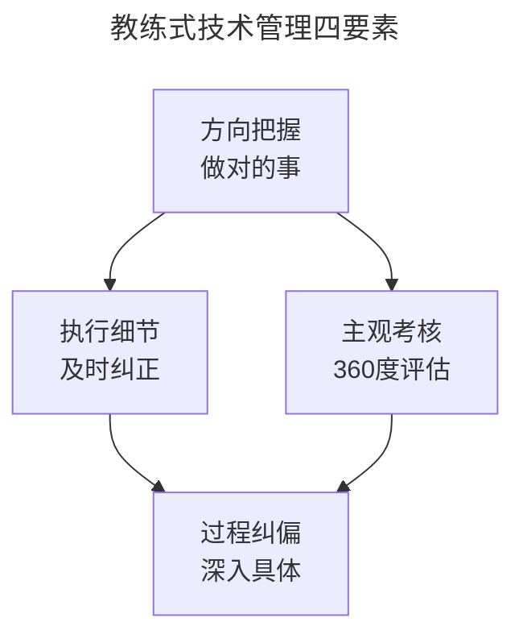
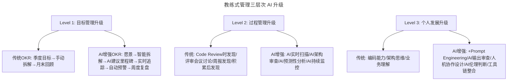
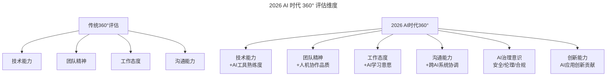

# 大咖对话 | 技术管理者应该向优秀的体育教练学习

> **适用范围**：技术管理者、CTO、团队 Lead、工程经理
>
> **更新摘要（v2 · 2026-08 更新）**：
> - 结构化升级为 6 节骨架（导言 / 核心方法论 / 关键流程 / 工具与实战 / 常见误区 / 进阶延展）
> - 保留原文梁胜（Rancher Labs CEO）的教练式管理、绩效考核主观维度、方向 vs 执行力等核心观点
> - 整合 AI 时代升级注解，新增 AI 增强教练式管理、360°评估新维度、AI 时代领导力要求
> - 移除失效图片引用，补充 Mermaid 图表并配以文字解读

## 1. 导言

今天做客"大咖问答"的是Rancher Labs联合创始人及CEO梁胜博士。梁胜是耶鲁大学计算机博士，Java语言和JVM的领导设计与开发者。2008年他创建了Cloud.com，因此被誉为"CloudStack之父"。2011年Cloud.com被Citrix收购，梁胜成为Citrix首位华人CTO。2014年，他创立了如今全球领先的容器管理公司Rancher Labs。

本文围绕技术团队绩效考核、高效研发团队打造、技术领导力展开，核心主张是：**技术管理者要像体育教练——不能只定 KPI，要深入细节、及时纠正**。

## 2. 核心方法论

### 2.1 高效 = 做对的事 + 把事做对

首先要看"高效"怎么定义，我的定义就是"这个团队取得的经济价值"。所以高效的技术团队，首先要做高效的事情。

实际上技术团队对业务的成功有非常大的直接影响力，这一点一定要不断地给技术人员灌输。你一定要做对的事情，做的事情一定要有价值。我在国内看到很多技术团队，真的每个人都很投入，都很努力，但是做的事情错了，领导者没有把握好方向。一眨眼两年、三年过去了，花费了这么多时间和心血，但是最终我们不能认为这个团队是高效的。

上面这个前提满足了，其次才是做事情的效率的问题。当然，不可能所有事情一上来都能看得很准。技术人员在发现做事情的方向出现了偏差，或者这个事情本身价值不大的情况下，一定要及时调整方向。

### 2.2 技术管理者要像体育教练

我接触过很多技术团队的管理者，在我看来，他们对具体事情的关心远远不够。什么意思呢，就是他们只关注大方向。在我看来，商业竞争和游泳、篮球等等体育竞赛实际上是一样的，体育竞赛最后只有一个奥运冠军，每个行业最终也只有一个第一。运动员要怎么培养呢？如果教练来了之后，只是给运动员定个KPI，比如"今年要进入三强"或者"三分球进球率要达到80%"，这样的教练有什么用呢？你去看看那些知名的教练，他们可是每天盯得很紧的，一个动作做得不对都会马上来纠正，我们的技术管理者跟教练比起来差得太远了。

### 2.3 绩效考核的主观维度不可替代

KPI或OKR说到底就是个目标，目标制定了以后，关键是怎么达到，这才是管理者真正应该关注的。

一个技术团队的产出，很多时候并不是基层员工能够决定的。有两个技术团队，他们的聪明程度一样，用功程度也一样，工作强度也一样，但是他们奋斗一年之后，两个团队可能会有非常不同的产出。一个团队的产品非常成功，卖得很好，对于公司来讲，产出就非常大。而另一个技术团队的产品方向错了，等于一年的时间白费了。这不是技术团队的错，他们只是完成管理层指派的任务。所以技术团队的产出不能用写了多少行代码、攻克了多少技术难题来衡量。

有些员工会想办法把自己的OKR制定得很容易达到，这样到季度末看他的完成情况都没有问题，但是对公司来说没什么价值。

所以用KPI或OKR来考核，漏洞太多了。我个人觉得管理者对员工主观的考核，或者同事间彼此的考核更重要，是不可或缺的。有的员工，可能技术能力很强，但是对同事的态度非常差，把团队的气氛搞得很差。他的KPI可能每一项都超额完成，你看不到他存在的问题。所以主观考核是很有必要的，不是说有了KPI或OKR，人就成了机器人了，那还要管理者干嘛，搞个项目管理软件不就行了。

### 2.4 领导力 = 方向把握 + 执行细节

技术领导者首先要把握方向，如果你没有跟对人，或者没有做对事，那么不仅耽误了自己的时间，还把团队成员的时间都耽误了。所以一定要花很多时间和精力，搞清楚自己在做什么，要训练自己的眼光。

其次是执行力。在技术方面，对具体问题的洞察能力，对公司、团队、业务存在的问题能够及时发现和提出。这种能力需要通过不断的训练来提高。

比尔·盖茨就是一个非常典型的优秀的技术领导者，他在上世纪70年代就预见到将来家家户户都会拥有个人电脑，所以他去做了操作系统，这就是"做对的事情"。但是具体做事情的时候，他也非常关心细节。大家知道乔布斯也非常关心细节。所以能够把技术产品做到最好的人，都是对产品、技术、体验、质量这些事情非常在乎的，真的像一个教练一样，调教出了一批优秀的人。

下图为教练式管理的四要素，说明方向把握与执行细节是领导力的两大支柱，主观考核与过程纠偏是日常管理动作。



四要素图说明：方向把握（做对的事）与执行细节（及时纠正）构成领导力的两大支柱；主观考核（360 度评估）与过程纠偏（深入具体）是日常管理动作，四者共同构成教练式技术管理体系。

## 3. 关键流程

### 3.1 绩效考核流程

**具体考核方法**：给大家发一张问卷，让大家从技术能力、团队精神、工作态度等方面，给部门其他同事打分，实际上是很管用的。KPI或OKR更加适合大公司，因为公司大了以后，主观的判断力就会下降，使用绩效管理工具可以避免一些不公平的现象。

### 3.2 高效团队打造流程

```
第一步：做对的事（方向正确）
  - 不断给技术人员灌输：技术团队对业务成功有直接影响力
  - 做的事情一定要有价值
  
第二步：及时调整方向
  - 发现方向偏差或价值不大时及时调整
  - 如果主管坚持一条路走到黑，不如脱离团队

第三步：深入细节（像教练一样）
  - 不能只关注大方向
  - 每天盯得很紧，一个动作不对马上纠正
```

### 3.3 AI 时代教练式管理三层次升级

下图展示教练式管理在目标管理、过程管理、个人发展三个层次的 AI 增强升级。



三层次升级图说明：目标管理从季度手动升级为 AI 智能拆解加实时追踪；过程管理从事后发现升级为 AI 实时扫描加预测性分析；个人发展从编码架构能力扩展到 Prompt Engineering、AI 输出审查、人机协作设计等新能力。

## 4. 工具与实战

### 4.1 绩效考核方法对比

| 考核方式 | 优点 | 缺点 | 适用场景 |
|---------|------|------|---------|
| KPI | 量化、可比较 | 漏洞多、易被钻空子 | 大公司标准化场景 |
| OKR | 目标导向 | 可能制定容易达到的目标 | 创新型团队 |
| 主观考核（360°） | 能发现软技能问题 | 主观判断可能有偏差 | 不可或缺的补充 |
| 混合模式 | 互补 | 复杂 | 大多数公司（推荐） |

### 4.2 AI 时代 360° 评估新维度



360° 评估图说明：2026 年的 360° 评估在传统四个维度（技术能力、团队精神、工作态度、沟通能力）基础上，每个维度都叠加 AI 相关子项，并新增 AI 治理意识和创新能力两个独立维度。

### 4.3 过程管理的 AI 增强对照

| 纠正类型 | 传统做法 | AI 增强做法 |
|---------|---------|-----------|
| 代码质量 | Code Review 时发现 | AI 实时扫描，即时反馈 |
| 设计偏差 | 评审会议讨论 | AI 架构审查，提前识别反模式 |
| 进度滞后 | 周报发现 | AI 预测性分析，提前 3 天预警 |
| 技术债务 | 积累后发现 | AI 持续监控债务指标 |
| AI 使用效率 | 无感知 | AI 使用质量评分（Prompt 效果、生成代码通过率等） |

### 4.4 每周教练动作清单

```
周一：AI效能仪表盘检查（15分钟）
  - 团队AI使用率
  - 代码生成占比
  - AI生成代码通过率
  
周三：1on1深度交流（30分钟/人）
  - 了解AI使用中的挑战
  - 分享AI新技巧
  - 收集改进建议
  
周五：团队AI复盘（1小时）
  - 本周AI使用亮点
  - 遇到的问题和解决方案
  - 下周AI实验计划
```

## 5. 常见误区

### 5.1 误区一：只定 KPI 不深入细节

如果教练来了之后只是给运动员定个 KPI，这样的教练有什么用呢？知名教练每天盯得很紧，一个动作做得不对都会马上来纠正。技术管理者跟教练比起来差得太远了。

### 5.2 误区二：用代码行数衡量产出

技术团队的产出不能用写了多少行代码、攻克了多少技术难题来衡量。两个聪明程度、用功程度一样的团队，因方向不同产出可能天差地别。

### 5.3 误区三：有了 KPI/OKR 就不需要主观考核

主观考核是很有必要的。有的员工技术能力很强但对同事态度差，KPI 每项都超额完成，但你看不到他存在的问题。不是说有了 KPI 或 OKR，人就成了机器人了。

### 5.4 误区四（AI 时代新增）：只给工具不给方法

"只定 KPI 的教练没用"在 AI 时代升级为"只给工具不给方法的 Leader 更没用"。AI 时代更需要深度辅导，包括 Prompt 设计辅导、AI 使用效率辅导、人机协作流程辅导。

## 6. 进阶延展

### 6.1 "做对的事"在 AI 时代的新含义

**传统"对的事"**：
- ✅ 市场有需求
- ✅ 技术可行
- ✅ 团队能做
- ✅ 商业模式清晰

**AI 时代新增**：
- ✅ AI 可行性评估（该问题是否适合 AI 解决？ROI 如何？）
- ✅ 数据策略（需要什么数据？数据从哪来？合规吗？）
- ✅ 人机分工设计（哪些任务给 AI？哪些必须人工？）
- ✅ AI 风险管理（幻觉、偏见、安全性、可解释性）
- ✅ 持续演进能力（模型会更新，系统架构能否适应？）

**常见错误案例**：
- ❌ 为了用 AI 而用 AI（技术驱动而非问题驱动）
- ❌ 忽视 AI 的局限性（把关键决策交给 AI）
- ❌ 低估 AI 集成成本（训练、调试、维护都比预期复杂）

### 6.2 AI 时代技术 Leader 必备新能力

```
必选能力（Must Have）：
1. AI战略眼光 - 能判断什么该用AI、什么不该用
2. Prompt Engineering领导力 - 能建立团队提示词标准
3. 人机协作流程设计 - 能设计高效的AI工作流
4. AI项目管理 - 能管理AI原生项目的特殊性
5. AI风险管理 - 能识别和控制AI相关风险

加分能力（Nice to Have）：
6. 跨学科知识 - 理解ML/DL/NLP基础概念
7. AI产品思维 - 能设计AI驱动的产品体验
8. 数据敏感度 - 能评估数据质量和价值
9. AI供应商评估 - 能选择合适的AI工具和服务
10. AI伦理框架 - 能建立负责任的AI使用准则
```

### 6.3 成为 AI 时代金牌教练的行动路线图

```
Month 1: 自我升级
□ 学习AI编程工具（亲自使用Cursor/Windsurf 2周）
□ 完成1个AI辅助项目（亲身体验）
□ 阅读《AI-Native Engineering》等行业报告

Month 2: 团队诊断
□ 评估团队AI成熟度（使用AI Maturity Model）
□ 识别Top 20%的AI先锋者（作为种子用户）
□ 制定团队AI转型计划

Month 3-4: 试点推进
□ 选择1-2个试点项目，全程AI辅助
□ 建立"AI Pair Programming"机制
□ 收集试点数据和反馈

Month 5-6: 全面推广
□ 全员AI工具配置和培训
□ 建立AI Code Review标准
□ 重构绩效考核体系（加入AI维度）
□ 设立"AI最佳实践"奖励机制
```

### 6.4 核心理念升级

> 2018: 好教练 = 定目标 + 盯细节 + 及时纠正 + 关心成长  
> **2026: 好教练 = AI 战略规划 + 人机协作设计 + 智能化过程管理 + 培养 AI 协同专家**

**最重要的变化**：
- 从"管理人"到**管理"人 + AI"混合体**
- 从"监督执行"到**设计协作系统和赋能个体**
- 从"月度考核"到**实时数据驱动 + 智能预警 + 即时反馈**

**最终目标不变：打造一支能打胜仗的高效团队。只是现在，胜利的定义包含了"善用 AI 放大战斗力"。**

---

*注解生成时间：2026年6月 | 基于AI辅助管理和教练式领导力最新实践更新*
*参考：Harvard Business Review on AI Leadership 2026、McKinsey AI Organization Survey 2026*
