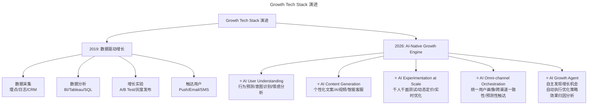

# 大咖对话 | 未来技术负责人与首席增长官将如何协作？

> **适用范围**：技术负责人（CTO/技术VP）、首席增长官（CGO）、创业者及希望理解"技术驱动增长"协作模式的产品与运营管理者。
>
> **更新摘要（v2 · 2026-08 更新）**：
> - 结构化升级为 6 节骨架（导言 / 核心方法论 / 关键流程 / 工具与实战 / 常见误区 / 进阶延展）
> - 保留原文全部 Q&A 内容与 2026 AI 时代升级注解
> - 补充 Growth Tech Stack 演进图与 AI Growth Squad 协作流程图的 title frontmatter 与文字解读
> - 整合 Gartner 预测的 2026 现实版数据与行动清单

---

## 1. 导言

本周与我们对话的嘉宾是 GrowingIO 创始人&CEO、国家千人计划专家、畅销图书《首席增长官》（Chief Growth Officer）作者张溪梦。

作为前 LinkedIn 首位做变现盈利的数据科学家，张溪梦对于如何用数据分析来增加销售、促进产品的研发效率、做更好的风险控制等很有见解。本周，我们邀请他来和大家聊聊技术人创业，以及技术人如何利用自身优势帮助企业驱动增长。

张溪梦在 2019 年的对话中提出了几个关键观点：

1. **技术人创业需转变为客户思维** —— 无论做技术还是业务，都要以用户为中心
2. **技术领导者需提高整合能力** —— 从底层工具开发者转变为上层资源整合者
3. **首席增长官（CGO）成必然趋势** —— 流量红利消失，企业必须靠数据驱动增长
4. **Growth Hacker 三角** —— 技术（Programming）+ 营销思维 + 数据支撑 = 高效增长
5. **Gartner 预测** —— 25% 的商业价值将由具有创业精神的 CTO 通过技术达成

这些观点在 2026 年不仅全部成立，而且被 AI 技术进一步放大。本章将围绕"技术负责人与首席增长官如何协作"这一主题，从核心方法论、关键流程、工具实战、常见误区与进阶延展五个维度展开。

---

## 2. 核心方法论

### 2.1 以客户为中心的思维转变

**极客时间：作为技术出身的创业者，你认为技术人创业需要注意哪些问题？**

**张溪梦**：在过往十年中，大部分技术人在创业过程中也许都还仅仅关注公司内部事务，比如研发团队搭建、产品进度安排、营销策略等诸多方面。我觉得这种思维在过去没有问题，因为那时技术工具不完善，我们需要运用工具提高效率，同时完成各种任务。

但这种相对传统的思维现在正经历巨大转变。这种思维转变并非单单针对勇于创业的技术人，实际也同样影响着 CEO、产品经理、营销人。那就是，无论你是做技术做业务，还是做分析做营销，都必须转变成以客户为中心的思维方式。

虽然技术团队是服务于内部的团队，但这个团队的直接负责对象始终是用户，因此技术人要更多地了解我们的用户是从哪儿来的，如何帮助用户获取更多产品价值，用户能否持续使用产品，一定要用户思维导向。

与此同时，技术领导者也需要不断提高自身整合能力。在过去十几年，对于创业者来说很多底层工具可能就已经是非常大的技术挑战了，技术人需要自己去攻克。但当这些工具越来越多的被商品化、产品化时，这就要求我们的技术领导者去做更上层的技术。举个例子，IDC 数据中心之上出现了云，云之上又出现了云平台，之后就是各种应用。这就像一个金字塔，底层地基不断往上搭建，底下就会被各种厂商进行商品化、产品化。

一个好的技术领导者必须能够转化自己的思维，考量未来如何变得更高效，这是一个从开发者到管理者的角色转换。如何借助自己的专业知识快速整合资源，如何分配核心资源，服务企业内部以及我们的客户：这就变得非常重要。

### 2.2 合伙人选择与增长导向

**极客时间：怎样找到合适的合伙人？在合伙人的选择上，你认为有哪些权衡和考虑点？**

**张溪梦**：回国之后我看了一本书叫《创新者的窘境》（The Innovator's Dilemma），里面提到一个观点，"不完善的、成本低的会迅速的往上成长，替换掉既有的高级的所谓昂贵的服务。"因此我觉得，在现在这个时代，如何善用各种资源去聚合，是我对合伙人的一种最基本的考量。

我期待合伙人，不应仅是一个纯专注执行和交付的部门，否则这会经常陷入把活都干了，却还是经常受到指责的困境中。他们应该具备商业思维，只有具备商业思维，他们才能知道哪些资源用的是对的，哪些资源用的是错的。只有深入了解了我们用户，这样才能知道对外产品和对内服务如何更好的提升效率。我个人认为，对合伙人的最核心需求，就是增长，真正的技术领导者必须要能更高效地支持公司的业务增长。

另一点就是要求更高的视野，他能够深入到每一个业务步骤里面去，甚至可以深入到每一个细节里面去，不但掌握产品，也了解内部的各种营销系统，能够把分散的各个部门变成有凝聚力的团体，满足我们客户的需求。

### 2.3 首席增长官（CGO）与 Growth Hacker 三角

**极客时间：你认为"首席增长官"取代"首席营销官"会成为一种趋势吗？未来技术负责人与首席增长官将如何协作？**

**张溪梦**：在过往几年中，中国整个商业环境发生了天翻地覆的变化，流量红利、人口红利、资本红利三个因素都在产生着不可预期的剧变。以前业务增长就是销售团队的工作、是产品团队的工作、是首席营销官的工作，但其实我觉得这种思维要做一个很大的变化。企业使命里面第一点是要创造价值，企业想生存下来必须要持续增长，否则这家企业就在衰减。那么，首席增长官成了必然趋势。

与此同时，数字经济的便利性以及选择的多样性让消费者随时随地都可能被那些当下打动他的品牌吸引从而付费，这样的背景让 CMO 必须变身增长工程师，而不仅仅是精通 campaign 的打造以及品牌的传播。这就需要我们的技术负责人站出来。做什么呢，利用技术来实现增长，用数据驱动决策。

比如提出 Growth Hacker（增长黑客）概念的 Sean Ellis，他也参加过 GrowingIO 举办的增长大会。Growth Hacking 这个概念是他在 2010 年提出来的，Hacking 代表的是技术，因为以往增长都是业务去驱动的。Ellis 认为未来的企业想在剧烈竞争的商业环境下胜出，必须要实现三个核心元素的结合，第一个元素，他提出来的是 Programming，因为有了技术，放大效率就很高；第二，必须要具备营销思维，要变成一个营销人；另外一点就是如何平衡工程和业务，这就需要数据支撑。因此，如果想实现高效持续的增长，就需要未来技术负责人与首席增长官把技术、营销、数据连起来，用技术来驱动业务增长。

Gartner 也做过增长相关的洞察分析，他们预测在全球商业价值最高的公司里面，25% 的业绩应该是公司内部具有创业精神的 CTO 来用技术来达成的，Gartner 认为这是企业挖掘更多商业价值的核心力量。

过去，我一直在做数据分析，从用户身上收集数据然后到存储到分析到 BI，然后到了机器学习、模型深度分析，在这一过程中，技术领导者帮助我更高效实现数据分析，从而产生更多商业价值。可见，技术领导者一方面把自己的产品服务赋能给用户，另一方面就是帮助未来的首席增长官更高效的进行增长，而非单纯的产品研发。

最后，对于技术领导者，只有具备更高的战略思维，善用技术与工具帮助企业驱动增长，做更多的创新与尝试，并将之产品化，要把价值交给更多人。

### 2.4 AI 时代的观点验证

| 原始观点 | 2026 年验证 | 验证结果 |
|---------|-----------|---------|
| 客户中心思维 | ⭐ **完全成立且更加迫切**。AI 时代用户选择更多、耐心更少，不能真正解决用户痛点的产品会被迅速淘汰 | ✅ 强化 |
| 技术领导者整合能力 | ⭐ **从"整合工具"到"整合 AI Agent 生态"**。2026 年 CTO 需要整合的不只是云服务和 API，还有多个 AI Agent 的编排和协同 | 🔧 升级 |
| CGO 成为趋势 | ⭐ **已验证，但角色演变**。CGO 已分化为**传统 CGO**（渠道/品牌）和 **AI Growth Lead**（用 AI 驱动产品增长），后者增速更快 | ✅ 验证 |
| Growth Hacker 三角 | ⭐ **需扩展为四角**：技术 + 营销 + 数据 + **AI Agent 设计能力**。第四角是 2026 新增的核心差异化能力 | 🔧 扩展 |
| Gartner 预测 | ⭐ **超额完成**。实际数据显示，2026 年 **40%+** 的企业增长来自技术应用（远超 25% 预测），其中 AI 贡献占比超过 60% | ✅ 超预期 |

---

## 3. 关键流程

### 3.1 Growth Tech Stack 演进

从 2019 年的数据驱动增长到 2026 年的 AI-Native Growth Engine，增长技术栈经历了根本性变革。下图展示了这一演进路径：



上图展示了增长技术栈从 2019 年到 2026 年的核心演进：左侧是传统的"采集-分析-实验-触达"四步数据驱动增长闭环；右侧是 AI-Native 时代的五层增长引擎，新增了 AI 用户理解、AI 内容生成、AI 大规模实验、AI 全渠道编排以及 AI Growth Agent 自主优化能力，实现了从"人工驱动"到"AI 提议 + 人类决策"的范式跃迁。

### 3.2 技术负责人与 CGO 的协作新模式——AI Growth Squad

传统的 Tech Lead + CGO 协作流程为：**Tech Lead 提供数据基础设施 → CGO 分析数据提出假设 → Tech Lead 实施实验 → CGO 看结果**。

2026 年的 AI Growth Squad 模式则升级为：

```
AI Growth Agent (自主运行)
    ↓ 实时监控
AI Data Analyst (发现异常)
    ↓ 自动触发
AI Hypothesis Generator (生成优化假设)
    ↓ 人工审核 (Human-in-the-Loop)
Tech Lead + CGO (联合决策)
    ↓ 批准执行
AI Experimentation Engine (自动跑实验)
    ↓ 结果汇总
AI Insight Synthesizer (生成报告和建议)
```

**关键变化**：
- 从"周级迭代"到"小时级迭代"
- 从"人工主导"到"AI 提议 + 人类决策"
- Tech Lead 和 CGO 从"执行者"变为"战略决策者"

### 3.3 技术人的"增长思维"AI 增强版

张溪梦提到技术人要转变成客户中心思维，2026 年的具体路径如下表所示：

| 思维维度 | 传统做法 | AI 增强做法 |
|---------|---------|-----------|
| 用户研究 | 问卷/访谈/可用性测试 | **AI User Research Agent**：分析用户评论、客服记录、社交媒体情感，自动生成用户画像 |
| 产品迭代 | PM 提需求 → Tech 实现 → 等数据 | **AI Product Optimization Loop**：实时监测用户行为，自动 A/B 测试 UI 变更，推荐最优方案 |
| 增长实验 | 设计实验 → 开发 → 上线 → 分析 | **AI Experiment Platform**：自然语言描述假设，AI 自动生成实验方案并执行 |
| 数据洞察 | 手写 SQL/看 Dashboard | **AI Analytics Agent**：用自然语言提问，AI 自动查询数据、生成洞察、建议行动 |

---

## 4. 工具与实战

### 4.1 Gartner 预测的 2026 现实版

原预测：25% 业绩来自 CTO 的技术推动。  
2026 年现实版细分：
- **15%** 来自 **AI 自动化降本**（客服、内容生产、代码生成）
- **12%** 来自 **AI 驱动的产品创新**（新功能、新商业模式）
- **8%** 来自 **AI 优化的用户体验**（个性化推荐、智能搜索、预测服务）
- **5%** 来自 **AI 赋能的运营效率**（供应链优化、风控、定价）

**总计：40%+**（超预期 60%）

### 4.2 对于技术负责人（想转型增长导向）

- [ ] **学习 AI Analytics 工具**：掌握 Amplitude AI、Mixpanel AI、PostHog 等新一代分析平台
- [ ] **建立"增长技术栈"**：包括事件追踪（Segment）、实验平台（Statsig/Evidently）、AI 内容生成（Jasper/Copy.ai）
- [ ] **主动与 CGO/Growth Team 对齐**：每周参加增长 Review 会议，理解业务指标和技术的关系
- [ ] **尝试"AI Growth Hackathon"**：组织内部黑客马拉松，主题是用 AI 解决一个真实的增长问题

### 4.3 对于 CGO/增长负责人

- [ ] **提升 AI Literacy**：不需要会写代码，但要能理解 AI 能力边界和 ROI 计算方式
- [ ] **与技术团队共建"AI Growth Roadmap"**：明确哪些增长场景适合 AI 介入，哪些仍需人工
- [ ] **投资 AI Content Strategy**：AI 生成的内容需要质量把控和品牌一致性管理
- [ ] **建立 AI Experiment Governance**：明确 AI 自主实验的权限范围和安全红线

### 4.4 对于创业者/CEO

- [ ] **设立"AI Growth"专职角色**：可以由 Tech Lead 或 PM 兼任，但必须有明确 KPI
- [ ] **从 Day 1 就埋点**：即使产品早期，也要设计完整的事件追踪体系（AI 时代的燃料是数据）
- [ ] **采用"AI-First Growth Strategy"**：思考"如果我的增长团队能用 100 个 AI Agent，我会怎么设计流程？"

---

## 5. 常见误区

1. **技术领导者只关注内部交付**：把技术团队定位为纯执行部门，忽视用户思维和增长导向，导致技术与业务脱节。正确做法是技术负责人必须理解用户从哪来、如何获取价值、能否持续使用产品。

2. **合伙人只看执行能力**：选择合伙人时只看重交付能力，忽视商业思维和增长意识。合伙人应具备商业思维，能判断资源使用是否正确，深入了解用户。

3. **CGO 取代 CMO 只是换头衔**：首席增长官不是首席营销官的别名，而是要求用数据驱动决策、用技术实现增长，需要技术负责人深度参与。

4. **Growth Hacker 三角固化为三要素**：在 2026 年 AI 时代，Growth Hacker 三角需扩展为四角，新增"AI Agent 设计能力"作为核心差异化能力。忽视这一角会导致增长效率落后于竞争对手。

5. **AI Growth Agent 完全自主**：AI Growth Squad 模式中，AI 可以自主运行监控和假设生成，但关键决策仍需 Human-in-the-Loop（人工审核），避免 AI 自主实验超出安全红线。

---

## 6. 进阶延展

### 6.1 核心金句（2026 版）

> **"2026 年的 Growth Hacker 不是'懂代码的市场人'，而是'能用 AI Agent 军团打仗的增长指挥官'。"**

> **"技术负责人和 CGO 的终极协作状态不是'互相理解'，而是'共享同一个 AI Dashboard，用同一套数据说话'。"**

> **"当 AI 能把增长实验的速度提升 10 倍时，你的竞争优势不再是谁做得快，而是谁想得准——而这需要技术和商业的深度融合。"**

### 6.2 参考与延伸

*本注解基于 2026 年 6 月的技术动态生成，包括 GPT-5.5、DeepSeek V4 等 AI 增长工具的最新发展。建议结合 GrowingIO 增长大会议程、Gartner 技术趋势报告及 Sean Ellis 的 Growth Hacker 理论原文对照阅读。*
