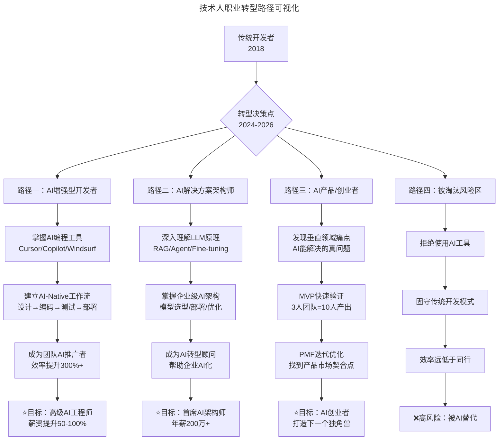
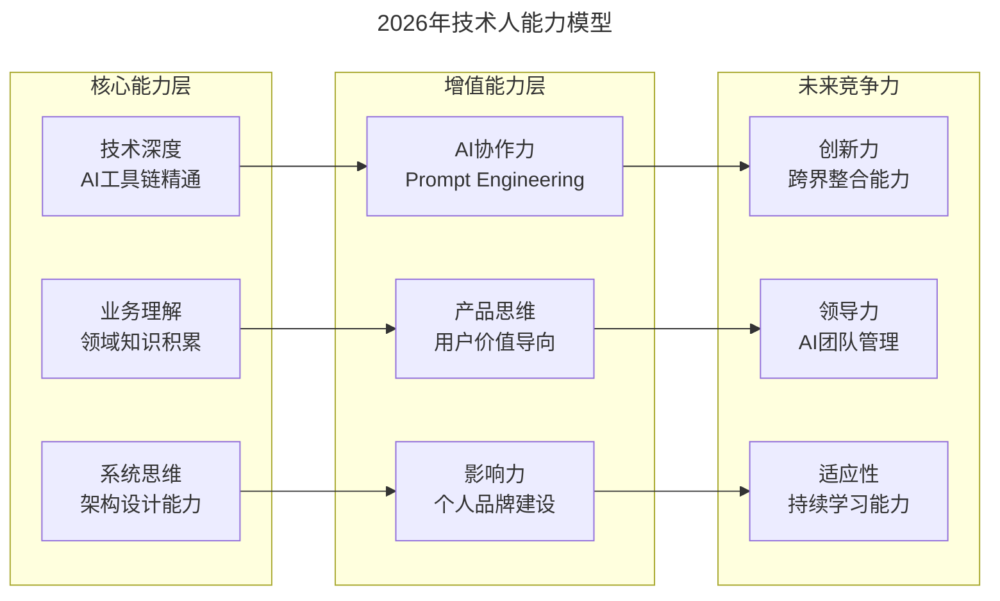

# 大咖对话 | 李智慧：技术人如何应对"互联网寒冬"

> **适用范围**：技术工程师、架构师、技术管理者，以及面临职业转型或行业周期波动时寻求方向的技术从业者。
>
> **更新摘要（v2 · 2026-08 更新）**：
> - 结构化升级为 6 节骨架（导言 / 核心方法论 / 关键流程 / 工具与实战 / 常见误区 / 进阶延展）
> - 保留原文全部 Q&A 内容与 2026 AI 时代升级注解
> - 为技术人职业转型路径可视化图、2026 年技术人能力模型图补充 title frontmatter 与文字解读
> - 整合行动清单、避坑指南与能力模型到对应章节

---

## 1. 导言

本周大咖对话的嘉宾是同程艺龙交通首席架构师、极客时间《从 0 开始学大数据》专栏作者李智慧，曾担任阿里巴巴技术专家、Intel 亚太研发中心架构师、宅米和 WiFi 万能钥匙 CTO，长期从事大数据、大型网站架构的研发工作。今天，他主要与大家分享了技术人如何成长，以及"互联网寒冬"下技术人发展与转型的选择等话题。

李智慧老师在 2018 年的对话中提出了几个关键观点：

1. **寒冬是机会而非威胁** —— 优秀的人在寒冬中反而能获得更好的发展机会
2. **要做生产者而不是消费者** —— 一定要有输出和产出，不能只是被动学习
3. **要对自己负责** —— 只有知道自己想要什么，才能为公司创造价值
4. **主动转型而非被动转型** —— 要看时代潮流，从正向去转型
5. **把握住机会** —— 当机会出现时要有勇气去把握

在 2026 年，这些观点不仅依然成立，而且内涵发生了根本性变化——真正的寒冬不是互联网行业的寒冬，而是传统开发模式的寒冬。

---

## 2. 核心方法论

### 2.1 把握机会：从开发到架构的跃迁

**极客时间：在您的成长过程中，印象最深刻的一件事是什么？**

**李智慧**：在我的职业生涯里面，比较重要的一次机会是在 2006 年获得的，也就是十几年前。那时我在方正参与当时一个最热的项目，算是当时中国最大的软件外包项目，方正特别成立了一个部门去做这个项目。

因为项目比较大并且比较新，部门也刚刚成立，最开始大概只有三五个人在做，但我们在中关村这边包了一层楼，规划是要把人坐满的。由于这是对日的项目，公司里面技术不错的都会派到日本去跟客户对接事情，其余的留在国内。在项目启动后，日本客户找了一家咨询公司给出了前端、中间服务器、后端的技术方案，大概三层的布局。有了架构，客户的需求也过来了，之后就是要考虑怎么把这个架构方案落地。那时我们每天在查资料、学习，但怎么去做、怎么把项目落地，一直没人去说。

有一天我可能是比较着急，就去跟项目经理说："这些技术方案，它最终还要落实成代码的。这个代码谁来写？框架间通讯谁来做？这件事情应该怎么推？"没想到过了几天项目经理找到我说"要不你来做吧"。当时我研究生刚刚毕业，经验也不是很多，但我很快就答应了下来。

项目经理是周五找到我的，到周日晚上的时候，我就做出了一个基本的设计，把整个流程和开发视图画了出来。经过评审后，大家都说看起来似乎还不错，然后就开始按照这个架构进行设计开发。之后部门里面其他同事也参与到了整个框架和架构设计的开发中来，后来测试跑通以后，整个框架就算是出来了。之后项目按照原计划运转起来，上百个工程师都逐步招入进来，很快就把一整层楼坐满了。

因为开发业务代码的时候必须要遵照开发流程和框架去做，而这个流程设计和框架是我带人做的，所以后面不管是测试还是异常处理，都要过来找我。把这个项目做完以后，我的心态也不再是刚毕业那样了。上百号人做技术决策的时候，都过来找你，这个时候你会有一种责任感，或者是有一种新的视角，这种视角跟以前在别人的框架约束下做开发是完全不一样的。

这段经历，一方面让我从做开发到做架构，获得了新技能，做开发是在别人画的框里面去做你的业务，而架构是你站在全局的视角去思考问题。另一方面，是让我从另一个视角去观察和思考问题，很多关注的点和思考的点都是不一样的，比如看待一个新技术，我会考虑背后的设计和优缺点，以及为我所用时我要关注什么等等。这种视野给我带来的帮助非常大。

当时这件事对我来说是一个机会，迈过这个坎，也就把握住了这个机会。成长的过程中，一定会有一些机会出现在你面前，有的看起来比较随机，就像我刚才讲的机会突然就出现在面前，如果当时我犹豫一点或者对自己不自信，放过这个机会，人生可能就不一样了。所以当机会出现在你面前的时候，要有勇气把握这个机会。

### 2.2 做生产者而不是消费者

**极客时间：在您看来，技术人怎样才能更好的成长？**

**李智慧**：技术人大都很忙碌，每天都在忙忙碌碌地上班下班或者加班，然后我就在想自己每天的工作到底在干什么。后来我总结了一下，做事情的时候可以分成两种角色：生产者和消费者。

学习本身其实是一种消费，每天忙着去读书，看起来是在学习，但是学完以后你的生活和工作因此改变了吗？或者说有产出和输出吗？如果没有，每天的日子还是老样子，工作和生活也没有改变，这样的学习和玩一会手机、看一会抖音在本质上并没有太大的区别。所以一定要输出一些东西，比如你在公司里面做一个项目或者做一个产品，当然也可以写一本书，或者是在极客时间开一个专栏，总之就是你一定要有产出，让自己成为生产者而不仅仅是单纯的消费者。

你要能够输出让别人消费的东西，这样你就会有成长，会变得不一样。我做事情的时候，总会想我到底是在做什么，是生产还是消费，是输出还是接收。如果我是在生产，大家是不是愿意去消费我生产的东西。比如在公司，我不仅仅是研究新的架构、框架和技术，我还希望自己能从头把它做出来。我希望其他人能够用我做出来的东西，希望自己在工作中是有产出的，这样我会更踏实一点，并且有产出，就会很有收获，也能很快的进步。

**AI 时代验证**：在 2026 年，如果你只是在使用 AI 工具（消费），而没有用 AI 创造出独特的价值（生产），你依然会被淘汰。区别在于：
- ❌ **AI 时代的消费者**：只会用 AI 写代码，没有自己的思考和判断
- ✅ **AI 时代的生产者**：用 AI 放大自己的创造力，解决复杂问题，创造独特价值

### 2.3 要对自己负责

**极客时间：很多人都觉得 90 后员工比较自我，很难管，您是怎么看待的呢？**

**李智慧**：网上关于 90 后会有些言辞，觉得 90 后太自我，考虑别人太少，但我自己是很欣赏 90 后的。我的态度是，一个人如果不知道自己想要什么，那么也不会给别人想要的东西，这在公司里来说是不负责任的。你只有知道自己想要什么，对自己负责，才可能为公司创造真正有价值的东西。

我想说的是，你要做自己的主人，要对自己负责。举个反例，我小的时候一直都是比较乖宝宝类型的，小时候听父母的，上学听老师的，工作听领导的。突然有一天，就是一瞬间惊醒：我这么听你们的，你们会对我负责吗，父母会养我一辈子吗，老师能保证我的将来吗，领导会让我在公司干一辈子吗？你如果不能对我负责，我都听你的有什么用。谁能对我负责？只有自己对自己负责。

你要知道自己想要的是什么，你去付出你该付出的，然后得到你该得到的。比如去学习、去努力、去提高自己。如果你付出了以后，依然得不到，那就去寻找新的机会。

你对自己负责，就是对公司负责，我一直以来都是这个观点。如果天天老板让做什么就做什么，等到最后事情没做好，就会觉得反正是老板让做的、反正是领导让做的，最后大家互相抱怨，根本没有意义。如果你觉得这件事情不该做、没有意义，那就跟他说不要做，这件事情没有意义的，我们有更好的办法。如果你真的有这样的想法，有这样的能力和实力，那就说出来，肯定会得到别人的认可的。这样对自己负责任，在公司也有主人翁的意识。

### 2.4 主动转型而非被动转型

**极客时间：很多人都认为现在是互联网寒冬，比较有危机感，您是怎么看的？**

**李智慧**：我加入阿里巴巴的那一年也赶上金融危机，我面试的时候问了一下，大家都在裁人，为什么阿里巴巴还在招人。当时的 HR 跟我说这是马总的判断，马总认为越是到了寒冬的时候，越要吸引优秀的人才进来，为了冬天过去以后，可以做好储备和积淀。我对马云还是比较佩服的，而且这个道理也很浅显，冬天一定会过去的，日子一定会好的。如果你在冬天的时候冻得瑟瑟发抖，那等冬天过去以后，你肯定还是那个老样子。

在我看来，如果你觉得自己是努力的、优秀的、聪明的、愿意奋斗的那种人，那么寒冬对你来讲就是一次机会，因为未来一定会变好的。而如果你觉得寒冬淘汰的是你的话，那你肯定是会被淘汰的，寒冬就是淘汰掉那些投机的、不努力的、没有什么真本领却虚张声势的人。这其实是你的机会啊，把那些人淘汰掉，这个世界是留给你的，等到冬天过去，当一切变好的时候，这些最好的东西都是留给你的。

另外想聊一下转型这件事，寒冬是你的机会，但寒冬不是你转型的理由，转型是一件时刻都在发生的事情，最主要的还是要去思考，哪些领域和技术是未来的潮流。

我在 Intel 做大数据的时候，我们组里面有几个从 Intel 其他部门转岗过来的同学，之前是做 Linux 内核开发的，当时我觉得这个世界上写代码、做开发，最顶尖的可能就是开发操作系统了，而操作系统的内核开发，更是顶尖中的顶尖。我问他你之前做的是所有程序员梦想的工作，为什么要跑过来做大数据开发呢？

他的回答是，Linux 已经非常成熟和稳定了，变化已经非常小了，他做了 3 年的进程调度和内核算法，向 Linux 社区提交了一行代码，还被拒绝了。这对他来讲是非常痛苦的，也不是一个好的兆头。那么未来在哪里呢？当时最火爆的是大数据，他们就转岗做大数据了。后来其中一个同学去一家专门做大数据的创业公司当 VP，另一位同学在一家快要上市的公司做大数据平台总监。

我在极客时间上的专栏是关于大数据的，大家也可以关注一下大数据方面的潮流。如果你觉得这是潮流，这是未来发展的方向，是机会，你就去做。不用把它看得有多大有多艰难，别人能做到的，你要相信自己也能做得到。

关于转型，我的另一个建议是不要被动转型。我还有一个做开发的同学，因为在意老板比自己年轻这件事，跳了几次槽，结果都不是很好。他以前也是非常资深的工程师，跳了几次槽之后，从开发转做咨询，也算是转型。他也抱怨说，这次转型真的是太失败了，实际上他转型的目标和理由，是要离开比他年轻的老板，这种转型是被动的，也不是很好的理由。

但是人总是有出路的，后来这个同学不做 IT 了，出去开了一家鸭脖店，现在是整个上海地区周黑鸭最大的代理商，名下有将近 30 家的店铺，很让人吃惊。他这个转型转得更大，但肯定是痛定思痛想明白了，来了一次大的转型，反而很成功。

所以，这个世界变化很快，转型真的是无处不在的。人们都在顺应这个时代在发展，你要主动做好这种转型的准备，而不是说因为寒冬，或者其他什么理由去转型。你要去看时代的潮流，从正向去转型，把握住方向，而不是走投无路才去转型。当然走投无路再去转，也是一种转，但是肯定是提前做好准备，并且自己思考清楚会更好。

---

## 3. 关键流程

### 3.1 寒冬的新含义：传统开发模式的黄昏

2026 年的"寒冬"定义已经改变。2018 年的"互联网寒冬"指的是互联网行业增速放缓、裁员潮、融资困难。但到了 2026 年，**真正的寒冬不是互联网行业的寒冬，而是传统开发模式的寒冬**。

根据 2026 年最新数据：
- ⭐ **84% 的开发者已经在使用 AI 辅助编程**（GitHub Copilot、Cursor、Windsurf 等）
- GPT-5.5 的代码生成能力已经达到中级工程师水平
- DeepSeek V4 将推理成本降低了 700 倍，使得 AI 应用门槛大幅下降
- 传统"纯手写代码"的开发模式正在被快速淘汰

**被淘汰的不是技术人，而是：**
- 只会机械性编码的"代码工人"
- 不愿意学习新工具的"经验主义者"
- 缺乏问题定义能力的"需求执行者"

**在 AI 时代更有价值的技术人：**
- 能够用 AI 快速验证想法的**产品思维工程师**
- 懂业务场景、能设计 AI 解决方案的**领域专家**
- 能够管理和调优 AI 系统的**AI 架构师**
- 具备跨领域能力的**全栈 AI 工程师**

### 3.2 从"写代码的人"到"用 AI 放大创造力的人"

李智慧老师强调"要做生产者"，在 2026 年这意味着：

| 传统开发者（2018） | AI-Native 开发者（2026） |
|---|---|
| 花 80% 时间写代码 | 花 20% 时间写代码，80% 时间思考 |
| 一个人完成所有工作 | 用 AI 团队（多个 Agent 协作）完成 |
| 学习框架和语法 | 学习如何与 AI 协作、提示词工程 |
| 追求代码量 | 追求影响力和价值 |
| 被动接收需求 | 主动发现和定义问题 |

### 3.3 技术人职业转型路径可视化

上图展示了 2024-2026 年技术人面临的四条转型路径。前三条路径（AI 增强型开发者、AI 解决方案架构师、AI 产品/创业者）代表了正向转型的三个层次，分别对应"工具使用者"、"系统设计者"和"价值创造者"；第四条路径则警示了拒绝 AI 工具、固守传统模式的淘汰风险。关键在于：转型决策点是主动的，越早选择正向路径，越能在 AI 时代建立竞争壁垒。

---

## 4. 工具与实战

### 4.1 新的机会窗口（2026 年独家分析）

**机会一：AI 应用层创业**

2026 年是 Agent 加速落地期，以下赛道机会巨大：
- 🎯 垂直领域智能 Agent（法律、医疗、教育、金融）
- 🎯 企业级 AI 工作流自动化
- 🎯 AI+传统行业数字化转型咨询
- 🎯 AI 工具链和开发平台

**机会二：AI 基础设施和服务**

- 🎯 AI 模型微调和优化服务
- 🎯 企业私有化部署方案
- 🎯 AI 数据治理和合规服务
- 🎯 AI 安全和对抗攻防

**机会三：人机协作新模式**

- 🎯 AI 培训和教育
- 🎯 提示词工程和 AI 交互设计
- 🎯 人机协同的组织变革咨询
- 🎯 AI 时代的领导力发展

### 4.2 立即行动清单

#### 阶段一：生存适应期（1-3 个月）
1. **掌握 AI 编程工具**（必做）
   - 安装并熟练使用 Cursor / Windsurf / GitHub Copilot
   - 学会提示词工程基础（Chain-of-Thought、Few-shot 等）
   - 每天至少用 AI 辅助完成 50% 以上的编码工作

2. **建立 AI-Native 工作流**
   - 用 AI 进行技术方案设计和技术选型
   - 用 AI 进行代码审查和测试
   - 用 AI 进行文档编写和知识管理

#### 阶段二：能力提升期（3-6 个月）
1. **深化 AI 能力**
   - 学习 RAG（检索增强生成）原理和实践
   - 了解 Agent 设计和 Multi-Agent 协作模式
   - 掌握至少一个 AI 框架（LangChain、LlamaIndex 等）

2. **培养差异化能力**
   - 选择一个垂直领域深耕（如电商、金融、医疗）
   - 成为该领域的"AI+业务"专家
   - 建立个人品牌和技术影响力

#### 阶段三：价值创造期（6-12 个月）
1. **成为 AI-Native 领导者**
   - 在团队中推动 AI 工具的普及和使用
   - 设计和实施 AI 驱动的研发流程改进
   - 培养和指导团队成员的 AI 技能

2. **探索新的可能性**
   - 尝试 AI 相关的副业或创业项目
   - 参与开源社区和技术社区建设
   - 持续关注 AI 前沿动态和技术趋势

### 4.3 2026 年技术人能力模型

上图展示了 2026 年技术人的三层能力模型：底层是核心能力（技术深度、业务理解、系统思维），中层是增值能力（AI 协作力、产品思维、影响力），顶层是未来竞争力（创新力、领导力、适应性）。三层能力逐级递进，核心能力是基础，增值能力是差异化，未来竞争力决定上限。在 AI 时代，AI 协作力（Prompt Engineering）已成为连接技术深度与跨界创新的关键桥梁。

---

## 5. 常见误区

1. **不要只学不用** —— 工具必须在实践中掌握。学习 AI 工具不能停留在"看教程"阶段，必须在实际项目中使用。

2. **不要盲目追新技术** —— 先打好基础再拓展。AI 领域更新极快，但底层原理（如 Transformer 架构、RAG 原理）相对稳定，应优先掌握。

3. **不要忽视软技能** —— 沟通、协作、领导力更重要了。AI 时代技术门槛降低，人与人之间的协作和沟通能力反而成为差异化优势。

4. **不要单打独斗** —— 建立 AI 学习社群，共同进步。一个人学 AI 容易走进误区，社群可以提供反馈和多元视角。

5. **不要焦虑但也不躺平** —— 行动是治愈焦虑的良药。面对 AI 带来的不确定性，持续行动比焦虑思考更有效。

6. **不要被动转型** —— 转型不是因为走投无路才转，而是要看时代潮流从正向去转型。被动转型往往目标不清晰，容易失败。

---

## 6. 进阶延展

### 6.1 写在最后

李智慧老师说："**冬天一定会过去的，日子一定会好的。**"

这句话在 2026 年依然适用，但需要加上一个注脚：

> **冬天过去后，春天不属于所有人——它属于那些在冬天里进化了自己的人。**

2026 年的技术人，面临的是人类历史上最大的技术革命之一。这不是危言耸听，这是事实。但这也是最大的机会窗口。

**选择权在你手中：**
- 是成为被 AI 替代的对象？
- 还是成为驾驭 AI、创造价值的超级个体？

答案取决于你今天的行动。

### 6.2 参考与延伸

*本注解基于 2026 年 6 月的技术动态生成，包括 GPT-5.5、DeepSeek V4、84% 开发者使用 AI 编程等最新数据。建议每季度更新一次。结合李智慧老师《从 0 开始学大数据》专栏及 AI Agent 生态报告对照阅读。*
