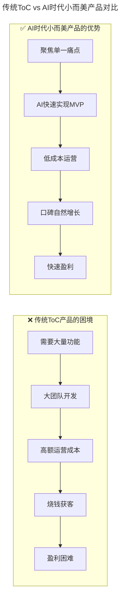
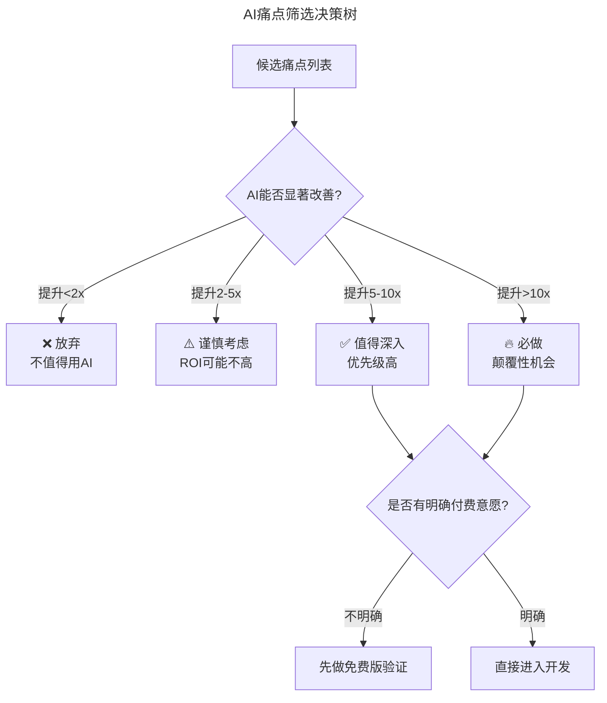
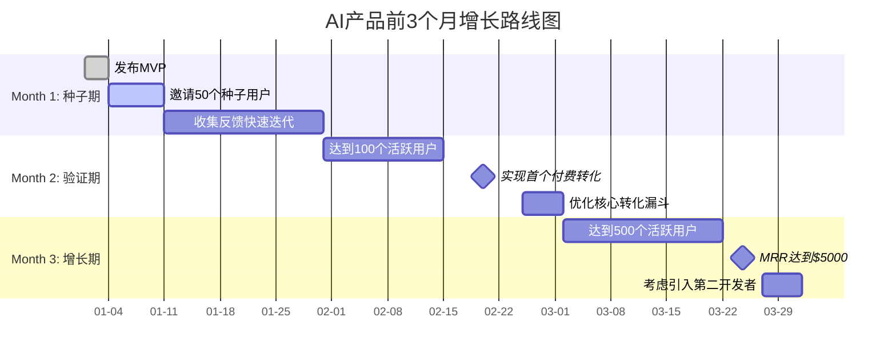
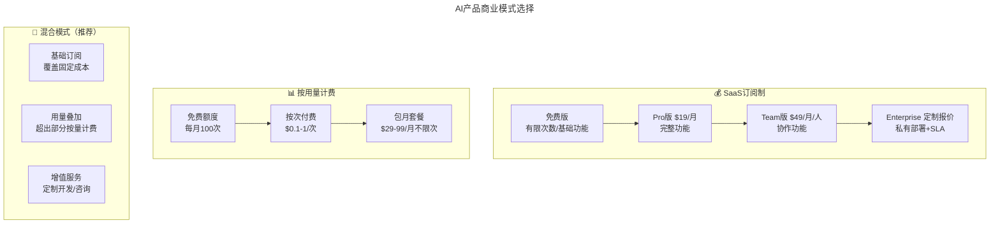

# 大咖对话 | 池建强：做产品不要执着于打造爆款

> **适用范围**：技术创业者、产品经理、技术管理者，以及希望从技术转向产品或创业的工程师。
>
> **更新摘要（v2 · 2026-08 更新）**：
> - 结构化升级为 6 节骨架（导言 / 核心方法论 / 关键流程 / 工具与实战 / 常见误区 / 进阶延展）
> - 保留原文全部 Q&A 内容与 2026 AI 时代升级注解
> - 为 AI 产品市场契合度评估框架、AI 痛点筛选决策树、增长路线图、商业模式选择图等补充 title frontmatter 与文字解读
> - 整合避坑指南、成功公式到对应章节

---

## 1. 导言

本周作客"大咖对话"的嘉宾是池建强，现任极客邦科技总裁，从零开始打造了 IT 类知识服务产品极客时间。加入极客邦前，曾服务于洪恩软件、用友集团和锤子科技等公司。

池建强老师在 2018 年的对话中分享了关于产品创业的深刻洞察：

1. **不要执着于打造爆款** —— 爆款是结果而非目标，大部分产品是一点一点长起来的
2. **成功产品有其增长曲线** —— 发布→增长→下降→稳定→迭代→找到拐点
3. **计划赶不上变化，但计划的过程必要** —— 计划是指南针，不是枷锁
4. **不要有侥幸心理** —— 遇到问题要找到根本原因
5. **技术人要具备产品思维** —— 理解用户需求比炫技更重要

在 2026 年，这些观点完全成立，但"爆款逻辑"发生了根本性变化——AI 时代的爆款路径从"功能堆砌+营销推广"转向"痛点洞察+AI 驱动的体验革命"。

---

## 2. 核心方法论

### 2.1 技术人创业容易踩的坑

**极客时间：根据您的观察，技术人创业容易踩哪些坑？**

**池建强**：技术人创业其实就是跳出技术的圈子，从另一个维度，比如产品、商业模式上去寻找更多的可能性，这个过程同样充满挑战和乐趣，创业的时候要专注在这个过程上，而不是技术领域。在不同的阶段使用合适的技术解决相关场景的业务需求，创业者需要的不是炫技，而是提供能够为业务服务的技术。

人们常说，一件商品最重要的是质量，但是提高产品质量最关键的是精准的把握用户需求的本质。否则，无论产品质量多好，功能多么丰富，如果不是用户需要的，那么这个产品就是不成功的，是某种程度的自嗨。技术也是同样的道理。

另外，在领域的选择上，技术人容易根据自己之前的经验选一些看起来是降维打击的创业方向，也容易掉进自己的思维陷阱。

很多朋友做烦了 toC（面向普通消费者）的产品，认为 toB（面向企业）是个大市场，一头扎进去也会发现很难，不仅仅是客户难伺候，个性化和通用软件也会不停的打架。规模化还是 Case by Case，都是艰难的选择。

有些人则烦透了企业客户，开始做 toC 的创业，也难，因为 toC 的产品做出来容易，用户认可和规模化则是个大难题。数据增长和日活是很多 toC 产品迈不过去的坎，转化和收入也更是让人焦虑不已。

有些人适合做 toC 的产品，有些人适合 toB，这个需要每个创业者自己去探索和选择。我自己喜欢做个人消费者的产品，更有意思，更挑战，也更平民化。

有朋友问我，哪个更容易哪个更难呢？天下没有容易的事，都难。重要的是你的选择和坚持。

另外，创业和在大公司打工不同。大公司资源丰富，你做到总监级别，很多琐事是不需要关注的，公司作为平台会提供你想要的各种资源，你只需要专注于某个领域进行突破就好了。有时候这种平台之上的成功容易造成一种错觉：原来我真的很牛！

其实并不是这样，平台隐形的力量不可忽视。一旦开始创业，财务、行政、市场、运营方方面面的事情都需要创业者去操心，可谓事无巨细，也许员工的座椅都需要你决定用哪个牌子。这时候就需要找到能和你互补的合伙人，把自己不擅长的事情交给别人去做，自己去做最擅长的业务和产品。

发挥自己的长板，让别人补足你的短板，这就是现代的木桶理论。

### 2.2 不要想打造爆款产品

**极客时间：您创业至今，从零开始打造了极客时间这一产品，在这个过程中，您最大的挑战和收获分别是什么？**

**池建强**：从零开始做一个产品是非常独特和有价值的事情，事实上很少有人能从头开始参与一个产品的构建过程。有的人是中途加入，有的人是整个平台已经成形之后添砖加瓦。我个人能够主导极客时间这个产品，实在是一件幸运的事。

在打造产品的过程中会遇到各种各样的问题，如何组建团队，如何选择技术体系，如何进行产品定义，如何首次发布产品，如何迭代，如何触达你的用户等等，限于篇幅，我简单介绍几个感触比较深的点。

首先，每个产品的出现都有原因和相关的背景。公司愿意投入人力物力去研发一款产品，自然希望产品一发布即大获成功，比如：在发布产品的那一刻，你会觉得，如果你的手指向苍穹，就能看到电闪雷鸣；你登上山峰，千年的冰雪就会融化成水；你走上舞台，就会有千百双手在挥舞……但事实是并不会这样。

大部分情况下什么都没有发生。爆款产品是因为真的"爆"了，才被叫做爆款，很少有人开始的时候就说要打造爆款，因为说了也没什么用。大部分产品都是一点一点长起来了，微信也不例外，只不过由于腾讯的用户体量，微信的起点更高罢了。事实上很多爆款都是黑天鹅事件，而黑天鹅事件是可遇不可求的。

**AI 时代验证**：在 2026 年，爆款逻辑发生了根本性变化：

```
2018年的爆款路径：
功能堆砌 → 营销推广 → 用户增长 → 规模效应 → 爆款

2026年的爆款路径：
痛点洞察 → AI驱动的体验革命 → 口碑传播 → 网络效应 → 爆款
```

| 维度 | 2018 年 | 2026 年 |
|-----|-------|-------|
| **核心竞争力** | 功能数量和质量 | ⭐ **AI 驱动的用户体验** |
| **开发模式** | 大团队、长周期 | ⭐ **小团队、快速迭代（AI 加速）** |
| **竞争壁垒** | 先发优势、网络效应 | ⭐ **数据飞轮 + AI 模型优势** |
| **成本结构** | 人力成本为主 | ⭐ **API 调用成本 + 少量人力** |
| **成功标准** | DAU/MAU/GMV | ⭐ **用户粘性 + AI 依赖度 + 商业化效率** |

### 2.3 一个成功产品有其增长曲线

那么一个成功产品的增长曲线是什么呢？大概是这样的：

发布，获得初始用户，拉起一条增长曲线，然后失去新鲜感，数据下降，保持在一个低水平线上，反复迭代，挣扎，试错，找到真正的用户需求点，很多产品在这个阶段就死掉了，活下来的继续前行，直到找到那个数据上扬的拐点……

知道了这一点，我们就不用苛求自己的产品上线后马上一飞冲天。从心理上接受这个事情，我们就能更加从容自由地去迭代和尝试。正如 Airbnb 创始人 Brian Chesky 所说的那样："如果你的产品发布后没人买账的话，那么不妨再发布一次。"反正你是小公司，没人关心你的产品到底发布了几次。

产品发布之后，一般会有一个数据拉升的曲线，之后就是不断的迭代了。迭代就涉及到功能和版本规划，极客时间初期版本基本上是没有规划的，1.0.0 发布之后，需求和用户反馈即扑面而来，我们只能且战且行，临时计划，随时发布。两周之后，差不多有了比较细致的计划，一月一个大版本，一个小版本，迭代着往前跑。

有计划就行了吗，并不是这样，因为计划赶不上变化，甚至很多变化是不可控的。

### 2.4 计划赶不上变化

在做产品的过程中我们会遇到各种意想不到的问题，比如产品延期，人员变动，产品特性用户不买账，甚至你计划好上线的运营活动会因为苹果不给过审，白白等待两个星期错过最佳时期……

遇到变化怎么办？分析问题，解决问题，根据用户的反馈做出更好的解决方案，复盘，打样，然后再次制定计划和执行。

有人会觉得如果总是变那干脆不要计划了，这也是不可取的。邱岳老师在他的产品专栏里说过，没有任何作战计划在与敌人遭遇之后依然有效，但做计划的过程依然是必要的。缺乏计划会让产品失掉节奏感，员工失去方向，并且很难专注。计划制定的过程，本身是一个制定战略，统一思想，上下齐心的过程。也就是说，大家要登船渡海，扬帆起航了，得弄个罗盘，定好灯塔，然后再出发，这样在行进的过程中，无论怎么折腾，总的方向不会有大的偏差。

### 2.5 遇到挫折不要有侥幸心理

我们在做系统开发的时候经常会遇到这样的问题，生产系统好好的谁也没动，也没有大的流量进来，一切都有条不紊，然后系统突然就挂了。这时候我们会下意识的以为是偶然事件并祭出杀手锏「重启试试」。重启能够撑一阵子，但是很快又挂了，往返几次，工程师们才会意识到是真的出了问题，开始从代码和日志中寻找蛛丝马迹。这种情况常有发生，一般是因为数据或流量突破了某个边界，或者设计的时候没有考虑某种状态的变化。你只有找到了真正的原因，才能彻底解决问题。

记住墨菲定律，当你认为要出问题的时候，就一定会出问题，决不能有侥幸心理。

### 2.6 寻找外援

程序员解决研发中碰到的问题喜欢钻牛角尖，看起来不达目的誓不休，但你可能解决的是个陈旧的问题，别人早就解决了一千遍，你搞不定只是因为你不知道而已。所以，当我们被某个问题卡了很久的时候，就该去寻求帮助了。这种帮助可以是公司内部的，也可以是公司外部的。

我们在开发这款产品的过程中得到了很多朋友的帮助，得到、知识星球、微信、微信读书的朋友，他们都给了非常好的意见或建议。这时候有人就会问了，你这是有资源，我们没有资源怎么去找外援呢？

要知道创业者的资源也不是从天下掉下来的，而是付出自己的时间和资源置换的。如何获取资源呢？

- 一，打铁还需自身硬，你自己得有真本事。
- 二，把自己知道的东西分享给别人。我经常会获得一些陌生人的帮助，问起原因，说是 MacTalk 的某一篇文章对其有极大的帮助。说实话我已经记不起是什么文章了。
- 三，构建健康的社交圈子。有些人能够成为生死之交，有些可以成为朋友，有的人能在关键时候互相帮助。不要太计较得失，在有可能的情况下尽最大努力帮助别人。

资源是相互吸引的，你想要资源，首先自己也得有资源，否则你有什么资格免费获得别人的帮助呢？

### 2.7 技术人要具备产品思维

**极客时间：现在有不少观点是技术人要具备产品思维，您能分享一下您的观点么？具体落地的话，该怎样提升产品思维呢？**

**池建强**：技术人学习一些产品知识，对自己有百利无一害。

工程师如果对产品很有感觉，和产品经理沟通起来会更加顺畅，而不是你说什么我就做什么。在很多互联网公司工程师都具备很强的产品思维，甚至一些技术产品本身就是工程师主导研发的。

还有一些技术人会直接转成产品经理，腾讯的马化腾就非常推崇技术出身的产品经理，他说：

> 产品和服务是需要大量技术背景的，我们希望的产品经理是非常资深的，做过前端、后端开发的技术研发人员晋升而来。好的产品最好交到一个有技术能力、有经验的人员手上，这样会让大家更加放心。
>
> 很多产品经理对核心能力的关注不够，不是说完全没有关注，而是没有关注到位。核心能力不仅仅是功能，也包括性能。对于技术出身的产品经理，特别是做后台出来的，如果自己有能力、有信心做到对核心能力的关注，肯定会渴望将速度、后台做到极限。

事实上，现在很多顶尖的产品经理，当年都是喜欢编程的少年人。

还有一些技术人出来创业，这时候就需要关注产品的整个生命周期，而不是局限在技术领域，产品思维就越发重要了。

要不要学习产品构建的知识呢？无论从哪个方面讲 —— 理解、协作、沟通、转行、创业 —— 这个答案一定是肯定的。技术人了解产品知识，不仅能够加速自己的成长，降低沟通成本，形成更好的协作关系，甚至未来，你去主导一款自己的产品也是非常可能的。

如何提高产品思维呢？这是个非常大的话题，很难在一篇文章里讲清楚。我们特地在极客时间开设了三个产品专栏，让资深的产品专家，从实际的场景出发为大家剖析产品的诞生、增长、数据能力和商业意识等，有兴趣的话大家可以了解一下。当然，专栏只是地图和指引，所有的知识，都需要你在实战中演练和打磨。

---

## 3. 关键流程

### 3.1 小而美的 AI 产品更有机会

池老师喜欢做"个人消费者的产品"，在 2026 年这个选择更加明智。



上图对比了传统 ToC 产品与 AI 时代小而美产品的不同路径。传统模式陷入"功能多→团队大→成本高→烧钱获客→盈利难"的恶性循环；AI 模式则通过"聚焦痛点→AI 快速 MVP→低成本运营→口碑增长→快速盈利"实现良性循环。关键差异在于 AI 将开发和运营成本大幅降低，使小团队能以极低成本验证和运营产品。

**2026 年成功的"小而美"AI 产品案例类型：**

🎯 **垂直领域智能 Agent**
- 法律文书审查 Agent（服务律师群体）
- 医疗诊断辅助 Agent（服务医生）
- 财务报表分析 Agent（服务会计师）
- 代码审查 Agent（服务开发者）

🎯 **专业化 AI 工具**
- AI 论文润色工具（面向研究者）
- AI 简历优化工具（面向求职者）
- AI 合同生成器（面向 HR/法务）
- AI 数据分析助手（面向业务人员）

🎯 **个性化 AI 体验**
- AI 学习伴侣（K12/成人教育）
- AI 健身教练（健康管理）
- AI 心理咨询师（心理健康）
- AI 旅行规划师（旅游行业）

**关键特征：**
- ✅ 服务特定人群（不是所有人）
- ✅ 解决具体问题（不是万能工具）
- ✅ 深度整合领域知识（不是通用大模型）
- ✅ 快速验证 PMF（Product-Market Fit）

### 3.2 DeepSeek V4 降低成本让小团队也能做出优秀 AI 产品

**⭐ 成本革命：推理成本下降 700 倍的意义**

```
2024年构建一个AI产品：
- API成本：$50,000/月（10万DAU）
- 团队规模：10-20人
- 启动资金：需要$200万+融资
- 盈利周期：18-24个月

2026年构建同样的AI产品（使用DeepSeek V4）：
- API成本：$500/月（同样10万DAU）↓99%
- 团队规模：3-5人（AI辅助开发）↓70%
- 启动资金：$10-20万即可启动 ↓90%
- 盈利周期：3-6个月 ↓75%
```

**这意味着什么？**

> **一个人或一个小团队，就能做出以前需要几十人团队才能做出的产品！**

**实际案例参考：**

```
案例1：AI简历优化器
- 团队：2人（1产品+1技术）
- 开发时间：2周（AI辅助）
- 月成本：$200（API + 服务器）
- 月收入：$15,000（$15/用户 × 1000用户）
- 利润率：98%

案例2：法律合同审查Agent
- 团队：3人（1律师+1产品+1技术）
- 开发时间：1个月
- 月成本：$2,000（API + 服务器）
- 月收入：$50,000（$500/企业 × 100企业）
- 利润率：96%

案例3：AI学术论文助手
- 团队：1人（独立开发者）
- 开发时间：3周（业余时间）
- 月成本：$100
- 月收入：$8,000（$8/月 × 1000订阅）
- 利润率：99%
```

### 3.3 PMF（Product-Market Fit）在 AI 时代的新定义

| 维度 | 传统 PMF | AI-Native PMF |
|-----|---------|--------------|
| **市场验证** | 用户调研、MVP 测试 | ⭐ **快速原型 + AI 生成测试数据** |
| **迭代速度** | 数周/数月 | ⭐ **数天/数周（AI 加速）** |
| **用户反馈** | 问卷、访谈 | ⭐ **行为数据 + AI 情感分析** |
| **产品调整** | 重新开发 | ⭐ **Prompt 调整 + 模型微调** |
| **成功指标** | 留存率、NPS | ⭐ **AI 使用深度、任务完成率、付费意愿** |

---

## 4. 工具与实战

### 4.1 AI 产品市场契合度评估框架

```python
class AI_PMF_Framework:
    """AI产品市场契合度评估框架"""
    
    def __init__(self):
        self.signals = {
            # 强信号（必须满足至少3个）
            "strong_signals": [
                "用户主动向他人推荐",
                "在没有营销投入的情况下自然增长 >10%/月",
                "用户愿意为核心功能付费",
                "日活跃用户中 >30% 使用AI功能",
                "用户流失率 <5%/月"
            ],
            
            # 中等信号（满足越多越好）
            "medium_signals": [
                "用户平均会话时长 >5分钟",
                "重复使用率 >60%",
                "NPS >40",
                "用户自发创建使用场景",
                "收到用户的改进建议"
            ],
            
            # 弱信号（早期关注）
            "weak_signals": [
                "用户完成onboarding流程 >50%",
                "试用转付费率 >5%",
                "用户反馈正面评价 >70%",
                "社交媒体上有自然讨论",
                "有用户询问企业版/高级版"
            ]
        }
    
    def evaluate_pmf(self, product_metrics):
        """
        评估产品是否达到PMF
        
        参数:
            product_metrics: 产品指标字典
        """
        strong_count = sum(1 for signal in self.signals["strong_signals"] 
                         if product_metrics.get(signal, False))
        
        if strong_count >= 3:
            return "✅ 已达到PMF - 可以加速增长"
        elif strong_count >= 2:
            return "💡 接近PMF - 继续优化核心体验"
        elif strong_count >= 1:
            return "⚠️ 早期阶段 - 需要更多验证"
        else:
            return "❌ 未达到PMF - 需要重新思考方向"

# 使用示例
metrics = {
    "用户主动向他人推荐": True,
    "在没有营销投入的情况下自然增长 >10%/月": True,
    "用户愿意为核心功能付费": True,
    "日活跃用户中 >30% 使用AI功能": True,
    "用户流失率 <5%/月": False
}

framework = AI_PMF_Framework()
result = framework.evaluate_pmf(metrics)
print(result)  # 输出: ✅ 已达到PMF - 可以加速增长
```

上述 Python 框架将 PMF 评估信号分为强、中、弱三层。强信号（如自然增长 >10%/月、用户主动推荐）必须满足至少 3 个才算达到 PMF；中等信号和弱信号作为辅助参考。使用时传入产品指标字典，框架自动判断当前处于哪个阶段，帮助创业者决定是加速增长还是继续验证。

### 4.2 步骤 1：寻找 AI 能真正解决的痛点（Week 1）

**不要为了 AI 而 AI，要找到 AI 能创造 10x 价值的问题**



上图是 AI 痛点筛选的决策树：首先评估 AI 能否显著改善该痛点（提升倍数），然后检查是否有明确付费意愿。只有提升 5 倍以上且有付费意愿的痛点才值得深入开发。这避免了"为了 AI 而 AI"的常见陷阱。

**高价值场景示例：**

| 场景 | 传统方式耗时 | AI 方式耗时 | 提升倍数 | 付费意愿 |
|-----|------------|-----------|---------|---------|
| 审阅 100 页合同 | 8 小时 | 30 分钟 | 16x | ⭐⭐⭐⭐⭐ |
| 生成周报/月报 | 2 小时 | 5 分钟 | 24x | ⭐⭐⭐⭐ |
| 代码 Review | 4 小时 | 30 分钟 | 8x | ⭐⭐⭐⭐ |
| 数据分析报告 | 1 天 | 1 小时 | 8x | ⭐⭐⭐⭐⭐ |
| 客户邮件回复 | 30 分钟/封 | 2 分钟/封 | 15x | ⭐⭐⭐ |

### 4.3 步骤 2：极速 MVP 开发（Week 2-3）

```yaml
# AI加速MVP开发清单

day_1_2: 
  - 用ChatGPT/Claude进行产品设计和PRD
  - 用AI生成UI原型（v0.dev / Galileo AI）
  - 确定技术栈和架构方案

day_3_4:
  - 用Cursor/Windsurf快速搭建后端
  - 集成LLM API（OpenAI / DeepSeek / 通义千问）
  - 实现核心功能的Prompt Engineering

day_5_7:
  - 前端开发（AI辅助）
  - 接入支付系统（Stripe / 微信支付）
  - 基础的数据埋点和监控

week_2:
  - 内部测试和Bug修复
  - 准备上线材料（AI生成文案）
  - 邀请种子用户测试

week_3:
  - 正式发布（Product Hunt / 即刻 / V2EX）
  - 收集用户反馈
  - 快速迭代（每天一个版本）

total_investment:
  time: "2-3周（全职）"
  money: "$500-2000（API费用 + 域名 + 服务器）"
  team_size: "1-3人"
```

**关键技术选型建议：**

| 组件 | 推荐方案 | 成本 | 说明 |
|-----|---------|------|------|
| LLM API | DeepSeek V4 (主要) + GPT-5.5 (复杂任务) | $0.001-$0.1/1K tokens | 性价比最优组合 |
| 向量数据库 | Pinecone / Chroma / Milvus | 免费层足够起步 | RAG 必备 |
| 前端框架 | Next.js + Vercel | 免费层足够 | 快速部署 |
| 后端框架 | Python FastAPI / Node.js | 免费 | AI 生态友好 |
| 认证系统 | Clerk / Auth0 | 免费层 | 快速集成 |
| 支付系统 | Stripe / LemonSqueezy | 按交易收费 | 全球收款 |
| 邮件服务 | Resend | 免费层 | AI 友好的邮件 API |

### 4.4 步骤 3：精益增长策略（Week 4-12）



上述甘特图规划了 AI 产品前三个月的增长节奏：第一个月以种子用户和快速迭代为主，第二个月验证付费转化，第三个月追求规模化增长。关键里程碑包括"首个付费转化"和"MRR 达到 $5000"，这两个信号分别验证了用户付费意愿和商业可行性。

**增长黑客技巧（AI 时代特供）：**

1. **内容营销自动化**：用 AI 批量生成针对长尾关键词的内容，目标 SEO 流量自然增长（如"如何用 AI 写好简历"、"律师如何用 AI 审合同"、"程序员代码 review 神器"）

2. **社区驱动增长**：在目标用户聚集的平台分享真实案例（Reddit、即刻/Twitter 中文圈、行业微信群/Discord、Product Hunt launch）

3. **产品驱动增长（PLG）**：设计病毒式传播机制（分享功能、协作邀请、免费增值）

### 4.5 步骤 4：商业化路径设计（Month 3+）



上图展示了 AI 产品三种商业模式：SaaS 订阅制适合功能明确的产品，按用量计费适合 API 类服务，混合模式（推荐）通过基础订阅覆盖固定成本、用量叠加覆盖变动成本、增值服务提升 ARPU。选择模式时需考虑用户使用频率和成本结构。

**定价策略建议：**

| 用户类型 | 推荐价格 | 价值主张 | 目标 LTV |
|---------|---------|---------|--------|
| 个人用户 | $9-19/月 | 节省时间，提升效率 | $200-500 |
| 专业人士 | $29-49/月 | 提升工作质量，增加收入 | $1000-3000 |
| 小团队 | $99-199/月/5人 | 团队协作，统一管理 | $3000-8000 |
| 企业客户 | $500-2000+/月 | 定制化，数据安全，SLA | $10000-50000+ |

---

## 5. 常见误区

1. **不要追求大而全** —— 聚焦一个痛点做到极致。AI 产品最容易犯的错误是功能过多，试图用 AI 解决所有问题，反而丧失了核心竞争力。

2. **不要忽视用户体验** —— AI 再强大，体验不好也没用。用户不会因为"这个产品用了 GPT-5.5"就忍受糟糕的交互。

3. **不要过度依赖单一模型** —— 多供应商备份降低风险。DeepSeek、OpenAI、Anthropic 等多模型策略可避免单一供应商停服或涨价带来的风险。

4. **不要忘记合规问题** —— 数据隐私、内容安全、行业监管。AI 生成内容的版权和合规问题在 2026 年已成为法律热点。

5. **不要停止迭代** —— AI 技术在进化，你的产品也要跟上。今天用的模型半年后可能就过时了。

6. **不要过早优化** —— 先验证 PMF，再追求规模化。在未找到产品市场契合点前过度投入基础设施是浪费资源。

7. **不要单打独斗** —— 找到互补的合伙人或早期员工。AI 时代虽然降低了开发门槛，但产品设计、运营、商业化仍需要多元能力。

8. **不要有侥幸心理** —— 遇到问题要找到根本原因。生产系统挂了不能只靠"重启试试"，要从代码和日志中找到真正原因。

---

## 6. 进阶延展

### 6.1 2026 年 AI 产品成功公式

```
成功 = （痛点精准度 × AI价值倍数 × 用户体验 × 执行速度）÷ 成本结构

其中：
- 痛点精准度：0-1分（越痛越好）
- AI价值倍数：1x-100x（AI能带来多大的效率提升）
- 用户体验：0-1分（产品好不好用）
- 执行速度：1-10分（多快能推出MVP并迭代）
- 成本结构：1-10分（越低越好，1=极低成本）

目标：得分 > 100 = 有机会成为爆款
```

### 6.2 写在最后

池老师说："**大部分产品都是一点一点长起来的……从心理上接受这个事情，我们就能更加从容自由地去迭代和尝试。**"

在 2026 年，这句话有了新的力量：

> **AI 让"一点一点成长"的速度加快了 10 倍——但成长的本质没有变。**

依然是：
- 找到真痛点（而不是伪需求）
- 做好用户体验（而不是堆砌功能）
- 倾听用户声音（而不是自嗨）
- 保持耐心和韧性（而不是急功近利）

区别在于：
- 你可以用更少的人、更少的钱、更快的速度去验证和迭代
- 你可以更从容地去尝试不同的方向
- 你可以更专注地去打磨真正的价值

**这就是 AI 时代给产品创业者的礼物：降低试错成本，放大创造可能。**

### 6.3 参考与延伸

*本注解基于 2026 年 6 月的 AI 产品创业实践生成，包含 DeepSeek V4 时代的成本分析和 PMF 方法论。适合独立开发者和小团队创业者参考。建议结合池建强老师极客时间产品专栏及 AI Agent 生态报告对照阅读。*
