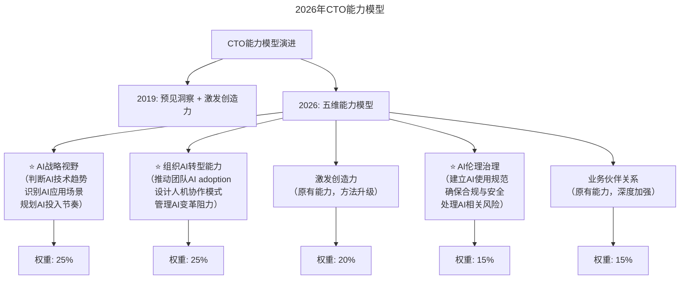
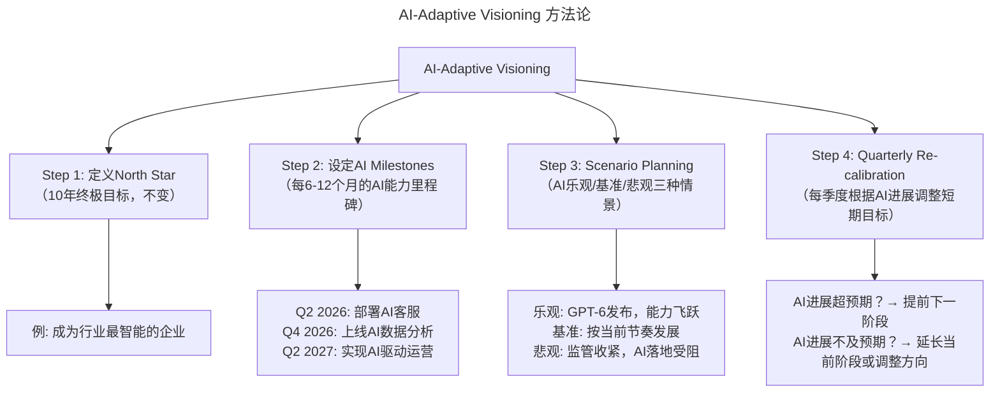

# 大咖对话 | 焦烈焱：从四个维度更好的激发团队创造力

> **适用范围**：CTO/技术 VP、技术管理者、研发团队 Leader，以及希望提升团队创造力与领导力的技术高管。
>
> **更新摘要（v2 · 2026-08 更新）**：
> - 结构化升级为 6 节骨架（导言 / 核心方法论 / 关键流程 / 工具与实战 / 常见误区 / 进阶延展）
> - 保留原文全部 Q&A 内容与 2026 AI 时代升级注解
> - 为 2026 年 CTO 能力模型图、AI-Adaptive Visioning 方法论图补充 title frontmatter 与文字解读
> - 整合行动清单、匠人精神 AI 时代诠释到对应章节

---

## 1. 导言

本周作客"大咖对话"的是普元信息 CTO 焦烈焱，他全面负责普元信息技术与产品的运营工作，是公司技术发展战略的重要决策人。焦烈焱在企业技术架构方面有二十余年的经验，长期致力于分布式环境的企业计算、SOA 与云计算技术研究与实践。

本周，我们跟他聊了聊 CTO 需要具备的能力，以及如何激发团队创造力等话题。

焦烈焱在 2019 年的对话中提出了几个关键观点：

1. **CTO 两大核心能力** —— 对未来的预见与洞察 + 激发团队创造力（CEO 的评价标准）
2. **CTO 的三层进阶** —— 系统稳定运行 → 清晰传达技术价值 → 技术引领业务方向
3. **激发创造力四要素** —— 责任感、有效沟通（讲故事）、合适的愿景、匠人精神
4. **愿景要切合实际** —— 预见 5 年合适，预见 10 年太远；愿景超前会导致团队不理解
5. **失败是成长的必经之路** —— 复盘总结，不重蹈覆辙

---

## 2. 核心方法论

### 2.1 CTO 的成长路径

**极客时间：您能先简单介绍一下您自己么？**

**焦烈焱**：大家好，我是焦烈焱，现在在普元信息担任 CTO。2001 年我加入普元，从程序员做起，慢慢成长为 Team Leader、架构师，到最后成为 CTO，这是一个很漫长的过程，在技术理念、做事方法、团队建设、人际关系等诸多方面，都会有比较大的转变。其中很典型的一点就是，我要花更多的时间去"务虚"，去做思考、做沟通、做规划等相关事情，同时，你走得越高，你"务虚"的时间就要越多。

### 2.2 CTO 应该具备的素质与能力

**极客时间：您觉得一个优秀的 CTO 应该具备哪些方面的素质与能力？**

**焦烈焱**：关于 CTO，我觉得最重要的一个能力是能把事情做好。我们 CEO 对于 CTO 的要求就两点，第一是要有对未来的预见与洞察；第二是要能激发团队的创造力。在他看来，如果能做好这两点，那至少能打 80 分以上。

当然，不同公司的 CTO 承担的职责不同，有些 CTO 从事的工作可能更像传统意义上的 CIO。之前我在美国参加一个 Gartner 的会，他们去采访通用电气的 CEO，问他对 CIO 到底有什么样的要求，他回答，"我没什么其他要求，就一个，保证系统稳定运行就好了"。这句话听起来很简单，但真正要做好，面临的挑战还是挺多的。

**首先，要面对业务快速发展带来的挑战。** 如果业务量一上来，你的系统架构就支撑不了，那就不叫系统稳定运行了，而是根本无法满足业务要求。比较好的方法是在系统架构设计之初，就对业务未来的发展有一定的预测，搭建一个能支撑现有业务量 10 倍数的架构。当然，这中间还涉及到资源评估的事情，因为资源永远是不够的，需要把有限的资源用到最重要的地方去。

**其次，要清楚需要什么技术，以及它能对业务起到什么样的作用。** 比如，要搭建一个 Hadoop 集群，需要 300 台机器，有些老板会问你这么做的原因及目的，那你就需要用对方听得懂的话语跟他解释清楚。如果能把这件事讲清楚，那至少作为一个 CTO 或 CIO 是及格的。

**再往上，要让技术对业务方向起到推动或引领的价值**，也就是技术能帮助企业解决核心竞争力的问题。这时，技术的价值已经不再仅仅是满足业务需求了，还要能够提前预判，做到领先业务一步，引导业务发展，甚至是在原有业务基础上，开拓出新的方向。如果能做到这一点，你作为 CTO 的能力必将又上一个台阶。

其实，以上提到的几点也可以看做是 CTO 与 CEO 有效沟通、获得 CEO 信任的出发点，核心就是要站在业务的视角来考虑问题，来思考公司整体对技术的要求是怎样的，而不是只站在技术的角度。

### 2.3 站在业务视角思考

**极客时间：能具体分享一下如何站在业务视角思考吗？**

**焦烈焱**：普元做了这么多年，其实取得了不少成绩，从最开始的时候，跟客户讲我们的理念，大家都不理解，觉得不靠谱，到现在很多人认同我们，这是一个非常艰难，但也非常值得自豪的过程。

不过，虽然我们取得了不少成绩，但我们也犯过不少错误、做坏过很多产品。很多时候，你感觉你看到了未来的技术方向，但实际上真正做出来的东西，跟你的想象以及公司的业务之间会有很大的差距。

举个例子，我们之前曾做过一个 UI 可视化的产品，因为那个时候 UI 开发非常麻烦，会花费很多精力。我们的初衷是提供这么一个产品，简化大家的 UI 开发过程，但产品出来后推给客户时，反馈却并不好，因为这其实并不是他们的痛点。这个产品就失败了，后来就没有再做下去了。

这样的失败在普元并不罕见。我们做过很多失败的产品，这些产品从技术的角度来讲都是非常不错的，但关键是这些技术、这些产品有没有跟公司的商业目标匹配起来，有没有跟公司当时的能力匹配起来，这是导致失败的主要原因。

普元一路走来摸爬滚打，就是掉进坑里再爬起来，再掉进去，再爬出来的过程。但回过头来想，犯错误并不要紧，人都是在错误里成长起来的，没有什么是能一蹴而就的。关键是，你爬起来之后要复盘总结，不要再掉到同样的坑里去。

### 2.4 AI 时代的观点验证

| 原始观点 | 2026 年验证 | 验证结果 |
|---------|-----------|---------|
| CTO 需具备预见能力 | ⭐ **更加关键但难度更高**。技术迭代周期从 3-5 年缩短至**6-18 个月**（尤其是 AI 领域），预见难度指数级上升，但也意味着先发优势更大 | ⚠️ 双刃剑 |
| 讲故事是有效沟通方式 | ⭐ **依然成立且被 AI 增强**。CTO 可以用 AI 辅助生成故事框架和数据支撑，但**情感共鸣和信任建立仍需人类亲自完成** | ✅ 增强 |
| 愿景不能太超前 | ⭐ **需修正**。在 AI 时代，**5 年愿景可能已经保守了**——有些 AI 变革在 12-18 个月内就能发生；关键是愿景要有**阶段性里程碑**，而非单一遥远目标 | ⚠️ 加速 |
| 匠人精神 | ⭐ **从"技术打磨"扩展为"AI-Human 协作打磨"**。2026 年的匠人精神不仅是对代码质量的追求，更是对**人机协同体验**的极致追求 | ✅ 扩展 |
| 失败中成长 | ⭐ **AI 加速了试错周期**。以前"磨四遍五遍"需要 2-3 年，现在借助 AI 原型工具可能在**2-3 个月**内完成同样次数的迭代 | ✅ 效率跃升 |

---

## 3. 关键流程

### 3.1 激发团队创造力的四个维度

**极客时间：您提到激发团队创造力，具体有哪些做法呢？**

**焦烈焱**：激发团队创造力是 CTO 能力中非常重要的一部分，从我的实践来讲，可以从以下 4 个要点出发。

**第一，要有责任感**。作为 CTO，你首先需要有责任感。中国女排奥运会夺冠，在接受记者采访时，郎平说，比赛的成绩是跟队员的未来密切相关的，所以，你能不能打出好成绩，不仅关乎你自己，更关乎整个团队别人的前途。

这句话给我留下的印象很深，这就是责任感。说回到带团队，公司把这么重要的事情交给你；团队那么多兄弟相信你愿意跟着你；客户信任你愿意用你的产品，你就需要对他们负责。

这会带来很大的压力，但这些压力应该是激励你、迫使你不断前进，想办法把事情做得更好。

**第二点，要有效沟通**。沟通其实就是讲故事。团队人少的时候，你可以一个一个跟对方沟通，一遍不行说两遍三遍，总能说清楚。但当团队大了，人数超过 150 人之后，就很难用亲情、友情、人与人之间的关系等情感的方式去沟通。

你需要的是讲故事，用故事去沟通效果最好。当你在说业务发展、愿景的时候，其实就是在讲故事，而把这个故事讲好，自然能把你想要团队做的事、希望他们达成的目标传达给他们，带着他们一起向上走。

**第三，要树立合适的愿景**。跟团队讲故事的时候必然会聊到愿景，可以说愿景是故事的核心。但我们树立的愿景要切合公司发展步伐，不能走得太远太前。

比如我们之前踩过一个坑，2004 年左右，普元就提出了类似云计算的愿景，但那个愿景太超前了，行业还没有发展到那一个阶段，导致无论是跟公司内部还是公司外部提我们愿景的时候，大家都不理解，觉得不靠谱。最终，这个愿景对公司发展起到的拉动作用是极其细微的。

因此，我们预见 5 年之后的行业情形是最合适的，预见 10 年就太远了，对公司当前的发展并没有太大的好处。

**第四，要有匠人精神**。这个词现在被说得有点多了，但一家企业必须找到自己最擅长的领域，然后专注的打磨，将其做到极致，变成自身的核心竞争力。现在很多领域都有赚钱的机会，但如果不是跟自己核心相关的话，就要懂得取舍。

我们的创新可能都是时间熬出来的，我们掉过无数的坑，经历过无数次的错误，但是我们想办法从坑里爬出来，一步一个脚印把事情做好。一个产品做了废，废了再做，可能要磨四遍、五遍才有突破。而在这个过程中，我们也能不断去思考怎么把技术跟业务做更好的结合。

### 3.2 2026 年 CTO 能力模型（更新版）

上图展示了 CTO 能力模型从 2019 年的二维（预见洞察 + 激发创造力）到 2026 年五维的演进。新增的三维中，AI 战略视野和组织 AI 转型能力各占 25% 权重，成为最重要的能力；AI 伦理治理占 15%，反映了 AI 合规与安全的日益重要性。原有的激发创造力和业务伙伴关系仍然保留但权重调整，说明 AI 时代 CTO 需要在保持传统优势的同时大幅扩展 AI 相关能力。

### 3.3 "讲故事"的 AI 增强版

焦烈焱提到"沟通就是讲故事"，2026 年的 CTO 讲故事工具箱：

| 故事类型 | 传统做法 | AI 增强做法 |
|---------|---------|-----------|
| 技术愿景故事 | PPT + 口头讲述 | **AI 生成可视化原型**（如用 AI 快速生成产品 Demo 视频）+ **数据驱动的叙事**（AI 自动提取关键指标支撑论点） |
| 变革必要性故事 | 列举行业案例 | **AI 竞品分析报告**（自动扫描 50+ 竞品的 AI 应用情况）+ **AI 趋势图表**（可视化展示技术演进曲线） |
| 团队激励故事 | 个人经历 + 情感感召 | **AI 成功案例库**（从全球数据库中检索类似转型的成功故事）+ **个性化激励话术**（根据团队成员特点定制） |
| 向 CEO/Board 汇报 | 准备详实材料 | **AI Executive Brief**（自动生成高管摘要版，突出 ROI 和风险）+ **Q&A Prediction**（AI 预判可能的问题并准备答案） |

**重要提醒**：AI 可以帮你准备故事素材，但**讲故事时的眼神交流、情感传递、临场反应**必须由你自己完成。

### 3.4 愿景设定的新方法论——AI-Adaptive Visioning

焦烈焱提到"预见 5 年最合适"，2026 年的愿景设定方法：

上图展示了 AI-Adaptive Visioning 四步法：第一步定义不变的 North Star（北极星目标），第二步设定每 6-12 个月的 AI 能力里程碑，第三步做乐观/基准/悲观三种情景规划，第四步每季度根据 AI 实际进展重新校准。这种方法解决了"5 年愿景在 AI 时代可能太保守"的问题，通过短周期迭代保持愿景的前瞻性和可执行性。

### 3.5 匠人精神的 AI 时代诠释

| 维度 | 2019 年版匠人精神 | 2026 年版匠人精神 |
|-----|----------------|----------------|
| 对代码质量 | 追求零 Bug、高性能 | + **追求 AI 生成代码的可维护性和可解释性** |
| 对用户体验 | 反复打磨交互细节 | + **打磨人机协作的自然度**（何时 AI 介入、何时人类接手） |
| 对技术创新 | 追求技术领先 | + **追求 AI 应用的独创性**（不是调用 API，而是创造独特的 AI 使用模式） |
| 对问题解决 | 不达目的誓不罢休 | + **善用 AI 加速试错，但不放弃深度思考** |

---

## 4. 工具与实战

### 4.1 对于 CTO / 技术 VP

- [ ] **制定个人 AI 学习计划**：每季度深入理解一个 AI 领域（如 Q1 大模型原理、Q2 Agent 框架、Q3 AI Ethics、Q4 AI Product Management）
- [ ] **建立"A/B Test Your Vision"机制**：先用小范围试点验证 AI 愿景的可行性，再全面推广
- [ ] **培养"AI Storytelling"能力**：练习用非技术人员能理解的语言解释 AI 的价值和风险
- [ ] **创建"AI Failure Resume"**：记录团队在 AI 尝试中的失败经历和教训（正如普元记录产品失败一样）

### 4.2 对于想激发团队创造力的管理者

- [ ] **重新定义"创造力"**：在 AI 时代，创造力 = **提出好问题的能力**（AI 负责执行，人类负责定义问题）
- [ ] **设立"AI Hackathon"**：定期组织内部创新大赛，主题是用 AI 解决实际业务问题
- [ ] **建立"AI Time Allocation"制度**：允许每位成员每周有 10-20% 的时间用于 AI 相关的自主探索
- [ ] **表彰"AI Best Practice"**：不仅奖励成功，也奖励有价值的失败尝试（快速试错、快速学习）

### 4.3 对于技术人个人发展

- [ ] **练习"AI Scenario Thinking"**：面对任何技术决策，都问自己"如果 AI 在 18 个月内有了突破性进展，这个决策还正确吗？"
- [ ] **建立"T 型 + AI"技能树**：在一个领域深耕（T 的横杠），同时广泛掌握 AI 工具（T 的竖杠）
- [ ] **保持"匠人心态"但拥抱 AI 工具**：不因为 AI 能生成代码就放弃对代码质量的追求，而是用 AI 提高追求质量的效率

---

## 5. 常见误区

1. **愿景过于超前**：2004 年普元提出类似云计算的愿景，但行业尚未发展到那个阶段，导致内外都不理解。AI 时代更需注意——有些 AI 变革在 12-18 个月内就能发生，愿景要有阶段性里程碑而非单一遥远目标。

2. **技术与商业目标不匹配**：普元做过的 UI 可视化产品从技术角度看不错，但不是客户痛点，最终失败。技术产品必须与公司商业目标和当时的能力匹配。

3. **只用情感沟通大团队**：团队超过 150 人后，仅靠亲情、友情等情感方式沟通效果有限，需要用"讲故事"的方式传达愿景和目标。

4. **AI 讲故事完全依赖 AI**：AI 可以帮你准备故事素材，但讲故事时的眼神交流、情感传递、临场反应必须由人类亲自完成。完全依赖 AI 生成内容会丧失信任感。

5. **AI 时代放弃匠人精神**：不因为 AI 能生成代码就放弃对代码质量的追求。2026 年的匠人精神应扩展为对"AI-Human 协作打磨"的极致追求。

6. **同样的坑反复踩**：犯错误不要紧，关键是爬起来之后要复盘总结，不要再掉到同样的坑里去。AI 加速了试错周期，但也要求更快的复盘速度。

---

## 6. 进阶延展

### 6.1 核心金句（2026 版）

> **"2026 年 CTO 的最重要能力不再是'看准未来 5 年'，而是'在未来 5 年内每 6 个月都重新校准方向'。"**

> **"讲故事的人没变，但讲故事的工具变了——AI 帮你准备弹药，你负责扣动扳机。"**

> **"匠人精神的内核没变——对完美的执着追求；但完美的新标准变了——不是代码无 Bug，而是人机协作无摩擦。"**

### 6.2 参考与延伸

*本注解基于 2026 年 AI 时代管理实践生成。建议结合焦烈焱在普元信息的企业架构经验、Gartner 技术趋势报告及 AI 组织转型相关研究对照阅读。*
