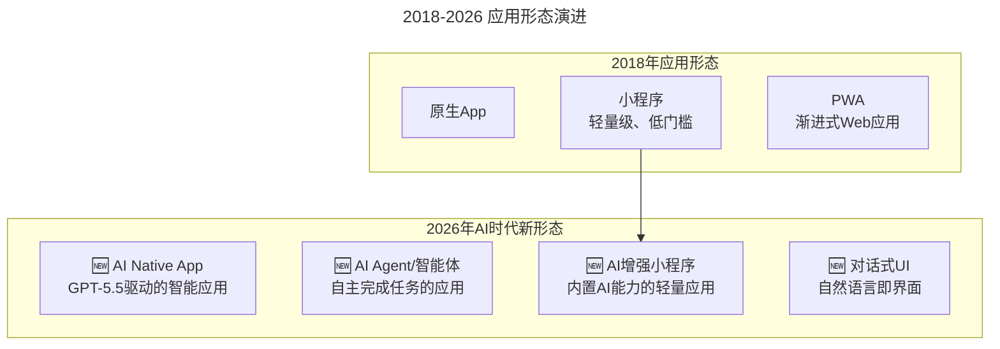
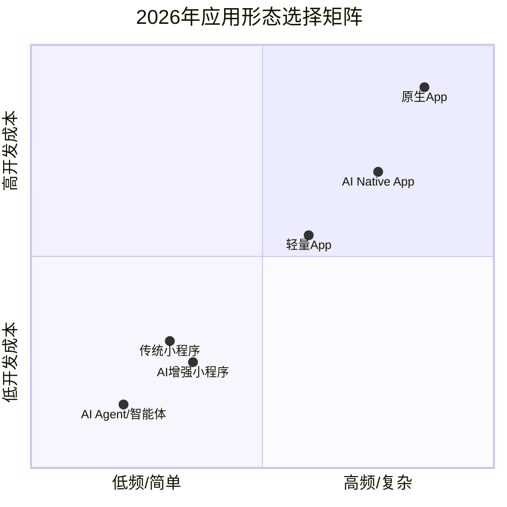

# 大咖对话 | 玉攻：四个维度看小程序与 App 的区别

> **适用范围**：产品经理、前端/移动端开发者、创业者及技术决策者，尤其是需要在小程序、App 与 AI Agent 之间做形态选型的团队。
>
> **更新摘要（v2 · 2026-08 更新）**：
> - 结构化升级为 6 节骨架（导言 / 核心方法论 / 关键流程 / 工具与实战 / 常见误区 / 进阶延展）
> - 保留原文全部 Q&A 内容与 2026 AI 时代升级注解
> - 为应用形态演进图、2026 年应用形态选择矩阵图补充 title frontmatter 与文字解读
> - 整合产品形态决策树、MVP 策略、技术栈建议到对应章节

---

## 1. 导言

本周大咖对话的嘉宾是蚂蚁金服资深技术专家，蚂蚁金融科技产品研发团队主管玉攻，目前主要负责金融级云产品的架构和研发工作。2015 年加入蚂蚁金服，并作为金融科技核心创始团队成员，领导和创立了蚂蚁金服的第一代 PaaS 云平台产品蚂蚁金融云。

小程序从一开始的无人看好，到后来的风生水起，再到急转直下，现在又要重回巅峰，诸多互联网巨头纷纷发力小程序，那小程序与 App 之间的区别是什么，如何才能更好的发掘小程序的价值，玉攻与我们分享了他的观点。

玉攻（蚂蚁金服资深技术专家）的核心观点：

1. **小程序不会取代 App**：两者互补，高频用 App，低频/拉新用小程序
2. **创业公司策略**：先用小程序低成本验证，成功后再考虑 App
3. **关键成功因素**：场景深度结合 + 持续迭代运营
4. **技术演进路径**：Cloud-Based → Cloud-Ready → Cloud-Native (Serverless)
5. **多端统一趋势**：一次开发，多平台投放

这些观点在 2026 年全部兑现，且被 AI 技术进一步放大。

---

## 2. 核心方法论

### 2.1 小程序与 App 的核心区别

**极客时间：在您看来，小程序和 App 之间最主要的区别是什么？小程序会取代 App 吗？**

**玉攻**：不会，小程序不会取代 App，从用户的角度来看，在一些高频的使用场景，App 的地位从不曾被动摇。一般情况下，用户每天打开使用频率最高的 App 不会超过 10 个。只有一些低频使用的 App 非常适合小程序实现。

从大型企业的角度来看，大型互联网公司往往会采用"App+ 小程序"的模式，小程序会极大地提升 App 用户的活跃度，甚至会成为整个业务产品矩阵中的一部分，但不会替代 App。

从个人开发者和中小型企业的角度来看，小程序的研发和推广成本远远低于 App，在研发初期和新业务试错环节，小程序会优于 App。但随着企业发展成熟，需求增加，功能要求更丰富时，App 的优势就凸显出来了。

从业务的角度，如果某项业务需要短时间依附于大平台生态，借助平台的力量发展，那么小程序要明显优于 App。但当业务逐渐成熟并且被市场认可之后，平台的局限性也会逐渐显现出来，由小程序转向 App 就成了必然。

说到底，小程序和 App 并不矛盾，但是小程序绝对不可能取代 App 的价值。大厂会并行走两条路，App 负责高频场景，小程序负责拉新试错。对于一些快速成长的创业公司，我建议从小程序做起，因为一开始就做 App 的成本非常高，但是先开发小程序，就可以用最低的成本去验证业务的创新性和市场接受度。如果业务上能成功，再去扩展业务模式，继续用小程序或者做成一款 App 都可以，所以在一开始用小程序相对来说性价比更高。

小程序近两年确实出现了一些爆款，但在这些爆款背后，其实大多数小程序都死掉了，探究其背后的原因，是因为很多人并没有搞懂小程序的持续迭代，不清楚小程序需要与场景深度结合。由于小程序开发成本低，所以市场上大量小程序都存在很快上线却缺乏维护的问题，没有精心运营，小程序的迭代就成了"死棋"；另外，很多开发者还没有意识到小程序与 App 的区别，只是简单地将 App 现有功能移植到小程序上，在产品形态上只注重功能而忽视了小程序最看重的场景问题，这就解释了为什么有的人开发的 App 活跃度还不错，但转战到小程序却满盘皆输的原因。

对于小程序的未来，我希望小程序的发展不再局限于某一个平台，而是某个操作系统的小程序，甚至成为一种"新型 App"。不过目前阶段，还是要分清小程序和 App 有不同的用处，要根据客群、使用频率来决定最后选择小程序还是 App。

### 2.2 支付宝小程序的独特价值

**极客时间：支付宝为什么要做小程序，而支付宝小程序又有哪些独特的地方？**

**玉攻**：支付宝小程序其实是一个极简的服务工具，这与支付宝的定位不谋而合。支付宝小程序可以帮助用户在生活/商业的场景下开发出一些创新型的业务。其实大多数人很多时候并没有意识到自己正在使用的就是支付宝小程序，比如很多人每天去蚂蚁森林浇水，其实蚂蚁森林就是一款支付宝小程序。

支付宝小程序集成了支付宝最核心的一些能力，比如支付、交易、信用、风控、AR 等等，所以在支付宝小程序里我们可以实现很多有创意的想法。举个例子，充电宝其实是基于「街电」这样的一个小程序，充分利用支付宝用户的信用和支付能力，产生的一种新型的商业模式。在我看来，支付宝小程序的初衷就是让大众的生活变得更方便，帮助企业更快地触达客户，让创新无处不在。

支付宝小程序是一个前端技术，整个浏览器内核采用 UC 浏览器的内核，WebView 的稳定性和兼容性非常不错，Crash 率只有一般系统 WebView 的 1/5。另外，UC 内核针对内存做了大量的优化，包括图片的内存、渲染内存、JS 内存、峰值内存管理。支付宝小程序的内核启动逻辑是 v8 引擎 CodeCache 深度优化，这使得 JS 代码解析和编译时间减少 40% 左右。首页的加载和渲染对于冷启动非常关键，为了减少用户在首页显示前的等待时间，支付宝小程序采用离线缓存的方式优化加载流程。

整个阿里经济体在做小程序的时候，强调统一的技术架构和多端投放，我并不希望小程序变成巨头进行技术垄断的手段，或者说技术封闭的一个边界。小程序最大的价值在于真正服务客户，让客户受益，给客户提供更多的渠道，获取更大的流量。

目前在阿里体系里，我们想做统一的小程序，也就是支付宝小程序不仅在支付宝里可以使用到，在其他平台如天猫、淘宝、高德等也可以使用。比如打车，用户既可以从高德平台进入，也可以从支付宝的平台进入；比如某个特卖的小程序，用户有可能是从淘宝的渠道进入，也有可能是从支付宝的渠道进入。所以支付宝小程序不是单一的，它的背后是有强大的"矩阵"在支撑。开发支付宝小程序，表面上获得的是支付宝的渠道优势，其实它背后是整个阿里经济体系的支持。这是其他平台所没有的优势。

### 2.3 从小程序云到 Cloud-Native

**极客时间：普通开发者如何才能更好的发掘小程序的价值呢？**

**玉攻**：其实支付宝小程序云是一个非常好的选择，它能让开发者不需要关心证书、运维、扩容，不需要关心被黑客攻击，只需要专注写好自己的代码和业务逻辑即可。

平台技术一直是我非常感兴趣的方向。我在 IBM 参与过 WebSphere 这样的应用服务器，我也做过 Java 开发。技术的发展在这十几年的时间里，基本实现了基础设施的"云化"。整个业界在最开始做云的时候，真的是"云里雾里"。随着认知的成熟，我们发现云其实是一层一层的，最下面一层叫做 IaaS，相当于把计算存储网络的资源"云化"，所谓的云化就是能够让更多的人以共享的方式使用到这些资源，而不需要自己去做比如购买机器、物理机、买机房设置网络等等这些事情。这个阶段我们称为 Cloud-Based。对于金融行业来说，要想实现云化，其实是需要心理斗争的。但当我们心里迈过这个门槛的时候，我们就进入到 PaaS 层面。

PaaS 层面要解决的问题就是让应用变得更舒服一点。比如原来要开发一个应用，需要考虑如何设计中间件、网关、流控、分布式架构等，当中间件云化之后，需要做的就是保证上层业务的实现，让业务衍生成为一个能够支持一定规模的互联网的产品，这个阶段就是 Cloud-Ready。我在做中间件的时候，发现中间件的未来其实已经往 PaaS 层面发展，中间件的云化可以帮助上层业务更容易地享受到基础设施的便利性。

而我们现在要走的一个方向，其实跟支付宝小程序云服务未来的发展方向是一致的，也就是 Cloud-Native。现在技术圈比较火的就是 Serverless，就是你已经不关心服务器这件事情了，所有的基础设施，包括运维，都已经由云厂商帮助你去解决，而你真正需要关注的只是你的应用和你的业务逻辑。这其实就是支付宝小程序云服务的发展的轨迹。

### 2.4 AI 时代验证

| 2018 年预测 | 2026 年现状 |
|-----------|-----------|
| "小程序不会取代 App" | ✅ **完全正确**——但 AI Agent 正在创造第三种形态 |
| "低频场景适合小程序" | ✅ **依然成立**——AI Agent 进一步降低了低频服务的门槛 |
| "Serverless 是未来方向" | ✅ **已成主流**——78% 的新项目采用 Serverless 架构 |
| "多端投放是趋势" | ✅ **全面实现**——Flutter + AI 生成代码实现真正的跨平台 |

---

## 3. 关键流程

### 3.1 从小程序到 AI Agent：形态演进的延续



上图展示了应用形态从 2018 年到 2026 年的演进。2018 年主要有原生 App、小程序和 PWA 三种形态；2026 年新增了 AI Native App、AI Agent/智能体、AI 增强小程序和对话式 UI 四种新形态。小程序演进为 AI 增强小程序，而 AI Agent 和对话式 UI 则是完全全新的应用形态，创造了"第三种选择"。

### 3.2 2026 年的新格局：App vs 小程序 vs AI Agent



上图是 2026 年应用形态选择矩阵，横轴表示使用频率/复杂度（从低频简单到高频复杂），纵轴表示开发成本（从低到高）。AI Agent 位于左下角（低频简单 + 低成本），适合任务导向的低频服务；原生 App 位于右上角（高频复杂 + 高成本），适合核心业务场景；AI Native App 则介于两者之间，适合以 AI 能力为核心价值的产品。选择形态时需综合考虑使用频率、交互复杂度和开发预算。

### 3.3 AI Agent：比小程序更"轻量"的新物种

⭐ **2026 革命性变化：**

原文："小程序的研发和推广成本远远低于 App"

**2026 年：AI Agent 的成本更低**

```
开发成本对比（2026）：
- 原生App：$50K-$500K（3-12个月）
- 小程序：$5K-$50K（1-3个月）
- AI增强小程序：$3K-$30K（2-6周，AI辅助开发）
- AI Agent：$1K-$10K（1-2周，Prompt + 配置）
- 🆕 纯AI Service（无UI）：$500-$5K（2-3天）

维护成本对比（年）：
- 原生App：$20K-$100K
- 小程序：$5K-$20K
- AI Agent：$2K-$8K（主要是API调用费）
```

**实际案例：**
```
场景：一个简单的预约服务

❌ 2018年做法：
  - 开发小程序：2周，$10K
  - 后端API：1周，$5K
  - 总计：3周，$15K

✅ 2026年AI Agent做法：
  - 用自然语言描述需求
  - AI自动生成Agent（含对话UI）
  - 接入支付/日历API
  - 总计：2天，$2K

用户体验：
  - 小程序：打开→点击→填写→提交
  - AI Agent："帮我预约明天下午3点的牙医"
          → 自动完成所有步骤
```

### 3.4 Serverless 的全面胜利

原文："Serverless...你真正需要关注的只是你的应用和你的业务逻辑"

**2026 年 Serverless 已成为默认选项：**

| 维度 | 2018 年 | 2026 年 |
|-----|--------|--------|
| 采用率 | <5% 的新项目 | **78% 的新项目** |
| 主要玩家 | AWS Lambda | 阿里云函数计算、Vercel、Cloudflare Workers |
| 冷启动问题 | 严重（1-5 秒） | **基本解决（<200ms）** |
| AI 集成 | 需要手动配置 | **原生支持 AI 推理** |
| 成本模型 | 按调用计费 | **更细粒度（按 Token/推理次数）** |

**对开发者的启示：**
> 2026 年，如果你还在手动管理服务器，就像今天还用手动挡汽车一样——不是不行，但效率差太多。

### 3.5 多端统一的 AI 解决方案

原文："统一的技术架构和多端投放"

**2026 年：AI 让跨平台开发彻底解决**

```
传统跨平台方案（各有妥协）：
- React Native: 接近原生性能，但有桥接开销
- Flutter: 高性能，但包体积大
- H5/小程序: 轻量，但能力受限

2026年AI原生跨平台：
- 用自然语言描述UI → AI生成各平台代码
- 设计稿 → AI直接生成iOS/Android/Web/小程序代码
- 一套Prompt → 多端适配

典型案例：
  输入："做一个电商商品详情页，支持VR预览"
  输出：
    - iOS (SwiftUI) 代码
    - Android (Compose) 代码  
    - Web (React) 代码
    - 小程序代码
    - 全部包含AR/VR功能
```

---

## 4. 工具与实战

### 4.1 2026 年产品形态选择决策树

```
Start: 我有一个产品想法
  ↓
Q1: 核心交互复杂吗？（多步骤表单、实时协作等）
  ├─ Yes → Q2: 需要高性能/离线能力？
  │        ├─ Yes → 原生App或AI Native App
  │        └─ No → 跨平台框架（Flutter + AI辅助）
  └─ No → Q3: 主要使用场景？
           ├─ 低频、任务导向 → AI Agent / AI增强小程序
           ├─ 中频、内容消费 → 小程序 + Web
           └─ 高频、社交/工具 → 必须做App

特殊考虑：
- 如果核心价值 = AI能力 → AI Native App（如ChatGPT、DeepSeek）
- 如果目标用户 = 年轻人 → 可以只做小程序 + 社交传播
- 如果B2B企业服务 → PWA + AI Agent组合
```

### 4.2 MVP 策略升级（2026 版）

```
Phase 1: 验证想法（第1周）
□ 用AI快速生成产品原型（可交互）
□ 做用户访谈（5-10人）
□ 收集反馈，迭代概念

Phase 2: 最小可用产品（第2-3周）
□ 选择形态：AI Agent 或 AI增强小程序
□ 用AI辅助开发核心功能
□ 上线测试（内测100人）

Phase 3: 数据验证（第4-8周）
□ 追踪关键指标
□ 判断是否值得投入更多资源
□ 如果数据好 → 规划App版本
□ 如果数据不好 → pivot或放弃（损失最小化）
```

### 4.3 技术栈建议（2026 优先级）

```
必学（立即开始）：
🔴 AI编程工具：Cursor / Windsurf / Copilot
🔴 Prompt Engineering基础
🔴 至少一个Serverless平台（阿里云FC / Vercel）

推荐（本季度掌握）：
🟡 小程序框架（微信/支付宝最新版本）
🟡 AI Agent开发框架（LangChain / CrewAI）
🟡 跨平台开发（Flutter + AI插件）

关注（了解趋势）：
🟢 AI Native App开发范式
🟢 WebAssembly + AI
🟢 边缘计算 + AI推理
```

---

## 5. 常见误区

1. **简单移植 App 功能到小程序**：很多开发者只是简单地将 App 现有功能移植到小程序上，只注重功能而忽视了小程序最看重的场景问题，导致 App 活跃度不错但小程序满盘皆输。

2. **小程序上线后缺乏维护**：由于小程序开发成本低，大量小程序很快上线却缺乏维护，没有精心运营，迭代就成了"死棋"。

3. **认为 AI Agent 完全取代小程序**：AI Agent 降低了低频服务门槛，但并未取代小程序。小程序在内容消费、电商等场景仍有优势，AI Agent 更适合任务导向场景。

4. **忽视 Serverless 的冷启动问题**：虽然 2026 年冷启动已基本解决（<200ms），但在极端场景仍需关注。选择 Serverless 平台时要测试实际冷启动表现。

5. **过度依赖 AI 跨平台生成**：AI 生成的多端代码虽然效率高，但仍需人工审查和优化。完全依赖 AI 生成可能导致平台特有功能缺失或性能问题。

6. **选择形态时只看开发成本**：产品形态选择不能只看开发成本，还要考虑使用频率、交互复杂度、目标用户群体和核心价值。高频社交/工具类产品必须做 App。

---

## 6. 进阶延展

### 6.1 总结

玉攻 2018 年的技术洞察——**"小程序互补 App、Serverless 是未来、多端统一是大势"**——在 2026 年不仅全部兑现，而且被 AI 技术进一步放大。

**核心理念升级：**

> 2018: 应用形态 = App + 小程序 + PWA  
> **2026: 应用形态 = App + 小程序 + AI Agent + AI Native App + 对话式服务**

> 2018: 开发者关注"哪个框架更好"  
> **2026: 开发者关注"什么问题最适合用什么形态 + 如何用 AI 加速开发"**

> 2018: Serverless 是"未来方向"  
> **2026: Serverless 是"默认选项"，AI 推理即服务是新的基础设施**

**最重要的变化：**
- 从"为不同平台写不同代码"到**"描述一次，AI 生成所有平台代码"**
- 从"选择技术栈"到**"选择产品形态 + 让 AI 处理实现细节"**
- 从"降低开发成本"到**"AI 将开发成本趋近于零（对简单应用而言）"**

### 6.2 参考与延伸

*注解生成时间：2026 年 6 月 | 基于 AI Agent、Serverless 和小程序生态最新发展更新。参考：Alipay Mini Program Developer Report 2026、Serverless Survey 2026、AI Agent Ecosystem Report。*
