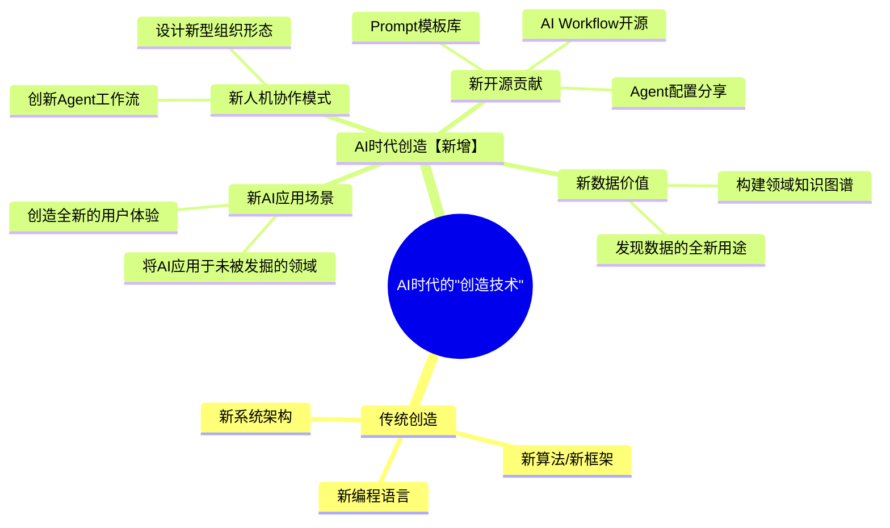
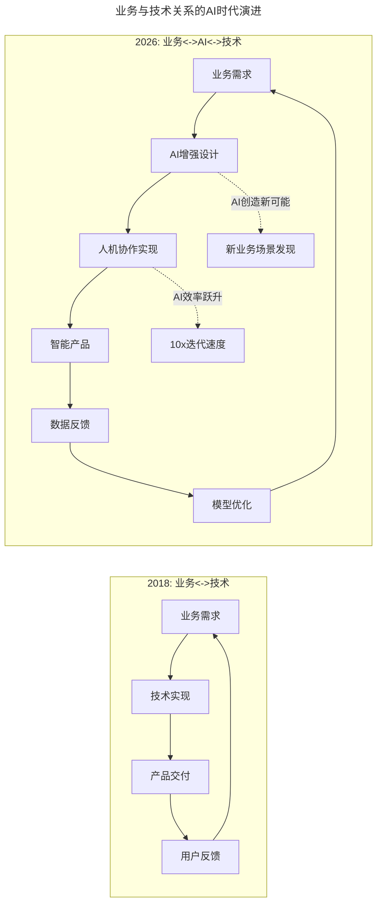

# 大咖对话 | 王坚：我从不吃后悔药

> **适用范围**：技术管理者、CTO、架构师，以及对技术人成长路径与管理哲学感兴趣的从业者。
>
> **更新摘要（v2 · 2026-08 更新）**：
> - 结构化升级为 6 节骨架（导言 / 核心方法论 / 关键流程 / 工具与实战 / 常见误区 / 进阶延展）
> - 保留原文全部 Q&A 内容与 2026 AI 时代升级注解
> - 为"AI 时代的创造技术"思维导图、"铁轨与火车头"AI 版本流程图补充 title frontmatter 与文字解读
> - 整合快问快答与行动指南到对应章节

---

## 1. 导言

本周大咖对话的嘉宾是王坚，他是 2050 志愿者，阿里云创始人，阿里巴巴技术委员会主席。日前，极客邦科技创始人兼 CEO 霍泰稳 Kevin 与王坚在极客 Live 进行了一次精彩的直播，聊了他对于自己、对于技术人、对于世界的诸多想法与思考，带来了不一样的王坚。

王坚博士分享了关于技术人成长和管理的独特智慧：

1. **使用技术 vs 创造技术** —— 写好代码是最基本的，好的技术人还要有能力创造新技术
2. **享受当下** —— 保持年轻心态的关键是享受现在所做的事
3. **管理的直觉** —— 精准知道哪些要做、哪些一定不做；接受别人的帮助
4. **业务与技术的关系** —— 铁轨与火车头的关系，二者统一，缺一不可
5. **年轻人与创新** —— 年轻人永远是创新的主体，乐观是解决问题的必要因素

---

## 2. 核心方法论

### 2.1 优秀技术人的特质

**Kevin：在您看来，一个优秀的技术人应该具备哪些特质？**

**王坚**：写好代码当然是最重要的，代码都写不好，再说别的都不靠谱，这是技术使用层面的问题，是最基本的。但一个好的技术人不仅该知道如何使用技术，还要有能力创造新技术，这可能是我们国内技术人面临的最大挑战。

使用技术和创造技术是两个不同的概念，并不是说谁比谁更高级。我们的历史责任应该是为全世界创造技术，比如从语言这个角度讲，我们能否为世界贡献一门语言，这并不是说要"为国争光"，而是说要对世界有贡献，要想一想我们能为这个世界做点什么。

除此之外，还要保持年轻的心态。而保持年轻心态的关键就是要享受现在所做的事情，只要你真正热爱一件事，做起来就会觉得是种享受。如果将享受理解成远离你现在的工作，这是件很悲剧的事情。有些人希望一辈子都生活在海边，这本身没有错，但如果觉得只有去海边度假才是享受生活，这就是个问题了。对我而言，我每天都坐在海边，享受自己所做的事，做对做错都不重要，做好做坏也不重要，不要以结果的好坏作为判断你是否享受的标准。

### 2.2 管理心得

**Kevin：您对于管理有何心得体会？**

**王坚**：说真的，做管理还是挺难的，如果允许我自夸一下的话，我觉得所谓的创新工作或治理工作，这方面的直觉会相当重要，至少对我来讲是这样。任何优秀的管理方法，管理者都要对流程非常清楚，但这里面也有一个诀窍，就是你要精准地知道，哪些是你要做的事情，哪些事情一定不做。

很多时候，我们最艰难的环节都卡在"纠结"这件事情上，于是花了时间做了一些本来可做可不做的事情，浪费了一些原本可以花在必做事情上的时间。这个判断的过程对我来说是依靠直觉完成的，作为管理者，对于流程的严格管理是必要的，但相信直觉一样也很重要。直觉是支配你的巨大资源，有了它你才会进入流程的管理，这方面我的体会蛮深的。

大部分时候，要平衡商业、技术和管理这三者的关系，确实会遇到一些困难，对我自己而言，这时候最重要的就是要接受别人的帮助。我经常会讲，一个人有长处其实是很危险的一件事，因为他的短处是需要别人帮忙填补的，但很多人看不到这一点。

我觉得我最大的长处，并不是我自己有多优秀，而是我可以心安理得地接受别人的帮助，比如 2050，就是我接受别人的帮助，而不是我帮助别人。如果你管理上比较弱，在这方面就要多接受别人的帮助，如果不能接受，那就会是个灾难，不要试图去做你明知道做不好的事情。适时接受他人援手，也是一个人成长最后的挑战。

### 2.3 业务与技术：铁轨与火车头

**Kevin：和马云在一起工作是一种什么样的体验？**

**王坚**：我知道，很多人想了解和马云一起工作是一种什么体验，对此我觉得非常幸运，我还是更喜欢叫他马总，这是对他的尊称，能够有机会跟他在一起工作，对我的帮助非常大，和他相处也没什么压力。

大家都知道他在公众面前做了很多次演讲，我可能是少数真正理解他为什么会那样讲的人之一。很多时候，我可以明白他的所思所想，他说出的话和他的思想保持着高度的一致性，这让我非常佩服。他是真正从解决社会问题的角度来看待所有事情的人，你可以从他身上学到很多东西，包括对企业家的尊重和对中小企业的尊重。

同时，马总也是一位非常谦虚的人，他经常说自己不懂技术，我会跟他讲，懂不懂技术并不是核心问题。他真心地尊重技术，有时我甚至觉得，他比一些懂技术的人还要尊重技术。

我经常讲，阿里是一个平台，很多人在阿里工作的时候，他（她）的能量被放大了，边界随之扩张，学到的东西自然也变多了。人和人之间原本没有那么大的差别，但你身处潮流的中心，边界又足够大，自然就可以做很多事情，学很多别人学不到的东西，对你的成长就会有更多帮助。

其实，我们做技术也是在拓展业务的边界，业务会反过来推动技术的发展。我定义业务和技术的关系，是铁轨跟火车头的关系，这里并不是说铁轨一定是业务或技术，这二者都没问题。

你很难讲，是火车头还是铁轨将你带到一个地方的，因为铁路不修到那里，火车就到不了那儿；铁轨修到了那里，没有火车也无法抵达，这二者是统一的，这就是他们之间的关系。我认为，业务在推进技术，技术也在创造崭新的业务，在今天这个时代，这二者是一体的，这也是我说这是最好的时代的理由之一。

### 2.4 AI 时代验证

| 王坚 2018 年观点 | 2026 年 AI 时代现实 | 验证结果 |
|--------------|----------------|---------|
| "创造新技术"是挑战 | AI 时代创造新应用/新范式比纯算法创新更重要 | ✅ 内涵扩展 |
| "享受当下" | AI 加速变化，更需要内心定力 | ✅ 更加重要 |
| "直觉判断做什么不做什么" | AI 选项爆炸，决策过滤更关键 | ✅ 更加重要 |
| "接受别人帮助" | AI 时代没有人能掌握所有技能 | ✅ 必要性提升 |
| "最好的时代" | AI 带来前所未有的机遇 | ✅ 完全验证 |
| "年轻人是创新主体" | Z 世代/Alpha 世代是 AI-Native 一代 | ✅ 更加成立 |

---

## 3. 关键流程

### 3.1 "使用 vs 创造技术"的 AI 时代新解

上述思维导图展示了"创造技术"在 AI 时代的内涵扩展。传统创造主要指新算法、新框架、新编程语言和新系统架构；AI 时代新增了四个维度：新 AI 应用场景、新人机协作模式、新数据价值和新开源贡献。这意味着"创造"的门槛降低了——不再需要深厚的算法功底，用 AI 解决一个从未被解决的行业痛点、创建一个高效的 Agent 工作流、开源一套高质量的 Prompt 模板库，都是对世界的贡献。

**2026 年的"创造"门槛降低了，但意义更大了：**

- **传统"创造技术"**：需要深厚的算法功底、数学基础（开发新框架、发表顶级会议论文、贡献核心开源项目）
- **AI 时代的"创造技术"**：用 AI 解决一个从未被解决的行业痛点、创建一个高效的 Agent 工作流、开源一套高质量的 Prompt 模板库、将 AI 能力与垂直行业深度结合

> **王坚博士说"要对世界有贡献"——在 AI 时代，这个贡献不一定是发明一个新的 LLM，而是用现有的 AI 能力去解决真实世界的问题，让更多人受益。**

### 3.2 "铁轨与火车头"的 AI 时代版本

上图展示了业务与技术关系从 2018 年到 2026 年的演进。2018 年是简单的"业务需求→技术实现→产品交付→用户反馈"线性循环；2026 年 AI 介入后，不仅加速了每个环节（10x 迭代速度），还创造了新可能——AI 能发现人类未曾想到的业务场景。关键变化在于：AI 不仅是"火车头"（动力），更是"新的轨道铺设者"——AI 能发现人类未曾想到的业务可能性。

---

## 4. 工具与实战

### 4.1 快问快答精选

**Q1：您认为自己做过最牛逼的事情是什么？**  
王坚：今年做的最牛逼的事情就是让志愿者来办一个大会（2050）。

**Q2：有最后悔的事情吗？是什么？**  
王坚：真没有最后悔的事情，我这人从来不吃后悔药，真没有什么感到后悔的事情。

**Q3：过去对您触动最大的一件事是什么？**  
王坚：阿里云做到后面，我发现自己接触到了整个社会，这是我第一次发现有那么多人要用云计算，世界变得如此开阔。这件事对我触动很大，让我改变了很多想法，阿里云折射出社会的一面，打开了一扇崭新的大门。

**Q5：作为阿里巴巴的首席技术官，您会写代码吗？**  
王坚：我真的会写代码，只不过我今天写的代码对公司的贡献已经微乎其微了，还是不说的为好。

**Q6：最近有哪些新的感悟？**  
王坚：做了 2050 和城市大脑之后就会觉得，我之前讲的那句话是对的，这真的是人类历史上少数几次最好的时代，而不是笼统的好时代。

**Q12：博士给我们这些热爱科技的年轻人能不能说几句话？**  
王坚：第一句，这是年轻人可以创造未来的时代，你真的要打起精神来。第二句，要相信天是蓝蓝的天，乐观是解决问题的必要因素，世界上有很多的问题和挑战，依靠乐观是可以解决一部分的，也是我们年轻人给这个世界带来的很棒的东西。年轻人是最后去解决这个世界问题的人，你不乐观，这个世界就没有未来。

### 4.2 基于王坚哲学的行动指南

1. **✅ 培养"创造"思维（立即开始）**
   - 不只是使用 AI 工具，思考：我能创造什么新的 AI 应用？
   - 每月尝试一个"从 0 到 1"的 AI 小项目
   - 记录：这个项目解决了什么之前不存在的问题？

2. **✅ 练习"不做"的艺术（本周启动）**
   - 列出你当前所有的工作事项
   - 标记出：哪些是必须做的？哪些是可以不做的？
   - 对"可不做"的事，坚决说不

3. **✅ 建立"帮助网络"（本月完成）**
   - 识别你在哪些方面需要别人的帮助
   - 主动向拥有互补技能的人求助
   - 学会心安理得地接受帮助

4. **📋 保持乐观与热爱（持续）**
   - 每天记录一件让你享受工作的事
   - 当遇到挫折时，提醒自己：这是"最好的时代"
   - 与积极向上的同行交流

---

## 5. 常见误区

1. **只使用技术不创造技术**：写好代码是最基本的，但好的技术人还要有能力创造新技术。在 AI 时代，"创造"的定义扩展了——用 AI 解决真实问题也是创造。

2. **以结果好坏判断是否享受**：做对做错不重要，做好做坏也不重要，不要以结果的好坏作为判断你是否享受的标准。享受的是过程本身。

3. **纠结于可做可不做的事**：最艰难的环节常卡在"纠结"上，浪费了本可以花在必做事情上的时间。要精准知道哪些要做、哪些一定不做。

4. **有长处却不接受别人帮助**：一个人有长处其实很危险，因为他的短处需要别人帮忙填补。不能接受帮助会导致灾难。

5. **将业务与技术割裂**：业务和技术是铁轨与火车头的关系，二者统一，缺一不可。业务推进技术，技术也创造崭新的业务。

---

## 6. 进阶延展

### 6.1 核心启示

> **"王坚博士的智慧在 AI 时代更加闪耀——'创造技术'的定义扩展了，'享受当下'的心境更珍贵了，'年轻人是创新主体'的论断被 Z 世代的 AI-Native 特性完美验证。最重要的是：这确实是人类历史上少数几次最好的时代之一，而我们正身处其中。"**

### 6.2 参考与延伸

*本注解基于 2026 年 6 月生成，致敬王坚博士的独特智慧。建议结合阿里云发展史、2050 大会理念及城市大脑项目案例对照阅读。*
