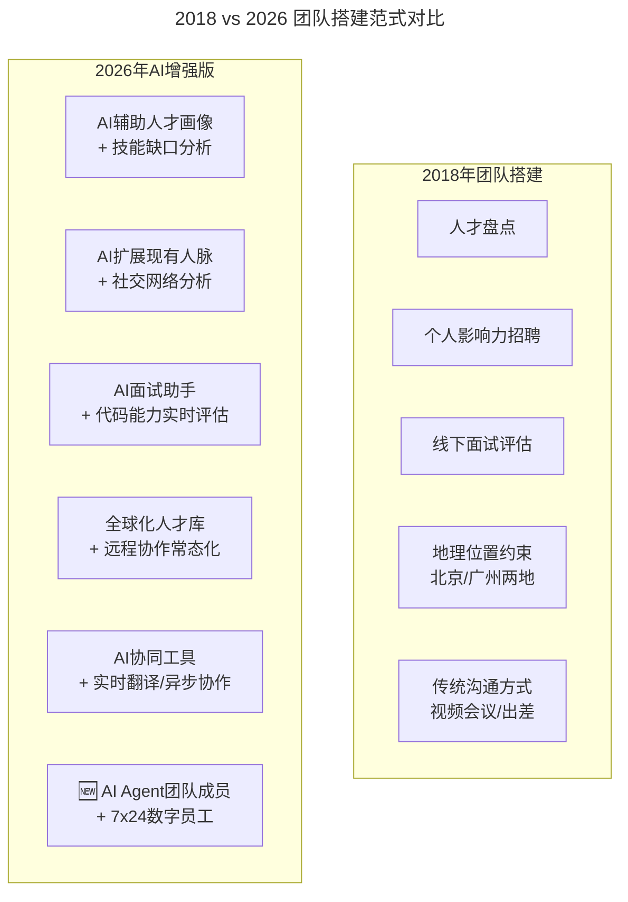
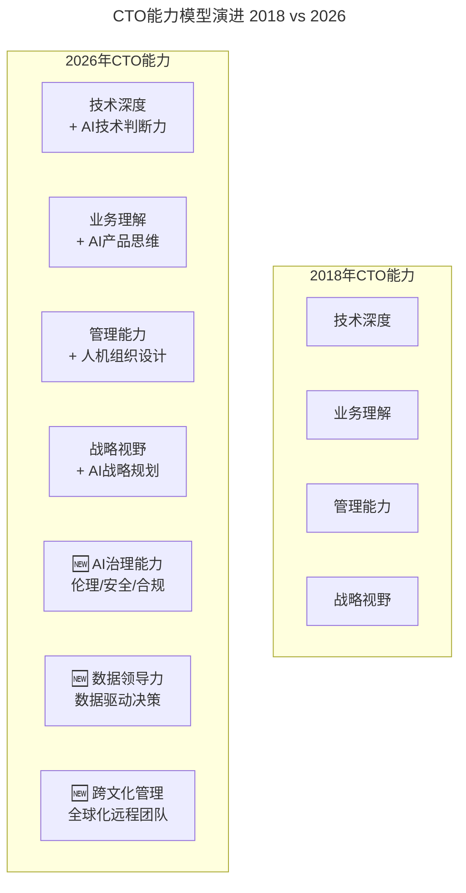
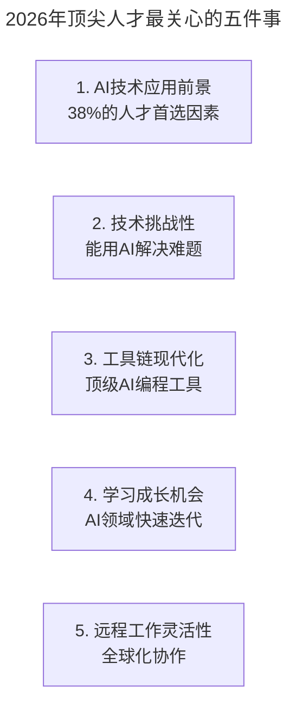
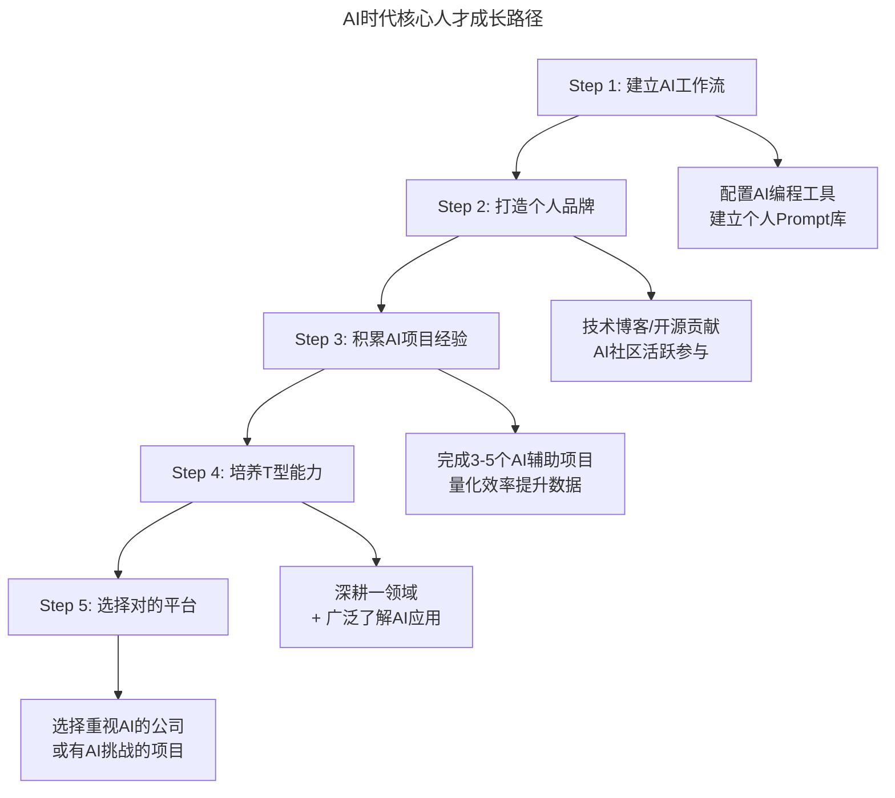

# 大咖对话 | 王平：如何快速搭建核心技术团队

> **适用范围**：CTO/技术 VP、技术团队负责人、创业者，以及需要快速搭建或扩展技术团队的管理者。
>
> **更新摘要（v2 · 2026-08 更新）**：
> - 结构化升级为 6 节骨架（导言 / 核心方法论 / 关键流程 / 工具与实战 / 常见误区 / 进阶延展）
> - 保留原文全部 Q&A 内容与 2026 AI 时代升级注解
> - 为团队搭建 AI 时代新范式图、吸引人才五要素图、CTO 能力模型 V2.0 图、个人开发者成长路径图补充 title frontmatter 与文字解读
> - 整合快速建队指南、面试问题、行动清单到对应章节

---

## 1. 导言

今天大咖对话的嘉宾是前 Mobvista CTO 王平，在 Mobvista 负责公司整体商业变现技术体系的构建和管理。此前先后在百度、高德就职。在百度，作为凤巢核心成员，负责凤巢流量变现商业产品的技术管理。随后加入高德担任商业变现总监，负责产品和技术管理。多年职业生涯一直活跃于互联网商业变现领域的风口，对行业技术体系构建有深刻理解。

王平的团队建设方法论：

1. **人才盘点先行**：明确需要多少人、什么类型、在哪里
2. **个人影响力是关键**：早期核心成员多靠 Leader 人脉吸引
3. **三要素吸引人才**：有趣的事 + 清晰的未来 + 到位的待遇
4. **跨地域管理要点**：业务独立 + 定期沟通 + 信息透明
5. **CTO 成长路径**：淡化技术身份 → 强化业务思维 → 掌握管理能力 → 选择长远事业

---

## 2. 核心方法论

### 2.1 快速搭建核心团队

**极客时间：据了解，您主导了公司的技术转型，并在早期半年内，搭建了一支核心团队，能否分享一下您当时的做法，以及是如何吸引核心人才加入的呢？**

**王平**：首先肯定是要先做一个人才盘点，我们当时盘点下来，大概需要 6 个核心成员，包括运维、测试、算法、工程、业务等领域的相关负责人，后来这个核心班子扩展到了 8 个人。

那这些核心成员如何来呢？就需要开源和节流两方面结合，所谓开源，就是外部招聘，所谓节流，就是内部培养。而在当时的情况下，内部培养出的人才是远远赶不上需求的，开源，即外部招聘就成了重点。

首先，要确定人才在哪儿。当时我们团队在向技术方向转型，一个很现实的问题是，公司在广州，但广州这边的技术人才储备是不够的，同时，整个广告行业的人才分布也大多集中在北京。基于这个角度，我们人才战略的第一个决策就是在北京成立一个研发中心，解决了人才在哪里的问题，这是招聘中非常关键的环节。

其次，要确定所需人才类型。当时，广州的技术团队主要是 PHP 后台研发相关的人才，人才盘点后，发现还缺乏两类人才，一类是算法人才，一类是能够支撑流量高并发、低延时、高稳定性的工程架构相关人才。确定去哪儿、招什么人这两点之后，团队组建的基调就定下来了，接下来就是具体的搭班子环节了。

其实，早期组建团队，技术 leader 的个人影响力是非常重要的，比如当时 6 个核心成员中，就有 3 个人是通过我自己的关系挖来的，剩下的再通过招聘和内部提拔来补充。

至于如何吸引这些核心人才的加入，有几个关键点。

首先，你做的事情要能引起他们的兴趣，这是非常重要的一点，也是能不能把大家聚在一起的先决条件。技术在广告领域有很多可做的事情，包括当时我们有一个比较成功的变现产品，日活接近 2 个亿。如此大流量的产品，背后的算法、工程都有很大的挑战，也能带给大家很大的成就感。

其次，对于公司未来发展，要给出一个相对公正客观的分析。我自己加入，本身就代表我是非常看好这件事的，因此，在招聘时，我会跟候选者分享我对未来的看法。至于对方是否认可，就要看双方的互相选择了，也取决于对方认不认可我们在做的事情。但对于创业公司来说，这种冒险精神是非常必要的，如果没有冒险精神，大家很难走到一起创业。

最后，作为创业公司一定要在待遇上给到位，特别是金钱上不能给特别多的话，期权就得到位。对于核心人才，我们当时在期权上做了比较多的倾斜，越早期加入，倾斜的比重就越大，毕竟这些人才过来也是需要冒风险的。

### 2.2 跨地域沟通与管理

**极客时间：您提到 Mobvista 的技术团队分布在广州、北京两地，能分享一些您在跨地域沟通和管理上的经验吗？**

**王平**：目前，整个 Mobvista 有 180 位左右的技术人员，涵盖研发、QA 和运维，基本是以 1：1 的比例分布在北京和广州两地。另外，还有我们在海外收购的公司中也有研发团队，所以还涉及到跨国团队的沟通问题，都非常具有挑战性。

对于每家公司来说，沟通都是非常重要的一件事情，即使是面对面沟通，都有可能出现误差，更不用说跨地域沟通，出现问题的可能性就更大了。在实际管理中，我们一般会从以下几个方面出发去尽量解决。

首先，在业务划分阶段就做好准备，尽量让不同地区团队负责的业务都相对独立，减少跨地域沟通的频次，从根本上解决这个问题。目前我们在这方面做得还不错。

其次，即使各地区的业务相对独立，依旧无法避免跨地域沟通，这时就需要我们有一个定期的沟通机制，从管理团队和一线执行团队两个层面做好沟通。

管理团队层面，我们规定每周必须有一次当面的沟通会议，同步之前的工作进展，明确之后的工作规划。同时，对于遇到的问题，比如哪些问题需要在短时间内就解决，哪些是中长期的问题需要持续关注，都要在管理团队内达成共识。

一线执行团队层面，我们会通过视频会议的方式，尽可能减少信息沟通中产生的偏差。同时对于一些重要项目，我们会安排相关人员出差，通过这些方式尽量去缓解跨团队沟通的问题。但如果说完全解决这个问题，这几乎是不现实的，跨团队沟通中的问题或多或少都会存在，我们作为技术 leader，要做的就是尽量把这些问题控制在一个相对能够忍受的范围内。

其实，不论是本地沟通，还是跨地域沟通，对于一个团队来讲，最重要的事情就是成员是否能知道团队的目标在哪里，以及是以什么样的路线去达成目标。另外，在想着目标前进的过程中，已经走到哪里，未来还将走向哪里，这些对于整个团队来讲都是非常重要的信息，也许不是所有的同学都关注，但我相信，优秀的同学一定会主动关心这些信息。

因此，作为管理者，我们就需要在团队层面做一些事情，安排一些场合，比如季度沟通会，来对整个团队做阶段性的复盘，并对阶段性目标进行重新锚定。如果跟之前设定的目标有差异，就要说明为什么会产生偏差，以及在这样的偏差下，我们要做哪些调整，下个季度还要做什么事，等等。

这些信息，我们都会在全体范围内做集体性的沟通，确保在大的战略和战术执行层面，大家获得的信息都在一个基本面上。但坦白的说，这件事其实是做给优秀的人、愿意主动关心团队动向的人看的。

### 2.3 CTO 成长建议

**极客时间：最后，对于有志于成为 CTO 的技术人，您有哪些建议？**

**王平**：如果想往 CTO 这个方向发展，首先不要把自己定义成一个单纯的技术型人员，因为当你往更大的事业和格局去走时，你要把自己技术人员的身份先放一放，要更多的考虑业务，考虑自己如何把技术和业务结合起来，推动公司业务往前走。

公司之所以是公司，它有它的商业模式和生存之道，这时，如果你的目标不能和公司目标很好的结合起来，就很难成为公司发展中的关键人物。所以，首先要做的就是把自己技术人的身份先放一放，稍微淡化一下。

第二点是管理，很多技术人的单兵作战能力很强，有时难免会觉得别人的技术都不如自己，跟其他人组成小团队做项目，效率还不如自己一个人上来得快。但如果你的职业目标是 CTO，那就一定要从单兵作战的思路演变成团队作战的思路。在这种情况下，管理就是一件非常重要的事情，你需要想办法走出舒适区，想办法做好管理相关的工作，比如如何制定整个团队的目标，如何拆解目标，如何带领团队一步一步实现目标等等。同时，管理并不像技术有定式，需要你在这个过程中不断实践、反思、复盘，直至找到最适合自己的管理实践。

最后，也是最重要的一点，就是要选择一个适合自己的、能长久去做的事业方向，具体来说，可以考虑以下几个因素：一，选择的方向是否具备社会价值，是否能对人们的生活产生深远的影响；二，选择的方向是否具备战略纵深，不是 3~5 年就到头的，而是可以做 5~10 年，甚至更长远的做下去的；三，选择自己喜欢的事情，这里的喜欢不是单纯的爱好，而是你相信这件事，哪怕到最后失败你都坚信这事是对的，你依旧有热情沉浸其中去享受。

---

## 3. 关键流程

### 3.1 团队搭建的 AI 时代新范式



上图对比了 2018 年与 2026 年团队搭建的范式差异。传统模式受限于地理位置和个人人脉；AI 时代通过 AI 人才画像、全球远程协作和 AI Agent 团队成员，打破了地理和人力限制。最革命性的变化是新增了"AI Agent 团队成员"——7x24 小时运行的数字员工成为核心团队的一部分。

**王平的方法论在 2026 年依然有效，但有了新的实现方式：**

| 2018 年方法 | 2026 年 AI 时代演绎 |
|-----------|-----------------|
| "确定人才在哪儿" | **"AI 人才地图 + 全球远程人才库"**——不再局限于一线城市 |
| "个人影响力挖人" | **"个人品牌 + AI 扩大影响力半径"**——通过技术博客、开源项目、AI 社区触达全球人才 |
| "引起兴趣的事情" | **"AI 驱动的有挑战性的项目"**——84% 的高端人才希望参与 AI 相关项目 |
| "待遇给到位" | **"待遇 + AI 工具链 + 成长空间"**——新一代人才更看重技术环境和成长性 |

### 3.2 核心团队的新组成：人 + AI Agent

⭐ **2026 革命性变化：**

原文："大概需要 6 个核心成员...后来扩展到了 8 个人"

**2026 年的核心团队可能是这样的：**

```
传统核心团队（8人）：
- CTO x1
- 架构师 x2
- 算法工程师 x1
- 后端工程师 x2
- 前端工程师 x1
- DevOps x1

AI时代核心团队（6人 + 5个AI Agent）：
- CTO x1（AI战略规划）
- 架构师 x1（人机系统设计）
- AI工程师 x1（Prompt Engineering / Agent开发）
- 全栈工程师 x2（与AI协作编码）
- 产品技术负责人 x1
- AI Agent团队成员：
  · 代码生成Agent（7x24待命）
  · Code Review Agent（实时质量把关）
  · 测试生成Agent（自动化测试）
  · 文档Agent（API文档/技术文档）
  · 运维监控Agent（异常检测/自动修复）
```

**这意味着：**
- 更精简的 6 人团队 + 5 个 AI Agent，**产出能力提升 3-5 倍**
- 核心人才的定义从"写代码快"变为**"擅长指挥 AI 军团"**
- 招聘标准从"技术深度"转向**"AI 协作能力 + 技术判断力"**

### 3.3 CTO 能力模型 V2.0



上图展示了 CTO 能力模型从 2018 年的四维到 2026 年的七维演进。原有四维（技术深度、业务理解、管理能力、战略视野）均叠加了 AI 维度；同时新增三维——AI 治理能力（伦理/安全/合规）、数据领导力（数据驱动决策）和跨文化管理（全球化远程团队）。2026 年的 CTO 不仅要懂技术+业务+管理，还要懂 AI 治理、数据策略和全球化协作。

---

## 4. 工具与实战

### 4.1 吸引核心人才的新卖点



上图展示了 2026 年顶尖人才最关心的五个因素。与 2018 年的 Top 3（薪资、期权、title）不同，2026 年的 Top 3 变为 AI 项目机会、技术成长性和工作灵活性。给创业公司的启示是：新时代的卖点不再只是"高薪+期权"，而是"来这里，你可以站在 AI 浪潮之巅，用最先进的工具，解决最有挑战的问题"。

### 4.2 AI 时代快速建队指南（2026 版）

```
Phase 1: 准备阶段（第1-2周）
□ 明确AI战略：团队将如何使用AI？目标是什么？
□ 定义人才画像：不仅看技术栈，还要看AI学习能力
□ 准备AI工具箱：统一IDE、AI插件、协作平台
□ 设计人机协作模式：哪些任务AI做？哪些人做？

Phase 2: 核心招募（第3-6周）
□ 用AI扩大招聘渠道：
  - 在GitHub/AI社区发布项目吸引被动候选人
  - 利用LinkedIn AI推荐功能
  - 通过技术博客和个人品牌吸引同频人才
  
□ AI辅助面试流程：
  - 第一轮：AI代码能力实时评估（30分钟在线编程）
  - 第二轮：AI协作场景模拟（给定任务，观察其如何使用AI）
  - 第三轮：文化与价值观匹配（重点考察学习能力和开放性）

Phase 3: 团队融合（第7-12周）
□ 建立共享Prompt库（第一周）
□ 组织AI Pair Programming轮换（前两个月）
□ 设定"AI成熟度提升目标"（每人每季度提升一级）
□ 建立"无指责AI实验文化"（鼓励尝试新用法）

Phase 4: 产出加速（第3个月起）
□ 引入AI Agent处理重复性工作
□ 重构CI/CD流水线，集成AI质量门禁
□ 建立AI效能仪表盘，实时追踪团队表现
□ 开始用新标准衡量产出（业务价值 > 代码行数）
```

### 4.3 招聘时的关键问题（2026 版）

```
AI协作相关问题：
1. "请分享一个你用AI辅助解决问题的具体案例"
   → 考察：实际使用经验、Prompt设计能力
   
2. "你认为哪些场景不适合用AI？为什么？"
   → 考察：技术判断力、批判性思维
   
3. "如果AI生成的代码有安全隐患，你会怎么处理？"
   → 考察：责任感、安全意识
   
4. "你如何保持对AI新技术的学习？"
   → 考察：学习能力、成长动力
   
5. "描述一下你理想中的人机协作模式"
   → 考察：系统思维、前瞻性
```

### 4.4 如何成为 AI 时代抢手的核心人才



上图展示了 AI 时代核心人才的五步成长路径。从建立 AI 工作流（配置工具+Prompt 库）开始，到打造个人品牌（技术博客+开源贡献），再到积累项目经验（量化效率提升）、培养 T 型能力（深耕一域+广了解 AI），最后选择对的平台（重视 AI 的公司或有 AI 挑战的项目）。每一步都有具体的可执行行动。

**立即行动：**
- [ ] 本周：安装 Cursor/Windsurf，完成配置
- [ ] 本月：用 AI 完成一个 side project，记录全过程
- [ ] 本季度：在 GitHub 上发布一个 AI 相关的开源工具或模板
- [ ] 半年内：成为团队内的 AI 使用导师，帮助 3+ 同事上手

---

## 5. 常见误区

1. **只招本地人才**：2018 年受限于地理位置，但 2026 年远程协作常态化，全球化人才库打破了地理限制。仍局限于一线城市招聘会错失大量优秀人才。

2. **用"高薪+期权"作为唯一卖点**：2026 年顶尖人才更看重 AI 项目机会、技术成长性和工作灵活性。如果还在用传统卖点吸引人才，可能已经 out 了。

3. **核心团队只有人没有 AI Agent**：2026 年的核心团队应该是"人+AI Agent"混合体。6 人团队配合 5 个 AI Agent 可以实现 3-5 倍产出提升。

4. **CTO 只懂技术**：2026 年的 CTO 需要七维能力——技术深度+AI 判断力、业务理解+AI 产品思维、管理+人机组织设计、战略+AI 规划，以及 AI 治理、数据领导力和跨文化管理。

5. **跨地域沟通靠出差**：虽然出差仍有助于信任建立，但 2026 年应优先采用 AI 协同工具、异步协作和 AI 实时翻译来解决跨地域沟通问题。

6. **选择事业方向只看短期**：应选择具备社会价值、战略纵深（5-10 年以上）且自己真正相信的方向，而非 3-5 年就到头的短期机会。

---

## 6. 进阶延展

### 6.1 总结

王平 2018 年的团队建设智慧——**"人才盘点、个人影响力、三要素吸引、跨地域沟通、CTO 成长路径"**——在 AI 时代依然有效，但需要大幅升级。

**核心理念升级：**

> 2018: 核心团队 = 8 个顶尖人才  
> **2026: 核心团队 = 6 个顶尖人才 + 5 个 AI Agent = 3-5 倍产出**

> 2018: 吸引人才靠"有趣的事 + 钱 + 期权"  
> **2026: 吸引人才靠"AI 前沿项目 + 成长空间 + 灵活协作 + 合理回报"**

> 2018: CTO 要懂技术 + 懂业务 + 懂管理  
> **2026: CTO 要懂 AI 战略 + 懂人机组织设计 + 懂 AI 治理 + 懂全球化协作**

**最大的机遇：**
- 小团队借助 AI 可以有大产出（**"小而美 + AI 杠杆"**）
- 远程协作不再是劣势（**AI 消除时空限制**）
- 创业公司可以用 AI 弥补人才短板（**"AI 作为第 N 号员工"**）

### 6.2 参考与延伸

*注解生成时间：2026 年 6 月 | 基于 AI 时代团队建设和人才趋势更新。参考：GitHub Octoverse 2026、Stack Overflow AI Survey 2026、McKinsey Future of Work Report 2026。*
