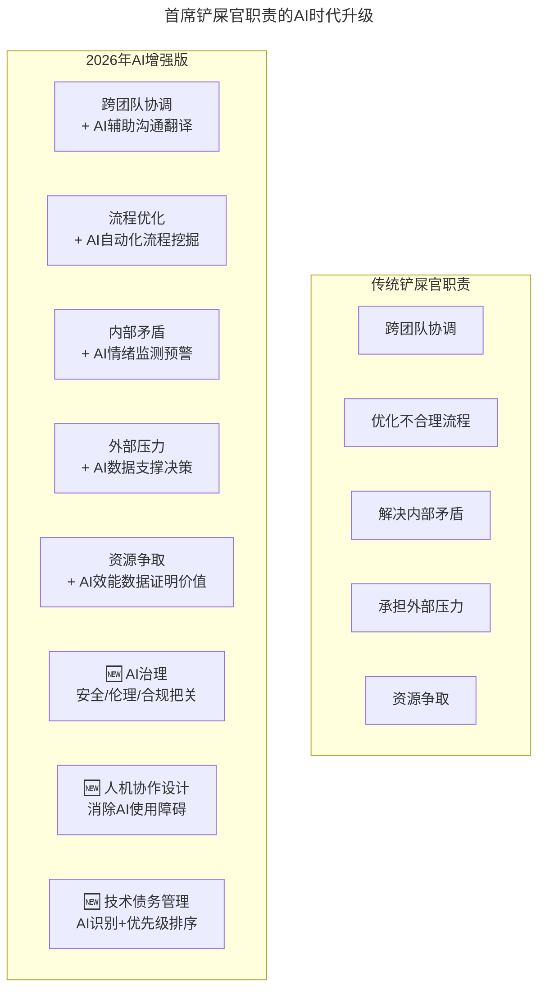
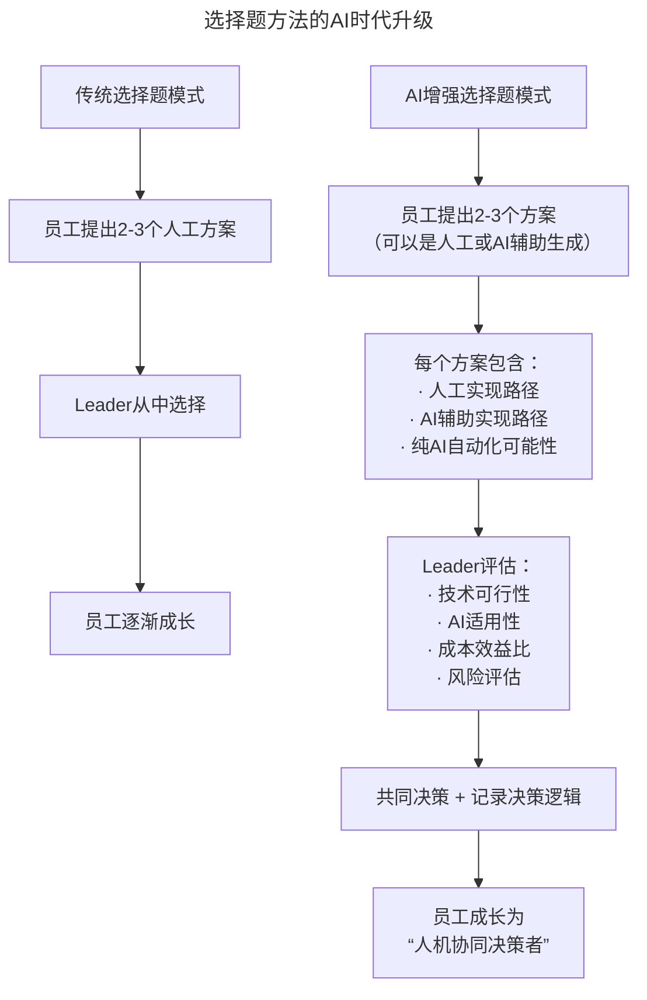
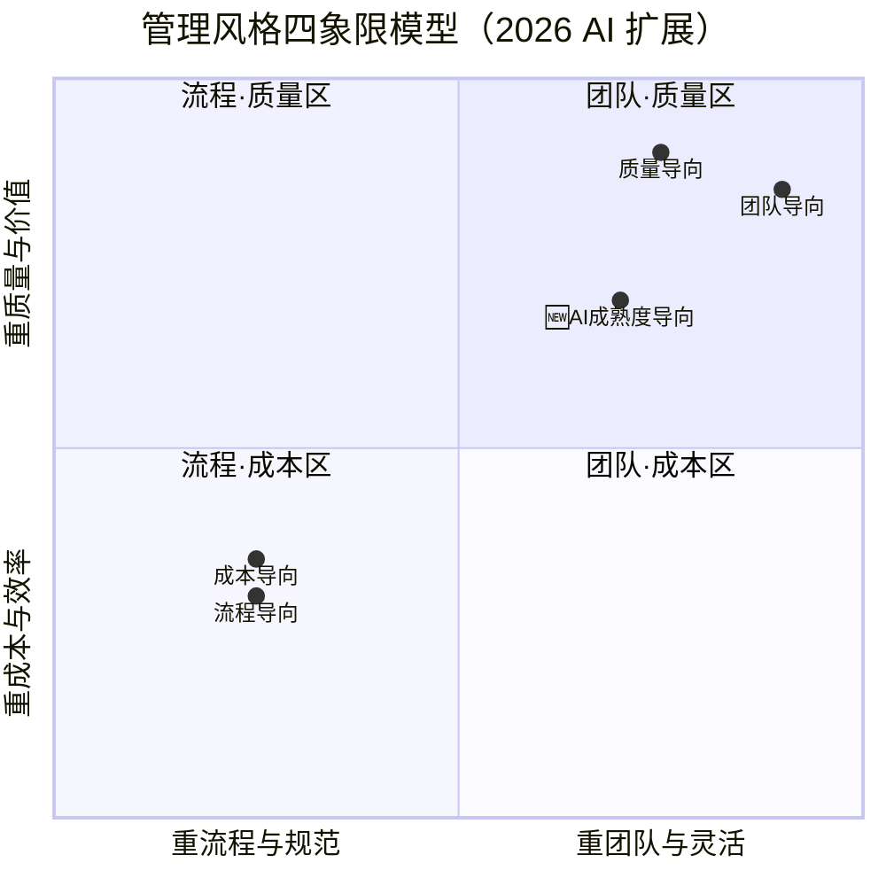
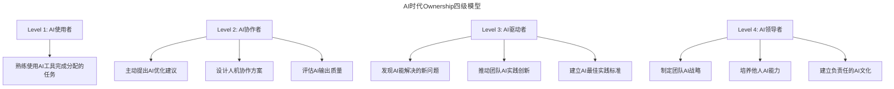

# 大咖对话 | 管理者是首席铲屎官？

> **适用范围**：技术管理者、团队 Leader、项目经理，以及希望从技术专家转型管理者的工程师。
>
> **更新摘要（v2 · 2026-08 更新）**：
> - 结构化升级为 6 节骨架（导言 / 核心方法论 / 关键流程 / 工具与实战 / 常见误区 / 进阶延展）
> - 保留原文全部 Q&A 内容与 2026 AI 时代升级注解
> - 为首席铲屎官 AI 升级图、选择题 AI 版本流程图、管理风格四象限模型图、Ownership 四级模型图补充 title frontmatter 与文字解读
> - 整合行动清单、决策模板到对应章节

---

## 1. 导言

本周作客"大咖对话"的嘉宾是陈皓。网名左耳朵耗子，独立运营技术博客酷壳 CoolShell，也是极客时间《左耳听风》专栏的作者。他拥有 20 年软件开发及相关工作经验，在团队管理、项目管理，以及程序员个人成长等方面拥有自己独特的见解和方法。今天，我们和他探讨了该如何修炼成优秀的技术管理者。

陈皓（左耳朵耗子）的管理哲学：

1. **管理三件事**：管人、管事、自我管理
2. **Leader = 首席铲屎官**：清除障碍、过滤压力、承担责任
3. **激励 > 命令控制**：用协作和引导激发主人翁精神
4. **选择题 > 问答题**：逼出员工的思考能力
5. **管理风格无定式**：找到适合自己的平衡

---

## 2. 核心方法论

### 2.1 打造高效研发团队：管理三件事

**极客时间：在您看来，如何才能打造高效的研发团队呢？**

**陈皓**：管理基本上是三个事，管人、管事和自我管理。

**管人的意思就是管团队**，除了要招聘到很好很强的人才，组建一个很强的团队，并不断提高团队的实力之外，还需要做的是激发团队的热情，培养他们的主人翁精神，这样才能够更高效地开发日益复杂的软件产品、解决日益困难的技术问题。因此，管理者需要在各个方面都坚持比较高的标准，并不断地提高团队的能力标准。

**管事的意思是要找准方向**，如果你的方向是错的，即使你有一个好的团队，也是没法高效起来的。另外，找到正确的方向之后，还要落地执行，而在执行过程中，会有各种各样的问题需要你去解决，包括对第三方的依赖、条件受限（时间不够、人力不足）、以及各种没有考虑到的项目风险。有时，一个小问题就可能会影响到整个项目的进度。所以，如何把复杂的逻辑简化掉（简化而不是简陋），如何把复杂的问题拆解成小问题并各个击破，如何在受限的条件下抓重点，如何说服别人统一大家的目标……这些都是管理者需要负责的。

**自我管理的意思是说管理者自身的素质和自我的成长**，通常来说，管理者就是这个团队的天花板，如果管理者自己不成长，那么团队就会受限，所以，管理者要修炼自己硬技能和软技能等各方面的能力，包括个人魅力、沟通能力等，从而提高自己的影响力。所谓影响力并不在于职位高低，而是当别人有困难的时候，是否会想到向你寻求建议或支持。一个 leader 的关键素养就是要能服众，能获得团队和客户的信任，之后，自然会赢得老板的信任。

如果这三个方向能做好，那一定能打造出一个非常好的研发团队。

### 2.2 优秀技术管理者的两个素质

**极客时间：一位优秀的技术管理者必备的能力和素质有哪些？**

**陈皓**：好的管理者一定要具备两个素质，一是明白自己的定位，二是能激励团队。

**先来说第一个素质，自我定位。** 要明白作为管理者，是来帮助团队，而不是阻碍他们前进、阻碍他们创新的。因此，如果你懂，你就一起来干，如果你不懂，那就相信团队，放手让团队去做，千万别外行领导内行，这是非常不好的做法。

我一直戏称 leader 是首席铲屎官，团队在前进的过程中，一定会遇到很多阻碍，这时候就需要 leader 在前面把这些不好的东西都解决掉。

比如跨团队合作时，跟其他团队的沟通与协调；比如团队遇到不合理的流程时，leader 需要将其不断优化；比如遇到团队内影响士气的不和谐声音时，leader 就需要狠得下心去解决；比如面对客户、老板等压力时，leader 需要一肩承担等等。

当然，这里不是说就不能给团队压力了，而是说不能把没有经过过滤的负面的外部压力直接传递给团队。你给团队的压力，一定是你已经消化过的、跟团队整体成长相关的正面压力。

因此，管理者肯定是孤独的，哭得自己哭、压力得自己扛，但取得的成绩、获得的好处一定得交给整个团队。最糟糕的做法就是成绩是自己的，问题是团队的，这样一定会导致众叛亲离。

**再来说第二个素质，能激励团队**，也就是能驱动团队成员有主人翁精神、有 ownership。技术研发是知识密集型项目，不能沿用传统的"命令与控制"Command & Control 的管理方法。这种管理模式之下，大家多会觉得所做的事情与我无关，是你老板的事情。

激发主人翁精神的一个关键就是让团队成员有参与感，而要让他们获得参与感就需要赋予他们建议权甚至是决定权。同时，领导者需要往后退一步，把命令变成协作和引导。

所谓协作，就是我们彼此帮助，团队的事务和进度不是来自于老板的鞭打，而是来自团队成员间的相互协作，同时管理者还要兼顾到员工的兴趣点，你为他们实现理想，他们才会为你实现理想。

所谓引导，就是我不再以指令和控制的形式告诉你要做什么，而是通过给出一些问题、提供一些工具或方法让团队成员自己找到答案，管理者这时要做的不是一个奴隶主，而是一个教练或是一个老师，传道授业解惑。

这里的关键其实就是看管理者的心胸够不够大，能不能容忍员工犯错，错误是成长的关键，只有痛过，才会真正努力。另外，管理者还要多问问自己，你是更多地关注事情的结果，还是员工的价值与成长；你是更多地关注眼下的事情，还是长远的目标。

在协作和引导这两种方式的共同效益下，员工会有非常高的参与感和归属感。当然，当你需要去攻坚、去打硬仗的时候，还是需要 Command & Control，但这不应该成为常态，而是在特殊情况下采取的特殊手段。

在具体执行中，一个比较好的方法就是变问答题为选择题。问答题就是员工会问这事怎么做，这个问题怎么解，而你告诉他该这么做，这样的模式下，员工永远成长不起来，团队也不会变强。

选择题就是引导员工，下次再说什么事，先拿出一二三个方案，列出每个方案的优缺点，并给出他们看好的方案，你再在其中做选择，这样就会逼着他们去想各种解决方案。同时，如果每次他们的选择跟你的相似，那么就表明他们已经锻炼出来了，可以自己做决定了，你也就可以放权给他们了。

**给员工放权的多少是一个团队是否强大的表现。最差的管理是家长式的保姆式的管理。**

### 2.3 找到适合自己的管理风格

**极客时间：如何才能找到适合自己的管理风格呢？**

**陈皓**：我之前讲了那么多，其实都只是我的管理经验，我的管理更偏人性化风格一点，但每个人的管理风格是不一样的，也没有哪一种定式的风格是最好的。

在管理的象限图中，第一象限是团队，第二象限是质量，第三象限是流程，第四象限是成本。

不同的管理风格会偏重不同的象限，而且一个管理者最多只能偏重其中的两项，而且还不能是处在对角线上的。因为对角线都是有冲突的，比如太注重流程，团队就会没有活力，或者关注质量，成本就难免会变高等。另外，相邻的两个象限是互补的，比如好的质量必须要好的团队和高效的流程来保证。

每个人的管理风格都是不一样的，而我的风格更偏重团队和质量这两点。大家也可以做一些测试来测自己的管理风格，比如当系统出现故障的时候，你会怎么办？是先惩罚人，还是先弥补流程，还是先总结错误。其中并没有哪个答案是标准答案，就看你选择什么，而你的选择会展示你的偏好。

最后，没有定式的管理方法，找到自己的管理风格是最重要的。

### 2.4 AI 时代验证

| 2018 年观点 | 2026 年 AI 时代的演绎 |
|-----------|-------------------|
| "Leader 是首席铲屎官" | **"Leader 是'人+AI'混合体的首席架构师和清道夫"**——不仅要清障碍，还要设计人机系统 |
| "不能外行领导内行" | **"不能不懂 AI 还指挥 AI 使用"**——Leader 必须亲身实践 AI 编程 |
| "过滤负面压力" | **"过滤 AI 焦虑 + 转化 AI 压力为动力"**——帮团队建立正确的 AI 认知 |
| "给团队正面压力" | **"设定有挑战性但可达成的人机协作目标"**——不是压榨，是共同成长 |
| "变问答题为选择题" | **"变'帮我写代码'为'给我 3 个 AI 方案'"**——培养 AI 时代的决策能力 |

---

## 3. 关键流程

### 3.1 首席铲屎官的 AI 时代升级版



上图展示了首席铲屎官职责从传统到 AI 时代的升级。原有五项职责（跨团队协调、流程优化、内部矛盾、外部压力、资源争取）均叠加了 AI 增强能力；同时新增三项职责——AI 治理（安全/伦理/合规把关）、人机协作设计（消除 AI 使用障碍）和技术债务管理（AI 识别+优先级排序）。2026 年的 Leader 不仅要清障碍，还要设计人机系统。

### 3.2 "选择题"方法的 AI 版本



上图展示了"选择题"方法从传统到 AI 时代的升级。传统模式下员工提出 2-3 个人工方案，Leader 从中选择；AI 增强模式下每个方案都包含人工实现路径、AI 辅助实现路径和纯 AI 自动化可能性三种维度，Leader 评估时需考虑技术可行性、AI 适用性、成本效益比和风险评估。最终目标是培养员工成为"人机协同决策者"。

**实际案例：**

```
场景：需要实现一个新的用户推荐功能

❌ 问答题模式：
员工："这个功能怎么实现？"
Leader："用协同过滤算法，调用XX库..."

✅ 选择题模式（2018版）：
员工："我有三个方案：A.协同过滤 B.内容推荐 C.混合推荐
      各有优劣..."
Leader："选C，理由是..."

✅✅ 选择题模式（2026版）：
员工："我有三个方案：
 A. 传统协同过滤（开发2周，准确度70%）
 B. 基于DeepSeek V4的RAG推荐（开发3天，准确度85%，但有幻觉风险）
 C. 混合方案：规则引擎 + AI微调（开发1周，准确度82%）
 
 每个方案我都考虑了人机分工..."
Leader："选C，理由是平衡了效果和可控性。
     另外建议：先用AI快速出MVP验证假设，
     再投入工程资源优化。"
```

### 3.3 管理风格象限图的 AI 扩展



上图将原文的四象限管理风格模型落为可视图：横轴为"流程与规范—团队与灵活"、纵轴为"成本与效率—质量与价值"，对角线相冲（团队↔流程、质量↔成本）、相邻互补（如好质量需要好团队与好流程保证），与原文描述一致；陈皓自述"更偏重团队和质量"，即落在右上"团队·质量区"。2026 年可将"AI 成熟度"作为新维度叠加，衍生出 AI 先锋型（高团队 + 高 AI 成熟度，鼓励实验快速迭代）、AI 稳健型（高质量 + 高 AI 成熟度，注重 AI 输出质量和安全性）、AI 效率型（高流程 + 高 AI 成熟度，标准化 AI 工作流追求规模效应）等新风格。

---

## 4. 工具与实战

### 4.1 成为 AI 时代的"超级铲屎官"（行动清单）

```
Daily（每日）：
□ 15分钟AI效能仪表盘检查
  - 团队AI使用率
  - AI生成代码通过率
  - 异常预警
  
□ 过滤外部AI压力
  - 不盲目追逐每个新AI热点
  - 将"老板要求用AI"转化为具体的实验项目
  - 给团队稳定的AI探索环境

Weekly（每周）：
□ 1on1交流（30分钟/核心成员）
  - 了解AI使用中的障碍
  - 收集AI工具改进建议
  - 分享AI最佳实践
  
□ 清除AI协作障碍
  - 工具配置问题？→ 立即解决
  - 流程不适应AI？→ 快速调整
  - 团队成员抵触？→ 沟通理解

Monthly（每月）：
□ 团队AI成熟度评估
  - 使用AI Maturity Model评分
  - 识别Top performer和需帮助者
  - 调整培训和支持策略

□ AI技术债务审查
  - AI生成的代码质量问题
  - Prompt质量退化
  - 工具链碎片化问题
```

### 4.2 新的"选择题"模板

```
【决策请求】
问题描述：（清晰描述要解决的问题）

方案A：
- 实现方式：（人工/AI/混合）
- 预估时间：
- 优点：
- 缺点：
- AI风险点：

方案B：
- （同上）

方案C：
- （同上）

我的推荐：X
理由：

需要支持：（资源/权限/决策）
```

### 4.3 如何在 AI 时代展现"Ownership"



上图展示了 AI 时代 Ownership 的四个层级。Level 1（AI 使用者）只需熟练使用 AI 工具完成分配任务；Level 2（AI 协作者）开始主动提出优化建议和设计人机协作方案；Level 3（AI 驱动者）能发现 AI 能解决的新问题并推动团队创新；Level 4（AI 领导者）制定团队 AI 战略、培养他人能力并建立负责任的 AI 文化。每提升一级，对团队的价值贡献显著增加。

**具体行动：**
- [ ] 这周：主动记录 1 个"如果用 AI 可以做得更好"的场景
- [ ] 本月：向 Leader 提出 1 个人机协作优化建议
- [ ] 本季度：在团队内分享 1 次 AI 使用经验
- [ ] 半年内：成为小组内的 AI Go-to Person

---

## 5. 常见误区

1. **外行领导内行**：如果你不懂，那就相信团队，放手让团队去做。在 AI 时代，"不能不懂 AI 还指挥 AI 使用"——Leader 必须亲身实践 AI 编程。

2. **把未过滤的压力传给团队**：不能把没有经过过滤的负面的外部压力直接传递给团队。给团队的压力必须是已经消化过的、跟团队整体成长相关的正面压力。AI 时代还需过滤"AI 焦虑"。

3. **成绩归自己，问题归团队**：最糟糕的做法就是成绩是自己的，问题是团队的，这样一定会导致众叛亲离。AI 成功是团队的，AI 翻车你要顶上。

4. **用问答题而非选择题**：问答题模式下员工永远成长不起来。要引导员工拿出 2-3 个方案（含 AI 辅助方案），列出优缺点，逼出思考能力。

5. **家长式保姆式管理**：最差的管理是家长式的保姆式的管理。给员工放权的多少是一个团队是否强大的表现。AI 时代最差的管理是"既不让用 AI，又不会用 AI，还不懂 AI"的瞎指挥。

6. **管理风格追求定式**：没有定式的管理方法，找到自己的管理风格是最重要的。一个管理者最多只能偏重两个象限，且不能是对角线上的。

---

## 6. 进阶延展

### 6.1 总结

陈皓（左耳朵耗子）2018 年的管理哲学——**"首席铲屎官、选择题优于问答题、激励而非命令"**——在 AI 时代不仅没有过时，反而更加重要。

**核心理念升级：**

> 2018: Leader = 清除障碍 + 承担责任 + 激励团队  
> **2026: Leader = 设计人机系统 + AI 战略把控 + 培养'AI 军团指挥官' + 守住人文底线**

> 2018: 最差的管理是保姆式管理  
> **2026: 最差的管理是"既不让用 AI，又不会用 AI，还不懂 AI"的瞎指挥**

**最重要的不变：**
- 管理者的孤独感（**AI 时代更需要你在前方探路**）
- 成绩归团队，责任自己扛（**AI 成功是团队的，AI 翻车你要顶上**）
- 培养人胜过替代人（**AI 是放大器，不是替代品**）

**最大的变化：**
- 从"保护团队免受外界干扰"到**"保护团队免受 AI 焦虑干扰 + 引导正确使用 AI"**
- 从"自己做选择题"到**"设计让人+AI 都能参与的决策框架"**

### 6.2 参考与延伸

*注解生成时间：2026 年 6 月 | 基于 AI 时代管理实践和 Leadership 最新研究更新。参考：CoolShell Archive、HBR on AI Management 2026、MIT Sloan on AI Leadership。*
