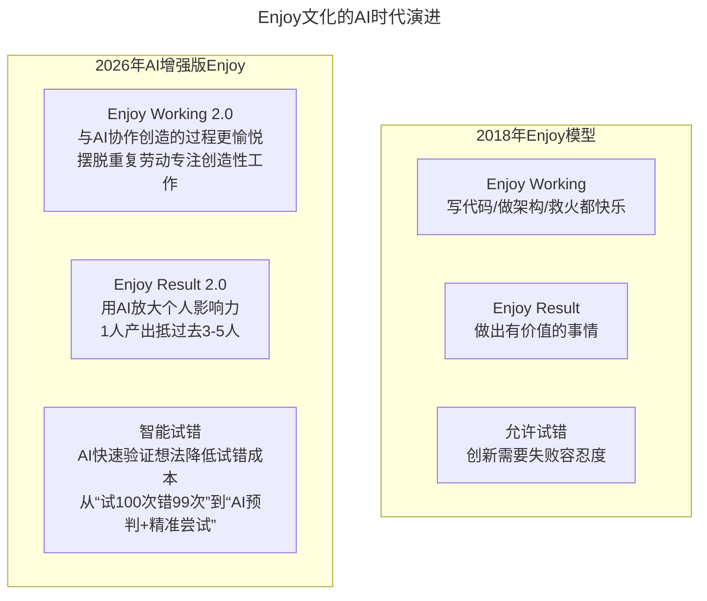
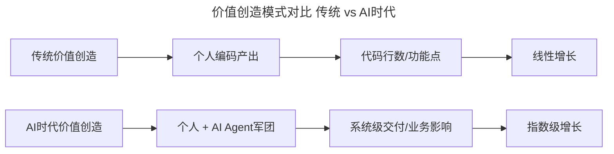
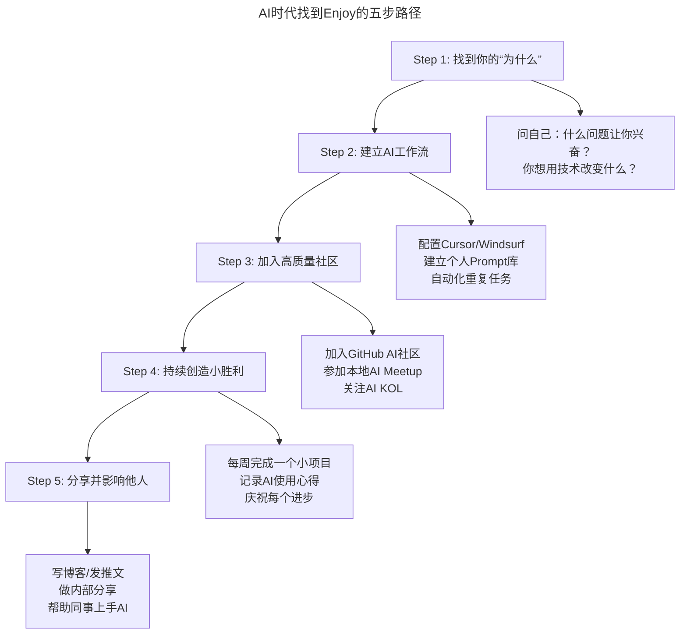

# 大咖对话 | 让团队成员持续的 enjoy

> **适用范围**：CTO/技术 VP、技术团队管理者、创业者，以及希望建设技术团队文化的管理者。
>
> **更新摘要（v2 · 2026-08 更新）**：
> - 结构化升级为 6 节骨架（导言 / 核心方法论 / 关键流程 / 工具与实战 / 常见误区 / 进阶延展）
> - 保留原文全部 Q&A 内容与 2026 AI 时代升级注解
> - 为 Enjoy 文化 AI 演进图、价值创造模式对比图、个人开发者成长路径图补充 title frontmatter 与文字解读
> - 整合 Enjoy 文化实操指南与行动清单到对应章节

---

## 1. 导言

又到了"大咖对话"时间，今天的嘉宾是饿了么 CTO 张雪峰。2015 年初，他正式加入饿了么担任 CTO，之后饿了么的业务迅速发展。今天，其订单量仅次于淘宝和滴滴，与美团不相上下。亮眼数字背后，饿了么技术团队背负的压力可想而知。今天我们就请张雪峰谈谈他对于技术团队文化的一些感悟。

张雪峰（饿了么 CTO）的团队文化理念：

1. **Enjoy = Enjoy Working + Enjoy Result**：过程快乐 + 结果有价值
2. **技术文化三要素**：极致、激情、创新
3. **没有 Best Practice，只有 Suitable Practice**：管理方法要适应业务阶段
4. **允许试错成本**：创新需要宽容失败的文化土壤

---

## 2. 核心方法论

### 2.1 创业公司技术团队的成长

**Q：作为 CTO 陪伴饿了么一路成长到现在的规模，你最大的收获是什么？**

**张雪峰**：最大的收获就是一直支持我、陪伴我，能够坚持走到今天的团队，这听上去是个套话，但是确实不容易，因为我们是个创业公司，一开始也是一穷二白。我加入的时候，技术团队只有 30 多个人，分工也不完善。但是那时候被业务逼得就得迅速招人，而且那时候肯定是顾不上太多，不可能像 BAT 这些大厂去精挑细选，我们直接就先把人招进来干活，通过干活，相当于以赛代练。当然可能会出现一些问题，这个过程中就优胜劣汰了。这个团队到今天还留在这的同学，或者坚持 3 年以上的同学真的是不容易，没有他们我早就下台了。他们能够坚持下来，也是我自己能坚持下来最大的动力。

在此过程中，组织架构变化、研发流程优化更是家常便饭。不过无论如何变化，有一点却是不变的：研发管理，没有所谓 Best Practice（最佳实践），只有适应业务发展且生命周期有限的 Suitable Practice。

这一切有个前提，就是我们的创始团队对于我的信任，让我可以放手大胆的干，这也是在创业公司的好处，大公司你肯定会有很多的限制和约束。这两点缺任何一个，团队都走不到今天，我也走不到今天。当然公司会怎么样也不好说。

这三年多真的是靠毅力熬过来的，创业公司资源相对少，虽然有融资，但说实话，每天 CEO 一起床就多少钱出去了，不光是人员的工资这些，像我们做外卖，一天的营销费用也是蛮惊人的。我可能考虑的不是这个问题，我要把系统做稳定。其实我是 2014 年 9、10 月份开始接触饿了么，因为我跟饿了么联合创始人汪渊关系很好，就担任了他的技术顾问。后来出现了一些"火情"，他就说兄弟要不一起搞吧，我就来了。我加入之后也不可能马上见效，还是会挂掉，靠人肉上去顶，慢慢才稳定下来。你没有一点毅力，没有一点心理承受能力，真的支撑不下来。

### 2.2 饿了么的技术团队文化

**Q：我们知道饿了么非常重视技术文化，那么饿了么的技术团队文化到底是什么？**

**张雪峰**：饿了么的技术文化经历过两个阶段，新的文化我就不展开讲了，内容比较多，早期蛮简单的，就三个词：极致、激情、创新。到今天为止，我认为我们技术文化也主要是围绕这三点。

激情的意思是，在顺风顺水的时候有激情是正常的，在不顺利，或者有坎坷的时候，你还能保持激情，这才是激情真正的含义。我们其实经历了很多坎坷挫折，尤其在高峰期系统挂掉的时候，外面铺天盖地的吐槽，这时候你的压力会非常大，你会有挫折感。这时候如果没有一些东西支持你，那可能你要么放弃，要么就听之任之。不管怎么样，更多是在逆境的情况下，保持激情非常重要。如果无法让团队始终充满激情，不可能有持续极致成果。

最后是创新，创新也是我们这个团队的一个很重要的基因。外卖行业大部分新鲜的东西，或者现在被验证成功的东西，都是饿了么首创出来的。这跟创始团队的基因很有关系，创始团队对技术很重视，很多时候创新是靠技术来带动。还有商业模式创新。我自己原来其实不是很有创新精神，但是进了这个团队之后，我受这点影响很大，你不能预测对与错，但至少要去试一试。创新有个近似词叫试错，试错就是大部分试下来是错的，只有很小的概率能试对。所以创新需要激情去支撑。

这就是我们说的极致激情创新，我们技术团队没有把这些作为口号，也没有标语，就是大家一直在潜移默化中这样做。

### 2.3 帮助新人融入团队文化

**Q：新人加入之后，怎样能够帮助他们融入这种团队文化？**

**张雪峰**：我们新人进来之后，可能有岁数比较大的，就像我刚进来，我也有一点吃不准自己能不能适应这种文化，解决办法很简单，就是让他能够 enjoy，而且能够持续的 enjoy。人只有在快乐的前提下，做他有兴趣的事，才能够做好。

enjoy 有两个层面，一个是 enjoy 过程，我们叫 enjoy working，你自己不管写程序也好，做产品设计也好，做架构也好，包括网站宕机去救火，你要 enjoy 这个过程，做你喜欢的事。新同学来了之后，我们会让他们去体验，先选自己喜欢的事，当然也不可能每个人都想去那个岗位就去那个岗位，但我们会尽可能做到。结果方面，允许一定的失败率，就是这个项目不成功，或者你这个项目成功，但你在项目中并没有做得非常好，这方面我们允许一定的试错成本。

还有就是 enjoy result，光讲过程没有结果也不行，因为公司毕竟不是福利院，即使试错 100 次失败了 99 次，你好歹也要有一次靠谱。总的来说就是要让同学们做自己喜欢的事，而喜欢的事又能给公司带来价值，毕竟我们是个商业公司，要让团队持续的 enjoy，如果说今年享受过一个成果之后，明年就一下子掉下去了，这也不行，我们要一直创造一些很有意思的东西让大家去做。

除了公司的收益，还有一件事，这几年公司一直在强调，就是社会价值，或者说社会责任。因为我们毕竟做的是一个食品相关的行业，食品安全还有我们的骑手的安全，还有比如最近我们做的一个寻找走失儿童的行动。你的业务上正好有一个环节可以去延展一下，就能创造社会价值，这也是能够让团队成员 enjoy 的。

### 2.4 AI 时代验证

**关键数据（2026）：**
- 使用 AI 编程工具的开发者**工作满意度提升 37%**（Stack Overflow 2026）
- **78% 的工程师**表示 AI 让他们从繁琐工作中解放，更有时间做有创造力的事
- 团队引入 AI 后，**创新想法的验证周期从 2 周缩短到 2-3 天**

---

## 3. 关键流程

### 3.1 Enjoy 文化的 AI 时代演进



上图展示了 Enjoy 文化从 2018 年到 2026 年的演进。Enjoy Working 从"写代码/做架构/救火都快乐"升级为"与 AI 协作创造的过程更愉悦，摆脱重复劳动专注创造性工作"；Enjoy Result 从"做出有价值的事情"升级为"用 AI 放大个人影响力，1 人产出抵过去 3-5 人"；试错机制从"允许失败成本"升级为"AI 快速验证想法降低试错成本"。核心理念不变，但实现路径因 AI 而大幅升级。

### 3.2 Enjoy Working 的进化：从"热爱编码"到"热爱与 AI 共创"

| 传统 Enjoy Working | AI 时代 Enjoy Working |
|-----------------|-------------------|
| 享受写出优雅代码的快感 | **享受用自然语言描述需求、AI 瞬间生成的魔法感** |
| 享受攻克技术难题的成就感 | **享受设计 Prompt、调优 AI 输出的艺术创作感** |
| 享受架构设计的宏观视野 | **享受设计人机协作系统架构的系统思维** |
| 救火的紧张刺激 | **AI 预警 + 自动化运维，更多享受从容** |

**真实场景举例：**
```
2026年工程师的一天：
09:00 - 用AI生成项目脚手架（5分钟 vs 过去2小时）
10:00 - 与产品经理讨论需求，AI实时生成原型（即时反馈）
14:00 - 核心逻辑开发，AI Pair Programming（效率提升300%）
16:00 - Code Review，AI初筛 + 人工复审（质量更高）
17:00 - 技术分享会：展示如何用Agent自动化测试流程

结果：更多时间思考架构、学习新技术、帮助队友 → 更Enjoy
```

### 3.3 价值创造模式的变革



上图对比了传统与 AI 时代的价值创造模式。传统模式下价值来自个人编码产出，以代码行数/功能点衡量，呈线性增长；AI 时代价值来自"个人+AI Agent 军团"的协同，以系统级交付/业务影响衡量，呈指数级增长。新的价值衡量标准不再是写了多少行代码，而是用 AI 解决了什么问题、创造了多少业务价值、帮助团队提升了多少效率。

### 3.4 试错成本的革命性降低

| 维度 | 2018 年试错 | 2026 年 AI 辅助试错 |
|-----|-----------|-----------------|
| 验证一个想法 | 2-4 周开发原型 | **2-3 天 AI 生成 MVP** |
| 技术方案可行性 | 需要实际编码验证 | **AI 代码模拟 + 静态分析** |
| 用户反馈收集 | 上线后等数据 | **AI 用户模拟 + A/B 测试预测** |
| 失败成本 | 时间 + 人力 + 机会成本 | **大幅降低，快速迭代** |

**这意味着：**
> 创新不再是勇敢者的赌博，而是**快速实验者的日常**

### 3.5 极致、激情、创新的 AI 演绎

- **极致（Extreme）**：2018 把功能做到最好 → 2026 **把人机协同体验做到极致**
- **激情（Passion）**：2018 逆境中保持热情 → 2026 **在 AI 快速迭代中保持学习热情**
- **创新（Innovation）**：2018 技术驱动业务创新 → 2026 **AI 原生创新**——不是"用 AI 优化旧流程"，而是"想象 AI 使能的新可能性"

---

## 4. 工具与实战

### 4.1 打造 AI 时代的 Enjoy 文化（实操指南）

```
Phase 1: 工具赋能（第1个月）
□ 为团队配置顶级AI编程工具（预算：$50-100/人/月）
□ 建立团队共享Prompt库（知识资产沉淀）
□ 设置"AI探索时间"（每周4小时，自由探索AI新用法）

Phase 2: 文化重塑（第2-3个月）
□ 重新定义"卓越"标准：从代码量→业务价值+AI协同效率
□ 设立"AI创新奖"：奖励最佳AI应用实践
□ 建立"无指责Post-mortem"：AI实验失败不追责，只学习

Phase 3: 系统升级（第3-6个月）
□ 引入AI项目管理工具（Linear AI / Notion AI）
□ 重构CI/CD流水线：集成AI代码审查和安全扫描
□ 建立"AI成熟度模型"：评估和提升团队AI能力
```

### 4.2 新的团队活动建议

1. **AI Hackathon 季**：每季度举办一次，主题如"用 Agent 自动化最痛苦的流程"，奖励最有创意的人机协作方案

2. **Prompt Engineering 大赛**：类似于当年的算法竞赛，看谁能用最精准的 Prompt 解决复杂问题

3. **"AI Pair Programming"轮换日**：每周五下午两人一组结对编程，一人操作 AI，一人审查输出，轮流切换

### 4.3 如何在 AI 时代找到 Enjoy



上图展示了在 AI 时代找到 Enjoy 的五步路径：从找到"为什么"（什么问题让你兴奋），到建立 AI 工作流（配置工具+Prompt 库），再到加入社区（GitHub/Meetup/KOL），持续创造小胜利（每周一个小项目），最后分享并影响他人（博客/分享/帮助同事）。每一步都层层递进，最终形成"学习→实践→分享→影响"的正循环。

**立即行动清单：**
- [ ] 今天：安装 AI 编程助手，完成首次配置
- [ ] 本周：用 AI 完成一个小项目（如个人网站、脚本工具）
- [ ] 本月：总结 10 个让你效率倍增的 Prompt 模板
- [ ] 本季度：在团队内做一次 AI 编程经验分享

---

## 5. 常见误区

1. **追求 Best Practice**：研发管理没有所谓 Best Practice，只有适应业务发展且生命周期有限的 Suitable Practice。盲目套用其他公司的"最佳实践"往往水土不服。

2. **Enjoy 只讲过程不讲结果**：光讲过程没有结果也不行，公司毕竟不是福利院。即使试错 100 次失败了 99 次，好歹也要有一次靠谱。Enjoy = Enjoy Working + Enjoy Result。

3. **忽视逆境中的激情**：顺风顺水时有激情是正常的，在不顺利或有坎坷时还能保持激情才是激情真正的含义。系统挂掉、外面吐槽时最需要激情支撑。

4. **AI 时代仍以代码量衡量价值**：2026 年的价值衡量标准不再是写了多少行代码，而是用 AI 解决了什么问题、创造了多少业务价值、帮助团队提升了多少效率。

5. **试错成本过高导致不敢创新**：2026 年 AI 使试错成本大幅降低——验证一个想法从 2-4 周缩短到 2-3 天。如果还用传统方式试错，创新速度会远落后于竞争对手。

6. **忽视社会价值**：除了公司收益，社会价值/社会责任也是让团队成员 enjoy 的重要因素。业务上的环节延展就能创造社会价值。

---

## 6. 进阶延展

### 6.1 总结

张雪峰 2018 年的洞见——**"让团队成员持续的 enjoy"**——在 AI 时代有了全新的实现路径和更深的意义。

**核心升级：**

> 2018: Enjoy = 做喜欢的事 + 创造价值  
> **2026: Enjoy = 与 AI 共创的愉悦感 + 放大后的价值创造 + 快速试错的创新循环**

**对管理者的启示：**
- 提供最好的 AI 工具（这是新时代的"阳光雨露土壤"）
- 重新定义成功标准（从苦劳转向功劳+创新）
- 容错机制升级（鼓励 AI 实验，降低试错门槛）
- 关注人的感受（AI 是工具，幸福感和归属感才是目标）

**最终目标不变：让每个人在工作中找到快乐和意义。只是现在，AI 让这条路更宽广、更有趣。**

### 6.2 参考与延伸

*注解生成时间：2026 年 6 月 | 基于 2026 年开发者幸福感调查更新。参考：Stack Overflow Developer Survey 2026、GitHub Copilot Impact Report 2026。*

---

*作者简介：张雪峰，饿了么 CTO，TGO 鲲鹏会上海分会会员。曾带领携程软件架构团队 & 框架研发团队，后担任携程国际 BU CTO。曾有过一次创业经历（教育行业），深知创业之痛并快乐着的感觉。*
