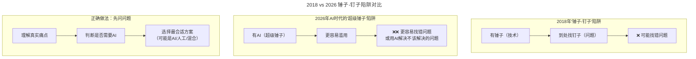

# 大咖对话 | 陶真：技术人要爱上问问题，而不是自己的解决方案

> **适用范围**：技术管理者、技术骨干、有志于向产品/管理转型的工程师，以及所有希望在AI时代保持清醒技术判断力的从业者。

> **更新摘要（v2 · 2026-08 更新）**：
> - 结构化升级为 6 节骨架（导言 / 核心方法论 / 关键流程 / 工具与实战 / 常见误区 / 进阶延展）
> - 保留陶真原文完整访谈内容，重组为"问题导向"主题脉络
> - 将2018年"锤子-钉子"陷阱升级为2026年AI时代"超级锤子"陷阱分析
> - 新增AI时代"问问题"的8个新维度和"问题导向"团队管理实操指南
> - 整合原文独立的AI时代注解内容到对应章节，避免内容割裂

---

## 1. 导言

本周大咖对话嘉宾是上上签电子签约联合创始人、首席技术官及产品官，TGO 鲲鹏会会员陶真。在回国加入上上签之前，陶真曾先后在美国一线 SaaS 服务公司Intuit及Paycor担任VP和CTO职务，拥有20多年技术开发经验和丰富的管理经验，并在2008 年获得了宾夕法尼亚大学沃顿商学院的工商管理硕士学位（MBA）。

陶真的核心理念可以凝练为一句话：**"爱上问题，而不是爱上你的解决方案。"** 这一理念在2018年提出时直击技术人"技术导向"的通病，而在2026年AI全面普及的背景下，它的重要性不减反增——当AI成为一把"超级锤子"，技术人更容易陷入"用AI解决一切问题"的陷阱。

本文将围绕陶真的访谈内容，系统梳理其"问题导向"思维框架，并结合2026年AI时代的新语境给出可落地的升级方案。

### 📌 核心观点回顾

陶真（上上签CTO）的核心哲学：
1. **"好奇心"驱动成长**：多问为什么，理解业务本质
2. **从问问题开始建立信任**：让对方自己得出结论
3. **爱上问题，而非解决方案**：避免"锤子-钉子"陷阱
4. **技术与非技术视角结合**：能听懂业务语言，也能翻译成技术语言
5. **专注核心价值**：不重复造轮子，借助外部力量

---

## 2. 核心方法论

### 2.1 好奇心驱动的成长路径

**极客时间：作为技术管理者，您为什么会选择去读MBA呢？**

**陶真：** 去沃顿念 MBA 对我的视野，看东西的视角有很大的增进。MBA 可以把一个技术管理人员的视野拓宽到技术之外，去了解做技术的目的，或者说做这项技术对改变世界、优化客户的流程、解决他们的痛点到底有什么实质性的作用。当把视野放高了之后，反倒能在技术上更加地如鱼得水，可以避免去做一些技术上感觉很热闹，但并不一定有商业产出能效的事情。

其实，我选择去攻读 MBA，主要是出于"好奇心"。我在美国从事第一份工作的时候，就跟别人"不同"，我会多问一点，别的程序员可能照着需求，直接或者加一点猜测就去埋头做了，但是我会先快速做出一点来，给产品经理看一看，问一问，了解为什么要做这个东西，有时候还会协助他们去做一些优化。

后来产品经理、销售就会带我去见客户，跟客户去沟通，帮他们解决技术产品上的一些限制，这对他们的工作也有很大的促进。有时候他们处理不好客户要求、焦头烂额的时候，就会带上我去跟客户沟通，通过技术、通过功能、通过对客户问问题这些方法，让客户变得非常合作，愿意跟我们一起创新，也愿意去接受一些他们无法向客户解释清楚的时间点或者功能的改进。

当有这样一个开端之后，这些商务人员遇到其他一些产品计划的时候，就会很主动的让我去参与，这对我自己也是非常大的增进。那时候就萌发了一个想法，就是作为一个技术管理人员，要怎么把商务的东西了解好？把公司的价值做好？把客户的价值做好？所以觉得去读一个管理方面的学位会有很大的帮助。

另外，这份"好奇心"也让我养成了喜欢从技术和非技术的角度去看问题，去跟各种不同的人做沟通的工作方式。当时我在 ADP 之所以会做的比较突出，不仅仅是因为技术方面很强，而是我能够跟非技术的管理人员有非常好的沟通，像当时公司的产品销售、高管们非常乐于来跟我沟通一些商务上的事情，觉得我是极少的这些技术高管里面，能够听懂他们讲话，也能把事情讲成他们听得懂的人。

### 2.2 通过提问建立信任

很多矛盾其实跟沟通方式有关。在最开始建立信任的时候，是要非常小心的，不能指手画脚，可以从问问题开始。假设自己的想法是错的，让他们去帮助我了解，我自己是不是想错了？当他们在寻找答案的过程中，突然意识到这个想法其实是对的时候，这个就变成是他的主意，这时候他是会非常开心的，他也不会觉得是我给他贡献了一个主意，因为我只是问了他问题，就让他自己说出了好像他自己想说的话。其实说服别人的最好的方法就是，让他自己想到你的好主意，然后他也不觉得这个主意是你想到的。

### 2.3 爱上问题，而非解决方案

**极客时间：您的工作经历中很多都是同时负责产品和技术，那对于技术人员的职业规划，您有什么建议？**

**陶真：** 技术人的规划应该有两个方面，除了要不断地自我提升，学习最新的、最前沿的技术能力，还要去对问题好奇，去了解自己的技术是被如何使用，可以解决哪些问题。

当我们并不了解自己的技术是怎样解决问题的时候，就把技术和产品分离开甚至对立起来了。好比我们有一把锤子，我们不是一定要去找个钉子，而是要去了解，我们找到的是一个钉子还是一个螺钉，如果是螺钉，我们必须要有螺丝刀的能力。有些工程师太喜欢自己的解决方案、太钟爱自己的技术了，以至于忘掉了要解决的问题是什么，客户的痛点是什么？当他有一个特别强有力的锤子的时候，他把什么东西都当钉子看，其实有时候我们需要的可能不是一个锤子，而是一个扳手。

很多时候我会提醒我们的产品和研发团队，要爱上问题，而不是爱上我们的解决方案。学会从客户痛点的角度出发，而不是从解决方案的角度出发。当了解了问题以后，我们可以用最切合的、最高新，甚至是最简单的技术，给客户做好一个解决方案。所以，我觉得技术人不仅技术上要有不断的突破，了解我们解决的问题是什么也十分重要。只有这样，才能把最切合的技术，用最适合的方法去提供一个解决方案。这是我觉得在成长中最受益的一个自我训导。

### 2.4 ⭐ AI时代的"超级锤子"陷阱

2018年陶真提出的"锤子-钉子"陷阱，在2026年AI时代演变为更隐蔽的"超级锤子"陷阱：



上图揭示了技术演进带来的认知陷阱升级：2018年的"锤子"（单项技术）尚有应用边界，但2026年的AI"超级锤子"看似无所不能，反而更容易诱导技术人忽略"问题本身是否需要AI"这一前置判断。陶真"先问问题再选工具"的智慧在AI时代不仅不过时，反而更加稀缺——因为大家都急于展示AI有多强，却忘了问"我们到底要解决什么问题"。

**2026年的新挑战：**
- ❌ 为了用AI而用AI（新技术迷恋症）
- ❌ 用复杂AI方案解决简单问题（杀鸡用牛刀）
- ❌ 忽视AI的局限性和风险（幻觉、偏见、安全）
- ✅ **先问问题，再选工具——陶真的智慧永不过时**

---

## 3. 关键流程

### 3.1 加入上上签的行业选择逻辑

**极客时间：您为什么会选择回国加入上上签？**

**陶真：** 因为这是个非常好的行业，电子签名可以帮助中国企业提高很多的效能，可以帮助他们做到很多以前做不到的事情。从大的方向来看，电子签名也可以帮助中国的整个商业环境提高诚信。增进了诚信之后，所有的商业成本都会有一个很大的降低。当然另外一方面通过电子化的这种方法，把合同电子化、线上化，也保护了环境，少用纸张就是减少树木的砍伐。我觉得无论从大的理想，还是从大的宏观环境都对整个中国商业的发展有促进作用。

### 3.2 技术架构简化与价值聚焦

**极客时间：您加入了上上签之后做了哪些具体的工作，帮助业务上实现了哪些突破？**

**陶真：** 从公司的技术架构方面，我们做了简化，我们在云计算成本、创新能力、维护成本、高并发能力、帮客户提供价值的速度上，都取得了非常大的突破。我们的区块链存证技术是业界第一个自主研发的电子合同全链路区块链存证应用。我们植入 AI 技术帮助客户更好的管理合同。截止 2019 年 3 月，我们的电子签名系统可以支持 4000/秒的高并发签名，最高日签署量突破了 2100 万。我们也在银行、金融、供应链、制造、零售、人力资源、物流、租赁、互联网创新等各个行业和场景的使用中获得了大量代表性客户。

在云计算能力的使用方面，我们把所有的技术做了简化，对我们的团队创新能力做了提升。当我们的技术团队不用去解决别人已经解决好的问题的时候，我们就可以专注在自己的业务上面，可以更多地去倾听我们客户的声音，然后跟客户一起做联合创新。跟合作伙伴的配合上面，我们有一个非常明确的原则，如果我们要做的一件事情不是直接帮助我们的客户得到价值的，或者我们不卖这个零部件的情况下，我们是不自己去研发的。

比如一些在线编辑功能，我们可以选择自己去做，但是已经有人专门卖这样的商业化的技术，提供这样的 API，我们就直接通过合作的方法把这些技术能力做一个引进。这样我们可以在合同管理、电子签名、相关加密以及法律支持这些方面做更多的一些创新。所以我们把一些自己不该做的事情都停掉了，并且通过引进技术很快地得到助力，并把这些价值提供给客户。

我们做的另外一个很大的改变就是让各个部门的协同做了一个增进。没有任何一个部门是可以独立地为客户去创造价值的。产品团队、各个技术团队、客户成功部门、销售部门以及市场团队的日常沟通，都在保证我们有创新的源泉。从这个角度来讲，这样的调整不应该比技术上面的一些重大调整要低一个优先级。

### 3.3 ⭐ AI时代"问题导向"的决策流程升级

原文中陶真强调"先理解问题，再选方案"。在2026年，这一流程需要扩展为包含AI评估维度的完整决策链：

```
Step 1: 明确问题（5W1H）
Step 2: 评估方案空间
  - 不用AI的成本/收益？
  - 简单AI规则的成本/收益？
  - 复杂ML模型的成本/收益？
Step 3: 选择最合适的方案
  - 标准判断：简单 > 复杂，可解释 > 黑盒
Step 4: 验证假设（MVP测试）
Step 5: 迭代优化
```

**2026年的"问问题"包含的新维度：**

```
传统问题：
1. 为什么需要这个功能？
2. 用户真正的问题是什么？
3. 有没有更简单的解决方案？

2026新增：
4. 这个问题适合用AI解决吗？ROI如何？
5. 如果用AI，风险可控吗？（幻觉、偏见、数据隐私）
6. AI是唯一方案，还是人机协作更好？
7. 我们是否有足够的数据来训练/微调模型？
8. 如果AI出错，后果是什么？能否接受？
```

这一流程升级的关键在于：在传统的"需求分析→方案设计"之间，插入一个"AI必要性评估"环节，避免技术团队在未充分理解问题本质时就急于选择AI方案。

---

## 4. 工具与实战

### 4.1 建立"问题导向"的AI团队（实操指南）

基于陶真"爱上问题"的理念，2026年技术团队可以落地以下节奏化实践：

```
Daily: 在需求评审中加入"AI可行性检查"
□ 这个问题的本质是什么？（不是用户说要什么）
□ AI是必须的、可选的、还是不必要的？
□ 有没有更简单的非AI方案？
□ 如果用AI，MVP是什么？如何验证？

Weekly: 团队"问题复盘会"（30分钟）
□ 本周我们解决了什么问题？
□ 是否有"为了用AI而用AI"的情况？
□ 哪些问题其实不需要AI？
□ 分享一个"少即是多"的案例

Monthly: "技术债务+AI债务"审查
□ 有没有过度工程化的AI方案？
□ Prompt是否过于复杂需要简化？
□ 模型选择是否匹配实际需求？
```

### 4.2 新的需求分析模板（2026版）

```
【需求名称】
【问题描述】（用户故事格式）
【问题本质】（根因分析，5 Whys）
【方案评估】
  方案A: 纯人工实现
    - 成本: 
    - 时间:
    - 风险:
  
  方案B: 规则/AI混合
    - 成本: 
    - 时间:
    - 风险:
    - AI具体作用:
  
  方案C: 纯AI方案
    - 成本: 
    - 时间:
    - 风险:
    - 数据需求:
    - 失败容忍度:

【推荐方案】及理由:
【验证计划】:
```

### 4.3 通过提问引导团队决策（2026年案例）

陶真原文强调"从问问题开始...让他自己想到你的好主意"。这一方法在2026年AI团队决策中同样有效：

```
场景：团队应该采用哪个LLM？

❌ 直接命令：
Leader: "我们用GPT-5.5，这是最强的。"
→ 团队被动接受，没有参与感

✅ 提问引导：
Leader: "我们的场景需要考虑哪些因素？
     大家对比一下GPT-5.5、DeepSeek V4、Claude Opus？
     各自的优势劣势是什么？成本如何？
     
     （团队讨论后）
     
Leader: "我注意到你们选择了DeepSeek V4，
     主要考虑成本和响应速度。
     我补充一点：还要考虑数据隐私，
     我们是否需要私有部署方案？
     
     你们觉得呢？"

结果：团队觉得自己做出了决策，更有ownership
```

### 4.4 个人"问题敏感度"训练

```
Week 1: 记录"问题日志"
  每天记录1个工作中的问题
  问自己：这个问题真的需要我现在用的技术来解决吗？

Week 2: 练习"方案发散"
  对每个问题，强制想出3个以上不同类型的解决方案
  至少包含1个非技术方案

Week 3: 学习"成本意识"
  评估每个方案的隐形成本
  维护成本、学习曲线、团队依赖...

Week 4: 建立"简单优先"思维
  问自己：最简MVP是什么？
  能不能用10行代码解决？
  能不能用1个Prompt替代100行代码？
```

---

## 5. 常见误区

### 5.1 "锤子-钉子"反模式的AI时代升级

原文："有些工程师太喜欢自己的解决方案...把什么东西都当钉子看"

**2026年版"锤子-钉子"反模式：**

| 反模式 | 表现 | 后果 |
|-------|------|------|
| AI万能论 | 所有项目都要加AI | 资源浪费，效果不佳 |
| Prompt崇拜 | 复杂Prompt解决简单问题 | 维护困难，不可解释 |
| 模型堆砌 | 用最大模型做所有事 | 成本高昂，延迟高 |
| 技术炫技 | 追求最新AI架构 | 过度工程，忽视业务 |

### 5.2 技术人职业规划的常见误区

陶真原文中提醒技术人不要因为"必须做老大"而选择自己不擅长的领域，也不要选择发展很慢的行业。2026年这一警示进一步延伸为：

- **误区1：为了用AI而用AI**——忽视了非AI方案可能更简单、更可靠
- **误区2：忽视行业判断**——技术再强，赛道选错也难发展
- **误区3：只关注技术深度**——缺乏对"技术如何解决业务问题"的好奇心
- **误区4：急于展示AI能力**——在未理解问题时就提出AI方案，破坏信任

---

## 6. 进阶延展

### 6.1 核心理念的AI时代升级

陶真2018年的核心洞见——**"爱上问题，而非解决方案；从问问题开始建立信任；避免锤子-钉子陷阱"**——在AI时代不仅没有过时，反而更加重要。

**核心理念升级：**

> 2018: 不要因为喜欢某个技术（锤子）就把所有问题都当成钉子  
> **2026: 不要因为AI很强大（超级锤子）就把所有问题都用AI解决**

> 2018: 先理解问题，再选择合适的技术方案  
> **2026: 先深度理解问题本质，再理性评估是否需要AI + 选择什么级别的AI方案**

> 2018: 通过提问让对方自己得出结论，建立真正的信任  
> **2026: 在AI时代，这种"苏格拉底式提问法"更是稀缺能力——因为大家都急于展示AI有多强，却忘了问"我们到底要解决什么问题"**

### 6.2 不变的原则

**最重要的不变：**
- 好奇心是第一驱动力（**AI时代更需要对"为什么"的好奇**）
- 问题 > 解决方案（**方向错误，AI再强也白搭**）
- 简单 > 复杂（**能用规则解决的问题，不要用深度学习**）
- 建立信任靠提问，而非说教（**AI时代更需要collaboration而非command**）

### 6.3 参考与延伸

- Marty Cagan《Inspired》：产品思维与问题导向的经典著作
- Teresa Torres《Continuous Discovery Habits》：持续发现用户真实问题的方法论
- 陶真在沃顿商学院的MBA经历，印证了"技术人需要拓宽视野到技术之外"的价值
- 上上签的"区块链存证+AI合同管理"实践，是"专注核心价值、借助外部力量"理念的企业级样本

---

*注解生成时间：2026年6月 | 基于AI产品思维和技术领导力最新实践更新*  
*参考：Marty Cagan "Inspired"、 Teresa Torres "Continuous Discovery Habits"*
