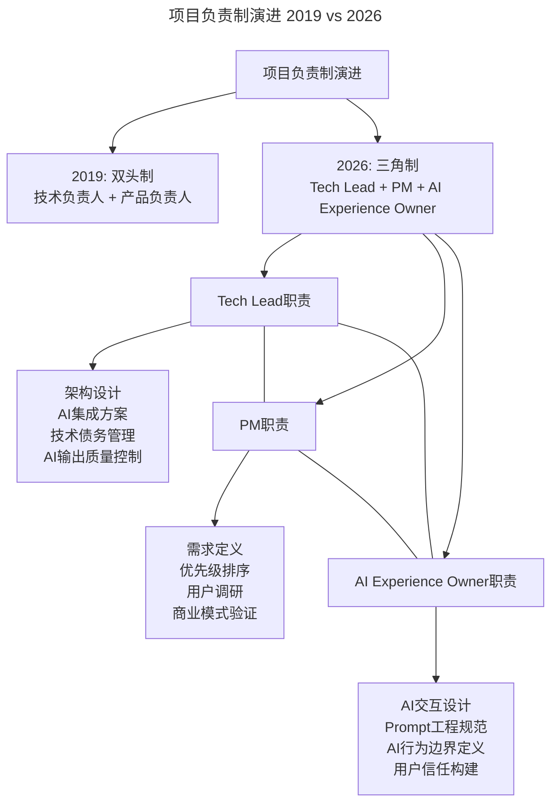

# 大咖对话 | 项目成功的秘诀——技术产品双头负责制

> **适用范围**：技术负责人、产品负责人、项目经理，以及需要在技术与产品之间建立高效协作机制的管理者。

> **更新摘要（v2 · 2026-08 更新）**：
> - 结构化升级为 6 节骨架（导言 / 核心方法论 / 关键流程 / 工具与实战 / 常见误区 / 进阶延展）
> - 保留胡宁原文完整访谈内容
> - 将2019年"双头负责制"升级为2026年"AI增强三角制"（Tech Lead + PM + AI Experience Owner）
> - 新增AI时代同理心维度——"AI Empathy"概念
> - 整合原文独立的AI时代注解内容到对应章节

---

## 1. 导言

本周作客"大咖对话"的嘉宾是360商业化CTO胡宁，她也是360聚效联合创始人、首席技术官。在此之前，她曾担任谷歌技术总监，先后领导主持了移动搜索、谷歌音乐及 Android 云服务的研发。今天，我们和她聊了聊技术人的产品思维。

胡宁基于多年创业和管理经验，提出了**技术产品双头负责制**：由技术负责人和产品负责人一起承担整个项目，避免传统框架中技术和产品"互相甩锅"的矛盾。这一理念在2019年提出时解决了权责不清的核心痛点。

进入2026年，AI产品的用户体验与传统软件截然不同（对话式、不确定性、个性化），Prompt Engineering已成为独立技能栈。因此，本文在保留原文"双头制"精髓的基础上，将其升级为**"AI增强三角制"**——在技术负责人和产品负责人之外，新增"AI Experience Owner"角色，形成三方共治的新范式。

### 🎯 大咖核心观点回顾

1. **技术产品双头负责制** - 技术负责人和产品负责人共同承担项目成败，避免甩锅，促进协作
2. **技术人的产品思维三要素** - 行业经验积累、全局观、技术本身不能丢
3. **优秀技术管理者三大素质** - 技术扎实、同理心、领导力
4. **教练式培养** - 引导而非指令，让leader在实践中成长

---

## 2. 核心方法论

### 2.1 技术产品双头负责制

**极客时间：您负责360的商业产品，在技术产品化方面，您有哪些心得？**

**胡宁：** 这跟我之前的经历有关，我原来在谷歌做工程师的时候，做的一直都是用户产品，从移动搜索，到谷歌音乐，再到安卓云服务，都是跟用户打交道。众所周知，谷歌是典型的工程师文化，工程师的话语权会比较大。那些在别的公司只需要产品经理考虑的事情，在谷歌，工程师也要参与，而不是产品经理一个人说了算。

那时，我就形成了一个观念——一个优秀的工程师，不光技术能力要强，还需要有非常优秀的产品感觉。

后来我出来创业之后，也一直是产品、技术两个一起管。在这些年的创业过程中，关于项目管理、产品管理，我也摸索出了一些自己的心得，那就是 **技术产品双头负责制**。

一般做互联网产品，很多时候都是由产品经理或项目经理去负责整个产品，技术相对来说是一个接收需求、开发需求、实现需求的处于后方的位置。但在我看来，一个产品真正要获得成功，并不只是产品设计的问题，怎样以更低的代价、更系统化的路径去实现它，也是很重要的，而这就需要有工程师的积极参与。

所以我们会提倡技术产品双头负责制，由技术负责人和产品负责人一起承担整个项目，包括该开发什么功能、功能要做成什么样子、怎么设计、该用什么样的架构选型、怎么开发、怎么做测试排期、什么时候上线等一系列工作。

只不过他们会各有分工，技术负责人会更偏向内部，会更多的做一些开发排期、技术架构设计等工作；而产品负责人会更偏向外部，比如需求收集、跟各部门的沟通等。经过我们这么多年的实践，这样的一个机制是能比较有效的保障产品、项目成功的。

可能有人会问，两个人一起负责，会不会产生争议和矛盾，毕竟在传统框架中，技术和产品本身就是容易有矛盾的两个角色。这点其实不必担忧，我们在实践的时候，会保证技术负责人和产品负责人的目标是一致的，例如他们的OKR就是彼此先沟通商量好的。

有了这些确定的目标，他们两个人就需要一起负责，无论是做成还是没做成，都需要他们两人带领团队去一起承担。而在目标一致的情况下，很多分歧就不存在了，看的就是要做的事情是否对项目有好处。

原来技术和产品容易产生分歧，很大程度上，是因为大家权责不清晰，出问题的时候，老想把锅甩到对方头上，但在技术产品双头负责的制度下，这锅只能双方一起承担，想甩都甩不掉。在我们做出这样的调整之后，技术和产品的关系反而融洽了很多。

### 2.2 ⭐ 从"双头制"到"AI增强三角制"

2026年，AI产品的特殊性使得原有的"双头制"需要扩展为"三角制"：

上图展示了项目负责制的演进路径：2019年的双头制解决了技术与产品的权责划分问题，但2026年AI产品的出现引入了新的维度——AI交互体验既不属于纯技术（涉及Prompt工程、行为边界设计），也不属于纯产品（涉及模型能力理解、输出质量控制），因此需要独立的"AI Experience Owner"角色。三方通过OKR对齐目标，形成稳定的协作三角。

**为什么需要第三角？**
- AI产品的用户体验与传统软件截然不同（对话式、不确定性、个性化）
- Prompt Engineering已成为独立技能栈，既不属于纯技术也不属于纯产品
- 用户对AI的期望管理、错误处理、透明度沟通需要专人负责

### 2.3 技术人产品思维三要素

**极客时间：技术人应该怎样提升产品思维？**

**胡宁：第一点，积累足够的行业经验。** 产品与其所在的行业、领域是紧密相关的。技术人要想提升产品思维，首先就是要积累足够的行业经验与知识，需要真正沉浸到行业里去，踏踏实实做上几年，才能领会其中的关节与窍门，理解核心的商业逻辑。只有这样，才有可能做出优秀的产品，否则就是天方夜谭了。

**第二点，要有全局观。** 我一直倡导技术人不能局限在自己的岗位上，而是需要站在一个更高的层面上，从全局出发去看事情，去看产品整体到底是什么样的、之后要走什么样的方向，而为了支撑这样的方向，技术架构、技术选型又要怎么做等。这其实也呼应了第一点，有了较为丰富的行业经验作为基础，才有可能站在全局的角度去看问题。

**第三点，技术本身不能丢。** 这一点回到了技术本身，是因为一个好的、能满足用户需求的产品，最终还是要落到各种技术指标上的，比如页面响应时间多少、互动操作是否流畅、用户点击率是否能提升、能承担多少同时访问的用户数等。而这其中各种优化工作的完成度，最终还是取决于技术水平的高低。所以技术人的产品思维还得有很强的技术积累作为支撑。

**⭐ 2026年升级版：**

| 2019年版 | 2026年升级版 | 具体变化 |
|---------|-------------|---------|
| 积累行业经验 | **AI加速的行业洞察** | 用AI快速扫描行业报告、竞品分析、用户评论，建立认知框架 |
| 具备全局观 | **AI全局观 + 系统思维** | 不仅看产品全貌，还要理解AI如何在各环节提效、可能带来哪些系统性风险 |
| 技术不能丢 | **技术 + AI工程能力** | 除了传统技术栈，还需掌握RAG、Fine-tuning、Agent Design、Evaluation Framework |

---

## 3. 关键流程

### 3.1 优秀技术管理者的三大素质

**极客时间：你认为具备哪些素质才是一个优秀的技术管理者？**

**胡宁：** 一个优秀的技术管理者需要具备以下素质：

**第一，技术水平得非常扎实。** 在技术领域，做纯粹的人事管理是很难服众的，必须有很强的技术能力，才能服众，才能带动团队。因此，我原来培养一个人的时候，很多时候都是要求对方从基层做起，去展现他的实力，去以技术服人。工程师是相对比较单纯的群体，如果真觉得你实力很强，他们是会佩服你、敬仰你，愿意跟随你的，这是非常重要的一点。

同时，我也不希望一个技术管理者就纯粹的只做管理，当然我也不是强硬地要求他们做了leader之后还要写代码，但我希望他们仍然能够亲力亲为地去处理一些问题、尤其是难题，而不是把事情完全推给下属，这样的管理者，不会是优秀的技术管理者。

**第二，要有同理心。** 我最近看了微软CEO纳德拉的《刷新》一书，我很赞同其中的一个观点——管理越往上走，越需要有同理心。之前我把这些归纳为沟通能力、情商等，但更深层次去挖掘后，发现它们本质上就是同理心。

同理心就是你是否能理解别人的立场，是否能站在别人的角度去考虑问题。还是以技术和产品为例，我们很多时候都会听到技术抱怨产品又改需求啦、产品又把锅甩过来啦，但如果站在产品的角度，他们只是想把产品做好，做各种调整是为追求理想的最终结果。如果双方都理解对方的立场，技术把做好产品当成彼此共同的目标，产品能看到并体谅技术的实现难处，那双方的摩擦和埋怨就会少很多。

因此，优秀的技术需要拥有这样一颗强大的同理心，只有真正站在别人的角度看问题，才能找到大家都能接受的解决方案，大家的劲儿才能往一起使。

**第三，要具备领导力。** 技术管理中是有管理职责的，每个人的管理风格都不一样，我能理解并尊重，但是需要保证你的管理风格是能被团队接受并适应的，能让团队运转工作起来，这个被我称为领导力。

在管理团队时，每个人的性格不一样，管理者不能要求所有人都按照一个模子去做，否则很可能会引起反弹，这又呼应了第二点，看管理者是否具有同理心，是否能站在团队成员的角度去考虑问题。

当然，不是所有的技术人都适合做管理，有些人由于性格、情商等原因，可能更适合做IC独立贡献者（Individual Contributor），这也是很好的发展路径，并不是非得走技术管理这条路的。

### 3.2 ⭐ 同理心的新维度——"AI Empathy"

传统同理心：站在用户角度思考  
**AI Empathy（2026新增）**：
- 理解用户对AI的心理防线（隐私担忧、失业焦虑、过度依赖）
- 设计AI的"人格边界"（什么时候该像专家，什么时候该像助手）
- 处理AI错误的用户体验（如何优雅地失败、如何重建信任）

### 3.3 教练式培养流程

**极客时间：您具体是如何培养团队leader的呢？**

**胡宁：** 管理团队，我有我自己摸索出来的一套流程和模式，比如我会用OKR，会用之前提到的技术产品双头负责制，会做公开透明的绩效考评和互评，还会建立一系列技术开发、产品开发的规范和流程等。

在培养团队leader时，我一般会扮演一个教练的角色，会给对方建议，怎样才能成长，需要做哪些事情，哪些方面还需要继续加强。比如我会在某个leader成长到某个阶段后，建议他做团队梯队建设，为什么要做，大致要怎么做。

另外，他们在管理过程中遇到各种各样的难题和困惑，会随时来找我、或在1-on-1沟通时问我，我也会尽力给对方提供我的经验和建议。例如，团队里两个相对资深的小组leader之间有矛盾，团队管理者要怎么处理；或者如何劝退一个不能胜任工作的团队成员。我会跟他分享我以前遇到过的类似情况，以及我的处理经验。但我只会以教练的身份去引导他，跟他讨论，给他建议和提示，而不会指手划脚的告诉对方该这么做那么做。具体该怎么处理，主动权应该握在他手里，这样才能最大限度地让他获得锻炼和成长。

最后，在我看来，技术管理是个经验科学，管理者一定要通过实践去尝试、去体验，最终沉淀出属于自己的管理经验和管理风格。

---

## 4. 工具与实战

### 4.1 观点的AI时代验证

| 原始观点 | 2026年验证 | 验证结果 |
|---------|-----------|---------|
| 双头负责制 | ⭐ **需扩展为"三头负责制"**。2026年项目成功需要**技术+产品+AI体验**三方共治，AI交互体验成为独立维度 | 🔧 升级 |
| 行业经验积累 | ⭐ **依然成立但周期缩短**。AI加速了信息获取和学习曲线，原本需要3年的行业认知现在可能**6-12个月**即可建立（前提是有结构化学习方法） | ⚠️ 效率提升 |
| 同理心的重要性 | ⭐ **更加关键**。AI时代的同理心不仅是对人，还要**对用户的AI交互习惯有同理心**（如用户何时希望AI主动帮助、何时希望人工介入） | ✅ 扩展 |
| 教练式培养 | ⭐ **结合AI教练更高效**。2026年出现AI Leadership Coach（如Executive AI Coach），能提供个性化管理建议，人类教练则聚焦情感支持和复杂情境辅导 | ✅ 增强 |

### 4.2 教练式培养的AI增强工具箱

| 场景 | 传统方法 | AI增强方法 |
|-----|---------|-----------|
| Leader遇到管理难题 | 找导师咨询 | 先问AI Coach获得3个视角，再找导师深聊 |
| 团队冲突调解 | 1-on-1谈话 | AI分析沟通记录，识别潜在情绪触发点 |
| 绩效反馈 | 年度review | AI持续追踪产出数据，提供实时微反馈建议 |
| 职业规划 | 导师凭经验建议 | AI基于团队能力图谱和市场数据，推荐发展路径 |

### 4.3 ⭐ 2026行动清单

**对于技术管理者：**
- [ ] **在团队中设立AI Experience角色**：可以是专职或兼职，负责AI交互体验设计
- [ ] **建立"Tech-PM-AI"三方同步机制**：每周15分钟三角会议，对齐AI相关的产品和体验决策
- [ ] **投资团队的AI产品思维培训**：推荐课程如"AI UX Design"、"Conversational UI Patterns"

**对于产品/技术双负责人：**
- [ ] **共同制定AI行为准则文档**：明确AI在产品中的角色、边界、错误处理方式
- [ ] **引入AI Usability Testing**：测试用户与AI交互的自然度和满意度（如Task Success Rate、Error Recovery Time）
- [ ] **建立AI Output QA流程**：技术负责AI输出的准确性和安全性，产品负责AI输出的有用性和友好性

**对于正在成长的Leader：**
- [ ] **寻找AI Coach作为补充**：尝试Executive AI Coach工具（如BetterUp AI、Reclaim.ai的Coaching模块）
- [ ] **练习"AI Scenario Thinking"**：在做决策时，多问一句"如果这个环节由AI来完成，会有什么不同？"
- [ ] **记录"人机协同最佳实践"**：你和团队如何高效配合AI？沉淀下来成为团队资产

---

## 5. 常见误区

### 5.1 双头制实践的常见误区

- **误区1：只有头衔没有共担**——挂名双头但实际仍是一方主导，另一方被动执行，违背了"共担成败"的初衷
- **误区2：目标不对齐**——双头负责但不统一OKR，导致各自为政，分歧无法消解
- **误区3：分工变成分家**——技术负责人只管技术、产品负责人只管产品，缺乏交叉理解和协作

### 5.2 AI时代"三角制"的常见误区

- **误区1：AI Experience Owner形同虚设**——设立了角色但未赋予决策权，沦为技术或产品的附庸
- **误区2：过度依赖AI Coach**——将管理决策完全外包给AI，丧失人类教练的情感支持和复杂判断
- **误区3：忽视AI Empathy**——只关注AI功能实现，不关注用户对AI的心理感受和信任建立

---

## 6. 进阶延展

### 6.1 核心金句（2026版）

> **"2026年项目成功的秘诀不再是'技术和产品不分家'，而是'技术、产品、AI体验三者共舞'。"**

> **"同理心的最高境界不是理解用户说什么，而是理解用户在面对AI时那种'既期待又不安'的复杂心情。"**

> **"好的Leader不是教下属怎么做，而是教会下属如何用好AI助手，然后让自己变得更不重要。"**

### 6.2 从经验科学到AI增强的经验科学

胡宁原文强调"技术管理是个经验科学，管理者一定要通过实践去尝试、去体验"。2026年这一观点依然成立，但AI的加入让"经验的积累和传承"有了新方式：

- **AI辅助经验沉淀**：AI可以记录管理者的决策过程和结果，形成可检索的"管理案例库"
- **AI模拟场景训练**：管理者可以在AI模拟的团队冲突、绩效面谈等场景中低风险练习
- **AI辅助决策分析**：面对复杂管理问题时，AI可以提供基于历史数据的多个决策选项及其可能后果

但需注意：AI只能辅助，不能替代管理者亲自实践和体验——这正是胡宁"教练式引导而非指令"理念的核心。

### 6.3 参考与延伸

- 纳德拉《刷新》：胡宁原文引用，关于同理心在管理中的重要性
- 胡宁在谷歌的经历印证了"工程师文化中工程师参与产品决策"的价值
- IC（Individual Contributor）独立贡献者路径：并非所有技术人都必须走管理路线
- 360商业化的"技术产品双头负责制"实践，为AI时代"三角制"提供了组织演进的基础范式
