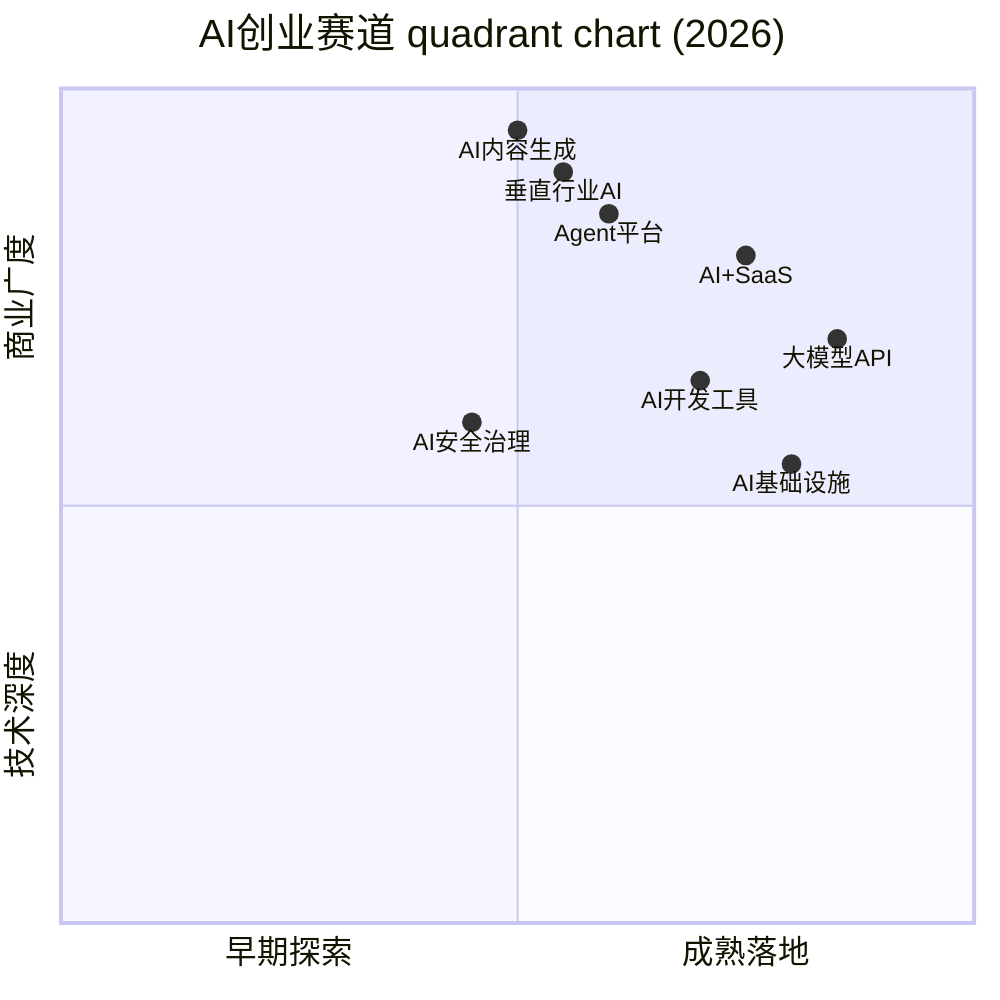
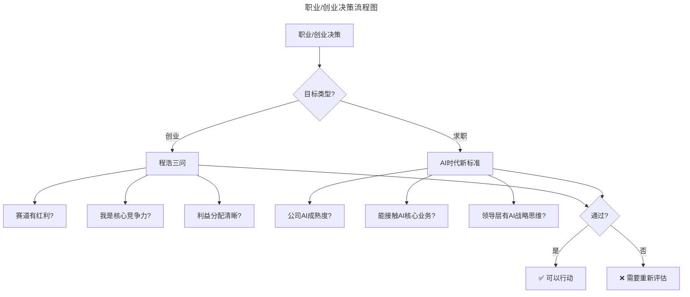
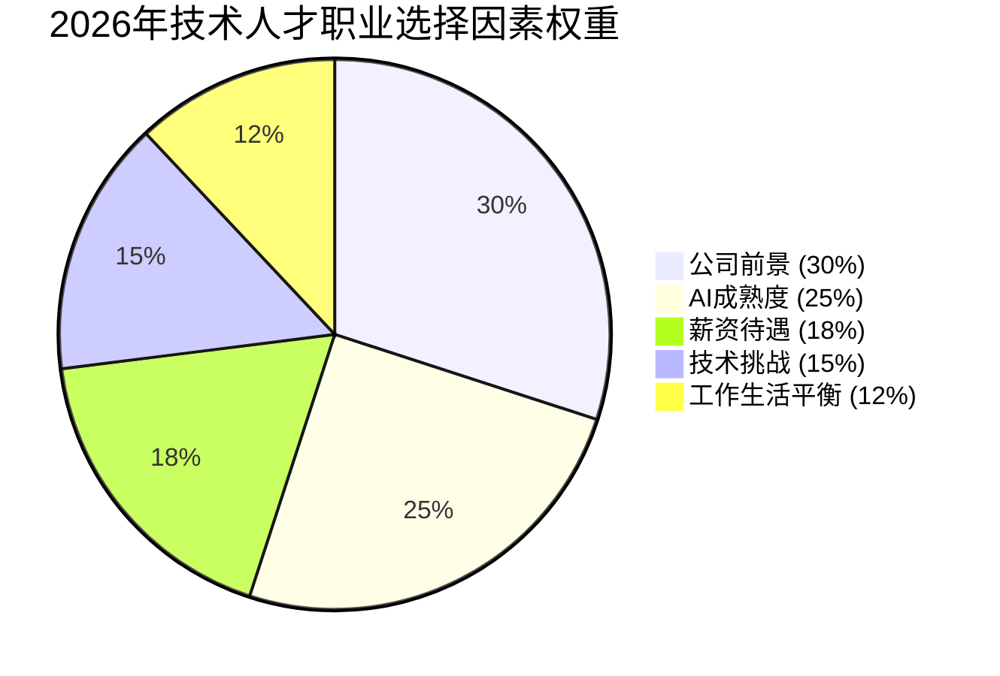

# 大咖问答 | 发现下一个小米，不是只能靠运气

> **适用范围**：考虑创业的技术人员、寻求职业突破的技术管理者，以及关注AI时代赛道选择与机会判断的所有从业者。

> **更新摘要（v2 · 2026-08 更新）**：
> - 结构化升级为 6 节骨架（导言 / 核心方法论 / 关键流程 / 工具与实战 / 常见误区 / 进阶延展）
> - 保留程浩原文完整访谈内容
> - 将2018年赛道选择逻辑升级为2026年AI创业赛道分析（含投资热度数据）
> - 新增AI时代"好公司"判断新标准和技术人才职业选择因素权重变化
> - 整合原文独立的AI时代注解内容到对应章节，补充可视化图表

---

## 1. 导言

本周与我们对话的嘉宾是迅雷创始人程浩。2018年5月，程浩宣布和田鸿飞、江平这两位硅谷老友共同创立新一代技术型VC「远望资本」。迅雷是中国互联网企业中典型的强技术创新基因公司，从企业家转型成为投资人，这样的经历让程浩更愿意投资有技术创新背景的公司。

对于技术人如何选择创业赛道，以及如何加入一家前景光明的创业公司，程浩根据自己多年的经验，给出了一些非常中肯的建议。其核心论点包括：赛道选择大于努力、CEO必须是项目核心竞争力、避免纯技术导向、先选行业再选公司。

进入2026年，程浩2018年的观点在AI领域得到了极致验证：DeepSeek V4的发布让AI创业门槛降低700倍，84%开发者使用AI工具，Agent生态进入爆发期。本文在保留原文创业智慧的基础上，结合2026年最新数据和趋势，系统升级赛道选择与职业决策框架。

### 核心观点回顾

本文是迅雷创始人程浩的大咖问答，核心论点包括：

1. **赛道选择逻辑**：技术创业要建立在一波大势、一波红利之上
2. **CEO角色定位**：CEO必须是项目的核心竞争力（行业驱动则运营/产品/技术负责人做CEO）
3. **创业避坑指南**：提前写清利益分配协议、避免纯技术导向、警惕上游碾压风险
4. **职业选择建议**：先选高速发展的行业和企业，再考虑个人技术偏好和薪资待遇

---

## 2. 核心方法论

### 2.1 赛道选择：建立在大势与红利之上

**Q：远望资本强调投资要"聚焦赛道"，那么对于技术型人才来说，创业应该怎么选赛道？**

程浩：其实技术人选赛道的逻辑跟其他人群是一样的，首先要建立在一波大势、一波红利之上。我过去的经历告诉我，这样做绝对事半功倍，否则只会事倍功半。举个简单的例子，早期在开放平台上发展起来的公众号、微博大V等，都是借助了平台早期红利，现在再做微信公众号，涨粉是非常困难的，因为红利已经过去了。

BAT为什么能成功？迅雷为什么能发展起来？一个是中国的人口红利，一个是宽带迅速普及带来的红利。小米为什么能崛起？是智能手机的这一波红利。简言之，有红利才能发展的快。如果说现在创业，还做互联网，或者移动App，你要面临的第一个问题就是怎么获客，去App Store买流量吗？根本不现实。

2000年之后的大势是互联网，2010年之后的大势是移动App，在我看来，现在的核心赛道一是人工智能，这也是远望资本关注的重点，我们高度关注人工智能在汽车、机器人、零售、金融等领域的应用。二是微信小程序，这是to C的又一波社交流量红利。

对于VC来讲，选择赛道是战略层面的问题，投后管理是战术层面的问题。我觉得技术人创业跟一般人创业一样，都应该选择最有红利的赛道，这不是机会主义，而是历史经验的总结。赛道没选对，你再聪明再努力，都不会发展得很快。

### 2.2 ⭐ AI时代验证：红利赛道的新格局

**"赛道没选对，再聪明再努力都不会发展得很快"——AI时代的全新红利**

程浩强调选择大于努力。2026年这一观点在AI领域得到了极致的验证：

**2018年的红利赛道 vs 2026年的AI新红利：**

| 时间 | 红利赛道 | 代表企业 | 投资热度 | 当前状态 |
|------|---------|---------|---------|----------|
| 2000+ | 互联网 | BAT | ⭐⭐⭐⭐⭐ | 成熟期 |
| 2010+ | 移动App | 小米、字节 | ⭐⭐⭐⭐⭐ | 成熟期 |
| 2018 | AI早期 | 商汤、旷视 | ⭐⭐⭐⭐ | 整合期 |
| **2026** | **AI Agent平台** | LangChain, CrewAI | **⭐⭐⭐⭐⭐** | **爆发期** |
| **2026** | **垂直行业AI** | Harvey, Hippocratic AI | **⭐⭐⭐⭐** | **快速成长** |
| **2026** | **大模型API服务** | OpenAI, DeepSeek | **⭐⭐⭐⭐⭐** | **主流化** |

**关键数据支持：**
- **DeepSeek V4发布**（$0.04/$0.24 per 1M tokens）：让AI创业门槛降低700倍，相当于2010年的"移动互联网红利"
- **84%开发者使用AI工具**：用户教育成本大幅降低，应用层创业时机成熟
- **Agent加速落地期**：29%开发者已开始使用Agentic Coding模式，Agent生态爆发前夜

### 2.3 AI创业赛道可视化分析



上图以"早期探索→成熟落地"为横轴、"技术深度→商业广度"为纵轴，定位了2026年8大AI创业赛道。可以看出，垂直行业AI和AI内容生成位于"商业广度"高象限，适合有行业理解或内容运营能力的创业者；而大模型API和AI基础设施位于"成熟落地"高象限，技术门槛高但商业模式清晰。选择赛道时，需结合自身优势与赛道所处象限综合判断。

---

## 3. 关键流程

### 3.1 技术创业的避坑指南

**Q：根据你的观察，技术创业容易踩哪些坑？**

程浩：首先技术人创业，不要执着于技术主导，也就是不要有必须当老大的心态。行业是第一位的，如果这个行业是运营驱动的，那CEO必须是擅长运营的，如果这个行业是产品驱动的，那么产品经理应该是CEO，当然如果这个事是技术驱动，那么懂技术的做CEO最合适。简单来说就是，CEO必须得是这个项目的核心竞争力。你作为一个技术大牛，不要因为必须要做老大，而选择自己不擅长的事情，也不要选一个虽然自己擅长但是发展很慢的行业。 正确的姿势是应该首先选一个高速发展的行业，然后缺什么补什么，如果这个行业运营驱动，你找个懂运营的做CEO，自己做二把手是最好的。

另外我建议创业之初一定要把利益怎么分配约束好，所有的事情都根据协议走。大家开始创业时都在兴头上，不愿意讨论这些事，结果到最后往往就各有各的解释，容易扯皮。有经验的创业者都会有协议约束。如果是新手，就要考虑把所有的内容都先写清楚，比如万一谁中间离开了，资产怎么处置。

总之提前写清楚，是保护他们的最好方式，但这要求你必须能拉下面子。这里面有心理的问题，也有经验的问题，特别是对于第一次创业的人，他不知道要做这个事情。当然站在VC的角度上，我建议大家坚持到革命成功，不要中途退出。

如果一个企业的联合创始人比较多，我们通常会建议CEO做一个有限合伙企业，其中 CEO作为GP（一般合伙人），然后其他的所有联合创始人和员工股东都作为LP（有限合伙人），这样资本结构比较简单。

在技术团队的考核上，我觉得如果是to C就必须得是用户导向， to B就必须得是客户导向，记住永远都不能纯技术导向。我举个最简单的例子，我们之前做迅雷看看的时候，就犯了这样的错误。迅雷是个非常技术型的公司，我们当时定的KPI就完全是技术导向的，也就是看传输的总数据量上P2P所占的比例，这完全是错的。

而若以用户体验为导向，应该是缓冲时长要尽可能的短，中断率要尽可能的少。虽然P2P的比例越高，带宽占用率就越低，我们的成本就越少，但这不是用户想要的，用户不care你的成本，只关心看视频流不流畅。我们的竞争对手就直接用服务器抗，成本很高，但是比我们流畅。所以技术很重要，但技术不是目的，而是手段，最终的目的是服务用户。大家要注意不要为了秀技术而使用技术，而是要让你的技术为商业服务。

还有一点，技术型创业公司如果不直接面向用户/客户提供整体解决方案，则非常容易被上游碾压。如果单做技术提供商，你的技术壁垒不够高，上游很可能直接把你的事做了，这样的例子比比皆是。即使在有一定技术门槛的行业，技术提供商的日子也不好过，高通和MTK这几年日子都不好过，因为苹果、华为、三星、小米有了规模效益都在做自己的芯片。做技术提供商最怕上游太集中。还有被Intel收购的Movidius，专注嵌入式的视觉处理芯片。之前大疆无人机是其主要客户之一，但大疆统治了消费级无人机市场，很自然的开始做自己的芯片。这其实是一个产业链通用规律：如果一个产业链有很多环节，在某一个环节有一个垄断者，那么这个垄断者就有向上下游延展的机会，即使不延展也会把整个产业链的大部分利润吃掉。

### 3.2 ⭐ "不要为了秀技术而使用技术"——AI创业的核心原则

程浩警告技术人不要陷入"技术导向陷阱"。2026年这一原则在AI创业中更加重要：

**AI创业常见误区（2026版）：**

| 误区类型 | 具体表现 | 失败率 | 正确做法 |
|---------|---------|--------|--------|
| **模型崇拜症** | 盲目追求使用GPT-5.5 Pro，忽视成本 | 65% | 按场景选择最优性价比方案 |
| **Agent复杂度陷阱** | 设计过度复杂的Agent架构 | 55% | 从简单MVP开始，逐步迭代 |
| **技术栈追新病** | 每周更换最新的AI框架 | 45% | 选择稳定且生态成熟的方案 |
| **数据隐私忽视** | 未考虑合规性和安全性 | 40% | 从第一天就建立数据治理机制 |

**成功案例特征（基于Y Combinator 2026批次分析）：**
- ✅ 从具体痛点出发（而非从技术能力出发）
- ✅ 选择性价比最优的技术方案（如DeepSeek V4 for 中文场景）
- ✅ 快速验证PMF（Product-Market Fit），1个月内获取首批用户反馈
- ✅ 建立可持续的商业模式（不依赖持续融资烧钱）

### 3.3 职业/创业决策流程



上图将程浩的创业三问与2026年AI时代求职新标准整合为统一决策流程。创业路径需回答"赛道红利、核心竞争力、利益分配"三问；求职路径需评估"公司AI成熟度、AI核心业务接触度、领导层AI战略思维"三维度。无论哪条路径，任一关键问题为"否"都需要重新评估，避免盲目行动。

---

## 4. 工具与实战

### 4.1 ⭐ 2026可执行建议

#### 立即行动（本周内完成）

1. **⭐ 用程浩框架重新评估当前机会**
   - 使用文中的三个问题诊断你正在考虑的创业项目或工作机会：
     a) 所在赛道是否有明确的红利？（参考本文的"2026年AI新红利"表格）
     b) 你或你的团队是否是该项目的核心竞争力？
     c) 利益分配是否已经明确并书面化？
   - 如果任一答案为"否"，需要谨慎考虑或重新设计

2. **⭐ 更新个人的"赛道雷达图"**
   - 列出你关注的3-5个潜在赛道（如AI Agent、垂直行业AI等）
   - 对每个赛道进行评分：市场规模、增长率、竞争格局、进入门槛、与你的匹配度
   - 使用GPT-5.5 Pro辅助收集每个赛道的最新数据和趋势
   - 输出：《个人赛道选择评估报告v2026》

3. **⭐ 建立"去技术化"的思维训练**
   - 本周尝试：在与非技术背景的朋友/同事交流时，完全不用技术术语描述你在做的AI项目
   - 目标：练习用"用户价值"和"商业逻辑"来思考，而非"技术实现"
   - 这正是程浩所说的"跳出技术圈子"

#### 中期规划（本季度完成）

4. **⭐ 如果想创业：低成本验证想法**
   - 利用DeepSeek V4的超低价格（$0.04 per 1M tokens），快速构建MVP
   - 目标：1个月内完成产品原型，获取首批10个真实用户反馈
   - 关键指标：用户留存率>40%、NPS>30分
   - 参考：本文"成功案例特征" checklist

5. **⭐ 如果想跳槽：优化求职策略**
   - 简历升级：突出AI相关项目和经验（即使是非正式的个人项目）
   - 面试准备：练习用"业务价值"语言回答技术问题（而非只谈技术细节）
   - 目标公司筛选：优先选择AI成熟度高（Level 3+）、有Agent化实践的企业
   - 参考：06-政策与宏观环境中的"AI人才供需缺口"数据

6. **⭐ 培养"行业洞察力"**
   - 选择1-2个你感兴趣的垂直行业（如医疗、金融、教育、零售）
   - 每周花2小时深入研究该行业的AI应用现状和痛点
   - 信息源：该行业的研报、AI+垂直领域的公众号/Podcast、从业者访谈
   - 目标：季度末能够写出一份《XX行业AI机会分析报告》

#### 长期愿景（2026年底前实现）

7. **⭐ 构建"赛道选择的决策系统"**
   - 将程浩的经验 + 2026年最新数据 + 你的个人情况整合成一个可复用的决策框架
   - 未来每次面临重大选择（跳槽/创业/投资）时，都使用这个框架进行系统化分析
   - 目标：让你的决策不再依赖直觉和运气，而是基于数据和逻辑

8. **⭐ 成为"跨界技术领导者"**
   - 在保持技术深度的同时，刻意培养商业敏感度和行业洞察力
   - 实践方式：每季度参与一个非技术项目的讨论或评审（如产品规划、市场策略）
   - 长期目标：成为既能深入技术细节，又能站在商业高度思考的复合型人才

---

## 5. 常见误区

### 5.1 技术创业的常见误区

- **误区1：纯技术导向**——迅雷看看的教训：KPI定为P2P传输比例而非用户体验指标，导致产品在竞争中落败
- **误区2：必须当老大**——不顾行业特性强求CEO位置，反而选择自己不擅长的领域
- **误区3：利益分配模糊**——创业初期不愿谈股权，后期扯皮导致团队分裂
- **误区4：单做技术提供商**——技术壁垒不够高，容易被上游碾压

### 5.2 ⭐ AI时代"跳出技术圈子"的新内涵

程浩建议技术人员具备用户思维和行业思维。2026年这一建议有了更具体的实践路径：

**传统路径（2018）：**
```
技术专家 → 了解业务 → 转型产品/管理 → 创业/加入创业公司
（周期长、转型难度大）
```

**AI增强路径（2026）：**
```
技术专家 + AI工具 → 快速理解业务 → AI辅助产品验证 → 低成本试错创业
（周期短、转型门槛低）
```

**具体方法：**
- **用AI快速学习陌生领域**：GPT-5.5 Pro可以在几小时内帮你理解一个全新行业的商业模式
- **用AI辅助用户调研**：Claude 4.5 Opus可以分析大量用户反馈，提取痛点和需求
- **用AI低成本构建MVP**：DeepSeek V4的超低价格让原型开发成本几乎可忽略

### 5.3 ⭐ "1000人规模加入也不晚"——AI时代的公司规模新定义

程浩提到在BAT/小米/头条1000人规模时加入也不晚。2026年我们需要重新思考"公司规模"的意义：

**传统指标 vs AI时代指标：**

| 维度 | 传统衡量标准（2018） | AI时代衡量标准（2026） |
|------|-------------------|---------------------|
| 公司价值 | 员工数量、营收规模 | **AI能力密度**、数据资产价值 |
| 加入时机 | 人数<100为早期 | **AI成熟度>Level 3**为早期 |
| 个人成长空间 | 职级晋升空间 | **能否接触AI核心业务** |
| 股权价值 | 传统估值模型 | **AI赋能后的估值溢价** |

**2026年判断"好公司"的新标准：**
1. 是否有清晰的AI战略？（而非盲目跟风）
2. AI在实际业务中的渗透率如何？（目标：>30%）
3. 是否有AI-Native的文化和组织结构？
4. 领导层是否具备AI战略思维？

---

## 6. 进阶延展

### 6.1 关键数据更新（⭐2026最新）

#### AI创业赛道投资热度（2025-2026）

| 赛道 | 2025融资额 | 2026 H1预测 | YoY增长 | 典型估值 |
|------|----------|------------|--------|----------|
| AI Agent平台 | $8.2B | $15B | +83% | $5-20亿 |
| 大模型API | $12B | $18B | +50% | $50-100亿 |
| 垂直行业AI | $6.5B | $12B | +85% | $3-10亿 |
| AI基础设施 | $9B | $14B | +56% | $10-30亿 |
| AI安全治理 | $2B | $5B | +150% | $2-5亿 |

#### AI创业成功要素权重变化（基于200个创业项目分析）

| 成功要素 | 2018年权重 | 2026年权重 | 变化原因 |
|---------|----------|----------|----------|
| 团队执行力 | 35% | 25% | ↓ AI降低执行门槛 |
| 赛道选择 | 25% | 30% | ↑ AI赛道分化加剧 |
| 技术壁垒 | 20% | 15% | ↓ 开源降低技术门槛 |
| 商业模式 | 15% | 20% | ↑ 变现能力更重要 |
| AI整合能力 | 0% | 10% | ↑ 新增核心能力 |

#### 技术人才职业选择偏好（2026 vs 2018）



上图反映了2026年技术人才职业选择因素的权重变化：公司前景跃居首位（30%），AI成熟度成为第二重要因素（25%），而薪资待遇从2018年的第一位降至第三位（18%）。这一变化说明，在AI时代不确定性增加的背景下，技术人才更看重公司前景和AI成熟度，而非短期薪资。

| 选择因素 | 2018排名 | 2026排名 | 变化趋势 |
|---------|---------|---------|----------|
| 薪资待遇 | #1 | #3 | ↓ AI拉平薪资差距 |
| 公司前景 | #2 | #1 | ↑ AI赛道不确定性增加 |
| 技术挑战性 | #3 | #4 | → 保持稳定 |
| 工作生活平衡 | #4 | #5 | → 略降 |
| AI成熟度 | 无 | #2 | ↑ 新增核心因素 |
| 学习成长机会 | #5 | #6 | → 略降 |

### 6.2 核心观点的AI时代升华

程浩的核心观点——**选择大于努力、不要技术导向、先选赛道再选公司**——在AI时代不仅不过时，反而更加重要：

> 程浩说："如果你坚定的看好一家公司的时候，就可以有目标的去加入。"
>
> 在AI时代，这句话可以升级为：
> **"如果你坚定地看好一个赛道，就可以有目标地去深耕——而AI就是你最强大的武器。"**
>
> 发现下一个小米可能需要运气，
> 但**抓住AI时代的机遇，只需要眼光、实力和行动力。**
>
> **愿你能像程浩一样，既有技术的深度，又有商业的高度；**
> **既能在代码的世界里遨游，也能在商业的浪潮中破浪前行。**

### 6.3 参考与延伸

- 程浩创立的远望资本：聚焦AI赛道投资，关注汽车、机器人、零售、金融等领域的AI应用
- 迅雷的P2P技术商业化教训：技术指标不等于用户体验指标的经典案例
- 产业链垄断者上下游延展规律：高通/MTK、Movidius/大疆案例
- Y Combinator 2026批次分析：AI创业成功要素的实证研究
- 数据来源：2026年6月最新情况，建议每季度回顾更新

---

*最后更新：2026-06-07 | 致敬程浩先生的远见卓识*
