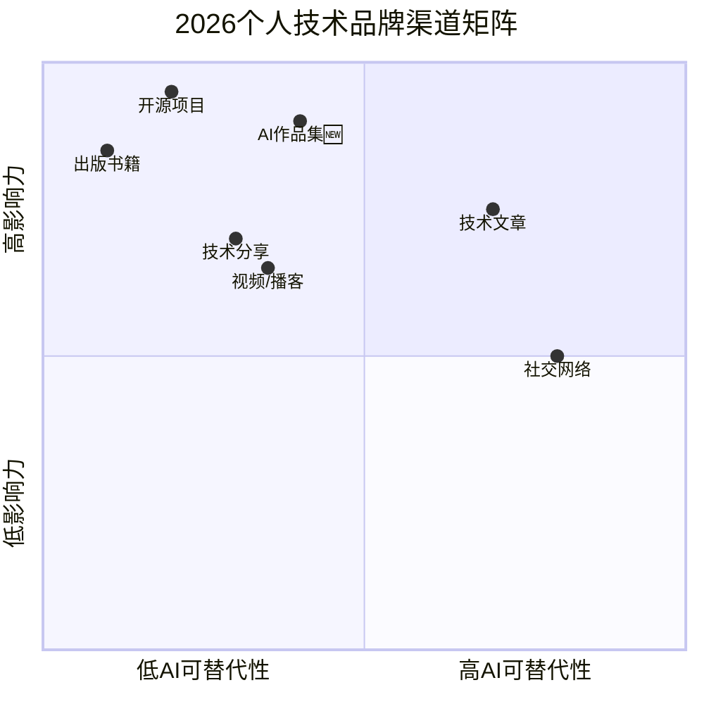

# 第58讲 | 如何打造个人技术品牌？

> **适用范围**：希望建立个人技术品牌的工程师、架构师、技术管理者，以及想通过写作与演讲提升行业影响力的技术人。
>
> **更新摘要（v2 · 2026-08 更新）**：
> - 结构化升级为 6 节骨架（导言 / 核心方法论 / 关键流程 / 工具与实战 / 常见误区 / 进阶延展）
> - 保留原文"写作从翻译开始""技术写作要真诚严肃""技术演讲要循序渐进"等方法论
> - 整合 2026 年 AI 时代升级注解，为 Mermaid 图补充 `title` frontmatter
> - 新增 AI 时代六大渠道矩阵、AI 作品集维度与品牌建设行动清单

## 1. 导言

技术品牌，它到底是公司的资产，还是个人的财富？

我们都知道，公司有了技术品牌，在招聘方面会获益良多。那么个人的技术品牌呢？它能给个人带来什么？起码就我的经验，个人技术品牌有几点收益是相当明显的。

## 2. 核心方法论

### 个人技术品牌的三大收益

**1.个人技术品牌降低了你找工作的难度**

我至今仍然庆幸，自己刚工作不久就发现了一个秘密：有些人找工作不靠投简历，全靠朋友介绍。后来更是发现，好工作往往也不公开招聘，全靠有熟人引荐。那么，上哪里去找那么多的熟人呢？一个人的精力和交往范围有限，这时候技术品牌就显示出强大的辐射力了，如果你之前研究过相关的领域，网络上可以检索到你的研究成果，而且这些成果是靠谱的，那么即便没有熟人背书，其他人也会认为你是靠谱的，好的职位也愿意为你开放。

**2.个人技术品牌拓展了你的交往范围**

如今每个人的时间都很宝贵，有时候明明两个人很聊得来，深入聊下去会碰撞出许多火花，但因为素不相识，很难在初次见面就找到沟通频道，所以擦肩而过。如果有个人技术品牌，你的每一篇文章、每一次演讲，都是你的副本，都可能被人认识、记住。所以初次见面，寒暄上一两句，人家可能就会说：我看过你关于某某的文章，我是这么想的…… 这样，打交道自然容易很多，也容易建立起信任。

**3.个人技术品牌可以提供额外的职场保护**

大家都知道职场凶险，翻脸比翻书还快，卸磨杀驴、兔死狗烹的事情并不罕见。如果很不幸你遭遇了这样的事情，当然可以求助媒体和劳动仲裁，只是结果不一定乐观。但如果你有个人技术品牌作为后盾，对方多半心存忌惮，动手之前总要仔细掂量掂量，不敢把事情做绝。或者即便下了黑手，你也不会吃闷头亏，总能讨来几分公道。看看近年的几个例子，你就会知道我所言不虚。

### AI 时代的第四个理由

**⭐ 2026 新增第四个理由**

**4. AI时代的不可替代性**：在AI能生成大量"平庸内容"的时代，**有深度的个人品牌是证明人类独特价值的最佳方式**。

> **背景**：2026年，原文核心方法论"个人技术品牌建设六大渠道"在AI时代需要全面升级——**AI作品集成为新的品牌展示维度，AI加速了内容生产但提高了质量门槛**。84%的技术从业者使用AI工具，"会用AI创造独特价值"成为区分度的新来源。

## 3. 关键流程

既然个人的技术品牌有这么多好处，怎么做才能建立它呢？其实无非靠两样本事：写作、演讲。偏生大多数技术人都很内向腼腆，无论写作还是演讲，都不是天生就有优势的。所以在这里，我提供一些可行的经验来供大家参考。

### 写作从翻译开始

对我们大多数人来说，写作一直是让人头疼的。经常有人问我：写作有什么秘诀吗？其实没什么秘诀，就是要多写。但他们会说：我就是写不出来…… 既然如此，那就从翻译开始吧。大家起码能阅读技术文档，能就技术文档和同事交流，所以翻译的难度不会太大。 在翻译中要注意以下几点：

第一，翻译和阅读不一样，翻译对原文的理解要求更高，否则可能发生错漏而毫无觉察，所以最好从自己熟悉领域的资料开始翻译，这样更有把握；

第二，翻译完成之后不必立刻发出来，可以过几天再以"没读过原文"的心态仔细看看，确保读者能看懂，发出来之后当然还可以再修改，但原始版本可能已经四处流传了；

第三，翻译时可以加上一些自己的观点和评论，如果能把技术和自己的实际经验结合起来就更好，纯粹的翻译不容易凸显自己的特点，对中文读者的参考作用也有限；

第四，记得在每次发表翻译稿时注明自己的身份，可以借助其他的平台，但尽量不要做这些平台上无私贡献流量的无名氏；

第五也是最后一点，一旦开始做就要持之以恒，如果能就同一主题翻译十篇以上有份量的文章，无论是对自己理解的加深，还是对技术品牌的塑造，都是非常好的。

### 技术写作要真诚严肃

如果已经熟练翻译，就可以开始尝试自己原创技术文章了。这时候要注意的是，态度必须真诚严肃。

有许多人希望建立自己的技术品牌，做法却非常虚浮潦草：或者是无责任转载，或者是浮光掠影走马观花，即便想认真做点介绍也是囫囵吞枣。其结果就是，当大家在网上搜索某方面的技术文档时，看起来资料很丰富，点开一看却发现每篇文章都大同小异，一些错误以讹传讹，感受非常差劲。

这正是目前中文技术文档的现状，所以久而久之，大家都养成了差不多的习惯：不但要看文档的标题，还要看文档的出处，是不是来自靠谱的作者、靠谱的团队。如果是，才点开。但这也意味着，如果你建立了良好的技术品牌，是很容易被广泛认可的。

所以在技术写作时，务必保持真诚严肃的态度。所谓真诚，是指不浮夸、不吹嘘，做了八分绝不说成九分，懂了五分绝不说成六分，不懂的可以承认自己不懂，或者给出解释并标明是猜想。

所谓严肃，指的是讲逻辑、讲证据，我自己在写技术文章时，常常发现自己之前解决问题的思路竟然是有问题的，或者有一些资料理解错了，或者拿到的证据已经过时，于是需要重新查证、理顺思路。在这个过程中自己的认识深化了，最终的结果也得到读者的广泛认可：原来这类问题，看这篇文章就足够清楚了。

### 写作过程中务必多交流

技术品牌虽然好，但很多时候它属于"自找麻烦"，因为它并不是技术人的必须选项。于是，建立自己技术品牌的道路必然是孤独的，半途而废的例子我实在见过太多了。所以，有志于建立自己技术品牌的人，当然应当加强交流、互相协作。

具体来说，看到其他人高质量的劳动成果，应当表示赞美，即便其他人"抢先"发表了翻译稿或者意见也不要愤恨；在论述相同主题时，如果借鉴了人家的成果应当大方说明，即便没有借鉴甚至观点都不同，也可以以"延伸阅读"或者"参考阅读"的形式链接过去；如果发现其他人的论述比自己的更高明，甚至指出了自己的错误，也应当大方承认不足，以学习心态虚心对待。

如果能做到上面这些点，自己的技术品牌就不是茕茕孑立，就不是单纯凭快、新、奇、孤傲赢得观众了，还有来自其它技术品牌的延绵活水。同时，你自己也会被更多的技术品牌创造者所接纳，进入他们的圈子。圈子的温暖，圈子的力量，圈子所能提供的视野，都远远大于埋头苦干的个人。

### 技术演讲要循序渐进

与写作相比，技术演讲是更高的挑战，也会带来更多的好处：鲜活、形象、有现场的互动，后续还可能有媒体报道。

但是演讲的难度也更高：写作可以反复加工，直至拿出成品为止，演讲却没有反复上台的机会。写作可以不必直面观众，以文字作为中介，演讲却必须与观众做直接沟通。 不过这些都不会是太大的困难，通常来说，要成为演讲者，应当注意下面几点。

**第一，舍得削删。** 写作是比演讲更为自由的，空间也更大，所以写作时往往可以对某个主题做大而全的论述。但是演讲的时间有限，观众的注意力和耐心也更有限。所以设计演讲稿时务必对写作的内容做大的削删，去掉细枝末节，只留下最重要的点。通常来说，三十分钟的演讲，能讲清楚三到四个点就很不错了。

**第二，反复练习。** 或许你对某个问题已经滚瓜烂熟了，但这并不意味着你一定能讲好它。如何保证能讲好？除了多练习，没有其他诀窍。你可以从"讲给身边人"开始练习，对身边人讲两三遍，确保他们能听懂，你也能讲得流畅。然后，尝试给更远一点，更大一点的团队来讲。按照我的经验，即便没有任何演讲经验的人，练三次基本可以给三五个人的观众讲清楚，练十次基本可以给一百以内的观众讲清楚。

**第三，也是最后一点，仔细观摩优秀的技术演讲，用心推敲**，也是提升自己演讲水平的有效途径。我们去观看技术演讲时，往往只关心"讲了什么"，而不关心是"怎么讲的"。多去看看优秀的演讲，会让你在技术品牌的塑造上少走很多弯路。

## 4. 工具与实战

### 六大渠道的 AI 时代升级

原文六大渠道：
1. **技术文章**：公众号/掘金/知乎
2. **开源项目**：GitHub
3. **技术分享**：线下大会/QCon
4. **出版书籍**：电子书/纸质书
5. **授课培训**：线上课程
6. **社交网络**：LinkedIn/Twitter

### ⭐ 2026 六大渠道矩阵（含 AI 新渠道）

渠道矩阵以"AI 可替代性"为横轴、"影响力"为纵轴：开源项目与出版书籍位于高影响、低可替代象限，社交网络位于高可替代、中影响象限，AI 作品集作为新增渠道位于高影响、中可替代象限。

#### 各渠道的 AI 时代策略

| 渠道 | 传统做法 | AI时代升级 | 关键差异化 |
|-----|---------|-----------|----------|
| **技术文章** | 手写原创 | **AI辅助调研+人工深度洞察** | 独家观点和经验 |
| **开源项目** | 个人维护 | **+ AI工具链/AI Agent项目** | 解决真实痛点 |
| **技术分享** | PPT+演讲 | **+ AI Demo实时演示** | 互动性和实用性 |
| **出版书籍** | 长周期写作 | **AI辅助初稿+人工精修** | 深度和系统性 |
| **授课培训** | 录制课程 | **+ AI个性化学习路径** | 实战案例 |
| **社交网络** | 定期发帖 | **+ AI内容日历+互动优化** | 人格化表达 |
| **AI作品集（新增）** | — | **Prompt Library/Agent/AI工具** | **AI创造力** |

## 5. 常见误区

### 误区一：写作浮光掠影、囫囵吞枣

许多人希望建立技术品牌，做法却虚浮潦草：无责任转载、浮光掠影走马观花。结果是资料看起来丰富，点开一看每篇大同小异，错误以讹传讹。技术写作必须真诚严肃，不浮夸、不吹嘘，讲逻辑、讲证据。

### 误区二：做无私贡献流量的无名氏

在平台发表翻译稿时不注明自己身份，等于做无私贡献流量的无名氏。应借助其他平台，但要记得每次发表时注明身份，让品牌沉淀到自己身上。

### 误区三：半途而废

建立技术品牌的道路必然是孤独的，半途而废的例子非常多。应加强交流、互相协作，进入技术品牌创造者的圈子，借助圈子的温暖与力量持续走下去。

### 误区四：演讲时堆积材料

演讲时间有限，观众注意力也有限。堆积材料反而会喧宾夺主，模糊观众印象。三十分钟演讲讲清楚三到四个点就够了，完整学习材料可以演讲完后下发。

### 误区五：认为 AI 时代不再需要个人品牌

AI 能生成大量"平庸内容"，但**有深度的个人品牌是证明人类独特价值的最佳方式**。AI 加速了内容生产但提高了质量门槛，有人格化、有独特 AI 实践的品牌将更具稀缺性。

## 6. 进阶延展

### AI 时代的品牌建设理念

**注解说明**：本章节基于2026年AI内容泛滥的现状，对原文"打造个人技术品牌"进行AI时代升级。核心理念不变——品牌需要长期积累——但在AI时代，**有深度的、有人格化的、有独特AI实践的品牌将更具稀缺性**。

### ⭐ 2026 立即行动

- [ ] 梳理当前六大渠道的覆盖情况，标注"AI可增强空间"
- [ ] 创建第一个"AI作品集"（如一个有用的Prompt模板或Agent）
- [ ] 制定"AI加速的品牌建设计划"（用AI工具提升内容产出效率50%以上）

### 结语

既然要做好技术架构应当多学习先进经验，那么做好演讲也需要多学习先进经验：是一路平铺直叙，还是用悬念引导？是文字数据优先，还是图形表格为主？这些问题，坐在家里空想是没有用的，多去看看优秀的演讲，会让你在技术品牌的塑造上少走很多弯路。

---

*本注解基于2026年6月技术环境生成，强调AI对个人技术品牌建设的深远影响。*
