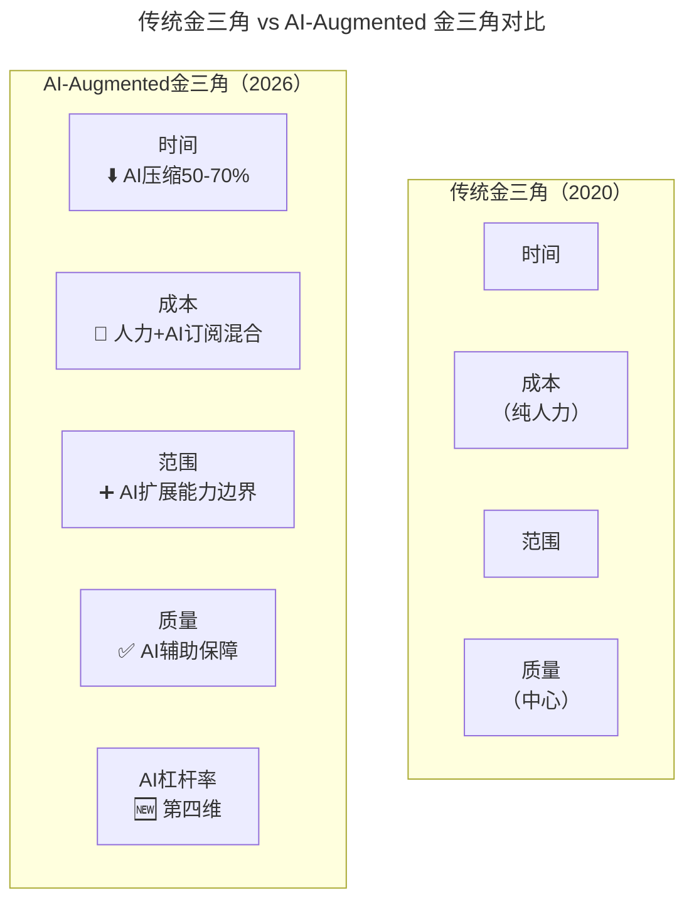
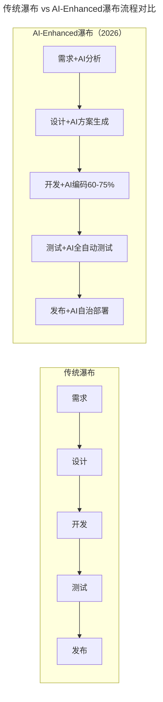

# 第199讲 | 宝玉：怎样平衡软件质量与时间成本范围的关系？

> **适用范围**：项目经理、技术负责人、产品经理，以及需要在时间、成本、范围、质量之间做出权衡决策的所有软件项目参与者。

> **更新摘要（v2 · 2026-08 更新）**：
> - 结构化升级为 6 节骨架（导言 / 核心方法论 / 关键流程 / 工具与实战 / 常见误区 / 进阶延展）
> - 保留宝玉原文完整内容及金三角理论
> - 将传统金三角升级为"AI-Augmented金三角"模型（新增AI杠杆率第四维度）
> - 新增瀑布模型与敏捷开发的AI时代演进对比
> - 整合原文独立的AI时代注解内容到对应章节

---

## 1. 导言

你会发现，在实际的软件项目中不乏这样的例子：

- 一个项目，正常估算，要三个月才能完成，但是老板或客户要压缩到一个月完成，而你不知道如何说服他们；
- 项目开发一半，产品经理告诉你，有一个非常紧急的功能，要增加到这个版本中，你不知道该不该拒绝，或者如何拒绝；
- 听说迭代模型很好，你也尝试使用迭代模型，但是每次迭代时间到了还是完不成，只能把迭代时间延长，最后又做回传统的瀑布模型了；
- 你们组用瀑布模型开发，一到项目后期总免不了加班加点赶进度，为什么他们用敏捷开发的加班要少一些？

其实，这些日常项目中涉及时间、成本和范围的问题，都离不开"软件项目管理金三角"（Project Management Triangle）的概念。

掌握好这个知识点，学会平衡软件质量与时间成本范围的关系，可以帮助你更好的驾驭项目中的各种问题，也可以帮助你更好地理解软件工程中各个模型，尤其是瀑布模型和敏捷开发。

进入2026年，原文核心理论"项目管理金三角"面临根本性重构——**AI作为新的变量彻底改变了三角形的平衡方程**。84%开发者使用AI编程工具后，"时间"这条边被大幅压缩，"成本"被重新定义（从人力成本转向AI订阅+人力混合成本），而"质量"则获得了AI辅助保障的新维度。本文将对金三角理论和各类开发模式进行全面的AI时代升级。

---

## 2. 核心方法论

### 2.1 什么是软件项目管理金三角？

在现实生活中，我们都知道，做产品想"多快好省"都占着，是不可能的，最多只能选两样。想要便宜和质量好，就要花时间等；想要快还要质量好，那就得多花钱；想要又便宜又快，那就得接受难用质量差。

而在软件项目中，也有一个类似的平衡关系，就是软件质量（产品的质量，客户的满意度）与范围（需要实现多少功能）、时间（多久可以完成）、成本（花多少钱）四个要素之间的平衡。

这就是著名的项目管理金三角（以下简称"金三角"），三条边分别是时间、成本和范围，中间是质量。

为什么四个要素，是"质量"放在三角形的中间？

因为 **软件工程的目标就是要构建和维护高质量的软件**，所以项目的质量是高于一切的。也就是说，"质量"这个因素一般不会妥协，因此把"质量"放在三角形中间，然后在时间、成本、范围这三条边之间寻求平衡。

质量往往也是其他三个因素平衡后结果的体现，想要做的快、成本低、功能多，最后一定是个质量很差的产品。

### 2.2 ⭐ AI-Augmented 金三角模型

2026年，传统金三角被AI深刻重塑，新增"AI杠杆率"作为第四维度：

上图对比了传统金三角与AI-Augmented金三角的差异：传统模型中三条边均为线性变量，质量居中不妥协；AI-Augmented模型中，时间被AI压缩50-70%，成本从纯人力重构为"人力+AI订阅混合"，范围因AI代码生成能力而扩展，质量获得AI Code Review保障。最关键的变化是新增"AI杠杆率"作为第四维度——它衡量AI对项目效率的提升程度，成为平衡方程中的新变量。

**AI对各边的具体影响：**

| 金三角边 | 传统含义 | AI时代变化 | 影响程度 |
|---------|---------|-----------|---------|
| **时间** | 项目工期 | **AI可压缩30-70%** | 🔴 极大 |
| **成本** | 人力成本 | **变为 人力 + AI工具订阅 + 云API调用** | 🟠 重构 |
| **范围** | 功能范围 | **相同时间可做更多（AI生成代码）** | 🟢 正向 |
| **质量** | 产品质量中心 | **AI Code Review + 自动测试提升质量** | 🟢 增强 |

### 2.3 如何应用"管理金三角"做决策？

我在专栏中常用"道术器"来比喻软件工程中的各个知识点，"金三角"无疑就是"道"级别的。

**项目管理其实就是项目中一系列问题的平衡和妥协，** 而"金三角"理论则为我们的平衡提供了理论指导，了解这三个因素分别对项目其他方面产生的影响，可以帮助你在做决策时进行权衡取舍。

当你接手一个项目，项目的进度、成本和范围指标很容易可以跟踪到。有了这些信息，你就可以及时发现问题，调整"金三角"的边，及时解决，以防止这些小问题发展成大问题。

---

## 3. 关键流程

### 3.1 场景1：老板要压缩项目时间怎么办？

当项目经理，常遇到的问题之一就是时间被压缩，比如文章中开头举的例子，老板问我一个项目多久能完成，我按照经验，觉得要三个月，老板觉得三个月太久了，要砍到一个月就上线。

最开始的时候，我就是据理力争，说这不科学，肯定不行呀。老板说时间点很重要，必须要一个月上线。结果就是大家吵得不欢而散，最后还得加班加点做，质量也不好。

后来我学乖了，先用金三角知识分析了一下： **老板希望时间是1个月，也就是说时间这条边被缩短了，那么结果就是会影响到另两条边：范围和成本，如果另外两条边可以调整，也不是不可以。**

于是再遇到这种问题，我就换了一种方式跟老板沟通："一个月也不是不行，就是我们得需求调整一下，第一个版本只能做一些核心功能，剩下的后面版本再加上。（调整范围）另外还得给我加两人，不然真做不完！（增加成本）"

这样的方案一提出来，就好沟通多了，最后重点就变成了砍多少功能和加多少人的事情了。

**⭐ 2026新选项：**

| 方案 | 传统做法 | AI增强做法 | 推荐度 |
|-----|---------|-----------|-------|
| 调整范围 | 砍功能到核心集 | **AI快速评估哪些功能可用AI自动生成** | ★★★★★ |
| 增加成本 | 加人 | **加AI工具/Agent（边际成本远低于加人）** | ★★★★☆ |
| 提升效率 | 加班 | **全员使用AI编程工具，正常工作时间完成** | ★★★★★ |

### 3.2 场景2：产品经理要临时加需求怎么办？

在文章开篇我提到一种情况，项目开发一半，产品经理告诉你，有一个非常紧急的功能，要增加到这个版本中，怎么办？我们拿"金三角"知识先套用一下。增加需求，也就是范围这条边要增加，那就必然对成本和时间这两条边造成影响，要么延期，要么增加成本。

面对这种临时加需求的情况，我们也不需要直接说不能加，而是清楚的让产品经理认识到这样做的后果：进度延期，需要更多的成本。如果这个功能真的太重要，可以接受延期，也不是不可以接受，那就重新制定新的项目计划好了。

所以你看，如果我们能应用好"金三角"的知识，很多软件项目中问题，一下子就多了很多方案可以选择了。

**⭐ 2026对话模板：**
> PM: 加一个搜索功能吧
> Tech: 让我看一下AI评估... 这个功能的AI杠杆率很高（8/10），用AI生成大概2小时就能出初稿，加上Review和集成，总共影响半天，不需要延期。但要注意：AI生成的搜索需要特别关注边界case的测试。
> PM: 这么快？那就加！

### 3.3 瀑布模型和敏捷开发如何平衡时间成本范围？

除了可以将金三角的知识应用在软件项目中，还可以应用它来理解和应用软件工程中的开发模式，尤其是瀑布模型和敏捷开发这两种典型的开发模式。

瀑布模型有严格的阶段划分，有需求分析、系统设计、开发和测试等阶段，通常在开发过程中不接受需求变更，也就是说，我们可以认为 **瀑布模型的范围是固定的，其他两条边时间和成本是变量。**

所以使用瀑布模型开发，如果中间发现不能如期完成进度，通常选择的方案就是延期（加班），或者往项目中加人。

我们再来看敏捷开发，敏捷开发中，是采用固定时间周期的开发模式，例如每两周一个Sprint，团队人数也比较少， **所以在敏捷开发中，时间和成本两条边是固定，就只有范围这条边是变量。**

这就是为什么在敏捷开发中，每个Sprint开始前都要开Sprint计划会，大家一起选择下个Sprint能做完的任务，甚至于在Sprint结束时，没能完成的任务会放到下个Sprint再做。

这时候再想想文章开头我们提到的问题：

> 听说迭代模型很好，你也尝试使用迭代模型，但是每次迭代时间到了还是完不成，只能把迭代时间延长，最后又做回传统的瀑布模型了。

你现在是不是就明白了：如果不能固定"时间"这条边，就会导致时间也成了变量，迭代自然无法正常推进。

### 3.4 ⭐ 各开发模式的AI时代演进

#### 瀑布模型的AI增强

**原文**：范围固定，时间和成本为变量 → 延期或加人

**⭐ 2026升级**：

上图展示了瀑布模型的AI增强演进：传统瀑布的五个阶段（需求→设计→开发→测试→发布）在AI增强后，每个阶段都融入了AI能力——需求阶段AI辅助分析、设计阶段AI生成方案、开发阶段AI编码占比60-75%、测试阶段AI全自动测试、发布阶段AI自治部署。关键变化是每个阶段耗时压缩50-70%，但AI主要在每个阶段内部提效，不改变流程本质。

**关键变化**：
- 每个阶段耗时压缩50-70%
- AI主要在每个阶段内部提效，不改变流程本质

#### 敏捷开发的AI增强

**原文**：时间和成本固定，范围为变量

**⭐ 2026升级**：

| 维度 | 传统敏捷 | AI-Enhanced敏捷 |
|-----|---------|----------------|
| Sprint周期 | 2周 | **可缩短至1周** |
| Sprint规划 | 人工估算 | **AI基于历史数据估算**（偏差±15%） |
| 每Sprint交付 | 5-8个用户故事 | **10-15个用户故事** |
| Code Review | 人工Review | **AI初审 + 人工复审**（时间↓80%） |

---

## 4. 工具与实战

### 4.1 如何平衡好软件质量与时间成本范围的关系？

那么怎么样才能平衡好软件质量与时间成本范围的关系呢？

前面我们说日常生活中"多、快、好、省"最多只能选两样，其实如何平衡好软件质量与时间成本范围的关系也是一样的道理，我们只能最多选择两样，然后在另一边或者另两条边去寻找平衡。

所以第一件事就是： **从时间、成本和范围这三条边中找出来固定的一条或者两条边，再去调整另一条边。**

### 4.2 案例：淘宝网站第一个版本是怎么做到一个月上线的？

这个故事其实我是从极客时间《从0开始学架构》专栏看来的，李运华老师在《架构设计原则案例》一文中举了淘宝网站的例子：

> 2003年4月7日马云提出成立淘宝，2003年5月10日淘宝就上线了，中间只用了一个月时间。

好，如果你是当时的淘宝网站负责人，马云要你一个月上线淘宝网站，功能还不能少，你怎么办？

第一件事当然是先应用金三角分析一下：时间这条边被固定了，只能一个月；功能也不能少，范围这条边也限制住了，那就只能在成本上想办法了。要么一下子雇很多牛人，要么直接买一个现成的电子商务网站，然后修改。

显然，直接买一个网站，再雇一堆牛人的方案最好，所以淘宝网站就这样在一个买来的网站基础上，由一堆牛人快速搭建起来了。归功于淘宝网站的快速上线，刚推出后，正好赶上"非典"，网购需求增大，淘宝网一下子就火爆起来了。

从成本角度我们还有可以去做的，比如说有同学在看完《06 \| 大厂都在用哪些敏捷方法？（上）》这篇文章后，也想在团队里面推行代码审查和CI，但是苦于搭建这一套git+CI的系统没有经验，不知道该如何下手，怎么办呢？

我的建议就是刚开始就没必要自己去折腾了，买一套GitHub的企业版，加上支持GitHub的商业CI系统，花不了多少钱，而且可以节约大量搭建这种系统的时间。

### 4.3 案例：极限编程是怎么做到"极限"的？

前面在介绍敏捷开发的时候，也提到了极限编程（eXtreme Programming，XP），是目前敏捷开发主流的工程实践方法，极限编程的"极限"（Extreme），意思就是如果某个实践好，就将其做到极限。比如：

- 如果做测试好，就让每个开发人员都做测试
- 如果集成测试重要，就每天都做几次测试和集成
- 如果简单的就是好，那么我们就尽可能的选择简单的方法实现系统功能
- ……

极限编程的"极限"理念，产生了很多优秀的实践方法，例如持续集成、自动化测试、重构等。

这些实践帮助我们可以在短时间的迭代中，产生高质量的代码。我们用金三角的理论来分析一下极限编程在Sprint中的应用。

在一个Sprint中，计划好了当前Sprint要做的工作内容后，那么极限编程怎么帮助我们提高代码质量呢？

一个Sprint要做的内容是确定的，相当于成本和范围这两条边都固定了，时间这条边就成为变量了。要么通过加班延长工作时间，要么通过提升效率、减少浪费帮助我们提升时间利用率。

极限编程，就是通过帮助我们提升效率和减少浪费这方面来做的。比如说：

- 持续集成，通过自动化的方式帮助我们部署，节约了大量需要人去手动部署的时间；
- 自动化测试，通过自动化测试，节约测试时间，另外，有了自动化测试，可以避免后面修改代码产生bug，减少了大量的浪费；
- 只做刚好的设计，避免设计时考虑了太多不必要的可能，造成浪费。

其实我们在项目中也有很多地方可以借鉴这种思路，比如说写代码的时候，少自己造轮子，多使用成熟的开源或者商业组件，可以提升效率；比如把需求想清楚搞清楚再去开发，可以减少很多返工的时间成本！

### 4.4 案例：MVP模式是怎么诞生的？

这些年流行的MVP（minimum viable product，最小化的可行性产品）模式，是一种快速推出产品的模式：一开始只推出最核心的功能，满足用户最核心的需求，然后在用户的使用过程中收集反馈，进一步升级迭代。

这种模式怎么诞生的呢？还是应用金三角理论，要快速推出产品，还想成本不用太高，那就意味着时间和成本这两条边是固定的，剩下范围这个变量。

所以最简单有效的办法就是砍掉一些重要性不那么高的功能需求，只保留最核心的需求。通过缩小范围的方式，达到快速推出高质量产品的效果。

类似的道理，我们程序员，在遇到很多功能忙不过来的时候，可以主动的去和项目经理协商，砍掉一些不那么重要的需求，把精力放在核心需求上，保证项目可以如期上线。

### 4.5 ⭐ 行动清单：AI时代的项目管理升级

**⭐ 2026立即行动**

- [ ] **今天**：用AI杠杆率评估标准对当前项目待办事项打分
- [ ] **本周**：在下一次排期会议中尝试使用"AI-enhanced"话术
- [ ] **本月**：建立团队的"AI项目评估Checklist"

---

## 5. 常见误区

### 5.1 金三角应用的常见误区

- **误区1：质量可以妥协**——质量放在三角形中心，是不可妥协的因素。试图在质量上妥协，最终一定是个质量很差的产品
- **误区2：三条边都想固定**——"多快好省"最多只能选两样，三条边都固定是不可能的
- **误区3：迭代模型不固定时间**——如果不能固定"时间"这条边，迭代自然无法正常推进，最终又做回瀑布模型

### 5.2 AI时代金三角应用的新误区

- **误区1：AI万能论**——认为有了AI就不用做权衡了，实际上AI压缩了时间但引入了新的成本维度（AI订阅、Token费用）
- **误区2：忽视AI杠杆率评估**——不是所有功能都适合AI生成，需要评估AI杠杆率后再决策
- **误区3：AI生成代码不Review**——AI生成的代码仍需人工Review，尤其是边界case和安全性
- **误区4：Sprint周期盲目缩短**——虽然AI可以缩短Sprint周期，但需评估团队AI成熟度，不可一刀切

---

## 6. 进阶延展

### 6.1 总结

其实，要平衡好软件质量与时间成本范围的关系并不难，你只需要记住，最重要的是根据"金三角"的三条边，找出来固定的一条或两条边，然后去调整剩下的边，达到平衡。

软件项目的"金三角"很多人都知道，主要是不知道如何应用到实际的项目中，希望这篇文章能为你提供一些思路，帮助你在项目中真正应用好这个非常实用的知识。

对于质量和时间成本范围的平衡，你有没有什么应用的案例？你对你当前项目的时间、范围和成本都清晰吗？有没有什么可以做的更好的地方？

### 6.2 AI时代的金三角新平衡

**注解说明**：本章节基于2026年AI深度普及的现状，对原文"软件质量与时间成本范围平衡"进行AI时代全面升级。金三角理论依然有效，但每条边都被AI深刻改变——管理者需要在新的平衡方程中找到最优解。

新的平衡方程：
- **传统方程**：质量 = f(时间, 成本, 范围)
- **AI时代方程**：质量 = f(时间, 成本, 范围, **AI杠杆率**)

AI杠杆率（AI Leverage Rate）衡量AI对项目效率的提升程度，取值0-10：
- 0-3：低杠杆率，AI贡献有限，传统方法为主
- 4-7：中杠杆率，AI辅助显著，需人机协作
- 8-10：高杠杆率，AI主导生成，人工Review为主

在新的平衡方程中，管理者不仅要考虑传统三条边的权衡，还要评估每个功能的AI杠杆率，选择最优的AI介入程度，从而在新的维度上实现平衡。

### 6.3 参考与延伸

- 极客时间《从0开始学架构》专栏：李运华老师的淘宝网站案例
- 极限编程（eXtreme Programming, XP）：敏捷开发主流工程实践方法
- MVP（Minimum Viable Product）：最小化可行性产品模式
- 持续集成、自动化测试、重构：极限编程的核心实践方法
- GitHub企业版 + 商业CI系统：快速搭建代码审查和CI的低成本方案
