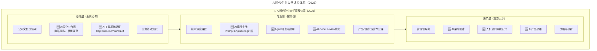
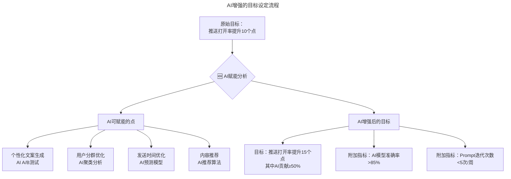

# 第19讲 | 将企业打造成一所终身大学

> **适用范围**：技术管理者、HR负责人、企业培训体系设计者，以及关注团队成长与组织能力建设的管理者。

> **更新摘要（v2 · 2026-08 更新）**：
> - 结构化升级为 6 节骨架（导言 / 核心方法论 / 关键流程 / 工具与实战 / 常见误区 / 进阶延展）
> - 保留陆栋栋原文完整内容及成长管理体系
> - 将传统企业大学课程体系升级为AI时代三层课程体系（基础层/专业层/进阶层）
> - 新增AI能力认证体系、AI增强OKR设定、AI智能知识库等2026实践
> - 整合原文独立的AI时代注解内容到对应章节

---

## 1. 导言

我们可能经常会遇到一种情况，团队成员突然有一天跑过来，跟我们说：

- "我学不到东西"
- "我已经都会了"
- "我感觉没啥成长"
- "每天都在重复劳动"

……

接着就是，"我想离职，换个环境……"

团队成员的成长是一直困扰管理者的问题，今天我们就一起简单讨论学习一下。

进入2026年，**"终身学习"的定义被彻底改写**。原文提出"将企业打造成一所终身大学"的理念在AI时代更加重要——因为**技术半衰期已缩短至2-3年**，不学习就意味着被淘汰。

但学习的**内容和方法**都发生了质变：
- **从"学框架"到"学AI协作"**
- **从"线下培训"到"AI自适应学习"**
- **从"知识积累"到"能力验证"**

GPT-5.5和DeepSeek V4的出现意味着：**获取知识的成本趋近于零，但甄别和应用知识的能力变得前所未有的重要**。

### 成长的定义

我对成长的理解就是通过自己的学习和工作，在一个环境里，和组织一起互相扶持，发挥自己的价值，同时也创造价值，得到反馈，不断积累的一个过程。过程中会有坎坷，不断克服困难，放空自己的心态，接受一切挑战，并最终朝着一个既定的目标前进。整个过程中充满了乐趣和成就。

团队成员的成长一开始更偏基础实际一点，而随着经验的增加，诉求会更多元，也更偏上层务虚一点。

新人刚加入团队的时候，我们会有一套帮助他着陆的方案。包括公司历史，文化，价值观，公司内部的技术框架，公司业务，最佳实践等。随着员工的成长，会给他更成体系的培训，并有日常的经验分享。对于公司核心人才或高管会有管理咨询培训，并且有创业营计划，在带领团队打仗的过程中不断成长。

在务虚方面，我们每周三会组织一个管理会，将20多个技术负责人聚在一起，大家讨论和产品技术无关的话题，讨论关于人的问题。有的时候采用分享的方式，有的时候采用分组讨论的方式，有的时候采用集体共创的方式。互相扶持着成长，经验和想法交流，帮助某位同学解决问题，用集体智慧共同解决公司问题。

企业本身需要打造成一所终身大学，含有各个学科，可以永不毕业，每个人都能一直深造。

---

## 2. 核心方法论

### 2.1 管理者可以做什么

管理者需要和员工一起定目标，拆成多个阶段，定落地方案，并阶段性给出反馈结果。过程当中我们采用共创的方式，达成共识，充分尊重团队成员的想法，而管理者在当中教的最重要的是学习和工作方式。

#### 目标

目标要清晰，可度量，限定时间，包括工作和学习。在定目标前，我们会先调查现状，并和团队成员在目前现状上达成共识，接着一起定目标，并充分尊重团队成员的意愿。我们年初时会和各业务团队定好目标，并分解到季度，每个季度会重新review，并及时调整目标。每个团队技术负责人会和各团队成员定成长目标，每个季度都会有到个人的one-on-one review。

#### 落地方案

目标会分阶段实施，每个阶段先大致定个目标，再不停迭代优化。这个时候，会再讨论什么是最重要的，最紧急的，用户到底需要什么，未来会是什么样的，用终局来看当前，寻找最合适的方案。

#### 反馈（Review）

人往往都需要监督，给出反馈，才能不断优化。首先鼓励团队成员自我总结，反馈，其次从专家和教练方向，督促他，给出管理者的反馈意见。

#### 工作/学习方法

我们经常会说："这个人不行，思路不对"，其实是这个人的学习方法，工作方式不对，我们给出指导，给员工机会让他成长，如果实在不行再淘汰。

工作方式要有框架性或整体思维，落地时分阶段落地，得到结果，为下一阶段提供准备。细节决定成败，在落地过程中要关注细节，但如果代价太高，需要权衡。得到的结果要有价值，只有苦劳，没有功劳，是得不到成长的。

学习方法我自己分为快速学习，系统学习，深度学习。快速学习是了解一个新领域，如果想进入就先系统学习，如果自己操刀就需要深度学习，成为专家。

### 2.2 ⭐ AI时代企业大学课程体系升级

原文提到的新人着陆方案、体系化培训、管理会等在2026年需要全面升级：

上图展示了2026年AI时代企业大学的三层课程体系：基础层（全员必修）新增AI安全合规和AI工具基础认证；专业层（按岗位）新增AI编程实战、Agent开发、AI Code Review等课程；进阶层（高潜人才）新增AI架构设计、人机协同系统设计、AI产品思维等课程。三层递进，覆盖从全员AI素养到高潜人才AI领导力的完整培养路径。

### 2.3 ⭐ 新增核心课程模块

| 课程名称 | 目标学员 | 时长 | 核心内容 |
|----------|---------|------|---------|
| **AI工具基础认证** | 全员 | 8小时 | Copilot、Cursor、ChatGPT等工具的基础使用 |
| **Prompt Engineering实战** | 技术人员 | 16小时 | 提示词设计、Chain-of-Thought、结构化输出 |
| **AI安全与合规** | 全员 | 4小时 | 数据隐私、知识产权、企业AI使用红线 |
| **Agent开发入门** | 高级工程师 | 24小时 | Agent概念、LangChain/GPTs、工作流编排 |
| **AI辅助架构设计** | Tech Lead+ | 16小时 | AI参与架构决策的方法论与边界 |

---

## 3. 关键流程

### 3.1 成长来自于实践，不会一帆风顺

成长过程中，会遇到很多的挑战，很多新事物，直观的感觉是排斥它，这样无法成长。有首歌是这么唱的，不经历风雨，怎么见彩虹，没有人能随随便便成功。而作为管理者，给团队成员更多的机会，让他们去锻炼，不要担心他们会失败，但也不要袖手旁观。有些leader在管理时就直接放手，只管结果不管过程，导致团队成员一次次失败，更打击了他们的积极性。有人会问在什么时候给出帮助呢？

- **他向你求助时**
- **阶段性看过程时**

不管是工作，还是学习，都要和团队成员进行阶段性review，在review时要给出帮助。

- **解决紧急问题时**

紧急问题需要立刻解决，所以并不能给团队成员太多时间，这时他其实也可能需要你的帮助，互相沟通一下，如果他有思路解决，给他时间，如果没有思路，跟他一起解决。

- **方向把控时**

要和团队成员，确定大家的目标都是一致的，而且没有方向的问题。主要防止走错方向，做无用功，恶劣地影响团队整体产出。

- **跨团队和跨部门协调时**

作为团队的负责人，你比他更有调动资源的能力，要为他协调组织。

成长来自于实践，在实践中我们会有很多收获，我们要及时把他们保存下来。

- **知识库**

建立一套知识库体系，早期的时候会用confluence来记录，文档放在NAS上。后续会搭建公司内部资料共享的系统，公司技术博客。

- **复盘**

复盘是一种很好的总结，学习的方式，从失败当中获得成长。每个人都做自我总结，大家再一起给出改善建议，将整个复盘的结果保存下来，缺点改正，优点传承。

### 3.2 实战案例：移动端推送打开率目标

我们看一个实例：我们一个中台开发年度目标移动端推送打开率，推送打开人数/DAU提高绝对值10个点。

这位同学一开始比较抵触，说推送这个主要看推送的内容用户喜不喜欢，这是运营团队的事，是各业务线的事，我不能背这指标，我只能负责推送的达到人数。当然推送的到达人数多了，打开率就会高。但是这对于他的成长，价值是有限的，我们描绘了这件事给他的未来的成长空间，怎么去赋能业务，怎么去跟踪数据，怎么去做个性化，怎么去倒逼业务，怎么去利用资源等等。如果你都把这些事情做好，数据会不会增长，你自己会不会比你一开始提的目标得到更多的成长。

这位同学回去后立马对目标做了分解，Q1做达到人数，Q2做推送数据可视化，Q3做特征模型训练，Q4做货币化（和业务结算资源），并对工作做了详细拆解。每个Q下来我们会对结果做Review，并且把所有业务团队对接人一起叫过来，真正从用户角度review，收集反馈。而我们只是教练角色，从工作方式上给予指导。

### 3.3 ⭐ AI时代成长目标设定升级

原文以"推送打开率提升10个点"为例说明目标设定。在2026年，类似的目标需要考虑AI赋能：

上图展示了AI时代目标设定的升级流程：原始目标"推送打开率提升10个点"经过AI赋能分析后，识别出个性化文案、用户分群、发送时间、内容推荐四个AI可赋能点，最终升级为"推送打开率提升15个点（其中AI贡献≥50%）"的增强目标，并附加AI模型准确率和Prompt迭代次数等过程指标。这种升级方式既保留了原目标的业务价值导向，又融入了AI能力的量化要求。

**⭐ AI时代OKR设定建议：**
1. **结果目标中明确AI贡献占比**：如"效率提升30%（其中AI工具贡献20%）"
2. **过程目标中加入AI能力要求**：如"团队AI工具覆盖率≥90%"
3. **学习目标作为正式OKR**：如"完成Prompt Engineering中级认证"

### 3.4 ⭐ AI时代的"管理会"升级

原文提到每周三的管理会讨论"关于人的问题"。在2026年，建议增加AI相关议题：

| 议题类型 | 传统内容 | 🆕 AI时代新增 |
|----------|---------|--------------|
| 团队问题 | 氛围、士气、冲突 | **AI工具 adoption 障碍、AI焦虑疏导** |
| 能力建设 | 培训计划、晋升通道 | **AI技能提升路径、AI认证推进** |
| 流程优化 | 协作效率、沟通成本 | **AI工作流优化、自动化机会识别** |
| 风险管控 | 项目风险、人员流失 | **AI安全风险、技术债AI识别** |

---

## 4. 工具与实战

### 4.1 成长不是个体的

成长的最高境界是成就他人，但首先还是管理者自己的个体成长，自己不要成为团队的天花板。技术管理者是团队的旗帜，大家都在向他看齐，他的言行举止是最重要的。成长首先是看个体成长，团队成员的每个人都是其中的个体，每个人都有自己的想法，而且处的阶段都不同，要让他们每个人都能获得成长。团队需要有出类拔萃的标兵人才。但整个团队都依赖于个别人，说明人才结构就不健康了。

#### 选才培养

从招聘开始，就会去选适合团队文化和人才结构的候选人。我们很重视对年轻人培养，敢于破格提拔年轻人试错，让有作为的年轻人成为团队的核心。

#### 团队目标

上一节提到个人目标，整个团队需要有一个整体目标，协同所有人，一定要沟通到位，上下一致。

#### 营造氛围

营造工作学习氛围，调动大家的积极性，每个人都能独立负责一块。在营造技术氛围这一块，我们鼓励大家分享，建立培训体系，组织hackathon活动，喜欢真正对技术感兴趣并乐于分享的同学，给他们荣誉，比如最佳讲师，技术创新奖等。同时创建公司技术博客，在精力允许下，提倡员工出去分享，提高技术影响力。

### 4.2 ⭐ 知识库 → AI驱动的智能知识库

原文提到用Confluence记录知识库。2026年应升级为：

| 维度 | 传统知识库 | 🆕 AI智能知识库（2026） |
|------|-----------|----------------------|
| 存储方式 | 文档、Wiki | **文档 + 向量数据库 + RAG** |
| 检索方式 | 关键词搜索 | **自然语言问答 + 语义搜索** |
| 更新方式 | 手动维护 | **AI自动更新 + 变更提醒** |
| 使用体验 | 被动查找 | **主动推荐 + 上下文感知** |

### 4.3 ⭐ 复盘 → AI增强复盘

⭐ **2026实践：**
- **数据自动收集**：AI汇总Git提交、Jira工时、Bug统计
- **模式识别**：AI分析问题根因，识别重复出现的模式
- **建议生成**：AI基于历史复盘数据，生成改进建议
- **行动项追踪**：AI自动跟踪改进项的执行状态

### 4.4 ⭐ Hackathon → AI Hackathon

原文提到组织Hackathon活动。2026年建议主题聚焦AI：

| Hackathon主题类型 | 示例题目 | 评审标准 |
|------------------|---------|---------|
| **AI效率工具** | "用Agent自动化我们的日报流程" | 实用性、创新性、AI使用深度 |
| **Prompt竞赛** | "为我们的Code Review设计最佳Prompt链" | Prompt质量、通用性、效果 |
| **AI产品原型** | "用Vibe Coding 48小时内做一个MVP" | 完成度、产品价值、AI利用程度 |
| **AI安全攻防** | "发现并修复我们AI使用中的安全隐患" | 发现问题的严重性、解决方案的有效性 |

### 4.5 ⭐ 技术博客 → AI技术博客

鼓励团队成员分享AI实践经验，如：
- "我是如何把AI Code Review误判率降到5%以下的"
- "我们团队的Prompt Library搭建经验"
- "当DeepSeek V4帮我重构了10000行代码之后"

### 4.6 成长就是为了创造价值，并满足自我需求

成长最终目的还是为了创造价值，成长过程中的成就感也来源于创造的价值。创造的价值最终是服务于我们的用户，得到成就感，但同时基于人性，我们不能忽视财富，权利，虚荣心的需求。

#### 成就感

最好的办法是让做工作的人有成就感，通过工作本身，变得有成长，通过工作不能调动他的动机，就没有持续的动力来调动他的积极性。

#### 荣誉

荣誉可以成为不断鞭策荣誉获得者保持和发扬成绩的力量，还可以对其他人产生感召力。在企业中我们设计了职位，职级，表彰（优秀员工，优秀团队）等，给予员工最大的尊重。对于员工的重大贡献，要公开表扬，同时对犯错的员工不要过分批评、指责和抱怨，对事不对人，给予帮助和指导。

#### 财富

包括工资，奖金，股票期权。工作的结果不会直接跟工资挂钩，工资会和岗位，职级挂钩。奖金往往和工作绩效挂钩，要考虑工作背后的真正价值，防止过度KPI化。奖金要和员工期望值挂钩，过度激励和过少激励都是不科学的。长期业务的奖金偏向于阶段性激励，而不是项目制，这样才能给予真正的价值判断。

#### 使命感

企业强调自己的使命愿景价值观，加强员工的使命感，所有人活着都想做点有意义的事情，将所有员工的成长和公司使命愿景放在一起，形成共识，激发团队的向心力，用价值观去规范员工的言行举止。

---

## 5. 常见误区

### 5.1 ⚠️ AI时代学习型组织的陷阱

#### 陷阱1：培训内容滞后于技术发展
- **现象**：培训的还是去年的AI工具
- **对策**：建立**快速响应机制**，新工具出现2周内出培训材料

#### 陷阱2：忽视"去学习"的能力
- **现象**：只教怎么用工具，不教怎么判断该不该用
- **对策**：加入**AI批判性思维**课程，培养判断力

#### 陷阱3：学习变成形式主义
- **现象**：大家为了凑学时而学习
- **对策**：**学习成果必须与实际项目结合**，无实践的学习不计入

### 5.2 成长管理的常见误区

- **误区1：直接放手只管结果**——导致团队成员一次次失败，打击积极性。应在求助时、阶段性review时、紧急问题时、方向把控时、跨团队协调时给予帮助
- **误区2：忽视工作/学习方法**——"这个人不行，思路不对"本质是学习方法和工作方式不对，管理者应教的是学习和工作方式
- **误区3：整个团队依赖个别人**——说明人才结构不健康，需要有出类拔萃的标兵，但不能形成单点依赖

---

## 6. 进阶延展

### 6.1 结语

团队管理者不光是个人获得成长，要让团队成员都能获得成长，和他们一起分享成长和收益，让每个团队成员未来都会比自己更好，成就他人才是最大限度的成就自己。

### 6.2 ⭐ 2026年终身大学 Checklist

- [ ] 更新**企业大学课程体系**，AI相关课程占比≥30%
- [ ] 建立**AI能力认证体系**（初级/中级/高级）
- [ ] 部署**AI驱动的内部知识库**（RAG + 向量搜索）
- [ ] 将**AI学习目标**纳入个人IDP和绩效
- [ ] 每季度举办**AI主题Hackathon或竞赛**
- [ ] 设立**AI学习基金**，报销外部AI课程费用
- [ ] 培养**内部AI讲师团队**，沉淀内部最佳实践

### 6.3 核心理念的AI时代升华

> 💡 **一句话总结（2026版）**：
> "将企业打造成一所终身大学"的理念比以往任何时候都更重要——因为在AI时代，**学习能力的半衰期比技术的半衰期更短**。2026年的企业大学 = **传统的文化传承 + AI工具方法论 + 批判性思维培养 + 持续适应变化的能力**。记住：**教具体的工具会过时，教学习的能力永不过时**。

### 6.4 作者简介

陆栋栋， [TGO鲲鹏会](https://tgo.geekbang.org) 上海分会会员，喜马拉雅CTO&技术合伙人，伴随着喜马拉雅的整个成长，微胖界典型码农。关注音频，知识付费，直播，AI大数据，区块链等领域。

### 6.5 参考与延伸

- 原文的新人着陆方案：公司历史、文化、价值观、技术框架、业务、最佳实践
- 管理会机制：每周三的技术负责人集体讨论，分享/分组讨论/集体共创三种形式
- 快速学习/系统学习/深度学习三层学习方法论
- Confluence + NAS → AI智能知识库（RAG + 向量数据库）的演进路径
- Hackathon → AI Hackathon的主题升级方向
