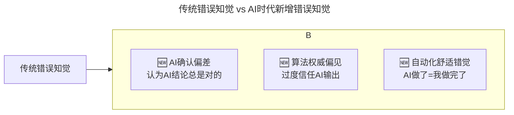

# 第188讲 | 张嵩：从心理学角度看待小中型团队的管理

> **适用范围**：技术管理者、团队Leader，以及希望从心理学视角理解团队行为、提升管理效能的管理者。

> **更新摘要（v2 · 2026-08 更新）**：
> - 结构化升级为 6 节骨架（导言 / 核心方法论 / 关键流程 / 工具与实战 / 常见误区 / 进阶延展）
> - 保留张嵩原文完整内容及四大心理学理论（自我服务归因、错误知觉、基本归因错误、自我妨碍）
> - 将传统归因理论升级为AI时代归因模型（新增AI Agent作为归因对象）
> - 新增AI确认偏差、算法权威偏见、自动化舒适错觉等AI时代错误知觉类型
> - 整合原文独立的AI时代注解内容到对应章节

---

## 1. 导言

《未来简史》中说过，"我们以为自己懂得很多，原因在于我们把存在于他人大脑中的知识看成自己的了"，因而我希望能尽量地享受群体思维带来的知识，而非无知。我从大学时代开始就接触心理学的基础理论，如今，我会更多地将它运用于生活的方方面面，包括职场，例如技术管理。在这些内容之前的文章中，熟稔于管理之道的技术管理者们已经将各种管理经验及实践案例讲述得很详尽了，我自觉已无能力更上一层楼，因此本文将以另外一个角度，即心理学来切入技术管理，抛砖引玉。

其实，这也是我转型技术管理者之后的常用的一个分析方法，俗话说"当局者迷，旁观者清"，有时候跳出管理的维度，站在一个非本领域的角度，如心理学角度来看待问题，会带来许多思考与领悟。另外，在本文中你可能会发现很多问题在日常中自己都碰到过，甚至解决方式都异曲同工，毕竟虽然思考角度不同，但殊途同归，万变不离其宗嘛。

技术管理的方法论关联性很高，很难做到降维，因此接下来的内容直接以心理学理论来推导，而不以管理方法作为主线来扩展。

进入2026年，原文核心方法论"心理学视角的团队管理"面临新挑战——**团队成员结构变为"人类+Agent混合体"，管理对象从纯人类扩展到了人机协同**。84%开发者使用AI编程，"与AI协作"成为新的工作常态，对团队心理氛围产生了深远影响。本文在保留原文四大心理学理论的基础上，系统补充AI时代的新归因模式和认知偏差。

---

## 2. 核心方法论

### 2.1 自我服务归因

根据自我服务归因理论（Self-Serving Attribution），人都会习惯性地把好的结果归因于自己，把坏的结果归因于其它。例如面试中，你拿到了offer，可能会认为原因是自己基础扎实、思维快，如果与offer失之交臂，你可能觉得是因为面试官问的问题太偏/问的东西在实战中用不到等。

与此类似，技术管理人员容易把效能低、进度推进缓慢等归因于团队成员缺乏能力或者不够卖力等；团队成员会把获得奖励(例如加薪)看作是公平的，而对进度缓慢的看法会觉得是同事原因、任务目标不可及等。

这些现象在心理学中的术语叫自我服务偏差（Self-Serving Bias）。团队成员容易高估自己对群体成功的贡献，而低估对失败应该负的责任。因此成功时，大部分成员会认为自己做出了很大的贡献，如果没有得到薪酬提升或奖励，就极有可能会觉得不公平，引发嫉妒与不和；而失败时，则容易责备他人，并且影响团队的氛围。

因此在实际工作中，作为一个技术管理人员，在出现任何问题时，首先要思考：我的行为导致这问题出现的占比有多少？而非直接归因于团队成员或者情境，否则当问题主因并不在团队成员时，很容易造成团队成员的心理落差。

#### ⭐ AI时代新增归因对象：AI Agent

| 归因场景 | 传统表现 | AI时代表现 |
|---------|---------|----------|
| **成功归因** | "我的代码写得好" | "我选对了AI工具/Prompt" 或 "AI帮我发现的Bug" |
| **失败归因** | "需求不清晰" | "AI生成的代码有问题" / "模型能力不足" |

**管理启示：**
- **警惕"AI甩锅文化"**：团队成员可能过度将失败归咎于AI工具
- **建立"人机共同责任"意识**：AI是工具，使用者仍需对结果负责
- **案例**：当AI生成代码出现问题时，引导团队思考"我的Prompt是否足够清晰？我是否进行了充分的Code Review？"

### 2.2 错误知觉

这里需要强调"确保判断无误"——为什么要强调它？主要原因在于我们的知觉很容易受到误导。

不知道大家是否有过这样的经历，当发现一个员工连续在一些事情上犯错后，我们会不自觉地更多地关注到他后续的错误行为，例如上班时不认真干活而在看不相关的资料等，但与此同时，却觉得其他有同样行为的员工是在做完本职工作后扩展学习。

出现这种现象的主要原因在于，我们的信念和预期在很大的程度上影响我们对事件的建构与看法。这种现象其实很容易出现在各种评审会议、技术讨论等现实工作中，比如很多时候技术并非只有一条道能达成结果，但是如果多个研发有不同的思路，大部分情况下都会想方设法去证明基于自己思路的方案才是对的，同时陷入对其它方法的批判中，事实上双方的方案可能只是取舍方式不一，并无绝对对错。我们的先入之见会强烈地影响我们对事情的判断和解释。

另外，大部分人还会陷入"信念固着"（Belief Perseverance）的困境中，即使支持这个信念的证据被否定，但信念本身依然会存活下来，并可能会愈发固执。因此，建议大家在团队内推行以下思考方式："如果我是一个持相反意见的人，我是否会同那些与我信念不一致的人得出同样的结论呢？"

除此之外，错误知觉还有其他表现形式。心理学的一些研究表明，我们的记忆系统并不是一个储藏过去事实的地方，我们的记忆，实际上是在我们进行回忆时重构的，它会受到当前所持态度的严重影响。而且有研究数据显示，人们总是将过去错误的判断回忆成基本上是正确的，在专业术语上讲这种也被称为过度自信（Overconfidence）。

这种现象在技术管理者身上，就很容易出现误导信息效应（Misinformation Effect），也就是很多时候态度改变后，就可能会坚持认为自己一直以来都是这样想的。因此，针对团队成员的判断，最好的方式是进行记录，不要受到自己情感状态变更的影响，相信自己所记录的，而不要以之前可能不是太了解之类的理由让自己处于一个错误的判断中。

#### ⭐ AI时代新增错误知觉类型

上图展示了AI时代新增的三种错误知觉类型。AI确认偏差指团队成员用AI生成的分析来佐证自己已有的观点，而不去验证AI分析的准确性；算法权威偏见指因为是"AI说的"就认为是正确的，放弃批判性思维；自动化舒适错觉指认为AI完成了代码生成即任务完成，忽略测试和集成。这三种错误知觉在2026年的AI辅助开发团队中日益普遍，管理者需要针对性地设计对策。

| 错误知觉类型 | 具体表现 | 管理对策 |
|-------------|---------|--------|
| **AI确认偏差** | 团队成员用AI生成的分析来佐证自己已有的观点，而不去验证AI分析的准确性 | 要求"AI辅助+人工验证"双流程；引入AI结果交叉验证机制 |
| **算法权威偏见** | 因为是"AI说的"就认为是正确的，放弃批判性思维 | 建立"AI建议≠最终决策"的文化；定期进行AI误判案例分析 |
| **自动化舒适错觉** | 认为AI完成了代码生成=任务完成，忽略测试和集成 | 将"AI生成"和"人工验证"作为两个独立的工作量估算项 |

### 2.3 基本归因错误

上文中提到针对团队成员的判断，相信大家都有自己的一套判断方式，但是这边要提出一个技术领导者很容易犯的错误，包括我自己在内。

通常情况下，我们都会做出很合乎常理的归因，但是我们会习惯把他人的行为更多地归结为内在的特质以及态度，很少去考虑环境的影响限制，即使这个影响非常显著。原因是在于我们观察某个人表现的时候，那个人是我们的焦点，情境相对而言处于不可见的状态。但是我们观察自身的时候，会更多地去关注需要作出反应的情境，因此情境是可见的。

而情境的不可见容易给技术领导者带来误判，例如这个团队成员当前的状态如何，是否陷入对未来的迷茫？他的家庭生活/成员近期是否发生了变化？他当前是否对某些事务有意见？各种各样的情境很容易给团队成员带来巨大的改变，作为技术领导者，应该对这块了如指掌，否则将难以做出正确的判断以及补救。

就如同我们所观察到的，近期当父亲的团队成员很容易赶不上迭代，甚至在需求评审中走神，这时如果不清楚近况，就很容易陷入对他们的误解中，而如果能在这种时候给予对应的关怀，减轻短期的工作量，引导赚奶粉钱的思维等，等团队成员熬过新生儿最让人疲惫的前几个月，他们的状态反而会更加良好甚至爆发性增长。

### 2.4 自我妨碍

限于篇幅影响，我选择了一个技术管理者的自我陷阱作为最后内容，它很常见，而我们作为技术管理者，需要克服它来得到提升。

所谓的自我妨碍（Self-Handicapping），指的是人们习惯设置障碍来阻挠自己成功，以达到保护自尊的目的，大家先别急着否认，可以试着看完后回忆下。

前面讲过我们习惯把失败归为外因，以达到保护自身形象的目的。例如曾经年少的时候在考前各种玩耍而非学习，一旦考砸了就能把原因推到玩乐耽搁了学习而非能力不行上，一旦考好了则可以提升自己聪明的形象；再比如做一些项目没成功是因为一开始没认真去做，而非能力不足等等。

而研究者们发现，人们为此会做以下事情：

- 减少对重要的事情的准备；
- 给对手提供一些有利条件；
- 在任务开始时不好好干，以便不对自身产生过高期望；
- 在关系到自我形象的困难任务并不会尽全力，等等。

因此，在我们自己接手一项有难度的事情时，需要尽量去克服这种心理，同时需要使用各种方法来帮助团队成员避开这个陷阱。

#### ⭐ 自我妨碍的AI新形态

| 传统自我妨碍 | AI时代自我妨碍 |
|-------------|---------------|
| 考前玩耍而非学习 | **项目开始时不学习AI工具，为后续失败留借口** |
| 不好好干以降低期望 | **故意不用AI辅助，说"我还是喜欢手写"来保护自尊** |
| 减少准备 | **不深入学习Prompt Engineering，声称"AI应该懂我"** |

**应对策略：**
- **消除"用AI=偷懒"的 stigma**：明确AI工具是专业能力的延伸，而非捷径
- **设立"AI能力成长"的安全空间**：允许团队成员在学习AI工具时犯错
- **将AI技能纳入绩效正面评价**：鼓励而非惩罚AI工具的探索性使用

---

## 3. 关键流程

### 3.1 应对自我服务偏差的四件事

知道了偏差的原因，我们就可以有的放矢，我建议做四件事情：

1. **即时反馈**（Lichtenstein & Fischhoff），通过在事情进展过程中的即时反馈，我们可以降低团队成员的过度自信，因为清晰的反馈信息有助于矫正偏差。
2. **分解任务**（Kruger & Evans），对大任务的规划总是更容易陷入规划误区（Zauberman & Lynch），把大任务拆解成小任务，有助于减少团队成员的服务偏差所导致的问题。
3. **让团队成员养成反向思考的习惯**，从你认为错误的观点中寻求能证明它的方面。因为按照验证性偏差的观点，一旦你认为一个观点可能正确，你会找出各种理由来证明它，让它看起来更加正确。
4. **定期一对一沟通**，肯定团队成员的能力，同时在保证不伤及自尊心的前提下指出成员的不足之处，要注意对事而非对个人。并针对个人的形象提升，给出对应的成长计划。同时要拒绝大锅饭，在确保判断无误的情况下合理进行分配。

### 3.2 应对基本归因错误：关注"数字环境因素"

传统归因容易忽视的环境因素：家庭生活变化、对未来的迷茫、对某些事务的意见。

**2026新增需关注的"数字环境因素"：**

| 数字环境因素 | 表现 | 管理者应关注 |
|-------------|------|------------|
| **AI工具切换成本** | 团队刚换新的AI编程工具，适应期效率下降 | 给予工具迁移的学习缓冲期 |
| **Prompt工程疲劳** | 长时间调试Prompt导致认知耗竭 | 合理安排AI辅助与纯人工工作的比例 |
| **信息过载** | AI产生大量候选方案导致选择困难 | 提供决策框架，而非让团队面对无限选项 |
| **人机协作摩擦** | 与AI Agent协作时的挫败感 | 收集人机协作痛点，优化工具链配置 |

---

## 4. 工具与实战

### 4.1 心理学视角的团队管理实践

张嵩原文基于心理学理论，提供了以下可落地的管理工具：

- **即时反馈机制**：在事情进展过程中给予即时反馈，矫正偏差
- **任务分解法**：将大任务拆解为小任务，减少规划误区
- **反向思考训练**：从对立观点中寻求合理性，克服验证性偏差
- **记录式判断**：对团队成员的判断进行书面记录，避免情感状态影响记忆
- **情境关怀法**：关注团队成员的情境因素（如新生儿父亲），给予针对性关怀

### 4.2 ⭐ 2026行动清单

- [ ] 进行一次"团队AI归因模式调研"：了解团队成员如何归因AI相关的成功与失败
- [ ] 识别并纠正上述3种新型错误知觉（AI确认偏差、算法权威偏见、自动化舒适错觉）
- [ ] 在绩效沟通中关注"数字环境因素"，更新员工状态评估维度
- [ ] 创建"AI学习安全区"，消除团队对AI工具学习的自我妨碍心理

---

## 5. 常见误区

### 5.1 传统心理学管理的常见误区

- **误区1：直接归因于团队成员**——出现问题时未先反思"我的行为导致这问题出现的占比有多少"，造成团队成员心理落差
- **误区2：吃大锅饭**——为了团队稳定让所有人"吃大锅饭"，伤害了自认为表现更好的成员，导致优汰劣胜
- **误区3：信念固着**——技术方案被否认后不思考他人方案可行性，而是固执地在原方案中抽取可行部分争辩
- **误区4：以情感状态替代记录**——不记录对团队成员的判断，以情感状态变更后的记忆替代客观事实

### 5.2 AI时代心理学管理的新误区

- **误区1：忽视AI归因偏差**——未察觉团队成员将失败归咎于AI工具的倾向
- **误区2：算法权威崇拜**——因AI输出而放弃批判性思维，将"AI说的"等同于"正确的"
- **误区3：AI学习自我妨碍**——团队成员以"我还是喜欢手写"为由拒绝学习AI工具，管理者未识别这是自我妨碍

---

## 6. 进阶延展

### 6.1 结语

本文中谈到的从心理学角度看技术管理，其实主要都是针对人的层面，如果从对事、对团体等角度来分析，还包含说服、多人组成的平均水平降低、群体对决策的影响等非常值得探讨的话题。

作为技术管理者，需要关注的问题点着实很多，但是我相信方法更多。时代在不断地改变，新加入的团队成员的想法也在不断地改变，然而时代并不会主动来满足我们的团队管理方式，而是我们需要根据新时代团队成员的变化去不断地调整策略。

### 6.2 核心理念的AI时代升华

**注解说明**：本章节基于2026年AI深度改变工作环境的现状，对原文"心理学角度的技术管理"进行AI时代升级。核心理念不变——理解人性是管理的基础——但在AI时代，人性的内涵扩展了，管理者需要关注"人机协同"带来的新心理动态，以及AI如何改变传统的归因模式和认知偏差。

### 6.3 作者简介

张嵩，TGO鲲鹏会会员，九年互联网工作经验，2014加入他趣，先后从事微服务体系的构建、搭建技术梯队及构建研发体系等。同时从事多年互联网中小型公司顾问角色，为公司提供针对当前情况的技术/效率优化方案及实施，积攒了大量技术与应用结合的实践经验。对基础平台构建、机器学习、架构规划及实施、k8s等有深入研究，开源爱好者，Go语言及多个开源项目的contributor。

### 6.4 参考与延伸

- 《未来简史》：群体思维与知识归属的心理学洞察
- Chambers & Windschitl：自我服务偏差的知觉错误研究
- Dunning / Swann / Sedikides：自我服务偏差的心理动机研究
- Loftus：记忆重构理论
- Tetlock：过度自信与错误判断回忆研究
- 原文四大心理学理论：自我服务归因、错误知觉、基本归因错误、自我妨碍
