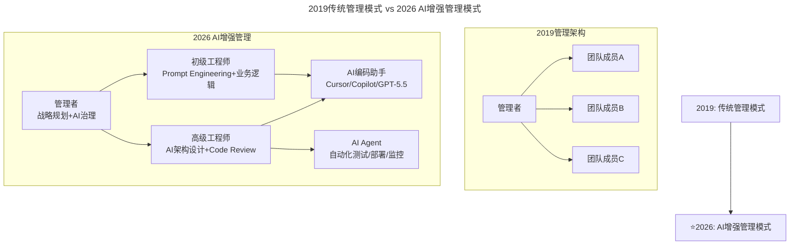
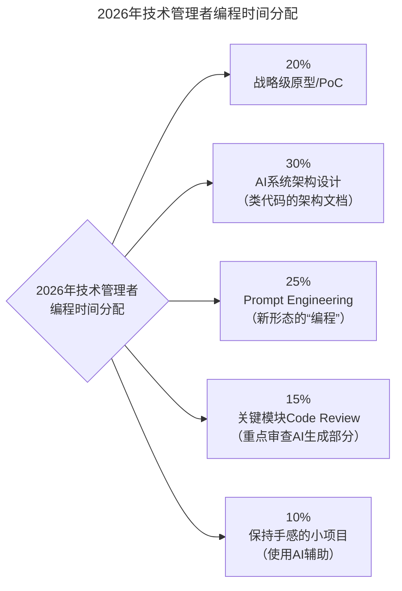

# 第179讲 | 张矗：技术管理者必经的几个思维转变

> **适用范围**：从技术骨干转型管理的技术 Leader、技术总监，以及管理半径扩大后需要重构思维方式的技术管理者。
>
> **更新摘要（v2 · 2026-08 更新）**：
> - 结构化升级为 6 节骨架（导言 / 核心方法论 / 关键流程 / 工具与实战 / 常见误区 / 进阶延展）
> - 保留原文"去管理、技术视野、停止写代码、不冲前线、产品思维"五大思维转变
> - 整合 2026 年 AI 时代升级注解，为所有 Mermaid 图补充 `title` frontmatter
> - 新增 AI 增强管理架构、AI+业务融合视野、Prompt Engineering 作为新形态编程等升级内容

## 1. 导言

技术管理者在成长过程中，需要经历几个关键的思维转变。本文从"去管理而不是找人协助你""技术视野从深耕到全局""该不该停止写代码""不要时刻冲在最前线""技术思维到产品思维的转变"五个维度，探讨技术管理者必经的思维转变。

> 2026 年，这五个维度的内涵都因 AI 技术的爆发而发生了深刻变化：管理对象从"人"扩展到"人+AI"，技术视野需要新增 AI 能力评估，编程重新定义为"写什么形式的指令/配置/Prompt"，服务内容升级为搭建 AI 增强基础设施，产品思维进化为 AI-Native 产品思维。

### 2019 vs 2026 技术管理者思维演进

| 思维维度 | 2019年挑战 | ⭐2026年新挑战 |
|---------|-----------|--------------|
| **角色认知** | 从"单兵作战"到"带团队" | **从"带人"到"带人+AI Agent"** |
| **技术视野** | 从深耕到全局（多技术栈） | **从全局技术视野到AI+业务融合视野** |
| **写代码决策** | 何时停止写代码？ | **写代码 vs 写Prompt vs 设计Agent工作流？** |
| **前线定位** | 不时刻冲在最前线 | **从"冲前线"到"设计AI辅助决策系统"** |
| **产品思维** | 技术价值→产品价值 | **技术+AI→产品体验革命性升级** |

## 2. 核心方法论

### 转变一：去管理，而不是找人协助你

刚开始带团队时，团队成员大概在7-8人左右，通过有效地辅导，任务分解，沟通协调，团队成员的工作也能有条不紊地推进。但问题在后期逐渐都凸显出来了，其中一个问题就是主要的核心代码还必须由我完成，一些长期来看重要，但是短期无法校验结果的事情，我也无法安排给其他同学来完成。

今天回头看这个转型阶段，一方面是长期单兵作战形成的一些"技术洁癖"局限了自己的思维转换，"技术洁癖"会让自己更多的关注在代码层面，而我们需要让自己的关注点转移到解决方案、产品交付、质量控制等其他层面。

另一方面是没有找到对任务完成情况进行跟踪和衡量的办法，导致自己无法和团队建立信任，无法将任务的复杂性有效地封装和管理起来，任务封装可能更多的在于能力问题，但任务管理就是思维问题。

在我看来，管理不是找一些人来协助你的工作，而是让你带领一帮人来完成指定的目标。而现实情况是问题多种多样，问题的解决办法也是多种多样，对于这种多样性，我并没有固定的解决办法，只能具体问题具体分析，我想强调的是思维转化是这一切的前提。

### 转变二：技术视野从深耕到全局

今天互联网领域用到的技术非常广泛，一个人要对所有主流的技术栈有一个全面且深入的了解，只从时间这个维度来看，已经几乎是不可能的了。

人们总是习惯于用自己擅长的技术来解决问题，这无可厚非。但是随着我们管理的范围越来越宽泛，如何管理其他技术栈领域的团队是一个不可回避的问题。在移动互联网爆发的这些年，我看到很多客户端团队和服务端团队的互相不理解，WEB开发团队和大数据团队的互相不理解。这就需要我们技术管理者能够从一个宏观的视野来进行协调和规划。

而要做到这一点，就需要我们具备足够的技术敏感度，同时要保持一个开放的心态，保持对新技术的追踪与学习，不需要了解具体的技术细节，但要能够了解不同技术栈适合用于什么场合，这是非常重要的。

我自己早期更多的偏向WEB开发领域，那个时候大数据生态刚开始在国内萌芽，我自己还使用PHP实现了一个简单的分布式计算方案，一开始也迅速解决了问题，但是随着时间推移，维护成本越来越高。等到阅读了谷歌关于大数据的三篇论文，回头再看，直接采用Hadoop的方案应该会少走很多弯路。

### 转变三：该不该停止写代码？

写代码应该是一个给技术人员带来成就感的行为，我认为也是一个技术人员要毕生追求的行为。但是作为技术管理者，随着管理任务越来越重，在写代码上的时间投入一定是在减少的。当出现下面几个迹象的时候，也许就是时候停止了：

1. 项目的推进开始等待你的代码完成，可是你的时间花在会议、招聘等管理事务上，无暇顾及；
2. 你写的BUG，别人修复起来消耗的成本很高；
3. 你写的代码无人可以维护。

这几点说的都是一个意思，即在这个阶段虽然你的代码质量可能依然优秀，但是它已经成为了整个团队的瓶颈。

当然，我并不建议这个阶段的技术管理者完全停止写代码，少量写一些不重要的代码，持续保持自己的技术敏感度也是很重要的，这个时候，一些胶水语言也许就非常适合了。

### 转变四：不要时刻冲在最前线

亲自带领团队完成一个又一个的项目，当然是技术管理者的责任。但是随着团队越来越大，要做的事情越来越复杂，你不得不认识到，时刻冲在第一线，对你和团队来说都不再是一个好的选择了。这会让你无法关注最重要的事情。这时候，需要让团队中更多的优秀人才来带队，辅助你完成项目，而你要用服务的心态做好帮助的角色。

从带领团队到服务团队的转变，具体表现在几个方面：

1. 从简单的辅导培训，走向搭建平台。辅导培训更多的是一个单向输出，而搭建平台是创建规则、环境与生态，让大家能够在更大的空间中自由发挥才能，施展创意。
2. 从统一管理到多元治理。在小团队阶段，统一固然能够保证效率最大化，可是多元化才能让你的团队长期发展。
3. 更多的要成就他人。团队的成功一定不是一个人的成功，应该是团队整体的成功，并让团队成员与团队获得共同成长。

还记得电视剧《兄弟连》里面有一个经典的场景：温斯特晋升营长之后，下面的连长带领E连冲锋遇到了阻碍，温斯特控制不住要自己上去带领E连冲锋，却被他的团长叫住。作为营长必须坚守在指挥阵地，完成更重要的任务，为整个团队负责。

### 转变五：技术思维到产品思维的转变

技术的最终目的还是要创造价值，同时技术的价值也必须通过产品来呈现，因此，技术管理者的关注点不能仅仅停留在技术架构与团队建设上，更应该建立你的产品思维。具体该怎么做呢，我有以下四点建议：

第一，关注客户的反馈，不光是内部客户，也应该关注外部客户；

第二，需要对业务有更深地理解和洞察；

第三，关注财务状况，要思考如何让技术团队从一个成本中心转化为利润中心；

第四，让其他岗位能够通过产品充分利用技术，将技术的价值最大化。

这并不是要让技术管理者转型成为产品经理，而是让技术管理者能够具备同理心，站在产品经理的角度思考产品价值。网络上流传乔布斯1秒变小白，马化腾3秒，张小龙5秒。那么你转换思维需要几秒呢？

## 3. 关键流程

### ⭐2026年技术管理者思维转变路线图

#### Phase 1: AI工具采纳期（现在-3个月）
- [ ] 个人全面使用AI辅助编程（Cursor/Copilot）
- [ ] 建立团队AI工具使用规范
- [ ] 完成Prompt Engineering基础培训
- [ ] 试点1-2个AI增强的业务场景

#### Phase 2: AI流程整合期（3-6个月）
- [ ] 将AI集成到CI/CD流程（代码审查、测试生成）
- [ ] 建立AI项目的ROI评估机制
- [ ] 组建跨职能AI小组（产品+技术+数据）
- [ ] 输出3-5个AI最佳实践案例

#### Phase 3: AI组织转型期（6-12个月）
- [ ] 制定企业AI战略和技术路线图
- [ ] 建立AI治理委员会和伦理准则
- [ ] 重构人才模型（招聘AI协作型人才）
- [ ] 打造AI驱动的组织文化

#### Phase 4: AI竞争优势期（12个月+）
- [ ] 构建行业AI解决方案壁垒
- [ ] 培养内部AI创新能力
- [ ] 探索Agent生态和平台化机会
- [ ] 成为行业AI应用标杆

四阶段路线图从"AI 工具采纳 → AI 流程整合 → AI 组织转型 → AI 竞争优势"递进，每个阶段都有明确的可执行 checklist，帮助技术管理者系统性完成思维转变。

## 4. 工具与实战

### 转变一 AI 版：从"去管理"到"AI增强管理"

**2026年升级**：管理的对象扩展为**"人类团队成员 + AI工具/Agent"**。

AI 增强管理架构在管理者—工程师之间新增了 AI 编码助手与 AI Agent 两类"协作者"，管理者的职责从管理人扩展到管理人+AI，委派对象也从人扩展到 AI Agent。

**关键变化**：
- **委派对象扩展**：不仅委派任务给人，还可以"委派"给AI Agent
- **管理半径扩大**：1个管理者通过AI工具可以协同更多人
- **质量标准提升**：AI降低入门门槛，但提高产出质量要求
- **新技能需求**：需要评估AI能力边界、设计人机协作流程

### 转变二 AI 版：从"技术全局视野"到"AI+业务融合视野"

新的技术视野维度

| 维度 | 2019年关注点 | 2026年新增关注点 |
|------|------------|----------------|
| **技术选型** | React/Vue、Java/Go | **开源模型vs闭源API、RAG框架选择** |
| **性能指标** | QPS、延迟、吞吐量 | **Token成本、推理延迟、模型准确率** |
| **团队能力** | 编程语言掌握度 | **Prompt Engineering水平、AI工具熟练度** |
| **技术债务** | 代码重构、架构升级 | **模型版本兼容、Prompt维护成本、数据漂移** |
| **人才招聘** | 经验年限、项目经验 | **AI协作能力、学习适应速度、创新思维** |

### 转变三 AI 版：从"是否停止写代码"到"如何与AI协作编程"

2026 年技术管理者的"编程"时间重新分配：30% 用于 AI 系统架构设计，25% 用于 Prompt Engineering（新形态的"编程"），20% 用于战略级原型/PoC，传统业务代码编写降至 0%。

**停止写的代码**：业务CRUD逻辑（交给AI+初级工程师）、重复性模板代码（完全由AI生成）、纯粹实现细节（让AI根据架构文档补全）。

**继续写的"代码"**：✅ 系统架构设计文档、✅ Prompt模板库、✅ AI Agent的工作流定义、✅ 关键技术决策记录ADR。

### 转变五 AI 版：从"产品思维"到"AI-Native产品思维"

AI-Native产品的五大特征

| 特征 | 传统产品 | AI-Native产品（2026） |
|------|---------|---------------------|
| **交互方式** | GUI菜单/表单 | **自然语言对话 + 多模态输入** |
| **个性化** | 用户设置/分群 | **实时个性化推荐 + 动态UI生成** |
| **智能化** | 规则引擎/if-else | **大模型推理 + 上下文理解** |
| **迭代速度** | 双周/月发布 | **Prompt调整即时生效 + 模型持续学习** |
| **价值度量** | 功能使用率/留存 | **任务完成率 + 用户满意度(NPS) + 效率提升** |

## 5. 常见误区

### 误区一：管理就是找人协助你的工作

管理不是找一些人来协助你的工作，而是让你带领一帮人来完成指定的目标。思维转化是这一切的前提。

### 误区二：用自己擅长的技术解决所有问题

人们总是习惯于用自己擅长的技术来解决问题，但随着管理范围越来越宽泛，需要从宏观视野协调不同技术栈团队。要具备足够的技术敏感度，了解不同技术栈适合用于什么场合。

### 误区三：成为团队瓶颈仍坚持写代码

当项目推进开始等待你的代码、你写的 BUG 别人修复成本很高、你写的代码无人可以维护时，你的代码已成为团队瓶颈，应停止写核心代码，少量写一些不重要的代码保持技术敏感度即可。

### 误区四：时刻冲在最前线

随着团队越来越大，时刻冲在第一线会让你无法关注最重要的事情。需要让团队中更多优秀人才来带队，自己用服务的心态做好帮助角色——从辅导培训走向搭建平台，从统一管理走向多元治理，更多地成就他人。

### 误区五：AI 时代仍把"编程"等同于"写业务代码"

2026 年技术管理者的"编程"已重新定义：Prompt Engineering、Agent 编排、AI 系统架构设计都是新形态的"编程"。不是"停不停写代码"，而是"写什么形式的指令/配置/Prompt"。

## 6. 进阶延展

### 关键数据参考（2026）

| 指标 | 数据 | 启示 |
|------|------|------|
| 使用AI的开发者比例 | **84%** | 不使用AI的团队将落后 |
| AI编码效率提升 | **30-55%** | 重新定义产能规划 |
| 初级工程师AI辅助后产出 | **接近中级水平** | 降低招聘门槛但提高质量要求 |
| CTO花在AI战略上的时间 | **平均20%** | 必须优先安排 |
| 企业AI项目失败率 | **40%** | 需要科学的ROI评估方法 |

### 总结

张矗老师提出的五个思维转变在2026年依然极具指导意义，但每个维度的内涵都因AI技术的爆发而发生了深刻变化：

1. **管理对象质变**：从管"人"到管"人+AI"，管理复杂度上升但杠杆效应更强
2. **技术视野扩展**：不仅要多技术栈，还要懂AI能力边界和应用场景
3. **编程重新定义**：不是"停不停写代码"，而是"写什么形式的指令/配置/Prompt"
4. **服务内容升级**：从搭建传统工具平台到构建AI增强的基础设施
5. **产品思维进化**：从技术实现产品功能到用AI重新想象产品体验

**🚀 2026年技术领导者的终极使命**：**成为"AI时代的人机协作架构师"——既懂技术又懂人性，既能设计高效的组织系统，又能激发人的创造力，同时善用AI放大每个人的能力。**

> **最后提醒**：AI不会取代技术管理者，但**善用AI的管理者将取代不善用AI的管理者**。关键是保持开放心态，主动拥抱变化，在实践中找到最适合自己团队的人机协作模式。

### 作者简介

张矗，马蜂窝技术副总裁。TGO鲲鹏会会员，曾任新浪网研发经理，开心网联合创始人。2012年加入马蜂窝，负责技术研发团队管理工作。目前，马蜂窝技术研发团队已发展至600人。

---

*本注解基于2026年AI技术管理实践编写，帮助技术管理者在AI时代完成思维转变。*
