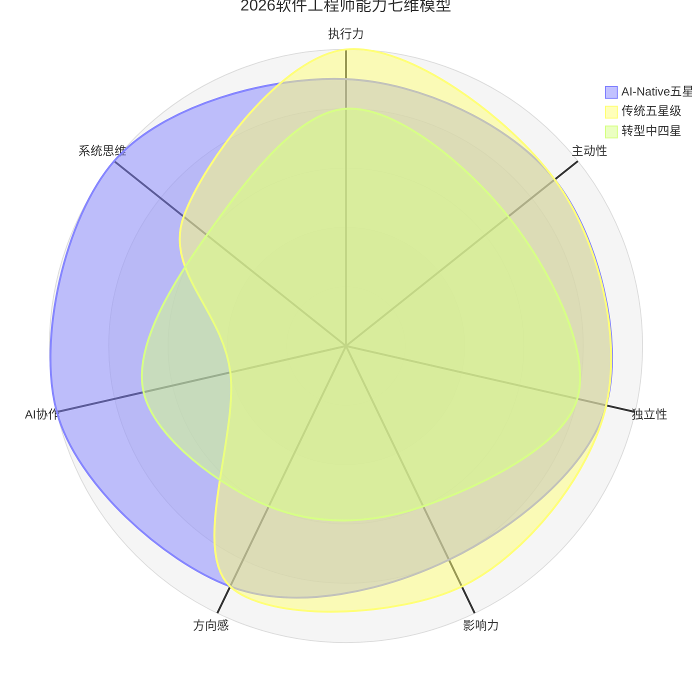
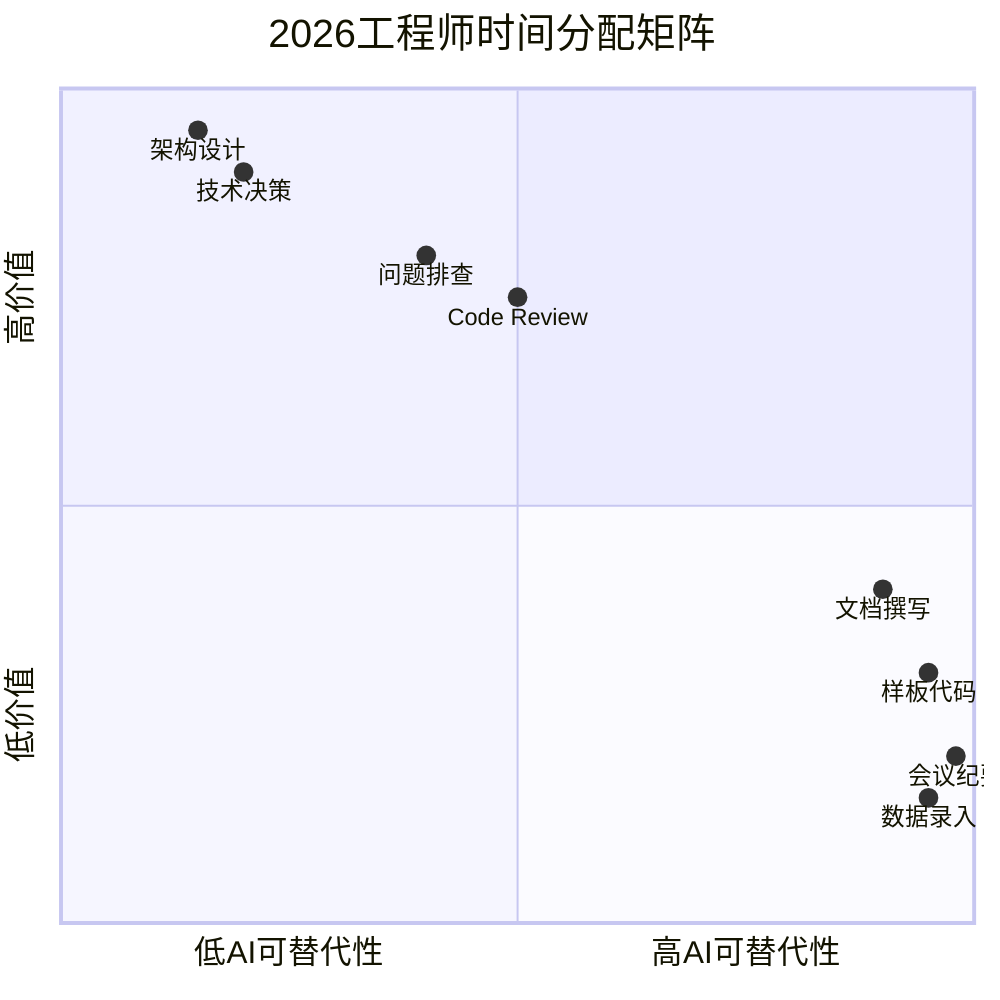
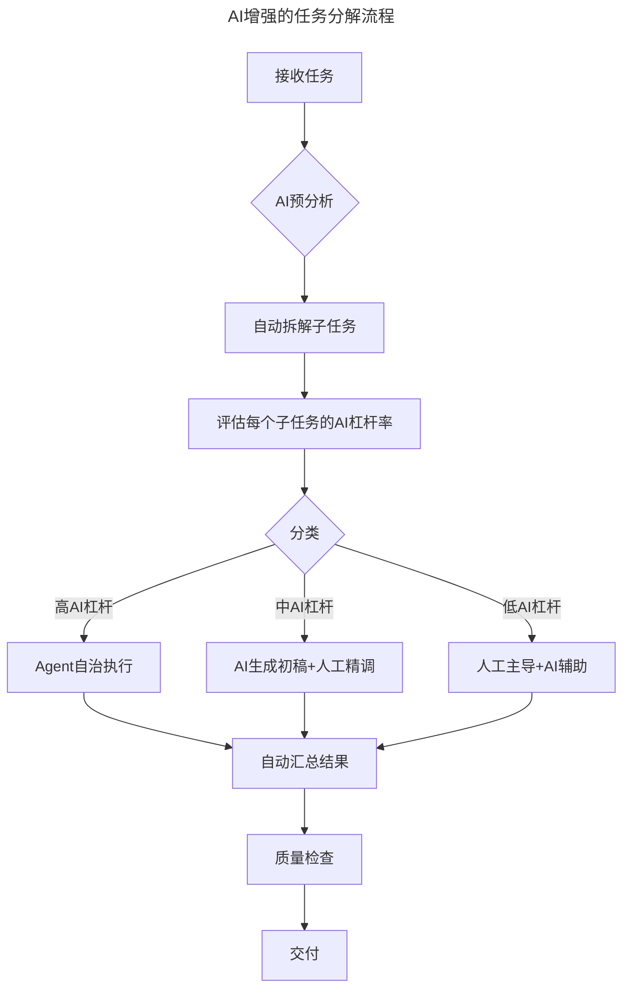

# 第141讲 | 徐毅：五星级软件工程师的高效秘诀

> **适用范围**：软件工程师、技术骨干、研发效率提升项目负责人，以及希望在AI时代打造高效个人的所有开发者。

> **更新摘要（v2 · 2026-08 更新）**：
> - 结构化升级为 6 节骨架（导言 / 核心方法论 / 关键流程 / 工具与实战 / 常见误区 / 进阶延展）
> - 保留徐毅原文完整内容（含九大工作策略、TVI/PVI实践、道法术器四层模型）
> - 将传统五星级标准升级为"AI-Augmented七维模型"（新增AI协作、系统思维维度）
> - 新增AI时代时间分配矩阵、AI增强任务分解流程、AI加速学习方法论
> - 整合原文独立的AI时代注解内容到对应章节

---

## 1. 导言

从去年年底开始，我们发起了一个提升研发效率的项目，积累了很多思考和经验。研发效率包括很多不同的方面，也能从很多不同的角度去观察，我今天分享的内容更偏向于从提升基层个人能力和基层团队能力两个维度去提升研发效率，希望对你有用。

进入2026年，原文核心方法论"五星级软件工程师的高效秘诀"需要全面升级——**AI工具将工程师的基础能力门槛大幅降低，但同时也提高了对"AI协作能力"和"系统性思维"的要求**。84%开发者使用AI编程，"会用AI的五星级工程师"效率可达传统五星级的3-5倍。本文在保留原文九大工作策略和TVI/PVI实践的基础上，系统补充AI时代的七维能力模型和高效工作新范式。

---

## 2. 核心方法论

### 2.1 高效的工作策略

首先想请你思考一个问题，你觉得一个五星级员工效率高、价值大的原因是什么？

在多数人看来，有三点原因，第一，智力因素，比如智商、逻辑思维能力、推理能力、创造力等高；第二，性格因素，比如自信，有雄心壮志、冒险精神及自制力等；第三，社交因素，比如有处理人际关系的技巧、有领导力等。

然而，在《五星级员工是这样诞生的！》这本书中，揭示了原因并不是多数人以为的这样。书中说到："从揭示生产效率的秘密的角度来看，我们的数据显示，精英职员和普通职员在智力因素、性格因素、社会因素和环境因素方面并没有明显的差别……"

这个数据是有依据的，作者罗伯特·凯利（Robert E.Kelley）花了十年时间研究明星员工的个人特征及职业特征，最后总结出了高效员工的工作策略，并将其归纳为九个方面：

1. 积极主动（Taking Initiative）
2. 构建知识网络（Networking）
3. 自我管理（Self-Management）
4. 团队协作（Teamwork Effectiveness）
5. 领导力（Leadership）
6. 追随力（Followership）
7. 大局观（Perspective）
8. 呈现与表达（Show-and-Tell）
9. 组织智慧（Organizational Savvy）

当然，这些员工也并不是一开始就有高效工作的能力，而是在日常工作中，坚持实践这些精英的工作策略，长此以往，他的工作效率就远超他人。

### 2.2 ⭐ AI-Augmented 七维能力模型

2026年，传统五星级标准需新增"AI协作能力"和"系统思维"两个维度：

上图通过雷达图对比了三类工程师在七个维度上的能力分布：AI-Native五星级工程师在AI协作和系统思维两个新维度上显著领先（10分），传统五星级工程师虽然在执行力等传统维度上表现优秀，但AI协作能力不足（4分）；转型中四星工程师处于过渡状态。这表明，2026年的"五星级"已不再是单一维度的精进，而是传统能力与AI协作能力的全面均衡。

**新增两维详解：**

| 新维度 | 定义 | 2026关键要求 |
|-------|------|------------|
| **AI协作能力** | 与AI工具/Agent高效协同的能力 | Prompt Engineering、AI输出质量控制、Agent调试 |
| **系统思维** | 理解整体架构和技术栈的关系 | 在AI辅助下保持全局视角 |

### 2.3 聚焦效率问题，打造高效个人

我们先来了解影响效率的原因，常见的影响产出效率的问题主要有四个方面。

第一是软件工程师不能够聚焦编码、团队周边协作与支撑工作占比高、跨团队联动开发等耗时又低效。我们希望降低这样的开销，让员工有更多时间去编码。

第二是打断问题，员工工作常被突发事务打断，据统计，平均每小时被打断7次以上，平均编码持续时间不到10分钟。

第三是PL直接贡献价值少，项目管理和团队建设占比高、特性交付占比不到20%。我们希望PL也要投入较多时间参与开发功能、开发特性，去做交付，而不只是做一个纯粹的管理者。

第四是新员工写代码、老员工解问题。很多团队会让新员工写代码，出现问题后又让老员工主要解决新员工遗留的问题，但多数人都不喜欢解bug，若是长此以往，老员工也失去了动力。

综合以上四方面的问题，我们将问题与理论结合，得出一套实践方法叫"TVI/PVI"，意思就是基层团队及个人效率提升，针对不同的问题，提出对应的解决思路和实践方法。我们大概将问题分为五类：

- 第一是**活力**：活力决定动力，因此，我们需要激发员工的活力，这样他才会自主高效地工作。
- 第二是**贡献**：我们提倡贡献透明化，并建立个人荣誉档案，让员工看到自己的贡献，看到自己被认可，获得荣誉和鼓励。
- 第三是**管理**：我们推崇自我管理，相对应的实践是静默时间与番茄工作法，使用精益看板与个人看板，以此提升个人效率。
- 第四是**能力**：我们提倡员工不断学习，构建自己的知识网络，打造自己的知识沙盘。
- 第五是**协作**：相应的实践是组建微战队，推动社区化评审与协同。

### 2.4 新时代员工的驱动力

那如何成为高效的个人呢？我们先来看看新时代员工的驱动力构成，主要有三个方面：

- **自主**（Autonomy）：员工需要在做什么、什么时候做、和谁做以及如何做上实现自主
- **目的**（Purpose）：员工需要清楚这样做的目的，创造不同，认可自己工作的价值与意义
- **专精**（Mastery）：员工需要能够运用并改进所擅长的技能，把想做的事情做得越来越好

根据这三点驱动力因素，我们需要帮助员工了解自己的特长，并帮助他在工作中不断精进。

---

## 3. 关键流程

### 3.1 基于工作目标，定期审视现状，有针对性地提升能力

我们团队内部有一个能力矩阵，我们会基于工作目标，定期评估员工能力现状，并有针对性地确定近期可以改进方向和目标，以此不断地提升他的能力。

在实践中，首先要根据团队的业务目标和技术目标，明确未来这个任务需要团队具备哪些技能，再根据团队成员的能力现状，有针对性地进行提升。在这个过程中，我们一般有四个措施：

1. **定制计划**：识别成员能力GAP，制定能力提升计划；
2. **实践锻炼**：任务安排采用必要任务+提升能力任务，保证交付质量的同时提供实践机会。
3. **闭环改进**：通过对关键案例的技术分析、一类问题的归纳总结、复盘等来提升成员的技术分析能力；
4. **培训分享**：开展课程培训、测试经验总结，让该领域能力强的人，帮助成员提升能力。

除此以外，我们还会制定能力仪表盘跟踪现状，并观察提升趋势，帮助我们实时地看到员工能力的变化。

### 3.2 工欲善其事，必先利其器

我们很强调工具，因为我们的业务形态很多，所以会有各种各样不同的工具提供给员工选择。同时，我们还会统计员工使用某个工具的时间，通过这样时间统计，我们可以知道工具在使用过程中出现的情况，并针对性的进行改进，或是把更合适、更好用的工具推荐给他们。

另外，在研发层面，我们也会提供工具链服务，华为的业务场景众多，原本每一个产品都有自己的工具系统，每个业务部门都有自己的工具团队去开发适合业务情况的工具。而现在，由于提倡高效工程师，要减少工具的人员，将所有的相关工具链整合为对内的新的工具链系统云龙以及对外的软件开发云，也就是我目前所在的DevCloud。

### 3.3 知识管理与积累

除了工具以外，我们还提倡知识管理，不论是基层员工还是管理者都需要积累知识、输出知识。

举个例子，华为的特点是以客户为中心，就强调一线团队要跟客户拉近距离，但这样一来，客户遇到问题时就会直接找研发团队，研发团队就会经常被打扰。于是，我们在团队中又设立了一个特战队，专门对接外部的问题，包括来自客户的干扰和来自产品的干扰。因为有很多问题是重复性的，所以就要求特战队在解决问题的同时将所有问题都记录下来，当有重复问题时，就可以更快"对症下药"。

### 3.4 贡献可视化与同行认可

我们希望员工得到更多的贡献可视化和同行的反馈认可，为此，每一个员工都有一个内部档案，这个档案不是简历档案，而是该员工的成绩呈现。其他同学对该同学个人贡献的认可与反馈，可以使他获得荣誉感、归属感与激励。我们还制作了团队贡献仪表盘、团队个人平均生产率图表、个人平均代码行生产率图表与个人综合贡献排行榜等，可视化地呈现他们的贡献产出。

### 3.5 知识积累配合解耦手段

这一点的前提是先判定协作与沟通是否是不必要的，一般来说，我们会把协作分成以下四个方面来衡量：

1. **协作质量**：对内协作的量除以对内协作和对外协作量的总和
2. **协作类型**：围绕什么进行协作（代码、任务、需求、服务等）
3. **协作强度**：协作次数与协作时长
4. **协作丰富度**：协作媒介数量

除了根据上述四种协作类型判断协作质量，进而解耦外，我们还会根据业务形态，进行团队架构上的解耦。比如针对云化和IT类产品，我们进行服务化解耦，提倡微服务微战队；对于系统类产品，我们组件化解耦。

### 3.6 建立成长心态

华为的文化不是特别提倡试错，而是提倡成长的心态与文化，要时刻从工作中、生活中学习。

僵化心态（Fixed Mindset）认为人的能力是不变的，如果又想要在事情上、任务上有不错的表现，在面对挑战时，他们就会更倾向于避免可能会失败的情况。与之相对的，成长心态（Growth Mindset）则认为人的能力是可以增长的，他们更重视学习、成长，因此对于挑战，他们拥有很强的适应力，会尽量去拥抱它。

### 3.7 ⭐ 各星级具体要求的AI时代版本

#### ★★☆☆☆：主动思考 → AI增强的主动思考

**原文**：不仅完成分配的任务，还主动思考如何做得更好

**⭐ 2026升级**：
- 不仅自己思考，还会**利用AI工具扩展思考范围**
- 能识别哪些任务适合交给AI加速
- 会主动分享AI使用经验和最佳实践

#### ★★★☆☆：独立负责 → AI增强的独立负责

**原文**：能独立负责一个模块或项目

**⭐ 2026升级**：
- 能独立负责一个**人机协同的项目**
- 知道何时该用AI、何时该人工介入
- 能评估AI输出的质量和可靠性

#### ★★★★☆：影响团队 → AI赋能的影响团队

**原文**：能帮助团队成员提升能力

**⭐ 2026升级**：
- 帮助团队成员掌握AI工具的使用
- 建立团队的Prompt Library和最佳实践
- 推动团队AI文化建设

#### ★★★★★：定义方向 → AI-Augmented 定义方向

**原文**：能定义技术方向和标准

**⭐ 2026升级**：
- 能制定团队的AI战略和工具选型
- 能评估新AI技术的适用性和ROI
- 能在AI时代保持技术前瞻性

---

## 4. 工具与实战

### 4.1 道法术器四层模型

从我们推行的经验来看，五星级软件工程师的高效秘诀的四个层次，用中国人的话来说就是道、法、术、器，用西方术语来说就是价值观、原则、实践、工具：

- **道的层面**：理念，高效的团队和个人是提升研发效率的关键
- **法的层面**：方法、套路，从活力、贡献、管理、能力、协同等维度切入改进
- **术的层面**：具体实践，微战队、静默时间和首席工程师
- **器的层面**：工欲善其事，必先利其器，提供先进、易用、贴切的工具和工具链服务

### 4.2 三种作战组织形态

在《赋能》这本书中，作者提到了三种作战组织形态：

1. **指令式机械组织**：典型的就是美军常规部队，强调自上而下的指令系统
2. **指令式团队组织**：典型例子是美军特种部队，团队间采用自上而下的指令系统，组织成员间完全的横向连接
3. **团队式团队组织**：团队间和团队内部均采用完全的横向连接，以个人为节点

这三种组织形态也体现在我们的工作组织中，传统的瀑布型组织，就是指令从上往下传递。当你需要多个业务部门配合时，如果还是全都要向上汇报给老板做决策，效率就会特别慢。于是，这种组织形态就演变成了以个人为节点的网状组织，需要我们成为高效个人。

### 4.3 ⭐ AI时代时间分配矩阵

上图以"AI可替代性"和"价值"为两轴，定位了8类工程师日常工作。架构设计和技术决策位于"高价值+低AI可替代"象限，应重点保护和投入；文档撰写和样板代码位于"低价值+高AI可替代"象限，应全部交给AI处理；Code Review和问题排查位于中间区域，适合AI辅助+人工精调模式。这一矩阵帮助工程师系统识别哪些工作应交给AI，哪些应保留人工主导。

**AI时代时间分配黄金法则：**

| 时间类型 | 传统占比 | 2026目标占比 | 策略 |
|---------|---------|------------|------|
| **深度创造** | 20% | **35%+** | 保护这段不被打扰 |
| **协作沟通** | 25% | **20%** | 用AI工具压缩 |
| **事务执行** | 40% | **15%** | 全部交给AI Agent |
| **学习成长** | 10% | **20%** | AI加速学习路径 |
| **休息恢复** | 5% | **10%** | 避免Burnout |

### 4.4 ⭐ AI-Augmented 任务分解流程

上图展示了AI增强的任务分解流程：接收任务后先由AI预分析并自动拆解子任务，然后评估每个子任务的AI杠杆率，按高/中/低三档分类处理——高AI杠杆任务由Agent自治执行，中AI杠杆任务由AI生成初稿+人工精调，低AI杠杆任务由人工主导+AI辅助。最后自动汇总结果、质量检查、交付。这一流程将传统WBS分解升级为人机协同的智能分解。

### 4.5 ⭐ AI加速学习方法论

| 维度 | 传统做法 | AI增强做法 | 效率提升 |
|-----|---------|-----------|---------|
| **学习规划** | 年度计划 | **AI根据职业目标和技能GAP生成个性化路径** | 规划时间↓90% |
| **知识获取** | 读书/课程/文档 | **AI摘要 + 交互式问答** | 获取速度↑5x |
| **实践练习** | 做项目/刷题 | **AI生成练习题 + 即时反馈** | 练习密度↑3x |
| **知识整理** | 笔记/思维导图 | **AI自动结构化 + 关联推荐** | 整理效率↑10x |
| **输出分享** | 写博客/演讲 | **AI辅助内容生成 + 分发建议** | 输出频率↑2x |

### 4.6 ⭐ 2026行动清单

- [ ] 用上述"七维模型"自评当前能力等级
- [ ] 用上述"时间分配矩阵"审计当前时间使用情况
- [ ] 识别出至少5项可以交给AI的事务性工作
- [ ] 制定个人"AI技能提升计划"和"AI加速学习计划"
- [ ] 选择一个维度重点突破，目标3个月内提升到下一星级

---

## 5. 常见误区

### 5.1 传统高效工作的常见误区

- **误区1：效率高=智力/性格/社交因素好**——罗伯特·凯利十年研究证明，精英职员和普通职员在这些方面并无明显差别，差异在于工作策略
- **误区2：PL只做管理**——PL直接贡献价值少、特性交付占比不到20%，应投入较多时间参与开发
- **误区3：新员工写代码、老员工解问题**——多数人不喜欢解bug，长此以往老员工失去动力

### 5.2 AI时代高效工作的常见误区

- **误区1：过度依赖AI导致技能退化**——代码写得快了，但架构设计能力退化。对策：保留无AI日的Code Review
- **误区2：忽视AI输出质量验证**——认为AI生成的代码就是对的。对策：建立"AI辅助+人工验证"双流程
- **误区3：AI工具追新病**——每周更换最新的AI框架。对策：选择稳定且生态成熟的方案
- **误区4：忽视系统思维**——在AI辅助下只关注局部任务，丧失全局视角。对策：定期进行架构Review

---

## 6. 进阶延展

### 6.1 总结

五星级软件工程师的高效秘诀，用中国人的话来说就是道、法、术、器，用西方术语来说就是价值观、原则、实践、工具。核心理念不变——高效来自良好的工作策略和习惯——但具体策略的内容在AI时代发生了质变：从"手动高效"进化为"人机协同高效"。

### 6.2 作者简介

徐毅，华为云DevCloud首席技术布道师，华为Cloud BU软件开发云产品部、华为研发能力中心特聘敏捷专家顾问，前IBM大中华区敏捷及DevOps卓越中心主管，前惠普企业服务资深敏捷顾问，前诺基亚移动设备敏捷及精益教练，前诺基亚网络全球敏捷转型中心精益及敏捷教练，业内知名敏捷教练及顾问，IT书籍译者。

### 6.3 参考与延伸

- 罗伯特·凯利（Robert E.Kelley）《五星级员工是这样诞生的！》：九大工作策略的理论来源
- 《赋能》：三种作战组织形态（指令式机械组织、指令式团队组织、团队式团队组织）
- VUCA时代：动荡（Volatility）、无常（Uncertainty）、复杂（Complexity）、模糊（Ambiguity）
- 成长心态（Growth Mindset）vs 僵化心态（Fixed Mindset）
- 华为云DevCloud / 云龙工具链：工具整合的实践案例
- 微战队、静默时间、首席工程师：道的层面落地的三种具体实践
