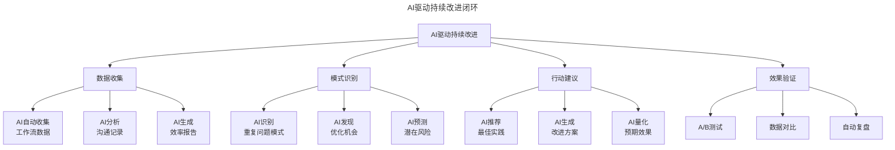
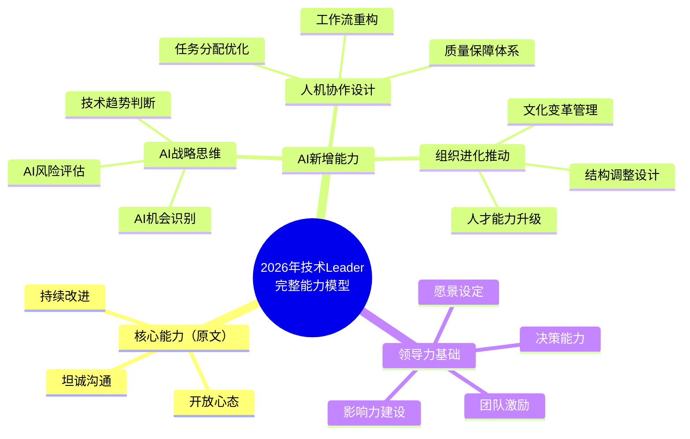

# 第143讲 | 徐毅：技术Leader应该具备的能力或素质

> **适用范围**：刚走上 Technical Leader 岗位的工程师、十人团队技术负责人，以及希望系统提升领导力软技能的技术管理者。
>
> **更新摘要（v2 · 2026-08 更新）**：
> - 结构化升级为 6 节骨架（导言 / 核心方法论 / 关键流程 / 工具与实战 / 常见误区 / 进阶延展）
> - 保留原文"开放心态、坦诚沟通、持续改进"三大能力与《非暴力沟通》《敏捷回顾》方法
> - 整合 2026 年 AI 时代升级注解，为所有 Mermaid 图补充 `title` frontmatter
> - 新增 AI 战略思维、人机协作设计、组织进化推动三项 AI 时代能力与自评工具

## 1. 导言

我们经常说Leader要有领导力，但这个话题其实挺难聊的，技术Leader看似是一个词，但背后可能每个Leader都有不同，他们的产品、业务可能不同，他们所负责的团队或部门规模可能不同，每个人的工作经验可能也不同，很难一概而论。

如果说是一个比较基层的、十人团队这个层级的技术Leader，技术方面可能更重要的还是技术实现、特性交付的能力，但他/她肯定也要带人，所以怎么样管好这十个人和这十个人的工作，也是他/她需要具备的能力。那就会涉及到很多项目管理相关的能力和团队管理相关的能力。这里面也会有很多软技能的需要，比如华为常说的"拉通对齐"。

在这个层面的话，我建议是不要全部靠自己去摸索，如果公司内部有类似于研发能力中心这样的部门，多多跟他们保持联系，把先进的好的实践直接拿过来使用，然后也多跟其他的技术Leader交流，不止要学习别人的成功经验，也要从别人失败的教训里汲取经验。

> ⭐ **2026年技术Leader能力模型**：当84%开发者使用AI编程，Agent能替代3-5人团队，技术Leader的核心能力从"开放心态+坦诚沟通+持续改进"升级为"AI战略思维+人机协作设计+组织进化推动"——原有能力依然重要，但需要增加AI维度。

## 2. 核心方法论

### 技术Leader应该具备的三大能力

如果要抽象提炼一下技术Leader应该具备的能力或素质，我会说是开放心态、坦诚沟通、持续改进这几个方面。

**1.开放心态**

也就是能够接纳别人的意见，或者说即便不认同也能够共存。都说现在是VUCA的时代，技术、需求各方面都有很多不确定性，而且我们也需要发挥团队里每个人的积极性和能力，要把大家都动员起来，那必然就会出现不同的意见、看法和做法。这个时候，一个技术Leader能否开放坦然地接受这个局面，认可自己的意见、经验可能并不是最好的选择，在我看来，是一个团队能够走多远，一个Leader能够升多高的重要因素之一。

**2.坦诚沟通**

沟通是我们透过表面去发掘更深层次的信息的一种手段，通过充分的、深入的沟通，我们才更容易发现彼此意见的关键分歧所在、问题的真正原因所在，而只有坦诚的沟通，不藏着掖着，我们才能够针对真实的、尽可能全面的信息去判断、去决策，从而能够更快速、更准确地解决问题。如果Leader不能够坦诚，团队成员不用多久就能够感受到，那么这个Leader可能就很难再得知到项目和团队的真实情况了。

**3.持续改进**

敏捷里面的回顾（Retrospective）是非常重要的实践，也是建立持续改进文化的一个重要手段，但遗憾的是绝大多数团队都没有做好。举个例子，演示产品功能时，PO或产品经理指出了一个问题，回顾不是说"这个问题是啥原因、谁在什么时间把这个问题修复掉"，而是说"为什么我们没有在更早的时间自己发现这个问题，而是到了演示产品功能的时候才由PO发现"。从中发现团队工作方式的改进点，这才是回顾的真正意义。

### AI 时代三大能力的升级

**开放心态——AI版**：2026年新增挑战

| 挑战 | 表现 | 应对策略 |
|------|------|---------|
| **AI决策接受度** | 不信任AI给出的建议 | 建立"AI辅助+人工审核"的决策流程 |
| **新技术接纳速度** | 对AI新工具持观望态度 | 设定"每月尝试1个新工具"的规则 |
| **失败容忍度** | AI项目失败后否定AI价值 | 建立科学的AI项目评估体系 |
| **角色认知转变** | 固守"纯技术管理者"定位 | 拥抱"AI战略制定者"的新角色 |

**坦诚沟通——AI版**：2026年新增沟通场景包括与 CEO 沟通 AI 战略、与团队沟通 AI 变革。《非暴力沟通》AI 版应用：观察"团队使用AI编程助手比例只有20%"→ 感受"担心错失效率提升机会"→ 需要"团队充分利用AI减少重复劳动"→ 请求"一起讨论阻碍使用AI的原因"。

**持续改进——AI版**：AI 驱动的持续改进从数据收集、模式识别、行动建议到效果验证全链路引入 AI 能力。



AI 驱动持续改进闭环覆盖数据收集、模式识别、行动建议、效果验证四个环节，每个环节都由 AI 自动化完成基础工作，让回顾从"被动"转向"数据驱动"。

## 3. 关键流程

### 三大能力的培养方法

以上提到的这三个方面都是偏软技能的能力，培养、锻炼都不容易。首先要对这三个方面有意识，我们才能够想到要去观察自己在这些方面做得好不好，而这一点，通常都可以通过放慢速度来辅助。例如，讨论问题时，别人讲完话，强迫自己数1-2-3，然后再讲话；如果觉得对方讲得不对，在讲话之前，提醒自己采取"我理解你的意思是……，我有些不同的看法，……"这样的句式，等等。

而坦诚沟通，在方法技巧方面，可以学习《非暴力沟通》一书中的方式，通过它建议的讲观察、讲感受、讲自己的需要、讲自己对对方的请求这个表达自己的套路，更好地、非暴力地表达自己的意思。

持续改进的方法技巧方面，推荐可以学习《敏捷回顾》一书中的相关实践并尝试落实，也可以考虑学习美军AAR、《复盘+》等相关知识，比如AAR的基本流程：我们打算做什么?实际发生了什么?成功之处是什么？不足之处是什么？有什么改进或创新的机会？下次我们将怎么做?

当然，知识是一方面，更重要的是一定要练，练的时候，最好找一位也在培养这些技能的你信得过的同道，让他/她来观摩你的实践过程，事后你们一起做一个迷你回顾，根据对方的反馈来提升你自己实践这些提升方法的能力。

### AI 增强的回顾会议

```yaml
传统回顾:
  耗时: 1-2小时
  参与度: 被动
  输出质量: 依赖 facilitator 能力
  行动跟进: 容易遗忘

AI增强回顾:
  准备阶段:
    - AI自动收集本周数据（commit、issue、review等）
    - AI生成初步分析报告
    - AI识别Top 3问题和Top 3亮点
  
  会议阶段:
    - 重点讨论AI无法判断的部分（人际关系、文化等）
    - 用AI实时记录会议要点
    - AI协助生成行动项
  
  跟进阶段:
    - AI自动跟踪行动项完成情况
    - AI在下次会议前提醒未完成事项
    - AI量化改进效果
```

AI 增强回顾在准备、会议、跟进三阶段都引入 AI 能力：准备阶段自动收集数据并识别问题，会议阶段聚焦 AI 无法判断的部分并实时记录，跟进阶段自动跟踪行动项并量化效果。

### 不同层级 Leader 的 AI 能力要求

| 层级 | 核心职责 | AI能力要求 | 优先级 |
|------|---------|-----------|--------|
| **一线TL（10人团队）** | 带领团队交付 | 熟练使用AI工具，指导团队应用AI | ⭐⭐⭐⭐⭐ |
| **部门经理（50人团队）** | 多团队协调 | 设计部门级AI工作流，推动AI实践 | ⭐⭐⭐⭐ |
| **总监/VP（200人+）** | 战略执行 | 制定AI战略，推动组织变革 | ⭐⭐⭐ |
| **CTO/CIO** | 技术愿景 | AI战略规划，技术路线决策 | ⭐⭐⭐ |

## 4. 工具与实战

### 2026年技术Leader完整能力模型



能力模型在原文三大核心能力（开放心态、坦诚沟通、持续改进）与领导力基础之上，新增 AI 战略思维、人机协作设计、组织进化推动三项 AI 时代能力。

### 新增关键能力详解

**能力1：AI战略思维** — 能够识别AI在本组织的应用机会，并制定实施路径。核心技能包括理解 AI 能力边界、评估 AI 项目 ROI 和风险、制定分阶段 AI 实施计划、平衡创新与稳定。

**能力2：人机协作设计** — 能够设计高效的人机协作工作模式。核心技能包括判断任务适合 AI 还是人工、设计 AI 辅助工作流程、建立 AI 输出质量保障机制、处理人机协作中的冲突。

**能力3：组织进化推动** — 能够推动组织向AI友好型文化转型。核心技能包括识别组织文化中的 AI 障碍、设计文化变革策略、处理变革阻力、建立可持续的 AI 推进机制。

### 与 CEO 沟通 AI 战略的正确做法

```
✅ 正确做法（AI版）：
Leader: "老板，我注意到客服团队每天花费30%的时间回答重复性问题。如果用AI技术，预计可以：
- 将响应时间从平均2小时缩短到2分钟
- 客服满意度提升20%
- 每年节省约200万人力成本
- 初始投入50万，3个月回本

您觉得这个方向值得探索吗？"
```

与 CEO 沟通 AI 战略应聚焦业务价值与 ROI，而非技术先进性；用"响应时间、满意度、人力成本节省、回本周期"等业务指标说话。

## 5. 常见误区

### 误区一：不信任 AI 给出的建议，直接拒绝

AI 时代开放心态的新挑战是 AI 决策接受度。应建立"AI 辅助 + 人工审核"的决策流程，当 AI 给出建议时先问"为什么"而不是直接拒绝。

### 误区二：Leader 不坦诚，团队很快能感受到

如果 Leader 不能够坦诚，团队成员不用多久就能够感受到，那么这个 Leader 可能就很难再得知到项目和团队的真实情况了。

### 误区三：把回顾开成"问题修复追责会"

回顾不是"这个问题是啥原因、谁在什么时间把这个问题修复掉"，而是"为什么我们没有在更早的时间自己发现这个问题"。从中发现团队工作方式的改进点，才是回顾的真正意义。

### 误区四：只靠自己去摸索

不要全部靠自己去摸索，应多跟研发能力中心等部门保持联系，把先进的好的实践直接拿过来使用，也多跟其他技术 Leader 交流，学习成功经验也汲取失败教训。

### 误区五：固守"纯技术管理者"定位

2026 年需要拥抱"AI 战略制定者"的新角色。84% 开发者使用 AI 编程，Agent 能替代 3-5 人团队，技术 Leader 必须增加 AI 维度能力。

## 6. 进阶延展

### 从"自己做好"到"大家好才是真的好"

总的来说，对于刚刚走上技术领导者（Technical Leader）类型岗位的员工来讲，要习惯从以往只要自己做好就一切都好的状态，转到大家好才是真的好的状态。而领导力，简单来讲，除了本身对技术的掌握，还要注意人员管理和沟通相关的内容，取决于不同的组织，未必你需要管理这些人，比如薪水、绩效等，但是你一定会需要负责让这些人能够理解和正确地使用技术完成任务。以前你可能90%以上的精力都投入在技术上，而现在，这90%中的20%甚至更大比例的精力，都要用于提升整个团队的技术能力，毕竟，你的20%*1个人，换回来的可能是20%*9个人的整体效率提升。

### ⭐ 快速自评工具

请诚实回答以下问题（1-5分）：

**开放心态（AI版）**：
1. 我对新AI工具持开放态度：___分
2. 我愿意接受AI改变我的工作方式：___分
3. 我鼓励团队探索AI应用：___分
4. 我能接受AI项目的合理失败率：___分

**坦诚沟通（AI版）**：
5. 我能用业务语言解释AI的价值：___分
6. 我能有效传达AI变革的必要性：___分
7. 我能倾听团队对AI的顾虑：___分
8. 我能在AI相关决策中保持透明：___分

**持续改进（AI版）**：
9. 我定期复盘AI应用的效果：___分
10. 我能从AI项目中总结经验教训：___分
11. 我能推动AI实践的持续优化：___分
12. 我能建立数据驱动的改进机制：___分

**AI新增能力**：
13. 我具备AI战略思维：___分
14. 我能设计人机协作流程：___分
15. 我能推动组织AI转型：___分

**总分：___ / 75分**
- 60+分：优秀的AI时代Leader
- 45-60分：良好的基础，需要加强
- 30-45分：需要系统学习和实践
- <30分：急需提升AI相关能力

### 作者简介

徐毅，华为云DevCloud首席技术布道师，华为Cloud BU软件开发云产品部、华为研发能力中心特聘敏捷专家顾问，前IBM大中华区敏捷及DevOps卓越中心主管，前惠普企业服务资深敏捷顾问，前诺基亚移动设备敏捷及精益教练，前诺基亚网络全球敏捷转型中心精益及敏捷教练，业内知名敏捷教练及顾问，IT书籍译者。

---

*本注解基于2026年AI技术领导力实践编写，帮助技术Leader在AI时代全面提升能力。记住：能力是可以培养的，关键是开始行动！*
