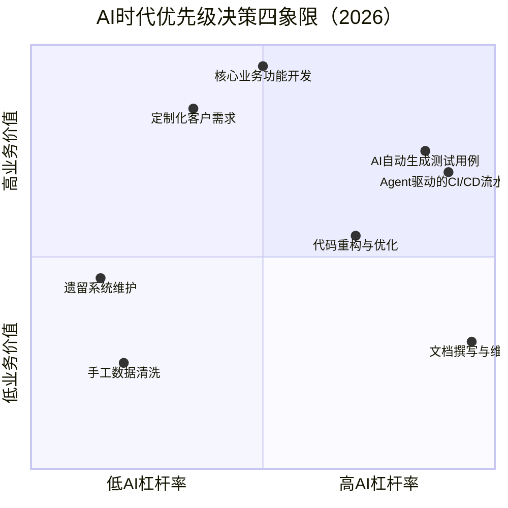
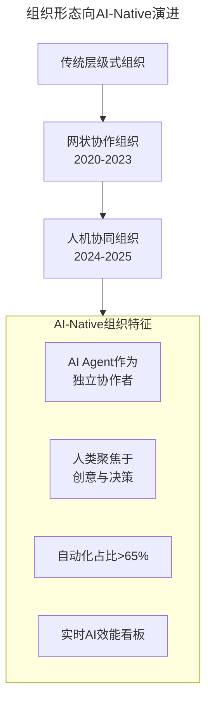

# 第92讲 | 成敏：技术负责人如何做优先级决策

> **适用范围**：技术负责人、CTO、研发经理，以及需要在大量需求中做优先级与扩展性决策的技术管理者。
>
> **更新摘要（v2 · 2026-08 更新）**：
> - 结构化升级为 6 节骨架（导言 / 核心方法论 / 关键流程 / 工具与实战 / 常见误区 / 进阶延展）
> - 保留原文"优先级决策与组织目标关联""不做不该做的事""三原则"等核心方法论
> - 整合 2026 年 AI 时代升级注解，为所有 Mermaid 图补充 `title` frontmatter
> - 新增 AI 赋能决策维度、AI 时代优先级四象限与 AI 杠杆率评估标准

## 1. 导言

在整个技术团队中，技术负责人经常要做的无非是两类决策，一类是优先级决策，一类是扩展性决策。

一个公司有业务团队、有产品团队、有运营团队，还有客服团队等等，这些团队都有自己的目标，站在他们的角度，他们会提出许多需求给到技术团队。到技术负责人手上，可能各种各样的需求、项目排期已经排到六个月甚至更久之后了，而其他团队还在不断的提需求过来。

在这种情况下，哪些事先做，哪些事后做，或者哪些事干脆是不用做的，就是技术负责人需要做的优先级决策。

> **背景**：截至2026年，84%的开发者已将AI编程工具（如GPT-5.5、DeepSeek V4、Cursor、GitHub Copilot Workspace）纳入日常工作流程，Agent（智能代理）进入加速落地期。技术负责人的优先级决策面临全新维度——**AI可行性评估**成为第四类核心决策。

## 2. 核心方法论

### 优先级决策与组织目标直接关联

那根据什么来做决策？肯定不是看谁的嗓门大，也不是看这个需求是来自谁，比方说CEO。 **最终决定优先级的，是这件事情跟组织的目标到底有多大的关系，也就是优先级决策与组织目标直接关联。**

其中，最核心的一个原则就是不做不该做的事情，这是提升效率最有效的方式。

交流中，有一个CTO当初是空降到现在的公司的，关于这个话题，他分享了一个他的例子：

> 我作为CTO刚加入公司的时候，公司每周都有一个项目排期会，产品经理和技术负责人会参加，确定接下来要做的事情。会上基本上就是产品经理之间互相争论，最后他们确定下做哪些事，然后技术负责人把这些事排到to do list里去，做出排期。
>
> 我参加两次之后就觉得这事不行，不能这么做，因为我发现，首先，这个排期表非常的长，长到每次都要滚好几页才能看完整个需求列表。其次，最老的一个to do list，已经是一年以前的了。我就特别不能理解，既然这个功能这么久没做好像也没影响什么，那当初为什么还要做。
>
> 到第三个星期开会的时候，我就动手了，我对参会的产品经理说："你们提需求可以，提什么都可以，我们作为技术团队，支持你们是天经地义的。但是，你们能不能不光提要求，也给我一个做这件事情的理由，或者这件事情做成能达成的结果。"
>
> 所以，我就提了个要求，所有的产品经理在提需求之前要先回答我三个问题：第一个问题，为什么要做？第二个问题，做了之后会带来什么好处？第三个问题，这个好处在最终的数据上怎么体现出来。
>
> 如果这三个问题你都回答了，那我们技术团队二话不说赶紧做，加班加点的帮你做。结果，整整一个月都没有人提新需求。

### 扩展性决策

作为技术负责人，除了要做优先级决策之外，还要做扩展性决策。很多公司在发展过程中都会遇到这样的问题，目前的团队在现阶段是合适的，所选择的技术架构在现阶段是合适的，但一段时间之后，他就不再合适了，怎么办？

所以，技术负责人很重要的能力就是管理扩展性，换句话说，你要对你业务未来的发展有一个大概的预计，然后在组织架构、人员构成、技术架构等方向为业务保留足够的扩展性。

**1.组织的扩展性**，比如要不要独立出一个公共的技术部门，负责公司基础设施的搭建；比如要不要搭建一个研究型的团队，专门负责创新相关的研究；比如要不要把组织架构从功能型的重组为矩阵式的等等。

**2.人员的扩展性**，这个其实可以归结为到底要招些什么样的人进来。需要考虑的是，现在的人才储备是不是最合适的，未来一段时间内，团队技术上会不会有大的调整，公司业务上会不会有新的发展。

**3.技术的扩展性**，现有的技术架构能不能支撑公司业务未来的发展，如果不能，应该做哪些事情来补充。

而做扩展性的决策的关键，依旧是看这件事情与组织目标之间的关联性，与优先级决策一样。

### AI 时代决策新框架

| 决策类型 | 传统维度 | AI时代新增维度 |
|---------|---------|--------------|
| 优先级决策 | 与组织目标的关联度 | **AI ROI（投资回报率）**：该需求是否适合AI加速？AI介入后效率提升倍数 |
| 扩展性决策 | 组织/人员/技术扩展性 | **AI能力储备**：团队AI工具链成熟度、Agent编排能力、AI人才密度 |
| **AI赋能决策（新增）** | - | **AI原生 vs AI增强**：哪些需求应采用AI-first架构？ |

## 3. 关键流程

### 怎么判断什么是不该做的事情？

**第一，要求马上开始，却没有明确可度量的目标与交付时间的事情，先不要做。** 比如CEO突然找到你说，有件事情我们必须得马上开始干。那什么时候要结果呢？说是越快越好。那要做到什么程度呢？说是越完善越好。那这件事你就可以拒绝掉，先不做了，等具体的目标、预期出来之后再做。

**第二，丝丝入扣、设计完美的大系统，先不要做**，特别是如果还要花费很长时间才能出结果的话，那就直接拒绝掉，这种事情一定不值得做。技术人都有想造轮子的冲动，不管是自己去直接造轮子也好，还是推翻别人的东西，全都重构也好，技术人都会有这种冲动，这并不奇怪。

之前跟一个读者聊天，他现在的工作是在一个大公司里面维护老代码，就跟我抱怨说，每次维护老代码都是一边改一边骂，最想做的就是把它推翻掉，全部重写一遍。但从另一个角度看，所有的代码在最开始的时候，其实都没有那么糟糕，它们是在演进的过程中逐渐变糟糕的。就算你新造了个轮子，解决的也不过是现在或未来一段时间内的问题而已，随着业务的发展、系统的演进，一样会变得糟糕。

**第三，要克制精益求精的冲动。** 这也是技术团队普遍都有的一种冲动，总想把事情做到最好、最完美。但任何东西，只要有时间、有资源，就总有优化的空间。所以技术团队或多或少都会有这样的想法，你再给我点时间、再给我点资源，我能把它做得更好。但是这种"更好"是不是当前技术团队乃至公司需要的，资源是不是要放在这件事情上，是技术负责人需要衡量，并做出决策的。

### 原文三原则的 AI 时代再诠释

**原则一："要求马上开始却没有明确目标的事，先不做"**
- ✅ **应该做**：让AI Agent快速产出MVP原型（GPT-5.5可在2小时内生成可用原型），用原型对齐期望
- ❌ **不应该做**：在没有AI辅助验证的情况下，凭直觉启动大规模开发
- **⭐ 2026实践**：采用"AI先行验证法"——任何模糊需求先让AI Agent生成方案Demo，stakeholders基于Demo讨论后再确定目标

**原则二："丝丝入扣的大系统先不做"**
- **AI时代解法**：AI Code Generation + Micro-Agent架构改变了这一逻辑
  - GPT-5.5/Claude Opus可生成70%+的样板代码
  - Agent编排框架（如LangGraph、CrewAI）让复杂系统变成"Agent组合"
- **⭐ 2026警示**：不要因为"AI能写代码"就放松架构设计！AI生成的代码更需要严格的架构约束和自动化审查

**原则三："克制精益求精的冲动"**
- **⭐ 2026法则 —— "80-95-100法则"**：
  - 80%的功能：AI一键生成，人工审核即可上线
  - 95%的质量：AI生成 + 人工精调 + 自动化测试覆盖
  - 100%的极致：仅用于核心算法、安全模块、用户体验关键路径
- **关键指标**：**AI辅助率（AI-Assisted Rate）** = AI生成代码行数 / 总代码行数，健康值为60-75%

## 4. 工具与实战

### AI 辅助优先级决策的 Eisenhower 矩阵（2026版）

四象限以"AI 杠杆率"为横轴、"业务价值"为纵轴：文档撰写与维护位于高 AI 杠杆但低业务价值象限，核心业务功能开发位于高业务价值但中 AI 杠杆象限，AI 自动生成测试用例位于双高象限——优先安排。

**⭐ 2026可执行建议**：

1. **建立AI杠杆率评估标准**：每个需求进入排期前，必须标注"AI可加速指数"（1-10分），8分以上需求优先安排给具备AI工具链能力的团队
2. **设置AI专项预算**：从研发预算中划拨15-20%用于AI工具采购、Agent开发和Prompt Engineering培训
3. **引入AI决策顾问角色**：大型技术团队应设立"AI架构师"岗位，专门评估需求的AI可行性

### 扩展性决策的 AI 时代新维度

#### 组织扩展性 → AI 组织形态演进

组织形态从传统层级式 → 网状协作 → 人机协同 → AI-Native 演进，AI-Native 组织将 AI Agent 作为独立协作者，人类聚焦创意与决策，自动化占比超过 65%。

#### 人员扩展性 → AI 技能画像升级

原文提到的五维能力画像在2026年需要扩展为**七维AI时代能力画像**：

| 维度 | 权重（2026） | AI时代新要求 |
|-----|------------|-------------|
| 领导力 | 15% | 能领导混合团队（人类+Agent） |
| 项目管理 | 12% | 熟练使用AI项目管理工具（如Linear AI、Notion AI） |
| 技术能力 | 20% | **AI编程能力成为硬指标**：Prompt Engineering、Agent调试、AI Code Review |
| 业务理解 | 18% | 理解AI对该业务的颠覆性影响 |
| 表达沟通 | 10% | 能向非技术人员解释AI决策逻辑 |
| **AI协作能力（新增）** | **15%** | 与AI Agent高效协同、识别AI幻觉、AI输出质量控制 |
| **数据素养（新增）** | **10%** | 理解训练数据质量对AI输出的影响 |

### 决策提速实战案例

**案例：某电商平台"智能客服"需求优先级决策**

| 评估维度 | 传统方式（2020） | AI辅助方式（2026） |
|---------|-----------------|------------------|
| 需求澄清 | 3轮会议，2周 | AI Agent生成PRD初稿，1轮评审，2天 |
| 技术方案评估 | 3位架构师，1周 | AI对比5种方案，架构师审核，1天 |
| 工作量估算 | 经验估算，偏差±40% | AI基于历史数据估算，偏差±15% |
| 优先级排序 | 产品经理主观判断 | AI综合业务价值+AI杠杆率排序 |
| **总决策周期** | **3-4周** | **3-5天** |

## 5. 常见误区

### 误区一：要求马上开始却没有明确目标的事，马上做

CEO 说"越快越好""越完善越好"看似紧迫，但没有明确可度量目标与交付时间的事情应先不做，等具体目标、预期出来之后再做。AI 时代可用 AI 先行验证法生成 Demo 对齐期望。

### 误区二：丝丝入扣、设计完美的大系统，值得做

技术人都有造轮子的冲动，大系统开发周期长、易腐烂，应直接拒绝。所有代码在最开始都没有那么糟糕，是在演进过程中逐渐变糟糕的。

### 误区三：精益求精总是好的

任何东西只要有时间、有资源就总有优化空间，但"更好"是不是当前公司需要的、资源是不是要放在这件事情上，是技术负责人需要衡量的。2026 年应采用"80-95-100 法则"区分优化层级。

### 误区四：AI 万能论

认为 AI 可以解决所有问题，盲目上马 AI 项目。2026 年仍有约 40% 的企业 AI 项目未能达到预期 ROI。应建立 AI 项目门禁机制，每个 AI 项目启动前必须通过"AI 可行性评估卡"。

### 误区五：AI 替代焦虑

担心 AI 取代团队成员，抵触 AI 工具引入。84% 开发者使用 AI 编程后人均产能提升 2-3 倍，但并未导致大规模裁员。应明确传达"AI Augmentation（增强）而非 AI Replacement（替代）"理念。

### 误区六：忽视 AI 合规与安全

急于上线 AI 功能，忽略数据隐私、模型偏见、输出可控性。2025-2026 年多起 AI 安全事故引发监管关注（欧盟 AI Act 全面实施）。应设立 AI Ethics Review Board，所有 AI 产品上线前必须通过伦理审查。

## 6. 进阶延展

### ⭐ 2026 必备决策辅助工具

| 工具类型 | 推荐工具（2026） | 用途 |
|---------|-----------------|------|
| AI代码审查 | GitHub Copilot Workspace、CodeRabbit | 自动化PR Review，效率提升5x |
| AI项目管理 | Linear AI、Notion AI、Asana Intelligence | 智能排期、风险预测 |
| AI技术选型 | Stack Overflow AI、Phind | 技术方案对比分析 |
| AI效能监控 | GitLab Duo、JetBrains AI Metrics | 团队AI使用率和效能追踪 |
| Agent编排 | LangGraph、CrewAI、AutoGen | 多Agent工作流自动化 |
| Prompt管理 | Promptfoo、LangSmith | 提示词版本管理与测试 |

### 小结

本文探讨了技术负责人经常要做的两类决策，优先级决策和扩展性决策。而这两类决策的关键都与组织目标有直接的关联，因此，技术负责人一定要了解公司的业务，清楚公司的目标，并将其拆解为技术团队的目标。

最后，当你面临决策难题的时候，不妨先问自己几个问题：我要解决的问题到底是什么？我的团队在组织里的作用和价值到底是什么？这些价值需要用哪些方式来更好的达成？

你在工作中是怎么管理优先级的呢？

### ⭐ 2026 立即行动项

- [ ] **周一**：在下次需求评审会中，引入"AI杠杆率"评分环节
- [ ] **周二**：为团队开通GitHub Copilot Workspace / Cursor Pro账号
- [ ] **周三**：组织1小时"AI辅助决策"内部分享会
- [ ] **周四**：梳理当前技术债务，标记出适合AI辅助重构的模块
- [ ] **周五**：更新团队OKR，加入"AI工具 adoption rate"指标（目标：季度末达到70%）

---

**注解说明**：本章节基于2026年技术现状（GPT-5.5发布、DeepSeek V4商用、84%开发者使用AI编程工具、Agent进入落地加速期）对原文进行时代升级。原文核心方法论依然有效，新增内容旨在帮助技术负责人在AI时代做出更明智的优先级决策。
