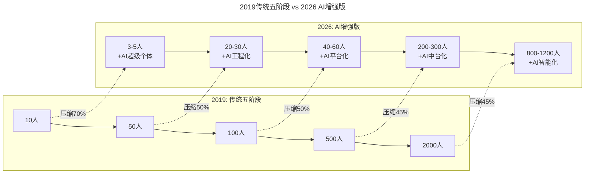
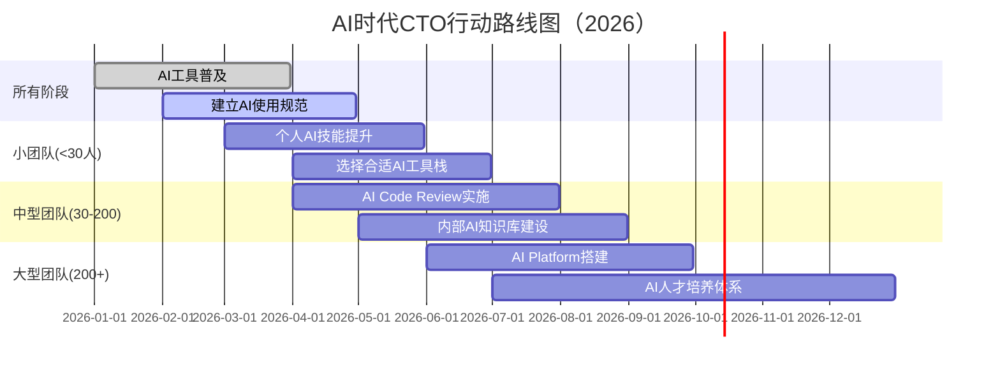

# 第114讲 | 成敏：谈谈不同阶段技术公司的特点

> **适用范围**：CTO、技术VP、创业者，以及需要根据公司规模阶段制定技术战略和组织建设方案的管理者。

> **更新摘要（v2 · 2026-08 更新）**：
> - 结构化升级为 6 节骨架（导言 / 核心方法论 / 关键流程 / 工具与实战 / 常见误区 / 进阶延展）
> - 保留成敏原文完整内容及五阶段公司模型（10人→50人→100人→500人→2000人）
> - 将五阶段模型升级为AI时代等效规模（3-5人→20-30人→40-60人→200-300人→800-1200人）
> - 新增各阶段AI时代新特征和CTO行动路线图
> - 整合原文独立的AI时代注解内容到对应章节

---

## 1. 导言

今天就简单的以公司规模大小为划分标准，分析在不同规模下，技术公司的业务特点，以及要做好技术体系建设可能面临的困难。

本文原发布于2019年，成敏以公司规模为维度将技术公司划分为五个阶段，分析各阶段的业务特点和技术体系建设挑战。7年后的今天，**84%的开发者已使用AI编程工具**，Agent进入加速落地期，这些变革正在重塑每个阶段的技术组织形态和建设重点。本文在保留原文五阶段模型的基础上，从2026年的视角补充AI时代的新特征和新挑战。

### ⭐ 2026核心洞察

**AI让"一个人抵五个人"成为现实**——同样业务量所需的团队规模大幅缩小，但对人才质量的要求反而更高。

---

## 2. 核心方法论

### 2.1 五阶段模型概览



上图对比了2019年传统五阶段与2026年AI增强版的规模差异：AI的引入使得每个阶段完成同等业务量所需的团队规模压缩45%-70%。第一阶段从10人压缩至3-5人（压缩70%），后续阶段逐步收窄至45%的压缩率。这意味着AI不仅提升了个体效率，更从根本上改变了组织规模与业务量的对应关系。

| 阶段 | 2019年规模 | 2026年等效规模 | 关键变化 |
|------|-----------|---------------|----------|
| 第一阶段 | 10人 | **3-5人+AI** | AI替代50%+基础工作 |
| 第二阶段 | 50人 | **20-30人+AI** | 工程效能提升3x |
| 第三阶段 | 100人 | **40-60人+AI** | 协作模式质变 |
| 第四阶段 | 500人 | **200-300人+AI** | 组织结构扁平化 |
| 第五阶段 | 2000人 | **800-1200人+AI** | 决策智能化 |

---

## 3. 关键流程

### 3.1 第一阶段：十人左右规模 → 🚀 超级个体时代

当公司规模比较小的时候，比如还处在初创阶段，这时公司可能只有十几人，机器也只有十几台，规模很小。在这个阶段，公司的需求变化通常会非常快，甚至可能还没有确定业务的主营模式。很有可能公司今天尝试某个方向，结果发现此路不通，第二天就转换方向，试行另一个方向。

其实，不少创业公司就是在这样的快速迭代，不断试错中找到了自己的爆发点。

这样需求变化快且业务模式难以固定的团队，对团队成员技术栈宽度的要求会非常高。比如研发岗位除了做好研发工作外，还需要承担测试、上线等工作，甚至之后的运维也需要他们来负责。再比如，这时的CTO不仅要把控技术方向、管理技术团队，还得上手写代码，更有可能还要去机房看机器情况。

因此，在这个阶段，公司会更看重研发人员的单兵作战能力，之前很流行的全栈工程师正是在这样的需求下应运而生。同时，在这个阶段，团队往往有着非常高效的沟通效率和执行速度。

当然，这个阶段，团队的问题在于，一是团队的技术天花板会受限于单兵的技术水平；二是缺乏人才储备、规范化程度也比较低，一旦有人离开，就会极大的影响研发进度；三是技术成本投入很难实现规模化。

**⭐ 2026 新增特征：**

| 维度 | 2019年 | 2026年 |
|------|--------|--------|
| 所需技能 | 全栈（前端+后端+运维） | **全栈 + Prompt Engineering + AI工具链** |
| 开发速度 | 1x基准 | **4-5x**（AI辅助） |
| 沟通方式 | 当面/即时通讯 | **AI辅助文档生成 + 异步协作** |
| 最大风险 | 人员流失 | **过度依赖AI导致技术理解浅薄** |

**关键建议：**
```
✅ 应该做的：
□ 掌握至少2个AI编程工具（Cursor / Copilot / Windsurf）
□ 建立个人Prompt Library
□ 用AI处理重复性工作（测试、文档、配置）
□ 保持对核心技术的深度理解（不被AI替代）

❌ 应该避免的：
□ 完全依赖AI写代码而不理解原理
□ 忽视代码质量和安全性
□ 放弃学习新技术（AI更新很快）
```

### 3.2 第二阶段：五十人左右规模 → 📈 工程化加速期

这个阶段，公司稍微有点起色了，团队规模也达到五十人左右，机器也能有一两百台的规模。

这个阶段，公司的业务主体已经比较明确，但需求变化加快，可能比之前初创期来得更快。团队在这个阶段开始有了明确的分工，但未必有分组，比如运维工作会招一两个专职的运维来负责，不再由研发兼任，但还没法形成专门的运维团队。

在流程上，公司开始关注协同及规范，只是整体的流程规范依旧比较简单，自动化程度比较低，协同比较松散。这个时期，内部沟通依旧会比较顺畅，只是需要警惕不要让公司陷入到作坊式作战的陷阱中去。

**⭐ 2026 新增特征：**

| 维度 | 2019年 | 2026年 |
|------|--------|--------|
| 分工方式 | 按职能（开发/测试/运维） | **按产品线 + AI共享服务层** |
| 流程规范 | 手工+简单工具 | **AI自动化CI/CD + 智能Code Review** |
| 协同工具 | JIRA/钉钉 | **JIRA + AI Agent自动跟进** |
| 效率瓶颈 | 人工操作多 | **Prompt质量差异** |

**新增挑战：**
- 如何统一团队的AI工具使用规范？
- 如何评估AI辅助产出的质量？
- 如何避免"AI依赖症"？

### 3.3 第三阶段：百人左右规模 → 🏢 平台化转型期

这个阶段，团队规模一般能达到上百人，机器规模也能达到一两千台。一般到了这个阶段，公司的主营业务已经相对稳定，也开始做1-2年左右的规划。

这个阶段，业务需求仍然大于技术资源，而技术和业务上的分组都已经开始产生，除了基本的分工之外，会有一些明确的分组去负责明确的事情。

在这个阶段，公司也会更重视流程规范，会尝试利用开源工具完成最原始的自动化，团队成员的自主性、自我驱动力也会非常强。但在第三阶段，上百人规模的团队已经初步具备规模化的效应。

当然，这个阶段也会存在问题，如人员梯队开始明显化、沟通壁垒开始出现等。

**⭐ 2026 新增特征：**

| 维度 | 2019年 | 2026年 |
|------|--------|--------|
| 架构模式 | 微服务/SOA | **微服务 + AI Gateway + Agent Platform** |
| 自动化 | Jenkins/Docker | **GitHub Actions + AI测试 + 自动部署** |
| 知识管理 | Wiki/Confluence | **AI知识库 + 语义搜索 + RAG** |
| 沟通壁垒 | 部门墙 | **AI翻译 + 跨部门Agent协调** |

**关键行动：**
```
□ 建立统一的AI开发规范（Prompt模板、代码风格）
□ 引入AI Code Review覆盖核心模块
□ 构建内部AI知识库（减少重复提问）
□ 培养第一批"AI Champion"（每团队1-2名）
```

### 3.4 第四阶段：五百人左右规模 → 🏛️ 中台化与智能化

这是很多中等公司所处的位置。这个阶段，公司业务已经相当稳健，团队规模一般会达到五六百人，机器也能有三五千台，也有能力做2-3年左右的中期规划。

这个时候，公司一般已经有了独立的技术服务团队。在这个阶段，公司需要尤其注重人员培养机制和梯队的建设。

另外，在技术层面，这个阶段的公司还会面临两个问题，第一个是技术债务的归还，第二个是技术路线的争议。还有技术上的重复建设，跨团队的协同沟通等都是这个阶段需要面对的问题。

**⭐ 2026 新增特征：**

| 维度 | 2019年 | 2026年 |
|------|--------|--------|
| 技术债务 | 人工识别+计划清理 | **AI扫描 + 自动重构建议** |
| 技术选型 | 团队讨论+POC | **AI调研报告 + 快速验证** |
| 人才培养 | 导师制+培训 | **AI个性化学习路径 + 实战项目** |
| 跨团队协同 | PMO协调 | **AI项目管理Agent + 智能调度** |

**核心挑战：**
- 如何平衡AI提效与就业稳定性？
- 如何建立AI时代的绩效考核体系？
- 如何防止核心技术被AI"稀释"？

### 3.5 第五阶段：两千人左右规模 → 🌐 智能化生态

这个阶段，公司规模一般已经超过两三千人，机器也有几万台。这个阶段的公司，一般已经拥有完备的技术体系和人才体系，也有足够的资源建立前瞻性的技术研究团队，能够应对未来至少三年以上的长期规划。

对于这个阶段的公司，会更注重技术文化的建设和价值观的传递。另外，在这类大型公司里，很容易出现业务分工上的问题。最后，对这类大公司来讲，最重要的就是要做好长线规划。

**⭐ 2026 新增特征：**

| 维度 | 2019年 | 2026年 |
|------|--------|--------|
| 战略规划 | 人类专家判断 | **AI数据分析 + 人类战略决策** |
| 创新机制 | 研发中心 | **AI Lab + 内部创业孵化** |
| 文化传播 | 培训+宣讲 | **AI个性化文化推送 + VR体验** |
| 决策层级 | 多级审批 | **AI辅助决策 + 扁平授权** |

---

## 4. 工具与实战

### 4.1 ⭐ AI时代CTO行动路线图



上图以甘特图形式展示了2026年各规模CTO的AI行动路线：所有阶段都需先完成AI工具普及和使用规范建设（Q1-Q2）；小团队（<30人）聚焦个人AI技能提升和工具栈选择（Q1-Q2）；中型团队（30-200人）推进AI Code Review和内部知识库建设（Q2-Q3）；大型团队（200+人）则需要搭建AI Platform和人才培养体系（Q2-Q4）。

### 4.2 成敏原文观点的2026验证

| 原文观点 | 2019背景 | 2026现实 | 验证状态 |
|----------|----------|----------|----------|
| "单兵作战能力是第一阶段关键" | 全栈稀缺 | ✅ **仍正确，但定义扩展为"AI-Augmented全栈"** |
| "第二阶段要警惕作坊式作战" | 流程不规范 | ✅ **更需警惕"AI黑箱作业"** |
| "第三阶段规模化效应初显" | 工具复用 | ✅✅ **AI让规模效应呈指数级放大** |
| "第四阶段人才流失是大问题" | 中型企业困境 | ⚠️ **问题仍在，但AI降低了对人数的依赖** |
| "第五阶段要做好长线规划" | 大企业通病 | ✅ **更重要：AI战略规划决定生死** |

---

## 5. 常见误区

### 5.1 各阶段常见误区

- **第一阶段误区：忽视规范化**——缺乏人才储备、规范化程度低，一旦有人离开就极大影响研发进度
- **第二阶段误区：作坊式作战**——流程规范简单、自动化程度低、协同松散
- **第三阶段误区：沟通壁垒**——人员梯队明显化，沟通效率下降
- **第四阶段误区：技术债务堆积**——业务稳健时未及时归还技术债务，技术路线争议耗费资源
- **第五阶段误区：缺乏长线规划**——一旦遇到问题，很难在航行中调转方向

### 5.2 AI时代各阶段新误区

- **第一阶段：过度依赖AI**——完全依赖AI写代码而不理解原理，技术理解浅薄
- **第二阶段：AI工具使用不统一**——团队成员各自使用不同AI工具，缺乏统一规范
- **第三阶段：AI黑箱作业**——AI辅助工作不透明，缺乏Code Review和质量验证
- **第四阶段：AI提效与就业稳定性失衡**——过度追求AI提效而忽视团队稳定性
- **第五阶段：AI战略规划缺位**——有资源建立AI Lab但缺乏清晰的战略方向

---

## 6. 进阶延展

### 6.1 小结

本文将技术公司按照规模大小简单分成了五个阶段，每个阶段的特点和面临的问题都各不相同。在AI时代，每个阶段的等效规模都大幅压缩，但对人才质量的要求反而更高。

### 6.2 核心洞察的AI时代升华

> **2019年洞察**：不同规模的技术公司面临不同的挑战，需匹配不同的技术体系建设策略。
>
> **2026年升级**：AI让"一个人抵五个人"成为现实——同样业务量所需的团队规模大幅缩小，但每个阶段的核心挑战并未消失，只是以新的形态呈现。管理者需要在更小的团队规模下，解决更复杂的AI时代问题。

### 6.3 参考与延伸

- 成敏五阶段模型：10人→50人→100人→500人→2000人的技术公司演进路径
- AI时代等效规模：3-5人→20-30人→40-60人→200-300人→800-1200人
- 全栈工程师→AI-Augmented全栈：第一阶段单兵作战能力的定义扩展
- 微战队、AI Champion、AI Platform：各阶段AI落地的关键组织实践
- 技术债务的AI治理：从人工识别到AI扫描+自动重构建议

---

**注解完成时间**：2026年6月  
**适用读者**：CTO、技术总监、创业者  
**核心价值**：将传统五阶段模型与AI时代实践结合，提供可执行的演进路径
