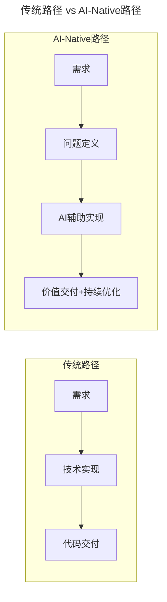
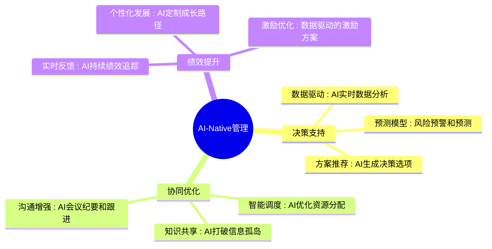
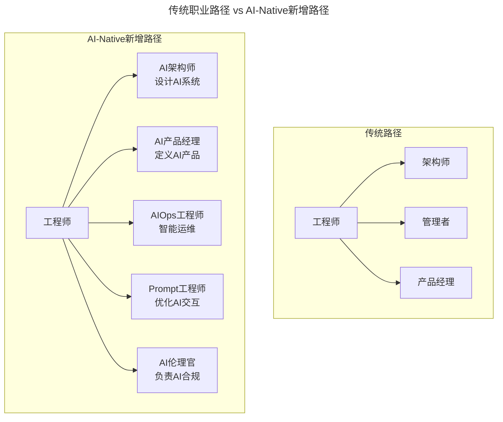

# 第70讲 | 技术、产品、管理的不同视角

> **适用范围**：需要与技术、产品、管理三方协作的工程师、架构师、产品经理与技术管理者，尤其是跨角色沟通存在隔阂的团队成员。
>
> **更新摘要（v2 · 2026-08 更新）**：
> - 结构化升级为 6 节骨架（导言 / 核心方法论 / 关键流程 / 工具与实战 / 常见误区 / 进阶延展）
> - 保留原文"技术/产品/管理眼中不同的世界"四个关键词对比
> - 整合 2026 年 AI 时代升级注解，为所有 Mermaid 图补充 `title` frontmatter
> - 新增 AI-Native 三视角进化对照表、AI-Native 职业新增路径与跨角色协作新模式

## 1. 导言

我们在工作中难免会跟技术、产品、管理等角色打交道，那么不同角色的世界观有什么不同呢？怎么平衡多个角色之间的关系，怎么协调多角色团队的工作呢？

> **关键数据**：2026年，GPT-5.5和DeepSeek V4让AI Agent能力达到新高度，**84%的开发者使用AI编程工具**。AI正在深刻改变技术、产品、管理三个角色的协作模式和价值创造方式。

## 2. 核心方法论

### 技术、产品、管理眼中不同的世界

技术眼中的世界有4个关键词，分别是工作、设计、选型、优雅。他会关注自己的设计方案是否优秀；该选用什么样的技术选型才合适，比如是选用SQL还是MySQL；自己的代码是否足够优雅等。

产品眼中的世界也有4个关键词，分别是用户、需求、方案、细化。他会要求自己理解用户，了解他们的需求，并满足他们的需求；针对用户的需求提出相应的解决方案，并将方案细化到可执行程度。

管理眼中世界的4个关键词则分别是目标、指标、拆解、梯队。他关注的是自己是否能达到目标和相应的指标，如何对任务进行合理拆解并制定阶段性目标，如何建立完善的人才梯队，做好人才储备等。

这三个角色眼中的世界都是不一样的，这导致他们看待同一件事情的视角也是不一样的。

技术人首先看到的是工作，一个确定性的工作，而且技术人特别喜欢解决确定性问题，有输入有输出。一个任务的要求是什么、边界在哪里，确定这些问题之后，他就非常容易把它分解开，并把它完成。

技术人的追求在于，他希望自己在做这些事情的时候，够优雅、够简洁、够高效。而产品解决的往往是非确定的问题，比如好，不好；好用，不好用；流程，不流畅；酷，不酷等，这些都是没办法做具体的、确定性的界定的。

举例来说，工程师面临的问题，可能是把宽带节省30%，把QPS从1700提高到2000等，都是非常数字化、确定化的。而产品经理不是这样的，他们面临的问题，往往是让用户更满意、让用户觉得产品更厉害等，都是非确定性的问题。

而管理跟技术和产品都不一样，管理面向的是目标，他关注的是指标，比如这个产品月活提高30%，成本减少50%，梯队规模控制在1000人以内等，都是数字性的具体指标。

### 三个视角的 AI-Native 重新定义

#### 技术视角的进化：从"实现者"到"架构师+AI编排者"

| 维度 | 传统技术人 | AI-Native技术人 |
|------|-----------|----------------|
| **核心职责** | 写代码实现功能 | **定义问题 + AI辅助实现** |
| **关注点** | 代码质量、性能 | **系统设计 + AI伦理** |
| **技能要求** | 编程语言、框架 | **Prompt工程 + Agent设计** |
| **价值产出** | 功能交付 | **业务价值 × 技术影响力** |

AI-Native 路径在"需求"之后多出了"问题定义"环节，交付也从一次性"代码交付"升级为"价值交付 + 持续优化"，强调技术人对问题定义与 AI 编排的能力。

#### 产品视角的进化：从"需求翻译"到"AI增强的价值设计"

**传统产品经理痛点**：
- 需求描述不清晰
- 技术可行性评估困难
- 用户反馈收集和分析耗时

**AI-Native产品经理新能力**：
- **AI辅助需求分析**：自动拆解用户故事，识别依赖关系
- **AI原型生成**：快速生成可交互的原型
- **数据驱动决策**：实时分析用户行为数据
- **个性化体验设计**：利用AI实现千人千面

#### 管理视角的进化：从"目标监控"到"智能协同编排"

**传统管理挑战**：
- 信息不对称
- 进度跟踪滞后
- 资源调配低效

**AI-Native管理新范式**：

AI-Native 管理在决策支持、协同优化、绩效提升三个维度全面引入 AI 能力，从"事后看报表"升级为"实时预测 + 智能建议 + 自动纠偏"。

## 3. 关键流程

### 原文三种跨角色沟通方法

由于大家的视野和视角不同，彼此之间会产生很多隔阂和误解，网上很多段子就是由此而来。而避免这些情况发生最好的方法就是加强沟通，具体可以从以下3个方面着手。

1. 以团队实现为目标，把自己的视角从程序员拔到更高的高度，从团队价值的角度出发，思考和对话。
2. 换位思考，多去想想如果你处在对方的位置，你会怎么想怎么做，这样的换位思考能有效避免形成误解和误区。
3. 用对方能听懂的语言做表达，很多时候，技术人员习惯用技术语言来表达，比如异地多活很重要，一个典型的技术语言，但产品经理或管理者可能不清楚这个词具体是什么意思。因此，技术人员在跟对方沟通的时候，需要把技术语言翻译成产品语言或指标性语言，比如"在任何异常情况下保持服务稳定很重要"，这样，他们也更能理解你所做的事情的价值。

### AI-Native 升级版协作方法

#### 方法一：以"人机协同价值"为目标

**传统**：以团队实现为目标
**AI-Native**：以**"人机协同创造最大价值"**为目标

具体做法：
- 建立**共享的AI工具平台**，让三个角色都能使用
- 定义**统一的AI使用规范**，确保协作顺畅
- 设立**"人机协作价值"**指标，量化协作效果

#### 方法二："AI增强的换位思考"

**传统**：换位思考（站在对方角度想问题）
**AI-Native**：**AI模拟换位思考**

具体做法：
- 使用**AI角色扮演工具**，模拟不同角色的视角
- 利用**AI分析沟通记录**，发现理解偏差
- 通过**AI生成多角度方案**，促进共识形成

#### 方法三："AI翻译官"打破语言壁垒

**传统**：用对方能听懂的语言表达
**AI-Native**：**AI自动翻译 + 上下文补充**

具体做法：
- 部署**AI术语解释器**，实时翻译专业术语
- 使用**AI文档生成器**，自动生成多方都能理解的文档
- 建立**统一的知识库**，让AI成为团队的"共同语言"

## 4. 工具与实战

### 技术人的四大职业发展路径

对于技术人来说，一般有4个职业发展路径，第一个是从工程师到研究员到高级研究员，最后成长为科学家，是偏专业研究的一条路径；第二个是从工程师到高级工程师到架构师再到主任架构师，这是偏工程实现的一条路径；第三个是从工程师到项目经理到经理再到部门总监，这是偏管理的一条路径；第四个是从工程师到产品经理到高级产品经理再到产品架构师，这是偏产品的一条路径。

对于程序员来讲，如果最后以CEO或COO作为自己职业发展的目标，那么可以换一个方向，尝试选择后两条发展路径，试着培养自己的产品思维和管理思维。

### 产品思维与 PM 的共同特点

先来看产品思维。其实不同产品经理的侧重点各有不同，可能在技术人员眼里，他们都叫PM，但其实PM各有不同，有的偏交互的，做用户产品；有的偏策略的，做商业产品；有的偏运营活动的，还有的偏活动策划型等，每种产品经理的世界也各不相同。不过，所有的PM都有相同的特点：

1. 他们都有改变世界的理想，这一点很重要。程序员的理想是什么？是这个事儿做得得酷，未必是我一定要改变这个世界。但好的产品经理不是，他们一般都有一个改变世界的理想，这样才能推动他们前进。
2. 相对理性的技术人员来说，产品经理一般会更偏感性思维，特别是偏交互型的产品经理，他们的Sensitive更强，能敏锐的捕捉用户的需求。
3. 在产品经理的思维中，他们会先考虑一切都是可能的，比如飞机不用轨道就能起飞，在他们眼中应该也能实现，因为这样才能放飞自己的想象力，这点跟技术人员有很大的不同。
4. 产品经理常说就差一个程序员了，他们一般不会考虑实现的问题，在他们看来，具体怎么实现，都是可以扔给工程师去解决的。

### 技术转产品的优势与劣势

**优势**：
1. 技术人员有较强的逻辑思维能力较强；
2. 技术人员知道什么可能实现。

具体来说，技术人员有更强的逻辑思维的能力，就会有较强的全局视野，做事情就会更有计划性，知道怎么把任务做好拆解，在具体执行中分成几步去做更合适，这一点很重要。同时，因为技术人员知道什么可能实现，他就不会被技术团队忽悠，反之，一个不了解怎么实现的产品经理很有可能会被他的技术团队忽悠。做到以上两点之后，技术人员就能从源头开始强有力的把控整个项目的进展，这是非常重要的优势。

**劣势**：
1. 太过注重可实现性。这在技术人员做工程的时候，是一个很好的优势，但当他进入另外一个角色的时候，就可能变成劣势。因为太注重可实现性的话，就会限制自己的想象空间，会被制约想象力。因为很多东西在一开始的时候都是不可实现的，而正因为它们当初的不可实现，才给了我们更多的机会。
2. 缺乏同理心。在技术人员眼中，世界一般都是客观的、数字化的、Coding化的，但是真实的世界都是由人组织构成的，所以需要我们用心去感受别人是怎么想的，这个功能为什么用户喜欢或不喜欢，这样的同理心，技术人员会相对欠缺一些。
3. 思维太过理性。然而产品有时候需要的是感性，当理性的思维碰上感性的需求，就会产生冲突。举个例子，一个产品有10个功能需求，一般技术人员会思考怎样用最少的代价把这10个功能都实现了，最后可能每个功能都只做到60分或80分。但其实，重要的不是把功能全部实现，而是选择其中的一个作为突破点，做到120分，这就足够了，其他的都可以不做。所以，性价比不是决定性因素，有突破点才是决定性因素。这一点，很多从工程师转到产品经理的人都不容易参透。

### AI-Native 新增职业路径

AI-Native 时代在传统架构师、管理者、产品经理三条路径之外，新增了 AI 架构师、AI 产品经理、AIOps 工程师、Prompt 工程师、AI 伦理官等新职业方向，技术人可以根据自身兴趣选择 AI 相关的细分赛道。

## 5. 常见误区

### 误区一：太过注重可实现性

技术人员做工程时的优势，转产品后可能变成劣势。太注重可实现性会限制想象空间——很多机会正因为当初不可实现才存在。

### 误区二：缺乏同理心

技术人员眼中世界是客观、数字化、Coding 化的，但真实世界由人构成。需要用心感受别人怎么想、功能为什么用户喜欢或不喜欢，这是技术人员相对欠缺的能力。

### 误区三：思维太过理性，忽视"突破点"思维

理性思维碰上感性需求会产生冲突。一个产品有 10 个功能需求，技术人员倾向"用最少代价把 10 个功能都实现，每个做到 60-80 分"，但正确的做法是"选择一个突破点做到 120 分，其他可以不做"。性价比不是决定性因素，有突破点才是。

### 误区四：用技术语言与非技术人员沟通

技术人员习惯用"异地多活"这类技术语言，但产品经理或管理者可能不清楚其含义。需要把技术语言翻译成产品语言或指标性语言，例如"在任何异常情况下保持服务稳定很重要"，对方才能理解你做的事情的价值。

## 6. 进阶延展

### 2026 可执行建议

**对于技术人**：
1. **学习AI基础**：掌握LLM、Agent、Prompt Engineering等核心概念
2. **培养系统思维**：从"如何实现"转向"为何这样设计"
3. **提升沟通能力**：学会用数据和案例说话，而非纯技术语言

**对于产品人**：
1. **拥抱AI工具**：用AI辅助需求分析和原型设计
2. **深化数据能力**：学会用数据驱动产品决策
3. **理解技术边界**：知道什么AI能做什么不能做

**对于管理人**：
1. **重新定义成功标准**：从"按时交付"到"价值创造"
2. **建立AI治理机制**：规范AI的使用和管理
3. **培养AI领导力**：学习如何领导和协调人机协作团队

### 2026年展望：从"三角博弈"到"生态协同"

| 维度 | 2018年 | 2026年 |
|------|--------|--------|
| **角色关系** | 三角博弈，存在隔阂 | **生态协同，AI连接一切** |
| **沟通成本** | 高（语言不通） | **低（AI翻译+自动对齐）** |
| **创新来源** | 单点突破 | **人机协同创新** |
| **成功要素** | 个人能力 | **系统能力 + AI增强** |

### 结语

今天跟大家分享了技术、产品、管理的不同视角，每个角色都有各自不同的世界观，为了避免产生隔阂，技术人员需要从以团队实现为目标、换位思考、用对方能听懂的语言做表达三个方向出发，锻炼自己的沟通技巧。

同时，技术人员有着不同的职业发展路径，转向产品，以产品架构师为目标是不错的选择。而当技术人员选择转向产品时，需要克服自己太过注重可实现性、缺乏同理心、思维太过理性的短处，发扬自己逻辑思维能力强、了解可实现性的长处。

你觉得技术、产品和管理的不同视角主要体现在什么地方呢？技术转型产品时需要转变哪些思维呢？

_**作者简介**_

王昊，bilibili主站技术中心总经理，曾历任百度基础架构部架构师、高级技术经理，网页搜索部副总监，移动应用部总监，是百度分布式存储领域的早期开创者，推动了百度分布式存储技术的自研、应用。

（本文整理自bilibili主站技术中心总经理王昊在ArchSummit大会上的分享，有删减。）

---

**升级时间**：2026年6月  
**适用场景**：技术、产品、管理三方协作的AI时代参考  
**核心观点**：AI不是要消除三个角色的差异，而是要弥合差异、放大协同；未来的竞争力在于"人机协同生态系统"
