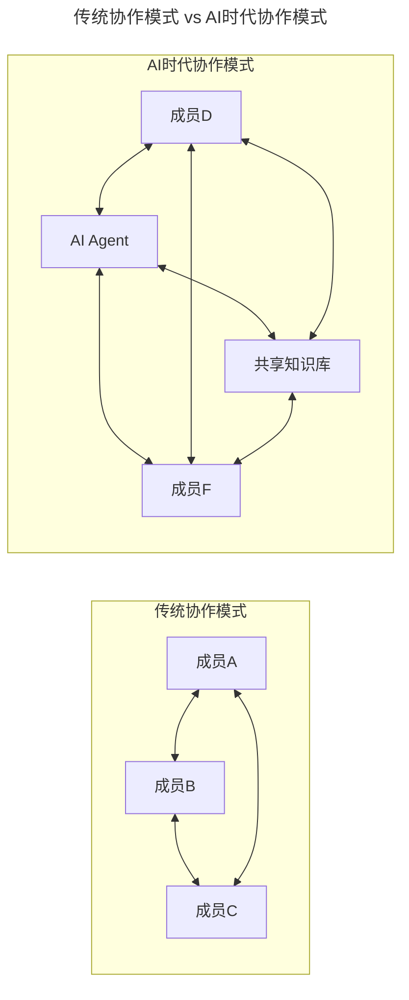
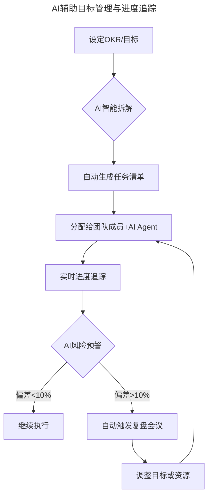
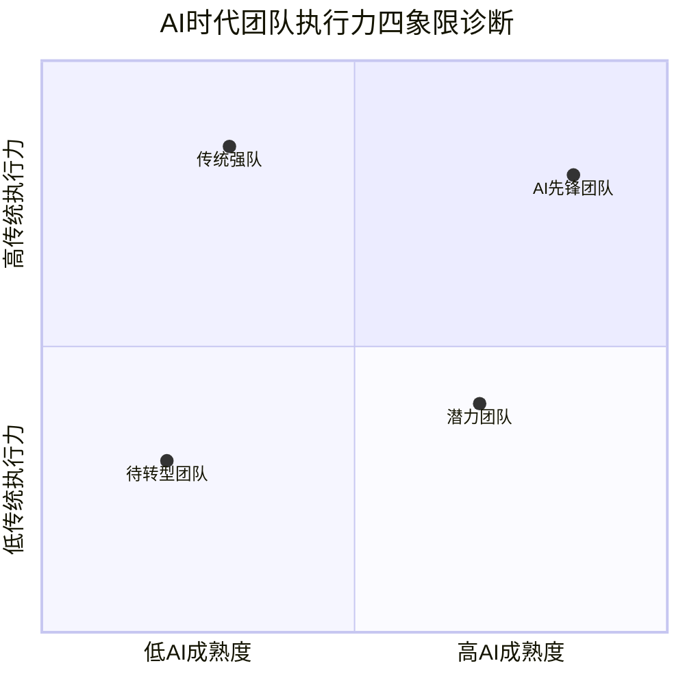

# 第13讲 | 把脉高效执行的关键要素

> **适用范围**：技术管理者、项目经理、团队Leader，以及希望诊断和提升团队执行力的管理者。

> **更新摘要（v2 · 2026-08 更新）**：
> - 结构化升级为 6 节骨架（导言 / 核心方法论 / 关键流程 / 工具与实战 / 常见误区 / 进阶延展）
> - 保留刘建国原文完整内容及"马车模型"（个体动力×协作水平×方向有效性×时长）
> - 将"马车模型"升级为"人机协同车队模型"（每个变量增加AI乘数）
> - 新增AI时代团队执行力四象限诊断框架和三大执行陷阱
> - 整合原文独立的AI时代注解内容到对应章节

---

## 1. 导言

曾经有个公司的高管跟我说，"竞争对手家的团队"天天加班到很晚，于是也想让自己团队实施996工作制，问我怎么看。

我问他，希望通过996来达成什么目的？他一时语塞。

我其实挺理解他的感受，他希望事情能够做得更快，团队更有干劲，产出更有效率，让整个公司跑起来，至少比竞争对手跑的要快。我也理解他为什么会语塞，在创始人眼里，创业公司就是要热火朝天啊，就是要996啊，就是要比竞争对手更努力啊，这还用问吗，至于要达成什么目的……没仔细想！

但我还是要问，因为996终究只是手段，而手段必定需要为某个特定目的服务，目的还不明确的时候，手段的有效性是无法评判的。我们靠"理所当然"的常识做决策，往往达不到我们想要的效果，甚至事与愿违，唯一的效果就是阶段性的自我安慰。

高效执行，本身也并不是目的，而是达成特定目的的手段。因此，当我们探讨如何打造高效执行团队的时候，就不能只谈论"执行"本身。

截至2026年，**84%的开发者已在日常工作中使用AI编程工具**（GitHub Copilot、Cursor、Windsurf等），GPT-5.5和DeepSeek V4的发布标志着**Agent（智能体）进入加速落地期**。AI不再仅仅是"辅助工具"，而是正在重塑团队执行力的底层逻辑——**公式中的每一个变量都被AI重新定义**。本文在保留原文"马车模型"的基础上，系统升级为AI时代的"人机协同车队模型"。

---

## 2. 核心方法论

### 2.1 什么是高效执行

为了避免我的个人狭隘，我做了一个公开小调研，当提及"高效执行"的时候，大家第一印象是什么？回复我的有一线员工，有经理层，也有创业者，集中在下面这些词句：

"令行禁止、不拖延，军队"
"多做少说、决定干了就干，别讨论了"
"发奖金、扣工资"
"实施996 997"
"红色性格"（热情、奔放有力量）
"理解沟通"
"时间管理"
"项目管理、过程控制"
"目标明确、收益明确"

……

看到这些反馈，我的内心是崩溃的：即便是背景相对一致的朋友圈，大家对"高效执行"的理解都这么大差异，探讨这个话题是多么有挑战的一件事啊。

### 2.2 马车模型

好在，人类有一项特异功能是其它动物所不具备的，那就是使用隐喻去提炼问题的核心。于是，我们也借用一个简化了的管理模型：把执行一项任务，看做是把一架马车驾驶到特定目的地。所谓"高效执行"，就变成了如何尽快地到达目的地；而管理者，此时就变成了一名马车夫，他能否快速到达目的地，大体取决于3个关键因素：

1. 每匹马用多大力气拉车。
2. 多匹马是否步调一致，且往一个方向走。
3. 马车是否在有效地朝着目的地方向前进。

对应到团队管理和任务执行中，就是这样三个问题：

1. 每位成员的个体能力和努力的意愿。即，**个体动力**。
2. 成员间的组织结构是否合理，协作的节奏是否一致。即，**协作水平**。
3. 大家是否在朝着一个稳定的目标努力。即，**目标清晰度/方向有效性**。

对应的近似公式是：

```
绩效 = 效率 × 时长
     = 团队合力 × 方向有效度 × 时长
     = 个体动力 × 协作水平 × 方向有效性 × 时长
     = （能力×意愿）×（默契×机制）×（目标×沟通）× 时长
```

可见，每个公司都希望拥有的高执行力，除了时长这个"简单粗暴"的因素外，个体动力（能力×意愿）、协作水平（默契×机制）、方向有效性（目标清晰），是三个重要的着眼点。

### 2.3 ⭐ 人机协同车队模型

2026年，原文的"马车模型"需升级为"人机协同车队模型"：

```
绩效 = (个体动力 + AI增强) × (协作水平 + AI协同) × (方向有效性 + AI对齐) × 时长
```

每个变量都增加了AI乘数：
- **个体动力 + AI增强**：AI工具扩展个人能力边界
- **协作水平 + AI协同**：AI作为"第七名队友"参与协作
- **方向有效性 + AI对齐**：AI辅助目标拆解和进度追踪

---

## 3. 关键流程

### 3.1 个体动力和员工激励

我们先来看个体动力。一匹马能出多大力，取决于它的实力，以及使用实力的意愿，即个体动力=实力×意愿，对应到员工就是：能力×意愿。

个体实力的提升，功夫在平时的积累，其提升的方式也各有神通，我们不展开讨论。而意愿的激发，却可以是立即起效的，所以我们看到大部分的管理者都在意愿的激发上做文章，比如发奖金、扣工资等，这就是我们经常说的员工激励。

员工激励是个很大的话题，值得我们关注的是，目前职场上正在经历从驱动力2.0到3.0的转变，即从胡萝卜加大棒的外部奖惩驱动，过渡到以提升自驱力为特征的自主投入驱动，能够发挥优势，以及工作的目标感、成长感、意义感成为激励的重要手段。

#### ⭐ 个体动力的AI时代升级

**从"能力×意愿"到"能力×意愿×AI乘数"**

| 维度 | 传统视角 | AI时代新维度 |
|------|----------|--------------|
| 能力 | 编码能力、架构设计 | **提示词工程、AI评判能力、Agent编排能力** |
| 意愿 | 自驱力、成就感 | **人机协同效率意识、持续学习AI新工具的意愿** |
| 新增 | - | **AI安全意识、数据隐私保护能力** |

**可执行建议：**
- 为团队成员提供**AI工具培训预算**（建议每人每年至少40小时）
- 建立**AI技能评级体系**，将AI协作能力纳入绩效考核
- 鼓励"**AI Pair Programming**"文化——人与AI结对编程成为常态

### 3.2 协作水平和团队合力

是不是每匹马都尽力去拉车了，车就一定跑得快呢？

其实未必，如果几匹马用力的方向不一致，车有可能是不会动的；即便车辆设计非常好，马匹不会出现用力方向不一致的情况，几匹马的步调如果不一致，车速也不是最优。因此，所有马匹是否形成有效的合力，这才是决定车速的最终力量。

团队合力亦是如此，组织架构是否让团队成员往同一个方向努力，以及大家工作节奏是否协调一致，也决定着团队的产出是否高效。

当然，在团队中，两个员工出现往相反方向努力的情况并不常见，但是团队每位成员对一项任务的优先级有不同的理解，却非常普遍。在A手上是第一重要的工作，在上下游团队中的B手上未必是，此时信息同步和整体协调就显得尤为重要。

#### ⭐ 协作水平的AI时代升级

**从"人-人"到"人-AI-人"**



上图对比了传统协作模式与AI时代协作模式的差异：传统模式中成员之间直接协作（A↔B↔C）；AI时代协作模式中，AI Agent成为协作中枢（D↔E↔F），同时通过共享知识库（G）连接所有成员。这种模式下，AI不仅承担信息中转角色，还能24小时处理代码审查、文档生成、测试用例编写等异步协作任务。

**关键变化：**
- **AI作为"第七名队友"**：一个5人团队+AI工具链 = 传统10人团队的产出
- **异步协作增强**：AI可以24小时处理代码审查、文档生成、测试用例编写
- **知识共享效率提升**：AI驱动的内部知识库（如基于RAG的Wiki）让新人上手时间缩短60%

### 3.3 目标清晰度和方向感

驾驶马车的方向感，其实就是一个团队的目标感。大家也许会问，目标设定是规划的范畴，和高效执行有什么关系？我想说的是，脱离目标来谈执行，这恰恰是最普遍存在的问题，这个问题至少会引发了三个不良后果。

**第一是激励失效。** 引发他们强烈抱怨和失去动力的一个重要原因就是需求变化太快，导致手头上的工作任务频繁切换，带来三个主要的负面影响：工作反复切换导致挫败感累积；时间越来越紧引发焦虑和负面情绪；质疑管理层能力，降低信任。

**第二是协作失调。** 明确而认知一致的目标，对于团队所有成员保持统一的工作步调的意义，是非常显而易见的。相反，目标不一致的情况下，让员工保持良好的节奏和状态就变成了奢望。

**第三是忙乱无效。** 高效执行，除了速度快，还得有效，所谓有效就是往正确的方向前进。如果目标不清晰，就属于"瞎忙"，这种状态是不健康的。

#### ⭐ 方向有效性的AI时代升级

**AI辅助目标对齐与进度追踪**



上图展示了AI辅助目标管理的全流程：设定OKR后由AI智能拆解为任务清单，分配给团队成员和AI Agent执行，实时追踪进度。当偏差超过10%时自动触发复盘会议，调整目标或资源后重新分配。这一闭环流程将传统的人工目标管理升级为AI驱动的智能目标管理。

**可执行建议：**
- 使用**AI项目管理工具**（如Linear AI、Notion AI）自动追踪目标达成度
- 建立**AI周报机制**：AI自动汇总团队工作进展，识别阻塞点
- 目标变更时，使用**AI影响评估**：快速分析变更对各任务的影响范围

---

## 4. 工具与实战

### 4.1 ⭐ AI时代团队执行力诊断框架



上图以"传统执行力"和"AI成熟度"为两轴，将团队分为四象限：AI先锋团队（高执行力+高AI成熟度）应保持领先；传统强队（高执行力+低AI成熟度）需优先引入AI工具链；潜力团队（低执行力+高AI成熟度）应补齐基础管理能力；待转型团队（低执行力+低AI成熟度）应先解决基础管理问题。

### 各象限特征与行动建议：

| 象限 | 特征 | ⭐2026行动建议 |
|------|------|----------------|
| **AI先锋团队** | 高传统执行力+高AI成熟度 | 保持领先，探索Agent编排、AutoDev等前沿实践 |
| **传统强队** | 高传统执行力+低AI成熟度 | **优先级最高**：系统引入AI工具链，避免被降维打击 |
| **潜力团队** | 低传统执行力+高AI成熟度 | 补齐基础管理能力，AI是弯道超车的机会 |
| **待转型团队** | 低执行力+低AI成熟度 | 先解决基础管理问题，再引入AI工具 |

### 4.2 高效执行三要素总结

```
高效执行 = 个体动力 × 协作水平 × 方向有效性 × 时长
        = （能力×意愿）×（默契×机制）×（目标×沟通）× 时长

AI时代升级：
高效执行 = (个体动力 + AI增强) × (协作水平 + AI协同) × (方向有效性 + AI对齐) × 时长
```

### 4.3 ⭐ 2026年高效执行团队 Checklist

- [ ] 团队AI工具覆盖率 ≥ 80%（IDE插件、代码审查、文档生成）
- [ ] 每位成员完成 **AI协作能力认证**（内部或外部）
- [ ] 建立AI驱动的**目标追踪看板**（自动同步进度）
- [ ] 每季度进行一次**AI效能审计**：识别AI工具ROI
- [ ] 制定**AI安全使用规范**并全员培训
- [ ] 设立"**AI创新奖**"鼓励AI最佳实践分享

---

## 5. 常见误区

### 5.1 传统高效执行的常见误区

- **误区1：996=高效执行**——996终究只是手段，目的不明确时手段有效性无法评判
- **误区2：脱离目标谈执行**——最普遍存在的问题，引发激励失效、协作失调、忙乱无效三大后果
- **误区3：头痛医头脚痛医脚**——诊断团队执行力问题时需通盘考虑个体动力、协作水平、方向有效性三要素
- **误区4：堆时间就能提升执行**——堆时间可能会让其它要素打折扣，比如员工意愿

### 5.2 ⚠️ AI时代的执行陷阱

#### 陷阱1：过度依赖AI导致"伪高效"
- **现象**：代码写得快了，但架构设计能力退化
- **对策**：保留**无AI日的Code Review**，确保核心能力不退化

#### 陷阱2：996思维迁移到AI工具
- **现象**：要求员工"24小时用AI产出"
- **对策**：**AI是用来解放人力，不是增加产出的鞭子**。关注"单位时间创造的价值"而非"总产出量"

#### 陷阱3：忽视AI安全与合规
- **现象**：将公司代码直接喂给公开AI模型
- **对策**：建立**AI使用红线制度**，部署私有化LLM或使用企业版AI工具

---

## 6. 进阶延展

### 6.1 结语

总而言之，打造一个高效执行的团队，是一个系统工程，不能只是靠简单堆时间去达到所谓的"高效执行"，因为堆时间可能会让其它要素打折扣，比如员工意愿。当我们去诊断一个团队的执行力问题时，也不能头痛医头脚痛医脚，而要通盘考虑这些要素，从而找到高效执行的最大提升空间。

### 6.2 核心理念的AI时代升华

> 💡 **一句话总结（2026版）**：
> 高效执行的本质没有变——依然是**个体动力×协作水平×方向有效性**。但AI时代，每个变量都有了**指数级放大的可能**。管理者的核心能力从"驱动人"升级为"**驱动人机协同系统**"。

### 6.3 作者简介

刘建国， [TGO鲲鹏会](http://tgo.geekbang.org) 北京分会会员。果见管理工作坊创始人，聚焦于技术背景准经理和新经理的培养。埃里克森国际教练学院教练、国家认证职业生涯规划师、清华大学高级工商管理硕士（EMBA）。

12年互联网从业经验，完整经历从一线员工、一线经理到150人独立部门负责人的全过程，培养出40-50位一二线经理。其中在百度9年，负责过百度知道、百度passport、百度开放平台、百度app1.0、百度手机助手1.0、移动搜索等产品研发和团队管理，百度最佳经理人；创业3年，负责过天使轮到C轮各阶段互联网公司的CTO体系团队。

### 6.4 参考与延伸

- 马车模型→人机协同车队模型：高效执行公式从三变量升级为三变量+AI乘数
- 驱动力2.0→3.0：从胡萝卜加大棒到自主投入驱动
- AI时代执行力四象限诊断：传统执行力×AI成熟度的组合评估框架
- AI Pair Programming、AI项目管理工具、AI周报机制：AI时代执行力提升的三大工具
