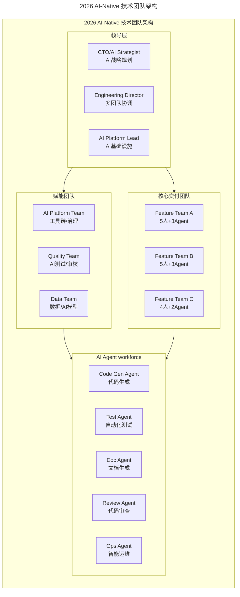
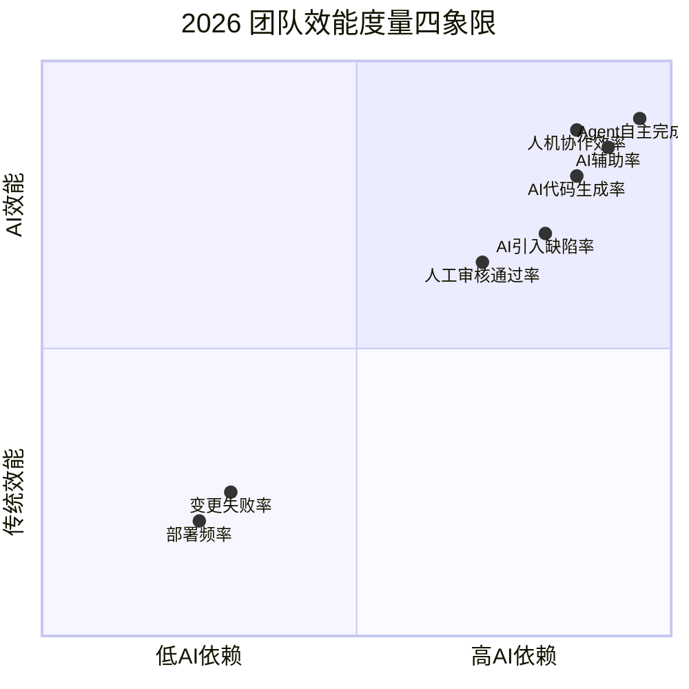
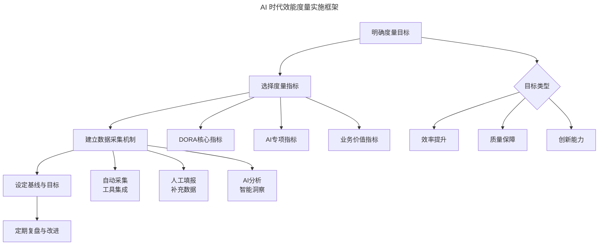
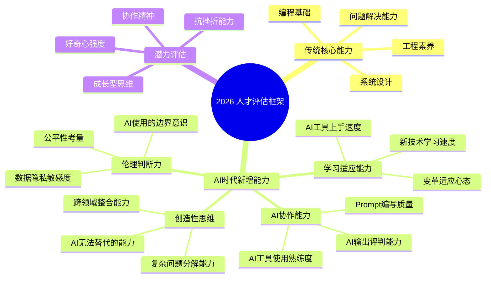

# 新春特辑3 | 如何打造高质效的技术团队？

> **适用范围**：技术团队负责人、工程经理、CTO，以及需要组建或升级技术团队的管理者
>
> **更新摘要（v2 · 2026-08 更新）**：
> - 结构化升级为 6 节骨架（导言 / 核心方法论 / 关键流程 / 工具与实战 / 常见误区 / 进阶延展）
> - 新增 AI-Native（AI 原生）团队架构设计与人机配比最优解
> - 补充 AI-DORA 效能度量指标体系，替代传统 DORA 指标
> - 增加 AI 时代人才招聘标准与培养体系升级
> - 补充 AI 焦虑（AI Anxiety）的组织应对策略
> - 所有 Mermaid 图表添加 title frontmatter 并补充文字解读

## 1. 导言

本文作为"打造高质效技术团队"主题专辑，汇集了关于团队建设、效能提升、文化塑造的深度实践。原文核心观点包括：

1. **人才是核心资产**：招聘、培养、激励三位一体
2. **流程优化提升效率**：从敏捷实践到工程化体系
3. **文化建设凝聚人心**：工程师文化、创新氛围、成长空间
4. **数据驱动管理**：用度量指标指导团队改进
5. **领导力是关键**：管理者自身的成长带动团队成长

### 原文关联文章索引

以下是本专辑收录的 15 篇文章链接（原封面图已失效移除），涵盖团队建设全流程：

- [关联文章](https://time.geekbang.org/column/article/6870)

- [关联文章](https://time.geekbang.org/column/article/6915)

- [关联文章](https://time.geekbang.org/column/article/7032)

- [关联文章](https://time.geekbang.org/column/article/7401)

- [关联文章](https://time.geekbang.org/column/article/8273)

- [关联文章](https://time.geekbang.org/column/article/8462)

- [关联文章](https://time.geekbang.org/column/article/12810)

- [关联文章](https://time.geekbang.org/column/article/14399)

- [关联文章](https://time.geekbang.org/column/article/15992)

- [关联文章](https://time.geekbang.org/column/article/40487)

- [关联文章](https://time.geekbang.org/column/article/74493)

- [关联文章](https://time.geekbang.org/column/article/78668)

- [关联文章](https://time.geekbang.org/column/article/79202)

- [关联文章](https://time.geekbang.org/column/article/6210)

- [关联文章](https://time.geekbang.org/column/article/10074)

### 2026 年技术背景

2026 年的团队建设面临**全新的挑战和机遇**：

- **84% 开发者使用 AI 编程**：团队效能的定义和度量方式需要重构
- **Agent 成为"数字员工"**：团队构成从纯人类扩展到人机混合
- **远程 + AI 协同成为常态**：地理位置不再是限制，AI 工具弥合协作鸿沟
- **技能半衰期缩短至 2 年**：传统培训体系难以跟上技术迭代速度
- **新生代工程师期望值变化**：Z 世代 / Alpha 世代更看重 AI 工具赋能和工作意义

## 2. 核心方法论

### 2.1 AI-Native 团队架构设计

AI-Native（AI 原生）团队架构是 2026 年高质效团队的基础形态。与传统纯人类团队不同，AI-Native 团队由领导层、核心交付团队、赋能团队和 AI Agent 工作力四层构成，实现人类与 AI Agent 的深度协同。



上图展示了 2026 年 AI-Native 技术团队的四层架构：领导层负责 AI 战略规划与多团队协调；核心交付团队采用"人类 + Agent"混合编组，每个 Feature Team 配备 2-3 个 AI Agent；赋能团队提供工具链、测试和数据支持；AI Agent 工作力作为底层生产力，覆盖代码生成、测试、文档、审查和运维五大场景。这种架构的关键在于**赋能团队为 AI Agent 提供治理和标准**，而非让各团队自行其是。

### 2.2 人机配比的最优解

**传统团队**：10 人全人类团队 → 产出 10 个单位的"人力工作"

**2026 年 AI-Native 团队**：6 人 + 4 个 AI Agent → 产出 18 个单位（含高价值创造性工作）

| 团队类型 | 人数 | AI Agent 数 | 月产出（相对值） | 人均产出 | 创新能力 |
|---------|------|-----------|----------------|---------|---------|
| 传统团队 | 10 | 0 | 10x | 1.0x | 中等 |
| AI 辅助团队 | 8 | 2 | 14x | 1.75x | 较高 |
| AI-Native 团队 | 6 | 4 | 18x | 3.0x | 高 |
| 全 Agent 实验 | 2 | 8 | 12x | 6.0x | 低（缺乏人类判断）|

上表揭示了人机配比的非线性关系：AI-Native 团队（6 人 + 4 Agent）在人均产出和创新能力上达到最优平衡，而全 Agent 实验虽然人均产出最高，但创新能力反而下降——因为缺乏人类判断力。**保留足够的人类进行创意、决策和质量把控**是人机配比的核心原则。

**最佳实践建议**：
- 初创公司（<50 人）：人机比 2:1 到 3:1
- 成长期公司（50-200 人）：人机比 3:1 到 4:1
- 大型企业（200+ 人）：人机比 4:1 到 5:1

### 2.3 角色重新定义

| 传统角色 | AI 时代新角色 | 职责变化 |
|---------|------------|---------|
| **初级工程师** | 🚫 岗位大幅减少 | 重复性编码工作被 Agent 替代 |
| **中级工程师** | AI-Augmented Engineer | 专注于复杂逻辑设计 + AI 协作 |
| **高级工程师** | AI Architect | 系统架构 + AI 集成架构设计 |
| **Tech Lead** | AI Team Lead | 带领人机混合团队，管理 Agent |
| **工程经理** | AI Orchestra Manager | 编排人类和 Agent 的工作流 |
| **新增角色** | AI Platform Engineer | 维护 AI 工具链、Prompt 库、Agent 配置 |
| **新增角色** | AI Quality Specialist | 审核 AI 输出质量、建立标准 |

角色重定义的核心趋势是：**初级岗位减少，中级岗位向 AI 协作转型，高级岗位向架构和编排升级**。新增的 AI Platform Engineer 和 AI Quality Specialist 是 2026 年团队不可或缺的专门角色。

## 3. 关键流程

### 3.1 从传统 DORA 到 AI-DORA 指标

**传统 DORA 指标**（DevOps Research and Assessment，DevOps 研究与评估）：
- Deployment Frequency（部署频率）
- Lead Time for Changes（变更前置时间）
- Change Failure Rate（变更失败率）
- Time to Restore Service（服务恢复时间）

**2026 年 AI 增强版 DORA 指标**引入了 AI 专项度量维度：



四象限图以 AI 依赖度和效能类型为双轴，将 8 项关键指标分布其中。右上方（高 AI 依赖 + AI 效能）集中了 AI 代码生成率、AI 辅助率、Agent 自主完成率等新指标；左下方（低 AI 依赖 + 传统效能）则是部署频率等经典指标。**管理者需要同时关注两个象限的平衡**，避免过度追求 AI 依赖而忽视传统效能基础。

**关键新指标详解**：

| 指标名称 | 定义 | 目标值 | 度量方法 |
|---------|------|--------|---------|
| **AI 辅助率** | 使用 AI 工具完成的工时占比 | >60% | 工具使用日志分析 |
| **AI 代码生成率** | AI 生成代码在代码库中的占比 | 40-70% | Git blame + AI 标记 |
| **Agent 自主完成率** | 无需人工干预的 Agent 任务比例 | >30% | Agent 执行日志 |
| **AI 引入缺陷率** | AI 生成代码导致的 Bug 占比 | <15% | Bug 根因分析 |
| **人机协作效率** | 人机协作 vs 纯人工的效率比 | >2.5x | 对比实验 |
| **Prompt 复用率** | 复用高质量 Prompt 的比例 | >50% | Prompt 库统计 |

### 3.2 效能度量的实施框架



实施框架从"明确目标 → 选择指标 → 数据采集 → 设定基线 → 定期复盘"形成闭环。目标类型分为效率提升、质量保障和创新能力三类，指标选择需覆盖 DORA 核心、AI 专项和业务价值三个维度。数据采集以自动采集为主、人工填报为辅，并通过 AI 分析生成智能洞察。

**实施建议**：
1. **不要过度度量**：选择 5-8 个核心指标即可，避免指标疲劳
2. **关注趋势而非绝对值**：环比改善比绝对数值更重要
3. **结合定性反馈**：定量指标 + 定性访谈 = 全面视角
4. **AI 辅助分析**：用 GPT-5.5 分析效能数据，自动生成改进建议

## 4. 工具与实战

### 4.1 从"工程师文化"到"AI-Augmented 文化"

**传统工程师文化的核心价值观**：
- ✅ 追求技术卓越
- ✅ 开放透明沟通
- ✅ 持续学习成长
- ✅ 数据驱动决策
- ✅ 拥抱变化创新

**2026 年需要增加的文化维度**：

| 文化维度 | 具体表现 | 推动措施 |
|---------|---------|---------|
| **AI 协作意识** | 主动寻找 AI 可优化的场景 | 设立"AI 优化提案奖" |
| **AI 质量责任** | 对 AI 输出的质量负责 | 建立"AI Code Owner"制度 |
| **持续 AI 学习** | 跟进 AI 技术的快速演进 | 每月 AI 技术分享会 |
| **人机伦理** | 正确使用 AI，避免滥用 | 制定 AI 使用道德准则 |
| **开放共享** | 分享 Prompt、Workflow、经验 | 建立内部 AI 知识库 |

### 4.2 AI 时代的人才招聘标准

**传统招聘重点**：编程语言熟练度、算法与数据结构、项目经验、沟通能力

**2026 年新增评估维度**：



思维导图展示了 2026 年人才评估的三大支柱：传统核心能力（编程、系统设计、工程素养）仍是基础；AI 时代新增能力（AI 协作、学习适应、创造性思维、伦理判断）是差异化关键；潜力评估（成长型思维、好奇心、抗挫折、协作）决定长期发展上限。

**面试问题示例**：

| 评估维度 | 面试问题 | 期望的回答要点 |
|---------|---------|--------------|
| **AI 协作能力** | "请描述一个你用 AI 辅助解决问题的具体案例" | 能清晰描述场景、方法、效果、反思 |
| **AI 批判思维** | "你觉得 AI 生成的代码有什么潜在风险？如何规避？" | 能识别幻觉、安全、性能等问题并提出对策 |
| **学习适应力** | "过去一年你学习了什么新技术？是如何学习的？" | 展示主动学习能力和有效的学习方法 |
| **创造性思维** | "如果给你一个 AI Agent 团队，你会怎么组织他们完成任务？" | 展示系统思维和创新能力 |

### 4.3 AI 时代的人才培养体系

**传统培训模式的问题**：培训内容滞后、一刀切式培训、效果难量化、学完就忘

**2026 年 AI 增强培训体系**：

| 培训环节 | 传统方式 | AI 增强方式 | 效果提升 |
|---------|---------|-----------|---------|
| **需求诊断** | 问卷调查 | AI 分析工作产出，识别技能差距 | 更精准 |
| **内容生成** | 课件开发（月级） | AI 实时生成个性化学习路径 | 更快 |
| **学习过程** | 线上 / 线下课程 | AI Tutoring + 实践项目 | 更有效 |
| **效果评估** | 考试 / 反馈 | AI 持续跟踪行为改变 | 更全面 |
| **知识沉淀** | 文档 / Wiki | AI 知识图谱 + 智能检索 | 更易用 |

**人才培养路线图**：

```
第1个月：AI基础普及（全员）
├── AI工具使用入门（Cursor/Copilot）
├── Prompt Engineering基础
└── AI伦理与安全意识

第2-3个月：岗位定制深化（分层）
├── 工程师：AI辅助开发实战
├── 架构师：AI系统集成设计
├── 测试：AI测试策略与实践
└── 运维：AIOps工具链

第4-6个月：项目实战应用（团队）
├── 选择真实业务场景试点
├── 人机协作流程建立
├── 效果度量与复盘
└── 最佳实践沉淀

持续：常态化学习机制
├── 每周AI技术分享（轮流主讲）
├── 每月AI效能复盘
├── 季度AI技能评估
└── 年度AI能力认证
```

### 4.4 可执行建议

**立即行动（本周内）**：

1. **进行团队 AI 成熟度自评**（1-5 分）：
   - 团队成员 AI 工具使用率：____分
   - AI 相关培训覆盖度：____分
   - AI 流程规范化程度：____分
   - 团队 AI 接受度：____分
   - AI 效能度量现状：____分
   - 总分 < 10：急需启动 AI 转型；10-18：有基础需系统化推进；>18：领先

2. **识别 Top 3 AI 应用场景**：与团队讨论哪些日常工作最耗时且适合 AI 化，优先选择高频、规则明确、质量标准清晰的场景

3. **任命 AI Champion**：每个团队选 1-2 名对 AI 有热情的同事，职责是推广 AI 工具、收集反馈、组织分享

**短期规划（1-3 个月）**：建立 AI 工具标准化、启动首个 AI Pilot 项目、设计新的效能仪表盘

**中期建设（3-12 个月）**：构建 AI-Native 团队形态、建设 AI 学习能力中心、塑造 AI-Augmented 文化

## 5. 常见误区

### 5.1 AI 焦虑的组织应对

⚠️ **现实问题**：团队成员对 AI 存在普遍焦虑

| 焦虑类型 | 表现 | 管理者应对策略 |
|---------|------|--------------|
| **替代恐惧**："AI 会取代我的工作" | 消极抵触、拒绝学习 AI | 明确"AI 是工具不是替代者"，展示 AI 如何放大个人价值 |
| **能力焦虑**："我学不会 AI" | 自信心下降、回避 AI 任务 | 提供分阶段培训，从小场景开始建立信心 |
| **价值质疑**："AI 做的我也能做，那我还有什么价值？" | 工作热情下降 | 强调人类独特价值：创造力、判断力、同理心、复杂决策 |
| **公平担忧**："用 AI 的人产出更高，考核不公平" | 对绩效考核不满 | 调整考核维度，不仅看产出量，更看质量和创新 |

**组织沟通话术模板**：

```
"我知道大家对AI有一些担忧，这很正常。我想分享我们的立场：

1. AI的目标不是取代任何人，而是让每个人更强
2. 我们会用AI处理重复性工作，让大家聚焦更有价值的创造
3. 公司会提供充分的AI培训和支持
4. 绩效考核会调整，不只看'写了多少代码'，更看你'解决了什么问题'
5. 你的经验、判断力和创造力是AI无法替代的

让我们一起学习如何与AI共舞，而不是被AI吓倒。"
```

### 5.2 效能度量的常见陷阱

- **过度度量**：选择太多指标导致团队疲于应付，应聚焦 5-8 个核心指标
- **绝对值崇拜**：只看绝对数值而忽略趋势变化，应关注环比改善
- **唯数据论**：忽视定性反馈，定量指标需与定性访谈结合
- **AI 指标孤立**：将 AI 指标与传统指标割裂看待，应建立综合视角

## 6. 进阶延展

### 6.1 关键数据参考（2026）

| 指标 | 行业平均 | 领先企业 | 启示 |
|-----|---------|---------|------|
| 团队 AI 工具使用率 | 67% | 95%+ | 差距明显，机会巨大 |
| AI 辅助下的人均效能提升 | 1.8x | 3.5x | 用好 AI 可以显著拉开差距 |
| AI 引入的缺陷占比 | 22% | 8% | 质量把控是关键差异化因素 |
| 员工 AI 满意度 | 58% | 85% | 文化建设和沟通很重要 |
| AI 培训投入占 IT 预算 | 3% | 8% | 培训投入有正向回报 |
| Agent 采用率 | 25% | 60% | Agent 仍处早期，先发优势明显 |

上表对比了行业平均与领先企业的差距：领先企业在 AI 工具使用率（95% vs 67%）、人均效能提升（3.5x vs 1.8x）和缺陷控制（8% vs 22%）三个维度上显著领先，说明**用好 AI 的差距比用不用 AI 的差距更大**。

### 6.2 核心启示

> **"2026 年的高质效技术团队，不是'用了 AI 的团队'，而是'将 AI 深度融入 DNA 的团队'——AI 不仅是工具，更是团队运作方式的一部分。"**

原文强调的团队建设要素在 AI 时代依然有效，但需要全面升级：

1. **人才是核心** → **"人才 + AI 能力"是双重核心**
2. **流程优化** → **"人机协作流程"是新流程**
3. **文化建设** → **"AI-Augmented 文化"是必然方向**
4. **数据驱动** → **"AI 增强的数据洞察"是新时代武器**
5. **领导力** → **"AI 时代的领导力"需要新技能**

**最后提醒**：打造 AI-Native 团队不是一蹴而就的，而是一个渐进的过程。关键是**启动行动、小步快跑、持续迭代**。不要等到"完美方案"才开始，因为 AI 技术在快速演进，最好的策略就是边做边学。

---

*本注解基于 2026 年 6 月的团队管理最佳实践生成。团队形态会随 AI 技术演进而动态调整，建议每季度回顾一次团队建设策略。*
