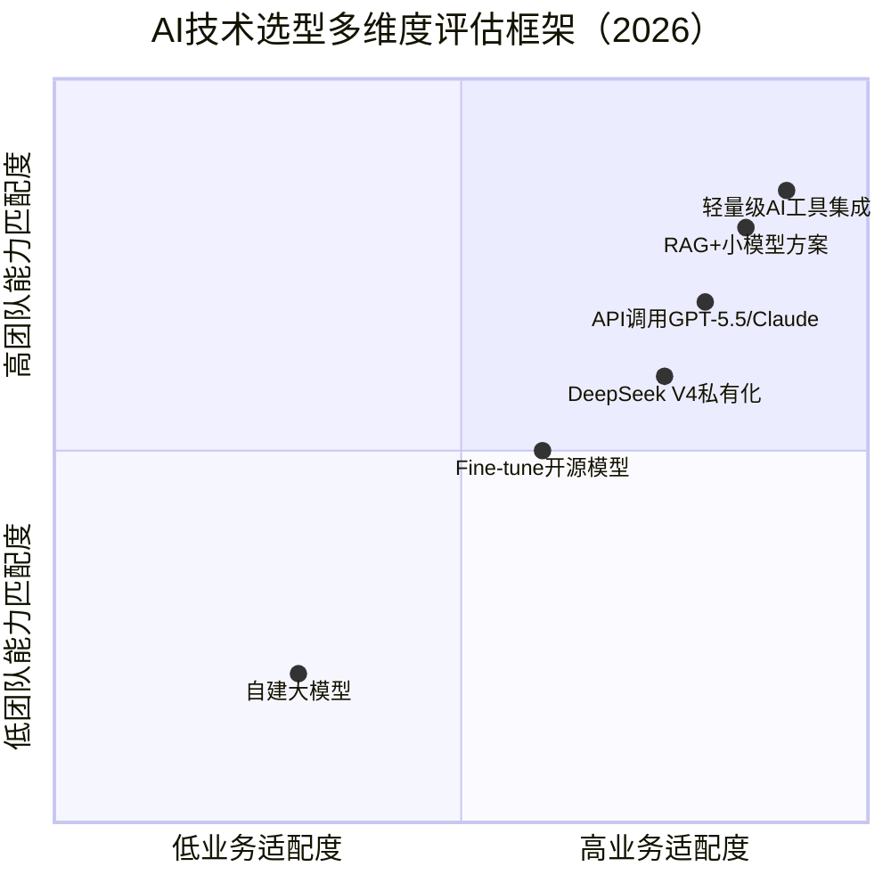
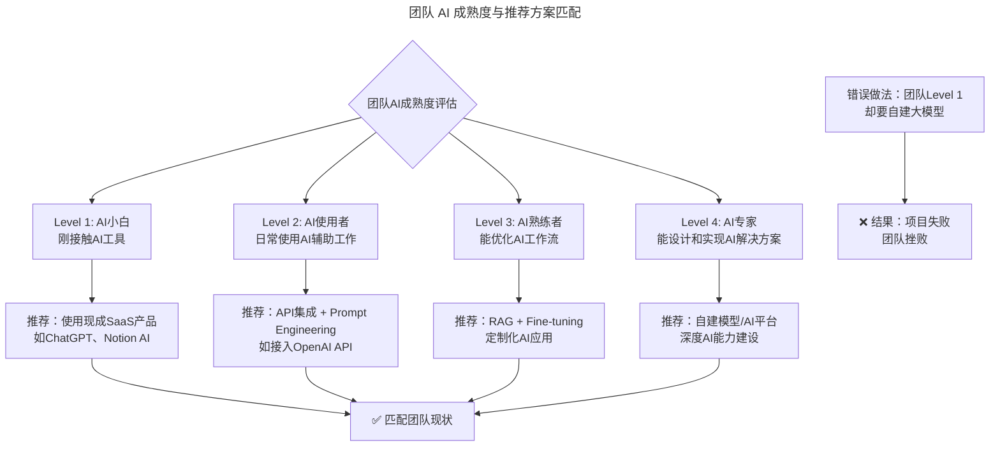
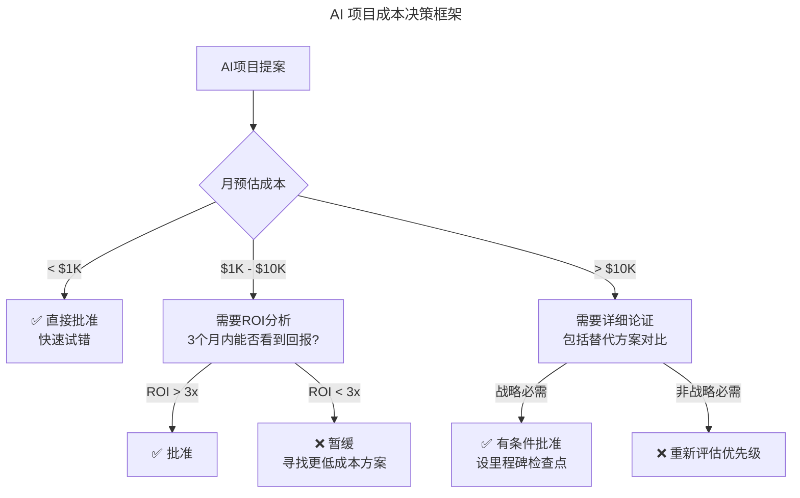

# 第11讲 | 最合适的技术才是最有价值的技术

> **适用范围**：CTO、技术负责人、架构师，以及需要做技术选型决策的技术管理者
>
> **更新摘要（v2 · 2026-08 更新）**：
> - 结构化升级为 6 节骨架（导言 / 核心方法论 / 关键流程 / 工具与实战 / 常见误区 / 进阶延展）
> - 新增 AI 技术选型多维度评估框架（业务适配度 × 团队能力匹配度）
> - 补充"合适"的四维评估框架：业务阶段、团队能力、成本结构、风险偏好
> - 整合七位技术领导者观点的 AI 时代再解读
> - 新增 AI 技术选型决策清单与红旗警告
> - 所有 Mermaid 图表添加 title frontmatter 并补充文字解读

## 1. 导言

很多技术人在最开始工作的时候，都会有一种误解：做技术主要的工作是要和计算机打交道，而不是和人打交道。只要技术足够牛，不用考虑太多其他的事情。但是随着时间的推移，大部分人的看法也有了很大的改变。

好的技术一定是从公司的状况出发，最新的、最先进的技术不一定就是最合适的技术，**最合适的技术才是最有价值的技术**。作为技术领导者，又该如何去把握呢？我们就这个问题采访了几位技术负责人。

### 2026 年背景补充

当 DeepSeek V4 让 AI 成本降低 700 倍，当 GPT-5.5、Claude、开源模型百花齐放，当 Agentic Coding（智能体编程）成为标配时，CTO 面临的不再是"用 Java 还是 Go"的选择，而是**"用什么 AI 模型、在什么场景、投入多少、风险多大"**的多维决策。2018 年这七位技术领导者的核心共识依然成立，但"合适"的定义维度需要大幅扩展。

## 2. 核心方法论

### 2.1 "合适"技术的 AI 时代定义扩展

技术选型的核心原则是**最合适的技术才是最有价值的技术**，而不是最新、最先进的技术。在 AI 时代，这一原则变得更加重要，因为选择的余地更大了，选择的难度也更高了。

四象限图以业务适配度和团队能力匹配度为双轴，对六种主流 AI 技术方案进行定位。右上方（高适配 + 高匹配）的"轻量级 AI 工具集成"和"RAG + 小模型方案"是大多数团队的优选；左下方（低适配 + 低匹配）的"自建大模型"仅适合少数资源充足的企业。**技术选型不是选最先进的，而是选最匹配自身业务和团队能力的**。

### 2.2 "合适"的四维评估框架

#### 维度一：合适的业务阶段

| 业务阶段 | AI 应用策略 | "合适"的技术选择 | 避免的陷阱 |
|---------|-----------|-----------------|-----------|
| **初创期（0-1）** | AI 加速 MVP 开发 | **API 调用为主**（GPT-5.5/Claude API）、Agentic Coding 工具 | ❌ 不要自建模型、不要过度设计 AI 架构 |
| **成长期（1-10）** | AI 提升效率 | **Fine-tune 开源模型 + RAG**、建立 AI 工作流 | ❌ 不要一次性全面 AI 化 |
| **成熟期（10+）** | AI 驱动创新 | **自建 / 深度定制模型**、AI 中台建设、数据飞轮 | ❌ 不要忽视 AI 治理和合规 |
| **转型期** | AI 重塑业务 | **大胆尝试新 AI 范式**（如 Agent、多模态） | ❌ 不要固守旧有成功经验 |

**关键洞察**：
- **2018 年的"杀鸡用牛刀"**：初创公司用微服务、K8s
- **2026 年的"杀鸡用牛刀"**：初创公司自建大模型、搞复杂的 AI 平台

#### 维度二：合适的团队能力

**核心原则：不要超过团队的 AI 学习曲线**

流程图展示了团队 AI 成熟度（Level 1-4）与推荐方案的匹配关系。每个成熟度级别对应不同的技术选择：Level 1 用现成 SaaS，Level 2 做 API 集成，Level 3 做 RAG + Fine-tuning，Level 4 才考虑自建模型。**越级选择是项目失败的主要原因之一**——团队 Level 1 却要自建大模型，结果必然是项目失败和团队挫败。

**团队能力自我评估清单**：
- [ ] 团队中有多少人能独立写出高质量的 Prompt？
- [ ] 团队是否理解 RAG vs Fine-tuning 的区别和适用场景？
- [ ] 团队是否有能力评估 AI 模型的输出质量？
- [ ] 团队是否具备基本的 AI 伦理意识？
- [ ] 团队是否有持续学习和跟进 AI 新技术的能力？

#### 维度三：合适的成本结构

| 成本类型 | 2018 年（无 AI） | 2023 年（GPT-4 时代） | 2026 年（DeepSeek V4 时代） |
|---------|---------------|-------------------|--------------------------|
| **代码生成成本** | 人工成本 $100/天 | API 调用 $20-50/天 | **API 调用 $0.5-2/天**（降低 100x） |
| **客服 AI 成本** | 人工客服 $5/次 | AI 客服 $0.5/次 | **AI 客服 $0.01-0.05/次**（降低 10-50x） |
| **文档生成成本** | 人工撰写 $200/篇 | AI 辅助 $20/篇 | **AI 自动生成 $0.5-2/篇**（降低 100x） |
| **数据分析成本** | 数据分析师 $80/小时 | AI 辅助 $15/小时 | **AI 自然语言查询 $0.5-2/小时**（降低 40-160x） |

上表揭示了 AI 成本的断崖式下降：从 2023 年到 2026 年，各项 AI 应用成本降低了 10-160 倍。**2023 年很多 AI 应用因为成本太高而"不合适"，2026 年 DeepSeek V4 等低成本模型让 90% 的场景都变得"合适"**。新的挑战不再是成本，而是如何用好 AI。

成本决策框架按月预估成本分为三档：低于 $1K 直接批准快速试错；$1K-$10K 需 ROI 分析且 3 个月内能看到回报；高于 $10K 需详细论证。**关键原则是：低成本项目快速试错，高成本项目谨慎论证，战略必需项目设里程碑检查点**。

#### 维度四：合适的风险偏好

| 行业类型 | 风险敏感度 | "合适"的 AI 策略 | 典型约束 |
|---------|-----------|--------------|---------|
| **金融 / 医疗 / 教育** | 🔴 极高 | **保守策略**：人工审核 + AI 辅助、本地化部署、严格合规 | 数据隐私、算法公平性、监管审批 |
| **电商 / 社交 / 内容** | 🟡 中等 | **平衡策略**：AI 主导 + 人工抽检、云端部署 + 数据脱敏 | 内容审核、用户体验、品牌声誉 |
| **内部工具 / 效率工具** | 🟢 较低 | **积极策略**：AI 完全自主、快速迭代、容忍一定误差 | 数据安全、员工接受度 |
| **创新实验项目** | 🟢 低 | **激进策略**：大胆尝试最新 AI 技术、快速失败快速学习 | 成本控制、时间窗口 |

## 3. 关键流程

### 3.1 七位技术领导者的选型实践

以下七位技术领导者在 2018 年分享的观点，构成了技术选型的经典实践框架。

#### 段念（花虾金融 CEO、前宜人贷 CTO）

技术本身是为业务支撑服务的，技术所有的价值最终都要通过业务结果来呈现。所有对于业务有好处的可能，我们都愿意花时间和精力去尝试。所有重复性的事情都应该被具体的程序化的方式所替代。一个好的管理者首先应该面向目标，整个组织的绩效管理、晋升体系等方面，都需要与之强烈挂钩。

#### 杨攀（融云 CTO）

微软给团队的定位就是三个角色：产品、研发和测试。但实际上这三个角色是互相交叉的，要求你每个角色都要懂其他角色的东西。优秀的人至少能达到：1、能够清楚地认识到什么东西是对的；2、在知道是对的情况下，愿意去把事情做得更好。

#### 黄鑫（极光推送 CTO 兼首席科学家）

公司大了就需要划分部门，每个管理者一定会为自己的部门争取最大的利益。能站在中立角度去评估分工合理性的只有 CTO。要做到这一点，需要：1、全面的技术能力；2、优秀的沟通能力和说服能力。

#### 伍涛（恺英网络技术支持系统副总裁）

技术人应该进一步用商业思维武装自己，努力去思考如何帮助公司获取利润、提升市值。最厉害的人是有理想的技术人，他们能把技术和商业结合。

#### 向江旭（苏宁云商 IT 总部执行副总裁）

在创业公司，技术领导者的思维方式要把公司的生死存亡放在第一位。但在构建系统时要跟 CEO 沟通清楚各方案的优缺点。技术领导者还要向 CEO 展示，技术不仅仅只是业务的支撑，技术还可以引领业务的发展。

#### 孙宇聪（Coding.net CTO）

如果一个创业公司做不到统一开发环境和研发体系，那么势必会造成研发力量的分散。完全禁止创新是不可能的，但到了一定时间一定要把长得不好的砍掉。作为 CTO，我的工作就是抵住 CEO 的压力，给程序员们留出时间做长远的事情。

#### 韩军（欧电云创始人）

CTO 一定要把握行业趋势，在某一个领域达到专家级的水准。其次要从客户角度思考，还要从业务角度思考。很多技术人员和业务人员的沟通经常是鸡同鸭讲，所以作为公司技术的一把手一定要有业务思维。

### 3.2 AI 时代再解读

#### 段念：目标导向 + AI 增强

- **"重复性事情程序化"的新内涵**：2018 版是写脚本、自动化工具；2026 版是**用 AI Agent 自动化处理**（不仅是程序化，而是智能化）
- **面向目标的 AI 落地方法**：定义业务目标 → 识别 AI 优化环节 → 设定可量化指标 → 快速试验 → 迭代优化

#### 杨攀：跨角色理解 → 跨"人 + AI"角色理解

- 新增第四个角色：AI Agent
- 产品经理需理解 AI 边界，研发需理解 AI 协同，测试需理解 AI 质量评估，所有人需理解 AI 伦理

#### 黄鑫：中立协调者 → AI 投资决策者

- 新的协调场景：业务部门要 AI 功能，技术部门担心 AI 债务，数据部门要标注资源，法务部门关注合规
- CTO 需综合评估：做不做？怎么做？投入多少？风险多大？

#### 伍涛：商业思维 → AI 商业变现思维

- AI 时代的商业机会识别：哪些环节可以用 AI 降本？哪些新业务可以通过 AI 创造？数据资产能否通过 AI 变现？

#### 向江旭：短期 vs 长期权衡 → AI 投资的节奏把控

- AI 投资的"三步走"：短期（0-6 月）引入成熟 AI SaaS/API；中期（6-18 月）核心场景深度定制；长期（18 月+）AI 平台化
- 不仅要说"技术债"，还要说**"AI 债"**（模型依赖、Prompt 维护成本、数据质量要求）

#### 孙宇聪：统一体系 + AI 标准化

- 需要统一的"AI 工程体系"：统一 AI 开发框架、Prompt 规范、Model Evaluation 标准、AI Governance 流程
- "园丁理论"AI 版：让团队尝试各种 AI 工具，但每季度"修剪"统一到 1-2 个主流方案

#### 韩军：行业深度 + AI 垂直化

- "行业专家 + AI 专家"的双螺旋上升：行业知识越深越知道 AI 在哪里创造价值，AI 能力越强越能将行业知识规模化
- 垂直领域 AI 的机会：通用模型是基础，垂直行业 Fine-tuned 模型才是壁垒

## 4. 工具与实战

### 4.1 AI 技术选型决策清单

在决定引入某项 AI 技术前，回答以下问题：

**必须满足的条件（Hard Requirements）**：
- [ ] 这个 AI 应用场景有明确的业务价值吗？（不是为 AI 而 AI）
- [ ] 我们有足够的数据来支撑这个 AI 应用吗？
- [ ] 团队有能力实施和维护这个 AI 方案吗？
- [ ] 成本在我们的预算范围内吗？
- [ ] 合规风险可控吗？

**应该考虑的因素（Nice to Have）**：
- [ ] 是否有成功的同行案例可以参考？
- [ ] 这个 AI 方案的 ROI 预期是多少？多久能看到回报？
- [ ] 如果这个 AI 项目失败了，我们的退路是什么？
- [ ] 这个选择是否会让我们过度依赖某个 AI 供应商？

### 4.2 AI 风险评估表

在启动任何 AI 项目前，先完成《AI 风险评估表》：
- **数据隐私风险评估**：涉及哪些用户数据？如何保护？
- **算法公平性评估**：是否存在歧视性输出可能？
- **合规风险评估**：是否符合行业监管要求？
- **业务连续性风险**：AI 服务中断怎么办？供应商锁定风险？
- **品牌声誉风险**：AI 出错会对品牌造成什么影响？

## 5. 常见误区

### 5.1 红旗警告（Red Flags）🚩

- 🚩 **"大家都在用 AI，我们也要用"**：缺乏清晰目标，盲目跟风
- 🚩 **"这是最新的 AI 技术，我们必须跟上"**：技术驱动而非业务驱动
- 🚩 **"AI 会解决所有问题"**：过度期望，忽视 AI 的局限性
- 🚩 **"我们先做了再说"**：缺乏规划和风险评估，仓促上马

### 5.2 常见选型陷阱

- **越级选型**：团队能力不足却选择高门槛技术方案，导致项目失败
- **成本忽视**：只看技术先进性而忽视长期运维成本和 AI 债
- **供应商锁定**：过度依赖单一 AI 供应商，丧失议价能力和迁移灵活性
- **风险低估**：特别是在金融、医疗等高风险行业，低估合规和隐私风险

## 6. 进阶延展

### 6.1 2026 年 AI 技术选型的关键趋势

- **70%** 的企业将从"自建 AI"转向"API 调用 + 轻量定制"（成本导向）
- **DeepSeek V4** 等低成本模型让**长尾 AI 应用**变得经济可行
- **Agentic Coding** 成为标配，**不再是一个差异化因素**
- **最大的分化点**：不是谁用了 AI，而是**谁把 AI 用得更好**
- **AI 治理**从"可有可无"变成"必备能力"（尤其对中大型企业）

### 6.2 核心启示

七位技术领导者在 2018 年达成的共识——**"最合适的技术才是最有价值的技术"**——在 2026 年不仅依然成立，而且变得更加重要。因为在 AI 时代，**选择的余地更大了，选择的难度也更高了**。

CTO 的价值不在于追逐最新的 AI 技术，而在于**为你的公司、你的团队、你的业务阶段，找到那个"最合适"的 AI 路径**。

记住：**没有最好的 AI 技术，只有最合适的 AI 技术。**

---

*本注解基于 2026 年 6 月的技术动态编写，旨在帮助读者以新时代视角重新审视经典内容。技术演进日新月异，建议读者结合自身场景批判性思考。*
