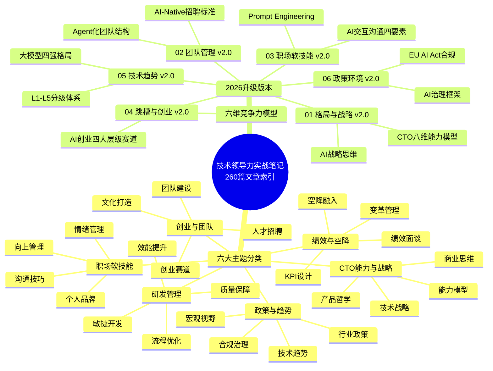
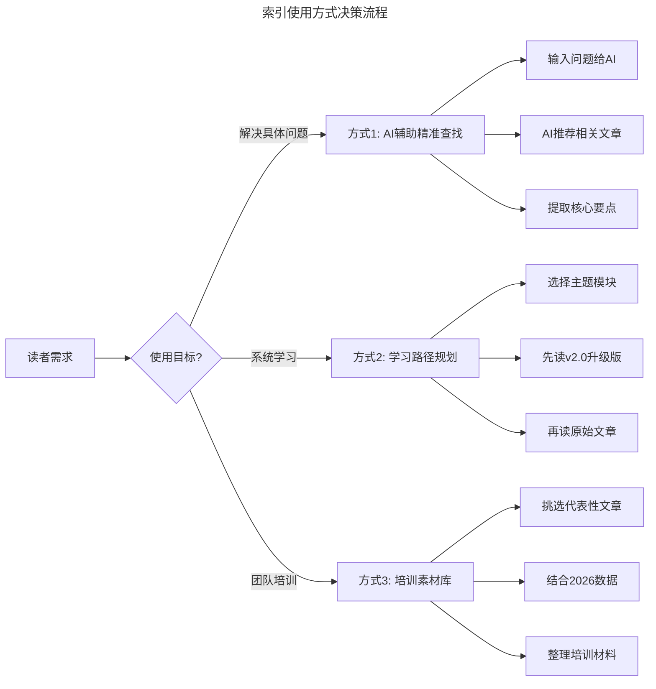
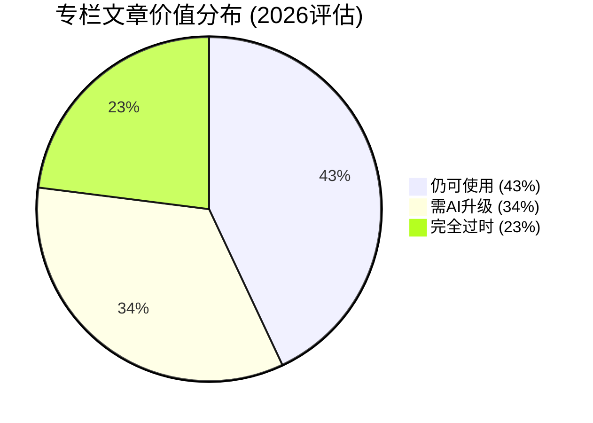

# 温故而知新 | 一键直达，六大文章主题索引

> **适用范围**：技术管理者、工程师、产品经理，以及希望系统性学习技术领导力的所有读者
>
> **更新摘要（v2 · 2026-08 更新）**：
> - 结构化升级为 6 节骨架（导言 / 核心方法论 / 关键流程 / 工具与实战 / 常见误区 / 进阶延展）
> - 新增 AI 时代知识管理方法论与智能导航系统设计
> - 补充六大主题的 AI 时代重新分类与价值评估
> - 新增 260 篇文章的 AI 时代时效性评估数据
> - 整合三种 AI 增强使用方式：精准查找、学习路径、培训素材库
> - 所有 Mermaid 图表添加 title frontmatter 并补充文字解读

## 1. 导言

很高兴与你一起走过一年的时间。

从 2018 年 4 月到 2019 年 4 月，专栏共计发布 260 篇文章，话题涵盖了格局与战略、团队管理、职场软技能、跳槽与创业、技术趋势解读等。为了便于你按照主题领域来回顾，我曾在春节期间整理了 5 个热门主题的直达专辑。在此基础上，我又对整个专栏内容进行了梳理和精选，并整理为六大类，你可以点击知识卡，跳转到你最想看的那篇文章。

[新春特辑1 \| 卓越 CTO 必备的能力与素质](https://time.geekbang.org/column/article/80646)

[新春特辑2 \| 如何成长为优秀的技术管理者？](https://time.geekbang.org/column/article/80665)

[新春特辑3 \| 如何打造高质效的技术团队？](https://time.geekbang.org/column/article/80682)

[新春特辑4 \| 如何打造高效的研发流程与文化？](https://time.geekbang.org/column/article/80710)

[新春特辑5 \| 如何做好人才的选育用留？](https://time.geekbang.org/column/article/80730)

### AI 时代的使用方式升级

本文作为索引页，其核心价值在于**帮助读者快速定位所需内容**。在 AI 时代，这一功能被赋予了全新的意义：

**传统使用方式（2018-2019）**：
```
读者手动浏览 → 查看文章标题和封面 → 判断相关性 → 点击阅读
（效率低、依赖人工判断）
```

**AI 增强使用方式（2026）**：
```
AI 语义搜索 → 智能推荐最相关文章 → 提取核心要点 → 生成个性化学习路径
（效率高、基于实际需求匹配）
```

## 2. 核心方法论

### 2.1 六大主题分类体系

专栏的 260 篇文章按六大主题分类，构成完整的技术领导力知识图谱：



思维导图以"技术领导力实战笔记"为根节点，分为两大分支：左侧是六大主题分类（CTO 能力与战略、创业与团队、研发管理、绩效与空降、政策与趋势、职场软技能），每个主题下有 4 个子领域；右侧是 2026 升级版本（01-06 号文件），每个升级版本包含其核心更新内容。**这张图是整份索引的导航地图**，建议在使用前先通览全图。

### 2.2 六大主题的 AI 时代重新分类

| 原主题 | 文章数量 | AI 时代核心价值 | 推荐升级文档 | 相关性评分 |
|-------|---------|--------------|------------|----------|
| **CTO 能力、素质与战略** | ~45 篇 | 60% 内容仍适用，需补充 AI 维度 | ✅ 01-格局与战略 v2.0 | ⭐⭐⭐⭐⭐ |
| **创业、打造团队** | ~50 篇 | 团队管理方法适用，创业案例需更新 | ✅ 02-团队管理 v2.0 / ✅ 04-跳槽与创业 v2.0 | ⭐⭐⭐⭐ |
| **研发管理、团队管理** | ~55 篇 | 需融入 Agentic Coding 等新模式 | ✅ 02-团队管理 v2.0 | ⭐⭐⭐⭐ |
| **绩效管理、空降管理** | ~20 篇 | 需补充人机协作绩效评估 | ✅ 02-团队管理 v2.0 | ⭐⭐⭐ |
| **政策、趋势解读** | ~25 篇 | 法规框架延续，技术趋势需完全重写 | ✅ 05-技术趋势 v2.0 / ✅ 06-政策环境 v2.0 | ⭐⭐⭐ |
| **职场文化、软技能** | ~35 篇 | 软技能更加重要，需新增 AI 交互沟通 | ✅ 03-职场软技能 v2.0 | ⭐⭐⭐⭐⭐ |

上表对六大主题进行了 AI 视角的重新评估。CTO 能力与战略、职场软技能两个主题的相关性最高（⭐⭐⭐⭐⭐），因为核心理念在 AI 时代依然适用；政策与趋势解读的相关性最低（⭐⭐⭐），因为技术趋势变化最快。**建议读者优先阅读相关性高的主题模块**。

## 3. 关键流程

### 3.1 文章索引全文

#### CTO 能力、素质与战略类

- [关联文章](https://time.geekbang.org/column/article/5964)

- [关联文章](https://time.geekbang.org/column/article/6259)

- [关联文章](https://time.geekbang.org/column/article/9521)

- [关联文章](https://time.geekbang.org/column/article/12413)

- [关联文章](https://time.geekbang.org/column/article/13315)

- [关联文章](https://time.geekbang.org/column/article/14477)

- [关联文章](https://time.geekbang.org/column/article/40422)

- [关联文章](https://time.geekbang.org/column/article/70286)

- [关联文章](https://time.geekbang.org/column/article/76599)

- [关联文章](https://time.geekbang.org/column/article/79685)

- [关联文章](https://time.geekbang.org/column/article/83464)

- [关联文章](https://time.geekbang.org/column/article/83994)

- [关联文章](https://time.geekbang.org/column/article/14043)

- [关联文章](https://time.geekbang.org/column/article/41287)

- [关联文章](https://time.geekbang.org/column/article/8131)

- [关联文章](https://time.geekbang.org/column/article/10492)

#### 创业、打造团队类

- [关联文章](https://time.geekbang.org/column/article/7469)

- [关联文章](https://time.geekbang.org/column/article/9412)

- [关联文章](https://time.geekbang.org/column/article/9605)

- [关联文章](https://time.geekbang.org/column/article/9756)

- [关联文章](https://time.geekbang.org/column/article/12658)

- [关联文章](https://time.geekbang.org/column/article/12974)

- [关联文章](https://time.geekbang.org/column/article/40149)

- [关联文章](https://time.geekbang.org/column/article/42365)

- [关联文章](https://time.geekbang.org/column/article/42369)

- [关联文章](https://time.geekbang.org/column/article/42544)

- [关联文章](https://time.geekbang.org/column/article/42614)

- [关联文章](https://time.geekbang.org/column/article/68269)

- [关联文章](https://time.geekbang.org/column/article/68526)

- [关联文章](https://time.geekbang.org/column/article/72660)

- [关联文章](https://time.geekbang.org/column/article/73176)

- [关联文章](https://time.geekbang.org/column/article/76759)

- [关联文章](https://time.geekbang.org/column/article/82650)

- [关联文章](https://time.geekbang.org/column/article/82656)

- [关联文章](https://time.geekbang.org/column/article/7208)

- [关联文章](https://time.geekbang.org/column/article/39741)

- [关联文章](https://time.geekbang.org/column/article/68628)

- [关联文章](https://time.geekbang.org/column/article/69659)

- [关联文章](https://time.geekbang.org/column/article/73725)

- [关联文章](https://time.geekbang.org/column/article/13063)

- [关联文章](https://time.geekbang.org/column/article/8936)

- [关联文章](https://time.geekbang.org/column/article/9701)

- [关联文章](https://time.geekbang.org/column/article/67387)

- [关联文章](https://time.geekbang.org/column/article/72838)

#### 研发管理、团队管理类

- [关联文章](https://time.geekbang.org/column/article/11680)

- [关联文章](https://time.geekbang.org/column/article/13670)

- [关联文章](https://time.geekbang.org/column/article/14327)

- [关联文章](https://time.geekbang.org/column/article/17304)

- [关联文章](https://time.geekbang.org/column/article/17858)

- [关联文章](https://time.geekbang.org/column/article/18130)

- [关联文章](https://time.geekbang.org/column/article/19175)

- [关联文章](https://time.geekbang.org/column/article/40579)

- [关联文章](https://time.geekbang.org/column/article/41127)

- [关联文章](https://time.geekbang.org/column/article/41194)

- [关联文章](https://time.geekbang.org/column/article/76387)

- [关联文章](https://time.geekbang.org/column/article/81412)

- [关联文章](https://time.geekbang.org/column/article/82093)

- [关联文章](https://time.geekbang.org/column/article/83458)

- [关联文章](https://time.geekbang.org/column/article/84425)

- [关联文章](https://time.geekbang.org/column/article/84686)

- [关联文章](https://time.geekbang.org/column/article/85674)

- [关联文章](https://time.geekbang.org/column/article/86077)

- [关联文章](https://time.geekbang.org/column/article/86791)

- [关联文章](https://time.geekbang.org/column/article/87318)

- [关联文章](https://time.geekbang.org/column/article/87736)

- [关联文章](https://time.geekbang.org/column/article/88405)

- [关联文章](https://time.geekbang.org/column/article/88532)

- [关联文章](https://time.geekbang.org/column/article/88722)

- [关联文章](https://time.geekbang.org/column/article/88702)

- [关联文章](https://time.geekbang.org/column/article/14594)

- [关联文章](https://time.geekbang.org/column/article/40228)

- [关联文章](https://time.geekbang.org/column/article/77047)

- [关联文章](https://time.geekbang.org/column/article/77890)

- [关联文章](https://time.geekbang.org/column/article/42756)

- [关联文章](https://time.geekbang.org/column/article/74970)

- [关联文章](https://time.geekbang.org/column/article/81840)

- [关联文章](https://time.geekbang.org/column/article/90064)

#### 绩效管理、空降管理类

- [关联文章](https://time.geekbang.org/column/article/9985)

- [关联文章](https://time.geekbang.org/column/article/10154)

- [关联文章](https://time.geekbang.org/column/article/10310)

- [关联文章](https://time.geekbang.org/column/article/42873)

- [关联文章](https://time.geekbang.org/column/article/64962)

- [关联文章](https://time.geekbang.org/column/article/67817)

- [关联文章](https://time.geekbang.org/column/article/68973)

- [关联文章](https://time.geekbang.org/column/article/80267)

- [关联文章](https://time.geekbang.org/column/article/83163)

- [关联文章](https://time.geekbang.org/column/article/83166)

- [关联文章](https://time.geekbang.org/column/article/83873)

#### 政策、趋势解读类

- [关联文章](https://time.geekbang.org/column/article/84455)

- [关联文章](https://time.geekbang.org/column/article/85203)

- [关联文章](https://time.geekbang.org/column/article/85391)

- [关联文章](https://time.geekbang.org/column/article/87669)

- [关联文章](https://time.geekbang.org/column/article/90534)

- [关联文章](https://time.geekbang.org/column/article/90875)

- [关联文章](https://time.geekbang.org/column/article/91179)

- [关联文章](https://time.geekbang.org/column/article/84756)

- [关联文章](https://time.geekbang.org/column/article/87011)

- [关联文章](https://time.geekbang.org/column/article/88016)

#### 职场文化、软技能类

- [关联文章](https://time.geekbang.org/column/article/8061)

- [关联文章](https://time.geekbang.org/column/article/8605)

- [关联文章](https://time.geekbang.org/column/article/8686)

- [关联文章](https://time.geekbang.org/column/article/8788)

- [关联文章](https://time.geekbang.org/column/article/11926)

- [关联文章](https://time.geekbang.org/column/article/12002)

- [关联文章](https://time.geekbang.org/column/article/13938)

- [关联文章](https://time.geekbang.org/column/article/13955)

- [关联文章](https://time.geekbang.org/column/article/14215)

- [关联文章](https://time.geekbang.org/column/article/39936)

- [关联文章](https://time.geekbang.org/column/article/41311)

- [关联文章](https://time.geekbang.org/column/article/64365)

- [关联文章](https://time.geekbang.org/column/article/72109)

- [关联文章](https://time.geekbang.org/column/article/89141)

- [关联文章](https://time.geekbang.org/column/article/89629)

- [关联文章](https://time.geekbang.org/column/article/90238)

- [关联文章](https://time.geekbang.org/column/article/6607)

- [关联文章](https://time.geekbang.org/column/article/8484)

- [关联文章](https://time.geekbang.org/column/article/89016)

- [关联文章](https://gtlc2019.geekbang.org/?utm_source=geektime&utm_medium=content)

### 3.2 使用本索引的三种方式



流程图根据使用目标将读者分为三类路径：解决具体问题走 AI 辅助精准查找（输入问题 → AI 推荐 → 提取要点），系统学习走学习路径规划（选模块 → 读 v2.0 → 读原文），团队培训走培训素材库（挑文章 → 结合数据 → 整理材料）。**三种方式不互斥，可以根据不同场景灵活切换**。

## 4. 工具与实战

### 4.1 专栏内容的 AI 时代价值评估

| 内容类别 | 总文章数 | 仍可直接使用 | 需要AI视角升级 | 完全过时需重写 |
|---------|---------|-----------|-------------|-------------|
| 管理理念与方法论 | ~80 篇 | 70%（56 篇） | 25%（20 篇） | 5%（4 篇） |
| 具体实践与案例 | ~100 篇 | 30%（30 篇） | 50%（50 篇） | 20%（20 篇） |
| 技术趋势分析 | ~40 篇 | 5%（2 篇） | 15%（6 篇） | 80%（32 篇） |
| 政策法规解读 | ~25 篇 | 40%（10 篇） | 40%（10 篇） | 20%（5 篇） |
| 软技能培养 | ~35 篇 | 65%（23 篇） | 30%（10 篇） | 5%（2 篇） |
| **合计** | **~280 篇** | **43%（121 篇）** | **34%（96 篇）** | **23%（63 篇）** |



饼图直观展示了专栏文章的时效性分布：43% 仍可直接使用（主要是管理理念和软技能），34% 需要 AI 视角升级（主要是实践案例），23% 完全过时需重写（主要是技术趋势分析）。**这意味着超过七成的内容在 AI 时代仍有价值**，但需要以新的视角重新审视。

### 4.2 可执行建议

**立即行动（本周内完成）**：

1. **用 AI 生成你的"个性化阅读清单"**：向 GPT-5.5 Pro 描述你当前的工作角色、面临的主要挑战、最想提升的能力，让 AI 从本文的 260 篇文章中为你推荐最相关的 10 篇文章 + 每篇文章的核心价值说明

2. **建立"温故知新"的定期回顾机制**：每季度选择 1 个主题模块，深度阅读该模块下的 5-8 篇文章，结合对应的 v2.0 升级注解思考观点的适用性

3. **将索引页变成"智能导航系统"**：在使用支持 Markdown 的笔记软件（如 Obsidian、Notion）中导入本文，为每篇文章添加标签，进阶结合 AI 插件实现语义搜索

**中期规划（本季度完成）**：

4. **完成"六大模块轮转学习"计划**：每季度完成至少 2 个主题模块的学习，流程为第 1 周阅读 v2.0 升级文档 → 第 2-3 周精读原始文章 → 第 4 周用 AI 辅助总结

5. **打造团队的"共享知识库"**：将本文索引 + v2.0 升级文档整理成内部知识库，为团队成员定制不同学习路径，组织月度分享会

**长期愿景（2026 年底前实现）**：

6. **构建"持续进化"的个人知识体系**：以六大模块为骨架，不断填充新知识和经验，使用 DeepSeek V4 构建可检索的个人知识管理系统

## 5. 常见误区

### 5.1 知识管理的常见陷阱

- **贪多嚼不烂**：试图一次性读完所有 260 篇文章，这不现实也没必要。应按季度分模块学习
- **只读不思**：读完文章不思考"这个观点在 2026 年还适用吗？有什么新变化？"，知识无法内化
- **忽视时效性**：不区分内容的时效性，将过时的技术趋势分析当作当前最佳实践
- **孤岛学习**：只个人学习不团队分享，无法将个人学习转化为团队共同成长
- **知识不更新**：建立知识库后不定期回顾和更新标记，导致知识库逐渐失效

### 5.2 AI 辅助学习的误区

- **过度依赖 AI 总结**：只看 AI 生成的摘要而不阅读原文，丢失关键细节和上下文
- **忽视批判性思考**：将 AI 的推荐和分析视为权威，不加质疑地接受
- **工具碎片化**：使用太多不同的 AI 工具，导致知识分散在不同平台无法整合

## 6. 进阶延展

### 6.1 推荐阅读顺序（2026 AI 时代优化版）

1. **开篇词** + **结束篇**（建立整体认知框架）
2. **01-格局与战略 v2.0**（理解 AI 时代的 CTO 能力模型）
3. **02-团队管理 v2.0**（掌握人机协作的组织进化）
4. **03-职场软技能 v2.0**（提升 AI 时代的沟通与影响力）
5. **04-跳槽与创业 v2.0**（规划 AI 浪潮下的职业发展）
6. **05-技术趋势解读 v2.0**（把握 2025-2026 技术全景）
7. **06-政策与宏观环境 v2.0**（了解 AI 时代的顺势而为）
8. **大咖问答 × 2**（学习程浩和霍泰稳的经验智慧）
9. **回到本索引**（根据需要查阅 260 篇原始文章）

### 6.2 核心启示

> "温故而知新"——这句话在 AI 时代有了全新的含义：
>
> **"温故"不仅是回顾过去的智慧，更是用 AI 的视角重新审视和激活这些知识；**
> **"知新"不仅是学习最新的技术，更是将旧知与新知融合，创造出属于你自己的方法论。**

这份索引不是终点，而是起点。**愿它能成为你技术领导力进阶路上的"北斗星"，无论何时何地，都能帮你快速找到需要的方向和答案。**

记住：**真正的学习不在于读了多少篇文章，而在于你将多少知识转化为了行动。**

---

*最后更新：2026-08 | 感谢极客时间和 125 位作者的智慧贡献。所有文章的原始链接均指向极客时间官网，部分可能需要订阅才能查看完整内容。如果某些链接失效，可以尝试使用 AI 工具根据文章标题搜索相关内容。*
