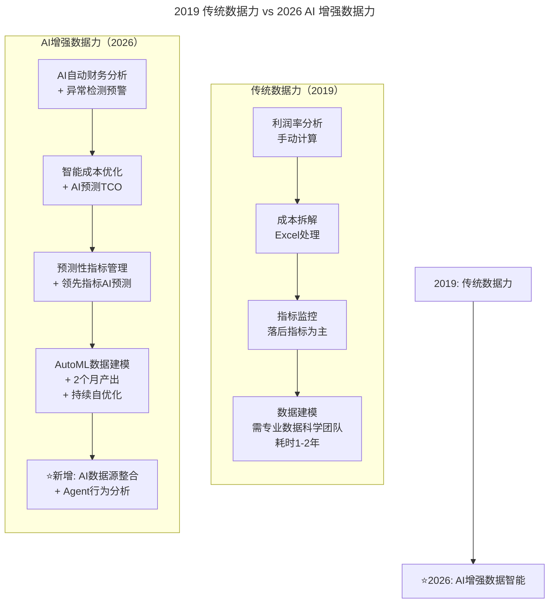
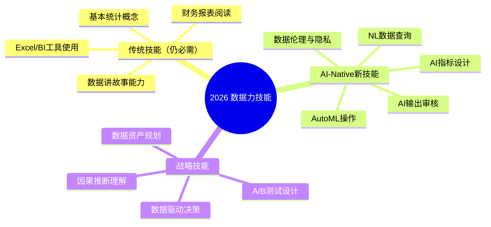

# 第82讲 | 游舒帆：数据力，透过数据掌握公司经营大小事

> **适用范围**：技术管理者、产品经理、运营负责人，以及希望用数据驱动经营决策的所有角色
>
> **更新摘要（v2 · 2026-08 更新）**：
> - 结构化升级为 6 节骨架（导言 / 核心方法论 / 关键流程 / 工具与实战 / 常见误区 / 进阶延展）
> - 新增 AI 增强数据力的四大升级模块（新数据源、分析自动化、指标 AI 革命、AI 洞察助手）
> - 补充 2026 年数据力技能图谱（传统技能 + AI-Native 新技能 + 战略技能）
> - 新增 AI 流失预测模型 2026 增强版案例
> - 整合关键数据参考与行动建议
> - 所有 Mermaid 图表添加 title frontmatter 并补充文字解读

## 1. 导言

上一篇文章中，我们谈了商业思维的概论，本篇将与大家分享商业思维中的**数据力（Data Power）**——如何透过数据来掌握公司的大小事？谈数据力时，我基本不谈资产配置或资金操作这种高度专业性的财务内容，而是聚焦于经营上的关键数据，即销售与销售创造的财务结果，藉此建立正确的数字观念。

### 2019 vs 2026 数据力演进对比

| 维度 | 2019 年数据力 | 2026 年 AI 增强数据力 |
|------|-------------|---------------------|
| **核心能力** | 读懂财务报表、建立数据观念 | **AI 自动生成洞察 + 预测性数据分析** |
| **数据来源** | 业务系统、用户行为日志 | **+ AI 工具使用数据、模型性能数据、Agent 行为数据** |
| **分析方法** | 手动统计分析、Excel 处理 | **AutoML + NLP 自然语言查询 + 智能可视化** |
| **决策支持** | 基于历史数据的回顾性分析 | **基于 AI 预测的前瞻性决策支持** |
| **团队角色** | 需要专门的数据科学家 | **每个工程师都能成为"公民数据科学家"** |

## 2. 核心方法论

### 2.1 数字观念之利润率观念

谈到数字观念，一般我们还是会谈到**利润率（Profit Margin）**，利润又可分为毛利率与净利率，而提到利润率，就必须得先谈谈收入与成本的观念。从毛利与净利的角度来看，成本可以分成两大类，即**变动成本（Variable Cost）**与**固定成本（Fixed Cost）**，变动成本指的是会随销货量多寡而变化的成本，例如运费、广告费等，固定成本则是不随销货量而变化的成本，例如办公室租金、人事费等。

毛利指的是收入扣除变动成本后获得的数值，这个数值除以收入即得毛利率，净利则是毛利扣除固定成本后获得的数值，这个数值除以收入即得净利率。

有了对利润的基本观念后，我们就要进一步探讨，如何有效的提高经营利润？这个问题的答案很简单，其实就是提高收入与降低成本。但如果我进一步追问："你知道公司收入怎么来吗？"、"透过那些产品或哪些服务？个别的占比是多少？"、"透过那些渠道获客？个别的流量与营收占比又是多少？"这三个问题，营销团队应该要能立马答得出来。

然而从产品或渠道来展开收入状况，这只是单一维度的数据，很容易取得，但若我把产品对应渠道做一个二维的展开，让我们进一步了解"什么产品在哪些渠道上卖的好"，这将有助于我们在正确的渠道上铺货。若我们在产品与渠道的维度上再加一个客户维度成为三维数据，那我们就能看出"**哪些客人通常在什么样的渠道上购买什么样的商品**"，这就是新零售中所谈论的**人货场**的典型场景。

### 2.2 数字观念之成本观念

接着谈成本，我觉得多人在收入上的观念还可以，但成本观念往往很差，我不只一次听到销售人员跟我说"这产品 2 万元，打个五折我们都还稳赚，售价不用订这么贵比较好卖"。我当下问他："你知道我们的成本多少钱吗？然后运营这个客户，服务这个客户都不用花钱吗？"，他顿时答不上来，其实这个产品的利润并不高，折扣打到 55 折以下就要亏本了。

其实，多数员工是缺乏成本观念的，所以我还是会不厌其烦的要大家搞清楚每个产品的成本结构，这样才清楚促销的最低门坎应该抓在哪。

### 2.3 找出最佳获利商业模式

"我如何知道做一单生意是否赚钱？"

会计师或财会人员会跟你说看毛利或净利，然而毛利只看变动成本，服务这位客户的人事成本并不会被计算在里头。若真的要知道做一单生意是否赚钱，成本应该是这么算的，将**客户获取成本（Customer Acquisition Cost, CAC）**加上运营与服务成本。而这一单生意到底赚不赚钱，就要看这张订单的**客单价是否超过客户获取成本**了。

在此我拿 Netflix 这家在线视频公司为例，Netflix 在美洲区，标准的会员服务一个月约收费 7.99 美元，但 Netflix 在美洲区的客户获取成本约 100 美元，这意味着客户最少要持续订阅超过 13 个月，Netflix 才能回本。而 Netflix 的流失率约 5%，意思是每个客人的平均订阅达 20 个月，换算成**客户终身价值（Customer Lifetime Value, LTV）**约为 160 美元，这是一种能稳健获利的商业模式。

### 2.4 指标管理

指针跟目标有很大的关联，指针是用来衡量目标是否被达成，若我们所做的事情无法对某个重要指标产生影响，这意味着我们不该做这件事。在指标管理上，有三个很重要的观念：

**第一，指针必然要连动到目标**，否则指针达成也不意味着目标实现了。

**第二，永远要关注领先指标（Leading Indicator）**，而非将重点放在落后指标（Lagging Indicator）上。所谓的落后指标指的是业绩、利润率，这是结果指标，是落后的，若我们要有效改善落后指标，我们就必须要掌握领先指标，以电商来说就是曝光数、浏览数、订单数以及对应的转化率，以 B2B 来说，就是名单数、拜访数与成交数以及对应的转化率。

**当周、当月的业绩是否能达到，不用等到业绩出现，只要我们盘点手上掌握的曝光数、浏览数、名单数、拜访状况大概就能推估出结果**，而且准确率可达 80% 上下。

**第三，守正而出奇，降低外部依赖性**，不能把希望全寄托在难以控制的因素上。反之，把握度高的旧客户、原生流量我们一定要拿下来，先守住应得的，不足的部分才思考如何出奇致胜，是谓先守正，后出奇。

每个业绩周期开始前，我一定会先盘点一下可能的业绩数字：

1. 该周期内会有多少旧客符合回购资格？乘以平均回购率与客单价，可以大概算出一个因回购而创造的业绩数字。
2. 有多少客户可能会帮我推荐新客户？进一步算出因推荐而创造的业绩数字。
3. 有把握的原生流量又有多少？进一步算出原生流量创造的业绩数字。
4. 有多少旧名单能运用？这可以算出持续转化旧名单所能带来的业绩数字。

上述四项做完，已经能达成当月业绩的 60%，剩下的 40% 就是我们真正要努力的地方。

### 2.5 数据模型与用户画像

过去我常用的数据模型有三个：**流失模型（Churn Model）**、**续订模型（Renewal Model）**与**推荐模型（Referral Model）**，能让我们知道什么样的客户会流失、续订与推荐。

举例来说，我将流失客户的个人属性数据与行为数据拿出来做统计分析，找出高相关性的因子，后来发现，只要客户符合下述三个条件时，流失率高达 90%：

1. 上次消费日期距今超过 6 个月
2. 近一年消费次数低于 2 次
3. 近一年消费金额低于 2,000 元

这就是流失客户模型，也是流失客户的基本画像，接着拿所有的客户名单去跑这个模型，把符合上述条件的客户清单找出来，这份清单就是潜在流失客户清单。

### 2.6 从"数据驱动"到"AI 增强的数据智能"



对比图展示了数据力从 2019 到 2026 的全面演进：利润率分析从手动计算升级为 AI 自动财务分析 + 异常检测；成本拆解从 Excel 处理升级为智能成本优化 + AI 预测 TCO（Total Cost of Ownership，总拥有成本）；指标监控从落后指标为主升级为预测性指标管理；数据建模从需专业团队耗时 1-2 年升级为 AutoML 两月产出。**2026 年最大的变化是新增了 AI 数据源整合和 Agent 行为分析**，这是全新的数据维度。

### 2.7 新数据源的崛起——AI 原生数据

**2026 年企业数据全景图**：

```
传统数据源（依然重要）：
├── 业务交易数据（订单、支付）
├── 用户行为数据（点击、浏览、停留）
├── 客户反馈数据（评价、客服记录）
└── 运营活动数据（营销效果、转化率）

⭐2026新增AI数据源：
├── AI生产力数据
│   ├── AI辅助代码占比（%）
│   ├── Prompt使用频率和质量评分
│   ├── AI工具采纳率（按团队/个人）
│   └── 人机协作效率指标
│
├── 模型性能数据
│   ├── 推理延迟、准确率、召回率
│   ├── 模型漂移检测（drift detection）
│   ├── Token消耗量和成本追踪
│   └── A/B测试结果自动化收集
│
└── Agent行为数据 ⭐2026前沿
    ├── Agent任务成功率
    ├── Agent决策路径可解释性
    ├── 多Agent协作效率
    └── Agent异常行为检测
```

> **关键洞察**：2026 年的数据力不仅要会看"业务数据"，还要能解读"AI 数据"。**一个团队的 AI 成熟度，直接反映在其数据质量和管理水平上。**

## 3. 关键流程

### 3.1 数据分析的全面自动化

**2019 年传统流程**：
```
需求提出 → 数据提取(2天) → 数据清洗(3天) → 特征工程(5天) 
→ 模型训练(7天) → 调参优化(5天) → 部署上线(3天) = 25天
```

**2026 AI 增强流程**：
```
需求提出(NL描述) → AI自动数据管道(即时) → AutoML特征选择(1天)
→ 自动模型训练+调优(2天) → AI生成解释报告(0.5天) 
→ 一键部署+监控(0.5天) = 4天

效率提升：6倍+
```

### 3.2 AI 流失预测模型的 2026 增强版

**原文案例（2019）**：
- 流失条件：上次消费 >6 个月 + 近一年消费 <2 次 + 金额 <2000 元
- 流失率：90%
- 开发周期：2 个月（需要专门的数据科学团队）

**2026 增强版**：

```
输入数据扩展：
├── 传统数据（保留）
│   ├── 消费频率、金额、时间间隔
│   └── 人口统计学特征
├── 行为数据增强
│   ├── App使用时长和频率变化趋势
│   ├── 功能使用深度（哪些功能在用）
│   └── 社交互动活跃度
└── ⭐ 新增AI交互数据
    ├── AI客服对话情感倾向
    ├── 对AI推荐的响应率
    ├── Prompt复杂度和问题类型演变
    └── 与AI Agent的任务完成率

模型升级：
├── 从规则引擎 → 深度学习 + 因果推断
├── 准确率：85% → 93%
├── 误报率：15% → 7%
├── 预测窗口：30天 → 14天（更早预警）
└── 可解释性：SHAP值自动生成

输出增强：
├── 不只是流失概率，还有：
│   ├── 流失原因归因（Top 3因素）
│   ├── 个性化挽留策略建议
│   ├── 预计挽回成本和ROI预估
│   └── 最佳触达时间和渠道推荐
└── 自动触发干预流程（可选）
```

### 3.3 指标管理的 AI 革命

| 指标类型 | 2019 年做法 | 2026 年 AI 增强 |
|---------|-----------|---------------|
| **落后指标** | 月底才能看到结果 | **AI 实时估算 + 偏差预警** |
| **领先指标** | 手动盘点推估（80% 准确率） | **AI 多因子模型预测（92% 准确率）** |
| **新兴指标** | 无 | **AI 健康度指数、创新活力指数** |

**"守正出奇"的 AI 版本**：

```
"守正"部分——AI自动化运营：
├── 旧客回购预测
│   ├── AI分析购买周期模式
│   ├── 在最佳时机自动推送个性化优惠
│   └── 回购率提升：15% → 28%
│
├── 推荐裂变优化
│   ├── NLP识别高意向推荐者
│   ├── 生成个性化邀请文案
│   └── 推荐转化率提升：8% → 18%
│
└── 原生流量最大化
    ├── SEO内容AI生成+优化
    ├── 社交媒体AI调度发布
    └── 自然流量增长：月均12%

"出奇"部分——AI驱动的增长实验：
├── 广告投放AI优化
│   ├── 实时竞价+创意动态优化
│   ├── ROI预测模型指导预算分配
│   └── 获客成本降低：35%
│
├── 增长黑客AI化
│   ├── 病毒系数自动测算和优化
│   ├── A/B测试智能分流（多变量同时测试）
│   └── 增长实验效率提升：5倍
│
└── 新渠道探索
    ├── AI监测新兴平台机会
    ├── 快速原型验证（MVP < 1周）
    └── 新渠道贡献占比：0% → 15%（6个月内）
```

### 3.4 从"数据报表"到"AI 洞察助手"

**2019 年**：写 SQL → 导出 Excel → 做图表 → 写报告 → 发邮件（耗时 2-4 小时 / 次）

**2026 年**：问 AI 一个问题 → 得到答案 + 可视化 + 建议（耗时 < 30 秒）

示例对话：

```
你："上个月哪个产品线的利润率下降最多？原因是什么？"

AI分析师（GPT-5.5 + 数据连接）：
┌─────────────────────────────────────────────┐
│ 📊 分析结果                                  │
│                                             │
│ 利润率降幅Top 3：                            │
│ 1. 企业版SaaS：-4.2%（原18.5%→14.3%）       │
│ 2. 专业版订阅：-2.8%（原25.1%→22.3%）        │
│ 3. API服务：-1.5%（原42.0%→40.5%）          │
│                                             │
│ 🔍 根因分析（企业版SaaS）：                   │
│ • 客服成本↑32%（新增AI客服培训投入）         │
│ • 服务器成本↑18%（用户量增长但未优化）        │
│ • 退款率↑2.1%（某功能Bug导致）               │
│                                             │
│ 💡 建议：                                    │
│ 1. 优先修复功能Bug（预计挽回0.8%）           │
│ 2. 评估服务器自动扩缩容方案（预计节省1.2%）  │
│ 3. AI客服培训投入ROI复盘（是否继续？）      │
└─────────────────────────────────────────────┘
```

## 4. 工具与实战

### 4.1 2026 年数据力技能图谱



技能图谱分为三大分支：传统技能（财务报表、统计概念、BI 工具、数据叙事）仍是基础；AI-Native 新技能（NL 数据查询、AutoML 操作、AI 输出审核、数据伦理、AI 指标设计）是 2026 年的差异化能力；战略技能（数据驱动决策、A/B 测试、因果推断、数据资产规划）决定天花板高度。**三者缺一不可，传统技能是根基，AI 新技能是加速器，战略技能是方向盘**。

### 4.2 给技术领导者的行动建议

**立即开始（本周）**：
1. **盘点团队当前的数据能力**：统计多少人能独立完成数据分析，识别瓶颈
2. **部署 AI 数据分析工具**：为团队配置 GPT-5.5 数据分析版，连接核心业务数据库（注意脱敏和安全）
3. **建立"每日数据简报"机制**：AI 自动生成关键指标日报，异常数据自动标注和预警

**短期推进（1-3 个月）**：
4. **重构数据模型开发流程**：引入 AutoML 平台（如 H2O、DataRobot），将"数据科学项目"标准化为"AI 应用工厂"
5. **建立 AI 数据治理规范**：定义 AI 数据质量标准，建立数据血缘追踪机制
6. **培养"公民数据科学家"**：组织 AutoML 实战工作坊

**中期深化（3-6 个月）**：
7. **构建企业级 AI 数据中台**：统一数据接入、存储、计算和服务层
8. **实现预测性运营**：流失预测、需求预测、风险预警全面上线
9. **建立数据价值量化体系**：计算每项数据资产的业务价值

**长期愿景（6-12 个月）**：
10. **打造"数据智能组织"**：数据不再是"IT 的事"，而是每个人的日常工作方式

## 5. 常见误区

### 5.1 数据观念的常见误区

- **只看结果不看过程**：只关注落后指标（业绩、利润率），忽视领先指标（曝光数、转化率），导致无法提前干预
- **成本意识缺失**：销售人员不知道产品成本结构，盲目打折导致亏损
- **单维数据陷阱**：只从单一维度（产品或渠道）看数据，缺乏交叉分析，错失人货场关联洞察
- **数据与目标脱节**：做了很多数据工作但无法对任何重要指标产生影响，本质上不该做这些事

### 5.2 AI 时代的数据陷阱

- **GIGO 定律更加严厉**：垃圾进，垃圾出（Garbage In, Garbage Out）。AI 能加速数据处理，但不能替代对业务逻辑的深刻理解。**数据质量和业务理解依然是数据力的根基**
- **过度依赖 AI 预测**：将 AI 预测视为绝对真理，忽视业务直觉和定性分析
- **忽视数据伦理**：在使用 AI 交互数据（如面部表情、语音情感）时，未获得用户授权或未考虑隐私边界
- **AI 洗数据**：用 AI 自动清洗数据但未验证清洗规则，导致关键信息被错误丢弃

## 6. 进阶延展

### 6.1 关键数据参考（2026）

| 指标 | 数据 | 来源 |
|------|------|------|
| 使用 AI 进行数据分析的专业人士比例 | **67%** | Stack Overflow Survey 2026 |
| AutoML 项目交付速度提升 | **5-10 倍** | Gartner Data & Analytics |
| AI 预测模型的平均准确率提升 | **15-25%** | McKinsey Global Institute |
| 企业采用 AI 数据治理框架的比例 | **45%** | IDC Data Governance Report |
| "公民数据科学家"占分析师比例 | **38%** | Forrester BDA Survey |

### 6.2 核心观点总结

游舒帆老师的数据力理念在 2026 年迎来了**质的飞跃**：

1. **从"看数据"到"懂预测"**：过去我们通过数据了解"发生了什么"；现在 AI 帮我们预测"将要发生什么"

2. **数据科学的民主化**：不再需要专门的博士团队，**每个工程师借助 AutoML 都能成为数据科学家**

3. **新数据源的价值被重新定义**：AI 工具使用数据、Agent 行为数据——这些 2026 年才出现的数据类型，正在成为新的竞争优势来源

4. **"让数据说话"变成"让 AI 翻译"**：自然语言交互让数据门槛降到最低，**真正实现了"数据普惠"**

5. **原文的核心洞见永不过时**："如果你不知道手上的工作能为哪个数字产生贡献，那你根本不应该做这件事"——这句话在 AI 时代更加成立

### 6.3 2026 年的数据力宣言（AI 版）

> 数据是新时代的石油，
>
> 但没有 AI 的炼油厂，石油只是一滩黑乎乎的东西。
>
> 我们追求的不是"更多的数据"，
>
> 而是**更智能的数据洞察**。
>
> 不是每个人都要成为数据科学家，
>
> 但每个人都应该能用 AI**让数据为自己说话**。
>
> 这不是技术的胜利，
>
> 这是**决策质量的革命**。

**最后提醒**：AI 能加速数据处理和洞察生成，但不能替代对业务逻辑的深刻理解。**垃圾进，垃圾出（GIGO）定律在 AI 时代更加严厉**——数据质量和业务理解依然是数据力的根基。

---

*本注解基于 2026 年 6 月的技术动态生成。数据力是 AI 时代尤为珍贵的能力——因为在信息爆炸的时代，知道"做什么"比知道"怎么做"更重要。*
