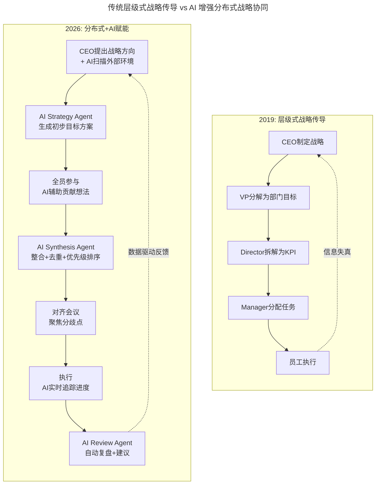
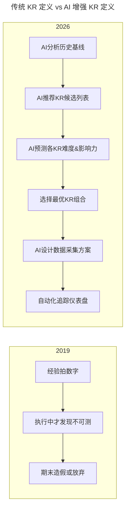

# 第84讲 | 游舒帆：策略力，让目标与行动具备高度一致性

> **适用范围**：CTO、技术总监、工程经理，以及需要将公司战略落地为团队行动的所有管理者
>
> **更新摘要（v2 · 2026-08 更新）**：
> - 结构化升级为 6 节骨架（导言 / 核心方法论 / 关键流程 / 工具与实战 / 常见误区 / 进阶延展）
> - 新增 AI-Native 策略制定流程与分布式 AI 赋能战略传导
> - 补充 SMART 目标的 AI-Native 实践（每个维度的 AI 增强方案）
> - 新增关键结果（KR）的 AI 智能定义方法与学习平台 AI-KR 设计案例
> - 整合 2026 年策略落地 AI 工具栈与新评价维度
> - 所有 Mermaid 图表添加 title frontmatter 并补充文字解读

## 1. 导言

前几篇文章我们谈了数据力与运营力，让我们对公司与客户的状况有了进一步的剖析，本文将与大家探讨商业思维中的**策略力（Strategic Power）**。

策略力的原始目的是希望让所有人都清楚公司的目标，以及为了实现这些目标，我们订下了什么样的策略，紧接着，策略又是如何落地为一个又一个日常的项目与营运工作的。

以传统的组织分工来说，研发团队通常位于后勤角色，多数都是以支持各业务部门的战略为主，然而战略经过层层传达后，实际执行项目的一线员工们往往无法获知自己每天的开发工作，究竟是为何而做，更不明白项目完成后，究竟会对哪个 KPI 或目标有具体帮助。

有些人认为一线员工，尤其是研发同仁，并不需要了解公司战略与目标，只要专注的处理手上的项目就好。但我认为所有员工都必须要对战略与目标有清晰的理解，原因有四：

- **第一，让员工明白为何而战**，唯有知道自己这么努力是为什么，员工才会倾注百分之百的热情。
- **第二，避免战略与现实脱钩**，上层拍脑袋想出来的战略，很多时候并没有参酌一线员工的建议，不让听得见炮火的士兵参与战略的讨论与沟通，是许多企业最终战略失准的重要原因。
- **第三，培养员工的战略意识**，具有战略意识的员工，在做每一件事情时都会仔细评估与思考，确保能对公司战略与目标产生真正帮助。
- **第四，让员工的绩效明确化**，当员工所做的每件事都能连结到重要的 KPI 与目标时，员工的每分每秒就都能投入在有价值的事情上。

### 2019 vs 2026 策略力演进对比

| 维度 | 2019 年策略力 | 2026 年 AI 增强策略力 |
|------|-------------|---------------------|
| **核心能力** | OKR / 策略地图连接目标与行动 | **AI 辅助战略制定 + 智能 OKR 管理 + 竞争情报自动化** |
| **战略来源** | 高管闭门规划 + 少量自下而上 | **AI 市场分析 + 全员贡献 + 数据验证** |
| **目标设定** | SMART 原则人工评估 | **AI 可行性预测 + 资源优化建议** |
| **执行跟踪** | 定期复盘会议 | **实时进度追踪 + 风险预警 + 自动调整建议** |
| **信息对称** | 靠沟通和文档传递 | **AI 知识图谱确保信息透通** |

## 2. 核心方法论

### 2.1 策略力五步法

在培养员工战略思维能力时，我的做法并不是单纯的告知他们公司的战略目标是什么，而是进一步引导他们去思考战略的成因。一般来说，我会以五个步骤来引导大家将战略推导出来。

1. **检视现况，并标定机会**
2. **设定目标**
3. **定义关键结果**
4. **设定行动方案**
5. **复盘**

### 2.2 AI-Native 策略制定流程

原文强调"战略的制定与执行是全体员工共同的责任"。在 2026 年，AI 让这个理念变得**真正可操作**：



对比图清晰展示了战略传导模式的根本变化：传统流程是自上而下的层级传导（CEO → VP → Director → Manager → 员工），信息在层层传递中失真；AI 增强流程引入了 Strategy Agent、Synthesis Agent、Review Agent 三个 AI 角色，实现分布式协同——CEO 提出方向后由 AI 生成方案，全员参与贡献想法，AI 整合排序，聚焦分歧点讨论，执行中 AI 实时追踪，最后 AI 自动复盘并数据驱动反馈给 CEO。**这种闭环让"全员参与战略"从口号变成了可操作的流程**。

### 2.3 SMART 目标的 AI-Native 实践

原文提到 SMART 原则（Specific、Measurable、Attainable、Relevant、Time-bound）。在 2026 年，每个维度都可以用 AI 增强：

#### S - Specific（具体明确）

**传统痛点**：目标模糊，不同人理解不一致

**AI 解决方案**：
```
❌ 模糊目标："提升用户体验"
✅ AI优化后："将移动端首页加载时间从3.5秒降到2秒以内，
           并将用户完成核心任务的步骤数从7步减少到5步"
           
AI工具：自然语言处理（NLP）分析目标描述的清晰度评分
```

#### M - Measurable（可衡量）

**传统痛点**：指标选择不当，无法反映真实进展

**AI 解决方案**：
- **领先指标 vs 滞后指标**：AI 帮助识别哪些是可提前干预的领先指标
- **基准线建立**：AI 自动分析历史数据，建立合理的基准线和目标值
- **多维度度量**：AI 建议从用户行为、业务结果、技术指标三个维度衡量

#### A - Attainable（可达成的）

**传统痛点**：目标过高导致挫败，过低失去激励

**AI 解决方案**：
```python
# AI Attainability Checker 伪代码
def check_attainability(goal, historical_data, team_capacity, market_conditions):
    ai_prediction = ml_model.predict(
        features=[goal_difficulty, 
                  resource_availability, 
                  seasonality_factor,
                  similar_cases_outcomes]
    )
    
    confidence = ai_prediction.confidence
    risk_factors = ai_prediction.risk_factors
    
    if confidence < 0.6:
        return "⚠️ 目标达成概率较低，建议调整或增加资源"
    elif confidence > 0.9:
        return "✅ 目标具有挑战性但可行"
    else:
        return "🔄 建议设置里程碑，分阶段验证"
```

#### R - Relevant（具相关性）

**传统痛点**：团队目标与公司战略脱节

**AI 解决方案**：
- **Goal Alignment Score**：AI 计算每个部门 / 个人的目标与公司战略的相关性得分
- **Impact Simulation**：AI 模拟如果该目标达成，对公司整体 KPI 的影响程度
- **Dependency Mapping**：AI 识别目标之间的依赖关系，避免孤岛效应

#### T - Time-bound（具时效性）

**传统痛点**：时间估计不准确，要么太松要么太紧

**AI 解决方案**：
- **Historical Velocity Analysis**：AI 分析团队历史交付速度，给出更准确的时间预估
- **Critical Path Identification**：AI 自动找出关键路径，提示风险点
- **Buffer Recommendation**：AI 根据任务不确定性，建议合理的时间缓冲

## 3. 关键流程

### 3.1 第一个步骤：检视现况，并标定机会

检视现况时我会先抛几个问题让大家有切入点，这些问题分别是：

- 有哪些新的趋势议题与我们所属产业相关？我们是否能乘上风口？
- 我们产业的关键价值活动是什么？是否能延伸在产业链的位置？
- 我们的经营关键点与商业模式是什么？能看到什么突破口？
- 平常我们仰赖哪些数据在做管理？哪些数据有改善或精进的空间？

之所以要让大家思考这几个问题，而非直接从过去的经营内容中找出可改善的点并持续去调整的原因，是为了避免大家只着眼于短期，却忽略了长期的可能性。

这几个问题思考完后，接着要标定出"可能的机会"，我们要在众多机会中指出"属于我们的"机会，也就是必须要在评估自身资源与可行性后，挑出那些确切可行的项目。

企业的战略，其实人人都该关注，也该从你专业的角度提出你的看法与观点。若战略制定时，自上而下与自下而上能同时进行，双管齐下，走偏与白费工的机率就会大幅降低。因此，我认为"**战略的制定与执行是全体员工共同的责任**"。

### 3.2 第二个步骤：设定目标

我们必须在第一个步骤中标定出的这些可能的机会中，找到最应该实践的几件事，设定目标。一个清晰的目标具有很高的引领效果，模糊的目标则会导致大家各自解读。那什么样的目标才算清晰呢？我认为必须要符合 **SMART 原则**：

- **S 是 Specific**，具体明确的，要完成的项目包含哪些事？不包含哪些事？
- **M 是 Measurable**，可衡量的，必须要有可量化的结果来确认事情已完成，否则很难去分辨「做好」与「做完」。
- **A 是 Attainable**，可达成的，这个目标不应该是遥不可及的。
- **R 是 Relevant**，具相关性的，承担这个目标的部门或人，他的工作项目必须要能高度关联于这个目标。
- **T 是 Time-bound**，具时效性的，三个月达成 100% 用户增长跟一年达成 100% 增长，做法肯定会有很大的差异。

### 3.3 第三个步骤：定义关键结果

当我们设定好目标，接着要怎么去衡量目标是否达成呢？我们必须要能看到几个关键的产出物或结果，也就是所谓的**关键结果（Key Results, KR）**，往下我依循谷歌等知名国际公司运用的目标管理工具 **OKR（Objective and Key Results，目标与关键结果）**来跟大家说明。

举上述学习平台运用人工智能以提升学习体验这个目标为例，我们若要有效衡量这个目标是否已经完成，我们可能会想看到以下三个关键结果：

- 第一，人工智能技术应用于的课件编辑，有效降低课件出错率自 8% 到 4%；
- 第二，人工智能技术应用于学生学习过程，提高学习满意度从 8.9 分到 9.2 分；
- 第三，人工智能技术应用于课程的精准推荐，提高学生的周订课数从 2.2 堂到 3 堂。

定义好关键结果，团队的努力方向就更明确了。谈到这我也必须要再次强调一个观念，那就是"**别将手段当目的**"、"**技术也不是唯一解**"，如果你在执行过程发现，不使用人工智能技术也能有效达成上述三个关键结果，而且做法更好更容易，那你就可以考虑放弃人工智能。

再往上推一层，我们的根本目标是提升学习体验，若执行过程发现这三个关键结果与学习体验的关联性并非最强，那你就该调整这个目标的关键结果，不要被定义好的东西给绑死了。而这也是 OKR 跟传统 KPI 间一个比较显着的差异，OKR 接受来自执行层的反馈，随时可以依照现况去调整关键结果。

### 3.4 关键结果（KR）的 AI 智能定义



对比图展示了 KR 定义流程的根本变化：传统流程是"经验拍数字 → 执行中才发现不可测 → 期末造假或放弃"的恶性循环；AI 增强流程是"AI 分析历史基线 → 推荐 KR 候选 → 预测难度和影响力 → 选择最优组合 → 设计数据采集 → 自动化追踪"的科学闭环。**关键区别在于 AI 让 KR 定义从"拍脑袋"变成了"数据驱动"**。

**实际案例：学习平台的 AI-KR 设计**

```
Objective: 运用AI提升学习体验，实现规模化个性化教学

KR1: AI课件质量门禁通过率从75%提升到95%
   ├── 度量方式：AI自动检测课件中的知识错误、逻辑漏洞
   ├── 数据来源：AI QA系统日志
   ├── 预测置信度：85%（基于类似项目历史）
   └── 里程碑：Q1达到85%，Q2达到90%，Q3达到95%

KR2: 学生参与度评分（AI面部表情+语音情感分析）从6.8提升到8.0
   ├── 度量方式：AI实时分析课堂录像（已获学生授权）
   ├── 数据来源：AI Engagement Tracker
   ├── 预测置信度：72%（需试点验证假设）
   └── 风险缓解：同时准备传统的问卷调查作为Fallback

KR3: 个性化推荐带来的完课率提升15%（绝对值）
   ├── 度量方式：A/B测试（对照组vs实验组）
   ├── 数据来源：学习管理系统LMS
   ├── 预测置信度：78%（基于行业基准）
   └── 经济价值：完课率提升10% ≈ 月增收¥50万
```

### 3.5 第四个步骤：设定行动方案

有了具体的关键结果，那我们要做哪些事来达成这些关键结果呢？此时就落入到项目层级了，你必须为每个关键结果设定 1-2 个行动方案。

举例来说，提高学习满意度从 8.9 分到 9.2 分，在讨论过程我们认为影响学习满意度因素的有老师、课件、学生参与度、师生互动、网络通讯质量等，而我们认为学生参与度与师生互动影响最大，因此我们制订了以下两个行动方案。

第一个行动方案，采集学生上课期间的面部表情、对话与课后评价数据，并运用人工智能技术判断学生在课堂中的反应与参与度，如果学生表情显示有疑问，或者课堂的参与度不好，总是分心，那可直接提醒老师要多关怀该位学生。

第二个行动方案，调整学生课后的评价功能，从只能评分的选单式改成选单加标签式，让学生在评分之余，还可以透过标签来反馈感受好与不好的部分，这能让我们尽可能掌握学生真实的感受。

### 3.6 第五个步骤：复盘

行动方案开始执行后，我们必须定期检视执行进度与成效，根据现况不断修正行动方案、关键结果，有必要时甚至连目标都要修正。

**策略力五步法的 AI 增强对比**：

| 步骤 | 传统做法 (2019) | AI 增强做法 (2026) | 效率提升 |
|------|----------------|-------------------|---------|
| **1. 检视现况** | 人工调研 + Excel 分析 | AI 扫描内外部数据 + 自动生成洞察报告 | 10x |
| **2. 设定目标** | 头脑风暴 + PPT 撰写 | AI 辅助目标生成 + SMART 化检查 + 对齐历史数据 | 5x |
| **3. 定义 KR** | 经验估算 + 拍数字 | AI 基于行业基准推荐 KR + 预测达成率 | 8x |
| **4. 行动方案** | 项目经理手工拆解 WBS | AI 自动生成任务树 + 资源分配 + 依赖关系 | 6x |
| **5. 复盘** | 月度会议 + 手工报表 | AI 实时 Dashboard + 异常预警 + 归因分析 | 20x |

## 4. 工具与实战

### 4.1 2026 年策略落地的 AI 工具栈

| 工具类别 | 推荐工具 | 用途 | 成熟度 |
|---------|---------|------|--------|
| **战略规划** | Miro AI, Notion AI, Craft.ai | 头脑风暴、战略画布自动生成 | ⭐⭐⭐⭐ |
| **目标管理** | Leapsome, Workboard, Lattice | OKR 设定、对齐检查、进度追踪 | ⭐⭐⭐⭐⭐ |
| **数据分析** | Julius AI, Hex, Noteable | 业务数据探索、洞察发现 | ⭐⭐⭐⭐⭐ |
| **项目管理** | Linear AI, Asana Intelligence | 任务分解、进度预测、资源优化 | ⭐⭐⭐⭐ |
| **文档协作** | Claude 4.5, GPT-5.5 | 战略文档生成、会议纪要、报告撰写 | ⭐⭐⭐⭐⭐ |
| **演示汇报** | Gamma, Beautiful.ai, Tome | 自动生成 PPT、数据可视化 | ⭐⭐⭐⭐ |
| **知识管理** | Mem, Notion AI, Heptabase | 组织知识库、战略上下文检索 | ⭐⭐⭐⭐ |

### 4.2 可执行建议

**部署 Strategy Agent**：在战略制定阶段，用 AI 扫描行业报告、竞争对手动态、内部数据，生成初步的机会清单

**建立全员建议平台**：用 AI 工具（如 Notion AI、Slack AI）收集一线员工的战略建议，AI 自动分类、提炼主题

**AI 辅助 OKR 对齐**：使用 AI 工具（如 Leapsome、Workboard）检查各部门 OKR 是否与公司战略一致，识别冲突点

### 4.3 对原文核心观点的 2026 年再解读

#### 观点 1："别将手段当目的"、"技术也不是唯一解"

**2026 现实**：
- ✅ **更加重要！** 在 AI hype cycle 的顶峰，太多人把"用 AI"本身当成目的
- 🆕 **新挑战**：AI washing 现象严重——为了用 AI 而用 AI，忽略了更简单的解决方案

**实际案例**：
> 某公司想用大模型做客服智能问答。
> 
> ❌ **AI-first 思路**：投入 200 万训练专属模型，耗时 6 个月
> ✅ **问题导向思路**：先分析 80% 的客户问题，发现 60% 是 FAQ 类 → 先用规则引擎（2 周，成本 5 万）→ 再用轻量级 AI 处理剩余 20%（1 个月，成本 20 万）→ **总成本 25 万，效果相当**

#### 观点 2："听得见炮火的士兵参与战略讨论"

**2026 现实**：
- ✅ **技术上完全可行**：AI 工具让一线员工的声音可以被高效收集和分析
- 🆕 **新能力**：
  - **Voice of Employee (VoE) Platform**：AI 自动聚合员工反馈，提取共性主题
  - **Idea Management System**：员工提交想法，AI 评估可行性 + 业务影响，排序展示给管理层
  - **Reverse Mentoring**：junior 员工通过 AI 工具向高层展示数据驱动的洞察

#### 观点 3："OKR 接受来自执行层的反馈，随时调整"

**2026 现实**：
- ✅ **AI 让这变得更容易**：实时数据采集 + 自动化分析 + 即时调整建议
- 🆕 **新实践**：
  - **Dynamic OKR**：不是季度固定，而是根据市场变化动态调整
  - **Predictive Alert**：AI 提前 2-3 周预警某个 KR 可能无法达成，建议调整方案
  - **What-if Simulator**：AI 模拟"如果我们调整这个 KR，对整体目标的影响是什么？"

## 5. 常见误区

### 5.1 AI 时代的策略陷阱

#### 陷阱 1：AI 生成的"伪战略"

> ❌ **现象**：让 GPT-5.5 生成一份"完美"的战略文档，看起来很专业但没有灵魂
> 
> ✅ **对策**：
> - AI 是**思考伙伴**，不是**决策者**
> - AI 生成的战略必须经过**人的审视**：这与我们的价值观一致吗？这符合我们对市场的直觉判断吗？
> - 保持"人的味道"：最好的战略是有鲜明观点的，而不是四平八稳的正确废话

#### 陷阱 2：过度量化导致的短视

> ❌ **现象**：因为 AI 可以衡量一切，所以只关注可衡量的短期指标，忽略长期的品牌、文化、创新
> 
> ✅ **对策**：
> - 平衡**量化指标**和**质化洞察**
> - 定期进行"战略性对话"（非数据驱动的深度思考）
> - 为长期投资（如技术研发、人才培养）设置保护机制

#### 陷阱 3：算法偏见固化

> ❌ **现象**：AI 系统可能放大现有的偏见（如某些群体的需求被忽视）
> 
> ✅ **对策**：
> - 定期审计 AI 推荐的 KR 和目标，检查是否有系统性偏差
> - 确保多元化的声音被听到（不仅是数据多的群体）
> - 建立"红队"机制：专门挑战主流假设

### 5.2 传统策略力误区

- **战略与执行脱节**：高管制定战略后不与一线员工沟通，导致执行走偏
- **把手段当目的**：为了用某项技术而用，忽视了真正的业务目标
- **KPI 僵化**：不像 OKR 那样接受执行层反馈，关键结果一旦设定就不可调整
- **只关注落后指标**：等到业绩出来才发现问题，无法提前干预

## 6. 进阶延展

### 6.1 2026 年策略力的新评价维度

除了原文提到的目标清晰度、执行力，建议增加以下 AI 时代的新维度：

| 维度 | 定义 | 自评问题 |
|------|------|---------|
| **Data-Literacy** | 团队的数据素养水平 | 我的团队能否独立读取数据并得出结论？ |
| **AI-Fluency** | 团队使用 AI 工具的能力 | 我的团队是否知道哪些任务可以用 AI 加速？ |
| **Feedback Velocity** | 从执行层到决策层的反馈速度 | 一线的问题需要多久才能传到我这里？ |
| **Alignment Visibility** | 目标对齐的可视化程度 | 我能否随时看到每个项目的战略贡献度？ |
| **Adaptability Quotient** | 面对变化的调整速度 | 当市场变化时，我们需要多久能调整方向？ |

### 6.2 核心启示

游舒帆老师提出的**策略力五步法**是一个**经得起时间考验的经典框架**。站在 2026 年回看，它的核心思想——**让每个人都理解并参与战略、确保目标与行动的一致性**——比以往任何时候都更重要。

AI 的作用不是替代这个框架，而是**让每一步都变得更高效、更数据驱动、更可操作**：

1. **检视现况** → AI 帮你看到更全面的数据和趋势
2. **设定目标** → AI 帮你把模糊的想法变成清晰的 SMART 目标
3. **定义 KR** → AI 帮你找到最关键的度量指标和合理的数值
4. **行动方案** → AI 帮你快速拆解任务和分配资源
5. **复盘** → AI 帮你自动收集数据和多维度归因

> 2026 年的策略力，不再是少数"战略家"的专利，而是**每个团队成员都应该具备的基础能力**——因为 AI 降低了专业分析的门槛，让每个人都能贡献战略级的洞察。**真正的竞争力不在于谁有更好的 AI 工具，而在于谁能更好地把 AI 产生的洞察转化为一致的行动。**

---

*本注解基于 2026 年 6 月的最新技术动态生成，包括 GPT-5.5、DeepSeek V4 的普及，以及 84% 开发者使用 AI 编程的行业现状。策略力是 AI 时代尤为珍贵的能力——因为在信息爆炸的时代，知道"做什么"比知道"怎么做"更重要。*
