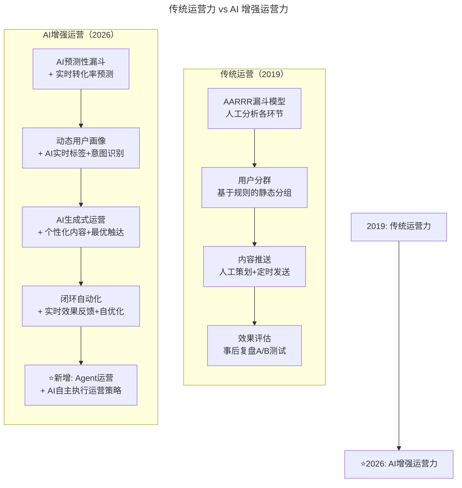
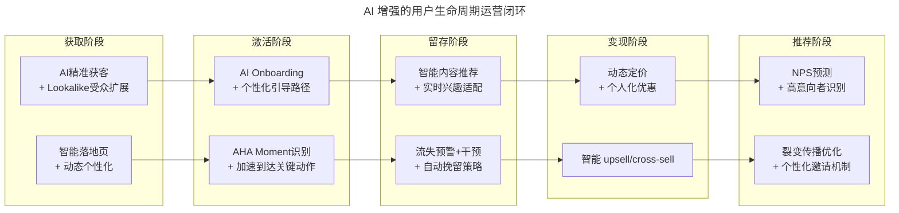
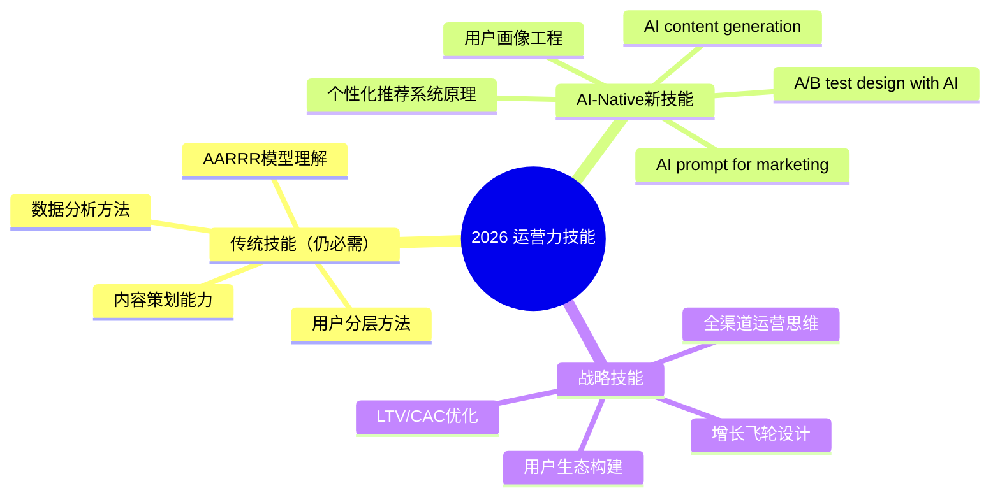

# 第83讲 | 游舒帆：运营力，让用户出现你期待的行为

> **适用范围**：技术管理者、产品经理、运营负责人，以及希望用数据驱动用户行为的所有角色
>
> **更新摘要（v2 · 2026-08 更新）**：
> - 结构化升级为 6 节骨架（导言 / 核心方法论 / 关键流程 / 工具与实战 / 常见误区 / 进阶延展）
> - 新增 AI 原生运营（AI-Native Operations）理念与超个性化实现层级
> - 补充 AI 增强 A/B 测试加速革命与多变量 AI 测试（MVT-AI）
> - 新增用户全生命周期 AI 运营闭环与 AI-CDP 全渠道数据整合
> - 整合 2026 年运营力技能图谱与行动建议
> - 所有 Mermaid 图表添加 title frontmatter 并补充文字解读

## 1. 导言

这是本系列第三篇文章，今天要来跟大家聊聊**运营力（Operational Power）**。关于运营，我想大家都不陌生，不论你听过的是互联网运营的拉新、留存、促活，或是增长黑客所谈的 **AARRR（Acquisition, Activation, Retention, Revenue, Referral）**，抑或是营销 4.0 所谈论的 5A 都不打紧，我今天想跟大家聊的是"为何所有人都该理解运营，以及研发人员掌握运营知识后，又有什么显著效益"。

### 2019 vs 2026 运营力演进对比

| 维度 | 2019 年运营力 | 2026 年 AI 增强运营力 |
|------|-------------|---------------------|
| **核心能力** | AARRR 模型、用户分层 | **AI 个性化 + 预测性运营 + 全生命周期智能管理** |
| **精准运营** | 基于规则的用户分群 | **AI 动态用户画像 + 实时个性化** |
| **运营手段** | 人工策划活动、手动推送 | **AI 自动生成内容 + 智能触达时机优化** |
| **数据断链** | 线上线下数据割裂 | **AI 统一数据视图 + 全渠道归因** |
| **用户体验** | 标准化服务模式 | **超个性化（Hyper-personalization）体验** |

## 2. 核心方法论

### 2.1 运营的本质

若要用一句话谈运营，我是这么说的"运用在线或线下手法，让用户产生你期待的那些行为"，诸如点击、购买、使用、播放等。成功的运营会增强用户的黏性，也会间接提升公司经营绩效。

**运营是围绕着用户而生**，不论是产品、内容、活动、渠道等运营工作，本质上都是为了服务用户：

- **产品运营**：让用户更多的去使用某些产品功能
- **内容运营**：提供用户更多有用、有趣的内容，让用户心有所感，甚至愿意分享
- **活动运营**：跟用户做更多的在线、线下互动，提高彼此的熟悉度与信任感
- **渠道运营**：保障跟用户接触的每个环节都能提供良好的用户体验

### 2.2 精准运营与守正出奇

流量红利消失的年代，企业不该再把过多的重点放在增量市场，而该更多的关注存量市场，观念上也该从经营流量，转往经营流量池。企业必须先**守正**（做好相对可控的存量与流量池），而后**出奇**（考验创意）。

要做好流量池管理，关键是给用户提供更棒的服务体验。标准化的服务模式已经愈来愈难取悦客户了，要让用户开心、买单，就非得提供差异化甚至个性化服务不可。**精准运营（Precision Operations）**，这个观念与精准营销是一致的，精准的背后仰赖的是对数据的分析与洞察。

以用户喜欢的方式，在正确的时间点，提供用户感兴趣的信息，这就是精准运营的关键所在。

### 2.3 从"精准运营"到"AI 原生运营"



对比图展示了运营力从 2019 到 2026 的全面演进：AARRR 漏斗从人工分析升级为 AI 预测性漏斗；用户分群从静态规则分组升级为动态画像 + 意图识别；内容推送从人工策划升级为 AI 生成式运营；效果评估从事后复盘升级为闭环自动化。**2026 年最大的新增是 Agent 运营——AI 可以自主执行运营策略**，实现了从"工具辅助"到"智能伙伴"的跨越。

### 2.4 超个性化的实现层级

| 个性化层级 | 2019 年做法 | 2026 年 AI 做法 | 示例 |
|-----------|-----------|---------------|------|
| **无个性化** | 所有人看到相同内容 | 已淘汰 | 统一推送 |
| **分段个性化** | 按用户群组区分 | 基础 AI 分组 | 新老用户不同文案 |
| **行为个性化** | 基于近期行为推荐 | 协同过滤 + 内容理解 | "买了这个的人还买..." |
| **意图个性化** | 需要大量人工标注 | **NLP 意图识别 + 实时上下文** | 根据当前搜索意图动态调整 |
| **生成式个性化** | 不可能实现 | **LLM 为每个用户生成独特内容** | 每人收到独一无二的推荐理由和文案 |

> **关键洞察**：2026 年的"精准运营"不是把人分到更小的桶里，而是**为每个人创建一个独特的运营宇宙**。

## 3. 关键流程

### 3.1 运营中常被忽略的议题

跟大家分享一个真实案例。我有个朋友经营了一间以提供保健食品为主的品牌电商。有次他跟我闲聊时提到客户回购率一直停留在 15% 上下的问题，努力了一整年才提升了一个百分点。

我问他："客人们买回家后有没有开封吃，或者持续吃，这个你清楚吗？"

他说："这不确定，但应该都会吃才对。"

不到一周，他打电话告诉我："客人有 85% 左右是还没吃完的，而这些客人里面有 20% 甚至连开封都没开，只有 15% 是吃完但没有继续回购的。"

从这个案例中，我们可以得到以下启示：

1. 运营的数据若出现断链，决策就容易失准，我们必须尽可能**掌握客户在线与线下的数据**。
2. 获取客户后，必须要非常关注客户的**首次使用体验（Onboarding）**，其他常用的词汇还有 AHA moment 与 first success。
3. 客户首次使用后，必须**养成他持续使用的习惯**，让他获得原先期待的结果。

### 3.2 用户全生命周期的 AI 运营闭环



流程图展示了用户全生命周期的 AI 运营闭环，覆盖获取（AI 精准获客 + 智能落地页）、激活（AI Onboarding + AHA Moment 识别）、留存（智能推荐 + 流失预警）、变现（动态定价 + 智能 upsell）、推荐（NPS 预测 + 裂变优化）五大阶段。**每个阶段都有 AI 提供智能化支持，形成从获客到推荐的完整闭环**。

### 3.3 原文案例的 2026 版：在线教育平台的 AI 运营

**原文问题**：
- 一堂课都没上的用户，退费率是上课用户的 7 倍
- 上课频率稳定度高度关联续订率

**2026 AI 解决方案**：

```
🎯 问题一：如何确保首次上课？

原文方案：电销帮订课 + 服务人员联系
2026 AI增强：
├── 注册后立即启动AI Onboarding流程
│   ├── AI分析用户注册时间和设备（判断最佳联系时机）
│   ├── 生成个性化课程推荐（基于职业/兴趣/目标）
│   └── 智能 scheduling：自动预约 + 日历同步
│
├── 上课前24小时的AI预热
│   ├── 发送个性化提醒（包含课程亮点+老师介绍）
│   ├── 一键加入课堂链接（无需额外操作）
│   └── 预加载课件（减少等待时间）
│
└── 课后AI跟进
    ├── 个性化学习报告（自动生成）
    ├── 下节课智能推荐（基于本节表现）
    └── 学习路径动态调整

效果对比：
              原文方案    2026 AI方案
首课完成率：   68%       →   91% (+34%)
人力投入：     高         →   低（AI为主）
```

### 3.4 A/B 测试的 AI 加速革命

**传统 A/B 测试流程**：假设设计 → 样本量计算(3 天) → 开发实现(5 天) → 流量分割(1 周) → 数据收集(2 周) → 统计分析(2 天) = 约 4-5 周

**2026 AI 加速 A/B 测试**：假设描述(NL) → AI 样本量估算(即时) → AI 代码生成(2 小时) → 智能流量分配(多变量同时测) → 实时统计 + 贝叶斯推断(持续) → 自动决策(达到置信度即结束) = 3-7 天

**速度提升 5-10 倍，成本降低 70-80%**

**多变量 AI 测试（MVT-AI）**：
- 传统限制：一次只能测 1-2 个变量
- 2026 突破：AI 可同时测试几十个变量组合，7 天内找到全局最优解

## 4. 工具与实战

### 4.1 "运营数据断链"的 AI 解决方案

**原文洞察**：运营的数据若出现断链，决策就容易失准；必须掌握客户线上与线下的数据

**2026 升级**：AI 统一数据平台（CDP）+ 全渠道归因

```
⭐2026 AI-CDP解决方案：

                    ┌─────────────────┐
                    │   AI统一用户ID   │
                    │ (Graph-based)   │
                    └────────┬────────┘
                             │
        ┌────────────────────┼────────────────────┐
        ▼                    ▼                    ▼
┌───────────────┐    ┌───────────────┐    ┌───────────────┐
│  行为数据层    │    │  交易数据层    │    │  反馈数据层    │
│ • App点击流   │    │ • 订单记录    │    │ • 评价/评分   │
│ • 浏览轨迹    │    │ • 支付信息    │    │ • 客服对话    │
│ • 停留时长    │    │ • 退款记录    │    │ • 社交提及    │
│ • 功能使用    │    │ • 优惠券使用  │    │ • NPS反馈    │
└───────┬───────┘    └───────┬───────┘    └───────┬───────┘
        └────────────────────┼────────────────────┘
                             ▼
                  ┌─────────────────────┐
                  │  AI用户画像引擎      │
                  │ • 实时标签更新       │
                  │ • 意图识别           │
                  │ • 生命周期阶段判断   │
                  │ • 价值评分           │
                  └──────────┬──────────┘
                             ▼
                  ┌─────────────────────┐
                  │  AI运营决策引擎      │
                  │ • 下一步最佳行动     │
                  │ • 渠道/内容/时机优化  │
                  │ • 效果预测与归因     │
                  └─────────────────────┘
```

### 4.2 2026 年运营力技能图谱



技能图谱分为三大分支：传统技能（AARRR 模型、用户分层、内容策划、数据分析）是基础；AI-Native 新技能（AI Prompt 营销、推荐系统原理、AI A/B 测试、用户画像工程、AI 内容生成）是 2026 年的差异化能力；战略技能（全渠道思维、LTV/CAC 优化、增长飞轮、用户生态）决定长期天花板。

### 4.3 给技术领导者的行动建议

**立即开始（本周）**：
1. **绘制团队当前的运营数据地图**：识别所有用户触点和数据采集点，找出"数据断链"的位置
2. **评估现有运营工具的 AI 成熟度**：用户分群是否支持动态更新？内容推送是否支持个性化？A/B 测试工具是否支持多变量？
3. **选择一个高价值场景进行 AI 试点**：推荐流失预警、个性化推荐、智能客服

**短期推进（1-3 个月）**：
4. **部署 AI-CDP（客户数据平台）**：打通线上线下数据，建立统一的用户 ID 体系
5. **建立 AI 内容生成流水线**：用 GPT-5.5 批量生成营销文案，A/B 测试不同风格效果
6. **重构用户生命周期运营流程**：在每个关键节点引入 AI 决策

**中期深化（3-6 个月）**：
7. **实现"一人一策"的个性化运营**
8. **建立 AI 运营效果的量化体系**
9. **培养"AI 运营专家"**：既懂运营又懂 AI 的复合型人才

## 5. 常见误区

### 5.1 运营数据的常见陷阱

- **数据断链**：线上线下数据割裂，无法形成完整的用户视图。必须用 AI-CDP 打通全渠道数据
- **忽视首次体验**：获取客户后不关注 Onboarding，导致流失率居高不下
- **只看结果不看过程**：只关注最终转化率，忽视用户行为路径中的断点
- **标准化服务陷阱**：对所有用户提供相同的服务模式，无法满足个性化需求

### 5.2 AI 时代运营的误区

- **过度依赖算法**：再强大的 AI 也无法替代对用户的真正关心。**技术可以做到"精准"，但只有人心才能做到"温暖"**
- **算法操控感**：让用户感觉"我被算法操控了"，而非"这家公司真的懂我"
- **忽视数据伦理**：在使用 AI 交互数据（如面部表情、语音情感）时，未获得用户授权
- **AI washing**：为了用 AI 而用 AI，忽略了更简单的运营方案

## 6. 进阶延展

### 6.1 关键数据参考（2026）

| 指标 | 数据 | 来源 |
|------|------|------|
| 采用 AI 个性化营销的企业比例 | **72%** | Salesforce State of Marketing 2026 |
| AI 个性化带来的收入提升 | **15-40%** | Boston Consulting Group |
| AI 加速的 A/B 测试周期缩短 | **70-90%** | Optimizely Industry Report |
| 超个性化（1:1）vs 分段个性化的效果差异 | **3-5 倍转化率** | McKinsey Personalization Report |
| 企业采用 AI-CDP 的比例 | **58%** | Gartner Marketing Technology Survey |

### 6.2 核心观点总结

游舒帆老师的运营力理念在 2026 年迎来了**革命性的升级**：

1. **从"千人千面"到"千人千面千时刻"**：个性化不再只是内容不同，而是**每个人在每个时刻都获得最适合自己的体验**

2. **运营人员的角色转变**：从"策划者"变成"训练师"——**训练 AI 系统去理解和满足每个用户的需求**

3. **"守正出奇"的新诠释**："守正"由 AI 自动化完成（标准化运营），人类可以**100% 聚焦于"出奇"（创新性策略）**

4. **原文案例的生命力**：保健食品 / 在线教育的例子完美说明了**用户生命周期运营的重要性**——AI 只是让这个闭环运转得更快、更智能、更规模化

5. **技术人的新机会**：**能设计和运营这些 AI 系统的技术人才，正是市场上最稀缺的资源**

> 运营的本质没有变——让用户产生你期待的行为。
>
> 但在 AI 时代，我们不再需要猜测用户想要什么，因为**AI 能比用户自己更了解他们**。
>
> 我们追求的不是更多的运营手段，而是**更少的打扰、更精准的价值传递**。
>
> 这不是用技术取代人文关怀，这是**用 AI 放大我们对每个用户的真诚关注**。

**最后提醒**：最好的 AI 运营，是让用户感觉"这家公司真的懂我"，而不是"我被算法操控了"。

---

*本注解基于 2026 年 6 月技术环境生成，强调 AI 对运营力的全面赋能。*
