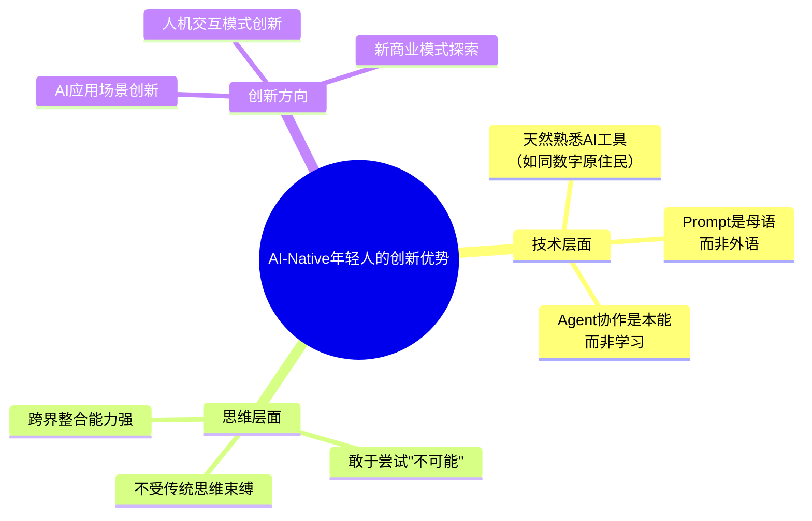

# 第128讲 | 王坚：年轻人永远是创新的主体

> **适用范围**：CTO、技术管理者、团队负责人，以及关注年轻人成长与创新文化建设的所有领导者
>
> **更新摘要（v2 · 2026-08 更新）**：
> - 结构化升级为 6 节骨架（导言 / 核心方法论 / 关键流程 / 工具与实战 / 常见误区 / 进阶延展）
> - 新增 AI-Native 一代（Z 世代 / Alpha 世代）的创新优势分析
> - 补充王坚博士 2018 年观点的 2026 年验证
> - 整合 2050 大会理念与 AI 时代年轻人创新力量的关联
> - 所有 Mermaid 图表添加 title frontmatter 并补充文字解读

## 1. 导言

> 王坚：2050 志愿者，阿里云创始人，阿里巴巴技术委员会主席。

他被媒体和众人称为"忽悠马云的骗子"和"风口上的先知"，但这些都是外人眼中的王坚，我们很好奇，站在这些标签背后的他，到底是什么样子？

作为 2050 的志愿者和发起人，首先想和大家聊聊为什么要做这件事。我觉得现在很多人都在讲创新，但实际上创新是需要很多人帮助的，特别是年轻人。2050 就是为年轻人举办的活动，希望大家对年轻人更加关注，把社会资源留给他们，让他们可以做更多的创新。

### 2050 大会的初衷

如今，绝大部分会议都是为成功人士举办的，而 2050 恰恰是为那些还没有获得成功的年轻人举办的，让他们也能有机会表达自己的观点。除此之外，科技的作用也不能单单以是否有用去定义，年轻人有这样一个使命——让科技可以像音乐和体育一样将人团结在一起，让不同的人因为科技而产生关联。

最"高大上"的就是年轻人，是年轻人本身。

## 2. 核心方法论

### 2.1 年轻人永远是创新的主体

其实，大部分年轻人都不知道自己处于什么状态，因为身在其中。站在我这个年纪回望过去，最大的感触就是自己年轻时得到了太多人的帮助。

我记得我说过一句话：**年轻人就是要做一些大家看起来不可能的事情**。从这个角度讲，任何一个时代的年轻人都一样，唯一不同的是时代本身。但年轻人有一个最大的共同点，就是他们才是帮助整个社会去突破原有框架的群体，**他们永远是创新的主体**。

### 2.2 发现新问题比解决旧问题更重要

我认为大家还是要多多发现问题，而不是简单地去解决别人提出的问题。因为我的兴趣和背景，我永远会去观察有哪些新问题。发现问题后谁来解决呢？我的习惯是自己发现的问题，只要我觉得足够重要，那就应该自己解决。

之前我看到过一个数据，35 岁以下的年轻人占世界总人口的 50%，这个数字是持续增长的，是人类历史的峰值。年轻人会用他们自己的眼光去发现别人看不到的东西。

### 2.3 为年轻人创造空间

我觉得非常幸运的一点就是年轻的时候，身边的人为我创造出足够多的空间，所以我也想为年轻人创造空间。**只要有充足的空间，他们就会用自己的方法去成长**。

大家现在看到年轻人身上有这样那样的问题，是因为他们的空间不够，行动就会受限和变形。要相信他们，不要让他们把事情做变形，这也是我能为他们做的最好的事情了。

### 2.4 AI-Native 一代的创新力量

思维导图展示了 AI-Native 年轻人的三大创新优势：技术层面，他们天然熟悉 AI 工具，Prompt 是他们的"母语"，Agent 协作是本能而非学习；思维层面，他们不受传统思维束缚，敢于尝试"不可能"，跨界整合能力强；创新方向上，他们在 AI 应用场景、人机交互模式和新商业模式三个维度有独特优势。**这些优势使 AI-Native 一代成为 2026 年创新的核心力量**。

## 3. 关键流程

### 3.1 从阿里云到城市大脑：发现新问题的实践

谈到阿里云，有两件事情让我印象深刻：首先，在加入阿里巴巴之前，我就已经意识到数据和计算的重要性了，这二者是一体的。

事实上，在云计算出现以前，我们已经经历过几次计算形态的改变，从大型机到工作站，再到个人电脑。而变化的物质基础就是互联网，这也是我为什么经常谈到，**云计算就是通过互联网来获取的计算**。

为什么我总是用电来举例子呢？就像电刚出来的时候只有电灯泡一样，阿里云的第一批客户都是中小网站，他们无法自行发电。但随着客户逐渐增多，电冰箱出现了，洗碗机也出现了……云计算已经变成了通用计算。

城市大脑也一样，我们都觉得城市交通堵塞，那么普遍的解决办法就是多修路或者限行，从没有人认真想过我们对交通资源的使用是否合理。**发现问题非常重要**，年轻人会用他们自己的眼光去发现别人看不到的东西。

### 3.2 这是最好的时代之一

这是一个非常重要的时代，是属于年轻人的时代。大家认真思考一下，美国最好的时代就是爱迪生诞生前后的三五十年，那时候涌现了很多新的发明。而我们现在看到的绝大部分科学技术就是最近几百年发明创造的，和美国那段时期非常相似，是所有可能性集中爆发的时代。

从电刚开始出现到给城市乃至社会带来翻天覆地的转变，而计算给城市带来的改变还没有开始。

### 3.3 王坚观点的 2026 年验证

| 王坚 2018 年观点 | 2026 年现实 |
|--------------|----------|
| "年轻人永远是创新的主体" | ✅ AI-Native 一代正在引领 AI 应用创新 |
| "发现新问题很重要" | ✅ 年轻人在用 AI 发现未被满足的需求 |
| "给年轻人空间" | ✅ AI 工具降低了创新的门槛和成本 |
| "最好的时代之一" | ✅ AI 带来的可能性爆发期 |

> **核心启示**：在 AI 时代，王坚博士的信念更加成立——**AI-Native 的年轻人拥有前所未有的创新能力，我们要做的就是给他们空间、资源和信任。**

## 4. 工具与实战

### 4.1 AI 时代为年轻人创造空间的新方式

**传统方式**：
- 提供学习资源和导师指导
- 给予试错的空间和包容
- 创造交流和展示的平台（如 2050 大会）

**2026 年新增方式**：
- **提供 AI 工具栈**：降低技术门槛，让年轻人可以快速验证想法
- **开放 AI 平台**：让年轻人可以基于大模型构建创新应用
- **Agent 编排能力**：年轻人可以通过编排 AI Agent 实现复杂的创意
- **开源 AI 生态**：参与开源 AI 项目，积累影响力

### 4.2 年轻人在 AI 时代的创新案例

- **AI 应用场景创新**：年轻人发现成年人看不到的 AI 应用场景（如 AI 心理咨询、AI 学习伙伴）
- **人机交互模式创新**：年轻一代对自然语言交互的接受度更高，创造出新的交互范式
- **新商业模式探索**：利用 AI 降低创业成本，探索微型创业和超级个体模式

## 5. 常见误区

### 5.1 对年轻人创新的常见误解

- **"年轻人缺乏经验"**：在 AI 时代，传统经验的价值在下降，而 AI 工具驾驭能力和创新思维的价值在上升
- **"年轻人不够稳重"**：创新本身就需要打破常规，"不稳重"恰恰是创新的优势
- **"需要先学习再创新"**：AI 降低了学习门槛，年轻人可以在实践中学习，边做边学
- **"年轻人不懂业务"**：AI-Native 一代用 AI 工具理解业务的速度远超预期

### 5.2 管理者的误区

- **过度指导**：给年轻人太多条条框框，反而限制了他们的创造力
- **空间不足**：口头上说"给空间"，实际上事无巨细都要过问
- **用旧标准评价新能力**：用传统技术能力标准评价 AI-Native 年轻人，忽视了他们的 AI 协作优势

## 6. 进阶延展

### 6.1 2050 精神在 AI 时代的延续

王坚博士创办 2050 大会的初衷——为年轻人创造表达和交流的平台——在 AI 时代更加重要。AI 降低了创新的门槛，让更多年轻人可以参与创新，但也带来了新的挑战：

- **信息过载**：年轻人需要在海量 AI 生成内容中保持独立思考
- **工具依赖**：需要在利用 AI 的同时保持核心技术功底
- **价值迷茫**：在 AI 能做很多事情的时代，年轻人需要找到自己独特的价值

### 6.2 核心启示

> **核心启示**：在 AI 时代，王坚博士的信念更加成立——**AI-Native 的年轻人拥有前所未有的创新能力，我们要做的就是给他们空间、资源和信任。**

35 岁以下的年轻人占世界总人口的 50%，这是人类历史的峰值。在 AI 时代，这一群体拥有前所未有的创新工具和可能性。**最好的策略不是教他们怎么做，而是给他们空间让他们自己发现**。

---

*本注解基于 2026 年 6 月生成，致敬王坚博士对年轻人的坚定信心。*
